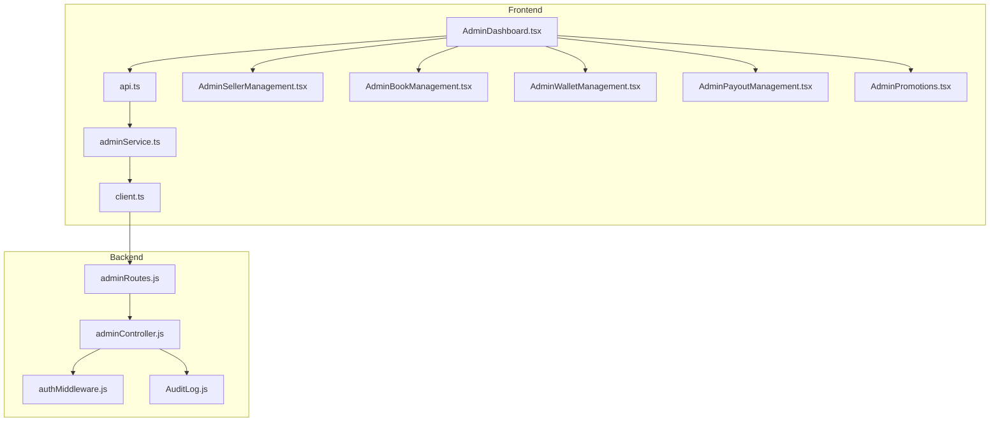
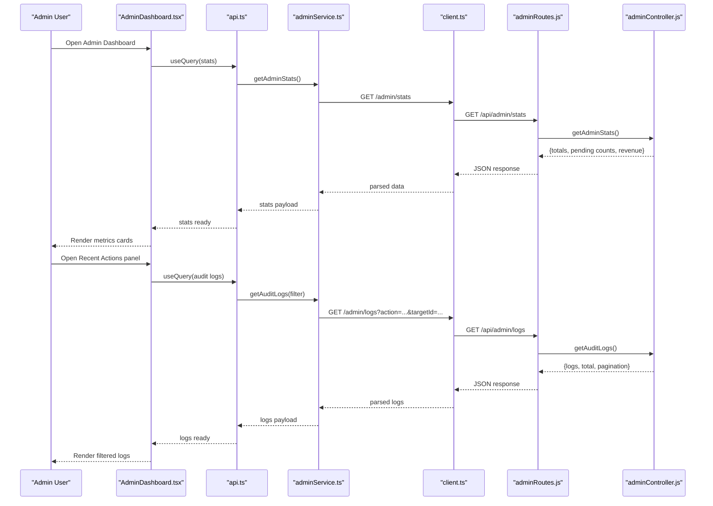
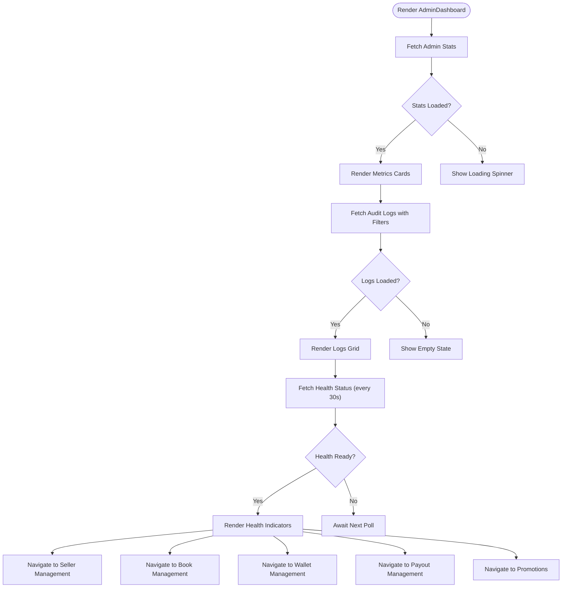
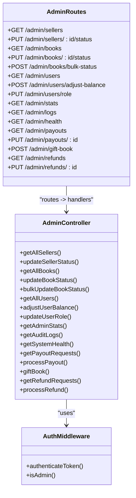
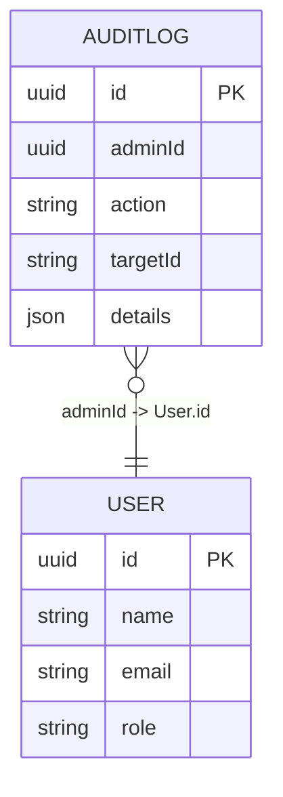
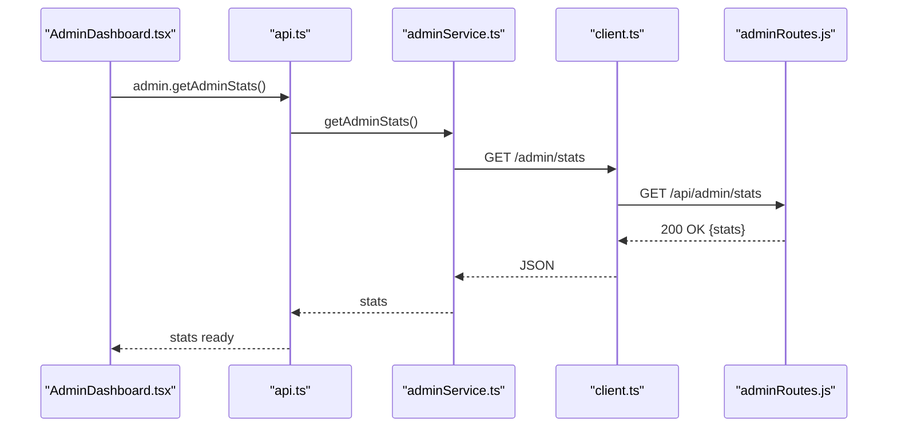
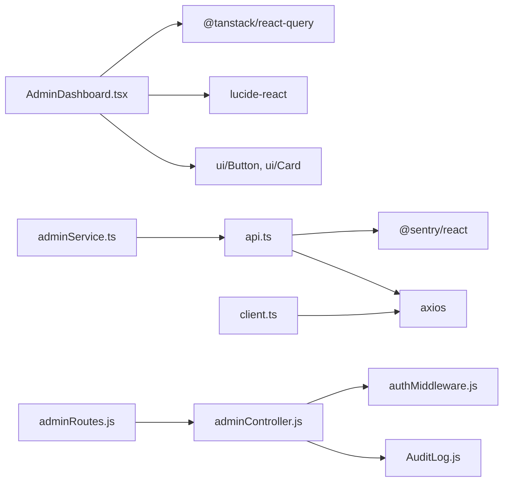

# Admin Dashboard Overview

<cite>
**Referenced Files in This Document**
- [AdminDashboard.tsx](file://frontend/src/pages/AdminDashboard.tsx)
- [adminController.js](file://backend/controllers/adminController.js)
- [adminRoutes.js](file://backend/routes/adminRoutes.js)
- [adminService.ts](file://frontend/src/api/services/adminService.ts)
- [api.ts](file://frontend/src/utils/api.ts)
- [client.ts](file://frontend/src/api/client.ts)
- [AuditLog.js](file://backend/models/AuditLog.js)
- [authMiddleware.js](file://backend/middleware/authMiddleware.js)
- [AdminSellerManagement.tsx](file://frontend/src/pages/AdminSellerManagement.tsx)
- [AdminBookManagement.tsx](file://frontend/src/pages/AdminBookManagement.tsx)
- [AdminWalletManagement.tsx](file://frontend/src/pages/AdminWalletManagement.tsx)
- [AdminPayoutManagement.tsx](file://frontend/src/pages/AdminPayoutManagement.tsx)
- [AdminPromotions.tsx](file://frontend/src/pages/AdminPromotions.tsx)
</cite>

## Table of Contents
1. [Introduction](#introduction)
2. [Project Structure](#project-structure)
3. [Core Components](#core-components)
4. [Architecture Overview](#architecture-overview)
5. [Detailed Component Analysis](#detailed-component-analysis)
6. [Dependency Analysis](#dependency-analysis)
7. [Performance Considerations](#performance-considerations)
8. [Troubleshooting Guide](#troubleshooting-guide)
9. [Conclusion](#conclusion)

## Introduction
This document explains the admin dashboard overview functionality for the QuantumMint bookstore platform. It covers the main dashboard interface that displays system statistics, health monitoring, and quick access to management modules. It also documents the real-time metrics (pending sellers, pending books, platform revenue, active sellers), system health monitoring with service status indicators and latency measurements, and the audit log filtering system for tracking administrative actions. Practical examples demonstrate dashboard navigation, metric interpretation, and system monitoring workflows.

## Project Structure
The admin dashboard is implemented as a React page in the frontend and backed by Express routes and controllers in the backend. The frontend communicates via a centralized API client and typed service wrappers. The backend enforces admin-only access and persists audit logs for all administrative actions.

**Diagram sources**
- [AdminDashboard.tsx:1-311](file://frontend/src/pages/AdminDashboard.tsx#L1-L311)
- [api.ts:440-565](file://frontend/src/utils/api.ts#L440-L565)
- [adminService.ts:1-55](file://frontend/src/api/services/adminService.ts#L1-L55)
- [client.ts:107-119](file://frontend/src/api/client.ts#L107-L119)
- [adminRoutes.js:1-107](file://backend/routes/adminRoutes.js#L1-L107)
- [adminController.js:258-358](file://backend/controllers/adminController.js#L258-L358)
- [authMiddleware.js:1-36](file://backend/middleware/authMiddleware.js#L1-L36)
- [AuditLog.js:1-30](file://backend/models/AuditLog.js#L1-L30)

**Section sources**
- [AdminDashboard.tsx:1-311](file://frontend/src/pages/AdminDashboard.tsx#L1-L311)
- [adminRoutes.js:1-107](file://backend/routes/adminRoutes.js#L1-L107)

## Core Components
- Admin dashboard page: renders system statistics cards, management module quick links, recent audit log entries, and system health indicators.
- Backend admin controller: computes platform statistics, retrieves audit logs, and performs system health checks.
- API layer: centralized fetch wrapper with Sentry integration and typed admin service methods.
- Audit logging: persistent records of administrative actions for compliance and traceability.
- Authentication middleware: ensures only admin users can access admin endpoints.

Key responsibilities:
- Real-time metrics: pending sellers, pending books, platform revenue (USD and SLL), total active sellers.
- System health: operational status and latency measurements for core services.
- Audit log filtering: filter by action type and target ID, paginated results.
- Navigation: quick links to seller verification, content moderation, financial control, payouts, and promotions.

**Section sources**
- [AdminDashboard.tsx:27-311](file://frontend/src/pages/AdminDashboard.tsx#L27-L311)
- [adminController.js:258-358](file://backend/controllers/adminController.js#L258-L358)
- [api.ts:440-565](file://frontend/src/utils/api.ts#L440-L565)
- [AuditLog.js:1-30](file://backend/models/AuditLog.js#L1-L30)
- [authMiddleware.js:27-33](file://backend/middleware/authMiddleware.js#L27-L33)

## Architecture Overview
The admin dashboard follows a clean separation of concerns:
- Frontend React page orchestrates data fetching and rendering.
- Centralized API client handles authentication, correlation IDs, and error reporting.
- Typed admin service exposes domain-specific methods for admin operations.
- Backend routes enforce authentication and authorization, delegate to controllers.
- Controllers compute metrics, query audit logs, and perform health checks.
- Audit logs persist administrative actions for auditing.

**Diagram sources**
- [AdminDashboard.tsx:32-46](file://frontend/src/pages/AdminDashboard.tsx#L32-L46)
- [api.ts:535-542](file://frontend/src/utils/api.ts#L535-L542)
- [adminService.ts:44-46](file://frontend/src/api/services/adminService.ts#L44-L46)
- [client.ts:63-66](file://frontend/src/api/client.ts#L63-L66)
- [adminRoutes.js:58-74](file://backend/routes/adminRoutes.js#L58-L74)
- [adminController.js:304-333](file://backend/controllers/adminController.js#L304-L333)

## Detailed Component Analysis

### Admin Dashboard Page
The dashboard page:
- Fetches and displays four key metrics: pending sellers, pending books, platform revenue (USD and SLL), and total active sellers.
- Provides quick-access cards to management modules: seller verification, content moderation, financial control, payouts, and promotions.
- Renders a recent audit log panel with filtering by action type and target ID.
- Shows system health status and per-service latency indicators, polling every 30 seconds.

**Diagram sources**
- [AdminDashboard.tsx:32-46](file://frontend/src/pages/AdminDashboard.tsx#L32-L46)
- [AdminDashboard.tsx:87-135](file://frontend/src/pages/AdminDashboard.tsx#L87-L135)
- [AdminDashboard.tsx:226-305](file://frontend/src/pages/AdminDashboard.tsx#L226-L305)

**Section sources**
- [AdminDashboard.tsx:27-311](file://frontend/src/pages/AdminDashboard.tsx#L27-L311)

### Backend Admin Controller and Routes
The backend provides:
- Admin stats endpoint computing totals and pending counts, and aggregating platform revenue based on completed purchases and seller commission rates.
- Audit log retrieval with optional filters and pagination.
- System health check validating database connectivity and returning service statuses and latencies.
- Route protection ensuring only authenticated admins can access endpoints.

**Diagram sources**
- [adminController.js:25-78](file://backend/controllers/adminController.js#L25-L78)
- [adminController.js:258-358](file://backend/controllers/adminController.js#L258-L358)
- [adminRoutes.js:1-107](file://backend/routes/adminRoutes.js#L1-L107)
- [authMiddleware.js:1-36](file://backend/middleware/authMiddleware.js#L1-L36)

**Section sources**
- [adminController.js:258-358](file://backend/controllers/adminController.js#L258-L358)
- [adminRoutes.js:58-74](file://backend/routes/adminRoutes.js#L58-L74)
- [authMiddleware.js:27-33](file://backend/middleware/authMiddleware.js#L27-L33)

### Audit Logging Model and Workflows
Administrative actions are recorded in the AuditLog model with fields for admin ID, action type, target ID, and details. Controllers invoke a helper to persist these logs after performing admin operations.

**Diagram sources**
- [AuditLog.js:1-30](file://backend/models/AuditLog.js#L1-L30)
- [adminController.js:8-20](file://backend/controllers/adminController.js#L8-L20)

**Section sources**
- [AuditLog.js:1-30](file://backend/models/AuditLog.js#L1-L30)
- [adminController.js:8-20](file://backend/controllers/adminController.js#L8-L20)

### Frontend API Layer and Service Wrappers
The frontend uses a centralized fetch wrapper that:
- Adds JWT authorization and correlation IDs.
- Integrates with Sentry for error tracking.
- Exposes typed admin service methods for stats, logs, health, and management operations.

**Diagram sources**
- [api.ts:535-542](file://frontend/src/utils/api.ts#L535-L542)
- [adminService.ts:44-46](file://frontend/src/api/services/adminService.ts#L44-L46)
- [client.ts:63-66](file://frontend/src/api/client.ts#L63-L66)
- [adminRoutes.js:58-62](file://backend/routes/adminRoutes.js#L58-L62)

**Section sources**
- [api.ts:17-63](file://frontend/src/utils/api.ts#L17-L63)
- [adminService.ts:41-46](file://frontend/src/api/services/adminService.ts#L41-L46)
- [client.ts:10-87](file://frontend/src/api/client.ts#L10-L87)

### Management Module Navigation
The dashboard provides quick navigation to specialized management pages:
- Seller Verification: review and approve marketplace creator applications.
- Content Moderation: review submitted books and STEM interactive segments.
- Financial Control: manage user wallets and roles.
- Payout Requests: approve or reject creator withdrawal requests.
- Promotions & Gifts: reward users with free books and site-wide gifts.

These pages are reachable from the dashboard cards and support bulk operations and detailed workflows.

**Section sources**
- [AdminDashboard.tsx:144-223](file://frontend/src/pages/AdminDashboard.tsx#L144-L223)
- [AdminSellerManagement.tsx:22-171](file://frontend/src/pages/AdminSellerManagement.tsx#L22-L171)
- [AdminBookManagement.tsx:20-344](file://frontend/src/pages/AdminBookManagement.tsx#L20-L344)
- [AdminWalletManagement.tsx:22-287](file://frontend/src/pages/AdminWalletManagement.tsx#L22-L287)
- [AdminPayoutManagement.tsx:19-169](file://frontend/src/pages/AdminPayoutManagement.tsx#L19-L169)
- [AdminPromotions.tsx:20-247](file://frontend/src/pages/AdminPromotions.tsx#L20-L247)

## Dependency Analysis
The admin dashboard depends on:
- Frontend: React Query for caching and polling, Lucide icons for UI, and Tailwind classes for styling.
- Backend: Sequelize for database operations, JWT middleware for authentication, and route protection.

**Diagram sources**
- [AdminDashboard.tsx:1-26](file://frontend/src/pages/AdminDashboard.tsx#L1-L26)
- [api.ts:1-12](file://frontend/src/utils/api.ts#L1-L12)
- [adminService.ts:1-55](file://frontend/src/api/services/adminService.ts#L1-L55)
- [client.ts:1-87](file://frontend/src/api/client.ts#L1-L87)
- [adminRoutes.js:1-10](file://backend/routes/adminRoutes.js#L1-L10)
- [adminController.js:1-4](file://backend/controllers/adminController.js#L1-L4)
- [authMiddleware.js:1-36](file://backend/middleware/authMiddleware.js#L1-L36)
- [AuditLog.js:1-30](file://backend/models/AuditLog.js#L1-L30)

**Section sources**
- [AdminDashboard.tsx:1-311](file://frontend/src/pages/AdminDashboard.tsx#L1-L311)
- [api.ts:1-770](file://frontend/src/utils/api.ts#L1-L770)
- [adminService.ts:1-55](file://frontend/src/api/services/adminService.ts#L1-L55)
- [client.ts:1-119](file://frontend/src/api/client.ts#L1-L119)
- [adminRoutes.js:1-107](file://backend/routes/adminRoutes.js#L1-L107)
- [adminController.js:1-599](file://backend/controllers/adminController.js#L1-L599)
- [authMiddleware.js:1-36](file://backend/middleware/authMiddleware.js#L1-L36)
- [AuditLog.js:1-30](file://backend/models/AuditLog.js#L1-L30)

## Performance Considerations
- Polling intervals: health status is polled every 30 seconds to keep latency and status indicators fresh without overloading the backend.
- Pagination: audit log retrieval supports limit and offset to avoid large payloads.
- Caching: React Query caches admin stats and logs keyed by filters, reducing redundant network calls.
- Error handling: centralized fetch wrapper captures exceptions and attaches correlation IDs for tracing.

[No sources needed since this section provides general guidance]

## Troubleshooting Guide
Common issues and resolutions:
- Authentication failures: ensure the admin user has a valid JWT token; unauthorized responses trigger automatic logout.
- Network errors: verify API base URL and CORS configuration; the fetch wrapper surfaces network and request errors.
- Audit log queries: use action and targetId filters to narrow results; confirm pagination parameters if results appear truncated.
- Health status degraded: check database connectivity and service endpoints; the health check validates Sequelize authentication.

**Section sources**
- [client.ts:34-46](file://frontend/src/api/client.ts#L34-L46)
- [api.ts:17-63](file://frontend/src/utils/api.ts#L17-L63)
- [adminController.js:338-358](file://backend/controllers/adminController.js#L338-L358)

## Conclusion
The admin dashboard overview provides a comprehensive, real-time view of platform health and key metrics, alongside quick access to critical management modules. The backend ensures secure, auditable administration through protected routes and persistent audit logs. The frontend delivers a responsive, user-friendly interface with filtering and polling for timely insights.