# Administration System

<cite>
**Referenced Files in This Document**
- [admin/server.js](file://admin/server.js)
- [backend/controllers/adminController.js](file://backend/controllers/adminController.js)
- [backend/routes/adminRoutes.js](file://backend/routes/adminRoutes.js)
- [backend/middleware/authMiddleware.js](file://backend/middleware/authMiddleware.js)
- [backend/services/walletService.js](file://backend/services/walletService.js)
- [backend/models/AuditLog.js](file://backend/models/AuditLog.js)
- [backend/models/User.js](file://backend/models/User.js)
- [frontend/src/pages/AdminDashboard.tsx](file://frontend/src/pages/AdminDashboard.tsx)
- [frontend/src/pages/AdminBookManagement.tsx](file://frontend/src/pages/AdminBookManagement.tsx)
- [frontend/src/pages/AdminSellerManagement.tsx](file://frontend/src/pages/AdminSellerManagement.tsx)
- [frontend/src/pages/AdminWalletManagement.tsx](file://frontend/src/pages/AdminWalletManagement.tsx)
- [frontend/src/pages/AdminPayoutManagement.tsx](file://frontend/src/pages/AdminPayoutManagement.tsx)
- [frontend/src/pages/SystemSettings.tsx](file://frontend/src/pages/SystemSettings.tsx)
- [frontend/src/pages/AdminPromotions.tsx](file://frontend/src/pages/AdminPromotions.tsx)
</cite>

## Table of Contents
1. [Introduction](#introduction)
2. [Project Structure](#project-structure)
3. [Core Components](#core-components)
4. [Architecture Overview](#architecture-overview)
5. [Detailed Component Analysis](#detailed-component-analysis)
6. [Dependency Analysis](#dependency-analysis)
7. [Performance Considerations](#performance-considerations)
8. [Troubleshooting Guide](#troubleshooting-guide)
9. [Conclusion](#conclusion)
10. [Appendices](#appendices)

## Introduction
This document describes the administration system that provides platform oversight and management capabilities across the QuantumMint bookstore ecosystem. It covers the admin dashboard, user and seller management, content moderation workflows, financial controls (wallets and payouts), system settings, and monitoring. It also explains role-based access control, bulk operations, and administrative auditing.

## Project Structure
The administration system spans three layers:
- Frontend admin UI pages that orchestrate administrative tasks via API calls
- Backend routes and controllers implementing admin workflows and enforcing RBAC
- Supporting services and models for wallet operations, audit logging, and user roles

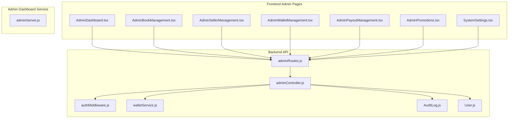

**Diagram sources**
- [frontend/src/pages/AdminDashboard.tsx](file://frontend/src/pages/AdminDashboard.tsx)
- [frontend/src/pages/AdminBookManagement.tsx](file://frontend/src/pages/AdminBookManagement.tsx)
- [frontend/src/pages/AdminSellerManagement.tsx](file://frontend/src/pages/AdminSellerManagement.tsx)
- [frontend/src/pages/AdminWalletManagement.tsx](file://frontend/src/pages/AdminWalletManagement.tsx)
- [frontend/src/pages/AdminPayoutManagement.tsx](file://frontend/src/pages/AdminPayoutManagement.tsx)
- [frontend/src/pages/AdminPromotions.tsx](file://frontend/src/pages/AdminPromotions.tsx)
- [frontend/src/pages/SystemSettings.tsx](file://frontend/src/pages/SystemSettings.tsx)
- [backend/routes/adminRoutes.js](file://backend/routes/adminRoutes.js)
- [backend/controllers/adminController.js](file://backend/controllers/adminController.js)
- [backend/middleware/authMiddleware.js](file://backend/middleware/authMiddleware.js)
- [backend/services/walletService.js](file://backend/services/walletService.js)
- [backend/models/AuditLog.js](file://backend/models/AuditLog.js)
- [backend/models/User.js](file://backend/models/User.js)
- [admin/server.js](file://admin/server.js)

**Section sources**
- [admin/server.js:1-40](file://admin/server.js#L1-L40)
- [backend/routes/adminRoutes.js:1-107](file://backend/routes/adminRoutes.js#L1-L107)
- [backend/controllers/adminController.js:1-599](file://backend/controllers/adminController.js#L1-L599)
- [backend/middleware/authMiddleware.js:1-36](file://backend/middleware/authMiddleware.js#L1-L36)
- [backend/services/walletService.js:1-80](file://backend/services/walletService.js#L1-L80)
- [backend/models/AuditLog.js:1-30](file://backend/models/AuditLog.js#L1-L30)
- [backend/models/User.js:1-50](file://backend/models/User.js#L1-L50)
- [frontend/src/pages/AdminDashboard.tsx:1-311](file://frontend/src/pages/AdminDashboard.tsx#L1-L311)
- [frontend/src/pages/AdminBookManagement.tsx:1-344](file://frontend/src/pages/AdminBookManagement.tsx#L1-L344)
- [frontend/src/pages/AdminSellerManagement.tsx:1-171](file://frontend/src/pages/AdminSellerManagement.tsx#L1-L171)
- [frontend/src/pages/AdminWalletManagement.tsx:1-287](file://frontend/src/pages/AdminWalletManagement.tsx#L1-L287)
- [frontend/src/pages/AdminPayoutManagement.tsx:1-169](file://frontend/src/pages/AdminPayoutManagement.tsx#L1-L169)
- [frontend/src/pages/SystemSettings.tsx:1-245](file://frontend/src/pages/SystemSettings.tsx#L1-L245)
- [frontend/src/pages/AdminPromotions.tsx:1-247](file://frontend/src/pages/AdminPromotions.tsx#L1-L247)

## Core Components
- Admin dashboard: Overview cards, quick navigation, recent audit logs, and system health polling
- Content moderation: Approve/reject books, bulk moderation, and rejection reasons
- Seller management: Approve/reject marketplace creators, set commission rates, revoke access
- Wallet management: Adjust user balances (credits/debits), change user roles
- Payout processing: Approve or reject creator withdrawal requests with rejection reasons
- Promotions: Gift books to individuals or all users
- System settings: Global toggles, payment provider switches, exchange rate, and reset controls
- Audit logging: Centralized admin action logging with filters
- Role-based access control: JWT-based auth plus admin role enforcement

**Section sources**
- [frontend/src/pages/AdminDashboard.tsx:27-311](file://frontend/src/pages/AdminDashboard.tsx#L27-L311)
- [backend/controllers/adminController.js:25-599](file://backend/controllers/adminController.js#L25-L599)
- [backend/routes/adminRoutes.js:10-107](file://backend/routes/adminRoutes.js#L10-L107)
- [backend/middleware/authMiddleware.js:27-33](file://backend/middleware/authMiddleware.js#L27-L33)
- [backend/models/AuditLog.js:4-26](file://backend/models/AuditLog.js#L4-L26)
- [frontend/src/pages/AdminBookManagement.tsx:20-344](file://frontend/src/pages/AdminBookManagement.tsx#L20-L344)
- [frontend/src/pages/AdminSellerManagement.tsx:22-171](file://frontend/src/pages/AdminSellerManagement.tsx#L22-L171)
- [frontend/src/pages/AdminWalletManagement.tsx:22-287](file://frontend/src/pages/AdminWalletManagement.tsx#L22-L287)
- [frontend/src/pages/AdminPayoutManagement.tsx:19-169](file://frontend/src/pages/AdminPayoutManagement.tsx#L19-L169)
- [frontend/src/pages/AdminPromotions.tsx:20-247](file://frontend/src/pages/AdminPromotions.tsx#L20-L247)
- [frontend/src/pages/SystemSettings.tsx:9-245](file://frontend/src/pages/SystemSettings.tsx#L9-L245)

## Architecture Overview
The admin system enforces role-based access control at the route level, delegates business logic to controllers, persists audit trails, and coordinates with wallet services for financial operations.

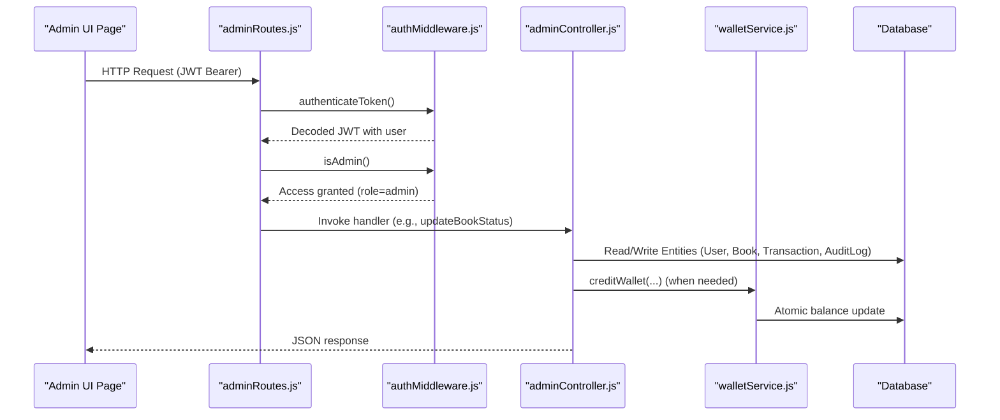

**Diagram sources**
- [backend/routes/adminRoutes.js:7-8](file://backend/routes/adminRoutes.js#L7-L8)
- [backend/middleware/authMiddleware.js:3-25](file://backend/middleware/authMiddleware.js#L3-L25)
- [backend/middleware/authMiddleware.js:27-33](file://backend/middleware/authMiddleware.js#L27-L33)
- [backend/controllers/adminController.js:102-130](file://backend/controllers/adminController.js#L102-L130)
- [backend/services/walletService.js:64-79](file://backend/services/walletService.js#L64-L79)

## Detailed Component Analysis

### Admin Dashboard
- Displays pending seller/book counts, platform revenue, and active sellers
- Provides quick links to management modules
- Shows recent audit log entries with filtering by action and target
- Polls system health every 30 seconds

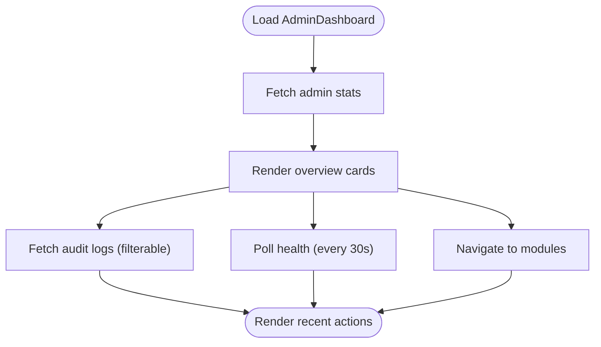

**Diagram sources**
- [frontend/src/pages/AdminDashboard.tsx:32-46](file://frontend/src/pages/AdminDashboard.tsx#L32-L46)
- [frontend/src/pages/AdminDashboard.tsx:144-223](file://frontend/src/pages/AdminDashboard.tsx#L144-L223)
- [frontend/src/pages/AdminDashboard.tsx:257-278](file://frontend/src/pages/AdminDashboard.tsx#L257-L278)

**Section sources**
- [frontend/src/pages/AdminDashboard.tsx:27-311](file://frontend/src/pages/AdminDashboard.tsx#L27-L311)

### Content Moderation Workflow
- Lists books grouped by status (pending/approved/rejected)
- Approve or reject individual books with rejection reasons
- Bulk approve/reject multiple books atomically
- Records audit logs for each moderation action

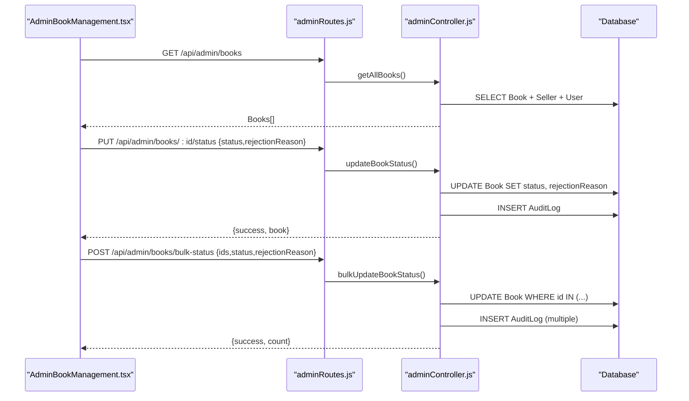

**Diagram sources**
- [backend/routes/adminRoutes.js:22-38](file://backend/routes/adminRoutes.js#L22-L38)
- [backend/controllers/adminController.js:83-161](file://backend/controllers/adminController.js#L83-L161)
- [backend/models/AuditLog.js:4-26](file://backend/models/AuditLog.js#L4-L26)

**Section sources**
- [frontend/src/pages/AdminBookManagement.tsx:20-344](file://frontend/src/pages/AdminBookManagement.tsx#L20-L344)
- [backend/controllers/adminController.js:83-161](file://backend/controllers/adminController.js#L83-L161)
- [backend/routes/adminRoutes.js:22-38](file://backend/routes/adminRoutes.js#L22-L38)

### Seller Management Workflow
- Lists sellers grouped by status (pending/approved/rejected)
- Approve or reject seller applications
- Set commission rates during approval
- Revoking access transitions approved → pending

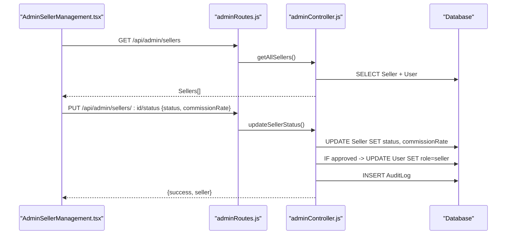

**Diagram sources**
- [backend/routes/adminRoutes.js:10-20](file://backend/routes/adminRoutes.js#L10-L20)
- [backend/controllers/adminController.js:25-78](file://backend/controllers/adminController.js#L25-L78)
- [backend/models/User.js:26-28](file://backend/models/User.js#L26-L28)

**Section sources**
- [frontend/src/pages/AdminSellerManagement.tsx:22-171](file://frontend/src/pages/AdminSellerManagement.tsx#L22-L171)
- [backend/controllers/adminController.js:25-78](file://backend/controllers/adminController.js#L25-L78)
- [backend/routes/adminRoutes.js:10-20](file://backend/routes/adminRoutes.js#L10-L20)

### Wallet Management and User Roles
- Lists users with balances and roles
- Adjusts user wallet balances (credits/debits) with descriptions
- Updates user roles (learner/seller/admin)
- Records audit logs for adjustments and role changes

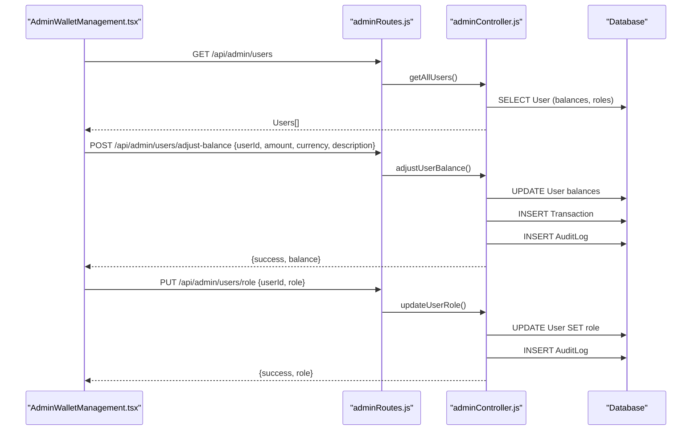

**Diagram sources**
- [backend/routes/adminRoutes.js:40-56](file://backend/routes/adminRoutes.js#L40-L56)
- [backend/controllers/adminController.js:166-256](file://backend/controllers/adminController.js#L166-L256)
- [backend/models/User.js:30-37](file://backend/models/User.js#L30-L37)

**Section sources**
- [frontend/src/pages/AdminWalletManagement.tsx:22-287](file://frontend/src/pages/AdminWalletManagement.tsx#L22-L287)
- [backend/controllers/adminController.js:166-256](file://backend/controllers/adminController.js#L166-L256)
- [backend/routes/adminRoutes.js:40-56](file://backend/routes/adminRoutes.js#L40-L56)

### Payout Processing
- Lists pending withdrawal requests
- Approve or reject payouts
- On rejection, refunds the user’s balance atomically
- Records audit logs for each payout action

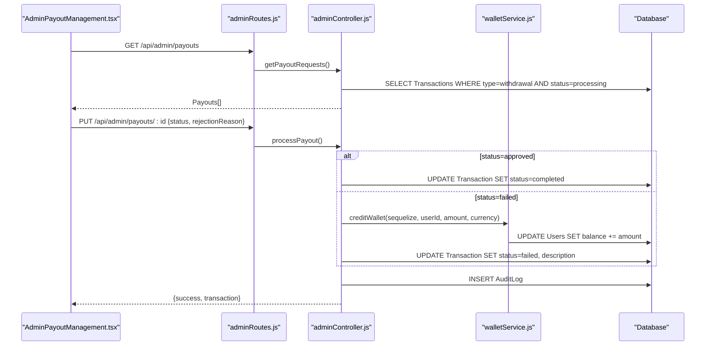

**Diagram sources**
- [backend/routes/adminRoutes.js:76-86](file://backend/routes/adminRoutes.js#L76-L86)
- [backend/controllers/adminController.js:362-425](file://backend/controllers/adminController.js#L362-L425)
- [backend/services/walletService.js:64-79](file://backend/services/walletService.js#L64-L79)

**Section sources**
- [frontend/src/pages/AdminPayoutManagement.tsx:19-169](file://frontend/src/pages/AdminPayoutManagement.tsx#L19-L169)
- [backend/controllers/adminController.js:362-425](file://backend/controllers/adminController.js#L362-L425)
- [backend/routes/adminRoutes.js:76-86](file://backend/routes/adminRoutes.js#L76-L86)

### Promotions and Gifts
- Select recipients (individual/all users)
- Choose an approved book to gift
- Optionally add internal messaging
- Creates purchase records for recipients

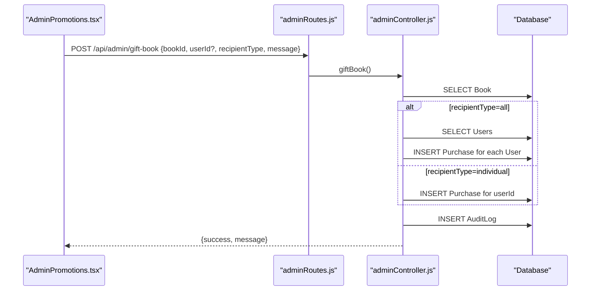

**Diagram sources**
- [backend/routes/adminRoutes.js:88-92](file://backend/routes/adminRoutes.js#L88-L92)
- [backend/controllers/adminController.js:427-479](file://backend/controllers/adminController.js#L427-L479)

**Section sources**
- [frontend/src/pages/AdminPromotions.tsx:20-247](file://frontend/src/pages/AdminPromotions.tsx#L20-L247)
- [backend/controllers/adminController.js:427-479](file://backend/controllers/adminController.js#L427-L479)
- [backend/routes/adminRoutes.js:88-92](file://backend/routes/adminRoutes.js#L88-L92)

### System Settings Management
- General configuration: site name, maintenance mode, registrations
- Financial settings: withdrawal fee %, exchange rate, payment providers
- AI services: default TTS model and feature enablement
- Security/danger zone: reset platform data and cache clearing

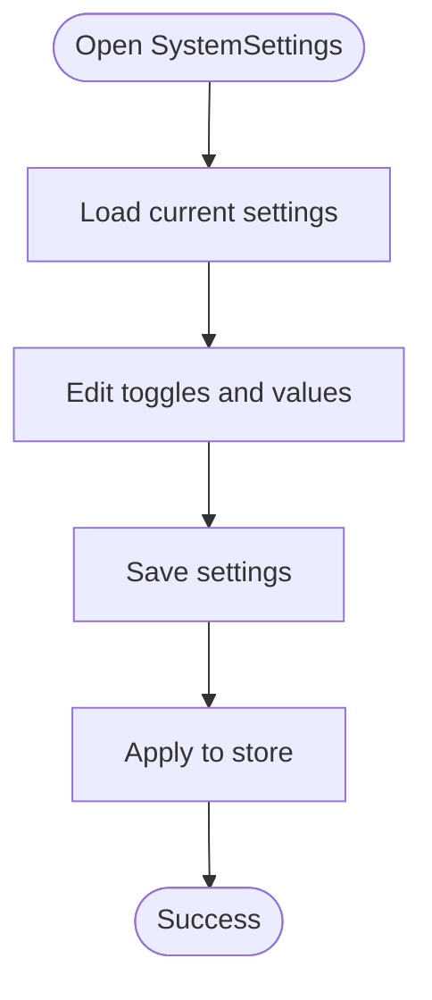

**Diagram sources**
- [frontend/src/pages/SystemSettings.tsx:9-245](file://frontend/src/pages/SystemSettings.tsx#L9-L245)

**Section sources**
- [frontend/src/pages/SystemSettings.tsx:9-245](file://frontend/src/pages/SystemSettings.tsx#L9-L245)

### Role-Based Access Control
- Authentication middleware verifies JWT and attaches user
- Admin middleware checks role=admin before allowing admin routes
- Routes enforce protection at mount time

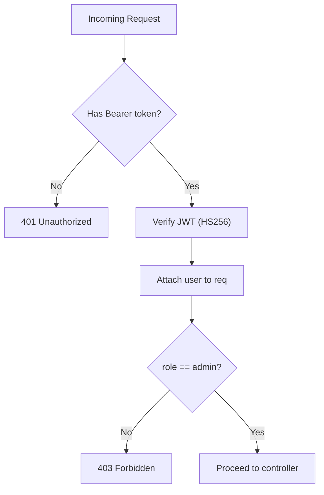

**Diagram sources**
- [backend/middleware/authMiddleware.js:3-33](file://backend/middleware/authMiddleware.js#L3-L33)

**Section sources**
- [backend/middleware/authMiddleware.js:1-36](file://backend/middleware/authMiddleware.js#L1-L36)
- [backend/routes/adminRoutes.js:7-8](file://backend/routes/adminRoutes.js#L7-L8)

### Audit Logging
- Centralized logging of admin actions with action type, target, and details
- Supports filtering by action and targetId
- Used across moderation, wallet, roles, payouts, and promotions

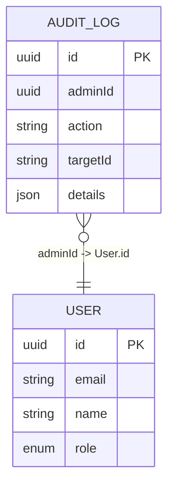

**Diagram sources**
- [backend/models/AuditLog.js:4-26](file://backend/models/AuditLog.js#L4-L26)
- [backend/models/User.js:5-9](file://backend/models/User.js#L5-L9)

**Section sources**
- [backend/controllers/adminController.js:8-20](file://backend/controllers/adminController.js#L8-L20)
- [backend/controllers/adminController.js:307-333](file://backend/controllers/adminController.js#L307-L333)
- [backend/models/AuditLog.js:1-30](file://backend/models/AuditLog.js#L1-L30)

### Wallet Management Internals
- Atomic balance updates via SQL increment to prevent race conditions
- Exchange rate fallback and live rate integration
- Transaction history pagination and filtering

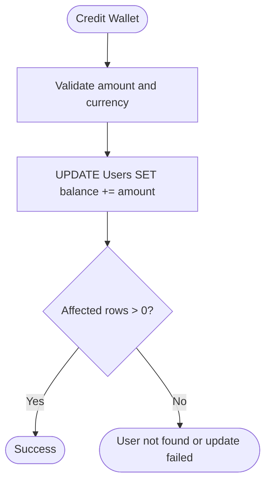

**Diagram sources**
- [backend/services/walletService.js:64-79](file://backend/services/walletService.js#L64-L79)

**Section sources**
- [backend/services/walletService.js:1-80](file://backend/services/walletService.js#L1-L80)

## Dependency Analysis
- Controllers depend on models and services for business logic
- Routes depend on middleware for auth and admin checks
- UI pages depend on API endpoints exposed by admin routes
- Audit logs are a cross-cutting concern used by multiple controllers

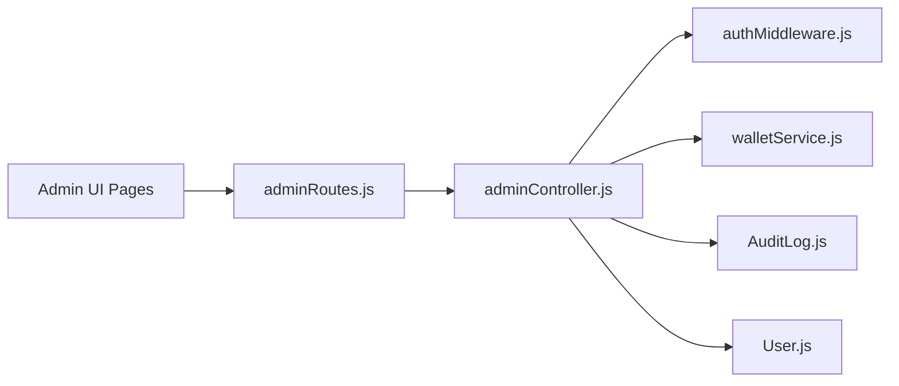

**Diagram sources**
- [backend/routes/adminRoutes.js:1-107](file://backend/routes/adminRoutes.js#L1-L107)
- [backend/controllers/adminController.js:1-599](file://backend/controllers/adminController.js#L1-L599)
- [backend/middleware/authMiddleware.js:1-36](file://backend/middleware/authMiddleware.js#L1-L36)
- [backend/services/walletService.js:1-80](file://backend/services/walletService.js#L1-L80)
- [backend/models/AuditLog.js:1-30](file://backend/models/AuditLog.js#L1-L30)
- [backend/models/User.js:1-50](file://backend/models/User.js#L1-L50)

**Section sources**
- [backend/routes/adminRoutes.js:1-107](file://backend/routes/adminRoutes.js#L1-L107)
- [backend/controllers/adminController.js:1-599](file://backend/controllers/adminController.js#L1-L599)

## Performance Considerations
- Use bulk operations for moderation and promotions to minimize round-trips
- Paginate audit logs and user lists to avoid large payloads
- Debounce search/filter inputs in admin UI to reduce unnecessary queries
- Cache frequently accessed stats (pending counts) on the client side with short TTLs
- Ensure atomic wallet updates to prevent race conditions and maintain consistency

## Troubleshooting Guide
- Authentication failures: Verify JWT presence and HS256 validity; ensure Authorization header format
- Access denied: Confirm user role is admin; check middleware chain
- Audit logs missing: Ensure recordAuditLog is invoked after successful operations
- Payout rejections: Verify user exists and balance update succeeds; confirm transaction status transitions
- Wallet adjustments: Validate amount numeric and currency selection; confirm atomic update succeeded

**Section sources**
- [backend/middleware/authMiddleware.js:3-25](file://backend/middleware/authMiddleware.js#L3-L25)
- [backend/middleware/authMiddleware.js:27-33](file://backend/middleware/authMiddleware.js#L27-L33)
- [backend/controllers/adminController.js:8-20](file://backend/controllers/adminController.js#L8-L20)
- [backend/controllers/adminController.js:394-410](file://backend/controllers/adminController.js#L394-L410)
- [backend/services/walletService.js:64-79](file://backend/services/walletService.js#L64-L79)

## Conclusion
The administration system provides a comprehensive suite of tools for platform oversight, governance, and financial control. It enforces strict RBAC, maintains a complete audit trail, and offers efficient bulk operations for scalable moderation and promotions. The modular design allows administrators to manage content, users, finances, and system settings through a cohesive interface backed by robust backend services.

## Appendices

### Administrative Workflows Examples
- Approve a new seller:
  - Navigate to seller management, select “approve,” optionally set commission rate, save
  - On success, user role upgrades to seller automatically
- Moderate content:
  - Open content moderation, choose pending books, approve or reject with reason
  - Bulk actions supported for efficiency
- Process a payout:
  - Open payouts, approve or reject with optional reason
  - Rejected payouts are refunded atomically to the user’s balance
- Gift books:
  - Choose recipient type, select an approved book, optionally add a message
  - Dispatch gift; recipients receive free purchase records

[No sources needed since this section summarizes workflows without analyzing specific files]