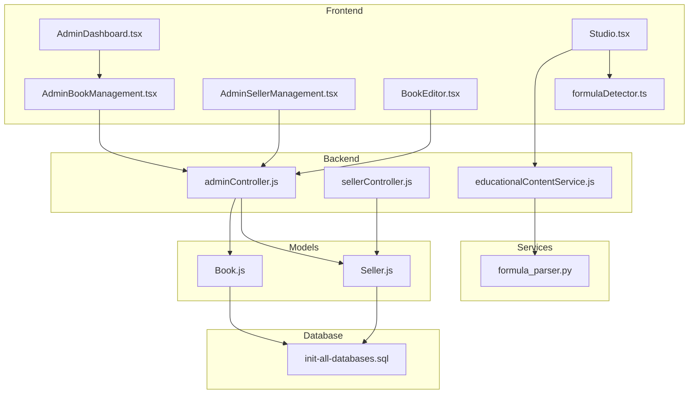
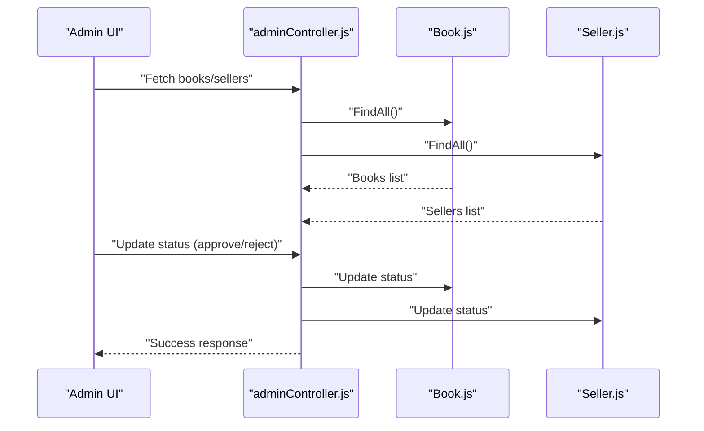
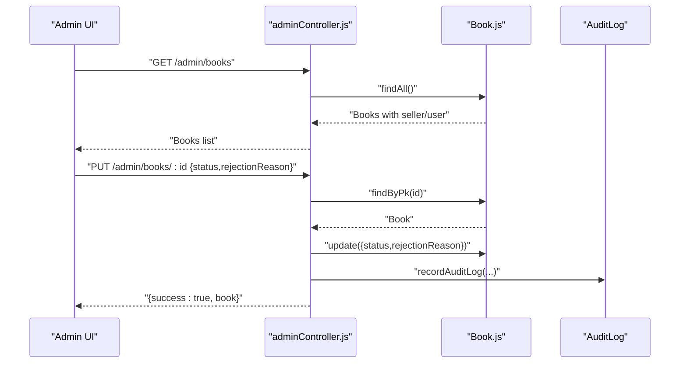
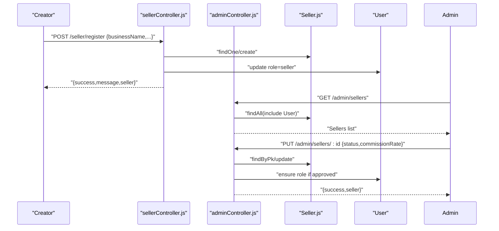
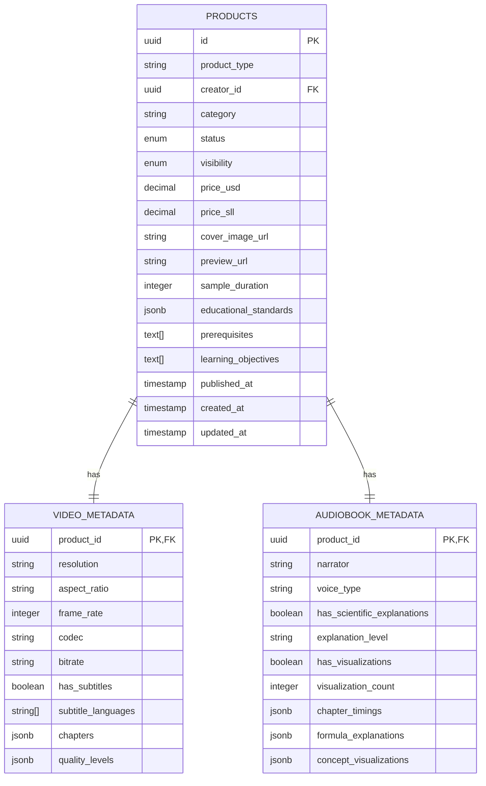
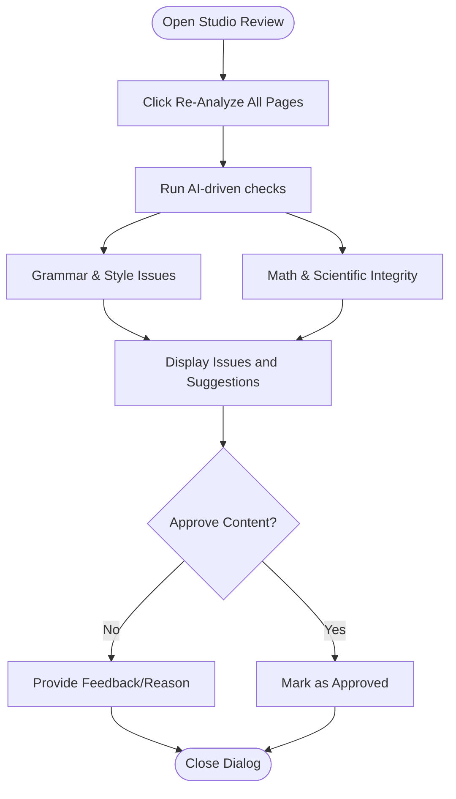
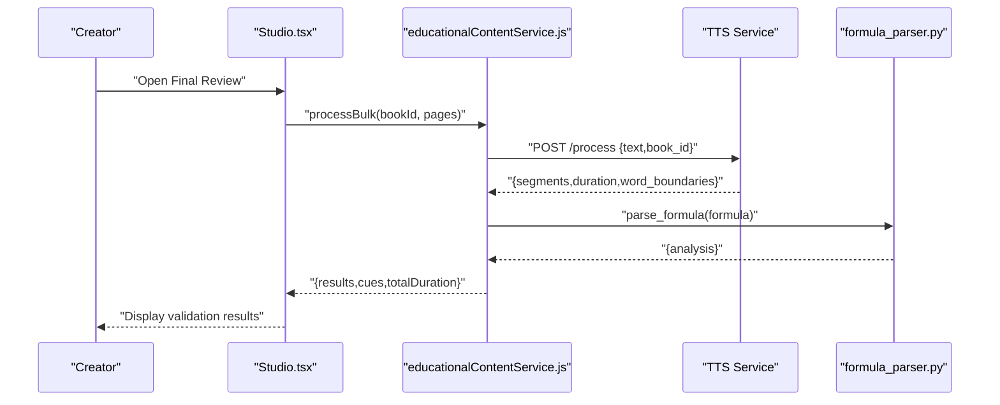
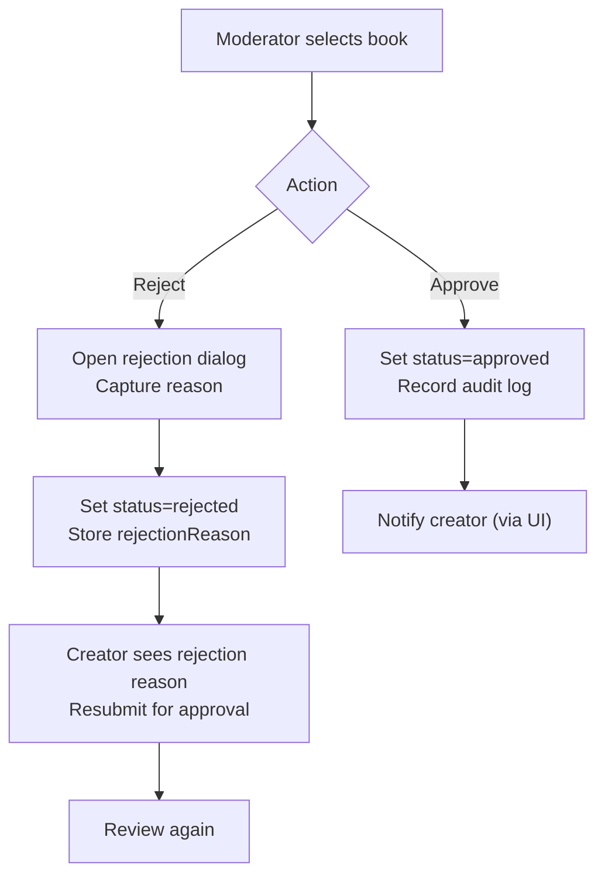
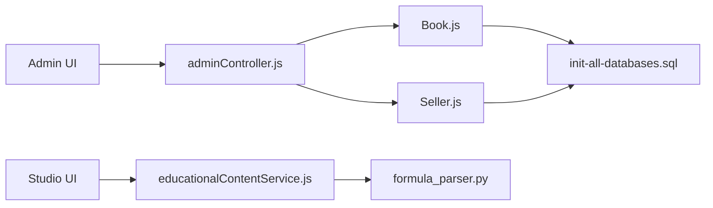

# Content Management and Review

<cite>
**Referenced Files in This Document**
- [AdminBookManagement.tsx](file://frontend/src/pages/AdminBookManagement.tsx)
- [AdminDashboard.tsx](file://frontend/src/pages/AdminDashboard.tsx)
- [AdminSellerManagement.tsx](file://frontend/src/pages/AdminSellerManagement.tsx)
- [BookEditor.tsx](file://frontend/src/pages/BookEditor.tsx)
- [Studio.tsx](file://frontend/src/pages/Studio.tsx)
- [formulaDetector.ts](file://frontend/src/utils/text-analysis/formulaDetector.ts)
- [adminController.js](file://backend/controllers/adminController.js)
- [sellerController.js](file://backend/controllers/sellerController.js)
- [Book.js](file://backend/models/Book.js)
- [Seller.js](file://backend/models/Seller.js)
- [educationalContentService.js](file://backend/services/educationalContentService.js)
- [formula_parser.py](file://services/formula-engine/core/formula_parser.py)
- [init-all-databases.sql](file://database/init-all-databases.sql)
- [FINAL_PLATFORM_SUMMARY.md](file://FINAL_PLATFORM_SUMMARY.md)
</cite>

## Table of Contents
1. [Introduction](#introduction)
2. [Project Structure](#project-structure)
3. [Core Components](#core-components)
4. [Architecture Overview](#architecture-overview)
5. [Detailed Component Analysis](#detailed-component-analysis)
6. [Dependency Analysis](#dependency-analysis)
7. [Performance Considerations](#performance-considerations)
8. [Troubleshooting Guide](#troubleshooting-guide)
9. [Conclusion](#conclusion)
10. [Appendices](#appendices)

## Introduction
This document describes the content management and review systems for the QuantumMint Bookstore educational platform. It covers the book approval workflow, content quality standards, editorial review processes, seller verification and marketplace onboarding, marketplace approval workflows, content categorization and metadata validation, quality assurance checks, STEM content review processes including formula validation and educational standards, and examples of moderation procedures, approvals, and quality control measures.

## Project Structure
The content management and review system spans frontend pages and components, backend controllers and services, database models and schema, and specialized STEM processing services.

**Diagram sources**
- [AdminBookManagement.tsx:106-120](file://frontend/src/pages/AdminBookManagement.tsx#L106-L120)
- [AdminDashboard.tsx:154-172](file://frontend/src/pages/AdminDashboard.tsx#L154-L172)
- [AdminSellerManagement.tsx:44-72](file://frontend/src/pages/AdminSellerManagement.tsx#L44-L72)
- [BookEditor.tsx:172-196](file://frontend/src/pages/BookEditor.tsx#L172-L196)
- [Studio.tsx:557-718](file://frontend/src/pages/Studio.tsx#L557-L718)
- [formulaDetector.ts:1-11](file://frontend/src/utils/text-analysis/formulaDetector.ts#L1-L11)
- [adminController.js:1-599](file://backend/controllers/adminController.js#L1-L599)
- [sellerController.js:1-211](file://backend/controllers/sellerController.js#L1-L211)
- [educationalContentService.js:1-181](file://backend/services/educationalContentService.js#L1-L181)
- [Book.js:1-92](file://backend/models/Book.js#L1-L92)
- [Seller.js:1-30](file://backend/models/Seller.js#L1-L30)
- [init-all-databases.sql:78-159](file://database/init-all-databases.sql#L78-L159)
- [formula_parser.py:1-133](file://services/formula-engine/core/formula_parser.py#L1-L133)

**Section sources**
- [AdminBookManagement.tsx:106-120](file://frontend/src/pages/AdminBookManagement.tsx#L106-L120)
- [AdminDashboard.tsx:154-172](file://frontend/src/pages/AdminDashboard.tsx#L154-L172)
- [AdminSellerManagement.tsx:44-72](file://frontend/src/pages/AdminSellerManagement.tsx#L44-L72)
- [BookEditor.tsx:172-196](file://frontend/src/pages/BookEditor.tsx#L172-L196)
- [Studio.tsx:557-718](file://frontend/src/pages/Studio.tsx#L557-L718)
- [formulaDetector.ts:1-11](file://frontend/src/utils/text-analysis/formulaDetector.ts#L1-L11)
- [adminController.js:1-599](file://backend/controllers/adminController.js#L1-L599)
- [sellerController.js:1-211](file://backend/controllers/sellerController.js#L1-L211)
- [Book.js:1-92](file://backend/models/Book.js#L1-L92)
- [Seller.js:1-30](file://backend/models/Seller.js#L1-L30)
- [init-all-databases.sql:78-159](file://database/init-all-databases.sql#L78-L159)
- [educationalContentService.js:1-181](file://backend/services/educationalContentService.js#L1-L181)
- [formula_parser.py:1-133](file://services/formula-engine/core/formula_parser.py#L1-L133)

## Core Components
- Administrative moderation and marketplace oversight via dedicated admin pages and controller actions.
- Seller onboarding and verification workflows integrated with user roles and commission rates.
- Educational content processing pipeline for STEM materials including formula detection, narration segmentation, and cue generation.
- STEM formula validation and explanation generation powered by a Python-based parser.
- Content categorization and metadata validation aligned with educational standards and product types.

**Section sources**
- [AdminBookManagement.tsx:264-311](file://frontend/src/pages/AdminBookManagement.tsx#L264-L311)
- [AdminSellerManagement.tsx:44-72](file://frontend/src/pages/AdminSellerManagement.tsx#L44-L72)
- [adminController.js:25-161](file://backend/controllers/adminController.js#L25-L161)
- [sellerController.js:7-50](file://backend/controllers/sellerController.js#L7-L50)
- [educationalContentService.js:15-120](file://backend/services/educationalContentService.js#L15-L120)
- [formula_parser.py:10-133](file://services/formula-engine/core/formula_parser.py#L10-L133)
- [Book.js:40-87](file://backend/models/Book.js#L40-L87)
- [init-all-databases.sql:78-159](file://database/init-all-databases.sql#L78-L159)

## Architecture Overview
The system integrates frontend moderation dashboards with backend controllers and services, and leverages specialized STEM processing capabilities.

**Diagram sources**
- [AdminBookManagement.tsx:83-97](file://frontend/src/pages/AdminBookManagement.tsx#L83-L97)
- [AdminSellerManagement.tsx:44-72](file://frontend/src/pages/AdminSellerManagement.tsx#L44-L72)
- [adminController.js:25-161](file://backend/controllers/adminController.js#L25-L161)
- [Book.js:1-92](file://backend/models/Book.js#L1-L92)
- [Seller.js:1-30](file://backend/models/Seller.js#L1-L30)

**Section sources**
- [AdminBookManagement.tsx:83-97](file://frontend/src/pages/AdminBookManagement.tsx#L83-L97)
- [AdminSellerManagement.tsx:44-72](file://frontend/src/pages/AdminSellerManagement.tsx#L44-L72)
- [adminController.js:25-161](file://backend/controllers/adminController.js#L25-L161)
- [Book.js:1-92](file://backend/models/Book.js#L1-L92)
- [Seller.js:1-30](file://backend/models/Seller.js#L1-L30)

## Detailed Component Analysis

### Administrative Moderation and Approval Workflow
- Admin dashboard provides navigation to content moderation and seller verification.
- Moderation page lists books with status controls and bulk actions.
- Approval/rejection actions update statuses and record audit logs.
- Rejection reasons are captured and associated with content.

**Diagram sources**
- [AdminBookManagement.tsx:83-130](file://frontend/src/pages/AdminBookManagement.tsx#L83-L130)
- [adminController.js:83-161](file://backend/controllers/adminController.js#L83-L161)
- [Book.js:1-92](file://backend/models/Book.js#L1-L92)

**Section sources**
- [AdminDashboard.tsx:154-172](file://frontend/src/pages/AdminDashboard.tsx#L154-L172)
- [AdminBookManagement.tsx:264-311](file://frontend/src/pages/AdminBookManagement.tsx#L264-L311)
- [adminController.js:102-130](file://backend/controllers/adminController.js#L102-L130)

### Seller Verification and Marketplace Onboarding
- Sellers submit applications; status defaults to pending.
- Admin approves/rejects sellers; approved sellers receive seller role.
- Commission rates are configurable per seller.
- Dashboard displays verification and approval workflows.

**Diagram sources**
- [sellerController.js:7-50](file://backend/controllers/sellerController.js#L7-L50)
- [adminController.js:25-78](file://backend/controllers/adminController.js#L25-L78)
- [Seller.js:1-30](file://backend/models/Seller.js#L1-L30)

**Section sources**
- [sellerController.js:7-50](file://backend/controllers/sellerController.js#L7-L50)
- [adminController.js:41-78](file://backend/controllers/adminController.js#L41-L78)
- [AdminSellerManagement.tsx:44-72](file://frontend/src/pages/AdminSellerManagement.tsx#L44-L72)

### Content Categorization and Metadata Validation
- Products support categorization, educational level, STEM flags, and media metadata.
- Database schema defines product types, statuses, visibility, and indexes for efficient queries.
- Metadata includes cover image, preview, durations, and STEM-specific fields.

**Diagram sources**
- [init-all-databases.sql:78-159](file://database/init-all-databases.sql#L78-L159)

**Section sources**
- [Book.js:40-87](file://backend/models/Book.js#L40-L87)
- [init-all-databases.sql:78-159](file://database/init-all-databases.sql#L78-L159)

### Quality Assurance Checks and Final Review
- Creator studio provides a “Final Quality Review” tab with grammar/style checks and STEM integrity panels.
- AI-driven analysis can be triggered to re-analyze pages.
- The frontend components expose viewers for grammar, math, and science issues.

**Diagram sources**
- [Studio.tsx:557-718](file://frontend/src/pages/Studio.tsx#L557-L718)

**Section sources**
- [Studio.tsx:557-718](file://frontend/src/pages/Studio.tsx#L557-L718)

### STEM Content Review, Formula Validation, and Educational Standards
- Educational content service orchestrates TTS segmentation, formula detection, and cue generation.
- Frontend formula detector identifies inline math expressions for validation.
- Python formula parser cleans LaTeX, parses expressions, classifies types, and generates spoken explanations and complexity scores.
- Educational content service ensures quizzes meet minimum question counts and aligns with curriculum levels.

**Diagram sources**
- [Studio.tsx:557-718](file://frontend/src/pages/Studio.tsx#L557-L718)
- [educationalContentService.js:15-120](file://backend/services/educationalContentService.js#L15-L120)
- [formula_parser.py:10-133](file://services/formula-engine/core/formula_parser.py#L10-L133)
- [formulaDetector.ts:1-11](file://frontend/src/utils/text-analysis/formulaDetector.ts#L1-L11)

**Section sources**
- [educationalContentService.js:15-120](file://backend/services/educationalContentService.js#L15-L120)
- [formula_parser.py:10-133](file://services/formula-engine/core/formula_parser.py#L10-L133)
- [formulaDetector.ts:1-11](file://frontend/src/utils/text-analysis/formulaDetector.ts#L1-L11)

### Content Moderation Procedures and Examples
- Approve content: Update book status to approved; ensure audit log recorded.
- Reject content: Capture rejection reason; update status and clear reason when re-submitted.
- Bulk moderation: Admin can approve/reject multiple items efficiently.
- Example moderation steps:
  - Navigate to Content Moderation from Admin Dashboard.
  - Select a book; click Approve or open Reject dialog to provide feedback.
  - After rejection, creators can resubmit for approval.

**Diagram sources**
- [AdminDashboard.tsx:154-172](file://frontend/src/pages/AdminDashboard.tsx#L154-L172)
- [AdminBookManagement.tsx:264-311](file://frontend/src/pages/AdminBookManagement.tsx#L264-L311)
- [BookEditor.tsx:172-196](file://frontend/src/pages/BookEditor.tsx#L172-L196)
- [adminController.js:102-130](file://backend/controllers/adminController.js#L102-L130)

**Section sources**
- [AdminDashboard.tsx:154-172](file://frontend/src/pages/AdminDashboard.tsx#L154-L172)
- [AdminBookManagement.tsx:264-311](file://frontend/src/pages/AdminBookManagement.tsx#L264-L311)
- [BookEditor.tsx:172-196](file://frontend/src/pages/BookEditor.tsx#L172-L196)
- [adminController.js:102-130](file://backend/controllers/adminController.js#L102-L130)

## Dependency Analysis
The system exhibits clear separation of concerns:
- Frontend pages orchestrate user actions and present moderation and review UIs.
- Backend controllers mediate between frontend and models, enforcing business rules and audit logging.
- Models define domain entities and associations; database schema enforces constraints and indexes.
- Services encapsulate STEM processing and external integrations.

**Diagram sources**
- [adminController.js:1-599](file://backend/controllers/adminController.js#L1-L599)
- [educationalContentService.js:1-181](file://backend/services/educationalContentService.js#L1-L181)
- [Book.js:1-92](file://backend/models/Book.js#L1-L92)
- [Seller.js:1-30](file://backend/models/Seller.js#L1-L30)
- [init-all-databases.sql:78-159](file://database/init-all-databases.sql#L78-L159)
- [formula_parser.py:1-133](file://services/formula-engine/core/formula_parser.py#L1-L133)

**Section sources**
- [adminController.js:1-599](file://backend/controllers/adminController.js#L1-L599)
- [educationalContentService.js:1-181](file://backend/services/educationalContentService.js#L1-L181)
- [Book.js:1-92](file://backend/models/Book.js#L1-L92)
- [Seller.js:1-30](file://backend/models/Seller.js#L1-L30)
- [init-all-databases.sql:78-159](file://database/init-all-databases.sql#L78-L159)
- [formula_parser.py:1-133](file://services/formula-engine/core/formula_parser.py#L1-L133)

## Performance Considerations
- Batch processing: Educational content service processes pages in small batches to avoid overload.
- Indexes: Database schema includes strategic indexes on product_type, category, status, and timestamps to optimize moderation queries.
- Asynchronous processing: STEM processing relies on external services; ensure timeouts and retries are configured appropriately.
- Audit logging: Logging is performed per action; consider batching logs for high-volume moderation.

[No sources needed since this section provides general guidance]

## Troubleshooting Guide
- Rejection reason missing: Ensure rejectionReason is provided when rejecting content; otherwise, the field is cleared on approval.
- Bulk actions: Verify IDs array is non-empty and properly formatted before invoking bulk update.
- Seller role not updating: On approval, ensure user role is updated to seller; confirm user exists and is not admin.
- Formula parsing errors: If LaTeX is malformed, the parser returns an error; clean input or provide fallback explanations.
- Quiz generation fallback: If AI service fails, a fallback set of questions is returned; verify minimum count requirements.

**Section sources**
- [adminController.js:102-161](file://backend/controllers/adminController.js#L102-L161)
- [adminController.js:41-78](file://backend/controllers/adminController.js#L41-L78)
- [educationalContentService.js:126-177](file://backend/services/educationalContentService.js#L126-L177)
- [formula_parser.py:32-37](file://services/formula-engine/core/formula_parser.py#L32-L37)

## Conclusion
The content management and review system combines robust administrative moderation, seller onboarding, and quality assurance with specialized STEM processing. The workflows emphasize transparency via audit logs, scalability through batch processing, and educational alignment through metadata and standards. The integration of formula validation and AI-driven checks supports high-quality, accessible educational content.

[No sources needed since this section summarizes without analyzing specific files]

## Appendices

### Content Quality Standards and Educational Content Alignment
- Educational standards and learning objectives are stored as structured metadata.
- Content categorization and education level help align offerings with curricula.
- STEM-specific metadata enables targeted processing and accessibility features.

**Section sources**
- [init-all-databases.sql:78-159](file://database/init-all-databases.sql#L78-L159)

### Marketplace Approval Workflows
- Sellers progress through pending → approved/rejected states.
- Commission rates are configurable per seller.
- Verified sellers gain seller role and can publish content.

**Section sources**
- [Seller.js:1-30](file://backend/models/Seller.js#L1-L30)
- [adminController.js:41-78](file://backend/controllers/adminController.js#L41-L78)
- [sellerController.js:7-50](file://backend/controllers/sellerController.js#L7-L50)

### Integration Points and Platform Overview
- Educational content integration includes publisher portal, quality assurance, media processing, metadata management, and rights management.
- Payment provider integrations include local and international processors.

**Section sources**
- [FINAL_PLATFORM_SUMMARY.md:132-166](file://FINAL_PLATFORM_SUMMARY.md#L132-L166)