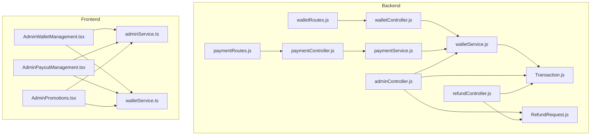
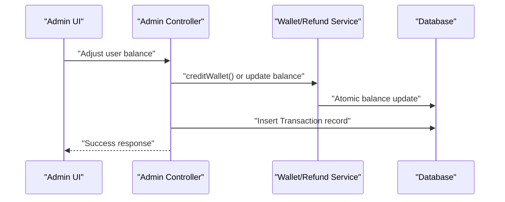
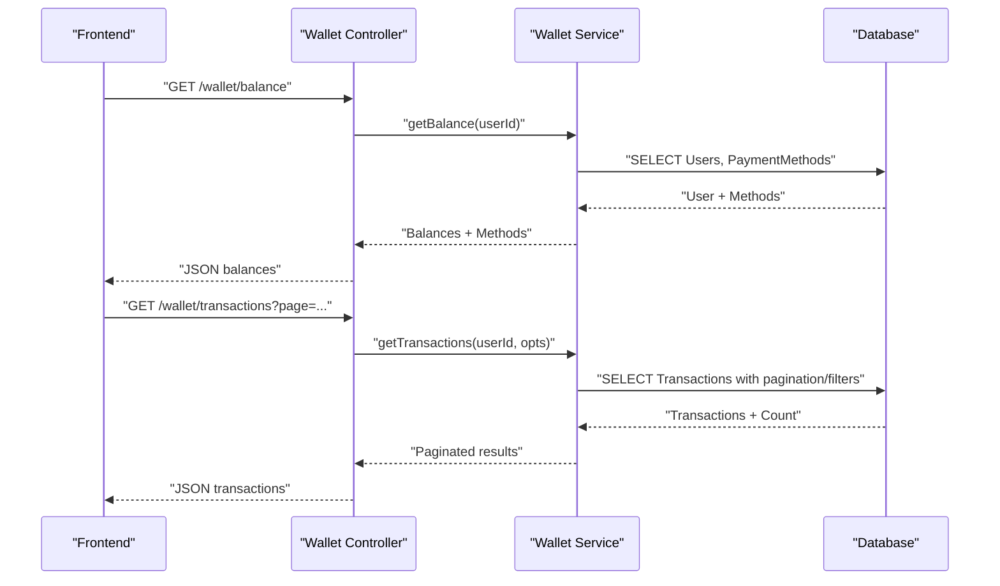
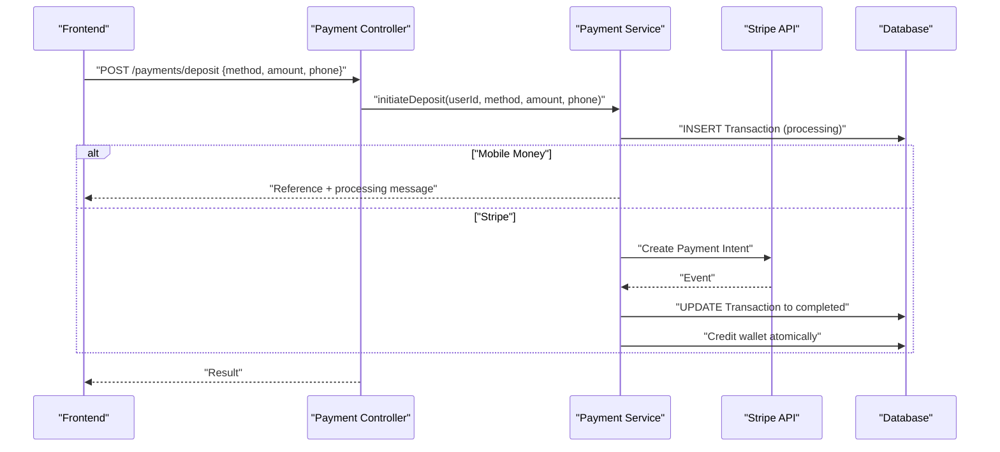
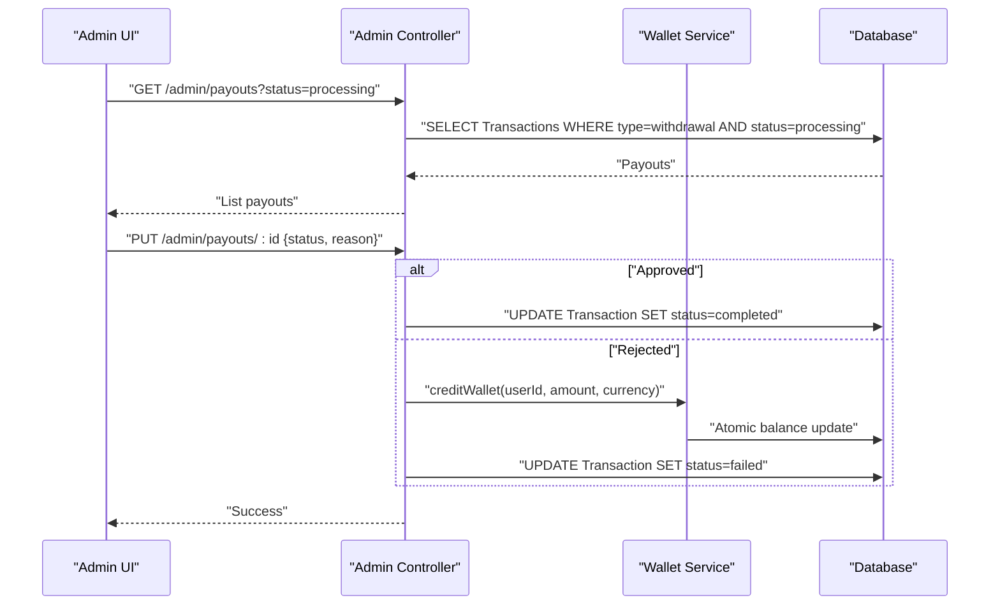
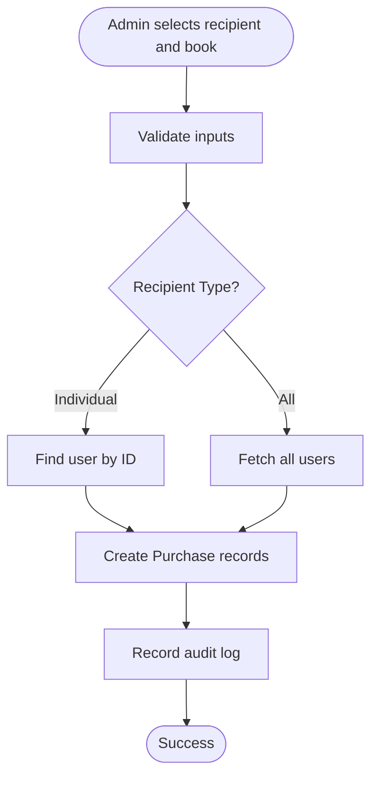
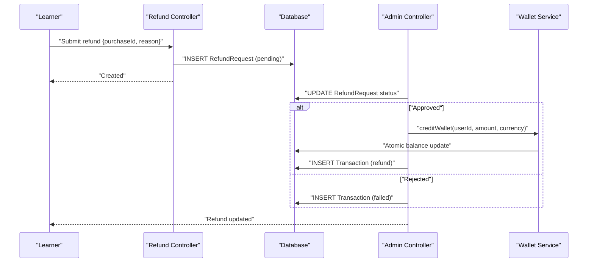
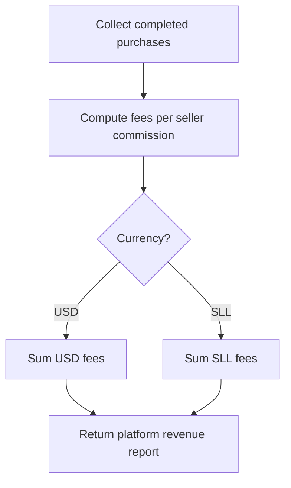
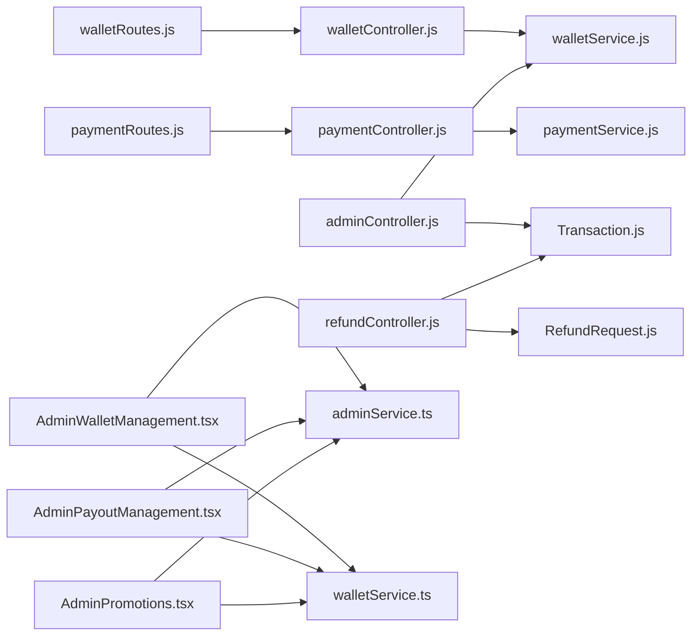

# Financial System Control

<cite>
**Referenced Files in This Document**
- [backend/controllers/walletController.js](file://backend/controllers/walletController.js)
- [backend/services/walletService.js](file://backend/services/walletService.js)
- [backend/routes/walletRoutes.js](file://backend/routes/walletRoutes.js)
- [backend/models/Transaction.js](file://backend/models/Transaction.js)
- [backend/controllers/paymentController.js](file://backend/controllers/paymentController.js)
- [backend/routes/paymentRoutes.js](file://backend/routes/paymentRoutes.js)
- [backend/services/paymentService.js](file://backend/services/paymentService.js)
- [backend/controllers/adminController.js](file://backend/controllers/adminController.js)
- [backend/controllers/refundController.js](file://backend/controllers/refundController.js)
- [backend/models/RefundRequest.js](file://backend/models/RefundRequest.js)
- [frontend/src/pages/AdminWalletManagement.tsx](file://frontend/src/pages/AdminWalletManagement.tsx)
- [frontend/src/pages/AdminPayoutManagement.tsx](file://frontend/src/pages/AdminPayoutManagement.tsx)
- [frontend/src/pages/AdminPromotions.tsx](file://frontend/src/pages/AdminPromotions.tsx)
- [frontend/src/api/services/adminService.ts](file://frontend/src/api/services/adminService.ts)
- [frontend/src/api/services/walletService.ts](file://frontend/src/api/services/walletService.ts)
</cite>

## Table of Contents
1. [Introduction](#introduction)
2. [Project Structure](#project-structure)
3. [Core Components](#core-components)
4. [Architecture Overview](#architecture-overview)
5. [Detailed Component Analysis](#detailed-component-analysis)
6. [Dependency Analysis](#dependency-analysis)
7. [Performance Considerations](#performance-considerations)
8. [Troubleshooting Guide](#troubleshooting-guide)
9. [Conclusion](#conclusion)
10. [Appendices](#appendices)

## Introduction
This document describes the financial system control and oversight for the platform. It covers wallet management for platform financial control, commission adjustments, and revenue distribution; the payout request processing system and creator withdrawal approvals; financial reporting capabilities; the promotion and gift system for user rewards and marketing campaigns; fee management and revenue tracking; and financial compliance features. It also provides examples of financial workflows, payout procedures, and promotional campaign management.

## Project Structure
The financial system spans backend controllers, services, models, and frontend pages. Controllers expose REST endpoints; services encapsulate business logic; models define data structures; frontend pages provide admin dashboards for financial operations.

**Diagram sources**
- [backend/controllers/walletController.js:1-17](file://backend/controllers/walletController.js#L1-L17)
- [backend/services/walletService.js:1-80](file://backend/services/walletService.js#L1-L80)
- [backend/routes/walletRoutes.js:1-11](file://backend/routes/walletRoutes.js#L1-L11)
- [backend/controllers/paymentController.js:1-99](file://backend/controllers/paymentController.js#L1-L99)
- [backend/services/paymentService.js:1-234](file://backend/services/paymentService.js#L1-L234)
- [backend/routes/paymentRoutes.js:1-22](file://backend/routes/paymentRoutes.js#L1-L22)
- [backend/controllers/adminController.js:1-599](file://backend/controllers/adminController.js#L1-L599)
- [backend/controllers/refundController.js:1-145](file://backend/controllers/refundController.js#L1-L145)
- [backend/models/Transaction.js:1-54](file://backend/models/Transaction.js#L1-L54)
- [backend/models/RefundRequest.js:1-42](file://backend/models/RefundRequest.js#L1-L42)
- [frontend/src/pages/AdminWalletManagement.tsx:1-287](file://frontend/src/pages/AdminWalletManagement.tsx#L1-L287)
- [frontend/src/pages/AdminPayoutManagement.tsx:1-169](file://frontend/src/pages/AdminPayoutManagement.tsx#L1-L169)
- [frontend/src/pages/AdminPromotions.tsx:1-247](file://frontend/src/pages/AdminPromotions.tsx#L1-L247)
- [frontend/src/api/services/adminService.ts:1-55](file://frontend/src/api/services/adminService.ts#L1-L55)
- [frontend/src/api/services/walletService.ts:1-53](file://frontend/src/api/services/walletService.ts#L1-L53)

**Section sources**
- [backend/controllers/walletController.js:1-17](file://backend/controllers/walletController.js#L1-L17)
- [backend/services/walletService.js:1-80](file://backend/services/walletService.js#L1-L80)
- [backend/routes/walletRoutes.js:1-11](file://backend/routes/walletRoutes.js#L1-L11)
- [backend/controllers/paymentController.js:1-99](file://backend/controllers/paymentController.js#L1-L99)
- [backend/services/paymentService.js:1-234](file://backend/services/paymentService.js#L1-L234)
- [backend/routes/paymentRoutes.js:1-22](file://backend/routes/paymentRoutes.js#L1-L22)
- [backend/controllers/adminController.js:1-599](file://backend/controllers/adminController.js#L1-L599)
- [backend/controllers/refundController.js:1-145](file://backend/controllers/refundController.js#L1-L145)
- [backend/models/Transaction.js:1-54](file://backend/models/Transaction.js#L1-L54)
- [backend/models/RefundRequest.js:1-42](file://backend/models/RefundRequest.js#L1-L42)
- [frontend/src/pages/AdminWalletManagement.tsx:1-287](file://frontend/src/pages/AdminWalletManagement.tsx#L1-L287)
- [frontend/src/pages/AdminPayoutManagement.tsx:1-169](file://frontend/src/pages/AdminPayoutManagement.tsx#L1-L169)
- [frontend/src/pages/AdminPromotions.tsx:1-247](file://frontend/src/pages/AdminPromotions.tsx#L1-L247)
- [frontend/src/api/services/adminService.ts:1-55](file://frontend/src/api/services/adminService.ts#L1-L55)
- [frontend/src/api/services/walletService.ts:1-53](file://frontend/src/api/services/walletService.ts#L1-L53)

## Core Components
- Wallet Management
  - Backend: wallet controller and service expose balance and transaction history; atomic credit operations; exchange rate integration.
  - Frontend: admin dashboard to view users and adjust balances; learner-facing wallet operations via API.
- Payment System
  - Backend: payment controller and service support four payment methods (Orange Money, Afrimoney, Qmoney, Stripe), initiate deposits/withdrawals, and process webhooks.
  - Frontend: payment UI integrates with backend APIs for deposits and Stripe Connect.
- Payout Request Processing
  - Backend: admin endpoints to list and process creator withdrawal requests; updates transaction status and refunds if rejected.
  - Frontend: admin dashboard to approve/reject payouts with rejection reasons.
- Promotion and Gift System
  - Backend: admin endpoints to gift books to individuals or all users; records audit logs.
  - Frontend: admin dashboard to select recipients, books, and dispatch gifts.
- Refund System
  - Backend: learner submits refund requests; admin approves/rejects with atomic wallet crediting; maintains audit logs.
- Reporting and Compliance
  - Backend: admin stats endpoint aggregates platform revenue; audit logs capture all sensitive actions; Stripe/webhook security enforced.

**Section sources**
- [backend/controllers/walletController.js:1-17](file://backend/controllers/walletController.js#L1-L17)
- [backend/services/walletService.js:1-80](file://backend/services/walletService.js#L1-L80)
- [backend/controllers/paymentController.js:1-99](file://backend/controllers/paymentController.js#L1-L99)
- [backend/services/paymentService.js:1-234](file://backend/services/paymentService.js#L1-L234)
- [backend/controllers/adminController.js:360-425](file://backend/controllers/adminController.js#L360-L425)
- [frontend/src/pages/AdminPayoutManagement.tsx:1-169](file://frontend/src/pages/AdminPayoutManagement.tsx#L1-L169)
- [frontend/src/pages/AdminPromotions.tsx:1-247](file://frontend/src/pages/AdminPromotions.tsx#L1-L247)
- [backend/controllers/refundController.js:1-145](file://backend/controllers/refundController.js#L1-L145)
- [backend/models/Transaction.js:1-54](file://backend/models/Transaction.js#L1-L54)
- [backend/models/RefundRequest.js:1-42](file://backend/models/RefundRequest.js#L1-L42)

## Architecture Overview
The financial system follows a layered architecture:
- Controllers handle HTTP requests and delegate to services.
- Services encapsulate business logic, including fee calculations, atomic balance updates, and webhook processing.
- Models define transaction and refund request schemas.
- Frontend pages consume admin and wallet APIs to perform financial operations.

**Diagram sources**
- [backend/controllers/adminController.js:180-228](file://backend/controllers/adminController.js#L180-L228)
- [backend/services/walletService.js:64-80](file://backend/services/walletService.js#L64-L80)
- [backend/models/Transaction.js:1-54](file://backend/models/Transaction.js#L1-L54)

## Detailed Component Analysis

### Wallet Management Interface
- Balance retrieval includes SLL and USD balances, computed exchange rate, and saved payment methods.
- Transaction history supports pagination and filters by type, method, and status.
- Atomic credit operation prevents race conditions during balance updates.

**Diagram sources**
- [backend/controllers/walletController.js:8-17](file://backend/controllers/walletController.js#L8-L17)
- [backend/services/walletService.js:8-80](file://backend/services/walletService.js#L8-L80)
- [backend/models/Transaction.js:1-54](file://backend/models/Transaction.js#L1-L54)

**Section sources**
- [backend/controllers/walletController.js:1-17](file://backend/controllers/walletController.js#L1-L17)
- [backend/services/walletService.js:1-80](file://backend/services/walletService.js#L1-L80)
- [backend/routes/walletRoutes.js:1-11](file://backend/routes/walletRoutes.js#L1-L11)
- [backend/models/Transaction.js:1-54](file://backend/models/Transaction.js#L1-L54)

### Payment and Fee Management
- Supported methods: Orange Money, Afrimoney, Qmoney (mobile money), and Stripe Connect.
- Deposit and withdrawal initiation validates amounts against configured limits and calculates fees.
- Webhooks update transaction statuses and trigger atomic wallet crediting for successful deposits.

**Diagram sources**
- [backend/controllers/paymentController.js:17-50](file://backend/controllers/paymentController.js#L17-L50)
- [backend/services/paymentService.js:53-185](file://backend/services/paymentService.js#L53-L185)
- [backend/services/walletService.js:64-80](file://backend/services/walletService.js#L64-L80)

**Section sources**
- [backend/controllers/paymentController.js:1-99](file://backend/controllers/paymentController.js#L1-L99)
- [backend/routes/paymentRoutes.js:1-22](file://backend/routes/paymentRoutes.js#L1-L22)
- [backend/services/paymentService.js:1-234](file://backend/services/paymentService.js#L1-L234)

### Payout Request Processing and Creator Withdrawals
- Admin lists pending withdrawals and approves or rejects them.
- On approval, transaction status becomes completed; on rejection, the system refunds the user’s balance and updates the transaction.

**Diagram sources**
- [backend/controllers/adminController.js:360-425](file://backend/controllers/adminController.js#L360-L425)
- [backend/services/walletService.js:64-80](file://backend/services/walletService.js#L64-L80)

**Section sources**
- [backend/controllers/adminController.js:360-425](file://backend/controllers/adminController.js#L360-L425)
- [frontend/src/pages/AdminPayoutManagement.tsx:1-169](file://frontend/src/pages/AdminPayoutManagement.tsx#L1-L169)

### Promotion and Gift System
- Admin can gift a book to an individual user or all users.
- The system records audit logs and creates purchase records for recipients.

**Diagram sources**
- [backend/controllers/adminController.js:427-479](file://backend/controllers/adminController.js#L427-L479)

**Section sources**
- [backend/controllers/adminController.js:427-479](file://backend/controllers/adminController.js#L427-L479)
- [frontend/src/pages/AdminPromotions.tsx:1-247](file://frontend/src/pages/AdminPromotions.tsx#L1-L247)

### Refund System and Revenue Distribution
- Learners submit refund requests tied to completed purchases; duplicates are prevented.
- Admins approve or reject refund requests; approved requests trigger atomic wallet crediting and create refund transactions.

**Diagram sources**
- [backend/controllers/refundController.js:25-87](file://backend/controllers/refundController.js#L25-L87)
- [backend/controllers/adminController.js:527-597](file://backend/controllers/adminController.js#L527-L597)
- [backend/services/walletService.js:64-80](file://backend/services/walletService.js#L64-L80)
- [backend/models/RefundRequest.js:1-42](file://backend/models/RefundRequest.js#L1-L42)
- [backend/models/Transaction.js:1-54](file://backend/models/Transaction.js#L1-L54)

**Section sources**
- [backend/controllers/refundController.js:1-145](file://backend/controllers/refundController.js#L1-L145)
- [backend/controllers/adminController.js:527-597](file://backend/controllers/adminController.js#L527-L597)
- [backend/models/RefundRequest.js:1-42](file://backend/models/RefundRequest.js#L1-L42)
- [backend/models/Transaction.js:1-54](file://backend/models/Transaction.js#L1-L54)

### Financial Reporting and Compliance
- Admin stats endpoint computes platform revenue using seller commission rates from completed purchases.
- Audit logs record all sensitive admin actions for compliance.
- Webhook endpoints enforce signature verification for Stripe and optional secrets for mobile money.

**Diagram sources**
- [backend/controllers/adminController.js:261-302](file://backend/controllers/adminController.js#L261-L302)

**Section sources**
- [backend/controllers/adminController.js:261-302](file://backend/controllers/adminController.js#L261-L302)
- [backend/controllers/paymentController.js:74-98](file://backend/controllers/paymentController.js#L74-L98)

## Dependency Analysis
- Controllers depend on services for business logic.
- Services depend on models and the database abstraction.
- Frontend pages depend on typed API clients for admin and wallet operations.

**Diagram sources**
- [backend/controllers/walletController.js:1-17](file://backend/controllers/walletController.js#L1-L17)
- [backend/services/walletService.js:1-80](file://backend/services/walletService.js#L1-L80)
- [backend/controllers/paymentController.js:1-99](file://backend/controllers/paymentController.js#L1-L99)
- [backend/services/paymentService.js:1-234](file://backend/services/paymentService.js#L1-L234)
- [backend/controllers/adminController.js:1-599](file://backend/controllers/adminController.js#L1-L599)
- [backend/controllers/refundController.js:1-145](file://backend/controllers/refundController.js#L1-L145)
- [backend/models/Transaction.js:1-54](file://backend/models/Transaction.js#L1-L54)
- [backend/models/RefundRequest.js:1-42](file://backend/models/RefundRequest.js#L1-L42)
- [backend/routes/walletRoutes.js:1-11](file://backend/routes/walletRoutes.js#L1-L11)
- [backend/routes/paymentRoutes.js:1-22](file://backend/routes/paymentRoutes.js#L1-L22)
- [frontend/src/pages/AdminWalletManagement.tsx:1-287](file://frontend/src/pages/AdminWalletManagement.tsx#L1-L287)
- [frontend/src/pages/AdminPayoutManagement.tsx:1-169](file://frontend/src/pages/AdminPayoutManagement.tsx#L1-L169)
- [frontend/src/pages/AdminPromotions.tsx:1-247](file://frontend/src/pages/AdminPromotions.tsx#L1-L247)
- [frontend/src/api/services/adminService.ts:1-55](file://frontend/src/api/services/adminService.ts#L1-L55)
- [frontend/src/api/services/walletService.ts:1-53](file://frontend/src/api/services/walletService.ts#L1-L53)

**Section sources**
- [backend/controllers/walletController.js:1-17](file://backend/controllers/walletController.js#L1-L17)
- [backend/controllers/paymentController.js:1-99](file://backend/controllers/paymentController.js#L1-L99)
- [backend/controllers/adminController.js:1-599](file://backend/controllers/adminController.js#L1-L599)
- [backend/controllers/refundController.js:1-145](file://backend/controllers/refundController.js#L1-L145)
- [backend/routes/walletRoutes.js:1-11](file://backend/routes/walletRoutes.js#L1-L11)
- [backend/routes/paymentRoutes.js:1-22](file://backend/routes/paymentRoutes.js#L1-L22)
- [frontend/src/pages/AdminWalletManagement.tsx:1-287](file://frontend/src/pages/AdminWalletManagement.tsx#L1-L287)
- [frontend/src/pages/AdminPayoutManagement.tsx:1-169](file://frontend/src/pages/AdminPayoutManagement.tsx#L1-L169)
- [frontend/src/pages/AdminPromotions.tsx:1-247](file://frontend/src/pages/AdminPromotions.tsx#L1-L247)
- [frontend/src/api/services/adminService.ts:1-55](file://frontend/src/api/services/adminService.ts#L1-L55)
- [frontend/src/api/services/walletService.ts:1-53](file://frontend/src/api/services/walletService.ts#L1-L53)

## Performance Considerations
- Atomic balance updates: The wallet service uses direct SQL increments to avoid race conditions and reduce contention.
- Pagination: Transaction queries support pagination and filtering to limit payload sizes.
- Exchange rate fallback: Live rates are preferred with a static fallback to maintain availability.
- Webhook verification: Stripe webhooks require signature verification to prevent spoofing and reduce retries.

[No sources needed since this section provides general guidance]

## Troubleshooting Guide
- Insufficient balance for withdrawal: Ensure the wallet has sufficient funds before initiating withdrawals.
- Invalid webhook secret: Configure the mobile money webhook secret in production and pass the required header.
- Stripe webhook verification failure: Ensure the webhook secret is configured and the signature header is present.
- Duplicate refund requests: The system prevents multiple pending or approved refunds for the same purchase.
- Payout already processed: Approve/reject endpoints guard against reprocessing withdrawals.

**Section sources**
- [backend/services/paymentService.js:87-147](file://backend/services/paymentService.js#L87-L147)
- [backend/controllers/paymentController.js:59-98](file://backend/controllers/paymentController.js#L59-L98)
- [backend/controllers/refundController.js:52-64](file://backend/controllers/refundController.js#L52-L64)
- [backend/controllers/adminController.js:380-425](file://backend/controllers/adminController.js#L380-L425)

## Conclusion
The financial system provides robust controls for wallet management, payment processing, payouts, promotions, refunds, and reporting. It enforces compliance through audit logging and secure webhook handling while offering flexible admin dashboards for oversight and operational tasks.

[No sources needed since this section summarizes without analyzing specific files]

## Appendices

### Financial Workflows Examples
- Wallet Credit Workflow
  - Initiate deposit via payment service; upon successful webhook, the wallet service credits the user’s balance atomically.
  - Reference: [backend/services/paymentService.js:149-185](file://backend/services/paymentService.js#L149-L185), [backend/services/walletService.js:64-80](file://backend/services/walletService.js#L64-L80)
- Payout Approval/Rejection Procedure
  - Admin retrieves pending withdrawals, approves to mark as completed, or rejects to refund and mark as failed.
  - Reference: [backend/controllers/adminController.js:360-425](file://backend/controllers/adminController.js#L360-L425)
- Promotional Campaign Management
  - Admin selects recipients (individual/all) and books, then dispatches gifts; audit logs record the action.
  - Reference: [backend/controllers/adminController.js:427-479](file://backend/controllers/adminController.js#L427-L479), [frontend/src/pages/AdminPromotions.tsx:1-247](file://frontend/src/pages/AdminPromotions.tsx#L1-L247)
- Refund Processing
  - Learner submits refund; admin approves to credit wallet and create a refund transaction, or rejects with notes.
  - Reference: [backend/controllers/refundController.js:25-87](file://backend/controllers/refundController.js#L25-L87), [backend/controllers/adminController.js:527-597](file://backend/controllers/adminController.js#L527-L597)