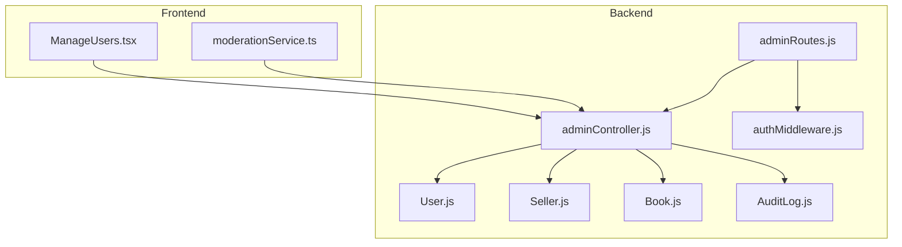
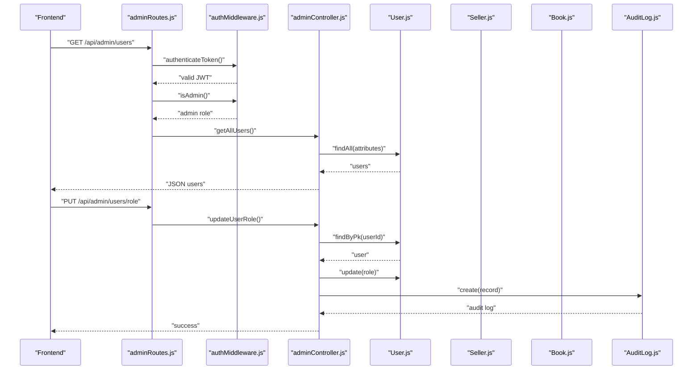
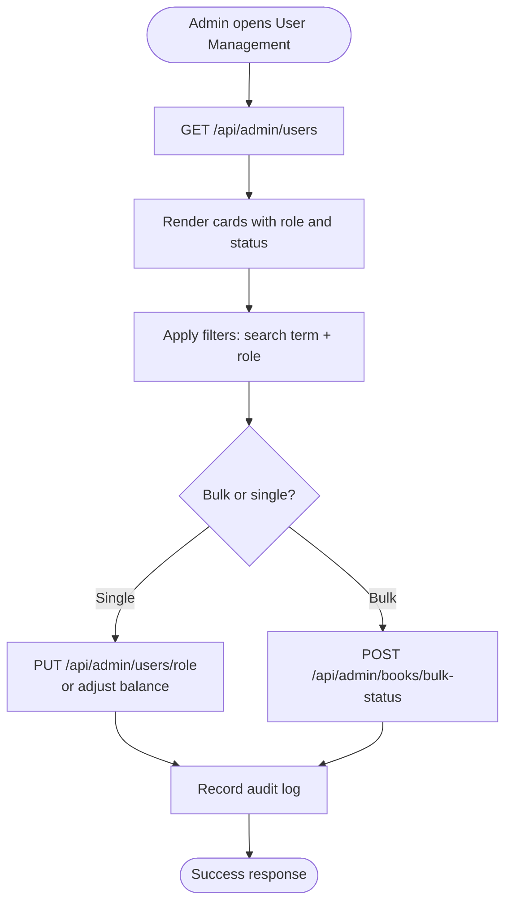
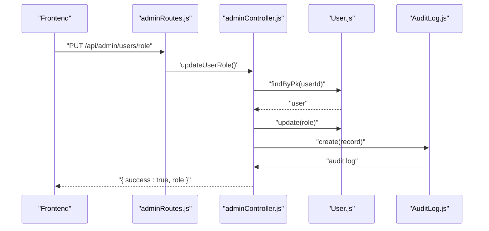
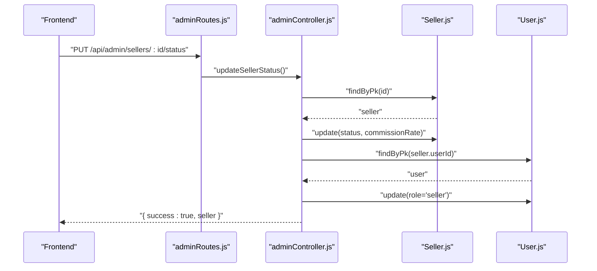
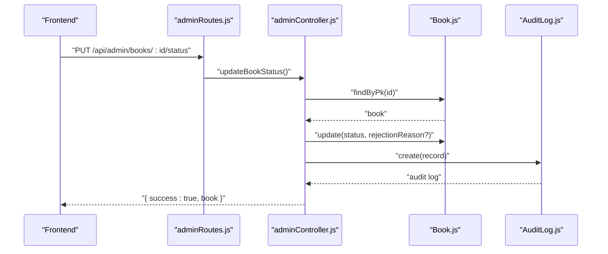
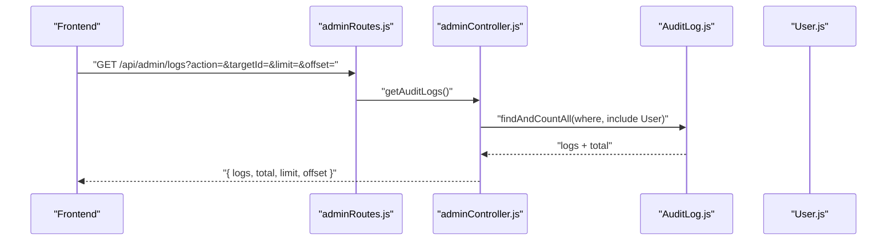
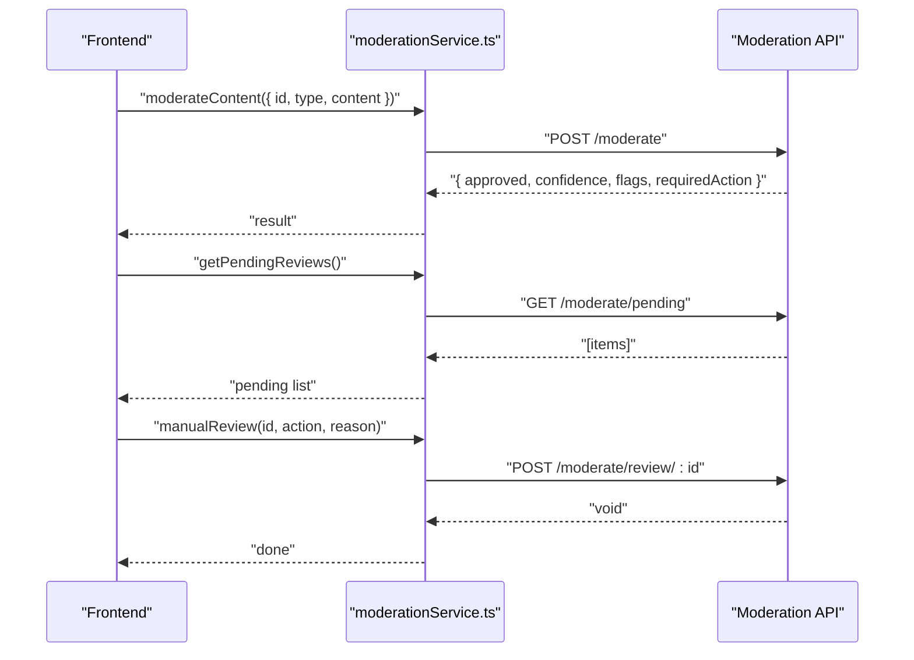
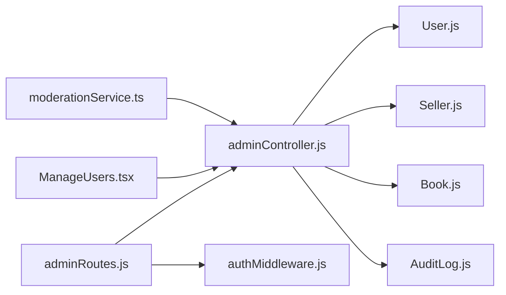

# User Management and Moderation

<cite>
**Referenced Files in This Document**
- [User.js](file://backend/models/User.js)
- [Seller.js](file://backend/models/Seller.js)
- [Book.js](file://backend/models/Book.js)
- [AuditLog.js](file://backend/models/AuditLog.js)
- [adminController.js](file://backend/controllers/adminController.js)
- [adminRoutes.js](file://backend/routes/adminRoutes.js)
- [authMiddleware.js](file://backend/middleware/authMiddleware.js)
- [ManageUsers.tsx](file://frontend/src/pages/ManageUsers.tsx)
- [moderationService.ts](file://frontend/src/api/services/moderationService.ts)
</cite>

## Table of Contents
1. [Introduction](#introduction)
2. [Project Structure](#project-structure)
3. [Core Components](#core-components)
4. [Architecture Overview](#architecture-overview)
5. [Detailed Component Analysis](#detailed-component-analysis)
6. [Dependency Analysis](#dependency-analysis)
7. [Performance Considerations](#performance-considerations)
8. [Troubleshooting Guide](#troubleshooting-guide)
9. [Conclusion](#conclusion)
10. [Appendices](#appendices)

## Introduction
This document explains the user management and moderation capabilities implemented in the backend and frontend systems. It covers:
- User listing with filtering and search
- Bulk operations for content moderation
- User role management and account status controls
- Verification workflows for sellers
- Moderation tools for content review and removal
- Audit logging and compliance reporting
- Examples of administrative workflows and user lifecycle management

## Project Structure
The user management and moderation features span backend controllers and models, frontend pages and services, and middleware for authentication and authorization.

**Diagram sources**
- [adminRoutes.js:1-107](file://backend/routes/adminRoutes.js#L1-L107)
- [adminController.js:1-599](file://backend/controllers/adminController.js#L1-L599)
- [authMiddleware.js:1-36](file://backend/middleware/authMiddleware.js#L1-L36)
- [User.js:1-50](file://backend/models/User.js#L1-L50)
- [Seller.js:1-30](file://backend/models/Seller.js#L1-L30)
- [Book.js:1-92](file://backend/models/Book.js#L1-L92)
- [AuditLog.js:1-30](file://backend/models/AuditLog.js#L1-L30)
- [ManageUsers.tsx:1-146](file://frontend/src/pages/ManageUsers.tsx#L1-L146)
- [moderationService.ts:1-46](file://frontend/src/api/services/moderationService.ts#L1-L46)

**Section sources**
- [adminRoutes.js:1-107](file://backend/routes/adminRoutes.js#L1-L107)
- [adminController.js:1-599](file://backend/controllers/adminController.js#L1-L599)
- [authMiddleware.js:1-36](file://backend/middleware/authMiddleware.js#L1-L36)
- [User.js:1-50](file://backend/models/User.js#L1-L50)
- [Seller.js:1-30](file://backend/models/Seller.js#L1-L30)
- [Book.js:1-92](file://backend/models/Book.js#L1-L92)
- [AuditLog.js:1-30](file://backend/models/AuditLog.js#L1-L30)
- [ManageUsers.tsx:1-146](file://frontend/src/pages/ManageUsers.tsx#L1-L146)
- [moderationService.ts:1-46](file://frontend/src/api/services/moderationService.ts#L1-L46)

## Core Components
- User model defines identity, roles, balances, and verification state.
- Admin controller exposes endpoints for user listing, role updates, balance adjustments, audit log retrieval, and moderation workflows.
- Admin routes enforce JWT authentication and admin role checks.
- Frontend ManageUsers page provides filtering/search and inline status actions.
- Moderation service offers content moderation and manual review APIs.

**Section sources**
- [User.js:1-50](file://backend/models/User.js#L1-L50)
- [adminController.js:166-256](file://backend/controllers/adminController.js#L166-L256)
- [adminRoutes.js:1-107](file://backend/routes/adminRoutes.js#L1-L107)
- [authMiddleware.js:1-36](file://backend/middleware/authMiddleware.js#L1-L36)
- [ManageUsers.tsx:21-38](file://frontend/src/pages/ManageUsers.tsx#L21-L38)
- [moderationService.ts:1-46](file://frontend/src/api/services/moderationService.ts#L1-L46)

## Architecture Overview
Administrative actions flow through protected routes, validated by middleware, and executed by controllers that coordinate models and services. Audit logs capture all administrative changes for compliance.

**Diagram sources**
- [adminRoutes.js:40-56](file://backend/routes/adminRoutes.js#L40-L56)
- [authMiddleware.js:3-33](file://backend/middleware/authMiddleware.js#L3-L33)
- [adminController.js:233-256](file://backend/controllers/adminController.js#L233-L256)
- [User.js:1-50](file://backend/models/User.js#L1-L50)
- [AuditLog.js:1-30](file://backend/models/AuditLog.js#L1-L30)

## Detailed Component Analysis

### User Listing, Filtering, Search, and Bulk Operations
- Backend:
  - GET /api/admin/users lists users with role and wallet balances.
  - GET /api/admin/books lists books with seller and user details.
  - PUT /api/admin/books/:id/status updates moderation status per book.
  - POST /api/admin/books/bulk-status updates multiple books’ statuses atomically.
- Frontend:
  - ManageUsers.tsx provides search by name/email and role filtering, with inline actions to suspend/activate and delete users.

**Diagram sources**
- [adminRoutes.js:40-56](file://backend/routes/adminRoutes.js#L40-L56)
- [adminRoutes.js:34-38](file://backend/routes/adminRoutes.js#L34-L38)
- [adminController.js:135-161](file://backend/controllers/adminController.js#L135-L161)
- [adminController.js:233-256](file://backend/controllers/adminController.js#L233-L256)
- [ManageUsers.tsx:21-38](file://frontend/src/pages/ManageUsers.tsx#L21-L38)

**Section sources**
- [adminController.js:166-177](file://backend/controllers/adminController.js#L166-L177)
- [adminController.js:83-130](file://backend/controllers/adminController.js#L83-L130)
- [adminController.js:135-161](file://backend/controllers/adminController.js#L135-L161)
- [adminRoutes.js:40-56](file://backend/routes/adminRoutes.js#L40-L56)
- [adminRoutes.js:34-38](file://backend/routes/adminRoutes.js#L34-L38)
- [ManageUsers.tsx:21-38](file://frontend/src/pages/ManageUsers.tsx#L21-L38)

### User Role Management and Account Status Controls
- Role management:
  - PUT /api/admin/users/role updates a user’s role.
  - On seller approval, user role is elevated to seller automatically.
- Account status:
  - Frontend ManageUsers supports activation/suspension/delete actions.
  - Backend controllers record audit logs for all role and status changes.

**Diagram sources**
- [adminRoutes.js:52-56](file://backend/routes/adminRoutes.js#L52-L56)
- [adminController.js:233-256](file://backend/controllers/adminController.js#L233-L256)
- [User.js:26-28](file://backend/models/User.js#L26-L28)
- [AuditLog.js:1-30](file://backend/models/AuditLog.js#L1-L30)

**Section sources**
- [adminController.js:233-256](file://backend/controllers/adminController.js#L233-L256)
- [adminController.js:65-71](file://backend/controllers/adminController.js#L65-L71)
- [adminRoutes.js:52-56](file://backend/routes/adminRoutes.js#L52-L56)
- [ManageUsers.tsx:120-134](file://frontend/src/pages/ManageUsers.tsx#L120-L134)

### Verification Workflows (Sellers)
- Sellers have a status field with values pending/approved/rejected.
- Admins can update seller status via PUT /api/admin/sellers/:id/status.
- On approval, the associated user’s role is set to seller.

**Diagram sources**
- [adminRoutes.js:16-20](file://backend/routes/adminRoutes.js#L16-L20)
- [adminController.js:41-78](file://backend/controllers/adminController.js#L41-L78)
- [Seller.js:14-16](file://backend/models/Seller.js#L14-L16)
- [User.js:26-28](file://backend/models/User.js#L26-L28)

**Section sources**
- [adminController.js:41-78](file://backend/controllers/adminController.js#L41-L78)
- [adminRoutes.js:16-20](file://backend/routes/adminRoutes.js#L16-L20)
- [Seller.js:1-30](file://backend/models/Seller.js#L1-L30)
- [User.js:1-50](file://backend/models/User.js#L1-L50)

### Moderation Tools for Content Review and Removal
- Content moderation:
  - PUT /api/admin/books/:id/status updates book moderation status.
  - POST /api/admin/books/bulk-status updates multiple books’ statuses.
  - On rejection, a rejection reason is stored.
- Audit logging:
  - All moderation actions are recorded with details for compliance.

**Diagram sources**
- [adminRoutes.js:28-32](file://backend/routes/adminRoutes.js#L28-L32)
- [adminController.js:102-130](file://backend/controllers/adminController.js#L102-L130)
- [Book.js:1-92](file://backend/models/Book.js#L1-L92)
- [AuditLog.js:1-30](file://backend/models/AuditLog.js#L1-L30)

**Section sources**
- [adminController.js:102-130](file://backend/controllers/adminController.js#L102-L130)
- [adminController.js:135-161](file://backend/controllers/adminController.js#L135-L161)
- [adminRoutes.js:28-32](file://backend/routes/adminRoutes.js#L28-L32)
- [adminRoutes.js:34-38](file://backend/routes/adminRoutes.js#L34-L38)

### User Activity Monitoring and Compliance Reporting
- Audit logs:
  - GET /api/admin/logs retrieves administrative actions with optional filtering by action or targetId.
  - Includes pagination via limit and offset.
- Compliance:
  - All sensitive actions (role changes, balance adjustments, moderation decisions) are captured in structured JSON for reporting.

**Diagram sources**
- [adminRoutes.js:64-68](file://backend/routes/adminRoutes.js#L64-L68)
- [adminController.js:307-333](file://backend/controllers/adminController.js#L307-L333)
- [AuditLog.js:1-30](file://backend/models/AuditLog.js#L1-L30)
- [User.js:1-50](file://backend/models/User.js#L1-L50)

**Section sources**
- [adminController.js:307-333](file://backend/controllers/adminController.js#L307-L333)
- [adminRoutes.js:64-68](file://backend/routes/adminRoutes.js#L64-L68)
- [AuditLog.js:1-30](file://backend/models/AuditLog.js#L1-L30)

### Moderation Service Integration (Frontend)
- The moderation service provides:
  - moderateContent: AI-driven moderation with flags and required action.
  - getModerationHistory: historical moderation decisions.
  - manualReview: admin override with reason.
  - getPendingReviews: queue of items awaiting manual review.

**Diagram sources**
- [moderationService.ts:1-46](file://frontend/src/api/services/moderationService.ts#L1-L46)

**Section sources**
- [moderationService.ts:1-46](file://frontend/src/api/services/moderationService.ts#L1-L46)

## Dependency Analysis
- Controllers depend on models for persistence and on services for auxiliary operations.
- Routes depend on controllers for business logic and on middleware for security.
- Frontend pages depend on services for API communication.

**Diagram sources**
- [adminRoutes.js:1-107](file://backend/routes/adminRoutes.js#L1-L107)
- [adminController.js:1-599](file://backend/controllers/adminController.js#L1-L599)
- [User.js:1-50](file://backend/models/User.js#L1-L50)
- [Seller.js:1-30](file://backend/models/Seller.js#L1-L30)
- [Book.js:1-92](file://backend/models/Book.js#L1-L92)
- [AuditLog.js:1-30](file://backend/models/AuditLog.js#L1-L30)
- [ManageUsers.tsx:1-146](file://frontend/src/pages/ManageUsers.tsx#L1-L146)
- [moderationService.ts:1-46](file://frontend/src/api/services/moderationService.ts#L1-L46)
- [authMiddleware.js:1-36](file://backend/middleware/authMiddleware.js#L1-L36)

**Section sources**
- [adminRoutes.js:1-107](file://backend/routes/adminRoutes.js#L1-L107)
- [adminController.js:1-599](file://backend/controllers/adminController.js#L1-L599)
- [authMiddleware.js:1-36](file://backend/middleware/authMiddleware.js#L1-L36)
- [User.js:1-50](file://backend/models/User.js#L1-L50)
- [Seller.js:1-30](file://backend/models/Seller.js#L1-L30)
- [Book.js:1-92](file://backend/models/Book.js#L1-L92)
- [AuditLog.js:1-30](file://backend/models/AuditLog.js#L1-L30)
- [ManageUsers.tsx:1-146](file://frontend/src/pages/ManageUsers.tsx#L1-L146)
- [moderationService.ts:1-46](file://frontend/src/api/services/moderationService.ts#L1-L46)

## Performance Considerations
- Prefer bulk operations for moderation (bulk-update endpoints) to reduce round-trips.
- Use pagination and filtering on audit logs to avoid large payloads.
- Index moderation status and user role fields in models to speed up queries.
- Cache frequently accessed admin stats where appropriate.

## Troubleshooting Guide
- Authentication failures:
  - Ensure Authorization header contains a valid Bearer token with HS256 signature.
- Access denied:
  - Admin role is required; verify the token payload includes role=admin.
- Entity not found:
  - Verify IDs exist for users, books, or sellers before updating.
- Audit log retrieval:
  - Confirm action and targetId filters match stored values.

**Section sources**
- [authMiddleware.js:3-33](file://backend/middleware/authMiddleware.js#L3-L33)
- [adminController.js:47-48](file://backend/controllers/adminController.js#L47-L48)
- [adminController.js:108-109](file://backend/controllers/adminController.js#L108-L109)
- [adminController.js:309-321](file://backend/controllers/adminController.js#L309-L321)

## Conclusion
The system provides a robust foundation for user management and moderation:
- Secure, audited administrative actions
- Flexible filtering and bulk operations
- Clear verification and role management workflows
- Integration points for content moderation and compliance reporting

## Appendices

### Administrative Workflows and Examples
- User role change:
  - Route: PUT /api/admin/users/role
  - Action: Update user role and record audit log
- Bulk book moderation:
  - Route: POST /api/admin/books/bulk-status
  - Action: Update multiple books’ moderation status
- Seller verification:
  - Route: PUT /api/admin/sellers/:id/status
  - Action: Approve/reject seller; auto-upgrade user role to seller on approval
- Audit log review:
  - Route: GET /api/admin/logs
  - Action: Paginated retrieval with optional filters

**Section sources**
- [adminRoutes.js:52-56](file://backend/routes/adminRoutes.js#L52-L56)
- [adminRoutes.js:34-38](file://backend/routes/adminRoutes.js#L34-L38)
- [adminRoutes.js:16-20](file://backend/routes/adminRoutes.js#L16-L20)
- [adminRoutes.js:64-68](file://backend/routes/adminRoutes.js#L64-L68)
- [adminController.js:233-256](file://backend/controllers/adminController.js#L233-L256)
- [adminController.js:135-161](file://backend/controllers/adminController.js#L135-L161)
- [adminController.js:41-78](file://backend/controllers/adminController.js#L41-L78)
- [adminController.js:307-333](file://backend/controllers/adminController.js#L307-L333)