# Administration API

<cite>
**Referenced Files in This Document**
- [adminRoutes.js](file://backend/routes/adminRoutes.js)
- [adminController.js](file://backend/controllers/adminController.js)
- [authMiddleware.js](file://backend/middleware/authMiddleware.js)
- [AuditLog.js](file://backend/models/AuditLog.js)
- [User.js](file://backend/models/User.js)
- [Seller.js](file://backend/models/Seller.js)
- [Book.js](file://backend/models/Book.js)
- [Transaction.js](file://backend/models/Transaction.js)
- [RefundRequest.js](file://backend/models/RefundRequest.js)
- [walletService.js](file://backend/services/walletService.js)
- [subscriptionPlans.js](file://backend/config/subscriptionPlans.js)
- [adminService.ts](file://frontend/src/api/services/adminService.ts)
- [moderationService.ts](file://frontend/src/api/services/moderationService.ts)
</cite>

## Table of Contents
1. [Introduction](#introduction)
2. [Project Structure](#project-structure)
3. [Core Components](#core-components)
4. [Architecture Overview](#architecture-overview)
5. [Detailed Component Analysis](#detailed-component-analysis)
6. [Dependency Analysis](#dependency-analysis)
7. [Performance Considerations](#performance-considerations)
8. [Troubleshooting Guide](#troubleshooting-guide)
9. [Conclusion](#conclusion)
10. [Appendices](#appendices)

## Introduction
This document provides comprehensive API documentation for the Administration endpoints that enable platform management, user moderation, financial oversight, and system configuration. It covers admin-only endpoints for:
- User management (/api/admin/users)
- Content moderation (/api/admin/books and /api/admin/sellers)
- Financial reporting and operations (/api/admin/reports via derived stats, withdrawals, and refunds)
- System configuration and health (/api/admin/settings via health checks)
- Audit logging and oversight (/api/admin/logs)
- Referral program management (via platform configuration and stats)
- Subscription plan administration (via shared plan definitions)

Administrative workflows documented include bulk operations, role-based permissions, and atomic financial adjustments. Security considerations emphasize bearer token authentication and admin-only authorization.

## Project Structure
The Administration API is implemented in the backend under Express.js with route protection middleware and controller logic. Models define domain entities, and services encapsulate financial operations.

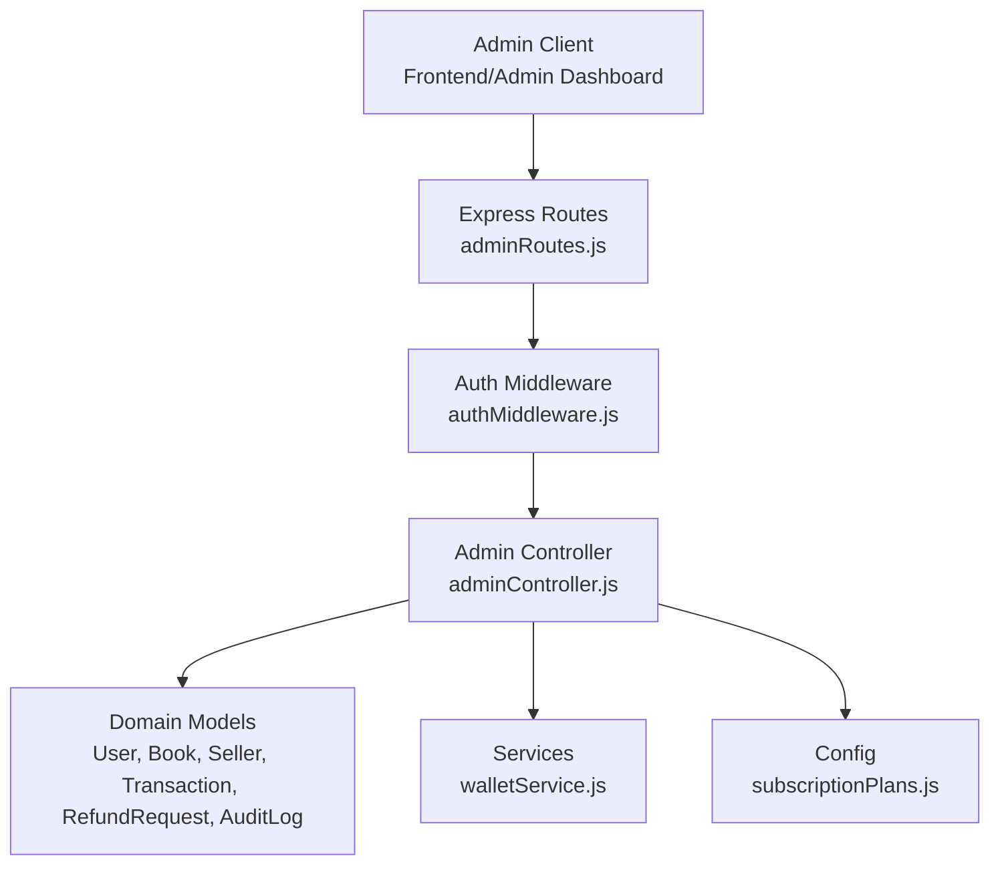

**Diagram sources**
- [adminRoutes.js:1-107](file://backend/routes/adminRoutes.js#L1-L107)
- [authMiddleware.js:1-36](file://backend/middleware/authMiddleware.js#L1-L36)
- [adminController.js:1-599](file://backend/controllers/adminController.js#L1-L599)
- [User.js:1-50](file://backend/models/User.js#L1-L50)
- [Book.js:1-92](file://backend/models/Book.js#L1-L92)
- [Seller.js:1-30](file://backend/models/Seller.js#L1-L30)
- [Transaction.js:1-54](file://backend/models/Transaction.js#L1-L54)
- [RefundRequest.js:1-42](file://backend/models/RefundRequest.js#L1-L42)
- [AuditLog.js:1-30](file://backend/models/AuditLog.js#L1-L30)
- [walletService.js:1-80](file://backend/services/walletService.js#L1-L80)
- [subscriptionPlans.js:1-21](file://backend/config/subscriptionPlans.js#L1-L21)

**Section sources**
- [adminRoutes.js:1-107](file://backend/routes/adminRoutes.js#L1-L107)
- [authMiddleware.js:1-36](file://backend/middleware/authMiddleware.js#L1-L36)

## Core Components
- Authentication and Authorization:
  - Token extraction and verification from the Authorization header.
  - Admin-only enforcement ensuring only users with role admin can access admin routes.
- Admin Controller:
  - Implements endpoints for sellers, books, users, payouts, refunds, audit logs, and system health.
  - Centralized audit logging for all admin actions.
- Domain Models:
  - User, Book, Seller, Transaction, RefundRequest, AuditLog define the data schema and relationships.
- Services:
  - Wallet service provides atomic credit operations to prevent race conditions.

Key responsibilities:
- Enforce role-based access.
- Provide bulk operations where applicable.
- Maintain immutable audit trails.
- Ensure financial operations are atomic and reversible where needed.

**Section sources**
- [authMiddleware.js:27-33](file://backend/middleware/authMiddleware.js#L27-L33)
- [adminController.js:8-20](file://backend/controllers/adminController.js#L8-L20)
- [adminController.js:258-302](file://backend/controllers/adminController.js#L258-L302)

## Architecture Overview
The admin API follows a layered architecture:
- Route layer: Defines endpoint contracts and applies middleware.
- Controller layer: Implements business logic and orchestrates models/services.
- Model layer: Defines persistence contracts for domain entities.
- Service layer: Encapsulates cross-cutting concerns like wallet operations.

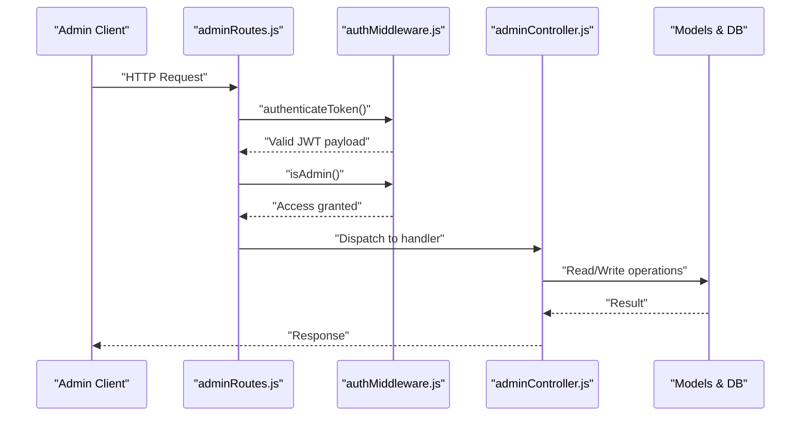

**Diagram sources**
- [adminRoutes.js:6-8](file://backend/routes/adminRoutes.js#L6-L8)
- [authMiddleware.js:3-25](file://backend/middleware/authMiddleware.js#L3-L25)
- [authMiddleware.js:27-33](file://backend/middleware/authMiddleware.js#L27-L33)
- [adminController.js:25-36](file://backend/controllers/adminController.js#L25-L36)

## Detailed Component Analysis

### Authentication and Authorization
- Token validation enforces HS256 and rejects missing or invalid tokens.
- Admin-only guard ensures only users with role admin can access protected routes.

Security considerations:
- Use HTTPS in production.
- Rotate JWT_SECRET regularly.
- Limit token lifetimes and refresh strategies.

**Section sources**
- [authMiddleware.js:3-25](file://backend/middleware/authMiddleware.js#L3-L25)
- [authMiddleware.js:27-33](file://backend/middleware/authMiddleware.js#L27-L33)

### Audit Logging
- Centralized logging function records admin actions with target identifiers and details.
- AuditLog model stores UUID primary key, admin identifier, action type, target, and JSON details.

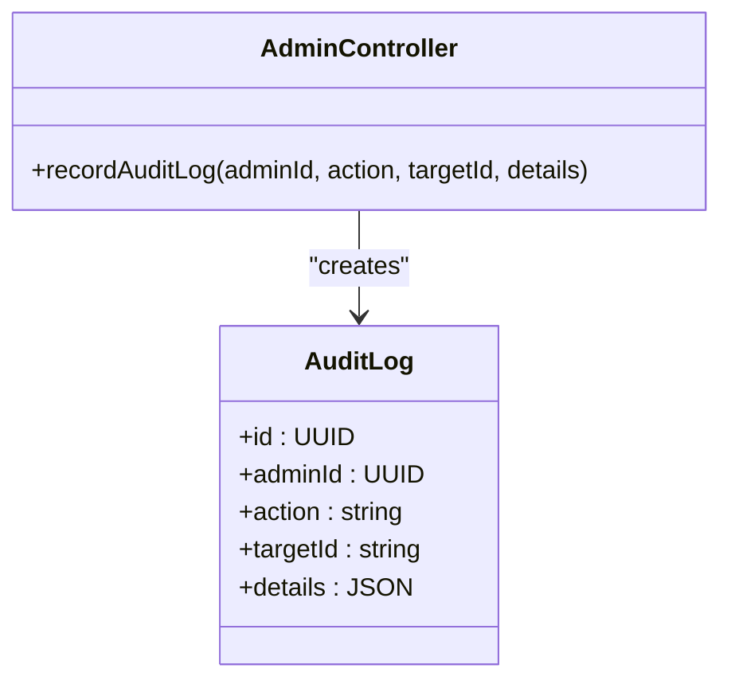

**Diagram sources**
- [AuditLog.js:4-26](file://backend/models/AuditLog.js#L4-L26)
- [adminController.js:8-20](file://backend/controllers/adminController.js#L8-L20)

**Section sources**
- [adminController.js:8-20](file://backend/controllers/adminController.js#L8-L20)
- [AuditLog.js:1-30](file://backend/models/AuditLog.js#L1-L30)

### User Management (/api/admin/users)
Endpoints:
- GET /api/admin/users: List all users with balances and roles.
- POST /api/admin/users/adjust-balance: Adjust user wallet balance (atomic).
- PUT /api/admin/users/role: Update user role.

Workflows:
- Balance adjustment creates a transaction record and updates user balance atomically.
- Role updates are logged in audit logs.

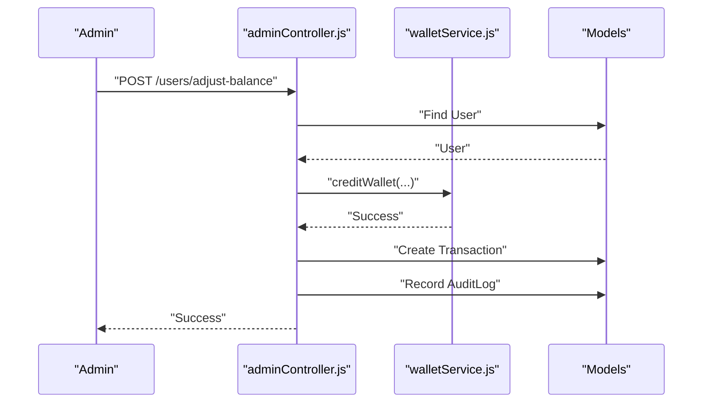

**Diagram sources**
- [adminController.js:182-228](file://backend/controllers/adminController.js#L182-L228)
- [walletService.js:66-79](file://backend/services/walletService.js#L66-L79)
- [Transaction.js:14-16](file://backend/models/Transaction.js#L14-L16)

**Section sources**
- [adminRoutes.js:40-56](file://backend/routes/adminRoutes.js#L40-L56)
- [adminController.js:166-177](file://backend/controllers/adminController.js#L166-L177)
- [adminController.js:182-228](file://backend/controllers/adminController.js#L182-L228)
- [adminController.js:233-256](file://backend/controllers/adminController.js#L233-L256)

### Content Moderation (/api/admin/books, /api/admin/sellers)
Endpoints:
- GET /api/admin/books: List all books with seller details.
- PUT /api/admin/books/:id/status: Approve or reject a book.
- POST /api/admin/books/bulk-status: Bulk approve or reject books.
- GET /api/admin/sellers: List all sellers with user details.
- PUT /api/admin/sellers/:id/status: Approve or reject a seller (updates user role to seller on approval).

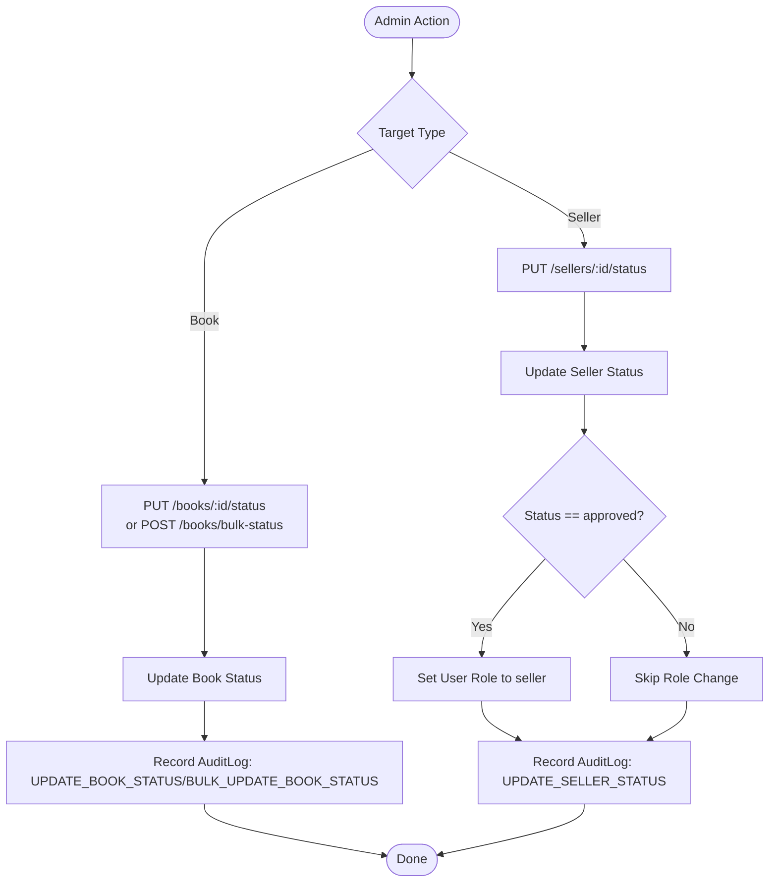

**Diagram sources**
- [adminRoutes.js:22-38](file://backend/routes/adminRoutes.js#L22-L38)
- [adminController.js:102-130](file://backend/controllers/adminController.js#L102-L130)
- [adminController.js:135-161](file://backend/controllers/adminController.js#L135-L161)
- [adminController.js:41-78](file://backend/controllers/adminController.js#L41-L78)

**Section sources**
- [adminRoutes.js:22-38](file://backend/routes/adminRoutes.js#L22-L38)
- [adminController.js:83-97](file://backend/controllers/adminController.js#L83-L97)
- [adminController.js:102-130](file://backend/controllers/adminController.js#L102-L130)
- [adminController.js:135-161](file://backend/controllers/adminController.js#L135-L161)
- [adminController.js:25-36](file://backend/controllers/adminController.js#L25-L36)
- [adminController.js:41-78](file://backend/controllers/adminController.js#L41-L78)

### Financial Reporting and Operations
Derived stats endpoint:
- GET /api/admin/stats: Provides counts and calculated platform revenue from completed purchases and seller commission rates.

Withdrawals management:
- GET /api/admin/payouts: List pending withdrawal requests.
- PUT /api/admin/payouts/:id: Approve or reject a payout; on rejection, refund the user’s balance.

Refund processing:
- GET /api/admin/refunds: List refund requests with optional status filter.
- PUT /api/admin/refunds/:id: Approve or reject a refund; on approval, atomically credit user wallet and create a refund transaction.

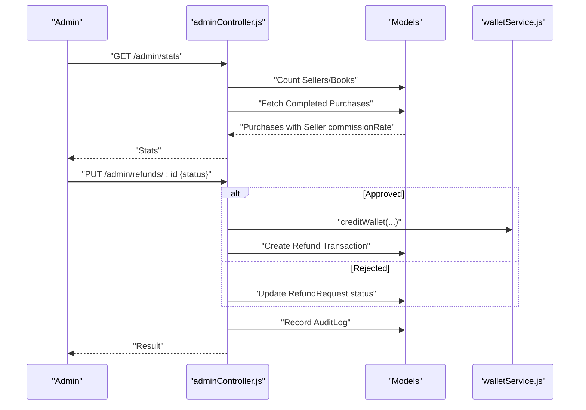

**Diagram sources**
- [adminController.js:261-302](file://backend/controllers/adminController.js#L261-L302)
- [adminController.js:363-375](file://backend/controllers/adminController.js#L363-L375)
- [adminController.js:380-425](file://backend/controllers/adminController.js#L380-L425)
- [adminController.js:484-510](file://backend/controllers/adminController.js#L484-L510)
- [adminController.js:527-597](file://backend/controllers/adminController.js#L527-L597)
- [walletService.js:66-79](file://backend/services/walletService.js#L66-L79)

**Section sources**
- [adminController.js:261-302](file://backend/controllers/adminController.js#L261-L302)
- [adminController.js:363-375](file://backend/controllers/adminController.js#L363-L375)
- [adminController.js:380-425](file://backend/controllers/adminController.js#L380-L425)
- [adminController.js:484-510](file://backend/controllers/adminController.js#L484-L510)
- [adminController.js:527-597](file://backend/controllers/adminController.js#L527-L597)

### System Health and Configuration
System health:
- GET /api/admin/health: Authenticates database connection and returns service health statuses.

Subscription plans:
- Shared plan definitions used across backend and workers for pricing and durations.

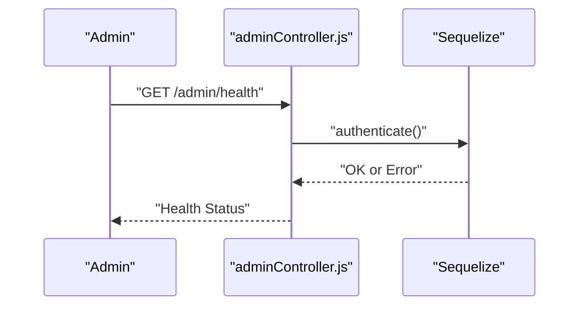

**Diagram sources**
- [adminController.js:338-358](file://backend/controllers/adminController.js#L338-L358)

**Section sources**
- [adminController.js:338-358](file://backend/controllers/adminController.js#L338-L358)
- [subscriptionPlans.js:13-18](file://backend/config/subscriptionPlans.js#L13-L18)

### Audit Log Access
- GET /api/admin/logs: Fetch audit logs with optional filters by action and targetId, with pagination.

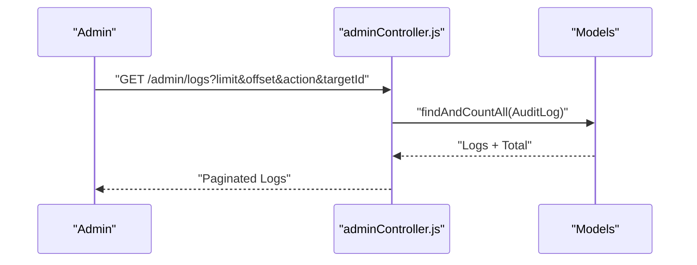

**Diagram sources**
- [adminController.js:307-333](file://backend/controllers/adminController.js#L307-L333)

**Section sources**
- [adminController.js:307-333](file://backend/controllers/adminController.js#L307-L333)

### Referral Program Management
- Referral model defines codes, status, reward type, and reward amount.
- While dedicated admin endpoints for referrals are not present in the backend routes, platform stats and configuration can inform referral administration.

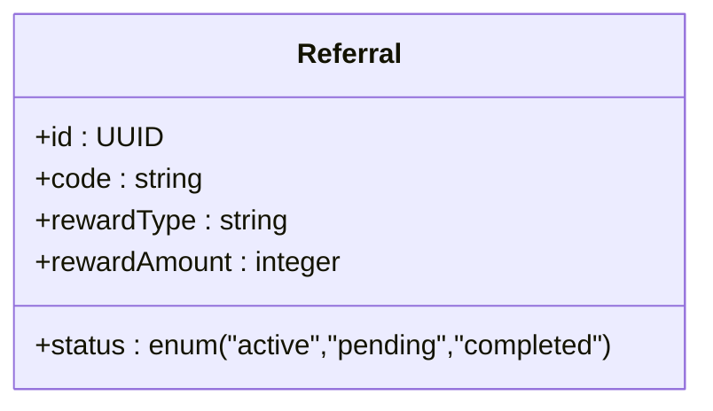

**Diagram sources**
- [Referral.js:4-27](file://backend/models/Referral.js#L4-L27)

**Section sources**
- [Referral.js:1-31](file://backend/models/Referral.js#L1-L31)

### Subscription Plan Administration
- Shared subscription plan definitions provide a single source of truth for plan durations and prices.

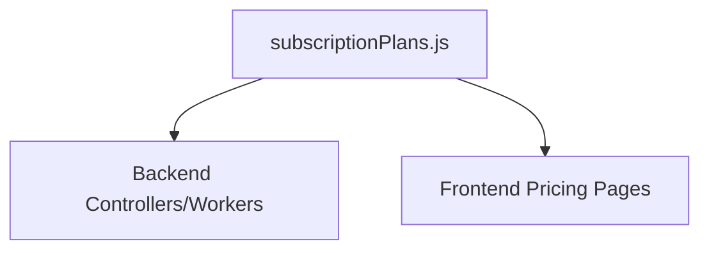

**Diagram sources**
- [subscriptionPlans.js:13-18](file://backend/config/subscriptionPlans.js#L13-L18)

**Section sources**
- [subscriptionPlans.js:1-21](file://backend/config/subscriptionPlans.js#L1-21)

### Administrative Workflows and Examples
- User account suspension:
  - Update user role to restrict access; maintain audit trail.
- Content flagging and moderation:
  - Approve or reject books/sellers; record reasons in audit logs.
- System maintenance:
  - Use health checks to verify service availability; address degraded status promptly.

Bulk operations:
- Bulk book status updates support efficient moderation workflows.

**Section sources**
- [adminController.js:135-161](file://backend/controllers/adminController.js#L135-L161)
- [adminController.js:233-256](file://backend/controllers/adminController.js#L233-L256)

## Dependency Analysis
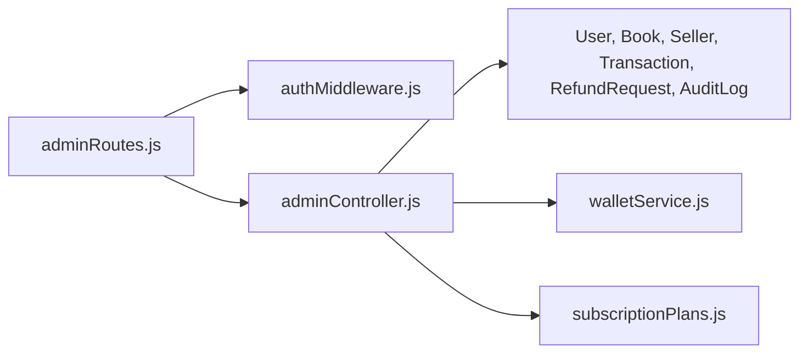

**Diagram sources**
- [adminRoutes.js:1-107](file://backend/routes/adminRoutes.js#L1-L107)
- [authMiddleware.js:1-36](file://backend/middleware/authMiddleware.js#L1-L36)
- [adminController.js:1-599](file://backend/controllers/adminController.js#L1-L599)
- [walletService.js:1-80](file://backend/services/walletService.js#L1-L80)
- [subscriptionPlans.js:1-21](file://backend/config/subscriptionPlans.js#L1-L21)

**Section sources**
- [adminRoutes.js:1-107](file://backend/routes/adminRoutes.js#L1-L107)
- [adminController.js:1-599](file://backend/controllers/adminController.js#L1-L599)

## Performance Considerations
- Prefer bulk operations for mass moderation to reduce round trips.
- Use pagination for logs and refund listings to avoid large payloads.
- Ensure database indexes on frequently queried fields (e.g., status, createdAt).
- Use atomic operations for financial adjustments to prevent race conditions.

## Troubleshooting Guide
Common issues and resolutions:
- 401 Unauthorized: Verify Authorization header contains a valid Bearer token.
- 403 Forbidden: Confirm the token’s role is admin.
- 404 Not Found: Target entity (user, book, seller, transaction) may not exist.
- 400 Bad Request: Validate request body (e.g., required fields, enums).
- Audit log queries: Use filters and pagination to narrow results.

**Section sources**
- [authMiddleware.js:3-25](file://backend/middleware/authMiddleware.js#L3-L25)
- [authMiddleware.js:27-33](file://backend/middleware/authMiddleware.js#L27-L33)
- [adminController.js:307-333](file://backend/controllers/adminController.js#L307-L333)

## Conclusion
The Administration API provides a secure, auditable, and extensible foundation for platform oversight. It enforces role-based access, supports bulk moderation, maintains financial integrity with atomic operations, and offers comprehensive audit logging. Administrators can manage users, content, finances, and system health while maintaining compliance and transparency.

## Appendices

### Endpoint Reference Summary
- GET /api/admin/sellers
- PUT /api/admin/sellers/:id/status
- GET /api/admin/books
- PUT /api/admin/books/:id/status
- POST /api/admin/books/bulk-status
- GET /api/admin/users
- POST /api/admin/users/adjust-balance
- PUT /api/admin/users/role
- GET /api/admin/stats
- GET /api/admin/logs
- GET /api/admin/health
- GET /api/admin/payouts
- PUT /api/admin/payouts/:id
- POST /api/admin/gift-book
- GET /api/admin/refunds
- PUT /api/admin/refunds/:id

**Section sources**
- [adminRoutes.js:10-106](file://backend/routes/adminRoutes.js#L10-L106)