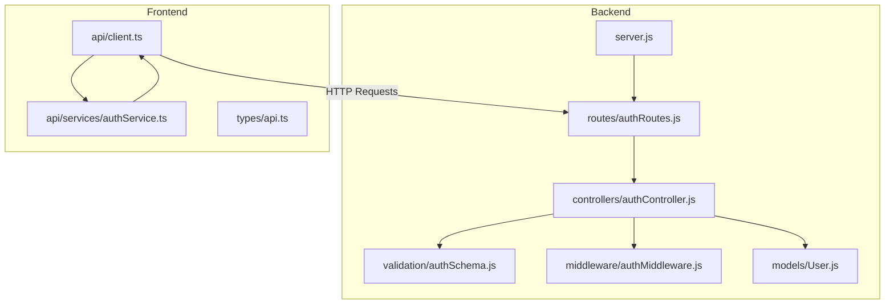
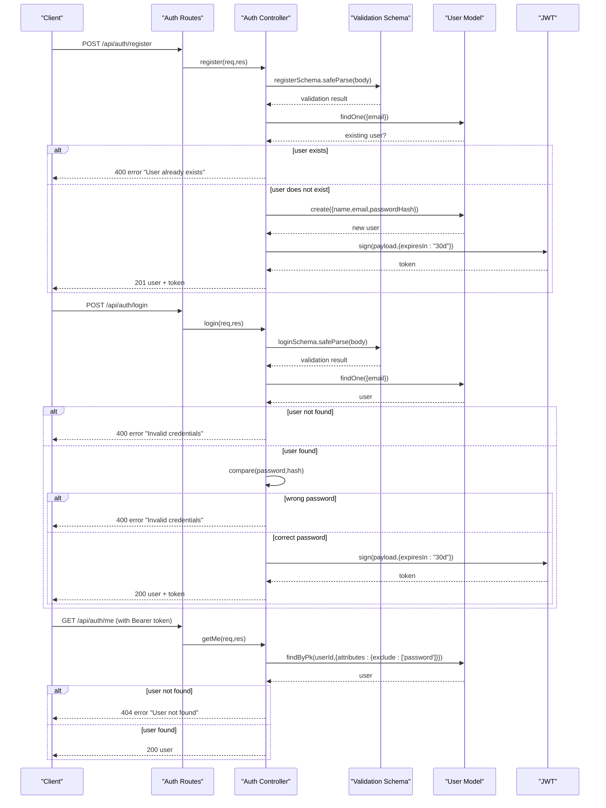
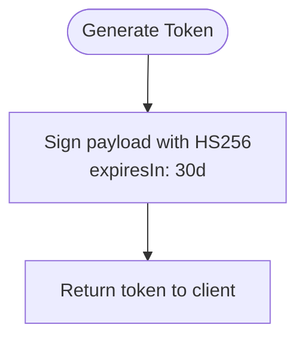
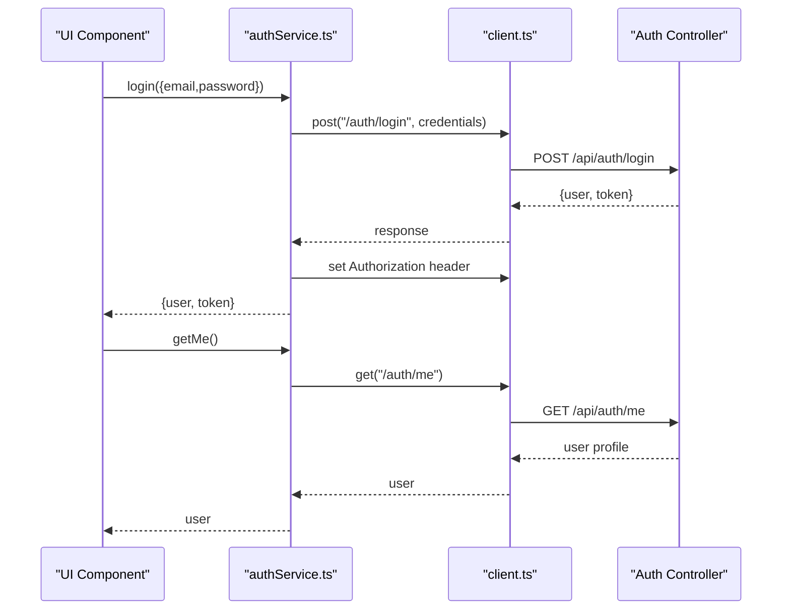
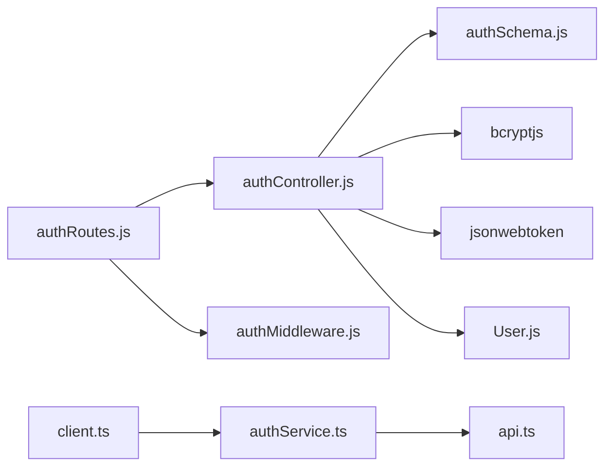

# Authentication API

<cite>
**Referenced Files in This Document**
- [authController.js](file://backend/controllers/authController.js)
- [authRoutes.js](file://backend/routes/authRoutes.js)
- [authSchema.js](file://backend/validation/authSchema.js)
- [authMiddleware.js](file://backend/middleware/authMiddleware.js)
- [User.js](file://backend/models/User.js)
- [server.js](file://backend/server.js)
- [authService.ts](file://frontend/src/api/services/authService.ts)
- [client.ts](file://frontend/src/api/client.ts)
- [api.ts](file://frontend/src/types/api.ts)
</cite>

## Table of Contents
1. [Introduction](#introduction)
2. [Project Structure](#project-structure)
3. [Core Components](#core-components)
4. [Architecture Overview](#architecture-overview)
5. [Detailed Component Analysis](#detailed-component-analysis)
6. [Dependency Analysis](#dependency-analysis)
7. [Performance Considerations](#performance-considerations)
8. [Troubleshooting Guide](#troubleshooting-guide)
9. [Conclusion](#conclusion)
10. [Appendices](#appendices)

## Introduction
This document provides comprehensive API documentation for the Authentication API endpoints. It covers the registration, login, and user profile retrieval endpoints, including request/response schemas, validation rules, authentication requirements, JWT token generation and expiration, error handling, and client integration examples. The goal is to enable developers to integrate with the authentication flow reliably and securely.

## Project Structure
The authentication API is implemented in the backend under the `/api/auth` route prefix. The frontend client integrates with the backend using a dedicated API client and service layer.

**Diagram sources**
- [server.js:128](file://backend/server.js#L128)
- [authRoutes.js:1-11](file://backend/routes/authRoutes.js#L1-L11)
- [authController.js:1-121](file://backend/controllers/authController.js#L1-L121)
- [authSchema.js:1-18](file://backend/validation/authSchema.js#L1-L18)
- [authMiddleware.js:1-36](file://backend/middleware/authMiddleware.js#L1-L36)
- [User.js:1-50](file://backend/models/User.js#L1-L50)
- [client.ts:1-119](file://frontend/src/api/client.ts#L1-L119)
- [authService.ts:1-57](file://frontend/src/api/services/authService.ts#L1-L57)
- [api.ts:14-24](file://frontend/src/types/api.ts#L14-L24)

**Section sources**
- [server.js:128](file://backend/server.js#L128)
- [authRoutes.js:1-11](file://backend/routes/authRoutes.js#L1-L11)
- [client.ts:107](file://frontend/src/api/client.ts#L107)
- [authService.ts:1-57](file://frontend/src/api/services/authService.ts#L1-L57)

## Core Components
- Authentication controller: Implements registration, login, and profile retrieval with validation and JWT token generation.
- Route definitions: Exposes endpoints under /api/auth with appropriate middleware.
- Validation schemas: Enforces request body constraints for registration and login.
- Authentication middleware: Validates JWT tokens for protected routes.
- User model: Defines the persisted user entity and roles.
- Frontend client: Handles HTTP communication, token injection, and error handling.

**Section sources**
- [authController.js:30-121](file://backend/controllers/authController.js#L30-L121)
- [authRoutes.js:6-8](file://backend/routes/authRoutes.js#L6-L8)
- [authSchema.js:3-12](file://backend/validation/authSchema.js#L3-L12)
- [authMiddleware.js:3-25](file://backend/middleware/authMiddleware.js#L3-L25)
- [User.js:4-46](file://backend/models/User.js#L4-L46)
- [client.ts:22-46](file://frontend/src/api/client.ts#L22-L46)

## Architecture Overview
The authentication flow follows a standard pattern:
- Registration validates input, checks for existing users, hashes passwords, persists the user, and returns a JWT token.
- Login validates input, finds the user by email, compares hashed passwords, and returns a JWT token.
- Profile retrieval requires a valid JWT token and returns user data excluding sensitive fields.

**Diagram sources**
- [authController.js:30-121](file://backend/controllers/authController.js#L30-L121)
- [authSchema.js:3-12](file://backend/validation/authSchema.js#L3-L12)
- [authRoutes.js:6-8](file://backend/routes/authRoutes.js#L6-L8)
- [authMiddleware.js:3-25](file://backend/middleware/authMiddleware.js#L3-L25)
- [User.js:4-46](file://backend/models/User.js#L4-L46)

## Detailed Component Analysis

### Endpoint: POST /api/auth/register
- Method: POST
- URL: /api/auth/register
- Access: Public
- Purpose: Create a new user account
- Request Body (JSON):
  - name: string (minimum length 2)
  - email: string (valid email format)
  - password: string (minimum length 8)
- Response Body (JSON):
  - id: string (UUID)
  - name: string
  - email: string
  - role: enum "user" | "seller" | "admin"
  - token: string (JWT)
- Validation Rules:
  - name: required, minimum 2 characters
  - email: required, valid email format
  - password: required, minimum 8 characters
- Error Responses:
  - 400: Validation errors (includes details array)
  - 400: "User already exists" if email is taken
- Implementation Notes:
  - Password is hashed using bcrypt before persistence.
  - On success, returns user data and a signed JWT with 30-day expiration.

**Section sources**
- [authController.js:30-70](file://backend/controllers/authController.js#L30-L70)
- [authSchema.js:3-7](file://backend/validation/authSchema.js#L3-L7)
- [User.js:10-25](file://backend/models/User.js#L10-L25)

### Endpoint: POST /api/auth/login
- Method: POST
- URL: /api/auth/login
- Access: Public
- Purpose: Authenticate an existing user and issue a JWT
- Request Body (JSON):
  - email: string (valid email format)
  - password: string (required)
- Response Body (JSON):
  - id: string (UUID)
  - name: string
  - email: string
  - role: enum "user" | "seller" | "admin"
  - token: string (JWT)
- Validation Rules:
  - email: required, valid email format
  - password: required
- Error Responses:
  - 400: "Invalid credentials" if user does not exist or password mismatch
  - 400: Validation errors (includes details array)
- Implementation Notes:
  - Finds user by email, compares password hash, and returns JWT with 30-day expiration.

**Section sources**
- [authController.js:72-107](file://backend/controllers/authController.js#L72-L107)
- [authSchema.js:9-12](file://backend/validation/authSchema.js#L9-L12)
- [User.js:10-25](file://backend/models/User.js#L10-L25)

### Endpoint: GET /api/auth/me
- Method: GET
- URL: /api/auth/me
- Access: Private (requires valid JWT)
- Purpose: Retrieve currently authenticated user profile
- Request Headers:
  - Authorization: Bearer <token>
- Response Body (JSON):
  - id: string (UUID)
  - name: string
  - email: string
  - role: enum "user" | "seller" | "admin"
  - Additional fields as defined by the User model (excluding password)
- Error Responses:
  - 401: "No token, authorization denied" if Authorization header missing or malformed
  - 401: "Token is not valid" if token verification fails
  - 403: "Access denied. Admin role required." if using admin-only middleware variant
  - 404: "User not found" if user record is missing
- Implementation Notes:
  - Uses HS256 algorithm for token verification.
  - Returns user data with password excluded.

**Section sources**
- [authRoutes.js:8](file://backend/routes/authRoutes.js#L8)
- [authController.js:109-121](file://backend/controllers/authController.js#L109-L121)
- [authMiddleware.js:3-25](file://backend/middleware/authMiddleware.js#L3-L25)
- [User.js:4-46](file://backend/models/User.js#L4-L46)

### JWT Token Generation and Expiration
- Token Payload: Contains user id and role.
- Secret: Loaded from environment variable JWT_SECRET; defaults are enforced for development with warnings.
- Expiration: 30 days.
- Algorithm: HS256 (explicitly verified).
- Refresh Mechanism: Not implemented in the current backend; clients should re-authenticate after expiration.

**Diagram sources**
- [authController.js:21-28](file://backend/controllers/authController.js#L21-L28)
- [authMiddleware.js:17](file://backend/middleware/authMiddleware.js#L17)

**Section sources**
- [authController.js:21-28](file://backend/controllers/authController.js#L21-L28)
- [authMiddleware.js:17](file://backend/middleware/authMiddleware.js#L17)

### Client Integration Examples
- Frontend API Client:
  - Automatically injects Authorization: Bearer <token> header for all requests.
  - Clears stored token and redirects to login on 401 responses.
- Authentication Service:
  - Provides login(), register(), logout(), getCurrentUser(), and isAuthenticated() helpers.
  - Stores token and user data in localStorage upon successful authentication.

**Diagram sources**
- [authService.ts:8-27](file://frontend/src/api/services/authService.ts#L8-L27)
- [client.ts:22-46](file://frontend/src/api/client.ts#L22-L46)
- [authController.js:72-107](file://backend/controllers/authController.js#L72-L107)
- [authController.js:109-121](file://backend/controllers/authController.js#L109-L121)

**Section sources**
- [client.ts:22-46](file://frontend/src/api/client.ts#L22-L46)
- [authService.ts:8-27](file://frontend/src/api/services/authService.ts#L8-L27)
- [api.ts:14-24](file://frontend/src/types/api.ts#L14-L24)

## Dependency Analysis
- Route-to-Controller mapping:
  - POST /api/auth/register -> register
  - POST /api/auth/login -> login
  - GET /api/auth/me -> getMe (protected by authenticateToken)
- Controller dependencies:
  - Validation schemas (Zod) for request parsing and validation.
  - bcrypt for password hashing and comparison.
  - jsonwebtoken for token signing and verification.
  - User model for persistence and lookup.
- Middleware dependencies:
  - authenticateToken verifies JWT and attaches user to request.
- Frontend dependencies:
  - ApiClient encapsulates HTTP requests and interceptors.
  - authService wraps API calls and manages localStorage.

**Diagram sources**
- [authRoutes.js:1-11](file://backend/routes/authRoutes.js#L1-L11)
- [authController.js:1-121](file://backend/controllers/authController.js#L1-L121)
- [authSchema.js:1-18](file://backend/validation/authSchema.js#L1-L18)
- [authMiddleware.js:1-36](file://backend/middleware/authMiddleware.js#L1-L36)
- [User.js:1-50](file://backend/models/User.js#L1-L50)
- [client.ts:1-119](file://frontend/src/api/client.ts#L1-L119)
- [authService.ts:1-57](file://frontend/src/api/services/authService.ts#L1-L57)
- [api.ts:14-24](file://frontend/src/types/api.ts#L14-L24)

**Section sources**
- [authRoutes.js:1-11](file://backend/routes/authRoutes.js#L1-L11)
- [authController.js:1-121](file://backend/controllers/authController.js#L1-L121)
- [authMiddleware.js:1-36](file://backend/middleware/authMiddleware.js#L1-L36)
- [client.ts:1-119](file://frontend/src/api/client.ts#L1-L119)

## Performance Considerations
- Validation overhead: Zod schemas add minimal CPU overhead during request parsing.
- Password hashing: bcrypt cost is set to 10; acceptable for most workloads but can be tuned for performance vs. security trade-offs.
- Token lifetime: 30-day expiration reduces refresh frequency but increases risk exposure; consider shorter expirations with refresh tokens for high-security scenarios.
- Rate limiting: Global rate limiter is configured; ensure it aligns with expected traffic patterns.

[No sources needed since this section provides general guidance]

## Troubleshooting Guide
Common issues and resolutions:
- Missing or invalid Authorization header:
  - Symptom: 401 "No token, authorization denied"
  - Resolution: Ensure Authorization header is present and starts with "Bearer ".
- Invalid or expired JWT:
  - Symptom: 401 "Token is not valid"
  - Resolution: Re-authenticate to obtain a new token; verify JWT_SECRET is set in environment.
- Invalid credentials:
  - Symptom: 400 "Invalid credentials"
  - Resolution: Verify email and password; ensure user exists and password matches.
- Duplicate account:
  - Symptom: 400 "User already exists"
  - Resolution: Use a different email address or log in instead.
- User not found:
  - Symptom: 404 "User not found"
  - Resolution: Confirm the user record exists in the database.

**Section sources**
- [authController.js:48-50](file://backend/controllers/authController.js#L48-L50)
- [authController.js:90-98](file://backend/controllers/authController.js#L90-L98)
- [authController.js:117-119](file://backend/controllers/authController.js#L117-L119)
- [authMiddleware.js:6-13](file://backend/middleware/authMiddleware.js#L6-L13)
- [authMiddleware.js:22-24](file://backend/middleware/authMiddleware.js#L22-L24)

## Conclusion
The Authentication API provides secure and straightforward endpoints for user registration, login, and profile retrieval. It enforces strong validation, uses industry-standard JWT with HS256, and includes robust error handling. The frontend client integrates seamlessly with bearer token management and automatic redirection on authentication failure. For enhanced security, consider implementing short-lived access tokens with a separate refresh token mechanism.

[No sources needed since this section summarizes without analyzing specific files]

## Appendices

### Request/Response Schemas

- Registration Request (POST /api/auth/register)
  - name: string (min length 2)
  - email: string (valid email)
  - password: string (min length 8)
- Registration Response (201)
  - id: string (UUID)
  - name: string
  - email: string
  - role: enum
  - token: string (JWT)

- Login Request (POST /api/auth/login)
  - email: string (valid email)
  - password: string (required)
- Login Response (200)
  - id: string (UUID)
  - name: string
  - email: string
  - role: enum
  - token: string (JWT)

- Profile Response (GET /api/auth/me)
  - id: string (UUID)
  - name: string
  - email: string
  - role: enum
  - Additional fields from User model (excluding password)

**Section sources**
- [authSchema.js:3-12](file://backend/validation/authSchema.js#L3-L12)
- [authController.js:63-69](file://backend/controllers/authController.js#L63-L69)
- [authController.js:100-106](file://backend/controllers/authController.js#L100-L106)
- [authController.js:114-120](file://backend/controllers/authController.js#L114-L120)
- [User.js:4-46](file://backend/models/User.js#L4-L46)

### Environment Variables
- JWT_SECRET: Required for signing JWTs; defaults are enforced only in development.
- DB_NAME, DB_USER, DB_PASS, DB_HOST: Database connection configuration.
- FRONTEND_URL: CORS configuration for frontend origin.
- PORT: Server port (default 3000).

**Section sources**
- [authController.js:8-19](file://backend/controllers/authController.js#L8-L19)
- [server.js:12](file://backend/server.js#L12)
- [server.js:22-28](file://backend/server.js#L22-L28)
- [server.js:152](file://backend/server.js#L152)