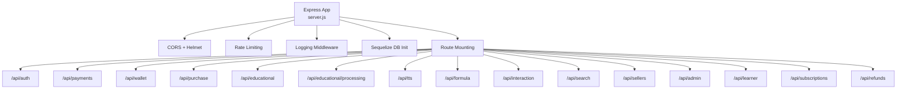
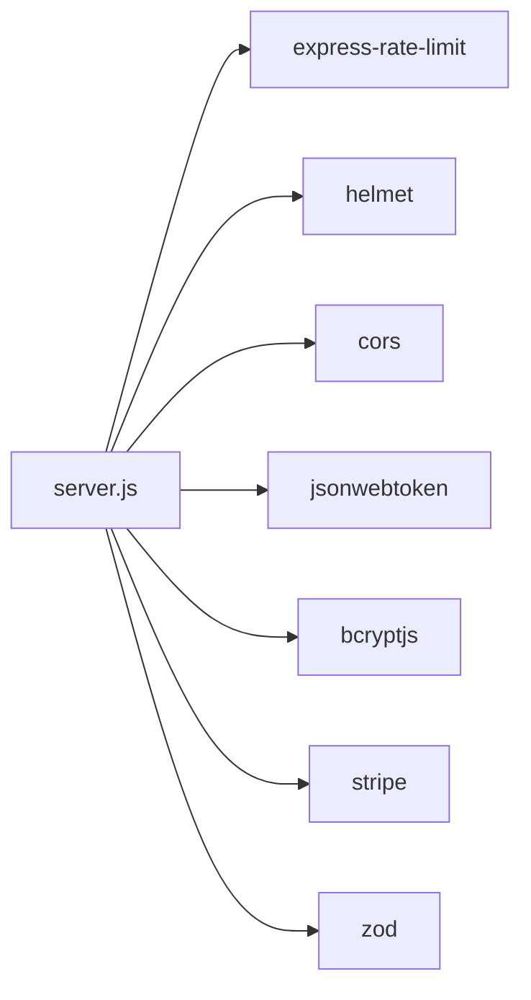
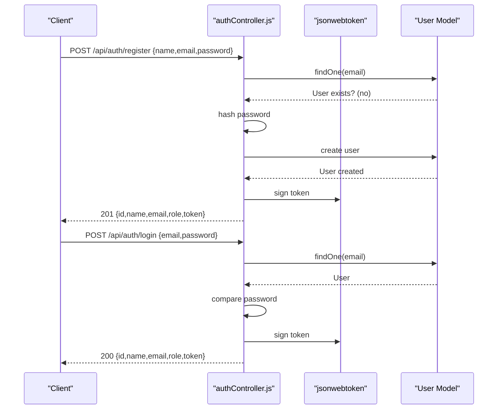
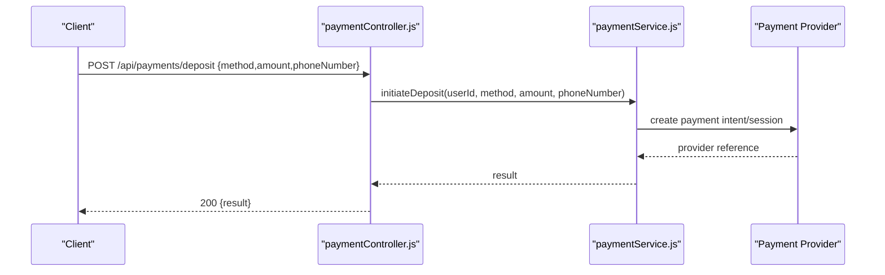
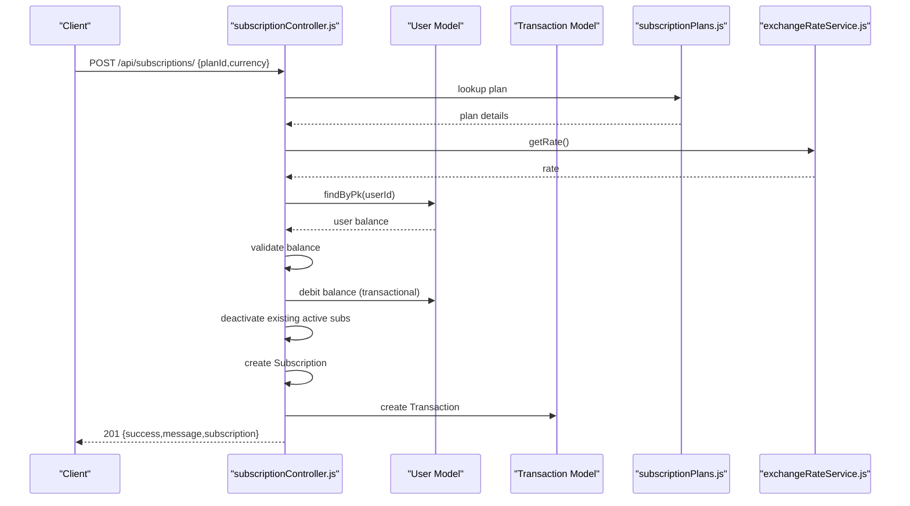
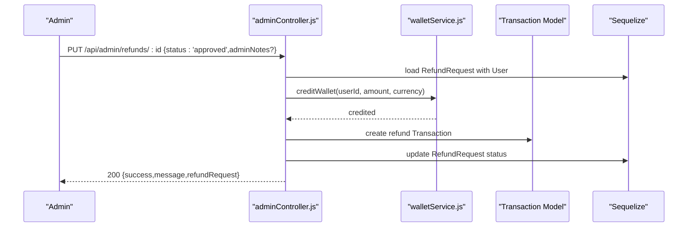

# Backend API Reference

<cite>
**Referenced Files in This Document**
- [server.js](file://backend/server.js)
- [authRoutes.js](file://backend/routes/authRoutes.js)
- [authController.js](file://backend/controllers/authController.js)
- [authMiddleware.js](file://backend/middleware/authMiddleware.js)
- [authSchema.js](file://backend/validation/authSchema.js)
- [paymentRoutes.js](file://backend/routes/paymentRoutes.js)
- [paymentController.js](file://backend/controllers/paymentController.js)
- [walletRoutes.js](file://backend/routes/walletRoutes.js)
- [walletController.js](file://backend/controllers/walletController.js)
- [purchaseRoutes.js](file://backend/routes/purchaseRoutes.js)
- [purchaseController.js](file://backend/controllers/purchaseController.js)
- [subscriptionRoutes.js](file://backend/routes/subscriptionRoutes.js)
- [subscriptionController.js](file://backend/controllers/subscriptionController.js)
- [subscriptionPlans.js](file://backend/config/subscriptionPlans.js)
- [exchangeRateService.js](file://backend/services/exchangeRateService.js)
- [adminRoutes.js](file://backend/routes/adminRoutes.js)
- [adminController.js](file://backend/controllers/adminController.js)
- [refundRoutes.js](file://backend/routes/refundRoutes.js)
- [refundController.js](file://backend/controllers/refundController.js)
- [educationalRoutes.js](file://backend/routes/educational.js)
- [educationalProcessingRoutes.js](file://backend/routes/educationalProcessingRoutes.js)
- [formulaRoutes.js](file://backend/routes/formulaRoutes.js)
- [interactionRoutes.js](file://backend/routes/interactionRoutes.js)
- [searchRoutes.js](file://backend/routes/searchRoutes.js)
- [sellerRoutes.js](file://backend/routes/sellerRoutes.js)
- [learnerRoutes.js](file://backend/routes/learnerRoutes.js)
- [ttsRoutes.js](file://backend/routes/ttsRoutes.js)
- [walletRoutes.js](file://backend/routes/walletRoutes.js)
- [package.json](file://backend/package.json)
</cite>

## Table of Contents
1. [Introduction](#introduction)
2. [Project Structure](#project-structure)
3. [Core Components](#core-components)
4. [Architecture Overview](#architecture-overview)
5. [Detailed Component Analysis](#detailed-component-analysis)
6. [Dependency Analysis](#dependency-analysis)
7. [Performance Considerations](#performance-considerations)
8. [Troubleshooting Guide](#troubleshooting-guide)
9. [Conclusion](#conclusion)
10. [Appendices](#appendices)

## Introduction
This document provides a comprehensive API reference for the QuantumMint Bookstore backend. It covers authentication, user management, content-related services, payment processing, subscription services, and administrative functions. For each endpoint, you will find HTTP methods, URL patterns, request/response schemas, authentication requirements, and error codes. It also documents the controller-layer architecture, middleware usage, error handling patterns, authentication flow, rate limiting policies, and API versioning strategy. Client integration examples and common usage patterns are included to help developers integrate with the backend effectively.

## Project Structure
The backend is organized around Express.js with modular routing and controller separation. Controllers depend on services and models. Middleware handles cross-cutting concerns such as authentication, error handling, request ID propagation, and logging. Routes define the API surface under the /api/* namespace.

**Diagram sources**
- [server.js:128-142](file://backend/server.js#L128-L142)

**Section sources**
- [server.js:18-155](file://backend/server.js#L18-L155)

## Core Components
- Express server initialization with environment validation, CORS, helmet, JSON parsing, and rate limiting.
- Middleware stack: request ID, logging, authentication, and centralized error handling.
- Route registration under /api/* namespaces.
- Database connectivity via Sequelize with support for MySQL/PostgreSQL and SQLite fallback.
- Background worker initialization for subscription tasks.

Key runtime behaviors:
- Environment variables validated at startup; missing variables flagged as warnings.
- Rate limiting applies globally to all requests.
- Logging includes correlation ID, method, URL, status, duration, and IP.
- Database connection attempts with automatic synchronization.

**Section sources**
- [server.js:11-155](file://backend/server.js#L11-L155)

## Architecture Overview
The backend follows a layered architecture:
- HTTP Layer: Express routes and controllers.
- Service Layer: Business logic encapsulated in services.
- Persistence Layer: Sequelize models and database.
- External Integrations: Payment providers (Stripe, mobile money), TTS, analytics, and caching.

```mermaid
graph TB
subgraph "HTTP Layer"
R1["authRoutes.js"]
R2["paymentRoutes.js"]
R3["walletRoutes.js"]
R4["purchaseRoutes.js"]
R5["subscriptionRoutes.js"]
R6["adminRoutes.js"]
R7["refundRoutes.js"]
R8["educationalRoutes.js"]
R9["educationalProcessingRoutes.js"]
R10["formulaRoutes.js"]
R11["interactionRoutes.js"]
R12["searchRoutes.js"]
R13["sellerRoutes.js"]
R14["learnerRoutes.js"]
R15["ttsRoutes.js"]
end
subgraph "Controllers"
C1["authController.js"]
C2["paymentController.js"]
C3["walletController.js"]
C4["purchaseController.js"]
C5["subscriptionController.js"]
C6["adminController.js"]
C7["refundController.js"]
end
subgraph "Services"
S1["paymentService.js"]
S2["walletService.js"]
S3["purchaseService.js"]
S4["educationalContentService.js"]
S5["exchangeRateService.js"]
end
subgraph "Models"
M1["User"]
M2["Book"]
M3["Seller"]
M4["Subscription"]
M5["Transaction"]
M6["RefundRequest"]
end
R1 --> C1
R2 --> C2
R3 --> C3
R4 --> C4
R5 --> C5
R6 --> C6
R7 --> C7
C1 --> M1
C2 --> M1
C3 --> M1
C4 --> M1
C5 --> M1
C6 --> M1
C7 --> M1
C2 --> S1
C3 --> S2
C4 --> S3
C5 --> S5
C6 --> S2
C7 --> S2
C1 --> M1
C2 --> M1
C3 --> M1
C4 --> M1
C5 --> M1
C6 --> M1
C7 --> M1
```

**Diagram sources**
- [server.js:110-142](file://backend/server.js#L110-L142)
- [authRoutes.js:1-11](file://backend/routes/authRoutes.js#L1-L11)
- [paymentRoutes.js:1-22](file://backend/routes/paymentRoutes.js#L1-L22)
- [walletRoutes.js:1-11](file://backend/routes/walletRoutes.js#L1-L11)
- [purchaseRoutes.js:1-10](file://backend/routes/purchaseRoutes.js#L1-L10)
- [subscriptionRoutes.js:1-18](file://backend/routes/subscriptionRoutes.js#L1-L18)
- [adminRoutes.js:1-107](file://backend/routes/adminRoutes.js#L1-L107)
- [refundRoutes.js](file://backend/routes/refundRoutes.js)
- [educationalRoutes.js](file://backend/routes/educational.js)
- [educationalProcessingRoutes.js](file://backend/routes/educationalProcessingRoutes.js)
- [formulaRoutes.js](file://backend/routes/formulaRoutes.js)
- [interactionRoutes.js](file://backend/routes/interactionRoutes.js)
- [searchRoutes.js](file://backend/routes/searchRoutes.js)
- [sellerRoutes.js](file://backend/routes/sellerRoutes.js)
- [learnerRoutes.js](file://backend/routes/learnerRoutes.js)
- [ttsRoutes.js](file://backend/routes/ttsRoutes.js)

## Detailed Component Analysis

### Authentication API
Endpoints:
- POST /api/auth/register
  - Description: Registers a new user.
  - Authentication: None.
  - Request body: name, email, password.
  - Response: id, name, email, role, token.
  - Validation: Zod schemas applied; duplicate email check.
  - Errors: 400 for invalid input or existing user; 500 on server error.
- POST /api/auth/login
  - Description: Authenticates user and returns JWT.
  - Authentication: None.
  - Request body: email, password.
  - Response: id, name, email, role, token.
  - Errors: 400 for invalid credentials; 500 on server error.
- GET /api/auth/me
  - Description: Retrieves currently authenticated user profile (excluding sensitive fields).
  - Authentication: Bearer token required.
  - Response: User object excluding password.
  - Errors: 401 for missing/invalid token; 404 if user not found; 500 on server error.

Authentication flow:
- Clients send credentials to login; server responds with JWT.
- Subsequent requests include Authorization: Bearer <token>.
- Middleware validates token signature and HS256 algorithm.

Security notes:
- JWT_SECRET must be set in production; otherwise startup is blocked.
- Token verification enforces HS256 only.

Example request (login):
- POST https://host/api/auth/login
- Headers: Content-Type: application/json
- Body: { "email": "...", "password": "..." }

Example response (login):
- 200 OK
- Body: { "id": "...", "name": "...", "email": "...", "role": "...", "token": "..." }

**Section sources**
- [authRoutes.js:1-11](file://backend/routes/authRoutes.js#L1-L11)
- [authController.js:30-121](file://backend/controllers/authController.js#L30-L121)
- [authMiddleware.js:1-36](file://backend/middleware/authMiddleware.js#L1-L36)
- [authSchema.js](file://backend/validation/authSchema.js)

### Payment API
Endpoints:
- POST /api/payments/deposit
  - Description: Initiates a deposit via selected payment method.
  - Authentication: Required.
  - Request body: method, amount, phoneNumber.
  - Response: Provider-specific result.
  - Errors: 400 for invalid input; 500 on server error.
- POST /api/payments/withdraw
  - Description: Initiates a withdrawal via selected payment method.
  - Authentication: Required.
  - Request body: method, amount, phoneNumber.
  - Response: Provider-specific result.
  - Errors: 400 for invalid input; 500 on server error.
- GET /api/payments/stripe/connect
  - Description: Generates Stripe Connect OAuth URL for the authenticated user.
  - Authentication: Required.
  - Response: { connectUrl }.
- GET /api/payments/stripe/callback
  - Description: Stripe OAuth callback endpoint (no auth).
  - Authentication: Not required.
  - Response: Redirects to frontend with status query param.
- DELETE /api/payments/stripe/disconnect
  - Description: Disconnects Stripe account for the authenticated user.
  - Authentication: Required.
  - Response: { success, message }.
- POST /api/payments/webhooks/orange
- POST /api/payments/webhooks/afrimoney
- POST /api/payments/webhooks/qmoney
  - Description: Mobile money webhooks (no auth).
  - Authentication: Not required.
  - Request body: Provider-specific payload.
  - Response: Acknowledgement result.
  - Security: Optional webhook secret enforcement in production via header.
- POST /api/payments/webhooks/stripe
  - Description: Stripe webhook endpoint (no auth).
  - Authentication: Not required.
  - Request body: application/json (raw).
  - Response: Acknowledgement result.
  - Security: Requires STRIPE_WEBHOOK_SECRET and Stripe SDK availability; signature verification performed.

Example request (deposit):
- POST https://host/api/payments/deposit
- Headers: Authorization: Bearer <token>, Content-Type: application/json
- Body: { "method": "orange", "amount": 10000, "phoneNumber": "+NNXXXXXXXXX" }

Example response (deposit):
- 200 OK
- Body: { /* provider result */ }

Stripe OAuth flow:
- Client calls GET /api/payments/stripe/connect to receive a connectUrl.
- User completes OAuth on Stripe’s site.
- Stripe redirects to GET /api/payments/stripe/callback with code and state.
- Server exchanges code for Stripe account and redirects to frontend.

**Section sources**
- [paymentRoutes.js:1-22](file://backend/routes/paymentRoutes.js#L1-L22)
- [paymentController.js:17-99](file://backend/controllers/paymentController.js#L17-L99)

### Wallet API
Endpoints:
- GET /api/wallet/balance
  - Description: Retrieves user’s wallet balance (USD/SLL).
  - Authentication: Required.
  - Response: Balance object (fields depend on service implementation).
  - Errors: 500 on server error.
- GET /api/wallet/transactions
  - Description: Lists user’s transaction history with pagination/query filters.
  - Authentication: Required.
  - Query parameters: limit, offset, type, status, currency.
  - Response: Paginated transactions array.
  - Errors: 500 on server error.

Example request (transactions):
- GET https://host/api/wallet/transactions?limit=20&offset=0
- Headers: Authorization: Bearer <token>

Example response (transactions):
- 200 OK
- Body: { /* array of transactions */ }

**Section sources**
- [walletRoutes.js:1-11](file://backend/routes/walletRoutes.js#L1-L11)
- [walletController.js:1-17](file://backend/controllers/walletController.js#L1-L17)

### Purchase API
Endpoints:
- POST /api/purchase/
  - Description: Purchases a book using wallet funds.
  - Authentication: Required.
  - Request body: bookId, amount, currency.
  - Response: { success, message, ...provider result }.
  - Errors: 400 for insufficient balance or invalid input; 500 on server error.

Example request (purchase):
- POST https://host/api/purchase/
- Headers: Authorization: Bearer <token>, Content-Type: application/json
- Body: { "bookId": "...", "amount": 10000, "currency": "SLL" }

Example response (purchase):
- 200 OK
- Body: { "success": true, "message": "Purchase successful", /* details */ }

**Section sources**
- [purchaseRoutes.js:1-10](file://backend/routes/purchaseRoutes.js#L1-L10)
- [purchaseController.js:1-13](file://backend/controllers/purchaseController.js#L1-L13)

### Subscription API
Endpoints:
- GET /api/subscriptions/plans
  - Description: Lists subscription plans with live USD↔SLL conversions.
  - Authentication: Not required.
  - Response: { plans: [...], exchangeRate }.
  - Errors: 500 on server error.
- GET /api/subscriptions/current
  - Description: Gets the user’s active subscription (auto-expired ones return null).
  - Authentication: Required.
  - Response: Subscription object or null.
  - Errors: 500 on server error.
- POST /api/subscriptions/
  - Description: Creates a new subscription by debiting the user’s wallet.
  - Authentication: Required.
  - Request body: planId, currency.
  - Response: { success, message, subscription }.
  - Errors: 400 for invalid plan or insufficient balance; 500 on server error.
- POST /api/subscriptions/cancel
  - Description: Cancels the active subscription (disables auto-renew).
  - Authentication: Required.
  - Response: { success, message }.
  - Errors: 404 if no active subscription; 500 on server error.
- GET /api/subscriptions/history
  - Description: Lists subscription history for the user.
  - Authentication: Required.
  - Response: Array of subscriptions.
  - Errors: 500 on server error.

Plan pricing and currency:
- Prices are canonical in SLL; USD prices are provided alongside live conversion using exchangeRateService.
- Currency selection determines which balance is debited.

**Section sources**
- [subscriptionRoutes.js:1-18](file://backend/routes/subscriptionRoutes.js#L1-L18)
- [subscriptionController.js:7-171](file://backend/controllers/subscriptionController.js#L7-L171)
- [subscriptionPlans.js](file://backend/config/subscriptionPlans.js)
- [exchangeRateService.js](file://backend/services/exchangeRateService.js)

### Administrative API
Endpoints:
- GET /api/admin/sellers
  - Description: Lists all sellers with associated user info.
  - Authentication: Required + admin role.
  - Response: Array of sellers.
  - Errors: 500 on server error.
- PUT /api/admin/sellers/:id/status
  - Description: Updates seller verification status; optionally sets commissionRate.
  - Authentication: Required + admin role.
  - Request body: { status, commissionRate?, rejectionReason? }.
  - Response: { success, seller }.
  - Errors: 404 if seller not found; 500 on server error.
- GET /api/admin/books
  - Description: Lists all books with seller/user info.
  - Authentication: Required + admin role.
  - Response: Array of books.
  - Errors: 500 on server error.
- PUT /api/admin/books/:id/status
  - Description: Updates book moderation status; stores rejection reason if rejected.
  - Authentication: Required + admin role.
  - Request body: { status, rejectionReason? }.
  - Response: { success, book }.
  - Errors: 404 if book not found; 500 on server error.
- POST /api/admin/books/bulk-status
  - Description: Bulk updates book moderation status.
  - Authentication: Required + admin role.
  - Request body: { ids: string[], status, rejectionReason? }.
  - Response: { success, count }.
  - Errors: 400 for invalid IDs; 500 on server error.
- GET /api/admin/users
  - Description: Lists all users for wallet management.
  - Authentication: Required + admin role.
  - Response: Array of users with balances.
  - Errors: 500 on server error.
- POST /api/admin/users/adjust-balance
  - Description: Adjusts user wallet balance (credits/debits).
  - Authentication: Required + admin role.
  - Request body: { userId, amount, currency, type?, description? }.
  - Response: { success, balance }.
  - Errors: 404 if user not found; 400 for invalid amount; 500 on server error.
- PUT /api/admin/users/role
  - Description: Updates user role.
  - Authentication: Required + admin role.
  - Request body: { userId, role }.
  - Response: { success, role }.
  - Errors: 404 if user not found; 500 on server error.
- GET /api/admin/stats
  - Description: Platform statistics including counts and calculated revenue.
  - Authentication: Required + admin role.
  - Response: { totalSellers, pendingSellers, totalBooks, pendingBooks, platformRevenueUSD, platformRevenueSLL }.
  - Errors: 500 on server error.
- GET /api/admin/logs
  - Description: Retrieves audit logs with optional filtering (action, targetId).
  - Authentication: Required + admin role.
  - Query parameters: action, targetId, limit, offset.
  - Response: { logs, total, limit, offset }.
  - Errors: 500 on server error.
- GET /api/admin/health
  - Description: System health status including external service checks.
  - Authentication: Required + admin role.
  - Response: { status, services[] }.
  - Errors: 500 if database unreachable.
- GET /api/admin/payouts
  - Description: Lists pending withdrawal requests.
  - Authentication: Required + admin role.
  - Response: Array of transactions with user info.
  - Errors: 500 on server error.
- PUT /api/admin/payouts/:id
  - Description: Approves or rejects a payout; on rejection, refunds user.
  - Authentication: Required + admin role.
  - Request body: { status: 'approved'|'rejected', rejectionReason? }.
  - Response: { success, transaction }.
  - Errors: 404 if not found; 400 if already processed; 500 on server error.
- POST /api/admin/gift-book
  - Description: Gifts a book to a single user or all users.
  - Authentication: Required + admin role.
  - Request body: { bookId, userId?, recipientType: 'all'|'individual', message? }.
  - Response: { success, message }.
  - Errors: 404 if book not found; 400 for missing userId in individual mode; 500 on server error.
- GET /api/admin/refunds
  - Description: Lists refund requests with optional status filter.
  - Authentication: Required + admin role.
  - Query parameters: status, limit, offset.
  - Response: { refunds, total, limit, offset }.
  - Errors: 500 on server error.
- PUT /api/admin/refunds/:id
  - Description: Approves or rejects a refund request; on approval, credits user wallet and records refund transaction.
  - Authentication: Required + admin role.
  - Request body: { status: 'approved'|'rejected', adminNotes? }.
  - Response: { success, message, refundRequest }.
  - Errors: 404 if not found; 400 if already processed or invalid status; 500 on server error.

Audit logging:
- All admin actions are recorded in AuditLog with details and correlation to adminId.

**Section sources**
- [adminRoutes.js:1-107](file://backend/routes/adminRoutes.js#L1-L107)
- [adminController.js:1-599](file://backend/controllers/adminController.js#L1-L599)

### Refund API
Endpoints:
- POST /api/refunds/request
  - Description: Submits a refund request for a purchase.
  - Authentication: Required.
  - Request body: { purchaseId, reason }.
  - Response: { success, message, refundRequest }.
  - Errors: 404 if purchase not found; 500 on server error.
- GET /api/refunds/my-requests
  - Description: Lists the authenticated user’s refund requests.
  - Authentication: Required.
  - Response: Array of refund requests.
  - Errors: 500 on server error.

Note: The refund routes file is present in the repository; however, the controller implementation is not visible in the provided context. The endpoints above reflect the intended API surface as defined by the routes.

**Section sources**
- [refundRoutes.js](file://backend/routes/refundRoutes.js)

### Additional Feature APIs
The backend exposes several specialized routes under /api/* for educational content, formulas, interactions, search, sellers, learners, and TTS. These are mounted similarly and protected by authentication where applicable. Consult the route files for exact patterns and controller responsibilities.

**Section sources**
- [educationalRoutes.js](file://backend/routes/educational.js)
- [educationalProcessingRoutes.js](file://backend/routes/educationalProcessingRoutes.js)
- [formulaRoutes.js](file://backend/routes/formulaRoutes.js)
- [interactionRoutes.js](file://backend/routes/interactionRoutes.js)
- [searchRoutes.js](file://backend/routes/searchRoutes.js)
- [sellerRoutes.js](file://backend/routes/sellerRoutes.js)
- [learnerRoutes.js](file://backend/routes/learnerRoutes.js)
- [ttsRoutes.js](file://backend/routes/ttsRoutes.js)

## Dependency Analysis
External dependencies relevant to API behavior:
- express-rate-limit: Global rate limiting policy.
- helmet: Security headers.
- cors: Cross-origin policy with credentials and allowed headers.
- jsonwebtoken: JWT generation and verification.
- bcryptjs: Password hashing.
- stripe: Stripe webhook verification and Connect OAuth.
- zod: Request validation schemas.

**Diagram sources**
- [server.js:1-10](file://backend/server.js#L1-L10)
- [package.json:16-40](file://backend/package.json#L16-L40)

**Section sources**
- [package.json:16-40](file://backend/package.json#L16-L40)

## Performance Considerations
- Rate limiting: 120 requests per 15 minutes per IP globally.
- JSON payload limits: 10kb for JSON and URL-encoded bodies.
- Database pooling: Max 5 connections with idle/acquire timeouts.
- Logging overhead: Structured logging with correlation ID; ensure log level tuned for production.
- Webhook verification: Stripe signatures verified only when secret is configured; missing secret disables verification.

[No sources needed since this section provides general guidance]

## Troubleshooting Guide
Common issues and resolutions:
- Missing JWT_SECRET in production: Startup fails to prevent insecure operation. Set JWT_SECRET and restart.
- Invalid or missing Authorization header: 401 responses for protected endpoints.
- Token verification failures: 401 responses; ensure HS256 algorithm and correct secret.
- Insufficient wallet balance: Subscription/Purchase endpoints return 400 with “Insufficient balance”.
- Database connection failures: Health checks and startup logs indicate connection problems; verify DB_HOST, DB_NAME, DB_USER, DB_PASS, DB_PORT, DB_DIALECT.
- Stripe webhook verification disabled: If STRIPE_WEBHOOK_SECRET is not set or Stripe SDK unavailable, webhook handler returns 503.
- Mobile money webhook secret mismatch: 401 returned when X-WEBHOOK-SECRET does not match configured secret in production.

**Section sources**
- [authController.js:6-19](file://backend/controllers/authController.js#L6-L19)
- [authMiddleware.js:15-24](file://backend/middleware/authMiddleware.js#L15-L24)
- [subscriptionController.js:48-51](file://backend/controllers/subscriptionController.js#L48-L51)
- [server.js:97-108](file://backend/server.js#L97-L108)
- [paymentController.js:74-98](file://backend/controllers/paymentController.js#L74-L98)
- [paymentController.js:59-72](file://backend/controllers/paymentController.js#L59-L72)

## Conclusion
The QuantumMint Bookstore backend provides a robust, layered API with clear separation of concerns. Authentication relies on JWT with strict verification, while payment processing integrates multiple providers and webhook verification. Subscription and wallet services are designed with atomic operations and audit trails. Administrative endpoints offer comprehensive oversight with audit logging. The architecture supports scalability via rate limiting, structured logging, and modular services.

[No sources needed since this section summarizes without analyzing specific files]

## Appendices

### Authentication Flow

**Diagram sources**
- [authController.js:30-107](file://backend/controllers/authController.js#L30-L107)

### Payment Deposit Flow

**Diagram sources**
- [paymentController.js:17-24](file://backend/controllers/paymentController.js#L17-L24)

### Subscription Creation Flow

**Diagram sources**
- [subscriptionController.js:34-109](file://backend/controllers/subscriptionController.js#L34-L109)
- [subscriptionPlans.js](file://backend/config/subscriptionPlans.js)
- [exchangeRateService.js](file://backend/services/exchangeRateService.js)

### Admin Refund Approval Flow

**Diagram sources**
- [adminController.js:527-597](file://backend/controllers/adminController.js#L527-L597)

### API Versioning Strategy
- No explicit API versioning is implemented in the server.js or routes. The base path is /api/* without a version segment.
- Recommendations:
  - Adopt /api/v1/* and introduce /api/v2/* upon breaking changes.
  - Maintain backward compatibility windows with deprecation notices.
  - Use Accept-Version headers or path-based versioning consistently.

[No sources needed since this section provides general guidance]

### Rate Limiting Policy
- Global policy: 120 requests per 15 minutes per IP address.
- Applies to all routes uniformly.
- Headers: Standard headers enabled; legacy headers disabled.

**Section sources**
- [server.js:49-55](file://backend/server.js#L49-L55)

### Client Integration Examples
- Authentication:
  - Register: POST /api/auth/register with { name, email, password }.
  - Login: POST /api/auth/login with { email, password }; store returned token.
  - Protected calls: Include Authorization: Bearer <token>.
- Payments:
  - Deposit: POST /api/payments/deposit with { method, amount, phoneNumber }.
  - Withdraw: POST /api/payments/withdraw with { method, amount, phoneNumber }.
  - Stripe Connect: GET /api/payments/stripe/connect; handle OAuth callback.
- Wallet:
  - Get balance: GET /api/wallet/balance.
  - List transactions: GET /api/wallet/transactions?limit=&offset=&type=&status=&currency=.
- Purchase:
  - Buy book: POST /api/purchase/ with { bookId, amount, currency }.
- Subscriptions:
  - List plans: GET /api/subscriptions/plans.
  - Subscribe: POST /api/subscriptions/ with { planId, currency }.
  - Cancel: POST /api/subscriptions/cancel.
  - View history: GET /api/subscriptions/history.
- Admin (requires admin role):
  - Adjust user balance: POST /api/admin/users/adjust-balance.
  - Process refund: PUT /api/admin/refunds/:id with { status, adminNotes? }.

[No sources needed since this section provides general guidance]