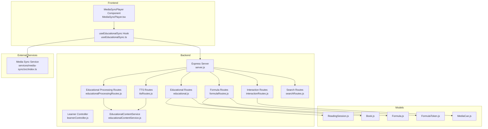
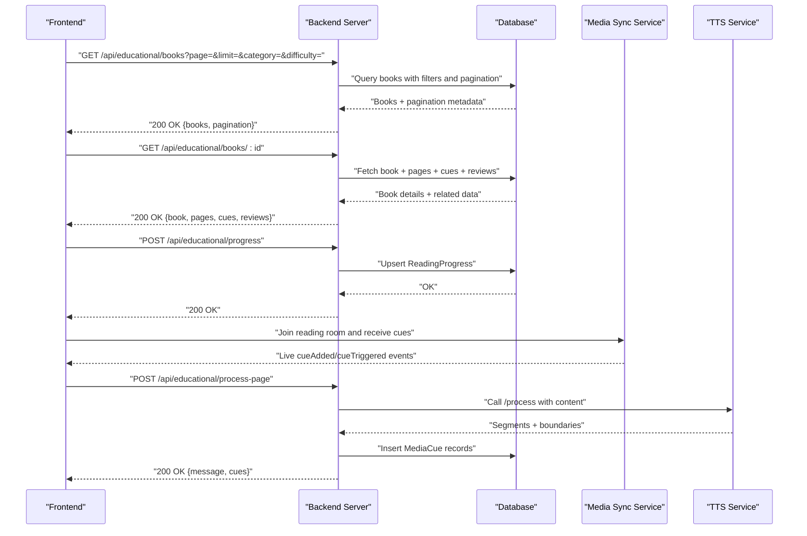
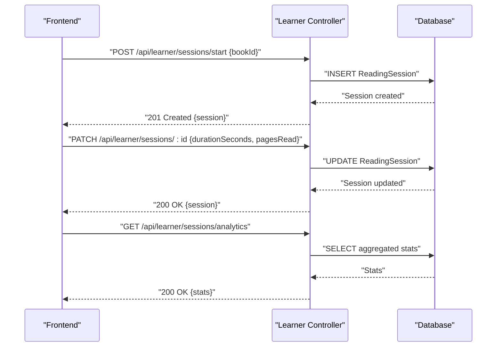
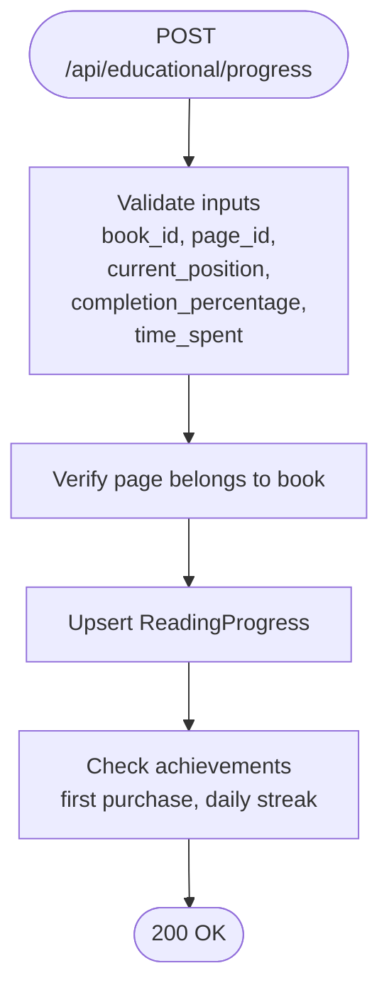
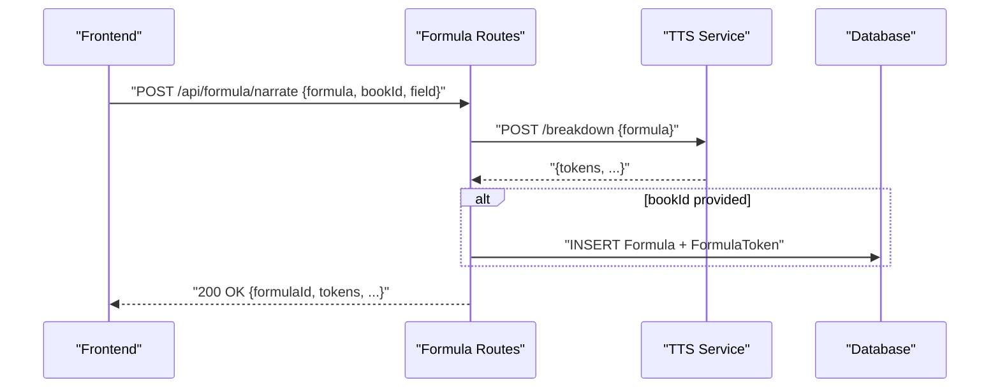
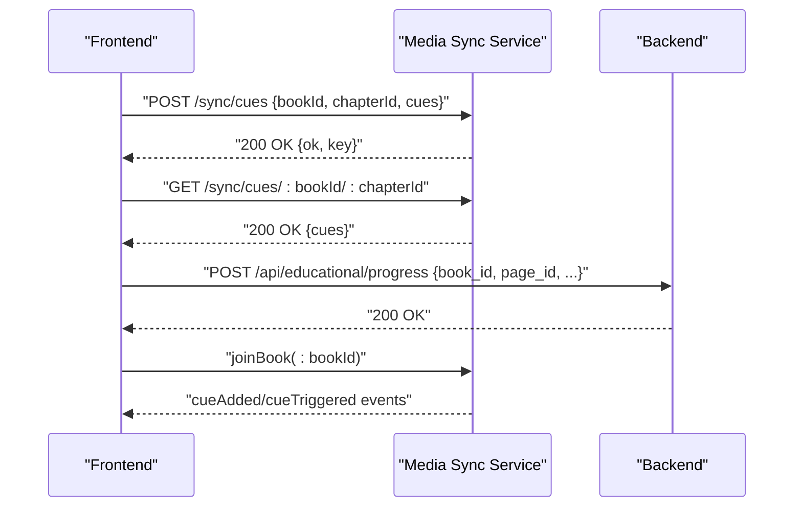
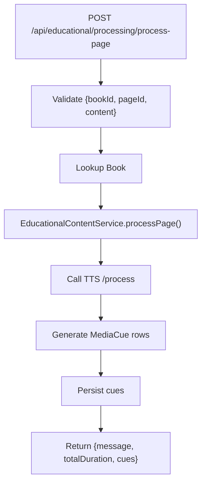
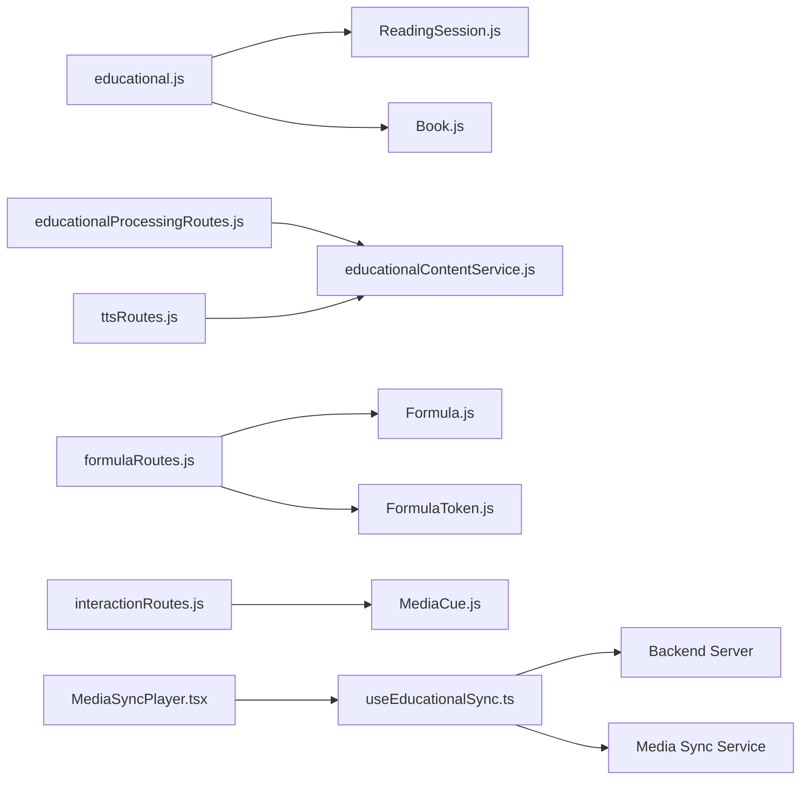

# Content Management API

<cite>
**Referenced Files in This Document**
- [server.js](file://backend/server.js)
- [educational.js](file://backend/routes/educational.js)
- [educationalProcessingRoutes.js](file://backend/routes/educationalProcessingRoutes.js)
- [formulaRoutes.js](file://backend/routes/formulaRoutes.js)
- [ttsRoutes.js](file://backend/routes/ttsRoutes.js)
- [interactionRoutes.js](file://backend/routes/interactionRoutes.js)
- [searchRoutes.js](file://backend/routes/searchRoutes.js)
- [learnerController.js](file://backend/controllers/learnerController.js)
- [educationalContentService.js](file://backend/services/educationalContentService.js)
- [ReadingSession.js](file://backend/models/ReadingSession.js)
- [Book.js](file://backend/models/Book.js)
- [Formula.js](file://backend/models/Formula.js)
- [FormulaToken.js](file://backend/models/FormulaToken.js)
- [MediaCue.js](file://backend/models/MediaCue.js)
- [useEducationalSync.ts](file://frontend/src/hooks/useEducationalSync.ts)
- [MediaSyncPlayer.tsx](file://frontend/src/components/MediaSyncPlayer.tsx)
- [index.ts](file://services/media-sync/src/index.ts)
</cite>

## Table of Contents
1. [Introduction](#introduction)
2. [Project Structure](#project-structure)
3. [Core Components](#core-components)
4. [Architecture Overview](#architecture-overview)
5. [Detailed Component Analysis](#detailed-component-analysis)
6. [Dependency Analysis](#dependency-analysis)
7. [Performance Considerations](#performance-considerations)
8. [Troubleshooting Guide](#troubleshooting-guide)
9. [Conclusion](#conclusion)
10. [Appendices](#appendices)

## Introduction
This document provides comprehensive API documentation for Content Management endpoints focused on educational book catalogs, reading sessions, progress tracking, formula narration, and content synchronization. It covers:
- Catalog browsing and book details retrieval
- Reading session lifecycle and analytics
- Progress tracking and achievements
- Formula narration and tokenization
- Media cue synchronization and real-time collaboration
- Search across the bookstore ecosystem
- Educational content processing workflows and file/text extraction

Endpoints are grouped under the base path /api and include both REST and WebSocket integrations for real-time features.

## Project Structure
The backend exposes REST endpoints via Express and integrates with a media synchronization service and internal TTS service. The frontend integrates with the backend and media sync service to deliver an immersive educational reading experience.

**Diagram sources**
- [server.js:110-142](file://backend/server.js#L110-L142)
- [educational.js:30-479](file://backend/routes/educational.js#L30-L479)
- [educationalProcessingRoutes.js:1-102](file://backend/routes/educationalProcessingRoutes.js#L1-L102)
- [formulaRoutes.js:1-86](file://backend/routes/formulaRoutes.js#L1-L86)
- [ttsRoutes.js:1-177](file://backend/routes/ttsRoutes.js#L1-L177)
- [interactionRoutes.js:1-55](file://backend/routes/interactionRoutes.js#L1-L55)
- [searchRoutes.js:1-26](file://backend/routes/searchRoutes.js#L1-L26)
- [learnerController.js:1-281](file://backend/controllers/learnerController.js#L1-L281)
- [educationalContentService.js:1-181](file://backend/services/educationalContentService.js#L1-L181)
- [ReadingSession.js:1-38](file://backend/models/ReadingSession.js#L1-L38)
- [Book.js:1-92](file://backend/models/Book.js#L1-L92)
- [Formula.js:1-30](file://backend/models/Formula.js#L1-L30)
- [FormulaToken.js:1-38](file://backend/models/FormulaToken.js#L1-L38)
- [MediaCue.js:1-49](file://backend/models/MediaCue.js#L1-L49)
- [useEducationalSync.ts:1-246](file://frontend/src/hooks/useEducationalSync.ts#L1-L246)
- [MediaSyncPlayer.tsx:1-200](file://frontend/src/components/MediaSyncPlayer.tsx#L1-L200)
- [index.ts:1-38](file://services/media-sync/src/index.ts#L1-L38)

**Section sources**
- [server.js:110-142](file://backend/server.js#L110-L142)

## Core Components
- Educational Catalog and Progress
  - Browse books with filters and pagination
  - Retrieve book details with pages, cues, and reviews
  - Track reading progress and compute achievements
- Reading Sessions
  - Start, update, and analyze reading sessions
  - Generate recommendations and leaderboards
- Formula Narration and Tokens
  - Narrate formulas and persist breakdown tokens
  - Retrieve tokens for formula rendering
- Media Synchronization
  - Real-time cue delivery and progress updates
  - Collaborative reading room integration
- Educational Content Processing
  - Automated processing of pages and bulk processing
  - Text extraction from PDF/DOCX/TXT for studio drafts
- Search
  - Deep search across the bookstore ecosystem

**Section sources**
- [educational.js:46-179](file://backend/routes/educational.js#L46-L179)
- [educational.js:269-358](file://backend/routes/educational.js#L269-L358)
- [learnerController.js:119-175](file://backend/controllers/learnerController.js#L119-L175)
- [formulaRoutes.js:14-83](file://backend/routes/formulaRoutes.js#L14-L83)
- [educationalProcessingRoutes.js:12-99](file://backend/routes/educationalProcessingRoutes.js#L12-L99)
- [searchRoutes.js:10-23](file://backend/routes/searchRoutes.js#L10-L23)

## Architecture Overview
The system integrates REST endpoints with a dedicated media synchronization service and an internal TTS service. The frontend connects to the backend for data and to the media sync service for real-time cue events.

**Diagram sources**
- [educational.js:46-117](file://backend/routes/educational.js#L46-L117)
- [educational.js:119-179](file://backend/routes/educational.js#L119-L179)
- [educational.js:295-358](file://backend/routes/educational.js#L295-L358)
- [index.ts:23-36](file://services/media-sync/src/index.ts#L23-L36)
- [educationalProcessingRoutes.js:12-41](file://backend/routes/educationalProcessingRoutes.js#L12-L41)
- [educationalContentService.js:15-91](file://backend/services/educationalContentService.js#L15-L91)

## Detailed Component Analysis

### Educational Catalog Endpoints
- GET /api/educational/books
  - Query parameters:
    - category (string, optional, max length 100)
    - difficulty (enum: beginner, intermediate, advanced, optional)
    - page (integer ≥ 1, default 1)
    - limit (integer 0 < limit ≤ 50, default 20)
  - Response includes:
    - books: array of books with author and category info
    - pagination: page, limit, total, pages
  - Validation:
    - Returns 400 for invalid category/difficulty
    - Limits excessive limits to protect resources
- GET /api/educational/books/:id
  - Path parameter: id (book identifier)
  - Response includes:
    - book details
    - pages ordered by page_number
    - active media cues ordered by timestamp_ms
    - published reviews with reviewer name (limited)
  - Returns 404 if book not found

**Section sources**
- [educational.js:46-117](file://backend/routes/educational.js#L46-L117)
- [educational.js:119-179](file://backend/routes/educational.js#L119-L179)

### Reading Sessions and Analytics
- POST /api/learner/sessions/start
  - Body: { bookId }
  - Creates a new ReadingSession with start time
- PATCH /api/learner/sessions/:id
  - Body: { pagesRead?, durationSeconds? }
  - Updates end time and persists metrics
- GET /api/learner/sessions/analytics
  - Returns aggregated stats: total hours, unique books, recent sessions
- GET /api/learner/recommendations
  - Returns recommended books based on user’s reading categories

**Diagram sources**
- [learnerController.js:119-175](file://backend/controllers/learnerController.js#L119-L175)

**Section sources**
- [learnerController.js:119-175](file://backend/controllers/learnerController.js#L119-L175)
- [ReadingSession.js:1-38](file://backend/models/ReadingSession.js#L1-L38)

### Progress Tracking and Achievements
- GET /api/educational/progress/:bookId
  - Returns latest progress entries for the book
- POST /api/educational/progress
  - Body: { book_id, page_id, current_position, completion_percentage, time_spent }
  - Validates numeric ranges and ensures page belongs to the book
  - Upserts ReadingProgress and triggers achievement checks
- GET /api/educational/achievements
  - Returns all active achievements and user’s earned status
- POST /api/educational/achievements/:achievementId/award
  - Awards an achievement to the authenticated user if eligible

**Diagram sources**
- [educational.js:295-358](file://backend/routes/educational.js#L295-L358)
- [educational.js:360-416](file://backend/routes/educational.js#L360-L416)

**Section sources**
- [educational.js:269-358](file://backend/routes/educational.js#L269-L358)
- [educational.js:181-267](file://backend/routes/educational.js#L181-L267)

### Formula Narration and Tokenization
- POST /api/formula/narrate
  - Body: { formula, bookId?, field? }
  - Calls internal TTS service to break down formula
  - Optionally persists formula and tokens to DB
  - Returns formulaId and breakdown tokens
- GET /api/formula/:id/tokens
  - Returns tokens for a formula ordered by index

**Diagram sources**
- [formulaRoutes.js:14-65](file://backend/routes/formulaRoutes.js#L14-L65)
- [Formula.js:1-30](file://backend/models/Formula.js#L1-L30)
- [FormulaToken.js:1-38](file://backend/models/FormulaToken.js#L1-L38)

**Section sources**
- [formulaRoutes.js:14-83](file://backend/routes/formulaRoutes.js#L14-L83)
- [Formula.js:1-30](file://backend/models/Formula.js#L1-L30)
- [FormulaToken.js:1-38](file://backend/models/FormulaToken.js#L1-L38)

### Media Synchronization and Real-Time Integration
- Media Sync Service
  - POST /sync/cues: store cue map for a book/chapter
  - GET /sync/cues/:bookId/:chapterId: retrieve cue map
- Frontend Integration
  - useEducationalSync hook manages socket connections, cue lists, progress, and real-time updates
  - MediaSyncPlayer component drives audio playback, detects cues around current timestamp, and auto-updates progress

**Diagram sources**
- [index.ts:23-36](file://services/media-sync/src/index.ts#L23-L36)
- [useEducationalSync.ts:88-152](file://frontend/src/hooks/useEducationalSync.ts#L88-L152)
- [MediaSyncPlayer.tsx:48-116](file://frontend/src/components/MediaSyncPlayer.tsx#L48-L116)

**Section sources**
- [index.ts:1-38](file://services/media-sync/src/index.ts#L1-L38)
- [useEducationalSync.ts:1-246](file://frontend/src/hooks/useEducationalSync.ts#L1-L246)
- [MediaSyncPlayer.tsx:1-200](file://frontend/src/components/MediaSyncPlayer.tsx#L1-L200)

### Educational Content Processing
- POST /api/educational/processing/process-page
  - Body: { bookId, pageId, content }
  - Validates book existence and author permissions
  - Delegates to EducationalContentService to analyze and generate cues
  - Returns processing summary and generated cues
- POST /api/educational/processing/process-bulk
  - Body: { bookId, pages[] }
  - Processes pages in small batches to avoid overload
- POST /api/educational/processing/extract-text
  - Upload single file (PDF, DOCX, TXT)
  - Extracts and returns plain text

**Diagram sources**
- [educationalProcessingRoutes.js:12-41](file://backend/routes/educationalProcessingRoutes.js#L12-L41)
- [educationalContentService.js:15-91](file://backend/services/educationalContentService.js#L15-L91)

**Section sources**
- [educationalProcessingRoutes.js:12-99](file://backend/routes/educationalProcessingRoutes.js#L12-L99)
- [educationalContentService.js:1-181](file://backend/services/educationalContentService.js#L1-L181)

### Search Endpoints
- GET /api/search?q=...
  - Requires authenticated user
  - Performs deep search across the bookstore ecosystem
  - Returns structured results

**Section sources**
- [searchRoutes.js:10-23](file://backend/routes/searchRoutes.js#L10-L23)

### TTS Proxy Endpoints
- POST /api/tts/synthesize
  - Proxies synthesis request to internal TTS service with sanitized parameters
- POST /api/tts/multi
  - Multi-voice synthesis
- POST /api/tts/stream
  - Streaming synthesis with audio/mpeg response
- GET /api/tts/stream-url
  - GET-compatible streaming endpoint with token verification
- POST /api/tts/breakdown
  - Formula breakdown via TTS service
- GET /api/tts/voices
  - Lists available voices

**Section sources**
- [ttsRoutes.js:14-177](file://backend/routes/ttsRoutes.js#L14-L177)

### Learner Interactions
- POST /api/interaction
  - Logs learner interactions (e.g., tap, replay, expand) with metadata
- GET /api/interaction/analytics
  - Retrieves recent interactions optionally filtered by bookId or userId

**Section sources**
- [interactionRoutes.js:10-52](file://backend/routes/interactionRoutes.js#L10-L52)

## Dependency Analysis
- Route-to-Service Dependencies
  - Educational routes depend on database models and EducationalContentService for processing
  - Formula routes depend on TTS service and persist tokens
  - TTS routes act as proxies to internal TTS service
  - Interaction routes manage learner analytics via LearnerInteraction model
- Frontend-to-Backend Coupling
  - useEducationalSync integrates with both REST endpoints and the media sync service
  - MediaSyncPlayer orchestrates playback and cue-triggering logic

**Diagram sources**
- [educational.js:30-479](file://backend/routes/educational.js#L30-L479)
- [educationalProcessingRoutes.js:1-102](file://backend/routes/educationalProcessingRoutes.js#L1-L102)
- [formulaRoutes.js:1-86](file://backend/routes/formulaRoutes.js#L1-L86)
- [ttsRoutes.js:1-177](file://backend/routes/ttsRoutes.js#L1-L177)
- [interactionRoutes.js:1-55](file://backend/routes/interactionRoutes.js#L1-L55)
- [useEducationalSync.ts:1-246](file://frontend/src/hooks/useEducationalSync.ts#L1-L246)
- [MediaSyncPlayer.tsx:1-200](file://frontend/src/components/MediaSyncPlayer.tsx#L1-L200)

**Section sources**
- [server.js:110-142](file://backend/server.js#L110-L142)

## Performance Considerations
- Pagination and Limits
  - Catalog endpoints cap limit to 50 and default to 20 to prevent heavy queries
- Input Validation
  - Numeric ranges validated for progress updates to prevent abuse
- Batch Processing
  - Bulk processing uses small batches to avoid overloading downstream services
- Rate Limiting
  - Global rate limiter applied at the Express layer
- Caching
  - Consider Redis caching for frequently accessed book metadata and cues
- Database Indexing
  - Ensure indexes on ReadingProgress (user_id, book_id), MediaCue (book_id, page_id), and UserReviews (book_id)

[No sources needed since this section provides general guidance]

## Troubleshooting Guide
- Authentication Required
  - Many endpoints require a valid JWT; ensure Authorization header is present
- Validation Errors
  - Missing or invalid parameters return 400; check query/body fields
- Resource Not Found
  - 404 indicates missing book, session, or achievement
- Service Unavailable
  - TTS and media sync services may be unreachable; verify service URLs and container health
- CORS Issues
  - Ensure frontend origin is whitelisted in CORS configuration

**Section sources**
- [educational.js:46-117](file://backend/routes/educational.js#L46-L117)
- [educational.js:295-358](file://backend/routes/educational.js#L295-L358)
- [educationalProcessingRoutes.js:12-41](file://backend/routes/educationalProcessingRoutes.js#L12-L41)
- [ttsRoutes.js:14-51](file://backend/routes/ttsRoutes.js#L14-L51)
- [server.js:22-28](file://backend/server.js#L22-L28)

## Conclusion
The Content Management API provides a robust foundation for educational book discovery, immersive reading experiences, and intelligent content processing. By leveraging media synchronization, formula narration, and structured progress tracking, it enables personalized and adaptive learning journeys. The documented endpoints and integrations offer clear pathways for frontend developers to build interactive readers and backend teams to maintain scalable, secure, and performant services.

[No sources needed since this section summarizes without analyzing specific files]

## Appendices

### Endpoint Reference Summary
- Catalog
  - GET /api/educational/books (filters: category, difficulty; pagination: page, limit)
  - GET /api/educational/books/:id
- Reading Sessions and Progress
  - POST /api/learner/sessions/start
  - PATCH /api/learner/sessions/:id
  - GET /api/learner/sessions/analytics
  - GET /api/educational/progress/:bookId
  - POST /api/educational/progress
  - GET /api/educational/achievements
  - POST /api/educational/achievements/:achievementId/award
- Formula Narration
  - POST /api/formula/narrate
  - GET /api/formula/:id/tokens
- Media Sync
  - POST /api/educational/processing/process-page
  - POST /api/educational/processing/process-bulk
  - POST /api/educational/processing/extract-text
- TTS Proxy
  - POST /api/tts/synthesize
  - POST /api/tts/multi
  - POST /api/tts/stream
  - GET /api/tts/stream-url
  - POST /api/tts/breakdown
  - GET /api/tts/voices
- Interactions
  - POST /api/interaction
  - GET /api/interaction/analytics
- Search
  - GET /api/search?q=...

**Section sources**
- [educational.js:46-179](file://backend/routes/educational.js#L46-L179)
- [learnerController.js:119-175](file://backend/controllers/learnerController.js#L119-L175)
- [formulaRoutes.js:14-83](file://backend/routes/formulaRoutes.js#L14-L83)
- [educationalProcessingRoutes.js:12-99](file://backend/routes/educationalProcessingRoutes.js#L12-L99)
- [ttsRoutes.js:14-177](file://backend/routes/ttsRoutes.js#L14-L177)
- [interactionRoutes.js:10-52](file://backend/routes/interactionRoutes.js#L10-L52)
- [searchRoutes.js:10-23](file://backend/routes/searchRoutes.js#L10-L23)