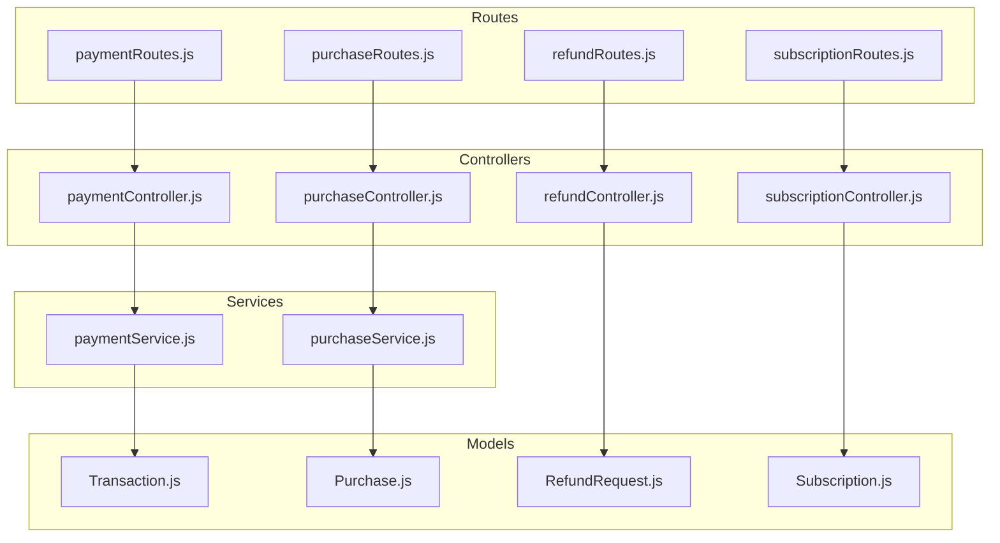
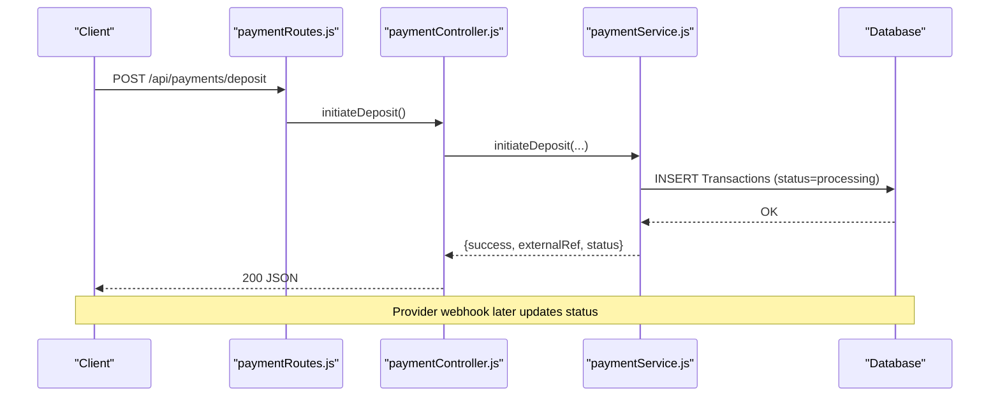
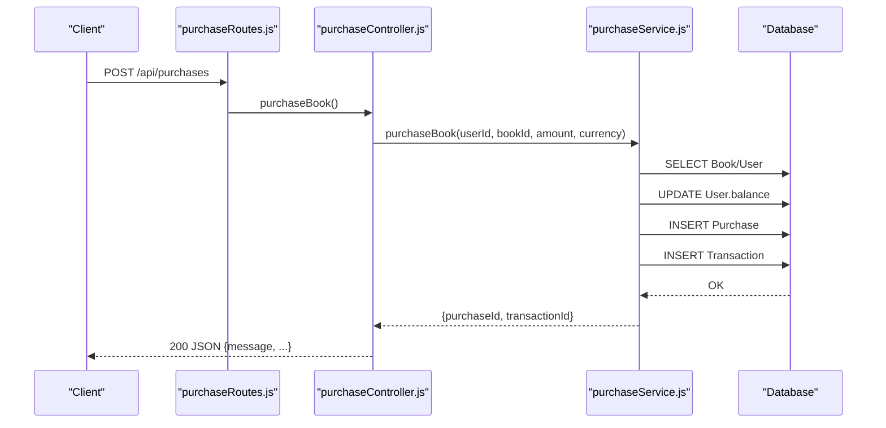
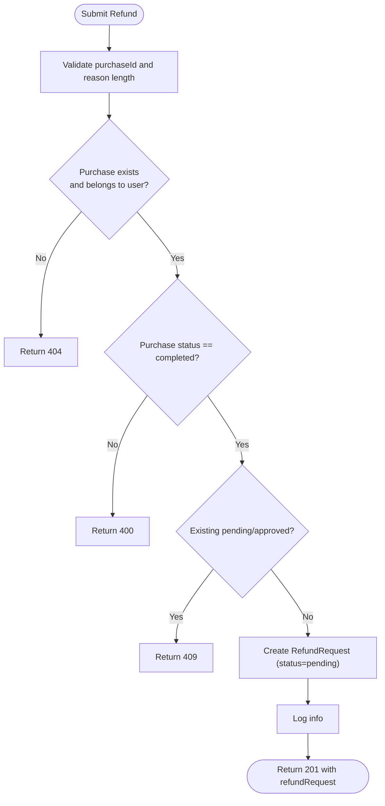
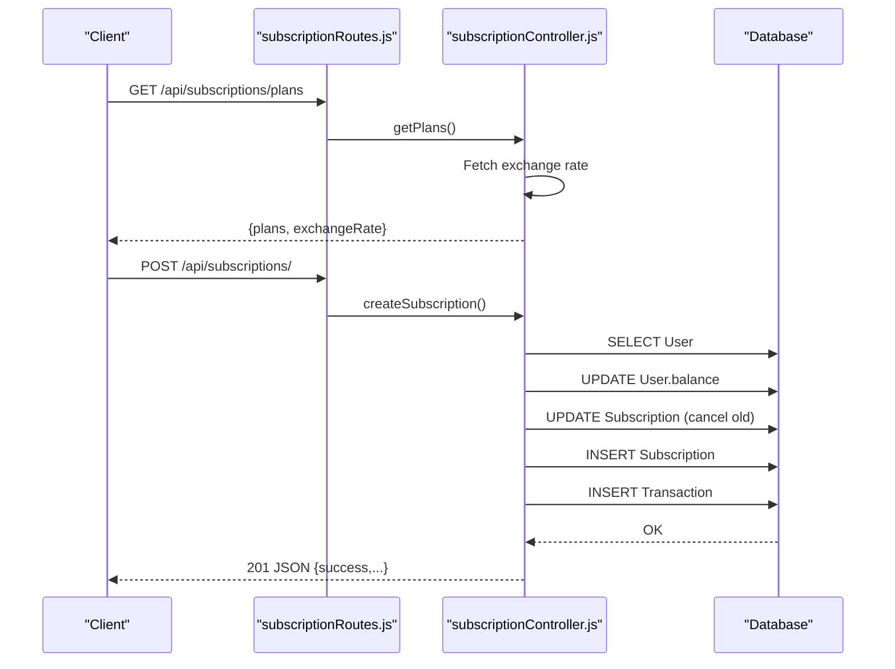
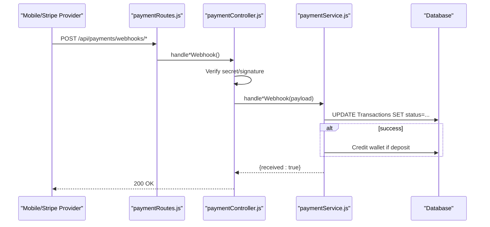
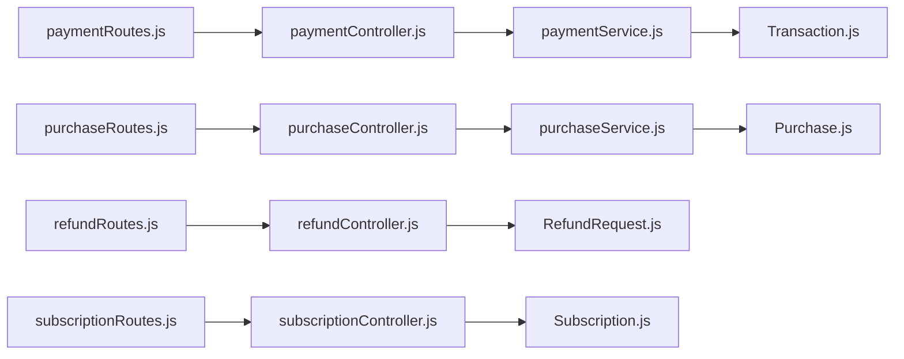

# Payment Processing API

<cite>
**Referenced Files in This Document**
- [paymentController.js](file://backend/controllers/paymentController.js)
- [paymentRoutes.js](file://backend/routes/paymentRoutes.js)
- [paymentService.js](file://backend/services/paymentService.js)
- [purchaseController.js](file://backend/controllers/purchaseController.js)
- [purchaseRoutes.js](file://backend/routes/purchaseRoutes.js)
- [purchaseService.js](file://backend/services/purchaseService.js)
- [refundController.js](file://backend/controllers/refundController.js)
- [refundRoutes.js](file://backend/routes/refundRoutes.js)
- [subscriptionController.js](file://backend/controllers/subscriptionController.js)
- [subscriptionRoutes.js](file://backend/routes/subscriptionRoutes.js)
- [subscriptionPlans.js](file://backend/config/subscriptionPlans.js)
- [Purchase.js](file://backend/models/Purchase.js)
- [Transaction.js](file://backend/models/Transaction.js)
- [RefundRequest.js](file://backend/models/RefundRequest.js)
- [Subscription.js](file://backend/models/Subscription.js)
</cite>

## Table of Contents
1. [Introduction](#introduction)
2. [Project Structure](#project-structure)
3. [Core Components](#core-components)
4. [Architecture Overview](#architecture-overview)
5. [Detailed Component Analysis](#detailed-component-analysis)
6. [Dependency Analysis](#dependency-analysis)
7. [Performance Considerations](#performance-considerations)
8. [Troubleshooting Guide](#troubleshooting-guide)
9. [Conclusion](#conclusion)
10. [Appendices](#appendices)

## Introduction
This document provides comprehensive API documentation for the Payment Processing system, covering:
- Purchase endpoints for initiating transactions
- Payment processing via mobile money and Stripe
- Order confirmation flows
- Subscription billing endpoints
- Refund processing
- Webhook handling for payment status updates
- Currency conversion and international support
- Payment method validation rules
- Secure payment flows and PCI considerations

The system supports:
- Mobile money methods (Orange Money, Afrimoney, Qmoney) with provider webhooks
- Stripe Connect for card payments and payouts
- One-time purchases using internal wallet balances
- Subscription billing with automatic renewal controls
- Learner-facing refund requests with administrative review

## Project Structure
The payment system is organized by controllers, routes, services, and models:
- Controllers expose HTTP endpoints and delegate to services
- Routes define protected/unprotected endpoints and middleware
- Services encapsulate business logic, validations, and database operations
- Models define data schemas for persistence

**Diagram sources**
- [paymentController.js:1-99](file://backend/controllers/paymentController.js#L1-L99)
- [purchaseController.js:1-13](file://backend/controllers/purchaseController.js#L1-L13)
- [refundController.js:1-145](file://backend/controllers/refundController.js#L1-L145)
- [subscriptionController.js:1-171](file://backend/controllers/subscriptionController.js#L1-L171)
- [paymentRoutes.js:1-22](file://backend/routes/paymentRoutes.js#L1-L22)
- [purchaseRoutes.js:1-10](file://backend/routes/purchaseRoutes.js#L1-L10)
- [refundRoutes.js:1-31](file://backend/routes/refundRoutes.js#L1-L31)
- [subscriptionRoutes.js:1-18](file://backend/routes/subscriptionRoutes.js#L1-L18)
- [paymentService.js:1-234](file://backend/services/paymentService.js#L1-L234)
- [purchaseService.js:1-68](file://backend/services/purchaseService.js#L1-L68)
- [Transaction.js:1-54](file://backend/models/Transaction.js#L1-L54)
- [Purchase.js:1-26](file://backend/models/Purchase.js#L1-L26)
- [RefundRequest.js:1-42](file://backend/models/RefundRequest.js#L1-L42)
- [Subscription.js:1-46](file://backend/models/Subscription.js#L1-L46)

**Section sources**
- [paymentController.js:1-99](file://backend/controllers/paymentController.js#L1-L99)
- [purchaseController.js:1-13](file://backend/controllers/purchaseController.js#L1-L13)
- [refundController.js:1-145](file://backend/controllers/refundController.js#L1-L145)
- [subscriptionController.js:1-171](file://backend/controllers/subscriptionController.js#L1-L171)
- [paymentRoutes.js:1-22](file://backend/routes/paymentRoutes.js#L1-L22)
- [purchaseRoutes.js:1-10](file://backend/routes/purchaseRoutes.js#L1-L10)
- [refundRoutes.js:1-31](file://backend/routes/refundRoutes.js#L1-L31)
- [subscriptionRoutes.js:1-18](file://backend/routes/subscriptionRoutes.js#L1-L18)

## Core Components
- Payment Controller: Exposes endpoints for deposits, withdrawals, Stripe Connect OAuth, and webhooks
- Purchase Controller: Handles one-time book purchases using wallet balances
- Refund Controller: Manages learner refund requests with validation and audit trails
- Subscription Controller: Provides subscription creation, cancellation, and plan listing with currency conversion
- Payment Service: Implements payment method validation, fee calculations, transaction lifecycle, and webhook handlers
- Purchase Service: Validates book pricing, checks balances, and performs atomic purchase and transaction creation
- Models: Define schemas for Transactions, Purchases, RefundRequests, and Subscriptions

Key responsibilities:
- Enforce payment method limits and fees
- Maintain transaction status and external references
- Validate purchase amounts against book prices and currencies
- Support mobile money and Stripe webhooks for asynchronous updates
- Provide subscription billing with USD/SLL pricing and auto-renew controls

**Section sources**
- [paymentController.js:1-99](file://backend/controllers/paymentController.js#L1-L99)
- [purchaseController.js:1-13](file://backend/controllers/purchaseController.js#L1-L13)
- [refundController.js:1-145](file://backend/controllers/refundController.js#L1-L145)
- [subscriptionController.js:1-171](file://backend/controllers/subscriptionController.js#L1-L171)
- [paymentService.js:1-234](file://backend/services/paymentService.js#L1-L234)
- [purchaseService.js:1-68](file://backend/services/purchaseService.js#L1-L68)
- [Transaction.js:1-54](file://backend/models/Transaction.js#L1-L54)
- [Purchase.js:1-26](file://backend/models/Purchase.js#L1-L26)
- [RefundRequest.js:1-42](file://backend/models/RefundRequest.js#L1-L42)
- [Subscription.js:1-46](file://backend/models/Subscription.js#L1-L46)

## Architecture Overview
The payment architecture separates concerns across controllers, routes, services, and models. Payments are initiated by clients, persisted as Transactions, and updated asynchronously via provider webhooks. Purchases and subscriptions use wallet balances and enforce currency-specific validations.

**Diagram sources**
- [paymentRoutes.js:1-22](file://backend/routes/paymentRoutes.js#L1-L22)
- [paymentController.js:17-33](file://backend/controllers/paymentController.js#L17-L33)
- [paymentService.js:53-85](file://backend/services/paymentService.js#L53-L85)
- [Transaction.js:1-54](file://backend/models/Transaction.js#L1-L54)

**Section sources**
- [paymentRoutes.js:1-22](file://backend/routes/paymentRoutes.js#L1-L22)
- [paymentController.js:1-99](file://backend/controllers/paymentController.js#L1-L99)
- [paymentService.js:1-234](file://backend/services/paymentService.js#L1-L234)

## Detailed Component Analysis

### Payment Endpoints
- POST /api/payments/deposit
  - Purpose: Initiate a deposit via mobile money or Stripe
  - Request body: { method, amount, phoneNumber? }
  - Authentication: Required
  - Behavior:
    - Validates payment method and amount ranges
    - Generates externalRef and inserts a Transaction with status processing
    - Mobile money: returns instructions to approve USSD prompt
    - Stripe: returns instructions to complete card payment
  - Response: { success, externalRef, amount, currency, fee, status }

- POST /api/payments/withdraw
  - Purpose: Initiate a withdrawal to mobile money or Stripe
  - Request body: { method, amount, phoneNumber? }
  - Authentication: Required
  - Behavior:
    - Validates method and amount
    - Checks wallet balance per currency
    - For Stripe: verifies connected account presence
    - Deducts amount from wallet and creates Transaction
  - Response: { success, externalRef, grossAmount, platformFee, netAmount, currency, status }

- GET /api/payments/stripe/connect
  - Purpose: Generate Stripe Connect OAuth URL for the authenticated user
  - Authentication: Required
  - Response: { connectUrl }

- GET /api/payments/stripe/callback
  - Purpose: Stripe Connect OAuth callback handler
  - Authentication: Not required (OAuth redirect)
  - Behavior: Validates code/state and simulates account connection in development

- DELETE /api/payments/stripe/disconnect
  - Purpose: Disconnect Stripe account for the authenticated user
  - Authentication: Required
  - Response: { success, message }

- POST /api/payments/webhooks/orange | /afrimoney | /qmoney
  - Purpose: Mobile money provider webhooks
  - Authentication: Not required
  - Behavior: Verifies optional webhook secret in production; updates Transaction status and credits wallet on success

- POST /api/payments/webhooks/stripe
  - Purpose: Stripe webhook endpoint
  - Authentication: Not required
  - Behavior: Verifies signature using webhook secret; handles payment_intent.succeeded and payment_intent.payment_failed; updates Transaction and credits wallet on success

Validation rules and fees:
- Mobile money methods: fixed minimum/maximum amounts; no platform fees
- Stripe: percentage + fixed fee for deposits; percentage fee for withdrawals; USD default currency for Stripe transactions

**Section sources**
- [paymentController.js:17-99](file://backend/controllers/paymentController.js#L17-L99)
- [paymentRoutes.js:6-21](file://backend/routes/paymentRoutes.js#L6-L21)
- [paymentService.js:5-37](file://backend/services/paymentService.js#L5-L37)
- [paymentService.js:53-147](file://backend/services/paymentService.js#L53-L147)
- [paymentService.js:149-185](file://backend/services/paymentService.js#L149-L185)
- [paymentService.js:187-234](file://backend/services/paymentService.js#L187-L234)

### Purchase Endpoints
- POST /api/purchases
  - Purpose: Purchase a book using wallet balance
  - Request body: { bookId, amount, currency }
  - Authentication: Required
  - Behavior:
    - Validates book existence and price per currency
    - Ensures user has sufficient balance
    - Performs atomic transaction: deduct balance, create Purchase, create Transaction
  - Response: { success, message, purchaseId, transactionId }

**Diagram sources**
- [purchaseRoutes.js:1-10](file://backend/routes/purchaseRoutes.js#L1-L10)
- [purchaseController.js:7-13](file://backend/controllers/purchaseController.js#L7-L13)
- [purchaseService.js:4-67](file://backend/services/purchaseService.js#L4-L67)
- [Purchase.js:1-26](file://backend/models/Purchase.js#L1-L26)
- [Transaction.js:1-54](file://backend/models/Transaction.js#L1-L54)

**Section sources**
- [purchaseController.js:1-13](file://backend/controllers/purchaseController.js#L1-L13)
- [purchaseRoutes.js:1-10](file://backend/routes/purchaseRoutes.js#L1-L10)
- [purchaseService.js:1-68](file://backend/services/purchaseService.js#L1-L68)

### Refund Endpoints
- POST /api/refunds
  - Purpose: Submit a refund request for a completed purchase
  - Request body: { purchaseId, reason }
  - Authentication: Required
  - Validation:
    - Purchase must exist and belong to the user
    - Purchase status must be completed
    - No existing pending/approved refund for the same purchase
  - Response: { success, message, refundRequest }

- GET /api/refunds
  - Purpose: List all refund requests for the authenticated user
  - Authentication: Required
  - Response: Array of RefundRequest records with related Purchase and Book

- GET /api/refunds/:id
  - Purpose: Get a single refund request by ID (owner only)
  - Authentication: Required
  - Response: RefundRequest with related Purchase and Book

**Diagram sources**
- [refundController.js:25-87](file://backend/controllers/refundController.js#L25-L87)

**Section sources**
- [refundController.js:1-145](file://backend/controllers/refundController.js#L1-L145)
- [refundRoutes.js:1-31](file://backend/routes/refundRoutes.js#L1-L31)
- [RefundRequest.js:1-42](file://backend/models/RefundRequest.js#L1-L42)

### Subscription Billing Endpoints
- GET /api/subscriptions/plans
  - Purpose: Retrieve subscription plans with canonical SLL prices and live USD conversions
  - Authentication: Not required
  - Response: { plans: [...], exchangeRate }

- GET /api/subscriptions/current
  - Purpose: Get the user’s active subscription (or null if none/expired)
  - Authentication: Required
  - Behavior: Marks expired subscriptions as expired

- POST /api/subscriptions/
  - Purpose: Create a new subscription
  - Request body: { planId, currency }
  - Authentication: Required
  - Behavior:
    - Validates plan and currency
    - Checks user balance
    - Cancels existing active subscriptions
    - Creates new subscription and a purchase Transaction

- POST /api/subscriptions/cancel
  - Purpose: Cancel auto-renew for the active subscription
  - Authentication: Required
  - Response: { success, message }

- GET /api/subscriptions/history
  - Purpose: Get subscription history for the user
  - Authentication: Required
  - Response: Array of Subscription records

**Diagram sources**
- [subscriptionRoutes.js:1-18](file://backend/routes/subscriptionRoutes.js#L1-L18)
- [subscriptionController.js:150-170](file://backend/controllers/subscriptionController.js#L150-L170)
- [subscriptionController.js:34-109](file://backend/controllers/subscriptionController.js#L34-L109)
- [subscriptionPlans.js:1-21](file://backend/config/subscriptionPlans.js#L1-L21)
- [Subscription.js:1-46](file://backend/models/Subscription.js#L1-L46)
- [Transaction.js:1-54](file://backend/models/Transaction.js#L1-L54)

**Section sources**
- [subscriptionController.js:1-171](file://backend/controllers/subscriptionController.js#L1-L171)
- [subscriptionRoutes.js:1-18](file://backend/routes/subscriptionRoutes.js#L1-L18)
- [subscriptionPlans.js:1-21](file://backend/config/subscriptionPlans.js#L1-L21)

### Payment Method Handling and Validation
- Supported methods:
  - Mobile money: orange_money, afrimoney, qmoney
  - Stripe: card payments and payouts
- Validation rules:
  - Amount ranges per method and direction (deposit/withdrawal)
  - Phone number required for mobile money deposits
  - Wallet balance checked before withdrawals
  - Stripe withdrawals require a connected account
- Fees:
  - Mobile money: no platform fee
  - Stripe: deposit fee percentage + fixed fee; withdrawal fee percentage

**Section sources**
- [paymentService.js:5-37](file://backend/services/paymentService.js#L5-L37)
- [paymentService.js:53-147](file://backend/services/paymentService.js#L53-L147)

### Webhook Handling and Payment Status Tracking
- Mobile money webhooks:
  - Endpoint accepts provider-specific paths
  - Updates Transaction status based on SUCCESS/SUCCESSFUL
  - On completion, credits wallet via wallet service
- Stripe webhooks:
  - Signature verification required
  - Handles payment_intent.succeeded and payment_intent.payment_failed
  - Updates Transaction and credits wallet on success

**Diagram sources**
- [paymentRoutes.js:15-21](file://backend/routes/paymentRoutes.js#L15-L21)
- [paymentController.js:59-98](file://backend/controllers/paymentController.js#L59-L98)
- [paymentService.js:149-185](file://backend/services/paymentService.js#L149-L185)

**Section sources**
- [paymentController.js:57-99](file://backend/controllers/paymentController.js#L57-L99)
- [paymentService.js:149-185](file://backend/services/paymentService.js#L149-L185)

### Currency Conversion and International Support
- Subscription plans define canonical SLL prices and USD prices
- Live USD↔SLL conversion shown alongside plans
- Transactions and purchases support SLL and USD
- Payment methods enforce local currency defaults where applicable

**Section sources**
- [subscriptionController.js:150-170](file://backend/controllers/subscriptionController.js#L150-L170)
- [subscriptionPlans.js:1-21](file://backend/config/subscriptionPlans.js#L1-L21)
- [Transaction.js:22-24](file://backend/models/Transaction.js#L22-L24)
- [Purchase.js:14-16](file://backend/models/Purchase.js#L14-L16)

### Secure Payment Flows and PCI Compliance Considerations
- Stripe integration:
  - Card details are handled by Stripe; server receives only non-card events
  - Webhook signatures are verified using webhook secrets
  - OAuth callback is validated and stubbed in development
- Mobile money:
  - Optional shared secret protection for production deployments
  - Provider webhooks update statuses; no sensitive data stored on server
- Wallet-centric design:
  - Internal balances reduce exposure of card data
  - Withdrawals are limited to supported methods and validated amounts

**Section sources**
- [paymentController.js:74-98](file://backend/controllers/paymentController.js#L74-L98)
- [paymentController.js:59-72](file://backend/controllers/paymentController.js#L59-L72)
- [paymentService.js:187-234](file://backend/services/paymentService.js#L187-L234)

### Refund Processing Workflow
- Learners submit refund requests for completed purchases
- System validates ownership, status, and duplicates
- Administrative review determines approval/rejection
- Refund requests persist with status and currency

**Section sources**
- [refundController.js:25-87](file://backend/controllers/refundController.js#L25-L87)
- [RefundRequest.js:1-42](file://backend/models/RefundRequest.js#L1-L42)

## Dependency Analysis

**Diagram sources**
- [paymentRoutes.js:1-22](file://backend/routes/paymentRoutes.js#L1-L22)
- [purchaseRoutes.js:1-10](file://backend/routes/purchaseRoutes.js#L1-L10)
- [refundRoutes.js:1-31](file://backend/routes/refundRoutes.js#L1-L31)
- [subscriptionRoutes.js:1-18](file://backend/routes/subscriptionRoutes.js#L1-L18)
- [paymentController.js:1-99](file://backend/controllers/paymentController.js#L1-L99)
- [purchaseController.js:1-13](file://backend/controllers/purchaseController.js#L1-L13)
- [refundController.js:1-145](file://backend/controllers/refundController.js#L1-L145)
- [subscriptionController.js:1-171](file://backend/controllers/subscriptionController.js#L1-L171)
- [paymentService.js:1-234](file://backend/services/paymentService.js#L1-L234)
- [purchaseService.js:1-68](file://backend/services/purchaseService.js#L1-L68)
- [Transaction.js:1-54](file://backend/models/Transaction.js#L1-L54)
- [Purchase.js:1-26](file://backend/models/Purchase.js#L1-L26)
- [RefundRequest.js:1-42](file://backend/models/RefundRequest.js#L1-L42)
- [Subscription.js:1-46](file://backend/models/Subscription.js#L1-L46)

**Section sources**
- [paymentRoutes.js:1-22](file://backend/routes/paymentRoutes.js#L1-L22)
- [purchaseRoutes.js:1-10](file://backend/routes/purchaseRoutes.js#L1-L10)
- [refundRoutes.js:1-31](file://backend/routes/refundRoutes.js#L1-L31)
- [subscriptionRoutes.js:1-18](file://backend/routes/subscriptionRoutes.js#L1-L18)

## Performance Considerations
- Use database transactions for atomicity in purchases and subscriptions
- Minimize synchronous operations in webhook handlers; rely on idempotent updates
- Cache exchange rates for subscription plan listings to reduce latency
- Index externalRef and userId fields on Transactions for efficient webhook updates

## Troubleshooting Guide
Common issues and resolutions:
- Stripe webhook verification failures:
  - Ensure WEBHOOK_SECRET is configured and signature header is present
  - Confirm endpoint receives raw JSON body
- Mobile money webhook secret mismatch:
  - Set MOBILE_MONEY_WEBHOOK_SECRET in production and include matching header
- Insufficient balance:
  - Verify user wallet balance and currency before attempting withdrawals or purchases
- Invalid payment method or amount:
  - Check method availability and amount ranges enforced by service
- Missing OAuth parameters:
  - Validate code and state in Stripe Connect callback; ensure development stub is enabled only when allowed

**Section sources**
- [paymentController.js:74-98](file://backend/controllers/paymentController.js#L74-L98)
- [paymentController.js:59-72](file://backend/controllers/paymentController.js#L59-L72)
- [paymentService.js:12-19](file://backend/services/paymentService.js#L12-L19)
- [purchaseService.js:32-35](file://backend/services/purchaseService.js#L32-L35)
- [paymentService.js:201-228](file://backend/services/paymentService.js#L201-L228)

## Conclusion
The Payment Processing API provides a robust foundation for handling deposits, withdrawals, purchases, subscriptions, and refunds across mobile money and Stripe. It enforces strong validation, maintains transactional integrity, and integrates securely with providers via verified webhooks. The system supports international pricing through currency-aware models and live exchange rate exposure for subscription plans.

## Appendices

### API Definitions

- POST /api/payments/deposit
  - Body: { method, amount, phoneNumber? }
  - Auth: Required
  - Response: { success, externalRef, amount, currency, fee, status }

- POST /api/payments/withdraw
  - Body: { method, amount, phoneNumber? }
  - Auth: Required
  - Response: { success, externalRef, grossAmount, platformFee, netAmount, currency, status }

- GET /api/payments/stripe/connect
  - Auth: Required
  - Response: { connectUrl }

- GET /api/payments/stripe/callback
  - Query: { code, state }
  - Auth: Not required
  - Response: Redirect to frontend with status

- DELETE /api/payments/stripe/disconnect
  - Auth: Required
  - Response: { success, message }

- POST /api/payments/webhooks/orange | /afrimoney | /qmoney
  - Body: Provider-specific payload
  - Auth: Not required
  - Response: { received: true }

- POST /api/payments/webhooks/stripe
  - Body: { event JSON }
  - Headers: Stripe-Signature
  - Auth: Not required
  - Response: { received: true }

- POST /api/purchases
  - Body: { bookId, amount, currency }
  - Auth: Required
  - Response: { success, message, purchaseId, transactionId }

- POST /api/refunds
  - Body: { purchaseId, reason }
  - Auth: Required
  - Response: { success, message, refundRequest }

- GET /api/refunds
  - Auth: Required
  - Response: Array of RefundRequest

- GET /api/refunds/:id
  - Auth: Required
  - Response: RefundRequest

- GET /api/subscriptions/plans
  - Auth: Not required
  - Response: { plans, exchangeRate }

- GET /api/subscriptions/current
  - Auth: Required
  - Response: Subscription|null

- POST /api/subscriptions/
  - Body: { planId, currency }
  - Auth: Required
  - Response: { success, message, subscription }

- POST /api/subscriptions/cancel
  - Auth: Required
  - Response: { success, message }

- GET /api/subscriptions/history
  - Auth: Required
  - Response: Array of Subscription

**Section sources**
- [paymentRoutes.js:1-22](file://backend/routes/paymentRoutes.js#L1-L22)
- [purchaseRoutes.js:1-10](file://backend/routes/purchaseRoutes.js#L1-L10)
- [refundRoutes.js:1-31](file://backend/routes/refundRoutes.js#L1-L31)
- [subscriptionRoutes.js:1-18](file://backend/routes/subscriptionRoutes.js#L1-L18)
- [paymentController.js:17-99](file://backend/controllers/paymentController.js#L17-L99)
- [purchaseController.js:7-13](file://backend/controllers/purchaseController.js#L7-L13)
- [refundController.js:25-144](file://backend/controllers/refundController.js#L25-L144)
- [subscriptionController.js:7-171](file://backend/controllers/subscriptionController.js#L7-L171)