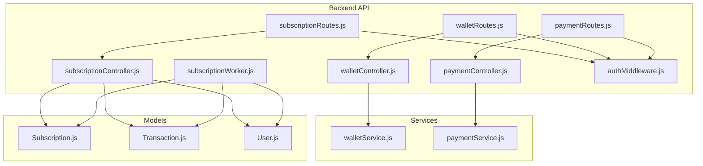
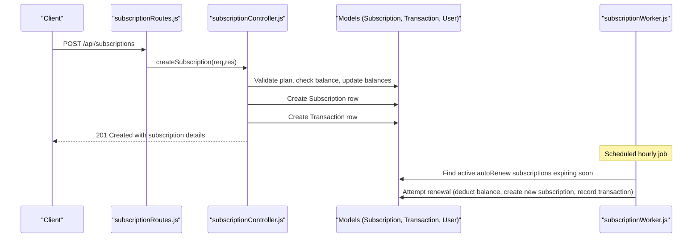
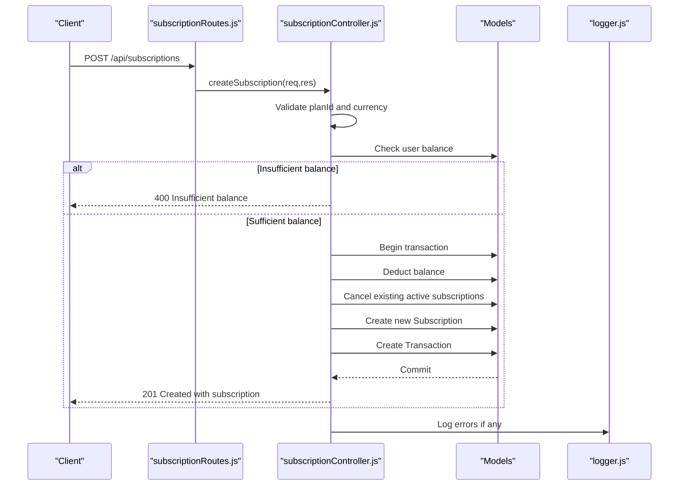
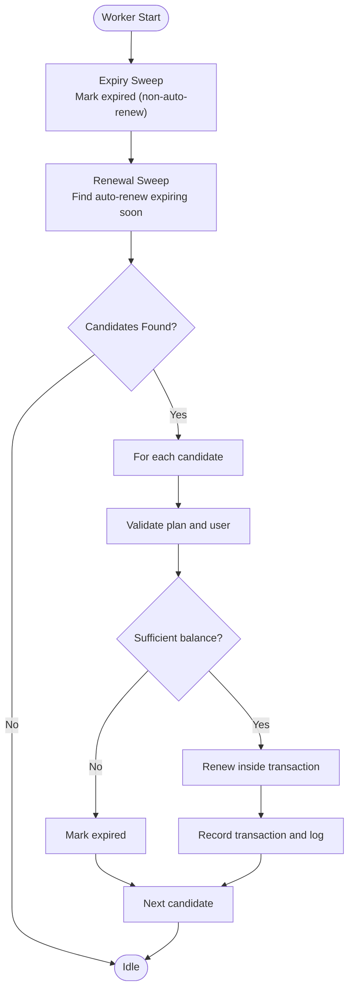
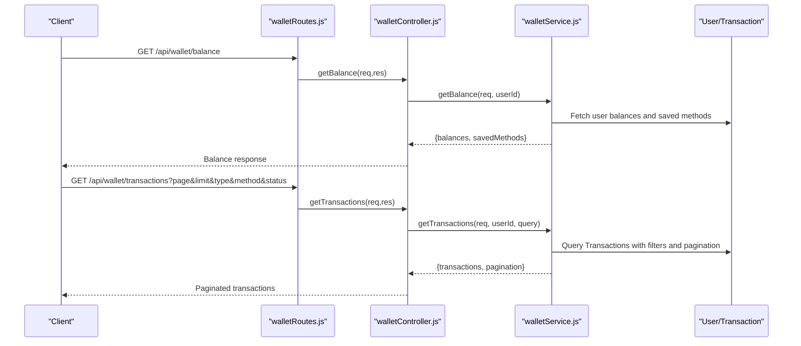
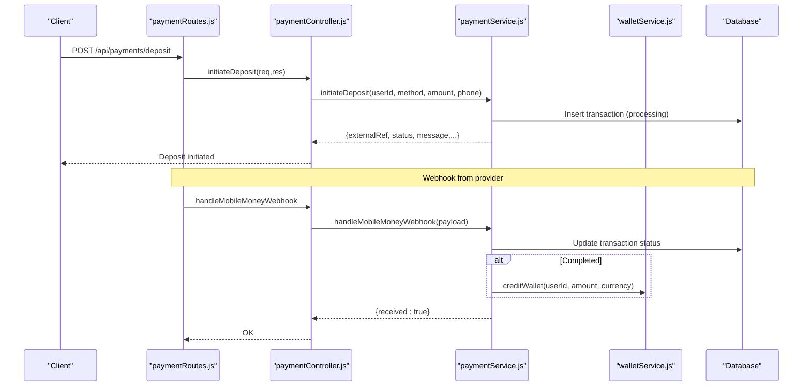
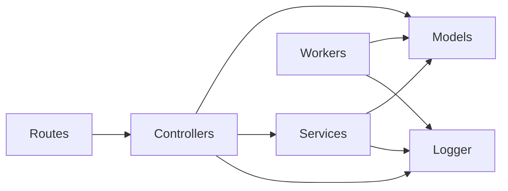

# Subscription Management API

<cite>
**Referenced Files in This Document**
- [subscriptionRoutes.js](file://backend/routes/subscriptionRoutes.js)
- [subscriptionController.js](file://backend/controllers/subscriptionController.js)
- [subscriptionPlans.js](file://backend/config/subscriptionPlans.js)
- [subscriptionWorker.js](file://backend/workers/subscriptionWorker.js)
- [walletRoutes.js](file://backend/routes/walletRoutes.js)
- [walletController.js](file://backend/controllers/walletController.js)
- [walletService.js](file://backend/services/walletService.js)
- [paymentRoutes.js](file://backend/routes/paymentRoutes.js)
- [paymentController.js](file://backend/controllers/paymentController.js)
- [paymentService.js](file://backend/services/paymentService.js)
- [Subscription.js](file://backend/models/Subscription.js)
- [Transaction.js](file://backend/models/Transaction.js)
- [User.js](file://backend/models/User.js)
- [subscription-schema.sql](file://database/subscription-schema.sql)
- [authMiddleware.js](file://backend/middleware/authMiddleware.js)
- [logger.js](file://backend/utils/logger.js)
</cite>

## Table of Contents
1. [Introduction](#introduction)
2. [Project Structure](#project-structure)
3. [Core Components](#core-components)
4. [Architecture Overview](#architecture-overview)
5. [Detailed Component Analysis](#detailed-component-analysis)
6. [Dependency Analysis](#dependency-analysis)
7. [Performance Considerations](#performance-considerations)
8. [Troubleshooting Guide](#troubleshooting-guide)
9. [Conclusion](#conclusion)
10. [Appendices](#appendices)

## Introduction
This document provides comprehensive API documentation for the Subscription Management system, covering subscription creation, plan management, billing cycle processing, and wallet operations. It also documents subscription status management, renewal processing, cancellation workflows, and webhook handling for automated billing processing. Examples of tiered pricing and promotional offers are included to illustrate how plans and coupons integrate with the system.

## Project Structure
The Subscription Management API is implemented in the backend service and consists of:
- Routes: Define HTTP endpoints for subscriptions and wallet operations.
- Controllers: Implement request handling and orchestrate business logic.
- Services: Encapsulate payment and wallet operations.
- Models: Define data structures for subscriptions, transactions, and users.
- Workers: Handle scheduled tasks for subscription expiry and auto-renewal.
- Middleware: Enforce authentication and authorization.
- Schema: Database schema supporting advanced subscription features (used by the broader subscription service).

**Diagram sources**
- [subscriptionRoutes.js:1-18](file://backend/routes/subscriptionRoutes.js#L1-L18)
- [walletRoutes.js:1-11](file://backend/routes/walletRoutes.js#L1-L11)
- [paymentRoutes.js:1-22](file://backend/routes/paymentRoutes.js#L1-L22)
- [subscriptionController.js:1-171](file://backend/controllers/subscriptionController.js#L1-L171)
- [walletController.js:1-17](file://backend/controllers/walletController.js#L1-L17)
- [paymentController.js:1-99](file://backend/controllers/paymentController.js#L1-L99)
- [subscriptionWorker.js:1-175](file://backend/workers/subscriptionWorker.js#L1-L175)
- [walletService.js:1-80](file://backend/services/walletService.js#L1-L80)
- [paymentService.js:1-234](file://backend/services/paymentService.js#L1-L234)
- [Subscription.js:1-46](file://backend/models/Subscription.js#L1-L46)
- [Transaction.js:1-54](file://backend/models/Transaction.js#L1-L54)
- [User.js:1-50](file://backend/models/User.js#L1-L50)
- [authMiddleware.js:1-36](file://backend/middleware/authMiddleware.js#L1-L36)

**Section sources**
- [subscriptionRoutes.js:1-18](file://backend/routes/subscriptionRoutes.js#L1-L18)
- [walletRoutes.js:1-11](file://backend/routes/walletRoutes.js#L1-L11)
- [paymentRoutes.js:1-22](file://backend/routes/paymentRoutes.js#L1-L22)
- [subscriptionController.js:1-171](file://backend/controllers/subscriptionController.js#L1-L171)
- [walletController.js:1-17](file://backend/controllers/walletController.js#L1-L17)
- [paymentController.js:1-99](file://backend/controllers/paymentController.js#L1-L99)
- [subscriptionWorker.js:1-175](file://backend/workers/subscriptionWorker.js#L1-L175)
- [walletService.js:1-80](file://backend/services/walletService.js#L1-L80)
- [paymentService.js:1-234](file://backend/services/paymentService.js#L1-L234)
- [Subscription.js:1-46](file://backend/models/Subscription.js#L1-L46)
- [Transaction.js:1-54](file://backend/models/Transaction.js#L1-L54)
- [User.js:1-50](file://backend/models/User.js#L1-L50)
- [authMiddleware.js:1-36](file://backend/middleware/authMiddleware.js#L1-L36)

## Core Components
- Subscription Management Endpoints
  - GET /api/subscriptions/plans: Public endpoint returning available plans with canonical local currency prices and live USD conversions.
  - GET /api/subscriptions/current: Returns the user’s active subscription or null if none.
  - POST /api/subscriptions: Creates a new subscription using the selected plan and currency; debits the user’s wallet and records a transaction.
  - POST /api/subscriptions/cancel: Cancels an active subscription (autoRenew disabled and status set to cancelled).
  - GET /api/subscriptions/history: Returns the user’s subscription history ordered by creation time.
- Wallet Endpoints
  - GET /api/wallet/balance: Returns user balances in USD and SLL, with live exchange rate and saved payment methods.
  - GET /api/wallet/transactions: Returns paginated transaction history filtered by optional type, method, and status.
- Payment and Webhooks
  - POST /api/payments/deposit: Initiates a deposit via mobile money or Stripe; validates amounts and fees.
  - POST /api/payments/withdraw: Initiates a withdrawal via supported methods; validates wallet balance and fees.
  - GET /api/payments/stripe/connect: Generates Stripe Connect OAuth URL for linking a Stripe account.
  - GET /api/payments/stripe/callback: Handles Stripe Connect OAuth callback.
  - DELETE /api/payments/stripe/disconnect: Disconnects a previously linked Stripe account.
  - POST /api/payments/webhooks/orange: Processes Orange Money webhook.
  - POST /api/payments/webhooks/afrimoney: Processes Afrimoney webhook.
  - POST /api/payments/webhooks/qmoney: Processes Qmoney webhook.
  - POST /api/payments/webhooks/stripe: Verifies and processes Stripe webhook events.

**Section sources**
- [subscriptionRoutes.js:6-16](file://backend/routes/subscriptionRoutes.js#L6-L16)
- [subscriptionController.js:146-170](file://backend/controllers/subscriptionController.js#L146-L170)
- [walletRoutes.js:6-10](file://backend/routes/walletRoutes.js#L6-L10)
- [walletController.js:8-16](file://backend/controllers/walletController.js#L8-L16)
- [paymentRoutes.js:6-21](file://backend/routes/paymentRoutes.js#L6-L21)
- [paymentController.js:17-98](file://backend/controllers/paymentController.js#L17-L98)

## Architecture Overview
The Subscription Management API integrates three primary subsystems:
- Subscription Lifecycle: Creation, renewal, expiry, and cancellation orchestrated by controllers and workers.
- Wallet and Payments: Balance management, deposits, withdrawals, and webhook-driven credit updates.
- Authentication: JWT-based authentication enforced across protected endpoints.

**Diagram sources**
- [subscriptionRoutes.js:12-14](file://backend/routes/subscriptionRoutes.js#L12-L14)
- [subscriptionController.js:34-109](file://backend/controllers/subscriptionController.js#L34-L109)
- [Subscription.js:1-46](file://backend/models/Subscription.js#L1-L46)
- [Transaction.js:1-54](file://backend/models/Transaction.js#L1-L54)
- [User.js:1-50](file://backend/models/User.js#L1-L50)
- [subscriptionWorker.js:97-172](file://backend/workers/subscriptionWorker.js#L97-L172)

## Detailed Component Analysis

### Subscription Endpoints
- GET /api/subscriptions/plans
  - Purpose: Returns all available subscription plans with canonical local currency prices and live USD conversions.
  - Authentication: Not required.
  - Response: Array of plans with durations, local and USD prices, and current exchange rate.
  - Implementation references:
    - [subscriptionController.js:146-170](file://backend/controllers/subscriptionController.js#L146-L170)
    - [subscriptionPlans.js:1-21](file://backend/config/subscriptionPlans.js#L1-L21)
- GET /api/subscriptions/current
  - Purpose: Returns the user’s active subscription or null if none.
  - Authentication: Required.
  - Behavior: If the active subscription is expired, it is updated to expired and null is returned.
  - Implementation references:
    - [subscriptionController.js:7-32](file://backend/controllers/subscriptionController.js#L7-L32)
    - [Subscription.js:18-21](file://backend/models/Subscription.js#L18-L21)
- POST /api/subscriptions
  - Purpose: Creates a new subscription for the authenticated user.
  - Authentication: Required.
  - Request body: planId (string), currency (enum SLL/USD).
  - Validation: Checks plan existence, sufficient balance, and updates balances atomically.
  - Side effects: Deactivates existing active subscriptions, creates new subscription, and records a transaction.
  - Implementation references:
    - [subscriptionController.js:34-109](file://backend/controllers/subscriptionController.js#L34-L109)
    - [Subscription.js:1-46](file://backend/models/Subscription.js#L1-L46)
    - [Transaction.js:1-54](file://backend/models/Transaction.js#L1-L54)
    - [User.js:30-37](file://backend/models/User.js#L30-L37)
- POST /api/subscriptions/cancel
  - Purpose: Cancels the user’s active subscription by disabling autoRenew and marking status as cancelled.
  - Authentication: Required.
  - Implementation references:
    - [subscriptionController.js:111-130](file://backend/controllers/subscriptionController.js#L111-L130)
- GET /api/subscriptions/history
  - Purpose: Returns the user’s subscription history ordered by creation time.
  - Authentication: Required.
  - Implementation references:
    - [subscriptionController.js:132-143](file://backend/controllers/subscriptionController.js#L132-L143)

**Diagram sources**
- [subscriptionRoutes.js:12-14](file://backend/routes/subscriptionRoutes.js#L12-L14)
- [subscriptionController.js:34-109](file://backend/controllers/subscriptionController.js#L34-L109)
- [Subscription.js:1-46](file://backend/models/Subscription.js#L1-L46)
- [Transaction.js:1-54](file://backend/models/Transaction.js#L1-L54)
- [User.js:1-50](file://backend/models/User.js#L1-L50)
- [logger.js:1-58](file://backend/utils/logger.js#L1-L58)

**Section sources**
- [subscriptionRoutes.js:6-16](file://backend/routes/subscriptionRoutes.js#L6-L16)
- [subscriptionController.js:7-143](file://backend/controllers/subscriptionController.js#L7-L143)
- [subscriptionPlans.js:1-21](file://backend/config/subscriptionPlans.js#L1-L21)
- [Subscription.js:1-46](file://backend/models/Subscription.js#L1-L46)
- [Transaction.js:1-54](file://backend/models/Transaction.js#L1-L54)
- [User.js:1-50](file://backend/models/User.js#L1-L50)
- [logger.js:1-58](file://backend/utils/logger.js#L1-L58)

### Billing Cycle Processing and Renewal
- Auto-expiry sweep: Hourly job marks active non-auto-renew subscriptions as expired if their end date has passed.
- Auto-renewal sweep: Hourly job attempts renewal for active auto-renew subscriptions expiring within the next hour:
  - Validates plan and user existence.
  - Checks sufficient balance.
  - Deducts renewal fee, expires the current subscription, creates a new active subscription, and records a transaction.
- Implementation references:
  - [subscriptionWorker.js:97-172](file://backend/workers/subscriptionWorker.js#L97-L172)
  - [subscriptionPlans.js:1-21](file://backend/config/subscriptionPlans.js#L1-L21)

**Diagram sources**
- [subscriptionWorker.js:97-172](file://backend/workers/subscriptionWorker.js#L97-L172)
- [subscriptionPlans.js:1-21](file://backend/config/subscriptionPlans.js#L1-L21)

**Section sources**
- [subscriptionWorker.js:17-172](file://backend/workers/subscriptionWorker.js#L17-L172)
- [subscriptionPlans.js:1-21](file://backend/config/subscriptionPlans.js#L1-L21)

### Wallet Operations
- GET /api/wallet/balance
  - Returns user USD and SLL balances, live exchange rate, and saved payment methods.
  - Implementation references:
    - [walletController.js:8-12](file://backend/controllers/walletController.js#L8-L12)
    - [walletService.js:8-38](file://backend/services/walletService.js#L8-L38)
    - [User.js:30-37](file://backend/models/User.js#L30-L37)
- GET /api/wallet/transactions
  - Returns paginated transaction history with optional filters (type, paymentMethod, status).
  - Implementation references:
    - [walletController.js:13-16](file://backend/controllers/walletController.js#L13-L16)
    - [walletService.js:40-62](file://backend/services/walletService.js#L40-L62)
    - [Transaction.js:1-54](file://backend/models/Transaction.js#L1-L54)

**Diagram sources**
- [walletRoutes.js:7-10](file://backend/routes/walletRoutes.js#L7-L10)
- [walletController.js:8-16](file://backend/controllers/walletController.js#L8-L16)
- [walletService.js:8-62](file://backend/services/walletService.js#L8-L62)
- [User.js:1-50](file://backend/models/User.js#L1-L50)
- [Transaction.js:1-54](file://backend/models/Transaction.js#L1-L54)

**Section sources**
- [walletRoutes.js:6-10](file://backend/routes/walletRoutes.js#L6-L10)
- [walletController.js:1-17](file://backend/controllers/walletController.js#L1-L17)
- [walletService.js:1-80](file://backend/services/walletService.js#L1-L80)
- [User.js:1-50](file://backend/models/User.js#L1-L50)
- [Transaction.js:1-54](file://backend/models/Transaction.js#L1-L54)

### Payment and Webhooks
- Deposit and Withdrawal
  - Deposit: Validates method, amount, and phone number (for mobile money), creates a transaction row, and returns processing status.
  - Withdrawal: Validates method, amount, and user’s wallet balance, calculates fees, and updates wallet and transaction rows.
  - Implementation references:
    - [paymentController.js:17-33](file://backend/controllers/paymentController.js#L17-L33)
    - [paymentService.js:53-147](file://backend/services/paymentService.js#L53-L147)
- Stripe Connect
  - Generates OAuth URL, handles callback, and disconnects account.
  - Implementation references:
    - [paymentController.js:38-55](file://backend/controllers/paymentController.js#L38-L55)
    - [paymentService.js:188-233](file://backend/services/paymentService.js#L188-L233)
- Webhooks
  - Mobile Money: Updates transaction status and credits wallet upon successful deposit.
  - Stripe: Verifies signatures, updates transaction status, and credits wallet on payment success.
  - Implementation references:
    - [paymentController.js:59-98](file://backend/controllers/paymentController.js#L59-L98)
    - [paymentService.js:149-185](file://backend/services/paymentService.js#L149-L185)

**Diagram sources**
- [paymentRoutes.js:7-19](file://backend/routes/paymentRoutes.js#L7-L19)
- [paymentController.js:17-98](file://backend/controllers/paymentController.js#L17-L98)
- [paymentService.js:53-185](file://backend/services/paymentService.js#L53-L185)
- [walletService.js:64-80](file://backend/services/walletService.js#L64-L80)

**Section sources**
- [paymentRoutes.js:1-22](file://backend/routes/paymentRoutes.js#L1-L22)
- [paymentController.js:1-99](file://backend/controllers/paymentController.js#L1-L99)
- [paymentService.js:1-234](file://backend/services/paymentService.js#L1-L234)
- [walletService.js:1-80](file://backend/services/walletService.js#L1-L80)

### Plan Management and Promotional Offers
- Plan definitions are centralized and used by both controllers and workers.
  - Reference: [subscriptionPlans.js:13-18](file://backend/config/subscriptionPlans.js#L13-L18)
- Promotional offers (coupons) are supported by the database schema and can be applied during checkout flows.
  - Reference: [subscription-schema.sql:227-262](file://database/subscription-schema.sql#L227-L262)
- Tiered pricing examples:
  - Hourly, daily, weekly, monthly, and yearly plans with different access periods and pricing tiers.
  - Reference: [subscription-schema.sql:430-580](file://database/subscription-schema.sql#L430-L580)

**Section sources**
- [subscriptionPlans.js:1-21](file://backend/config/subscriptionPlans.js#L1-L21)
- [subscription-schema.sql:227-580](file://database/subscription-schema.sql#L227-L580)

### Subscription Status Management and Cancellation Workflows
- Status transitions:
  - Creation sets status to active.
  - Auto-expiry sweep sets status to expired for non-auto-renew subscriptions past end date.
  - Auto-renewal creates a new active subscription and expires the previous one.
  - Manual cancellation sets autoRenew to false and status to cancelled.
- Implementation references:
  - [subscriptionController.js:21-27](file://backend/controllers/subscriptionController.js#L21-L27)
  - [subscriptionWorker.js:97-172](file://backend/workers/subscriptionWorker.js#L97-L172)

**Section sources**
- [subscriptionController.js:7-130](file://backend/controllers/subscriptionController.js#L7-L130)
- [subscriptionWorker.js:97-172](file://backend/workers/subscriptionWorker.js#L97-L172)

## Dependency Analysis
- Route-to-Controller mapping ensures proper separation of concerns and consistent authentication enforcement.
- Controllers depend on models for data persistence and services for cross-cutting concerns like payments and wallet operations.
- Workers operate independently of HTTP requests, scheduled via cron to maintain subscription lifecycle integrity.
- Logging is centralized to capture operational events and errors.

**Diagram sources**
- [subscriptionRoutes.js:1-18](file://backend/routes/subscriptionRoutes.js#L1-L18)
- [walletRoutes.js:1-11](file://backend/routes/walletRoutes.js#L1-L11)
- [paymentRoutes.js:1-22](file://backend/routes/paymentRoutes.js#L1-L22)
- [subscriptionController.js:1-171](file://backend/controllers/subscriptionController.js#L1-L171)
- [walletController.js:1-17](file://backend/controllers/walletController.js#L1-L17)
- [paymentController.js:1-99](file://backend/controllers/paymentController.js#L1-L99)
- [subscriptionWorker.js:1-175](file://backend/workers/subscriptionWorker.js#L1-L175)
- [walletService.js:1-80](file://backend/services/walletService.js#L1-L80)
- [paymentService.js:1-234](file://backend/services/paymentService.js#L1-L234)
- [Subscription.js:1-46](file://backend/models/Subscription.js#L1-L46)
- [Transaction.js:1-54](file://backend/models/Transaction.js#L1-L54)
- [User.js:1-50](file://backend/models/User.js#L1-L50)
- [logger.js:1-58](file://backend/utils/logger.js#L1-L58)

**Section sources**
- [subscriptionRoutes.js:1-18](file://backend/routes/subscriptionRoutes.js#L1-L18)
- [walletRoutes.js:1-11](file://backend/routes/walletRoutes.js#L1-L11)
- [paymentRoutes.js:1-22](file://backend/routes/paymentRoutes.js#L1-L22)
- [subscriptionController.js:1-171](file://backend/controllers/subscriptionController.js#L1-L171)
- [walletController.js:1-17](file://backend/controllers/walletController.js#L1-L17)
- [paymentController.js:1-99](file://backend/controllers/paymentController.js#L1-L99)
- [subscriptionWorker.js:1-175](file://backend/workers/subscriptionWorker.js#L1-L175)
- [walletService.js:1-80](file://backend/services/walletService.js#L1-L80)
- [paymentService.js:1-234](file://backend/services/paymentService.js#L1-L234)
- [Subscription.js:1-46](file://backend/models/Subscription.js#L1-L46)
- [Transaction.js:1-54](file://backend/models/Transaction.js#L1-L54)
- [User.js:1-50](file://backend/models/User.js#L1-L50)
- [logger.js:1-58](file://backend/utils/logger.js#L1-L58)

## Performance Considerations
- Transactional updates ensure atomicity for subscription creation and renewal, preventing race conditions.
- Cron-based workers run at fixed intervals to minimize load spikes while maintaining timely processing.
- Exchange rate lookups are cached via service fallbacks to reduce latency and improve resilience.
- Pagination in transaction history prevents large payloads and supports scalable retrieval.

## Troubleshooting Guide
- Authentication failures:
  - Ensure Authorization header contains a valid Bearer token.
  - Reference: [authMiddleware.js:3-25](file://backend/middleware/authMiddleware.js#L3-L25)
- Insufficient balance:
  - Verify user balances in USD and SLL; confirm currency selection matches plan pricing.
  - References: [subscriptionController.js:47-51](file://backend/controllers/subscriptionController.js#L47-L51), [User.js:30-37](file://backend/models/User.js#L30-L37)
- Webhook verification:
  - Stripe webhooks require a valid signature and configured webhook secret.
  - References: [paymentController.js:74-98](file://backend/controllers/paymentController.js#L74-L98), [paymentService.js:168-185](file://backend/services/paymentService.js#L168-L185)
- Logging:
  - Use structured logs for diagnostics; component-specific loggers are available.
  - Reference: [logger.js:46-57](file://backend/utils/logger.js#L46-L57)

**Section sources**
- [authMiddleware.js:1-36](file://backend/middleware/authMiddleware.js#L1-L36)
- [subscriptionController.js:47-51](file://backend/controllers/subscriptionController.js#L47-L51)
- [User.js:1-50](file://backend/models/User.js#L1-L50)
- [paymentController.js:74-98](file://backend/controllers/paymentController.js#L74-L98)
- [paymentService.js:168-185](file://backend/services/paymentService.js#L168-L185)
- [logger.js:1-58](file://backend/utils/logger.js#L1-L58)

## Conclusion
The Subscription Management API provides a robust foundation for managing subscriptions, billing cycles, and wallet operations. It supports plan definitions, tiered pricing, promotional offers, and automated renewal with scheduled workers. Payment integrations and webhooks enable seamless credit management and transaction tracking. The modular design and centralized logging facilitate maintainability and scalability.

## Appendices
- Database schema highlights for advanced features (time-based access, recurring billing, analytics):
  - Reference: [subscription-schema.sql:18-644](file://database/subscription-schema.sql#L18-L644)

**Section sources**
- [subscription-schema.sql:1-644](file://database/subscription-schema.sql#L1-L644)