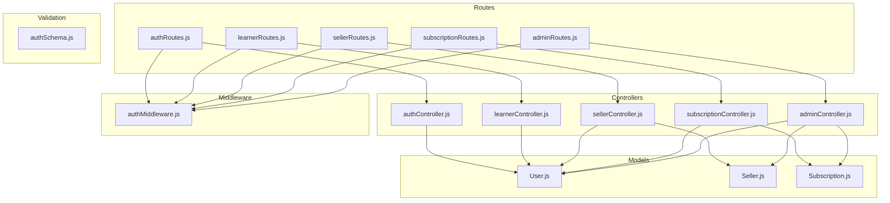
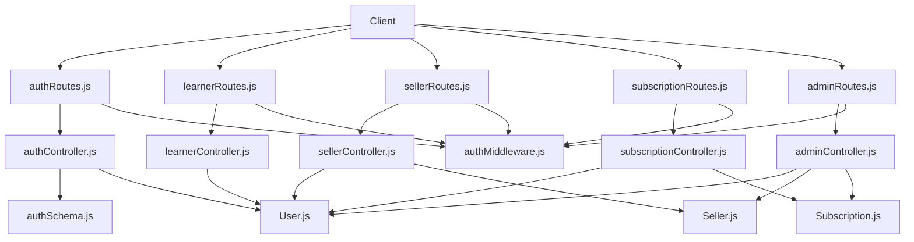
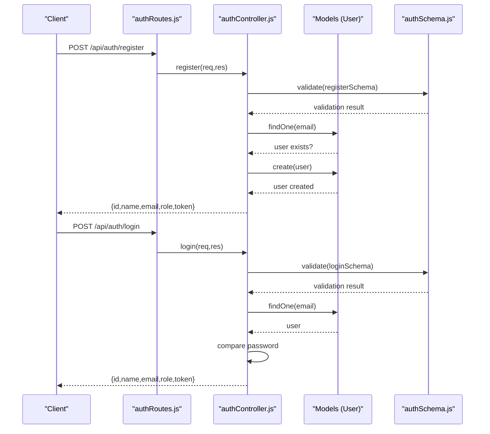
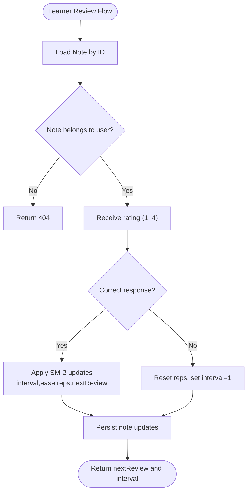
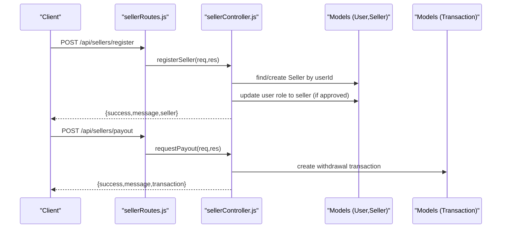
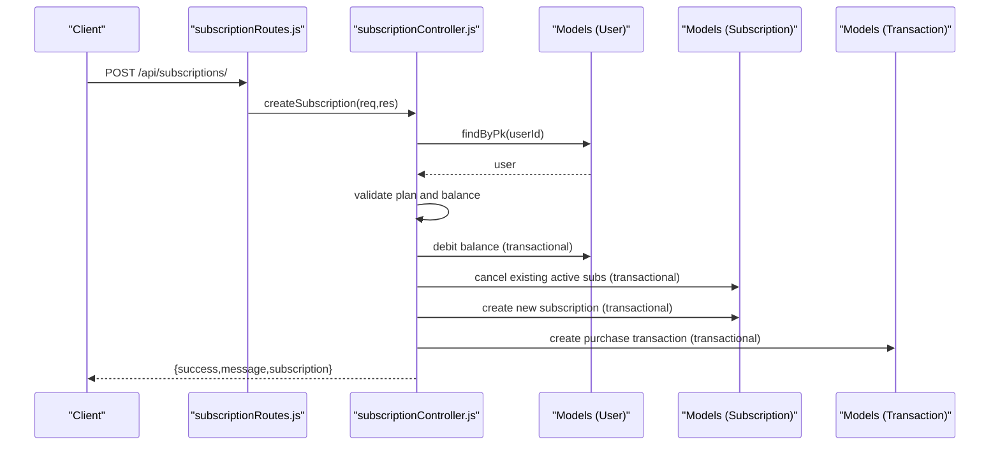
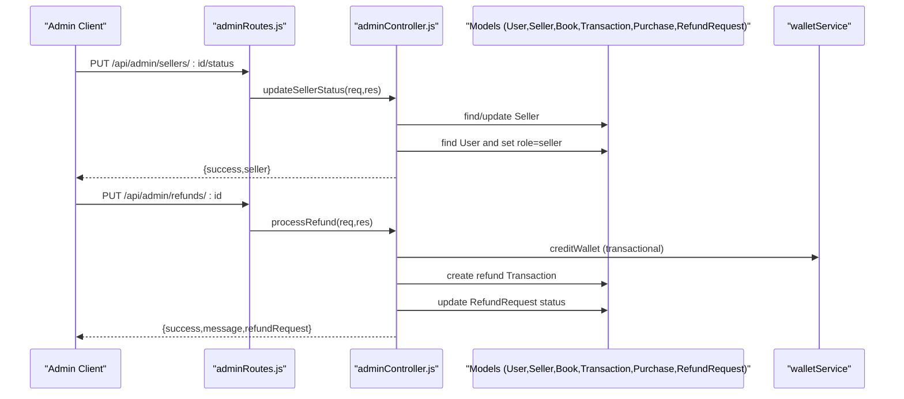
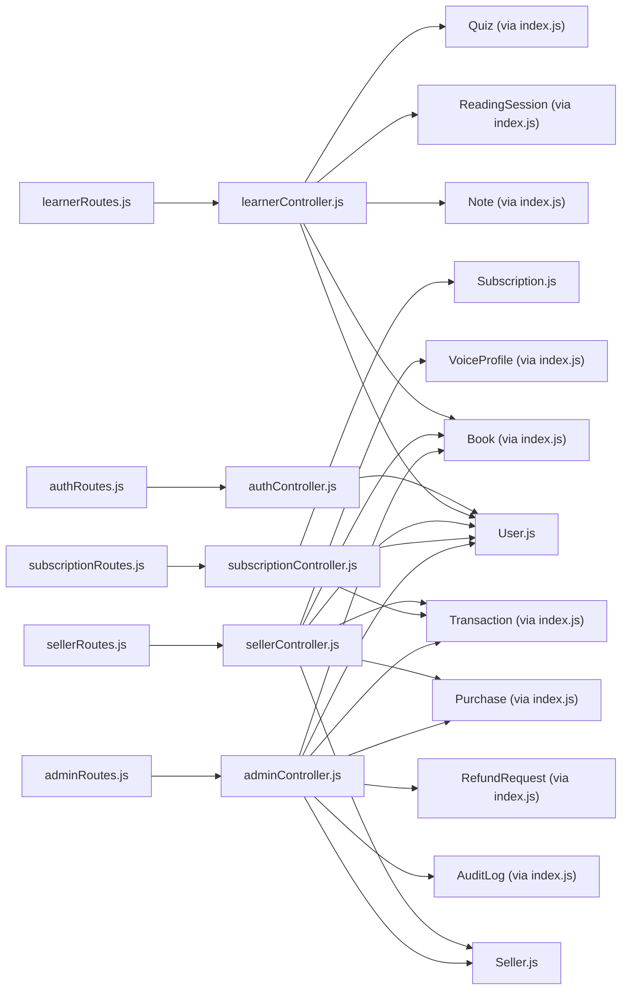

# User Management API

<cite>
**Referenced Files in This Document**
- [User.js](file://backend/models/User.js)
- [Seller.js](file://backend/models/Seller.js)
- [Subscription.js](file://backend/models/Subscription.js)
- [authController.js](file://backend/controllers/authController.js)
- [learnerController.js](file://backend/controllers/learnerController.js)
- [sellerController.js](file://backend/controllers/sellerController.js)
- [subscriptionController.js](file://backend/controllers/subscriptionController.js)
- [adminController.js](file://backend/controllers/adminController.js)
- [authRoutes.js](file://backend/routes/authRoutes.js)
- [learnerRoutes.js](file://backend/routes/learnerRoutes.js)
- [sellerRoutes.js](file://backend/routes/sellerRoutes.js)
- [subscriptionRoutes.js](file://backend/routes/subscriptionRoutes.js)
- [adminRoutes.js](file://backend/routes/adminRoutes.js)
- [authMiddleware.js](file://backend/middleware/authMiddleware.js)
- [authSchema.js](file://backend/validation/authSchema.js)
- [index.js](file://backend/models/index.js)
</cite>

## Table of Contents
1. [Introduction](#introduction)
2. [Project Structure](#project-structure)
3. [Core Components](#core-components)
4. [Architecture Overview](#architecture-overview)
5. [Detailed Component Analysis](#detailed-component-analysis)
6. [Dependency Analysis](#dependency-analysis)
7. [Performance Considerations](#performance-considerations)
8. [Troubleshooting Guide](#troubleshooting-guide)
9. [Conclusion](#conclusion)
10. [Appendices](#appendices)

## Introduction
This document provides comprehensive API documentation for User Management endpoints focused on learner and seller account operations. It covers authentication, learner-specific features (profile management, reading progress tracking, library access, quizzes, and leaderboards), seller workflows (creator account management, earnings analytics, and payouts), role-based access controls, permission hierarchies, and account verification processes. It also documents CRUD operations for user profiles, account settings, and subscription management, along with examples of user onboarding flows, account upgrades, and role transitions. Validation rules, data privacy considerations, and GDPR compliance requirements are included.

## Project Structure
The backend is organized by concerns: routes define the API surface, controllers implement business logic, models define data structures and associations, middleware enforces authentication and authorization, and validation schemas enforce input constraints. Authentication endpoints are under `/api/auth`, learner endpoints under `/api/learner`, seller endpoints under `/api/sellers`, and subscription endpoints under `/api/subscriptions`. Administrative endpoints are under `/api/admin`.

**Diagram sources**
- [authRoutes.js:1-11](file://backend/routes/authRoutes.js#L1-L11)
- [learnerRoutes.js:1-32](file://backend/routes/learnerRoutes.js#L1-L32)
- [sellerRoutes.js:1-42](file://backend/routes/sellerRoutes.js#L1-L42)
- [subscriptionRoutes.js:1-18](file://backend/routes/subscriptionRoutes.js#L1-L18)
- [adminRoutes.js:1-107](file://backend/routes/adminRoutes.js#L1-L107)
- [authController.js:1-121](file://backend/controllers/authController.js#L1-L121)
- [learnerController.js:1-281](file://backend/controllers/learnerController.js#L1-L281)
- [sellerController.js:1-211](file://backend/controllers/sellerController.js#L1-L211)
- [subscriptionController.js:1-171](file://backend/controllers/subscriptionController.js#L1-L171)
- [adminController.js:1-599](file://backend/controllers/adminController.js#L1-L599)
- [authMiddleware.js:1-36](file://backend/middleware/authMiddleware.js#L1-L36)
- [authSchema.js:1-18](file://backend/validation/authSchema.js#L1-L18)
- [User.js:1-50](file://backend/models/User.js#L1-L50)
- [Seller.js:1-30](file://backend/models/Seller.js#L1-L30)
- [Subscription.js:1-46](file://backend/models/Subscription.js#L1-L46)

**Section sources**
- [authRoutes.js:1-11](file://backend/routes/authRoutes.js#L1-L11)
- [learnerRoutes.js:1-32](file://backend/routes/learnerRoutes.js#L1-L32)
- [sellerRoutes.js:1-42](file://backend/routes/sellerRoutes.js#L1-L42)
- [subscriptionRoutes.js:1-18](file://backend/routes/subscriptionRoutes.js#L1-L18)
- [adminRoutes.js:1-107](file://backend/routes/adminRoutes.js#L1-L107)

## Core Components
- Authentication and Authorization
  - Routes: POST /api/auth/register, POST /api/auth/login, GET /api/auth/me
  - Controllers: register, login, getMe
  - Middleware: authenticateToken, isAdmin
  - Validation: Zod schemas for registration and login
- Learner Features
  - Routes: GET/POST/DELETE /api/learner/notes, GET /api/learner/srs/due, POST /api/learner/srs/review/:id, POST /api/learner/sessions/start, PUT /api/learner/sessions/:id, GET /api/learner/analytics, GET /api/learner/leaderboard, GET /api/learner/recommendations, GET /api/learner/quiz
  - Controllers: Notes CRUD, SRS review, Reading Session lifecycle, Analytics, Leaderboard, Recommendations, Quiz generation
- Seller Features
  - Routes: POST /api/sellers/register, GET /api/sellers/profile, GET /api/sellers/earnings, POST /api/sellers/payout, GET /api/sellers/voices
  - Controllers: Seller registration/application, profile retrieval, earnings analytics, payout requests, voice management
- Subscription Management
  - Routes: GET /api/subscriptions/plans, GET /api/subscriptions/current, POST /api/subscriptions/, POST /api/subscriptions/cancel, GET /api/subscriptions/history
  - Controllers: Plan listing, current subscription retrieval, subscription creation, cancellation, history
- Administration
  - Routes: GET /api/admin/sellers, PUT /api/admin/sellers/:id/status, GET /api/admin/books, PUT /api/admin/books/:id/status, POST /api/admin/books/bulk-status, GET /api/admin/users, POST /api/admin/users/adjust-balance, PUT /api/admin/users/role, GET /api/admin/stats, GET /api/admin/logs, GET /api/admin/health, GET /api/admin/payouts, PUT /api/admin/payouts/:id, POST /api/admin/gift-book, GET /api/admin/refunds, PUT /api/admin/refunds/:id
  - Controllers: Seller and book moderation, user wallet adjustments, role updates, audit logs, system health, payouts, gifts, refunds

**Section sources**
- [authController.js:1-121](file://backend/controllers/authController.js#L1-L121)
- [learnerController.js:1-281](file://backend/controllers/learnerController.js#L1-L281)
- [sellerController.js:1-211](file://backend/controllers/sellerController.js#L1-L211)
- [subscriptionController.js:1-171](file://backend/controllers/subscriptionController.js#L1-L171)
- [adminController.js:1-599](file://backend/controllers/adminController.js#L1-L599)
- [authMiddleware.js:1-36](file://backend/middleware/authMiddleware.js#L1-L36)
- [authSchema.js:1-18](file://backend/validation/authSchema.js#L1-L18)

## Architecture Overview
The system follows a layered architecture:
- Presentation Layer: Express routes
- Application Layer: Controllers implementing business logic
- Domain Layer: Models and associations
- Infrastructure Layer: Middleware, validation, and external integrations

**Diagram sources**
- [authRoutes.js:1-11](file://backend/routes/authRoutes.js#L1-L11)
- [learnerRoutes.js:1-32](file://backend/routes/learnerRoutes.js#L1-L32)
- [sellerRoutes.js:1-42](file://backend/routes/sellerRoutes.js#L1-L42)
- [subscriptionRoutes.js:1-18](file://backend/routes/subscriptionRoutes.js#L1-L18)
- [adminRoutes.js:1-107](file://backend/routes/adminRoutes.js#L1-L107)
- [authController.js:1-121](file://backend/controllers/authController.js#L1-L121)
- [learnerController.js:1-281](file://backend/controllers/learnerController.js#L1-L281)
- [sellerController.js:1-211](file://backend/controllers/sellerController.js#L1-L211)
- [subscriptionController.js:1-171](file://backend/controllers/subscriptionController.js#L1-L171)
- [adminController.js:1-599](file://backend/controllers/adminController.js#L1-L599)
- [authMiddleware.js:1-36](file://backend/middleware/authMiddleware.js#L1-L36)
- [authSchema.js:1-18](file://backend/validation/authSchema.js#L1-L18)
- [User.js:1-50](file://backend/models/User.js#L1-L50)
- [Seller.js:1-30](file://backend/models/Seller.js#L1-L30)
- [Subscription.js:1-46](file://backend/models/Subscription.js#L1-L46)

## Detailed Component Analysis

### Authentication and Authorization
- Endpoints
  - POST /api/auth/register: Validates input via Zod, checks uniqueness, hashes password, creates user, returns JWT token
  - POST /api/auth/login: Validates input, finds user, compares password, returns JWT token
  - GET /api/auth/me: Returns current user profile excluding sensitive fields
- Access Control
  - authenticateToken: Extracts Bearer token, verifies HS256, attaches decoded user to request
  - isAdmin: Restricts routes to admin role only
- Validation Rules
  - Registration: name (min 2), email (valid format), password (min 8)
  - Login: email (valid format), password (required)
- Security Considerations
  - JWT_SECRET must be configured in production; default fallback is only for development
  - Password hashing via bcrypt
  - No token refresh mechanism; tokens expire after configured period

**Diagram sources**
- [authRoutes.js:1-11](file://backend/routes/authRoutes.js#L1-L11)
- [authController.js:1-121](file://backend/controllers/authController.js#L1-L121)
- [authSchema.js:1-18](file://backend/validation/authSchema.js#L1-L18)
- [User.js:1-50](file://backend/models/User.js#L1-L50)

**Section sources**
- [authController.js:1-121](file://backend/controllers/authController.js#L1-L121)
- [authRoutes.js:1-11](file://backend/routes/authRoutes.js#L1-L11)
- [authMiddleware.js:1-36](file://backend/middleware/authMiddleware.js#L1-L36)
- [authSchema.js:1-18](file://backend/validation/authSchema.js#L1-L18)

### Learner Operations
- Notes Management
  - GET /api/learner/notes: Lists notes for current user (optional filter by bookId)
  - POST /api/learner/notes: Creates a note with bookId, pageId, content, color, highlightText
  - DELETE /api/learner/notes/:id: Removes a note owned by the current user
- Spaced Repetition System (SRS)
  - GET /api/learner/srs/due: Retrieves overdue notes with book metadata
  - POST /api/learner/srs/review/:id: Updates note scheduling using SM-2 algorithm
- Reading Sessions and Analytics
  - POST /api/learner/sessions/start: Starts a new reading session
  - PUT /api/learner/sessions/:id: Updates session with pagesRead and durationSeconds
  - GET /api/learner/analytics: Aggregates total hours, unique books, and recent sessions
- Leaderboards
  - GET /api/learner/leaderboard: Top users by total reading duration
- Recommendations
  - GET /api/learner/recommendations: Suggests books based on reading categories
- Quizzes
  - GET /api/learner/quiz: Retrieves or generates a quiz for a book/chapter

**Diagram sources**
- [learnerController.js:70-114](file://backend/controllers/learnerController.js#L70-L114)

**Section sources**
- [learnerController.js:1-281](file://backend/controllers/learnerController.js#L1-L281)
- [learnerRoutes.js:1-32](file://backend/routes/learnerRoutes.js#L1-L32)

### Seller Operations
- Seller Registration/Application
  - POST /api/sellers/register: Creates or updates a seller application; promotes user to seller role upon approval
- Seller Profile and Stats
  - GET /api/sellers/profile: Retrieves seller profile linked to user
  - GET /api/sellers/earnings: Computes earnings, pending payouts, sales counts, and per-book performance
- Payout Requests
  - POST /api/sellers/payout: Submits a withdrawal request with amount, currency, and method
- Voice Management
  - GET /api/sellers/voices: Lists cloned voice profiles for the seller

**Diagram sources**
- [sellerRoutes.js:1-42](file://backend/routes/sellerRoutes.js#L1-L42)
- [sellerController.js:1-211](file://backend/controllers/sellerController.js#L1-L211)
- [User.js:1-50](file://backend/models/User.js#L1-L50)
- [Seller.js:1-30](file://backend/models/Seller.js#L1-L30)

**Section sources**
- [sellerController.js:1-211](file://backend/controllers/sellerController.js#L1-L211)
- [sellerRoutes.js:1-42](file://backend/routes/sellerRoutes.js#L1-L42)

### Subscription Management
- Plan Listing
  - GET /api/subscriptions/plans: Returns canonical SLL prices and computed USD equivalents using live exchange rates
- Current Subscription
  - GET /api/subscriptions/current: Returns active subscription or null if expired
- Create Subscription
  - POST /api/subscriptions/: Debits user balance, cancels existing active subscriptions, creates new subscription, records transaction
- Cancel Subscription
  - POST /api/subscriptions/cancel: Disables auto-renew and marks as cancelled
- History
  - GET /api/subscriptions/history: Lists all past subscriptions

**Diagram sources**
- [subscriptionRoutes.js:1-18](file://backend/routes/subscriptionRoutes.js#L1-L18)
- [subscriptionController.js:1-171](file://backend/controllers/subscriptionController.js#L1-L171)
- [Subscription.js:1-46](file://backend/models/Subscription.js#L1-L46)
- [User.js:1-50](file://backend/models/User.js#L1-L50)

**Section sources**
- [subscriptionController.js:1-171](file://backend/controllers/subscriptionController.js#L1-L171)
- [subscriptionRoutes.js:1-18](file://backend/routes/subscriptionRoutes.js#L1-L18)

### Administration
- Seller and Book Moderation
  - GET /api/admin/sellers, PUT /api/admin/sellers/:id/status, GET /api/admin/books, PUT /api/admin/books/:id/status, POST /api/admin/books/bulk-status
- User Management
  - GET /api/admin/users, POST /api/admin/users/adjust-balance, PUT /api/admin/users/role
- Analytics and Auditing
  - GET /api/admin/stats, GET /api/admin/logs, GET /api/admin/health
- Payouts and Refunds
  - GET /api/admin/payouts, PUT /api/admin/payouts/:id, GET /api/admin/refunds, PUT /api/admin/refunds/:id
- System Actions
  - POST /api/admin/gift-book

**Diagram sources**
- [adminRoutes.js:1-107](file://backend/routes/adminRoutes.js#L1-L107)
- [adminController.js:1-599](file://backend/controllers/adminController.js#L1-L599)
- [User.js:1-50](file://backend/models/User.js#L1-L50)
- [Seller.js:1-30](file://backend/models/Seller.js#L1-L30)
- [Subscription.js:1-46](file://backend/models/Subscription.js#L1-L46)

**Section sources**
- [adminController.js:1-599](file://backend/controllers/adminController.js#L1-L599)
- [adminRoutes.js:1-107](file://backend/routes/adminRoutes.js#L1-L107)

## Dependency Analysis
- Route-to-Controller Mapping
  - authRoutes → authController
  - learnerRoutes → learnerController
  - sellerRoutes → sellerController
  - subscriptionRoutes → subscriptionController
  - adminRoutes → adminController
- Controller-to-Model Dependencies
  - authController → User
  - learnerController → User, Note, ReadingSession, Quiz, Book
  - sellerController → User, Seller, Book, Purchase, Transaction, VoiceProfile
  - subscriptionController → User, Subscription, Transaction
  - adminController → User, Seller, Book, Transaction, Purchase, AuditLog, RefundRequest
- Middleware and Validation
  - All private routes use authenticateToken; admin routes additionally use isAdmin
  - authController uses authSchema for input validation

**Diagram sources**
- [authRoutes.js:1-11](file://backend/routes/authRoutes.js#L1-L11)
- [learnerRoutes.js:1-32](file://backend/routes/learnerRoutes.js#L1-L32)
- [sellerRoutes.js:1-42](file://backend/routes/sellerRoutes.js#L1-L42)
- [subscriptionRoutes.js:1-18](file://backend/routes/subscriptionRoutes.js#L1-L18)
- [adminRoutes.js:1-107](file://backend/routes/adminRoutes.js#L1-L107)
- [authController.js:1-121](file://backend/controllers/authController.js#L1-L121)
- [learnerController.js:1-281](file://backend/controllers/learnerController.js#L1-L281)
- [sellerController.js:1-211](file://backend/controllers/sellerController.js#L1-L211)
- [subscriptionController.js:1-171](file://backend/controllers/subscriptionController.js#L1-L171)
- [adminController.js:1-599](file://backend/controllers/adminController.js#L1-L599)
- [User.js:1-50](file://backend/models/User.js#L1-L50)
- [Seller.js:1-30](file://backend/models/Seller.js#L1-L30)
- [Subscription.js:1-46](file://backend/models/Subscription.js#L1-L46)
- [index.js:147-167](file://backend/models/index.js#L147-L167)

**Section sources**
- [index.js:147-167](file://backend/models/index.js#L147-L167)

## Performance Considerations
- Token Verification: HS256 verification is lightweight; ensure JWT_SECRET is strong and environment-managed.
- Database Queries: Use appropriate indexes on frequently queried fields (e.g., userId, bookId, status). Pagination for lists (e.g., audit logs, subscriptions).
- Transactions: Use Sequelize transactions for atomic operations (e.g., subscription creation, refund processing) to prevent race conditions.
- Caching: Consider caching plan rates and leaderboard results to reduce database load.
- Asynchronous Processing: Offload heavy tasks (e.g., quiz generation) to background workers.

## Troubleshooting Guide
- Authentication Failures
  - Missing or invalid Authorization header: 401 Unauthorized
  - Invalid or expired token: 401 Unauthorized
  - Ensure JWT_SECRET is configured in production
- Validation Errors
  - Registration/Login schema violations return structured error details
- Learner Operations
  - Session not found or unauthorized modification attempts return 404
  - SRS review requires ownership of the note
- Seller Operations
  - Payout requests require sufficient balance
  - Profile/earnings require an existing seller record
- Subscription Management
  - Insufficient balance prevents subscription creation
  - Expired subscriptions reset to null on retrieval
- Administration
  - Admin-only routes return 403 for non-admin users
  - Payouts can only be processed if in 'processing' status

**Section sources**
- [authMiddleware.js:1-36](file://backend/middleware/authMiddleware.js#L1-L36)
- [authController.js:30-121](file://backend/controllers/authController.js#L30-L121)
- [learnerController.js:119-175](file://backend/controllers/learnerController.js#L119-L175)
- [sellerController.js:162-193](file://backend/controllers/sellerController.js#L162-L193)
- [subscriptionController.js:34-130](file://backend/controllers/subscriptionController.js#L34-L130)
- [adminController.js:38-78](file://backend/controllers/adminController.js#L38-L78)

## Conclusion
The User Management API provides a robust foundation for learner and seller operations with clear separation of concerns, strong authentication and authorization, and comprehensive administrative capabilities. By adhering to the documented endpoints, validation rules, and access control patterns, developers can implement secure and scalable user experiences while maintaining compliance with data privacy standards.

## Appendices

### Role-Based Access Controls and Permission Hierarchies
- Roles
  - user: Default role for learners and basic users
  - seller: Creator role with access to seller endpoints
  - admin: Full administrative access
- Access Patterns
  - authenticateToken: Available to authenticated users
  - isAdmin: Required for administrative routes
  - Seller routes: Intended for users with seller role (promotion occurs during approval)

**Section sources**
- [User.js:26-29](file://backend/models/User.js#L26-L29)
- [authMiddleware.js:27-33](file://backend/middleware/authMiddleware.js#L27-L33)
- [adminController.js:65-71](file://backend/controllers/adminController.js#L65-L71)

### Account Verification Processes
- Seller Verification
  - Application submission sets status to 'pending'
  - Admin approval updates status and user role to 'seller'
  - Rejection sets status to 'rejected'

**Section sources**
- [sellerController.js:7-50](file://backend/controllers/sellerController.js#L7-L50)
- [adminController.js:41-78](file://backend/controllers/adminController.js#L41-L78)

### CRUD Operations Summary
- Authentication
  - Create: POST /api/auth/register
  - Read: GET /api/auth/me
  - Update: N/A (use admin endpoints for role changes)
  - Delete: N/A
- Learner Notes
  - Create: POST /api/learner/notes
  - Read: GET /api/learner/notes
  - Update: N/A (review updates scheduling)
  - Delete: DELETE /api/learner/notes/:id
- Reading Sessions
  - Create: POST /api/learner/sessions/start
  - Read: GET /api/learner/analytics
  - Update: PUT /api/learner/sessions/:id
  - Delete: N/A
- Quizzes
  - Create: N/A (auto-generated if missing)
  - Read: GET /api/learner/quiz
  - Update: N/A
  - Delete: N/A
- Seller Applications
  - Create/Update: POST /api/sellers/register
  - Read: GET /api/sellers/profile, GET /api/sellers/earnings, GET /api/sellers/voices
  - Update: N/A
  - Delete: N/A
- Payouts
  - Create: POST /api/sellers/payout
  - Read: GET /api/admin/payouts, GET /api/admin/payouts/:id
  - Update: PUT /api/admin/payouts/:id
  - Delete: N/A
- Subscriptions
  - Create: POST /api/subscriptions/
  - Read: GET /api/subscriptions/current, GET /api/subscriptions/history, GET /api/subscriptions/plans
  - Update: POST /api/subscriptions/cancel
  - Delete: N/A

**Section sources**
- [authRoutes.js:1-11](file://backend/routes/authRoutes.js#L1-L11)
- [learnerRoutes.js:1-32](file://backend/routes/learnerRoutes.js#L1-L32)
- [sellerRoutes.js:1-42](file://backend/routes/sellerRoutes.js#L1-L42)
- [subscriptionRoutes.js:1-18](file://backend/routes/subscriptionRoutes.js#L1-L18)
- [adminRoutes.js:1-107](file://backend/routes/adminRoutes.js#L1-L107)

### Examples and Workflows

#### User Onboarding Flow
- Register: POST /api/auth/register
- Login: POST /api/auth/login
- Upgrade to Seller: POST /api/sellers/register (application)
- Admin Approval: PUT /api/admin/sellers/:id/status (approve → role becomes seller)

**Section sources**
- [authController.js:30-107](file://backend/controllers/authController.js#L30-L107)
- [sellerController.js:7-50](file://backend/controllers/sellerController.js#L7-L50)
- [adminController.js:41-78](file://backend/controllers/adminController.js#L41-L78)

#### Account Upgrades and Role Transitions
- Subscription Creation: POST /api/subscriptions/ (activates plan)
- Role Transition: Admin updates user role via PUT /api/admin/users/role

**Section sources**
- [subscriptionController.js:34-109](file://backend/controllers/subscriptionController.js#L34-L109)
- [adminController.js:233-256](file://backend/controllers/adminController.js#L233-L256)

#### Revenue Analytics for Sellers
- Earnings Summary: GET /api/sellers/earnings
- Recent Payouts: GET /api/admin/payouts

**Section sources**
- [sellerController.js:77-157](file://backend/controllers/sellerController.js#L77-L157)
- [adminController.js:363-375](file://backend/controllers/adminController.js#L363-L375)

### Validation Rules and Data Privacy
- Validation Rules
  - Registration: name ≥ 2, email valid, password ≥ 8
  - Login: email valid, password required
- Data Privacy and GDPR
  - Personal data exposure: /api/auth/me excludes password
  - Audit logging: Administrative actions recorded with details
  - Data minimization: Responses exclude unnecessary fields
  - Secure transport: Enforce HTTPS in production deployments

**Section sources**
- [authSchema.js:3-12](file://backend/validation/authSchema.js#L3-L12)
- [authController.js:112-121](file://backend/controllers/authController.js#L112-L121)
- [adminController.js:8-20](file://backend/controllers/adminController.js#L8-L20)