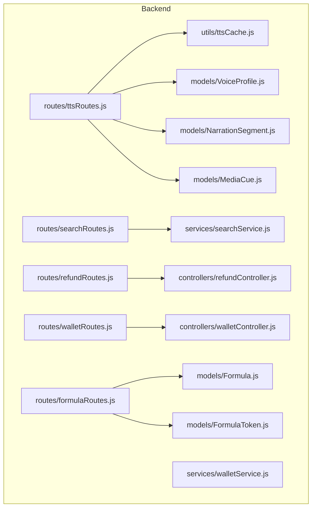
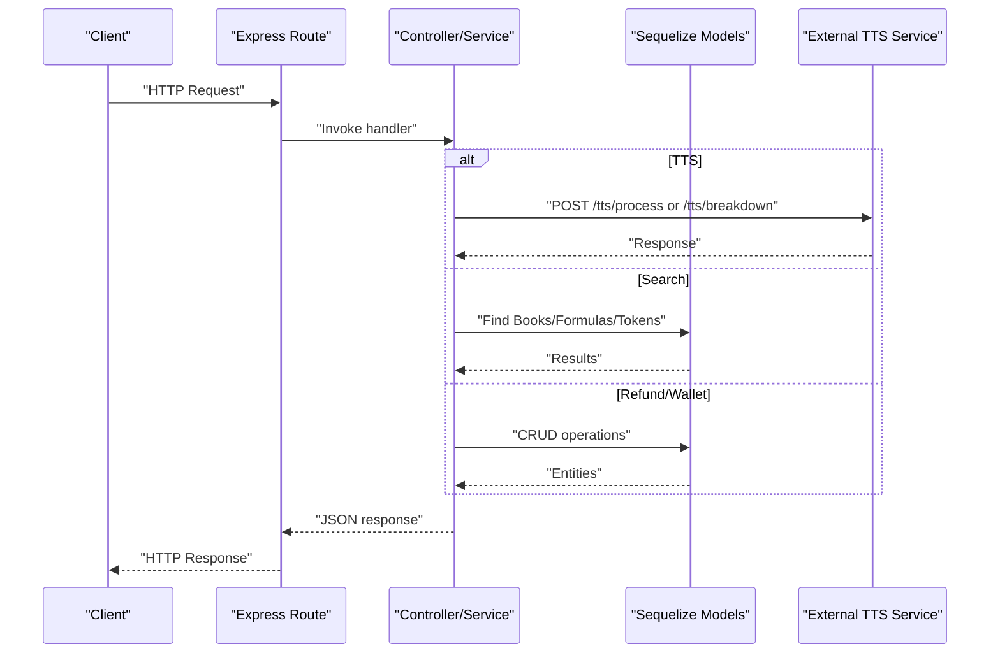
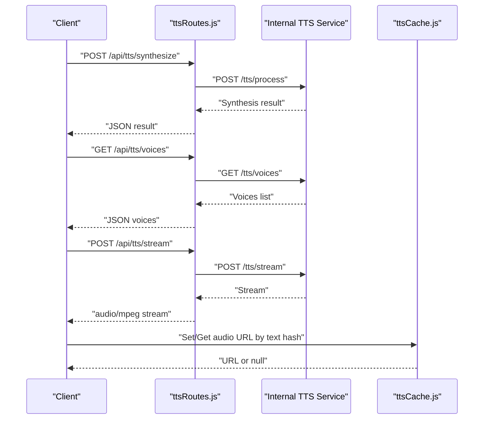
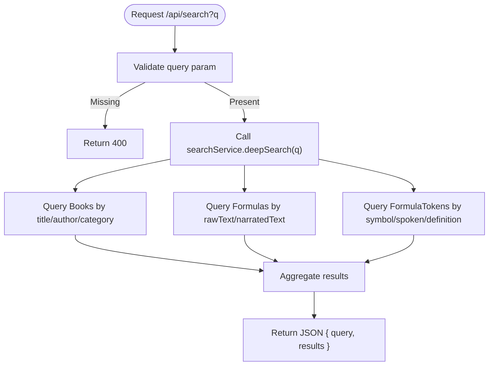
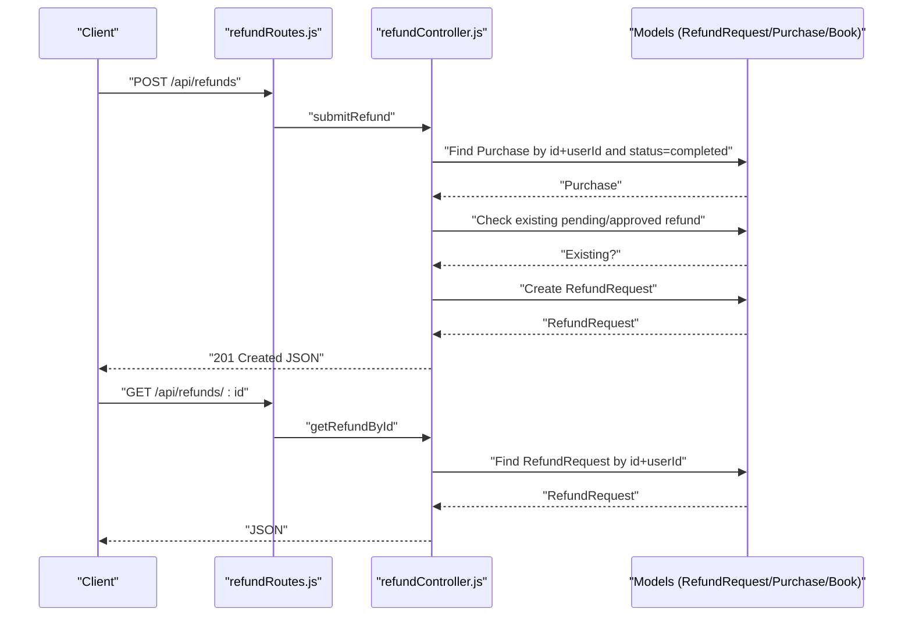
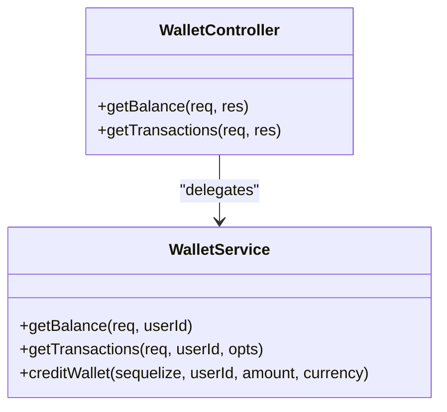
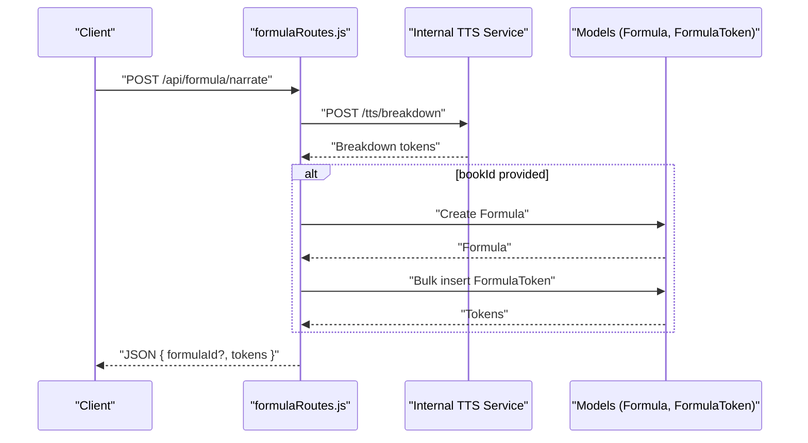
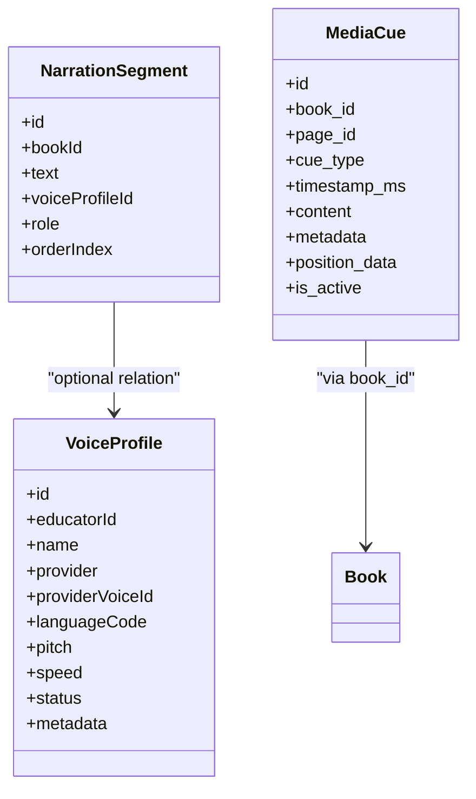
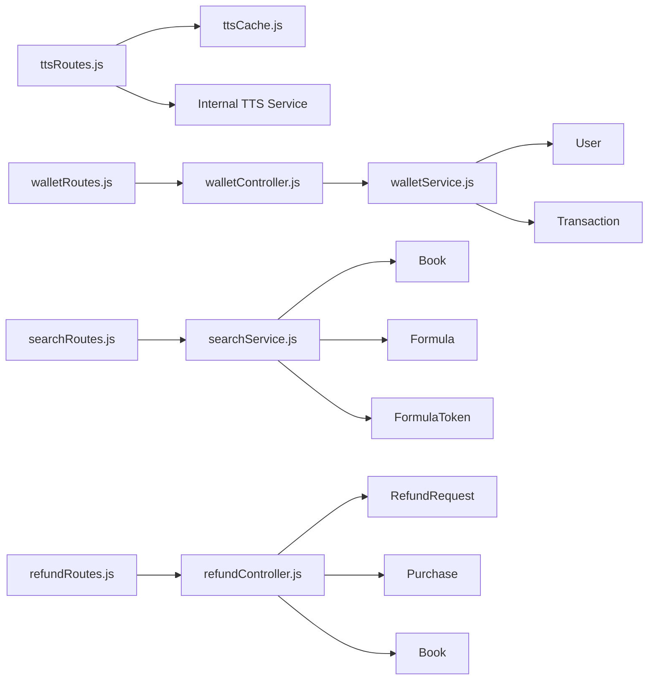

# Utility Services API

<cite>
**Referenced Files in This Document**
- [ttsRoutes.js](file://backend/routes/ttsRoutes.js)
- [searchRoutes.js](file://backend/routes/searchRoutes.js)
- [refundRoutes.js](file://backend/routes/refundRoutes.js)
- [walletRoutes.js](file://backend/routes/walletRoutes.js)
- [formulaRoutes.js](file://backend/routes/formulaRoutes.js)
- [refundController.js](file://backend/controllers/refundController.js)
- [walletController.js](file://backend/controllers/walletController.js)
- [searchService.js](file://backend/services/searchService.js)
- [walletService.js](file://backend/services/walletService.js)
- [ttsCache.js](file://backend/utils/ttsCache.js)
- [Formula.js](file://backend/models/Formulas.js)
- [FormulaToken.js](file://backend/models/FormulasTokens.js)
- [VoiceProfile.js](file://backend/models/VoiceProfiles.js)
- [MediaCue.js](file://backend/models/MediaCues.js)
- [NarrationSegment.js](file://backend/models/NarrationSegments.js)
</cite>

## Table of Contents
1. [Introduction](#introduction)
2. [Project Structure](#project-structure)
3. [Core Components](#core-components)
4. [Architecture Overview](#architecture-overview)
5. [Detailed Component Analysis](#detailed-component-analysis)
6. [Dependency Analysis](#dependency-analysis)
7. [Performance Considerations](#performance-considerations)
8. [Troubleshooting Guide](#troubleshooting-guide)
9. [Conclusion](#conclusion)

## Introduction
This document provides comprehensive API documentation for Utility Services endpoints focused on:
- Text-to-Speech (TTS): formula-aware synthesis, voice profiles, and audio generation
- Search: deep content discovery across books, formulas, and definitions
- Refund processing: learner-facing refund submission and retrieval
- Wallet utilities: balance and transaction history
- Cache management: Redis-backed caching for TTS audio URLs

It also covers STEM formula processing, voice cloning integration, and real-time search indexing, along with performance optimization tips and caching strategies.

## Project Structure
The backend exposes REST endpoints grouped under /api/*, with routes delegating to controllers/services and models. Utility services are implemented as Express routes backed by controllers, services, and Sequelize models.

**Diagram sources**
- [ttsRoutes.js:1-177](file://backend/routes/ttsRoutes.js#L1-L177)
- [searchRoutes.js:1-26](file://backend/routes/searchRoutes.js#L1-L26)
- [refundRoutes.js:1-31](file://backend/routes/refundRoutes.js#L1-L31)
- [walletRoutes.js:1-11](file://backend/routes/walletRoutes.js#L1-L11)
- [formulaRoutes.js:1-86](file://backend/routes/formulaRoutes.js#L1-L86)
- [refundController.js:1-145](file://backend/controllers/refundController.js#L1-L145)
- [walletController.js:1-17](file://backend/controllers/walletController.js#L1-L17)
- [searchService.js:1-67](file://backend/services/searchService.js#L1-L67)
- [walletService.js:1-80](file://backend/services/walletService.js#L1-L80)
- [ttsCache.js:1-59](file://backend/utils/ttsCache.js#L1-L59)
- [Formula.js:1-30](file://backend/models/Formulas.js#L1-L30)
- [FormulaToken.js:1-38](file://backend/models/FormulasTokens.js#L1-L38)
- [VoiceProfile.js:1-50](file://backend/models/VoiceProfiles.js#L1-L50)
- [MediaCue.js:1-49](file://backend/models/MediaCues.js#L1-L49)
- [NarrationSegment.js:1-34](file://backend/models/NarrationSegments.js#L1-L34)

**Section sources**
- [ttsRoutes.js:1-177](file://backend/routes/ttsRoutes.js#L1-L177)
- [searchRoutes.js:1-26](file://backend/routes/searchRoutes.js#L1-L26)
- [refundRoutes.js:1-31](file://backend/routes/refundRoutes.js#L1-L31)
- [walletRoutes.js:1-11](file://backend/routes/walletRoutes.js#L1-L11)
- [formulaRoutes.js:1-86](file://backend/routes/formulaRoutes.js#L1-L86)
- [refundController.js:1-145](file://backend/controllers/refundController.js#L1-L145)
- [walletController.js:1-17](file://backend/controllers/walletController.js#L1-L17)
- [searchService.js:1-67](file://backend/services/searchService.js#L1-L67)
- [walletService.js:1-80](file://backend/services/walletService.js#L1-L80)
- [ttsCache.js:1-59](file://backend/utils/ttsCache.js#L1-L59)
- [Formula.js:1-30](file://backend/models/Formulas.js#L1-L30)
- [FormulaToken.js:1-38](file://backend/models/FormulasTokens.js#L1-L38)
- [VoiceProfile.js:1-50](file://backend/models/VoiceProfiles.js#L1-L50)
- [MediaCue.js:1-49](file://backend/models/MediaCues.js#L1-L49)
- [NarrationSegment.js:1-34](file://backend/models/NarrationSegments.js#L1-L34)

## Core Components
- Text-to-Speech (TTS)
  - Formula-aware synthesis via breakdown endpoint and storage of tokens
  - Voice profile management and multi-role narration segments
  - Audio generation endpoints with proxy to internal TTS service
  - Redis caching for synthesized audio URLs
- Search
  - Deep search across books, formulas, and formula token definitions
- Refund Processing
  - Learner submits refund requests against completed purchases
  - Retrieve personal refund requests and details
- Wallet Utilities
  - Balance computation with live exchange rates and saved payment methods
  - Paginated transaction history with filters
- Cache Management
  - Redis-backed cache for TTS audio URLs with TTL and invalidation by book

**Section sources**
- [ttsRoutes.js:1-177](file://backend/routes/ttsRoutes.js#L1-L177)
- [formulaRoutes.js:1-86](file://backend/routes/formulaRoutes.js#L1-L86)
- [searchRoutes.js:1-26](file://backend/routes/searchRoutes.js#L1-L26)
- [refundRoutes.js:1-31](file://backend/routes/refundRoutes.js#L1-L31)
- [walletRoutes.js:1-11](file://backend/routes/walletRoutes.js#L1-L11)
- [ttsCache.js:1-59](file://backend/utils/ttsCache.js#L1-L59)

## Architecture Overview
The Utility Services rely on route handlers that authenticate requests, delegate to controllers/services, and interact with models and external services. TTS endpoints proxy to an internal FastAPI service and optionally cache results. Search aggregates across multiple models. Refund and wallet endpoints operate on domain models with robust validation.

**Diagram sources**
- [ttsRoutes.js:14-51](file://backend/routes/ttsRoutes.js#L14-L51)
- [formulaRoutes.js:14-65](file://backend/routes/formulaRoutes.js#L14-L65)
- [searchService.js:8-63](file://backend/services/searchService.js#L8-L63)
- [refundController.js:25-87](file://backend/controllers/refundController.js#L25-L87)
- [walletService.js:8-38](file://backend/services/walletService.js#L8-L38)

## Detailed Component Analysis

### Text-to-Speech (TTS) Endpoints
- Formula-aware synthesis
  - POST /api/formula/narrate
    - Accepts formula text, optional bookId, and field
    - Calls internal TTS breakdown endpoint
    - Optionally persists formula and tokens to database
- Voice profile management
  - GET /api/tts/voices
    - Lists available voices from TTS service
- Audio generation
  - POST /api/tts/synthesize
    - Proxies synthesis request with text, optional voiceId, speed, pitch, language, bookId
    - Returns synthesis results
  - POST /api/tts/multi
    - Multi-voice synthesis with segments and bookId
  - POST /api/tts/stream
    - Streams synthesized audio directly to client
  - GET /api/tts/stream-url
    - Stream URL with manual JWT token verification for audio tag compatibility
- Cache management
  - Redis cache stores audio URLs keyed by text hash with TTL and per-book invalidation

**Diagram sources**
- [ttsRoutes.js:14-140](file://backend/routes/ttsRoutes.js#L14-L140)
- [ttsCache.js:20-41](file://backend/utils/ttsCache.js#L20-L41)

**Section sources**
- [ttsRoutes.js:14-174](file://backend/routes/ttsRoutes.js#L14-L174)
- [formulaRoutes.js:14-65](file://backend/routes/formulaRoutes.js#L14-L65)
- [ttsCache.js:1-59](file://backend/utils/ttsCache.js#L1-L59)
- [VoiceProfile.js:1-50](file://backend/models/VoiceProfiles.js#L1-L50)
- [NarrationSegment.js:1-34](file://backend/models/NarrationSegments.js#L1-L34)
- [MediaCue.js:1-49](file://backend/models/MediaCues.js#L1-L49)

### Search Endpoints
- GET /api/search
  - Requires query parameter q
  - Delegates to searchService.deepSearch
  - Returns aggregated results across books, formulas, and formula tokens

**Diagram sources**
- [searchRoutes.js:10-23](file://backend/routes/searchRoutes.js#L10-L23)
- [searchService.js:8-63](file://backend/services/searchService.js#L8-L63)

**Section sources**
- [searchRoutes.js:10-23](file://backend/routes/searchRoutes.js#L10-L23)
- [searchService.js:1-67](file://backend/services/searchService.js#L1-L67)

### Refund Processing Endpoints
- POST /api/refunds
  - Submit refund request for a completed purchase owned by the user
  - Validates purchase existence, ownership, completion status, and absence of pending/approved refund
  - Creates refund request with amount and currency from purchase
- GET /api/refunds
  - List all refund requests for the authenticated user, including related purchase and book metadata
- GET /api/refunds/:id
  - Retrieve a single refund request by ID if owned by the user

**Diagram sources**
- [refundRoutes.js:14-28](file://backend/routes/refundRoutes.js#L14-L28)
- [refundController.js:25-87](file://backend/controllers/refundController.js#L25-L87)
- [refundController.js:120-144](file://backend/controllers/refundController.js#L120-L144)

**Section sources**
- [refundRoutes.js:1-31](file://backend/routes/refundRoutes.js#L1-L31)
- [refundController.js:1-145](file://backend/controllers/refundController.js#L1-L145)

### Wallet Utilities
- GET /api/wallet/balance
  - Returns user balances (SLL/USD), computed USD value using live exchange rate with fallback, and saved payment methods
- GET /api/wallet/transactions
  - Returns paginated transaction history filtered by optional type, method, and status

**Diagram sources**
- [walletController.js:8-16](file://backend/controllers/walletController.js#L8-L16)
- [walletService.js:8-79](file://backend/services/walletService.js#L8-L79)

**Section sources**
- [walletRoutes.js:7-8](file://backend/routes/walletRoutes.js#L7-L8)
- [walletController.js:1-17](file://backend/controllers/walletController.js#L1-L17)
- [walletService.js:1-80](file://backend/services/walletService.js#L1-L80)

### STEM Formula Processing
- POST /api/formula/narrate
  - Accepts formula text and optional bookId and field
  - Calls internal TTS breakdown endpoint to produce tokenized narration
  - Persists formula and tokens to database when bookId is provided
- Token retrieval
  - GET /api/formula/:id/tokens
    - Returns ordered tokens for a formula

**Diagram sources**
- [formulaRoutes.js:14-65](file://backend/routes/formulaRoutes.js#L14-L65)
- [Formula.js:1-30](file://backend/models/Formulas.js#L1-L30)
- [FormulaToken.js:1-38](file://backend/models/FormulasTokens.js#L1-L38)

**Section sources**
- [formulaRoutes.js:14-83](file://backend/routes/formulaRoutes.js#L14-L83)
- [Formula.js:1-30](file://backend/models/Formulas.js#L1-L30)
- [FormulaToken.js:1-38](file://backend/models/FormulasTokens.js#L1-L38)

### Voice Cloning Integration
- Voice profiles are managed via VoiceProfile model with provider, provider voice identifier, language, pitch, speed, and status
- Narration segments support multi-role narration (narrator, tutor, character, explainer) and can reference voice profiles
- Media cues enable synchronized media events keyed by timestamps and content

**Diagram sources**
- [VoiceProfile.js:1-50](file://backend/models/VoiceProfiles.js#L1-L50)
- [NarrationSegment.js:1-34](file://backend/models/NarrationSegments.js#L1-L34)
- [MediaCue.js:1-49](file://backend/models/MediaCues.js#L1-L49)

**Section sources**
- [VoiceProfile.js:1-50](file://backend/models/VoiceProfiles.js#L1-L50)
- [NarrationSegment.js:1-34](file://backend/models/NarrationSegments.js#L1-L34)
- [MediaCue.js:1-49](file://backend/models/MediaCues.js#L1-L49)

### Real-Time Search Indexing
- The search service aggregates results across Books, Formulas, and FormulaTokens
- To support real-time indexing, consider:
  - Triggering re-index on FormulaToken creation/updation
  - Maintaining a materialized view or separate index table for formula tokens
  - Using database triggers or background jobs to keep indices fresh

**Section sources**
- [searchService.js:8-63](file://backend/services/searchService.js#L8-L63)

## Dependency Analysis
- Route-layer dependencies
  - TTS routes depend on ttsCache and internal TTS service
  - Search route depends on searchService
  - Refund routes depend on refundController
  - Wallet routes depend on walletController
  - Formula routes depend on Formula and FormulaToken models
- Controller-layer dependencies
  - refundController depends on RefundRequest, Purchase, Book models
  - walletController delegates to walletService
- Service-layer dependencies
  - searchService depends on Book, Formula, FormulaToken models
  - walletService depends on User, Transaction models and exchangeRateService
- External integrations
  - TTS service via HTTP proxy
  - Redis for TTS cache
  - Live exchange rate service for wallet balances

**Diagram sources**
- [ttsRoutes.js:1-177](file://backend/routes/ttsRoutes.js#L1-L177)
- [searchRoutes.js:1-26](file://backend/routes/searchRoutes.js#L1-L26)
- [refundRoutes.js:1-31](file://backend/routes/refundRoutes.js#L1-L31)
- [walletRoutes.js:1-11](file://backend/routes/walletRoutes.js#L1-L11)
- [searchService.js:1-67](file://backend/services/searchService.js#L1-L67)
- [walletService.js:1-80](file://backend/services/walletService.js#L1-L80)
- [refundController.js:1-145](file://backend/controllers/refundController.js#L1-L145)
- [walletController.js:1-17](file://backend/controllers/walletController.js#L1-L17)
- [ttsCache.js:1-59](file://backend/utils/ttsCache.js#L1-L59)

**Section sources**
- [ttsRoutes.js:1-177](file://backend/routes/ttsRoutes.js#L1-L177)
- [searchRoutes.js:1-26](file://backend/routes/searchRoutes.js#L1-L26)
- [refundRoutes.js:1-31](file://backend/routes/refundRoutes.js#L1-L31)
- [walletRoutes.js:1-11](file://backend/routes/walletRoutes.js#L1-L11)
- [searchService.js:1-67](file://backend/services/searchService.js#L1-L67)
- [walletService.js:1-80](file://backend/services/walletService.js#L1-L80)
- [refundController.js:1-145](file://backend/controllers/refundController.js#L1-L145)
- [walletController.js:1-17](file://backend/controllers/walletController.js#L1-L17)
- [ttsCache.js:1-59](file://backend/utils/ttsCache.js#L1-L59)

## Performance Considerations
- TTS caching
  - Use Redis to cache synthesized audio URLs keyed by text hash
  - Set sensible TTL (default 30 days) to balance freshness and cost
  - Invalidate cache entries per book to refresh after content updates
- Query limits and pagination
  - Apply reasonable limits in deep search and transaction history
  - Paginate results to avoid large payloads
- Exchange rate reliability
  - Use live exchange rate with fallback to prevent downtime
- Streaming audio
  - Prefer streaming endpoints for large audio outputs to reduce memory usage
- Database indexing
  - Add indexes on commonly queried fields (e.g., formula tokens, book identifiers)
- Circuit breaker pattern
  - Wrap external TTS service calls with timeouts and retries to improve resilience

[No sources needed since this section provides general guidance]

## Troubleshooting Guide
- TTS synthesis unavailable
  - Verify TTS_SERVICE_URL environment variable
  - Check internal TTS service health and logs
  - Confirm Redis connectivity for caching operations
- Authentication failures
  - Ensure JWT token is present and valid for protected endpoints
  - For GET /api/tts/stream-url, confirm token verification logic
- Search failures
  - Confirm query parameter q is provided
  - Validate database connectivity and model associations
- Refund submission errors
  - Ensure purchase exists, belongs to user, and is completed
  - Check for existing pending/approved refund for the same purchase
- Wallet balance discrepancies
  - Confirm live exchange rate service availability and fallback logic
  - Validate saved payment methods query and user existence

**Section sources**
- [ttsRoutes.js:11-139](file://backend/routes/ttsRoutes.js#L11-L139)
- [searchRoutes.js:13-21](file://backend/routes/searchRoutes.js#L13-L21)
- [refundController.js:42-64](file://backend/controllers/refundController.js#L42-L64)
- [walletService.js:16-21](file://backend/services/walletService.js#L16-L21)

## Conclusion
The Utility Services provide a cohesive set of APIs for TTS synthesis with formula awareness, robust search capabilities, secure refund processing, and wallet management. By leveraging caching, pagination, and resilient external service integration, the system supports scalable and responsive STEM content delivery and user experiences.