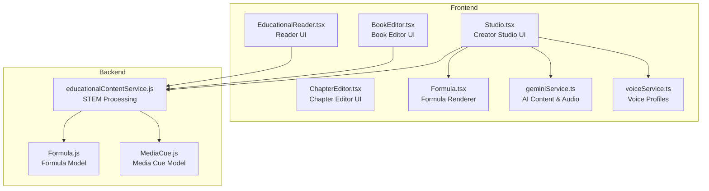
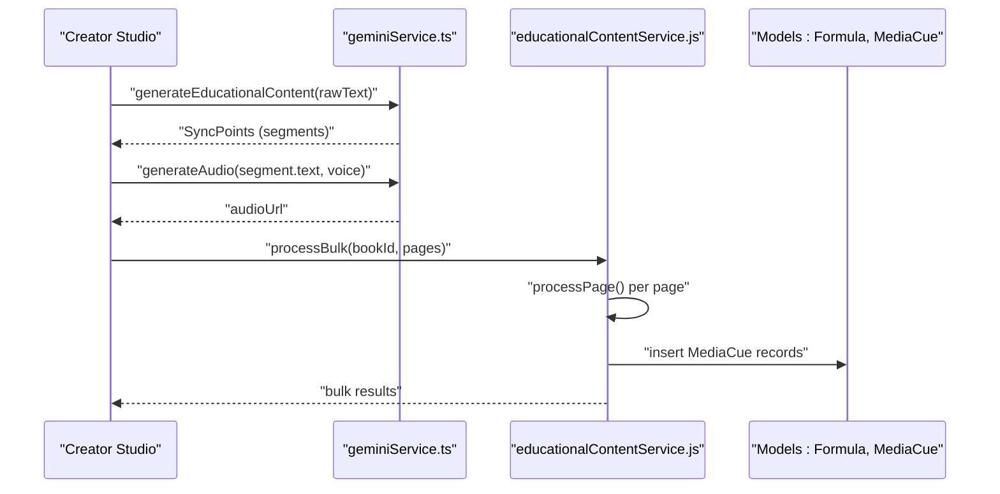
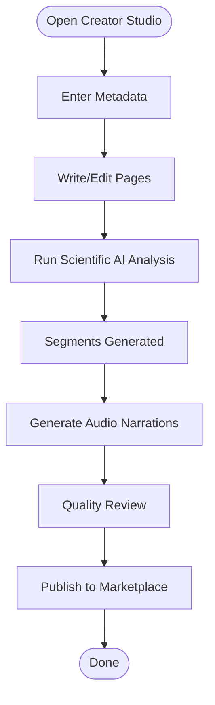
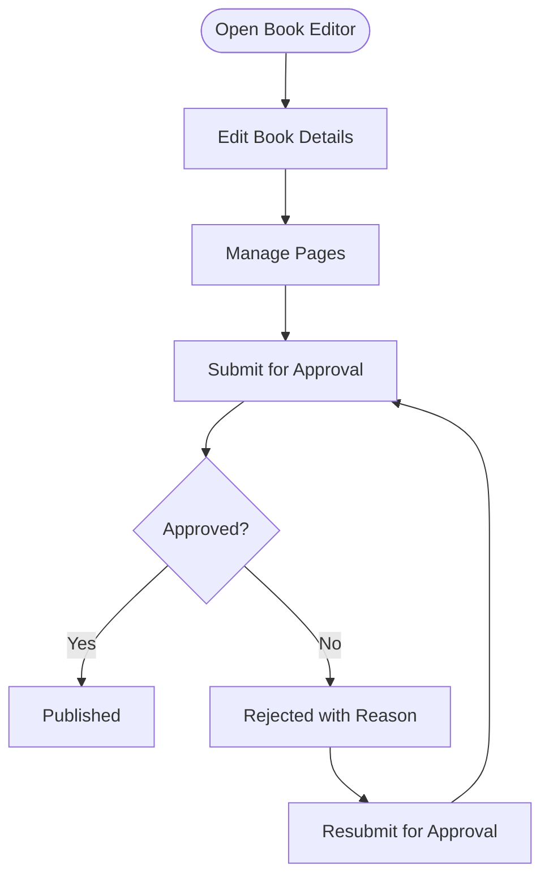
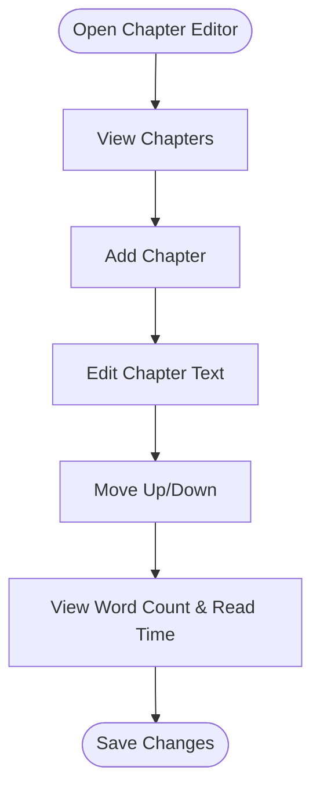
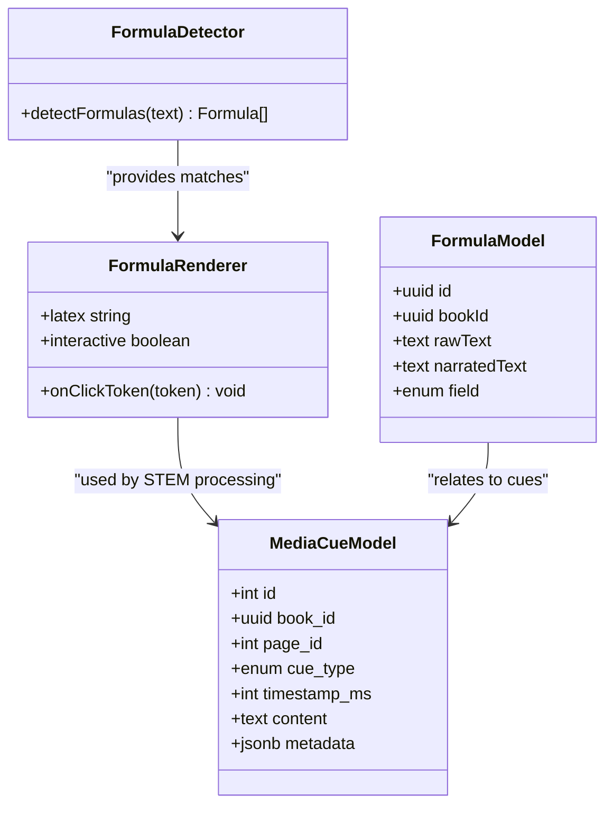
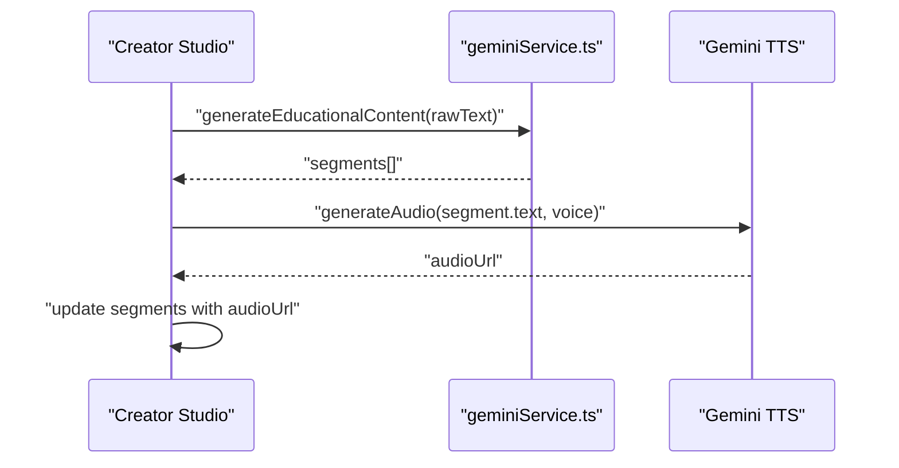
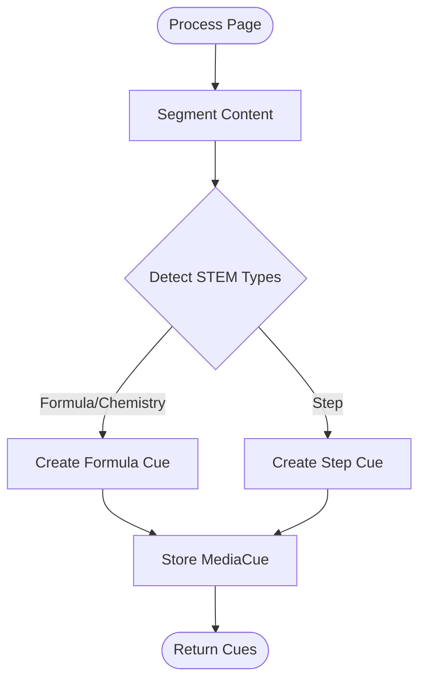
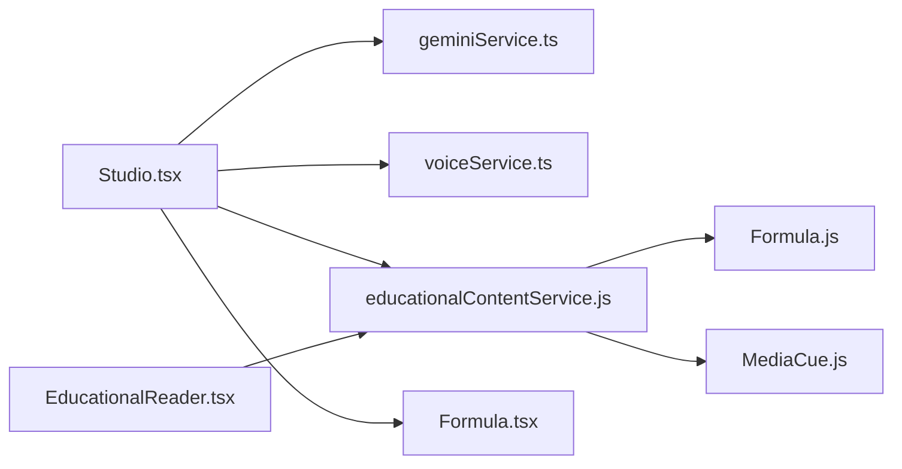

# Content Creation Tools

<cite>
**Referenced Files in This Document**
- [Studio.tsx](file://frontend/src/pages/Studio.tsx)
- [BookEditor.tsx](file://frontend/src/pages/BookEditor.tsx)
- [ChapterEditor.tsx](file://frontend/src/components/ChapterEditor.tsx)
- [Formula.tsx](file://frontend/src/components/ui/Formulas.tsx)
- [formulaDetector.ts](file://frontend/src/utils/text-analysis/formulaDetector.ts)
- [textAnalyzer.ts](file://frontend/src/utils/text-analysis/textAnalyzer.ts)
- [geminiService.ts](file://frontend/src/services/geminiService.ts)
- [voiceService.ts](file://frontend/src/services/voiceService.ts)
- [EducationalReader.tsx](file://frontend/src/pages/EducationalReader.tsx)
- [educationalContentService.js](file://backend/services/educationalContentService.js)
- [Formula.js](file://backend/models/Formula.js)
- [MediaCue.js](file://backend/models/MediaCue.js)
</cite>

## Table of Contents
1. [Introduction](#introduction)
2. [Project Structure](#project-structure)
3. [Core Components](#core-components)
4. [Architecture Overview](#architecture-overview)
5. [Detailed Component Analysis](#detailed-component-analysis)
6. [Dependency Analysis](#dependency-analysis)
7. [Performance Considerations](#performance-considerations)
8. [Troubleshooting Guide](#troubleshooting-guide)
9. [Conclusion](#conclusion)
10. [Appendices](#appendices)

## Introduction
This document describes the content creation tools that power the Creator Studio, educational book authoring, and AI-driven content analysis. It covers metadata management, multi-page editing, AI-powered generation, scientific analysis, formula detection, text analysis, content validation, and the end-to-end publishing workflow. It also provides step-by-step guides and best practices for creating high-quality educational content integrated with the AI analysis pipeline.

## Project Structure
The content creation stack spans the frontend React application and backend services:
- Frontend pages and components for Creator Studio, Book Editor, Chapter Editor, and Formula rendering
- AI services for educational content generation and audio synthesis
- Backend services orchestrating STEM analysis and cue generation
- Database models for formulas and media cues

**Diagram sources**
- [Studio.tsx:1-718](file://frontend/src/pages/Studio.tsx#L1-L718)
- [BookEditor.tsx:1-426](file://frontend/src/pages/BookEditor.tsx#L1-L426)
- [ChapterEditor.tsx:1-210](file://frontend/src/components/ChapterEditor.tsx#L1-L210)
- [Formula.tsx:1-116](file://frontend/src/components/ui/Formulas.tsx#L1-L116)
- [geminiService.ts:1-206](file://frontend/src/services/geminiService.ts#L1-L206)
- [voiceService.ts:1-53](file://frontend/src/services/voiceService.ts#L1-L53)
- [EducationalReader.tsx:1-401](file://frontend/src/pages/EducationalReader.tsx#L1-L401)
- [educationalContentService.js:1-181](file://backend/services/educationalContentService.js#L1-L181)
- [Formula.js:1-30](file://backend/models/Formula.js#L1-L30)
- [MediaCue.js:1-49](file://backend/models/MediaCue.js#L1-L49)

**Section sources**
- [Studio.tsx:1-718](file://frontend/src/pages/Studio.tsx#L1-L718)
- [BookEditor.tsx:1-426](file://frontend/src/pages/BookEditor.tsx#L1-L426)
- [ChapterEditor.tsx:1-210](file://frontend/src/components/ChapterEditor.tsx#L1-L210)
- [Formula.tsx:1-116](file://frontend/src/components/ui/Formulas.tsx#L1-L116)
- [geminiService.ts:1-206](file://frontend/src/services/geminiService.ts#L1-L206)
- [voiceService.ts:1-53](file://frontend/src/services/voiceService.ts#L1-L53)
- [EducationalReader.tsx:1-401](file://frontend/src/pages/EducationalReader.tsx#L1-L401)
- [educationalContentService.js:1-181](file://backend/services/educationalContentService.js#L1-L181)
- [Formula.js:1-30](file://backend/models/Formula.js#L1-L30)
- [MediaCue.js:1-49](file://backend/models/MediaCue.js#L1-L49)

## Core Components
- Creator Studio: Metadata form, multi-page editor, AI analysis, formula rendering, voice selection, and publish workflow.
- Book Editor: Traditional book management with pages, pricing, and approval workflow.
- Chapter Editor: Rich-text chapter authoring with ordering and word-count estimation.
- AI Services: Educational content generation and audio synthesis via Gemini APIs.
- STEM Processing Service: Backend orchestration for formula/step detection and media cue generation.
- Formula Renderer: Interactive LaTeX rendering with token breakdown and narration logging.
- Text Analysis Utilities: Formula detection and placeholders for grammar/math/scientific analysis.

**Section sources**
- [Studio.tsx:1-718](file://frontend/src/pages/Studio.tsx#L1-L718)
- [BookEditor.tsx:1-426](file://frontend/src/pages/BookEditor.tsx#L1-L426)
- [ChapterEditor.tsx:1-210](file://frontend/src/components/ChapterEditor.tsx#L1-L210)
- [Formula.tsx:1-116](file://frontend/src/components/ui/Formulas.tsx#L1-L116)
- [formulaDetector.ts:1-11](file://frontend/src/utils/text-analysis/formulaDetector.ts#L1-L11)
- [textAnalyzer.ts:1-49](file://frontend/src/utils/text-analysis/textAnalyzer.ts#L1-L49)
- [geminiService.ts:1-206](file://frontend/src/services/geminiService.ts#L1-L206)
- [educationalContentService.js:1-181](file://backend/services/educationalContentService.js#L1-L181)

## Architecture Overview
The Creator Studio integrates frontend UI with AI services and backend orchestration:
- Frontend collects metadata and page content, triggers AI analysis, and renders interactive formulas.
- AI services generate segments and audio; backend processes STEM content into cues and stores them.
- Reader UI consumes cues and synchronized audio for immersive learning.

**Diagram sources**
- [Studio.tsx:170-342](file://frontend/src/pages/Studio.tsx#L170-L342)
- [geminiService.ts:12-111](file://frontend/src/services/geminiService.ts#L12-L111)
- [educationalContentService.js:15-120](file://backend/services/educationalContentService.js#L15-L120)
- [Formula.js:1-30](file://backend/models/Formula.js#L1-L30)
- [MediaCue.js:1-49](file://backend/models/MediaCue.js#L1-L49)

## Detailed Component Analysis

### Creator Studio (Studio.tsx)
- Metadata Management: Title, author, description, genre, cover image via BookMetadataForm.
- Multi-page Editing: Pages array with titles and raw text; add/delete pages; active page tracking.
- AI-powered Content Generation: Calls educational content generator to produce segments with visual types and descriptions.
- Scientific Analysis: Invokes backend STEM processing to create formula/step cues with metadata.
- Text Import: File upload handler extracts text and splits into pages.
- Voice Selection: Uses VoiceService to manage available voices and selected voice ID.
- Audio Generation: Batch-generates audio for segments using Gemini TTS and updates segment state.
- Publishing: Creates book metadata, bulk-processes pages, and navigates to the new book.

**Diagram sources**
- [Studio.tsx:36-342](file://frontend/src/pages/Studio.tsx#L36-L342)

**Section sources**
- [Studio.tsx:1-718](file://frontend/src/pages/Studio.tsx#L1-L718)
- [geminiService.ts:12-111](file://frontend/src/services/geminiService.ts#L12-L111)
- [voiceService.ts:1-53](file://frontend/src/services/voiceService.ts#L1-L53)
- [educationalContentService.js:97-120](file://backend/services/educationalContentService.js#L97-L120)

### Book Editor (BookEditor.tsx)
- Book Details: Editable metadata, pricing, cover image, and status badges.
- Pages Management: Add, edit, delete pages; reorder by updating page numbers.
- Approval Workflow: Submit for approval, admin approve/reject with reasons.
- Status Tracking: Draft, pending_approval, published, rejected states.

**Diagram sources**
- [BookEditor.tsx:30-426](file://frontend/src/pages/BookEditor.tsx#L30-L426)

**Section sources**
- [BookEditor.tsx:1-426](file://frontend/src/pages/BookEditor.tsx#L1-L426)

### Chapter Editor (ChapterEditor.tsx)
- Rich-text editing with ReactQuill toolbar.
- Chapter list sidebar with add/move/delete actions.
- Word count estimation and reading time calculation.
- Maintains chapter order and updates on reordering.

**Diagram sources**
- [ChapterEditor.tsx:14-210](file://frontend/src/components/ChapterEditor.tsx#L14-L210)

**Section sources**
- [ChapterEditor.tsx:1-210](file://frontend/src/components/ChapterEditor.tsx#L1-L210)

### Formula Detection and Rendering
- Formula Detection: Inline LaTeX detection using a simple regex pattern.
- Formula Rendering: Interactive KaTeX rendering with token breakdown and narration logging.
- Backend Models: Formula and MediaCue tables support storing raw formulas, narrated text, and cue metadata.

**Diagram sources**
- [formulaDetector.ts:1-11](file://frontend/src/utils/text-analysis/formulaDetector.ts#L1-L11)
- [Formula.tsx:17-116](file://frontend/src/components/ui/Formulas.tsx#L17-L116)
- [Formula.js:1-30](file://backend/models/Formula.js#L1-L30)
- [MediaCue.js:1-49](file://backend/models/MediaCue.js#L1-L49)

**Section sources**
- [formulaDetector.ts:1-11](file://frontend/src/utils/text-analysis/formulaDetector.ts#L1-L11)
- [Formula.tsx:1-116](file://frontend/src/components/ui/Formulas.tsx#L1-L116)
- [Formula.js:1-30](file://backend/models/Formula.js#L1-L30)
- [MediaCue.js:1-49](file://backend/models/MediaCue.js#L1-L49)

### AI-powered Content Generation Workflow
- Educational Content Generation: Prompts Gemini to segment text into TEXT/FORMULA/IMAGE/STEP with visual descriptions.
- Audio Generation: Uses Gemini TTS to synthesize audio per segment with selectable voice profiles.
- Batch Processing: Frontend batches segment generation to improve throughput without overwhelming the service.

**Diagram sources**
- [geminiService.ts:12-111](file://frontend/src/services/geminiService.ts#L12-L111)
- [Studio.tsx:210-264](file://frontend/src/pages/Studio.tsx#L210-L264)

**Section sources**
- [geminiService.ts:1-206](file://frontend/src/services/geminiService.ts#L1-L206)
- [Studio.tsx:170-264](file://frontend/src/pages/Studio.tsx#L170-L264)

### Scientific Analysis Tools and Media Cues
- STEM Processing: Backend service segments content, detects math/chemistry steps, and creates cues with metadata and timestamps.
- Bulk Processing: Orchestrates multi-page processing in batches to balance performance and reliability.
- Cue Types: Visual, formula, step, highlight with JSON metadata for explanations and roles.

**Diagram sources**
- [educationalContentService.js:15-91](file://backend/services/educationalContentService.js#L15-L91)
- [MediaCue.js:1-49](file://backend/models/MediaCue.js#L1-L49)

**Section sources**
- [educationalContentService.js:1-181](file://backend/services/educationalContentService.js#L1-L181)
- [MediaCue.js:1-49](file://backend/models/MediaCue.js#L1-L49)

### Text Import Capabilities
- File Upload: Accepts PDF/DOCX/TXT; extracts text and splits into pages.
- Auto-save Drafts: Persists metadata, pages, and voice selection to local storage.

**Section sources**
- [Studio.tsx:60-122](file://frontend/src/pages/Studio.tsx#L60-L122)

### Formula Detection System
- Frontend Detection: Regex-based inline formula extraction.
- Backend Storage: Formula model captures raw and narrated text with subject classification.

**Section sources**
- [formulaDetector.ts:1-11](file://frontend/src/utils/text-analysis/formulaDetector.ts#L1-L11)
- [Formula.js:1-30](file://backend/models/Formula.js#L1-L30)

### Text Analysis Tools and Content Validation
- Text Analyzer: Interfaces for grammar, math, and scientific issues; placeholders for AI-driven analysis.
- Review UI: Grammar, math, and science viewers with suggestions and severity levels.

**Section sources**
- [textAnalyzer.ts:1-49](file://frontend/src/utils/text-analysis/textAnalyzer.ts#L1-L49)
- [Studio.tsx:557-714](file://frontend/src/pages/Studio.tsx#L557-L714)

### Book Editor Functionality: Chapter Management and Quality Review
- Chapter Management: Add/edit/delete chapters; reorder; estimate reading time.
- Quality Review: Placeholder components for grammar, math, and scientific accuracy checks.

**Section sources**
- [ChapterEditor.tsx:1-210](file://frontend/src/components/ChapterEditor.tsx#L1-L210)
- [Studio.tsx:557-714](file://frontend/src/pages/Studio.tsx#L557-L714)

## Dependency Analysis
- Creator Studio depends on AI services for content segmentation and audio synthesis, and on backend services for STEM processing and cue persistence.
- Formula renderer depends on KaTeX and interacts with backend for token breakdown.
- Reader consumes cues and synchronized audio produced by the backend.

**Diagram sources**
- [Studio.tsx:1-718](file://frontend/src/pages/Studio.tsx#L1-L718)
- [geminiService.ts:1-206](file://frontend/src/services/geminiService.ts#L1-L206)
- [voiceService.ts:1-53](file://frontend/src/services/voiceService.ts#L1-L53)
- [educationalContentService.js:1-181](file://backend/services/educationalContentService.js#L1-L181)
- [Formula.tsx:1-116](file://frontend/src/components/ui/Formulas.tsx#L1-L116)
- [Formula.js:1-30](file://backend/models/Formula.js#L1-L30)
- [MediaCue.js:1-49](file://backend/models/MediaCue.js#L1-L49)
- [EducationalReader.tsx:1-401](file://frontend/src/pages/EducationalReader.tsx#L1-L401)

**Section sources**
- [Studio.tsx:1-718](file://frontend/src/pages/Studio.tsx#L1-L718)
- [EducationalReader.tsx:1-401](file://frontend/src/pages/EducationalReader.tsx#L1-L401)

## Performance Considerations
- Batch Audio Generation: Frontend processes segments in small batches to balance throughput and responsiveness.
- Local Draft Persistence: Reduces server load and enables quick recovery.
- STEM Processing Batching: Backend processes pages in batches to avoid overload.
- Formula Rendering: Interactive breakdown fetches metadata asynchronously to keep UI responsive.

[No sources needed since this section provides general guidance]

## Troubleshooting Guide
- Publishing Errors: Ensure metadata is complete and all pages have segments; confirm network connectivity.
- Audio Generation Failures: Retry generation; verify voice availability and Gemini API limits.
- STEM Processing Failures: Check backend TTS service availability and logs; retry processing.
- Formula Rendering Issues: Confirm KaTeX is loaded and interactive mode is enabled.

**Section sources**
- [Studio.tsx:289-342](file://frontend/src/pages/Studio.tsx#L289-L342)
- [Studio.tsx:210-264](file://frontend/src/pages/Studio.tsx#L210-L264)
- [educationalContentService.js:15-91](file://backend/services/educationalContentService.js#L15-L91)

## Conclusion
The content creation tools combine a powerful Creator Studio with AI-driven generation and scientific analysis to produce immersive, synchronized educational books. The system supports multi-page editing, formula-aware rendering, voice customization, and robust publishing workflows, integrating seamlessly with backend STEM processing and cue storage.

[No sources needed since this section summarizes without analyzing specific files]

## Appendices

### Step-by-Step Guides

- Create a New Book
  - Enter metadata (title, author, description, genre, cover).
  - Add initial pages and write content.
  - Run Scientific AI Analysis to generate segments and cues.
  - Generate audio narrations for segments.
  - Preview and publish.

- Import Existing Content
  - Upload PDF/DOCX/TXT.
  - Extracted text is split into pages automatically.
  - Review and refine content before analysis.

- Publish Your Book
  - Ensure metadata and segments are complete.
  - Submit for bulk processing to backend STEM service.
  - Complete publishing and access the new book page.

- Best Practices for Educational Content
  - Keep segments concise and focused.
  - Use LaTeX for formulas and describe visual aids clearly.
  - Include step-by-step explanations for complex procedures.
  - Validate grammar and scientific accuracy before publishing.

[No sources needed since this section provides general guidance]