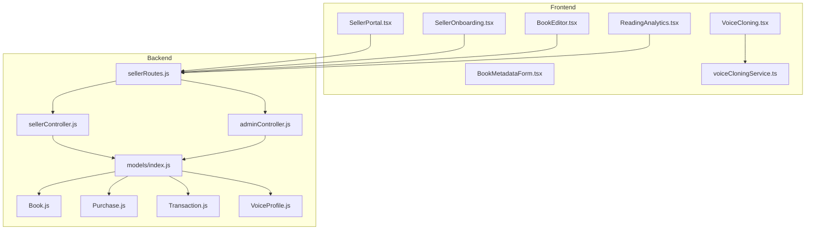
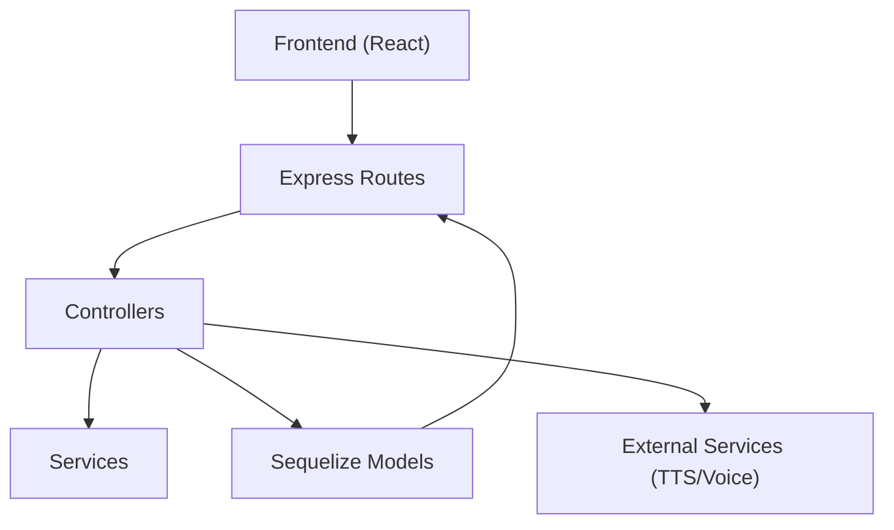
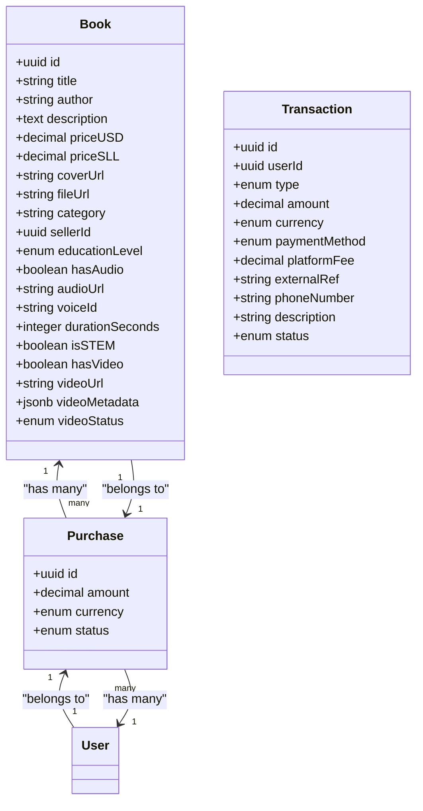
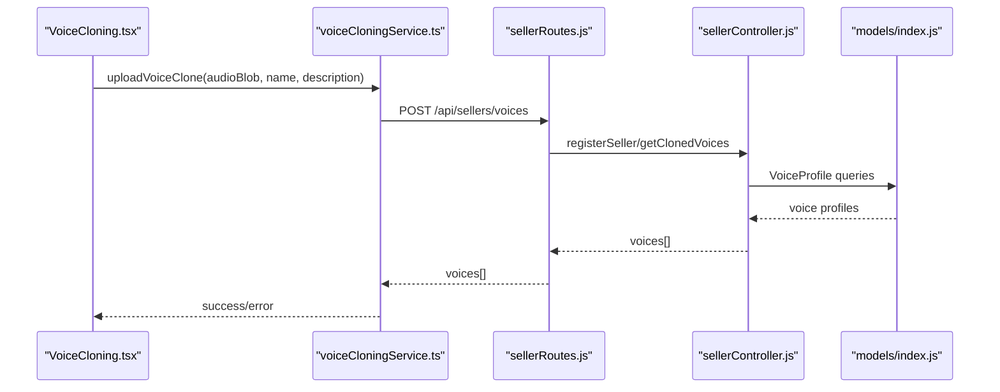
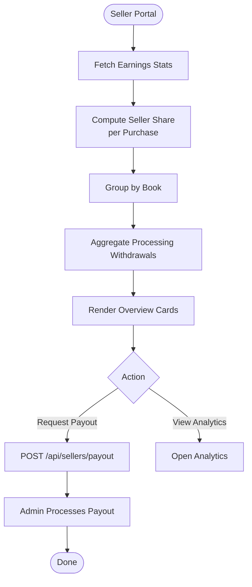
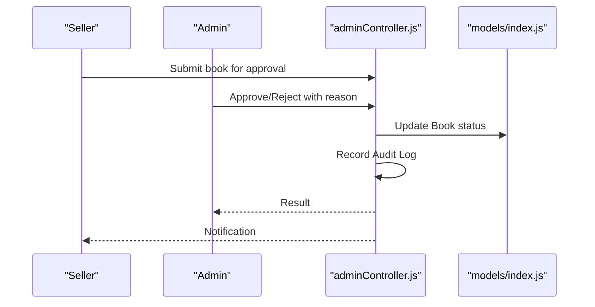
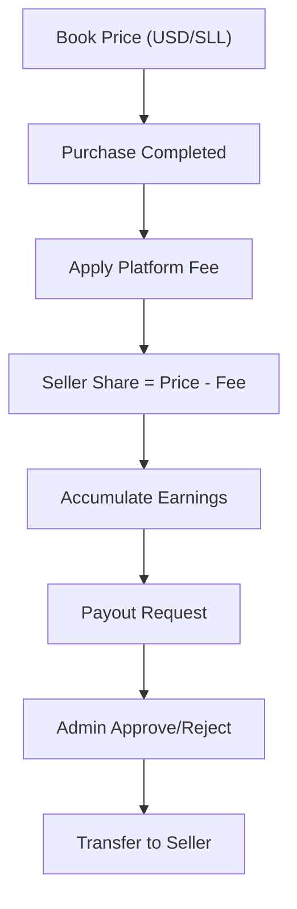
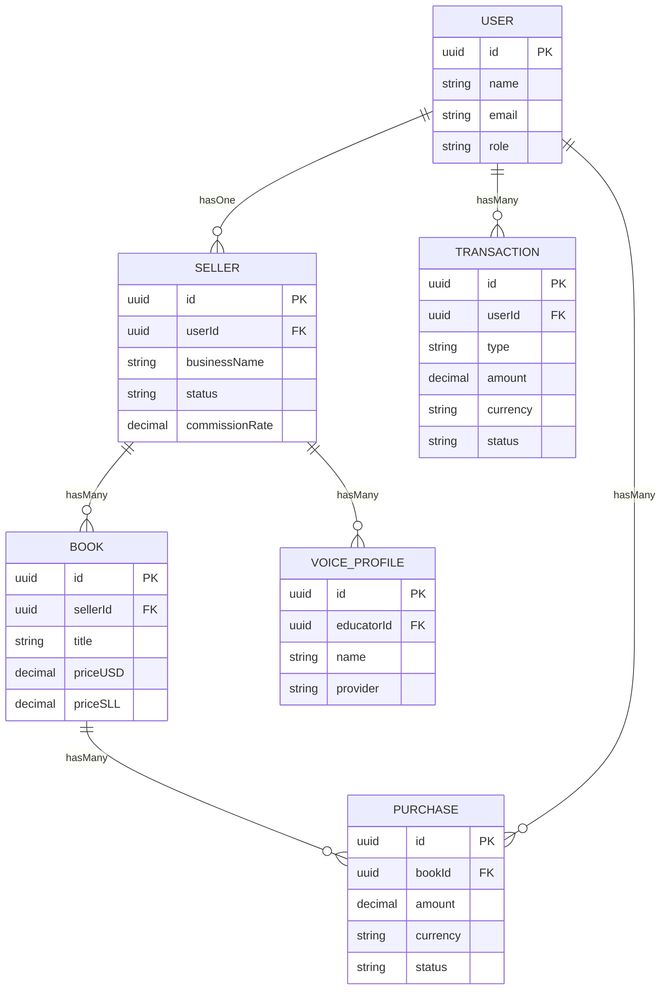

# Creator Platform

<cite>
**Referenced Files in This Document**
- [backend/models/index.js](file://backend/models/index.js)
- [backend/models/Book.js](file://backend/models/Book.js)
- [backend/models/Purchase.js](file://backend/models/Purchase.js)
- [backend/models/Transaction.js](file://backend/models/Transaction.js)
- [backend/models/VoiceProfile.js](file://backend/models/VoiceProfile.js)
- [backend/controllers/sellerController.js](file://backend/controllers/sellerController.js)
- [backend/controllers/adminController.js](file://backend/controllers/adminController.js)
- [backend/routes/sellerRoutes.js](file://backend/routes/sellerRoutes.js)
- [frontend/src/pages/SellerPortal.tsx](file://frontend/src/pages/SellerPortal.tsx)
- [frontend/src/pages/SellerOnboarding.tsx](file://frontend/src/pages/SellerOnboarding.tsx)
- [frontend/src/pages/BookEditor.tsx](file://frontend/src/pages/BookEditor.tsx)
- [frontend/src/components/BookMetadataForm.tsx](file://frontend/src/components/BookMetadataForm.tsx)
- [frontend/src/components/VoiceCloning.tsx](file://frontend/src/components/VoiceCloning.tsx)
- [frontend/src/services/voiceCloningService.ts](file://frontend/src/services/voiceCloningService.ts)
- [frontend/src/api/services/bookService.ts](file://frontend/src/api/services/bookService.ts)
- [frontend/src/services/analyticsService.ts](file://frontend/src/services/analyticsService.ts)
- [frontend/src/pages/ReadingAnalytics.tsx](file://frontend/src/pages/ReadingAnalytics.tsx)
</cite>

## Table of Contents
1. [Introduction](#introduction)
2. [Project Structure](#project-structure)
3. [Core Components](#core-components)
4. [Architecture Overview](#architecture-overview)
5. [Detailed Component Analysis](#detailed-component-analysis)
6. [Dependency Analysis](#dependency-analysis)
7. [Performance Considerations](#performance-considerations)
8. [Troubleshooting Guide](#troubleshooting-guide)
9. [Conclusion](#conclusion)
10. [Appendices](#appendices)

## Introduction
This document describes the Creator Platform that enables content creators to build, publish, and monetize educational audiobooks and multimedia content. It covers:
- Content creation tools: book editor, metadata management, and media integration
- Voice cloning for personalized narrators
- Publisher dashboard and analytics
- Revenue calculation and payouts
- Content approval workflow and quality standards
- Seller onboarding and performance analytics
- Examples of creator workflows, formatting guidelines, and revenue sharing calculations

## Project Structure
The platform is a full-stack system with:
- Backend: Express.js routes, controllers, Sequelize models, and services
- Frontend: React-based seller portal, onboarding, book editor, voice cloning UI, and analytics dashboards
- Services: TTS orchestration, voice cloning, analytics, and payment integrations

**Diagram sources**
- [frontend/src/pages/SellerPortal.tsx:1-322](file://frontend/src/pages/SellerPortal.tsx#L1-322)
- [frontend/src/pages/SellerOnboarding.tsx:1-264](file://frontend/src/pages/SellerOnboarding.tsx#L1-264)
- [frontend/src/pages/BookEditor.tsx:1-426](file://frontend/src/pages/BookEditor.tsx#L1-426)
- [frontend/src/components/BookMetadataForm.tsx:1-171](file://frontend/src/components/BookMetadataForm.tsx#L1-171)
- [frontend/src/components/VoiceCloning.tsx:1-381](file://frontend/src/components/VoiceCloning.tsx#L1-381)
- [frontend/src/services/voiceCloningService.ts:1-260](file://frontend/src/services/voiceCloningService.ts#L1-260)
- [frontend/src/pages/ReadingAnalytics.tsx:1-156](file://frontend/src/pages/ReadingAnalytics.tsx#L1-156)
- [backend/routes/sellerRoutes.js:1-42](file://backend/routes/sellerRoutes.js#L1-42)
- [backend/controllers/sellerController.js:1-211](file://backend/controllers/sellerController.js#L1-211)
- [backend/controllers/adminController.js:1-599](file://backend/controllers/adminController.js#L1-599)
- [backend/models/index.js:1-168](file://backend/models/index.js#L1-168)
- [backend/models/Book.js:1-92](file://backend/models/Book.js#L1-92)
- [backend/models/Purchase.js:1-26](file://backend/models/Purchase.js#L1-26)
- [backend/models/Transaction.js:1-54](file://backend/models/Transaction.js#L1-54)
- [backend/models/VoiceProfile.js:1-50](file://backend/models/VoiceProfile.js#L1-50)

**Section sources**
- [backend/models/index.js:1-168](file://backend/models/index.js#L1-168)
- [backend/models/Book.js:1-92](file://backend/models/Book.js#L1-92)
- [backend/models/Purchase.js:1-26](file://backend/models/Purchase.js#L1-26)
- [backend/models/Transaction.js:1-54](file://backend/models/Transaction.js#L1-54)
- [backend/models/VoiceProfile.js:1-50](file://backend/models/VoiceProfile.js#L1-50)
- [backend/controllers/sellerController.js:1-211](file://backend/controllers/sellerController.js#L1-211)
- [backend/controllers/adminController.js:1-599](file://backend/controllers/adminController.js#L1-599)
- [backend/routes/sellerRoutes.js:1-42](file://backend/routes/sellerRoutes.js#L1-42)
- [frontend/src/pages/SellerPortal.tsx:1-322](file://frontend/src/pages/SellerPortal.tsx#L1-322)
- [frontend/src/pages/SellerOnboarding.tsx:1-264](file://frontend/src/pages/SellerOnboarding.tsx#L1-264)
- [frontend/src/pages/BookEditor.tsx:1-426](file://frontend/src/pages/BookEditor.tsx#L1-426)
- [frontend/src/components/BookMetadataForm.tsx:1-171](file://frontend/src/components/BookMetadataForm.tsx#L1-171)
- [frontend/src/components/VoiceCloning.tsx:1-381](file://frontend/src/components/VoiceCloning.tsx#L1-381)
- [frontend/src/services/voiceCloningService.ts:1-260](file://frontend/src/services/voiceCloningService.ts#L1-260)
- [frontend/src/pages/ReadingAnalytics.tsx:1-156](file://frontend/src/pages/ReadingAnalytics.tsx#L1-156)

## Core Components
- Seller Portal: Overview, books, voice lab, video hub, analytics
- Seller Onboarding: Step-by-step checklist and quick start guide
- Book Editor: Metadata, pages, and approval workflow
- Voice Cloning: Recording or upload, preview, training, and testing
- Admin Controls: Seller/book moderation, payouts, refunds, audit logs
- Analytics: Revenue breakdown, audience demographics, and reading analytics

**Section sources**
- [frontend/src/pages/SellerPortal.tsx:1-322](file://frontend/src/pages/SellerPortal.tsx#L1-322)
- [frontend/src/pages/SellerOnboarding.tsx:1-264](file://frontend/src/pages/SellerOnboarding.tsx#L1-264)
- [frontend/src/pages/BookEditor.tsx:1-426](file://frontend/src/pages/BookEditor.tsx#L1-426)
- [frontend/src/components/VoiceCloning.tsx:1-381](file://frontend/src/components/VoiceCloning.tsx#L1-381)
- [backend/controllers/adminController.js:1-599](file://backend/controllers/adminController.js#L1-599)
- [frontend/src/pages/ReadingAnalytics.tsx:1-156](file://frontend/src/pages/ReadingAnalytics.tsx#L1-156)

## Architecture Overview
The platform follows a layered architecture:
- Presentation Layer: React pages and components
- API Layer: Express routes delegating to controllers
- Domain Layer: Controllers orchestrating models and services
- Data Layer: Sequelize models and database relations
- External Integrations: TTS, voice cloning, analytics

**Diagram sources**
- [backend/routes/sellerRoutes.js:1-42](file://backend/routes/sellerRoutes.js#L1-42)
- [backend/controllers/sellerController.js:1-211](file://backend/controllers/sellerController.js#L1-211)
- [backend/controllers/adminController.js:1-599](file://backend/controllers/adminController.js#L1-599)
- [backend/models/index.js:1-168](file://backend/models/index.js#L1-168)

## Detailed Component Analysis

### Content Creation Tools
- Book Editor: Manages metadata, pages, pricing, and approval lifecycle
- Metadata Management: Structured form for title, author, description, genre, and cover image
- Media Integration: Supports audio/video fields and statuses on Book model

**Diagram sources**
- [backend/models/Book.js:1-92](file://backend/models/Book.js#L1-92)
- [backend/models/Purchase.js:1-26](file://backend/models/Purchase.js#L1-26)
- [backend/models/Transaction.js:1-54](file://backend/models/Transaction.js#L1-54)
- [backend/models/index.js:63-65](file://backend/models/index.js#L63-L65)

**Section sources**
- [frontend/src/pages/BookEditor.tsx:1-426](file://frontend/src/pages/BookEditor.tsx#L1-426)
- [frontend/src/components/BookMetadataForm.tsx:1-171](file://frontend/src/components/BookMetadataForm.tsx#L1-171)
- [backend/models/Book.js:1-92](file://backend/models/Book.js#L1-92)

### Voice Cloning System
- UI: Capture live audio via microphone or upload audio file; preview and train
- Service: Upload voice samples, manage clones, generate test audio
- Backend: Fetch cloned voices for the authenticated seller

**Diagram sources**
- [frontend/src/components/VoiceCloning.tsx:109-153](file://frontend/src/components/VoiceCloning.tsx#L109-L153)
- [frontend/src/services/voiceCloningService.ts:7-39](file://frontend/src/services/voiceCloningService.ts#L7-L39)
- [backend/routes/sellerRoutes.js:35-39](file://backend/routes/sellerRoutes.js#L35-L39)
- [backend/controllers/sellerController.js:195-210](file://backend/controllers/sellerController.js#L195-L210)
- [backend/models/index.js:87-89](file://backend/models/index.js#L87-L89)

**Section sources**
- [frontend/src/components/VoiceCloning.tsx:1-381](file://frontend/src/components/VoiceCloning.tsx#L1-381)
- [frontend/src/services/voiceCloningService.ts:1-260](file://frontend/src/services/voiceCloningService.ts#L1-260)
- [backend/controllers/sellerController.js:195-210](file://backend/controllers/sellerController.js#L195-L210)
- [backend/models/VoiceProfile.js:1-50](file://backend/models/VoiceProfile.js#L1-50)

### Publisher Dashboard and Revenue Analytics
- Seller Portal: Overview cards (earnings, pending payout, sales, growth), revenue breakdown by book, recent payouts
- Revenue calculation: Platform fee deducted per sale; earnings computed per currency
- Payout requests: Sellers can request withdrawals; admins process payouts

**Diagram sources**
- [frontend/src/pages/SellerPortal.tsx:126-318](file://frontend/src/pages/SellerPortal.tsx#L126-L318)
- [backend/controllers/sellerController.js:77-157](file://backend/controllers/sellerController.js#L77-L157)
- [backend/controllers/adminController.js:362-425](file://backend/controllers/adminController.js#L362-L425)
- [backend/models/Purchase.js:1-26](file://backend/models/Purchase.js#L1-26)
- [backend/models/Transaction.js:1-54](file://backend/models/Transaction.js#L1-54)

**Section sources**
- [frontend/src/pages/SellerPortal.tsx:1-322](file://frontend/src/pages/SellerPortal.tsx#L1-322)
- [backend/controllers/sellerController.js:77-157](file://backend/controllers/sellerController.js#L77-L157)
- [backend/controllers/adminController.js:362-425](file://backend/controllers/adminController.js#L362-L425)

### Content Approval Workflow and Quality Standards
- Seller submits book for approval; admin approves/rejects with optional reason
- Bulk moderation supported for efficiency
- Audit logging tracks all moderation actions

**Diagram sources**
- [frontend/src/pages/BookEditor.tsx:121-140](file://frontend/src/pages/BookEditor.tsx#L121-L140)
- [backend/controllers/adminController.js:102-130](file://backend/controllers/adminController.js#L102-L130)
- [backend/models/index.js:75-77](file://backend/models/index.js#L75-L77)

**Section sources**
- [frontend/src/pages/BookEditor.tsx:121-140](file://frontend/src/pages/BookEditor.tsx#L121-L140)
- [backend/controllers/adminController.js:102-130](file://backend/controllers/adminController.js#L102-L130)

### Monetization Options and Revenue Sharing
- Pricing: USD and SLL prices per book
- Commission: Default platform fee applied per sale
- Revenue split: Seller receives 100% minus platform fee per completed purchase
- Currency handling: Separate totals for USD and SLL earnings

**Diagram sources**
- [backend/models/Book.js:22-31](file://backend/models/Book.js#L22-L31)
- [backend/controllers/sellerController.js:98-111](file://backend/controllers/sellerController.js#L98-L111)
- [backend/models/Purchase.js:10-17](file://backend/models/Purchase.js#L10-L17)
- [backend/models/Transaction.js:14-28](file://backend/models/Transaction.js#L14-L28)

**Section sources**
- [backend/models/Book.js:22-31](file://backend/models/Book.js#L22-L31)
- [backend/controllers/sellerController.js:98-111](file://backend/controllers/sellerController.js#L98-L111)
- [backend/models/Purchase.js:10-17](file://backend/models/Purchase.js#L10-L17)
- [backend/models/Transaction.js:14-28](file://backend/models/Transaction.js#L14-L28)

### Seller Onboarding Process
- Step-by-step checklist: email verification, profile completion, bank verification, publish first book, agreement review
- Progress tracking and quick start guide for creating content and understanding earnings

**Section sources**
- [frontend/src/pages/SellerOnboarding.tsx:1-264](file://frontend/src/pages/SellerOnboarding.tsx#L1-264)

### Content Management Tools
- Create, update, delete books
- Search and filter books
- Analytics per book (placeholder in UI)

**Section sources**
- [frontend/src/api/services/bookService.ts:1-47](file://frontend/src/api/services/bookService.ts#L1-47)
- [frontend/src/pages/BookEditor.tsx:194-272](file://frontend/src/pages/BookEditor.tsx#L194-L272)

### Performance Analytics
- Reading analytics dashboard with charts for weekly activity and genre distribution
- Analytics service supports tracking events, conversions, and performance metrics

**Section sources**
- [frontend/src/pages/ReadingAnalytics.tsx:1-156](file://frontend/src/pages/ReadingAnalytics.tsx#L1-156)
- [frontend/src/services/analyticsService.ts:1-145](file://frontend/src/services/analyticsService.ts#L1-145)

## Dependency Analysis
The backend models define associations among Users, Sellers, Books, Purchases, Transactions, and VoiceProfiles. These relationships underpin seller earnings, approvals, and voice management.

**Diagram sources**
- [backend/models/index.js:45-166](file://backend/models/index.js#L45-L166)

**Section sources**
- [backend/models/index.js:45-166](file://backend/models/index.js#L45-L166)

## Performance Considerations
- Asynchronous processing: Voice cloning training is asynchronous; UI should poll status or use WebSocket updates
- Batch moderation: Bulk book status updates reduce admin workload
- Caching: Cache frequently accessed seller stats and book metadata
- Pagination: Use pagination for audit logs, refund requests, and user listings
- Database indexing: Index on purchase status, book sellerId, and transaction userId for faster queries

## Troubleshooting Guide
- Voice cloning upload failures: Validate file size and type limits; ensure microphone permissions; handle network errors gracefully
- Payout processing: Verify sufficient balance; ensure bank verification; confirm payment method availability
- Approval rejections: Provide clear rejection reasons; allow resubmission
- Analytics rendering: Ensure chart libraries are loaded; handle empty datasets gracefully

**Section sources**
- [frontend/src/components/VoiceCloning.tsx:81-107](file://frontend/src/components/VoiceCloning.tsx#L81-L107)
- [frontend/src/services/voiceCloningService.ts:21-39](file://frontend/src/services/voiceCloningService.ts#L21-L39)
- [backend/controllers/sellerController.js:162-193](file://backend/controllers/sellerController.js#L162-L193)
- [backend/controllers/adminController.js:377-425](file://backend/controllers/adminController.js#L377-L425)

## Conclusion
The Creator Platform integrates robust content creation, voice personalization, and monetization workflows. Its modular architecture supports scalable growth, while admin controls and audit logs ensure governance and transparency. Sellers can efficiently manage content, personalize narration, and track earnings, all within a unified dashboard.

## Appendices

### Creator Workflows
- Onboarding: Complete email verification → profile → bank verification → publish first book → review agreement
- Publishing: Create/edit metadata → add pages and media → submit for approval → approve/reject cycle → publish
- Personalization: Record or upload voice sample → preview → train → test → select default voice
- Earnings: Monitor overview → request payout → admin processing → receive funds

**Section sources**
- [frontend/src/pages/SellerOnboarding.tsx:23-66](file://frontend/src/pages/SellerOnboarding.tsx#L23-L66)
- [frontend/src/pages/BookEditor.tsx:121-140](file://frontend/src/pages/BookEditor.tsx#L121-L140)
- [frontend/src/components/VoiceCloning.tsx:33-79](file://frontend/src/components/VoiceCloning.tsx#L33-L79)
- [frontend/src/pages/SellerPortal.tsx:45-58](file://frontend/src/pages/SellerPortal.tsx#L45-L58)

### Content Formatting Guidelines
- Metadata: Title, author, description, genre, cover image (recommended size)
- Pricing: Set both USD and SLL prices; ensure accurate conversion rates
- Media: Audio duration and URLs; video metadata and status fields

**Section sources**
- [frontend/src/components/BookMetadataForm.tsx:56-121](file://frontend/src/components/BookMetadataForm.tsx#L56-L121)
- [backend/models/Book.js:22-87](file://backend/models/Book.js#L22-L87)

### Revenue Sharing Calculations
- Per sale: Platform fee = price × commission rate; seller share = price − fee
- Totals: Aggregate per currency; pending payouts reflect processing withdrawals

**Section sources**
- [backend/controllers/sellerController.js:98-111](file://backend/controllers/sellerController.js#L98-L111)
- [backend/models/Purchase.js:10-17](file://backend/models/Purchase.js#L10-L17)
- [backend/models/Transaction.js:14-28](file://backend/models/Transaction.js#L14-L28)