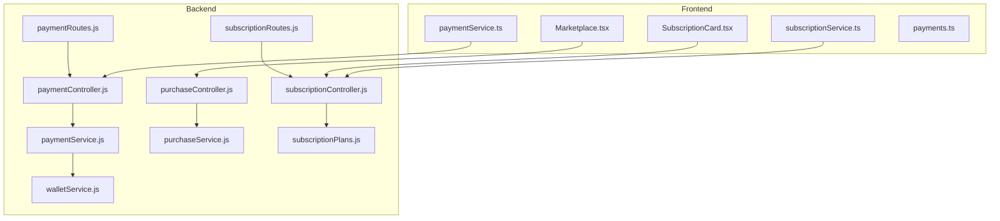
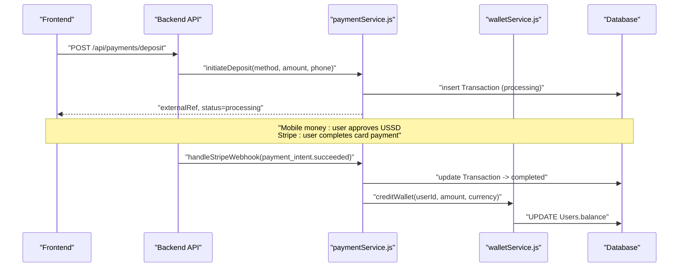
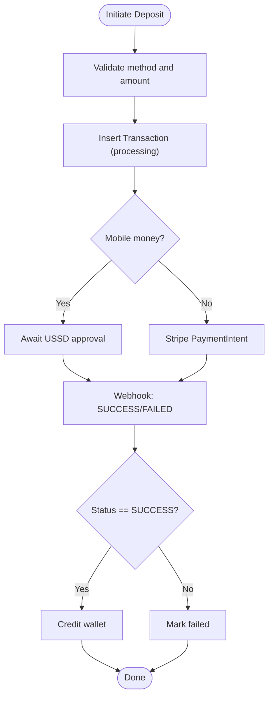
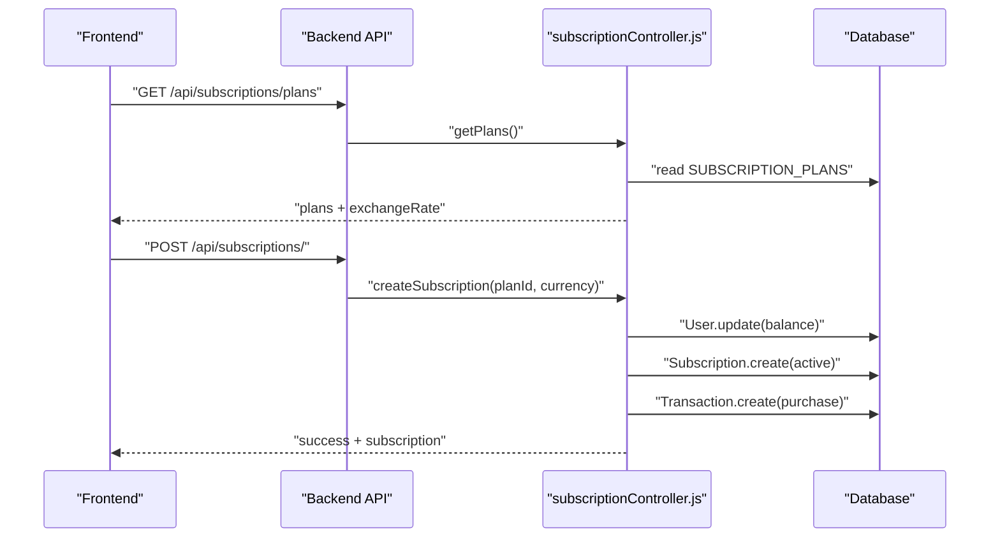
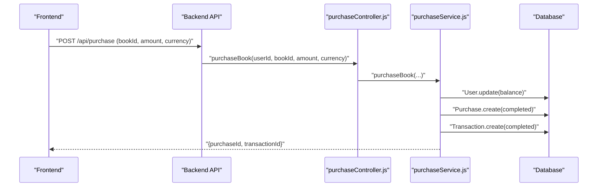
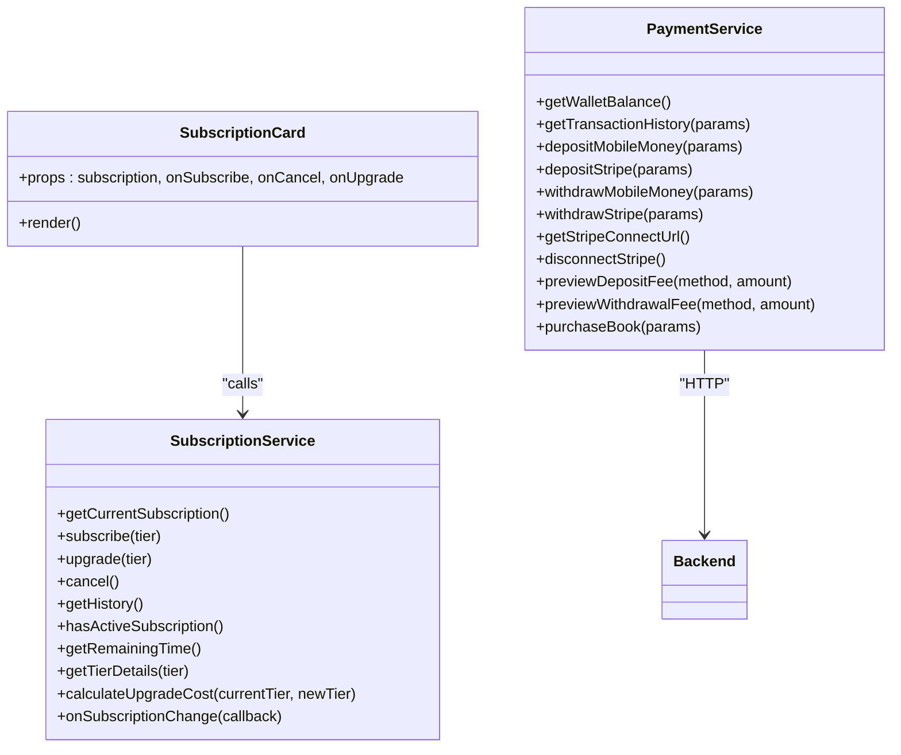
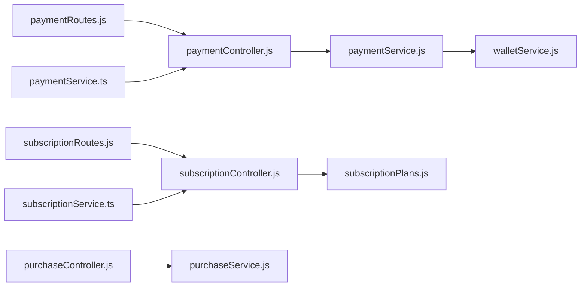

# Monetization and Revenue Systems

<cite>
**Referenced Files in This Document**
- [paymentController.js](file://backend/controllers/paymentController.js)
- [subscriptionController.js](file://backend/controllers/subscriptionController.js)
- [purchaseController.js](file://backend/controllers/purchaseController.js)
- [paymentService.js](file://backend/services/paymentService.js)
- [purchaseService.js](file://backend/services/purchaseService.js)
- [subscriptionPlans.js](file://backend/config/subscriptionPlans.js)
- [walletService.js](file://backend/services/walletService.js)
- [paymentRoutes.js](file://backend/routes/paymentRoutes.js)
- [subscriptionRoutes.js](file://backend/routes/subscriptionRoutes.js)
- [SubscriptionCard.tsx](file://frontend/src/components/SubscriptionCard.tsx)
- [Marketplace.tsx](file://frontend/src/pages/Marketplace.tsx)
- [paymentService.ts](file://frontend/src/services/paymentService.ts)
- [subscriptionService.ts](file://frontend/src/services/subscriptionService.ts)
- [payments.ts](file://frontend/src/types/payments.ts)
</cite>

## Table of Contents
1. [Introduction](#introduction)
2. [Project Structure](#project-structure)
3. [Core Components](#core-components)
4. [Architecture Overview](#architecture-overview)
5. [Detailed Component Analysis](#detailed-component-analysis)
6. [Dependency Analysis](#dependency-analysis)
7. [Performance Considerations](#performance-considerations)
8. [Troubleshooting Guide](#troubleshooting-guide)
9. [Conclusion](#conclusion)
10. [Appendices](#appendices)

## Introduction
This document explains the monetization and revenue systems powering the platform’s marketplace, subscriptions, and payments. It covers:
- Marketplace integration for content sales
- Subscription management and billing
- Payment processing workflows across mobile money and Stripe
- Revenue sharing and commission structures
- Pricing strategies and commission models
- Subscription billing engine and recurring payment handling
- Revenue distribution algorithms
- Frontend components for subscription cards and marketplace browsing
- Guidelines for pricing optimization, revenue forecasting, and monetization strategy development

## Project Structure
The monetization stack spans backend controllers, services, and routes, plus frontend services and components:
- Backend
  - Controllers: payment, subscription, purchase
  - Services: payment, purchase, wallet, exchange rate
  - Routes: payment, subscription
  - Config: subscription plans
- Frontend
  - Pages: Marketplace
  - Components: SubscriptionCard
  - Services: paymentService, subscriptionService
  - Types: payments

**Diagram sources**
- [paymentController.js:1-99](file://backend/controllers/paymentController.js#L1-L99)
- [subscriptionController.js:1-171](file://backend/controllers/subscriptionController.js#L1-L171)
- [purchaseController.js:1-13](file://backend/controllers/purchaseController.js#L1-L13)
- [paymentService.js:1-234](file://backend/services/paymentService.js#L1-L234)
- [purchaseService.js:1-68](file://backend/services/purchaseService.js#L1-L68)
- [walletService.js:1-80](file://backend/services/walletService.js#L1-L80)
- [subscriptionRoutes.js:1-18](file://backend/routes/subscriptionRoutes.js#L1-L18)
- [paymentRoutes.js:1-22](file://backend/routes/paymentRoutes.js#L1-L22)
- [subscriptionPlans.js:1-21](file://backend/config/subscriptionPlans.js#L1-L21)
- [paymentService.ts:1-153](file://frontend/src/services/paymentService.ts#L1-L153)
- [subscriptionService.ts:1-161](file://frontend/src/services/subscriptionService.ts#L1-L161)
- [Marketplace.tsx:1-264](file://frontend/src/pages/Marketplace.tsx#L1-L264)
- [SubscriptionCard.tsx:1-185](file://frontend/src/components/SubscriptionCard.tsx#L1-L185)
- [payments.ts:1-195](file://frontend/src/types/payments.ts#L1-L195)

**Section sources**
- [paymentController.js:1-99](file://backend/controllers/paymentController.js#L1-L99)
- [subscriptionController.js:1-171](file://backend/controllers/subscriptionController.js#L1-L171)
- [purchaseController.js:1-13](file://backend/controllers/purchaseController.js#L1-L13)
- [paymentService.js:1-234](file://backend/services/paymentService.js#L1-L234)
- [purchaseService.js:1-68](file://backend/services/purchaseService.js#L1-L68)
- [walletService.js:1-80](file://backend/services/walletService.js#L1-L80)
- [subscriptionRoutes.js:1-18](file://backend/routes/subscriptionRoutes.js#L1-L18)
- [paymentRoutes.js:1-22](file://backend/routes/paymentRoutes.js#L1-L22)
- [subscriptionPlans.js:1-21](file://backend/config/subscriptionPlans.js#L1-L21)
- [paymentService.ts:1-153](file://frontend/src/services/paymentService.ts#L1-L153)
- [subscriptionService.ts:1-161](file://frontend/src/services/subscriptionService.ts#L1-L161)
- [Marketplace.tsx:1-264](file://frontend/src/pages/Marketplace.tsx#L1-L264)
- [SubscriptionCard.tsx:1-185](file://frontend/src/components/SubscriptionCard.tsx#L1-L185)
- [payments.ts:1-195](file://frontend/src/types/payments.ts#L1-L195)

## Core Components
- Payment processing (mobile money and Stripe)
  - Controllers expose endpoints for deposits, withdrawals, and Stripe Connect OAuth
  - Services validate amounts, compute fees, orchestrate transactions, and handle webhooks
- Subscription management
  - Controllers manage plan retrieval, activation, cancellation, and history
  - Services enforce currency pricing, user balance checks, and transactional updates
- Purchase system
  - Controllers coordinate book purchases via wallet balances
  - Services validate book price, user balance, and record transactions
- Frontend services and components
  - paymentService.ts and subscriptionService.ts wrap backend APIs
  - SubscriptionCard.tsx renders subscription state and actions
  - Marketplace.tsx provides content discovery and filtering

**Section sources**
- [paymentController.js:1-99](file://backend/controllers/paymentController.js#L1-L99)
- [subscriptionController.js:1-171](file://backend/controllers/subscriptionController.js#L1-L171)
- [purchaseController.js:1-13](file://backend/controllers/purchaseController.js#L1-L13)
- [paymentService.js:1-234](file://backend/services/paymentService.js#L1-L234)
- [purchaseService.js:1-68](file://backend/services/purchaseService.js#L1-L68)
- [subscriptionPlans.js:1-21](file://backend/config/subscriptionPlans.js#L1-L21)
- [paymentService.ts:1-153](file://frontend/src/services/paymentService.ts#L1-L153)
- [subscriptionService.ts:1-161](file://frontend/src/services/subscriptionService.ts#L1-L161)
- [SubscriptionCard.tsx:1-185](file://frontend/src/components/SubscriptionCard.tsx#L1-L185)
- [Marketplace.tsx:1-264](file://frontend/src/pages/Marketplace.tsx#L1-L264)

## Architecture Overview
The monetization architecture integrates frontend services with backend controllers and services, using a wallet-centric model and explicit transaction records. Payment methods include mobile money (Orange Money, Afrimoney, Qmoney) and Stripe. Subscriptions use fixed-duration tiers with local and international currencies.

**Diagram sources**
- [paymentController.js:17-99](file://backend/controllers/paymentController.js#L17-L99)
- [paymentService.js:53-185](file://backend/services/paymentService.js#L53-L185)
- [walletService.js:64-80](file://backend/services/walletService.js#L64-L80)
- [paymentRoutes.js:1-22](file://backend/routes/paymentRoutes.js#L1-L22)

**Section sources**
- [paymentController.js:1-99](file://backend/controllers/paymentController.js#L1-L99)
- [paymentService.js:1-234](file://backend/services/paymentService.js#L1-L234)
- [walletService.js:1-80](file://backend/services/walletService.js#L1-L80)
- [paymentRoutes.js:1-22](file://backend/routes/paymentRoutes.js#L1-L22)

## Detailed Component Analysis

### Payment Processing Engine
- Methods supported
  - Mobile money: Orange Money, Afrimoney, Qmoney (SLL)
  - Stripe: deposits (USD), withdrawals (USD with platform fee)
- Amount validation and fees
  - Minimum/maximum limits per method
  - Deposit fee for Stripe: percentage + fixed fee
  - Withdrawal fee for Stripe: percentage platform fee
- Transaction lifecycle
  - Create transaction row with external reference
  - Mobile money: awaiting approval; Stripe: via PaymentIntent
  - Webhooks update status and credit wallet on success
- Stripe Connect
  - OAuth authorization URL generation
  - Callback stub handling (dev/prod safety)
  - Disconnect removes active connection

**Diagram sources**
- [paymentService.js:53-185](file://backend/services/paymentService.js#L53-L185)
- [paymentController.js:17-99](file://backend/controllers/paymentController.js#L17-L99)

**Section sources**
- [paymentService.js:1-234](file://backend/services/paymentService.js#L1-L234)
- [paymentController.js:1-99](file://backend/controllers/paymentController.js#L1-L99)
- [paymentRoutes.js:1-22](file://backend/routes/paymentRoutes.js#L1-L22)
- [payments.ts:1-195](file://frontend/src/types/payments.ts#L1-L195)

### Subscription Management and Billing Engine
- Plan definitions
  - Duration in hours and prices in USD and SLL
  - Public endpoint returns plans with live exchange rate
- Activation flow
  - Validate plan, check user balance, deactivate prior active subscriptions, create subscription, record transaction
- Cancellation and history
  - Toggle auto-renew and status; fetch historical subscriptions
- Exchange rate integration
  - Real-time rate for plan display; fallback rate for balance computations

**Diagram sources**
- [subscriptionController.js:150-171](file://backend/controllers/subscriptionController.js#L150-L171)
- [subscriptionController.js:34-109](file://backend/controllers/subscriptionController.js#L34-L109)
- [subscriptionPlans.js:1-21](file://backend/config/subscriptionPlans.js#L1-L21)

**Section sources**
- [subscriptionController.js:1-171](file://backend/controllers/subscriptionController.js#L1-L171)
- [subscriptionPlans.js:1-21](file://backend/config/subscriptionPlans.js#L1-L21)
- [subscriptionRoutes.js:1-18](file://backend/routes/subscriptionRoutes.js#L1-L18)
- [walletService.js:1-80](file://backend/services/walletService.js#L1-L80)

### Marketplace Integration and Content Sales
- Marketplace page
  - Provides search, genre filter, and sorting for audiobooks
  - Renders BookCard components
- Purchase flow
  - Controller validates book existence, price, and user balance
  - Deducts balance and records purchase and transaction

**Diagram sources**
- [purchaseController.js:1-13](file://backend/controllers/purchaseController.js#L1-L13)
- [purchaseService.js:1-68](file://backend/services/purchaseService.js#L1-L68)
- [Marketplace.tsx:1-264](file://frontend/src/pages/Marketplace.tsx#L1-L264)

**Section sources**
- [purchaseController.js:1-13](file://backend/controllers/purchaseController.js#L1-L13)
- [purchaseService.js:1-68](file://backend/services/purchaseService.js#L1-L68)
- [Marketplace.tsx:1-264](file://frontend/src/pages/Marketplace.tsx#L1-L264)

### Frontend Subscription Card and Payment UI
- SubscriptionCard.tsx
  - Displays active/inactive state, remaining time, auto-renew indicator
  - Provides subscribe, upgrade, and cancel actions
- subscriptionService.ts
  - Wraps backend subscription endpoints
  - Computes remaining time and upgrade cost
- paymentService.ts
  - Exposes wallet balance, transaction history, and payment actions
  - Includes client-side fee previews for deposits and withdrawals

**Diagram sources**
- [subscriptionService.ts:1-161](file://frontend/src/services/subscriptionService.ts#L1-L161)
- [SubscriptionCard.tsx:1-185](file://frontend/src/components/SubscriptionCard.tsx#L1-L185)
- [paymentService.ts:1-153](file://frontend/src/services/paymentService.ts#L1-L153)

**Section sources**
- [SubscriptionCard.tsx:1-185](file://frontend/src/components/SubscriptionCard.tsx#L1-L185)
- [subscriptionService.ts:1-161](file://frontend/src/services/subscriptionService.ts#L1-L161)
- [paymentService.ts:1-153](file://frontend/src/services/paymentService.ts#L1-L153)
- [payments.ts:1-195](file://frontend/src/types/payments.ts#L1-L195)

## Dependency Analysis
- Backend controllers depend on services for business logic
- Services depend on models and database queries
- Routes define entry points and authentication middleware
- Frontend services depend on backend routes
- Subscription plans are shared across backend controller and worker

**Diagram sources**
- [paymentRoutes.js:1-22](file://backend/routes/paymentRoutes.js#L1-L22)
- [subscriptionRoutes.js:1-18](file://backend/routes/subscriptionRoutes.js#L1-L18)
- [paymentController.js:1-99](file://backend/controllers/paymentController.js#L1-L99)
- [subscriptionController.js:1-171](file://backend/controllers/subscriptionController.js#L1-L171)
- [paymentService.js:1-234](file://backend/services/paymentService.js#L1-L234)
- [subscriptionPlans.js:1-21](file://backend/config/subscriptionPlans.js#L1-L21)
- [purchaseController.js:1-13](file://backend/controllers/purchaseController.js#L1-L13)
- [purchaseService.js:1-68](file://backend/services/purchaseService.js#L1-L68)
- [walletService.js:1-80](file://backend/services/walletService.js#L1-L80)
- [paymentService.ts:1-153](file://frontend/src/services/paymentService.ts#L1-L153)
- [subscriptionService.ts:1-161](file://frontend/src/services/subscriptionService.ts#L1-L161)

**Section sources**
- [paymentRoutes.js:1-22](file://backend/routes/paymentRoutes.js#L1-L22)
- [subscriptionRoutes.js:1-18](file://backend/routes/subscriptionRoutes.js#L1-L18)
- [paymentController.js:1-99](file://backend/controllers/paymentController.js#L1-L99)
- [subscriptionController.js:1-171](file://backend/controllers/subscriptionController.js#L1-L171)
- [paymentService.js:1-234](file://backend/services/paymentService.js#L1-L234)
- [subscriptionPlans.js:1-21](file://backend/config/subscriptionPlans.js#L1-L21)
- [purchaseController.js:1-13](file://backend/controllers/purchaseController.js#L1-L13)
- [purchaseService.js:1-68](file://backend/services/purchaseService.js#L1-L68)
- [walletService.js:1-80](file://backend/services/walletService.js#L1-L80)
- [paymentService.ts:1-153](file://frontend/src/services/paymentService.ts#L1-L153)
- [subscriptionService.ts:1-161](file://frontend/src/services/subscriptionService.ts#L1-L161)

## Performance Considerations
- Transaction isolation
  - Use database transactions for atomic balance updates during subscription and purchase
- Webhook verification
  - Always verify Stripe signatures and enforce shared secrets for mobile money webhooks
- Exchange rate caching
  - Cache live rates for balance and plan display to reduce external calls
- Pagination and filtering
  - Apply pagination and efficient filtering in transaction history queries
- Frontend responsiveness
  - Debounce search and throttle UI updates for subscription countdown timers

## Troubleshooting Guide
- Stripe webhook verification failures
  - Ensure webhook secret is configured and signature header is present
- Insufficient balance errors
  - Verify user balance fields and currency selection for subscription and purchase
- Mobile money webhook mismatch
  - Confirm webhook secret header and reference matching
- Stripe Connect callback issues
  - Validate OAuth code and state; ensure production safety for stub handling

**Section sources**
- [paymentController.js:74-99](file://backend/controllers/paymentController.js#L74-L99)
- [paymentService.js:168-185](file://backend/services/paymentService.js#L168-L185)
- [subscriptionController.js:34-109](file://backend/controllers/subscriptionController.js#L34-L109)
- [purchaseService.js:4-68](file://backend/services/purchaseService.js#L4-L68)

## Conclusion
The monetization system combines a wallet-centric model with robust payment processing across mobile money and Stripe, alongside a flexible subscription engine and marketplace purchase flow. Frontend services and components provide intuitive user experiences for managing subscriptions and browsing content. The design emphasizes transactional integrity, webhook verification, and clear fee computation to support transparent revenue operations.

## Appendices

### Revenue Sharing and Commission Structures
- Stripe deposit fee: percentage + fixed fee
- Stripe withdrawal fee: platform percentage fee deducted from gross
- Mobile money: no platform fees; processing handled by operators
- Recommendation: introduce creator payouts and platform commissions via transaction metadata and payout schedules

### Pricing Strategies and Commission Models
- Tiered subscription pricing in USD and SLL with fixed durations
- Dynamic exchange rate display for transparency
- Suggested adjustments: promotional tiers, volume discounts, referral bonuses

### Revenue Distribution Algorithms
- Wallet credits upon successful payment intents
- Transaction records track platform fees and external references
- Future enhancements: split payments to creators, reserve funds, and automated payouts

### Guidelines for Pricing Optimization and Forecasting
- Monitor conversion rates across subscription tiers and currencies
- Track average revenue per user (ARPU) and customer lifetime value (CLV)
- Use historical transaction data to forecast demand and optimize pricing
- A/B test pricing and promotional campaigns