# Publisher Dashboard and Analytics

<cite>
**Referenced Files in This Document**
- [backend/controllers/sellerController.js](file://backend/controllers/sellerController.js)
- [backend/routes/sellerRoutes.js](file://backend/routes/sellerRoutes.js)
- [frontend/src/pages/SellerPortal.tsx](file://frontend/src/pages/SellerPortal.tsx)
- [frontend/src/hooks/useSeller.ts](file://frontend/src/hooks/useSeller.ts)
- [frontend/src/api/services/sellerService.ts](file://frontend/src/api/services/sellerService.ts)
- [frontend/src/pages/SellerOnboarding.tsx](file://frontend/src/pages/SellerOnboarding.tsx)
- [frontend/src/pages/SellerRegistration.tsx](file://frontend/src/pages/SellerRegistration.tsx)
- [frontend/src/components/VoiceCloning.tsx](file://frontend/src/components/VoiceCloning.tsx)
- [frontend/src/components/VideoUploader.tsx](file://frontend/src/components/VideoUploader.tsx)
- [frontend/src/utils/analytics.ts](file://frontend/src/utils/analytics.ts)
- [frontend/src/services/earningsService.ts](file://frontend/src/services/earningsService.ts)
- [frontend/src/services/analyticsService.ts](file://frontend/src/services/analyticsService.ts)
</cite>

## Table of Contents
1. [Introduction](#introduction)
2. [Project Structure](#project-structure)
3. [Core Components](#core-components)
4. [Architecture Overview](#architecture-overview)
5. [Detailed Component Analysis](#detailed-component-analysis)
6. [Dependency Analysis](#dependency-analysis)
7. [Performance Considerations](#performance-considerations)
8. [Troubleshooting Guide](#troubleshooting-guide)
9. [Conclusion](#conclusion)
10. [Appendices](#appendices)

## Introduction
This document describes the publisher dashboard and analytics system for creators (sellers) in the platform. It covers the seller portal interface, content management tools, performance analytics dashboard, onboarding and verification workflows, earnings tracking, revenue reporting, and payout management. It also provides guidance on account management, content optimization strategies, and revenue maximization techniques.

## Project Structure
The publisher dashboard spans frontend UI pages, hooks for data fetching, API services, and backend controllers and routes. Supporting components include voice cloning and adaptive video hub tools. Analytics are integrated via a dedicated tracker and a generic analytics service abstraction.

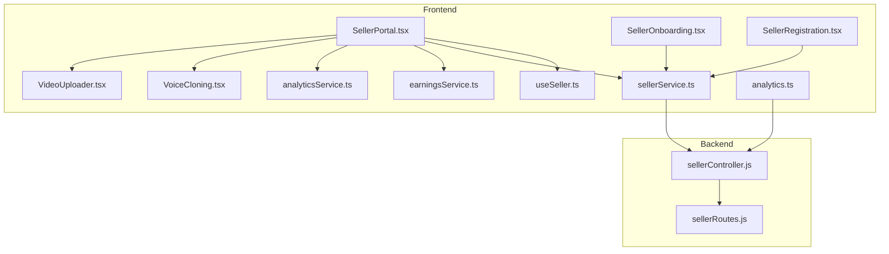

**Diagram sources**
- [frontend/src/pages/SellerPortal.tsx:1-322](file://frontend/src/pages/SellerPortal.tsx#L1-L322)
- [frontend/src/pages/SellerOnboarding.tsx:1-264](file://frontend/src/pages/SellerOnboarding.tsx#L1-L264)
- [frontend/src/pages/SellerRegistration.tsx:1-481](file://frontend/src/pages/SellerRegistration.tsx#L1-L481)
- [frontend/src/components/VoiceCloning.tsx:1-381](file://frontend/src/components/VoiceCloning.tsx#L1-L381)
- [frontend/src/components/VideoUploader.tsx:1-369](file://frontend/src/components/VideoUploader.tsx#L1-L369)
- [frontend/src/hooks/useSeller.ts:1-29](file://frontend/src/hooks/useSeller.ts#L1-L29)
- [frontend/src/api/services/sellerService.ts:1-53](file://frontend/src/api/services/sellerService.ts#L1-L53)
- [frontend/src/services/earningsService.ts:1-119](file://frontend/src/services/earningsService.ts#L1-L119)
- [frontend/src/services/analyticsService.ts:1-145](file://frontend/src/services/analyticsService.ts#L1-L145)
- [frontend/src/utils/analytics.ts:1-120](file://frontend/src/utils/analytics.ts#L1-L120)
- [backend/controllers/sellerController.js:1-211](file://backend/controllers/sellerController.js#L1-L211)
- [backend/routes/sellerRoutes.js:1-42](file://backend/routes/sellerRoutes.js#L1-L42)

**Section sources**
- [frontend/src/pages/SellerPortal.tsx:1-322](file://frontend/src/pages/SellerPortal.tsx#L1-L322)
- [backend/controllers/sellerController.js:1-211](file://backend/controllers/sellerController.js#L1-L211)
- [backend/routes/sellerRoutes.js:1-42](file://backend/routes/sellerRoutes.js#L1-L42)

## Core Components
- Seller Portal: Central dashboard displaying earnings, sales, pending payouts, recent payouts, and per-book revenue breakdown. Includes tabs for overview, books, voice lab, video hub, and analytics.
- Onboarding: Guided checklist for email verification, profile completion, bank verification, publishing first book, and reviewing agreements.
- Registration: Multi-step form collecting personal, business, documents, and tax/compliance details; submits application to backend.
- Content Tools: Voice cloning studio for creating AI voice profiles; adaptive video hub for uploading and processing videos.
- Analytics: Event tracking for reader sessions, cues, and navigation; generic analytics service abstraction for integrations.
- Earnings and Payouts: Services and controller endpoints for retrieving earnings, requesting payouts, and managing transactions.

**Section sources**
- [frontend/src/pages/SellerPortal.tsx:126-322](file://frontend/src/pages/SellerPortal.tsx#L126-L322)
- [frontend/src/pages/SellerOnboarding.tsx:23-177](file://frontend/src/pages/SellerOnboarding.tsx#L23-L177)
- [frontend/src/pages/SellerRegistration.tsx:64-481](file://frontend/src/pages/SellerRegistration.tsx#L64-L481)
- [frontend/src/components/VoiceCloning.tsx:14-381](file://frontend/src/components/VoiceCloning.tsx#L14-L381)
- [frontend/src/components/VideoUploader.tsx:26-369](file://frontend/src/components/VideoUploader.tsx#L26-L369)
- [frontend/src/utils/analytics.ts:14-120](file://frontend/src/utils/analytics.ts#L14-L120)
- [frontend/src/services/analyticsService.ts:4-145](file://frontend/src/services/analyticsService.ts#L4-L145)
- [frontend/src/services/earningsService.ts:28-119](file://frontend/src/services/earningsService.ts#L28-L119)
- [backend/controllers/sellerController.js:7-211](file://backend/controllers/sellerController.js#L7-L211)

## Architecture Overview
The seller dashboard integrates frontend UI with backend APIs through typed services and controllers. Data flows from backend models to frontend components via React Query hooks and service clients. Analytics are captured locally and optionally forwarded to external services.

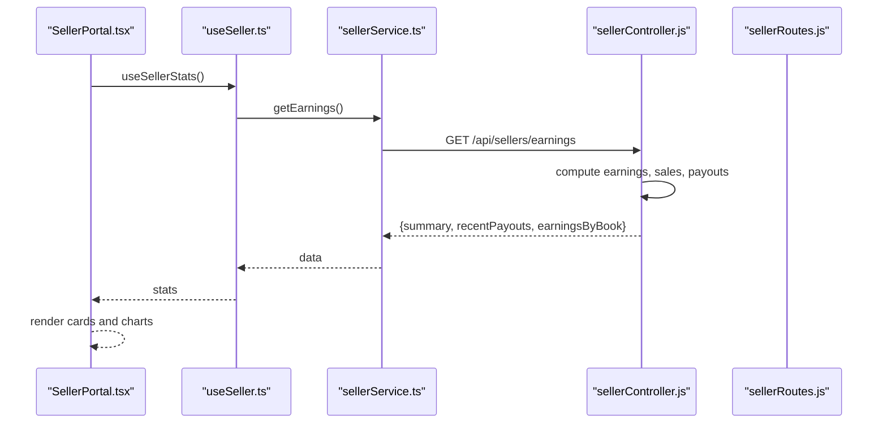

**Diagram sources**
- [frontend/src/pages/SellerPortal.tsx:33-80](file://frontend/src/pages/SellerPortal.tsx#L33-L80)
- [frontend/src/hooks/useSeller.ts:4-10](file://frontend/src/hooks/useSeller.ts#L4-L10)
- [frontend/src/api/services/sellerService.ts:30-44](file://frontend/src/api/services/sellerService.ts#L30-L44)
- [backend/controllers/sellerController.js:77-157](file://backend/controllers/sellerController.js#L77-L157)
- [backend/routes/sellerRoutes.js:20-26](file://backend/routes/sellerRoutes.js#L20-L26)

## Detailed Component Analysis

### Seller Portal
The portal presents:
- Overview cards: total earnings (USD and local), pending payouts, total sales, monthly growth.
- Revenue breakdown by book with quantum sales/pay-per-use split visualization.
- Recent payouts list with status indicators.
- Tabbed navigation to My Books, Voice Lab, Video Hub, and Analytics.

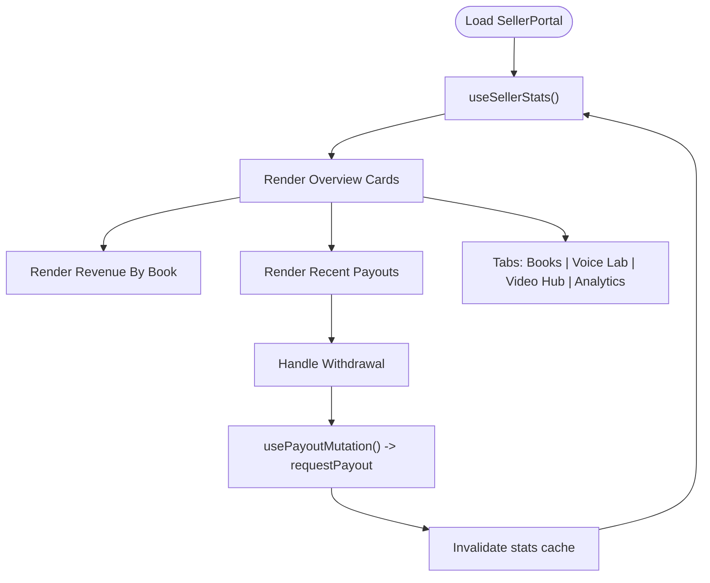

**Diagram sources**
- [frontend/src/pages/SellerPortal.tsx:33-322](file://frontend/src/pages/SellerPortal.tsx#L33-L322)
- [frontend/src/hooks/useSeller.ts:19-29](file://frontend/src/hooks/useSeller.ts#L19-L29)
- [frontend/src/api/services/sellerService.ts:40-44](file://frontend/src/api/services/sellerService.ts#L40-L44)

**Section sources**
- [frontend/src/pages/SellerPortal.tsx:126-322](file://frontend/src/pages/SellerPortal.tsx#L126-L322)
- [frontend/src/hooks/useSeller.ts:1-29](file://frontend/src/hooks/useSeller.ts#L1-L29)

### Seller Onboarding
The onboarding page provides a checklist with statuses and actions, progress tracking, quick start guide, resources, and FAQs. It supports navigation to key areas like the studio and dashboard.

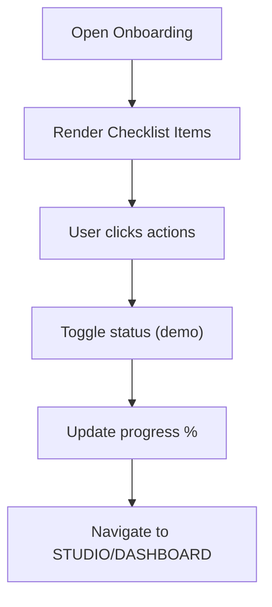

**Diagram sources**
- [frontend/src/pages/SellerOnboarding.tsx:17-264](file://frontend/src/pages/SellerOnboarding.tsx#L17-L264)

**Section sources**
- [frontend/src/pages/SellerOnboarding.tsx:17-264](file://frontend/src/pages/SellerOnboarding.tsx#L17-L264)

### Seller Registration
The registration form is multi-step:
- Personal info (name, email, phone, country, bio)
- Business info (name, registration, address, website, industry)
- Documents (ID, address proof, business certificate)
- Tax & compliance (TIN, VAT registered)
- Review and submit

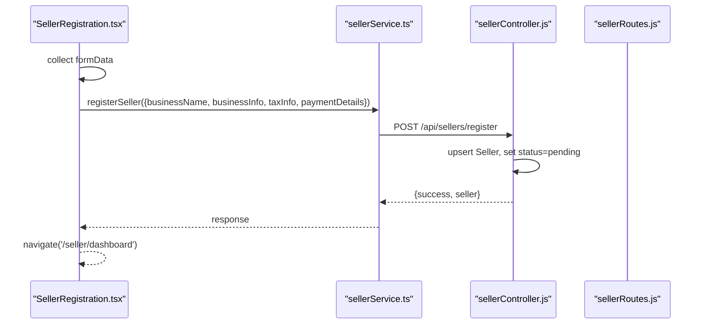

**Diagram sources**
- [frontend/src/pages/SellerRegistration.tsx:64-481](file://frontend/src/pages/SellerRegistration.tsx#L64-L481)
- [frontend/src/api/services/sellerService.ts:7-14](file://frontend/src/api/services/sellerService.ts#L7-L14)
- [backend/controllers/sellerController.js:7-50](file://backend/controllers/sellerController.js#L7-L50)
- [backend/routes/sellerRoutes.js:6-11](file://backend/routes/sellerRoutes.js#L6-L11)

**Section sources**
- [frontend/src/pages/SellerRegistration.tsx:64-481](file://frontend/src/pages/SellerRegistration.tsx#L64-L481)
- [frontend/src/api/services/sellerService.ts:1-53](file://frontend/src/api/services/sellerService.ts#L1-L53)
- [backend/controllers/sellerController.js:7-50](file://backend/controllers/sellerController.js#L7-L50)
- [backend/routes/sellerRoutes.js:1-42](file://backend/routes/sellerRoutes.js#L1-L42)

### Voice Cloning Studio
The voice cloning component allows sellers to:
- Record audio samples or upload supported files
- Configure voice identity and characteristics
- Preview recordings and submit for AI training
- View existing cloned voices with status

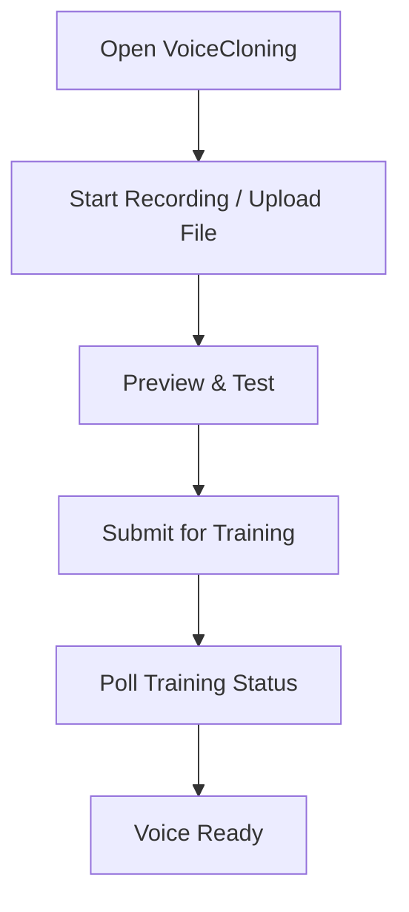

**Diagram sources**
- [frontend/src/components/VoiceCloning.tsx:14-381](file://frontend/src/components/VoiceCloning.tsx#L14-L381)

**Section sources**
- [frontend/src/components/VoiceCloning.tsx:14-381](file://frontend/src/components/VoiceCloning.tsx#L14-L381)

### Adaptive Video Hub
The video uploader supports:
- Drag-and-drop upload with validation
- Chunked uploads with concurrency control
- Job polling for processing status
- Progress tracking and cancellation

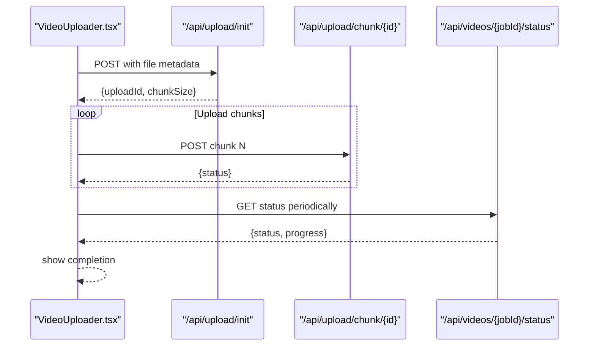

**Diagram sources**
- [frontend/src/components/VideoUploader.tsx:78-258](file://frontend/src/components/VideoUploader.tsx#L78-L258)

**Section sources**
- [frontend/src/components/VideoUploader.tsx:26-369](file://frontend/src/components/VideoUploader.tsx#L26-L369)

### Analytics Tracking
Local analytics capture:
- Session lifecycle (start/end)
- Cue triggers (manual/auto modes)
- Mode switches and step navigation
- Batched submission to endpoint with retry

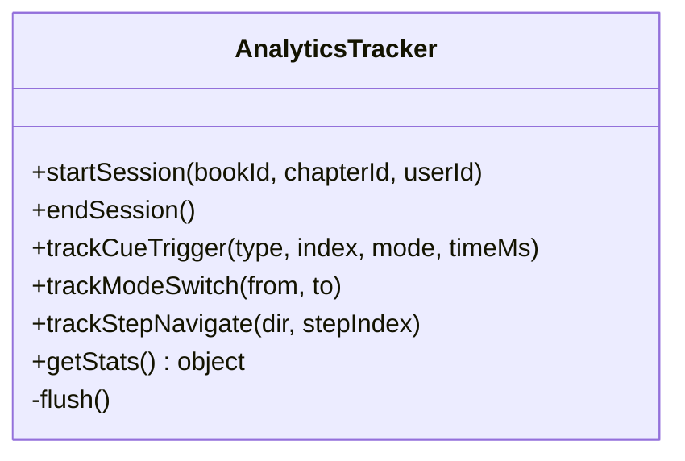

**Diagram sources**
- [frontend/src/utils/analytics.ts:14-120](file://frontend/src/utils/analytics.ts#L14-L120)

Generic analytics service abstraction:
- Enables/disables tracking via environment flag
- Provides methods for page views, events, user actions, book interactions, subscriptions, payments, errors, performance, and conversions

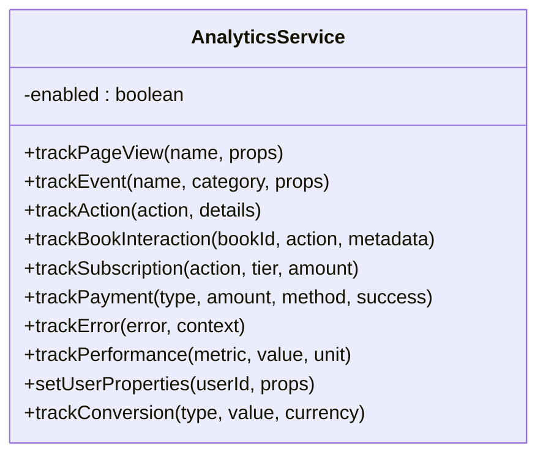

**Diagram sources**
- [frontend/src/services/analyticsService.ts:4-145](file://frontend/src/services/analyticsService.ts#L4-L145)

**Section sources**
- [frontend/src/utils/analytics.ts:14-120](file://frontend/src/utils/analytics.ts#L14-L120)
- [frontend/src/services/analyticsService.ts:4-145](file://frontend/src/services/analyticsService.ts#L4-L145)

### Earnings and Payouts
Backend earnings computation aggregates purchases by book, applies platform commission, and groups by currency. Payout requests create withdrawal transactions.

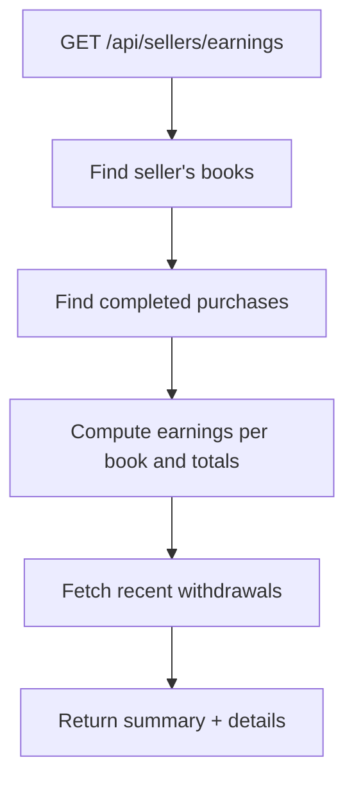

**Diagram sources**
- [backend/controllers/sellerController.js:77-157](file://backend/controllers/sellerController.js#L77-L157)

Payout request flow:
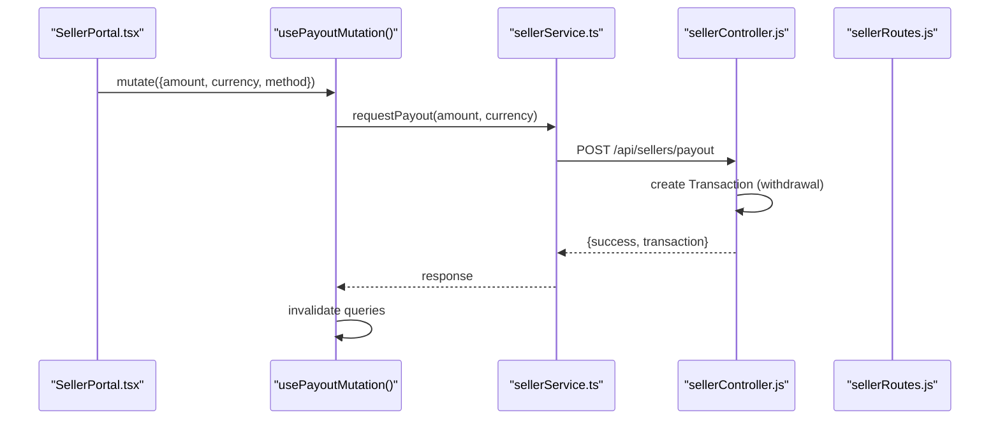

**Diagram sources**
- [frontend/src/pages/SellerPortal.tsx:45-58](file://frontend/src/pages/SellerPortal.tsx#L45-L58)
- [frontend/src/hooks/useSeller.ts:19-29](file://frontend/src/hooks/useSeller.ts#L19-L29)
- [frontend/src/api/services/sellerService.ts:40-44](file://frontend/src/api/services/sellerService.ts#L40-L44)
- [backend/controllers/sellerController.js:162-193](file://backend/controllers/sellerController.js#L162-L193)
- [backend/routes/sellerRoutes.js:27-32](file://backend/routes/sellerRoutes.js#L27-L32)

**Section sources**
- [backend/controllers/sellerController.js:77-193](file://backend/controllers/sellerController.js#L77-L193)
- [frontend/src/services/earningsService.ts:28-119](file://frontend/src/services/earningsService.ts#L28-L119)
- [frontend/src/hooks/useSeller.ts:1-29](file://frontend/src/hooks/useSeller.ts#L1-L29)

## Dependency Analysis
- Frontend depends on:
  - React Query for caching and invalidation
  - Service clients for backend communication
  - Local analytics tracker for session/event capture
- Backend depends on:
  - Models for sellers, books, purchases, transactions
  - Authentication middleware for protected routes

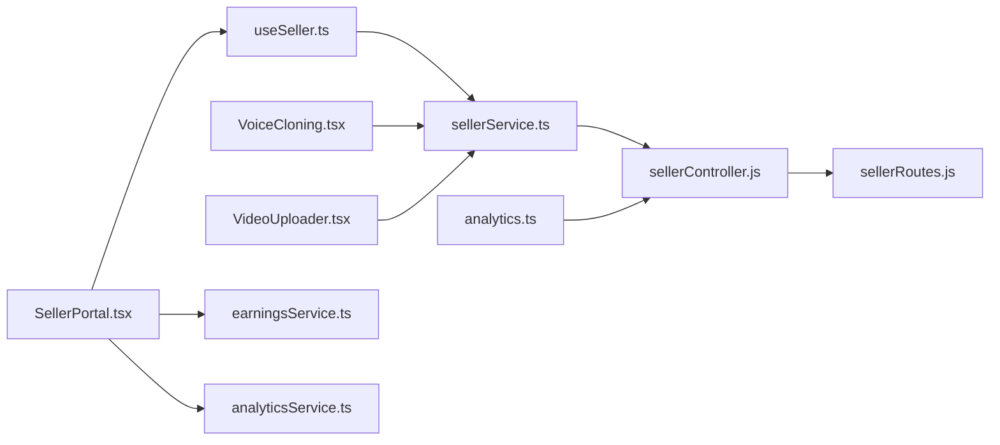

**Diagram sources**
- [frontend/src/pages/SellerPortal.tsx:1-322](file://frontend/src/pages/SellerPortal.tsx#L1-L322)
- [frontend/src/hooks/useSeller.ts:1-29](file://frontend/src/hooks/useSeller.ts#L1-L29)
- [frontend/src/api/services/sellerService.ts:1-53](file://frontend/src/api/services/sellerService.ts#L1-L53)
- [frontend/src/services/earningsService.ts:1-119](file://frontend/src/services/earningsService.ts#L1-L119)
- [frontend/src/services/analyticsService.ts:1-145](file://frontend/src/services/analyticsService.ts#L1-L145)
- [frontend/src/utils/analytics.ts:1-120](file://frontend/src/utils/analytics.ts#L1-L120)
- [backend/controllers/sellerController.js:1-211](file://backend/controllers/sellerController.js#L1-L211)
- [backend/routes/sellerRoutes.js:1-42](file://backend/routes/sellerRoutes.js#L1-L42)

**Section sources**
- [frontend/src/pages/SellerPortal.tsx:1-322](file://frontend/src/pages/SellerPortal.tsx#L1-L322)
- [backend/controllers/sellerController.js:1-211](file://backend/controllers/sellerController.js#L1-L211)
- [backend/routes/sellerRoutes.js:1-42](file://backend/routes/sellerRoutes.js#L1-L42)

## Performance Considerations
- Use React Query’s caching and invalidation to minimize redundant network calls.
- Batch analytics events to reduce outbound requests.
- For large uploads, leverage chunked transfer and concurrency limits to improve throughput and reliability.
- Keep UI updates optimistic where safe, then reconcile on server response.

## Troubleshooting Guide
Common issues and resolutions:
- Earnings not updating: Trigger stats refetch or invalidate queries after payout submission.
- Payout request fails: Verify amount validity and currency selection; check backend error logs.
- Voice cloning errors: Ensure microphone permissions, acceptable file formats, and sufficient duration.
- Video upload stalls: Confirm network stability; use cancellation to reset state; re-upload with smaller files if needed.
- Analytics not recorded: Enable analytics environment flag and confirm endpoint availability.

**Section sources**
- [frontend/src/hooks/useSeller.ts:24-27](file://frontend/src/hooks/useSeller.ts#L24-L27)
- [frontend/src/components/VoiceCloning.tsx:68-72](file://frontend/src/components/VoiceCloning.tsx#L68-L72)
- [frontend/src/components/VideoUploader.tsx:261-265](file://frontend/src/components/VideoUploader.tsx#L261-L265)
- [frontend/src/services/analyticsService.ts:7-9](file://frontend/src/services/analyticsService.ts#L7-L9)

## Conclusion
The publisher dashboard integrates a comprehensive seller portal, onboarding, content creation tools, and analytics capabilities. The backend provides robust earnings computation and payout management, while the frontend offers responsive UIs and efficient data flows. Following the guidance herein will help sellers manage accounts effectively, optimize content, and maximize revenue.

## Appendices

### Seller Account Management
- Keep profile and contact details updated.
- Use voice cloning and video hub to enhance content accessibility and engagement.
- Monitor earnings and payouts regularly; request withdrawals when thresholds are met.

### Content Optimization Strategies
- Publish high-quality, well-described content with clear metadata.
- Use voice cloning for consistent narration and improved learner experience.
- Optimize video content for faster processing and better compatibility.

### Revenue Maximization Techniques
- Track performance metrics via the dashboard and analytics.
- Engage learners with interactive cues and adaptive modes.
- Promote content through community channels and referral programs.