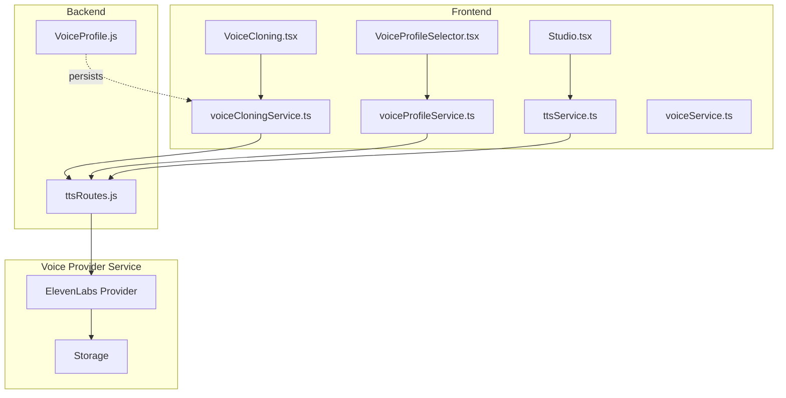
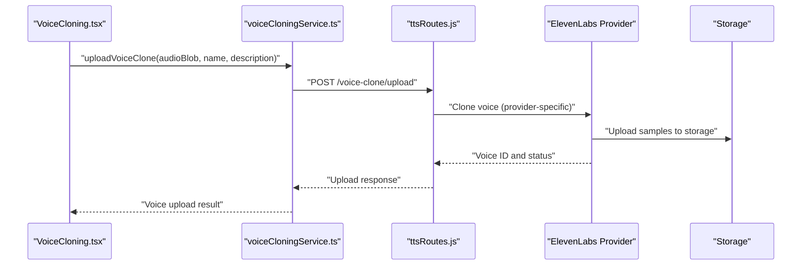
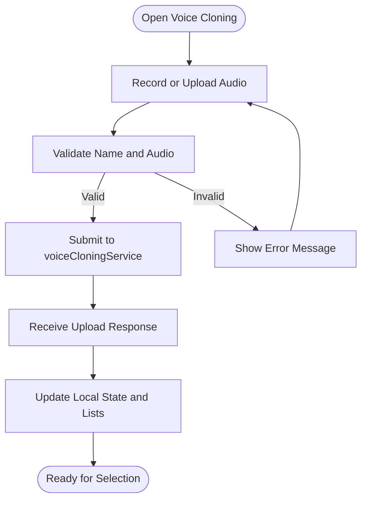
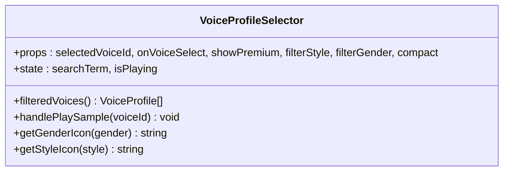
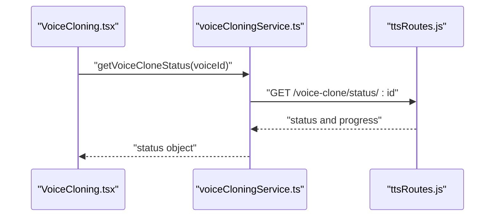
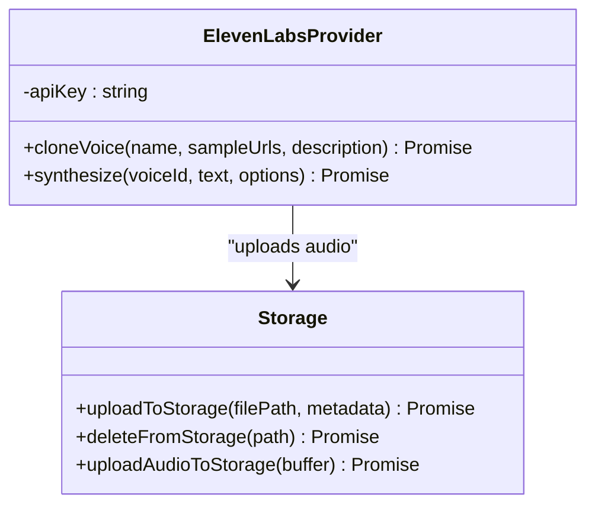
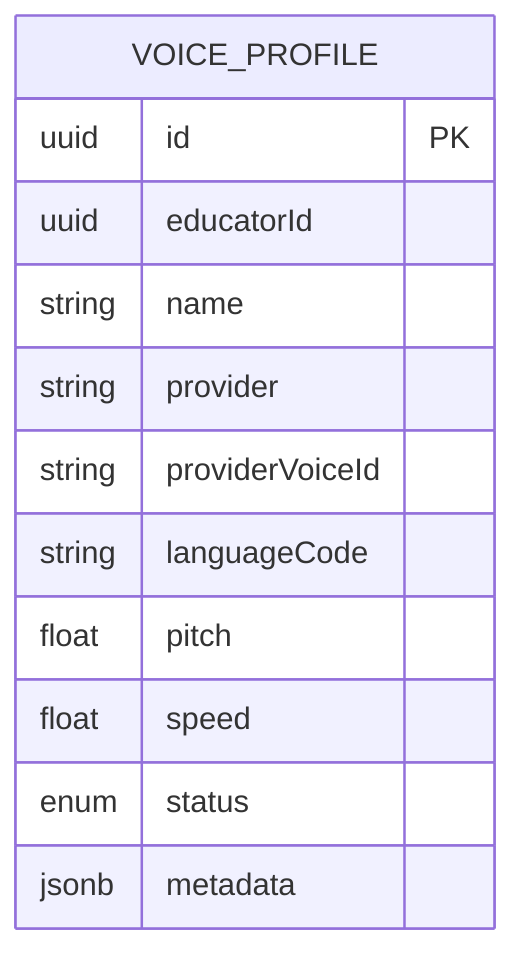
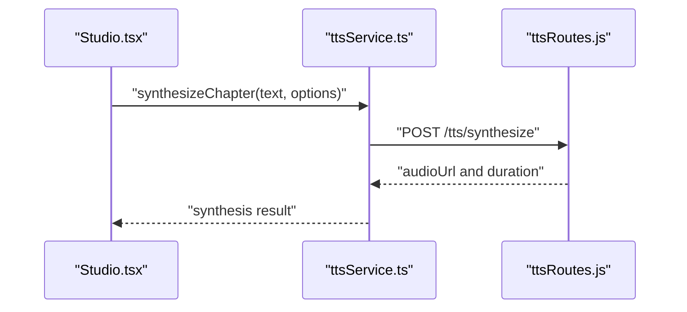
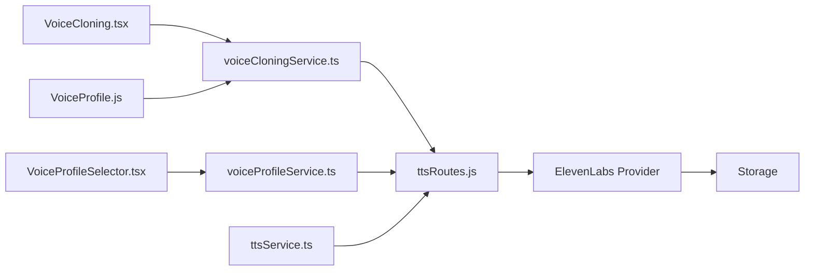

# Voice Cloning and Management

<cite>
**Referenced Files in This Document**
- [VoiceProfile.js](file://backend/models/VoiceProfile.js)
- [VoiceCloning.tsx](file://frontend/src/components/VoiceCloning.tsx)
- [VoiceProfileSelector.tsx](file://frontend/src/components/VoiceProfileSelector.tsx)
- [voiceCloningService.ts](file://frontend/src/services/voiceCloningService.ts)
- [voiceProfileService.ts](file://frontend/src/services/voiceProfileService.ts)
- [ttsService.ts](file://frontend/src/services/ttsService.ts)
- [elevenlabs.ts](file://services/voice/profile/src/providers/elevenlabs.ts)
- [storage.ts](file://services/voice/profile/src/storage.ts)
- [ttsRoutes.js](file://backend/routes/ttsRoutes.js)
- [Studio.tsx](file://frontend/src/pages/Studio.tsx)
- [types-extended.ts](file://frontend/src/types/types-extended.ts)
- [voiceService.ts](file://frontend/src/services/voiceService.ts)
</cite>

## Table of Contents
1. [Introduction](#introduction)
2. [Project Structure](#project-structure)
3. [Core Components](#core-components)
4. [Architecture Overview](#architecture-overview)
5. [Detailed Component Analysis](#detailed-component-analysis)
6. [Dependency Analysis](#dependency-analysis)
7. [Performance Considerations](#performance-considerations)
8. [Troubleshooting Guide](#troubleshooting-guide)
9. [Conclusion](#conclusion)
10. [Appendices](#appendices)

## Introduction
This document describes the voice cloning and management system for the audiobook platform. It covers the voice profile creation workflow, voice selection interface, and audio sample management. It explains the AI-powered voice cloning process, voice quality assessment, and profile customization options. It documents voice provider integrations, pricing models, and voice switching mechanisms. It also provides guidelines for voice selection best practices, audio quality standards, and voice profile maintenance procedures.

## Project Structure
The voice system spans three layers:
- Frontend UI and services for voice cloning and selection
- Backend routes and models for voice profile persistence and TTS orchestration
- Voice provider integration service for external TTS/voice cloning APIs

**Diagram sources**
- [VoiceCloning.tsx:1-381](file://frontend/src/components/VoiceCloning.tsx#L1-L381)
- [VoiceProfileSelector.tsx:1-265](file://frontend/src/components/VoiceProfileSelector.tsx#L1-L265)
- [voiceCloningService.ts:1-260](file://frontend/src/services/voiceCloningService.ts#L1-L260)
- [voiceProfileService.ts:1-261](file://frontend/src/services/voiceProfileService.ts#L1-L261)
- [ttsService.ts:1-381](file://frontend/src/services/ttsService.ts#L1-L381)
- [ttsRoutes.js:1-177](file://backend/routes/ttsRoutes.js#L1-L177)
- [VoiceProfile.js:1-50](file://backend/models/VoiceProfile.js#L1-L50)
- [elevenlabs.ts:1-79](file://services/voice/profile/src/providers/elevenlabs.ts#L1-L79)
- [storage.ts:1-61](file://services/voice/profile/src/storage.ts#L1-L61)
- [Studio.tsx:1-718](file://frontend/src/pages/Studio.tsx#L1-L718)
- [voiceService.ts:1-53](file://frontend/src/services/voiceService.ts#L1-L53)

**Section sources**
- [VoiceCloning.tsx:1-381](file://frontend/src/components/VoiceCloning.tsx#L1-L381)
- [VoiceProfileSelector.tsx:1-265](file://frontend/src/components/VoiceProfileSelector.tsx#L1-L265)
- [voiceCloningService.ts:1-260](file://frontend/src/services/voiceCloningService.ts#L1-L260)
- [voiceProfileService.ts:1-261](file://frontend/src/services/voiceProfileService.ts#L1-L261)
- [ttsService.ts:1-381](file://frontend/src/services/ttsService.ts#L1-L381)
- [ttsRoutes.js:1-177](file://backend/routes/ttsRoutes.js#L1-L177)
- [VoiceProfile.js:1-50](file://backend/models/VoiceProfile.js#L1-L50)
- [elevenlabs.ts:1-79](file://services/voice/profile/src/providers/elevenlabs.ts#L1-L79)
- [storage.ts:1-61](file://services/voice/profile/src/storage.ts#L1-L61)
- [Studio.tsx:1-718](file://frontend/src/pages/Studio.tsx#L1-L718)
- [voiceService.ts:1-53](file://frontend/src/services/voiceService.ts#L1-L53)

## Core Components
- Voice cloning UI: Captures audio samples via microphone or file upload, validates inputs, and submits for AI training.
- Voice profile selector: Provides a searchable, filterable catalog of available voices with sample playback.
- Voice services: Encapsulate API calls to backend routes for voice cloning, retrieval, deletion, default selection, and status checks.
- Backend TTS routes: Proxy synthesis requests to the internal TTS service and manage voice lists and streaming.
- Voice provider integration: Integrates with external providers (e.g., ElevenLabs) for voice cloning and synthesis.
- Voice profile persistence: Stores voice profile metadata in the database.

**Section sources**
- [VoiceCloning.tsx:14-153](file://frontend/src/components/VoiceCloning.tsx#L14-L153)
- [VoiceProfileSelector.tsx:13-264](file://frontend/src/components/VoiceProfileSelector.tsx#L13-L264)
- [voiceCloningService.ts:5-155](file://frontend/src/services/voiceCloningService.ts#L5-L155)
- [ttsRoutes.js:14-174](file://backend/routes/ttsRoutes.js#L14-L174)
- [elevenlabs.ts:4-79](file://services/voice/profile/src/providers/elevenlabs.ts#L4-L79)
- [VoiceProfile.js:4-49](file://backend/models/VoiceProfile.js#L4-L49)

## Architecture Overview
The voice cloning workflow connects the frontend UI to backend routes and external voice providers. Audio samples are uploaded to the backend, which orchestrates provider-specific cloning and stores results. Users can select voices for synthesis and playback.

**Diagram sources**
- [VoiceCloning.tsx:109-153](file://frontend/src/components/VoiceCloning.tsx#L109-L153)
- [voiceCloningService.ts:21-39](file://frontend/src/services/voiceCloningService.ts#L21-L39)
- [ttsRoutes.js:14-51](file://backend/routes/ttsRoutes.js#L14-L51)
- [elevenlabs.ts:12-46](file://services/voice/profile/src/providers/elevenlabs.ts#L12-L46)
- [storage.ts:7-28](file://services/voice/profile/src/storage.ts#L7-L28)

## Detailed Component Analysis

### Voice Cloning UI Workflow
The VoiceCloning component manages:
- Microphone recording and file upload
- Validation and preview
- Submission to the voice cloning service
- Display of existing cloned voices and status updates

**Diagram sources**
- [VoiceCloning.tsx:33-153](file://frontend/src/components/VoiceCloning.tsx#L33-L153)
- [voiceCloningService.ts:21-39](file://frontend/src/services/voiceCloningService.ts#L21-L39)

**Section sources**
- [VoiceCloning.tsx:14-153](file://frontend/src/components/VoiceCloning.tsx#L14-L153)
- [voiceCloningService.ts:5-155](file://frontend/src/services/voiceCloningService.ts#L5-L155)

### Voice Profile Selector Component
The VoiceProfileSelector provides:
- Search and filter by gender and style
- Sample playback with play/pause toggle
- Compact mode for quick selection
- Integration with voice profile services

**Diagram sources**
- [VoiceProfileSelector.tsx:13-264](file://frontend/src/components/VoiceProfileSelector.tsx#L13-L264)

**Section sources**
- [VoiceProfileSelector.tsx:13-264](file://frontend/src/components/VoiceProfileSelector.tsx#L13-L264)
- [types-extended.ts:159-292](file://frontend/src/types/types-extended.ts#L159-L292)

### Voice Cloning Service APIs
The voiceCloningService exposes:
- Upload voice samples
- Retrieve voice clones
- Get details and status
- Delete voice clones
- Set default voice
- Generate test audio

**Diagram sources**
- [voiceCloningService.ts:113-126](file://frontend/src/services/voiceCloningService.ts#L113-L126)
- [ttsRoutes.js:14-51](file://backend/routes/ttsRoutes.js#L14-L51)

**Section sources**
- [voiceCloningService.ts:5-155](file://frontend/src/services/voiceCloningService.ts#L5-L155)
- [ttsRoutes.js:14-174](file://backend/routes/ttsRoutes.js#L14-L174)

### Voice Provider Integrations
The ElevenLabs provider integrates with:
- Voice cloning via multipart uploads
- Synthesis with configurable voice settings
- Storage of synthesized audio

**Diagram sources**
- [elevenlabs.ts:4-79](file://services/voice/profile/src/providers/elevenlabs.ts#L4-L79)
- [storage.ts:7-61](file://services/voice/profile/src/storage.ts#L7-L61)

**Section sources**
- [elevenlabs.ts:4-79](file://services/voice/profile/src/providers/elevenlabs.ts#L4-L79)
- [storage.ts:7-61](file://services/voice/profile/src/storage.ts#L7-L61)

### Voice Profile Persistence Model
The VoiceProfile model defines:
- Identity, creator, and provider mapping
- Language and voice characteristics (pitch, speed)
- Status and metadata storage

**Diagram sources**
- [VoiceProfile.js:4-49](file://backend/models/VoiceProfile.js#L4-L49)

**Section sources**
- [VoiceProfile.js:4-49](file://backend/models/VoiceProfile.js#L4-L49)

### Voice Switching in Studio
The Studio page demonstrates voice switching:
- Fetch available voices
- Select a voice for synthesis
- Generate audio for narration segments

**Diagram sources**
- [Studio.tsx:210-264](file://frontend/src/pages/Studio.tsx#L210-L264)
- [ttsService.ts:46-80](file://frontend/src/services/ttsService.ts#L46-L80)
- [ttsRoutes.js:14-51](file://backend/routes/ttsRoutes.js#L14-L51)

**Section sources**
- [Studio.tsx:94-148](file://frontend/src/pages/Studio.tsx#L94-L148)
- [ttsService.ts:33-80](file://frontend/src/services/ttsService.ts#L33-L80)
- [ttsRoutes.js:14-51](file://backend/routes/ttsRoutes.js#L14-L51)

## Dependency Analysis
- Frontend components depend on services for API interactions.
- Services depend on backend routes for voice operations.
- Backend routes integrate with external voice providers and storage.
- Voice profile persistence relies on the VoiceProfile model.

**Diagram sources**
- [VoiceCloning.tsx:1-381](file://frontend/src/components/VoiceCloning.tsx#L1-L381)
- [VoiceProfileSelector.tsx:1-265](file://frontend/src/components/VoiceProfileSelector.tsx#L1-L265)
- [voiceCloningService.ts:1-260](file://frontend/src/services/voiceCloningService.ts#L1-L260)
- [voiceProfileService.ts:1-261](file://frontend/src/services/voiceProfileService.ts#L1-L261)
- [ttsService.ts:1-381](file://frontend/src/services/ttsService.ts#L1-L381)
- [ttsRoutes.js:1-177](file://backend/routes/ttsRoutes.js#L1-L177)
- [VoiceProfile.js:1-50](file://backend/models/VoiceProfile.js#L1-L50)
- [elevenlabs.ts:1-79](file://services/voice/profile/src/providers/elevenlabs.ts#L1-L79)
- [storage.ts:1-61](file://services/voice/profile/src/storage.ts#L1-L61)

**Section sources**
- [VoiceCloning.tsx:1-381](file://frontend/src/components/VoiceCloning.tsx#L1-L381)
- [VoiceProfileSelector.tsx:1-265](file://frontend/src/components/VoiceProfileSelector.tsx#L1-L265)
- [voiceCloningService.ts:1-260](file://frontend/src/services/voiceCloningService.ts#L1-L260)
- [voiceProfileService.ts:1-261](file://frontend/src/services/voiceProfileService.ts#L1-L261)
- [ttsService.ts:1-381](file://frontend/src/services/ttsService.ts#L1-L381)
- [ttsRoutes.js:1-177](file://backend/routes/ttsRoutes.js#L1-L177)
- [VoiceProfile.js:1-50](file://backend/models/VoiceProfile.js#L1-L50)
- [elevenlabs.ts:1-79](file://services/voice/profile/src/providers/elevenlabs.ts#L1-L79)
- [storage.ts:1-61](file://services/voice/profile/src/storage.ts#L1-L61)

## Performance Considerations
- Concurrency and batching: The TTS service supports batch synthesis with concurrency control to optimize throughput.
- Text chunking: Long texts are split into manageable chunks to meet backend limits and improve reliability.
- Browser fallback: When network conditions fail, the service falls back to browser speech synthesis to maintain usability.
- Cost estimation: The TTS service includes a character-based cost estimator for pay-per-use scenarios.

[No sources needed since this section provides general guidance]

## Troubleshooting Guide
Common issues and resolutions:
- Microphone permission denied: Prompt users to enable microphone access in browser settings.
- Large audio files: Enforce client-side size limits and instruct users to compress or trim files.
- Upload failures: Retry mechanism and error messages guide users to re-attempt submission.
- Provider API errors: Surface provider-specific errors and suggest checking credentials or quotas.
- Voice status stuck: Poll status endpoints periodically until completion or failure.

**Section sources**
- [VoiceCloning.tsx:68-71](file://frontend/src/components/VoiceCloning.tsx#L68-L71)
- [VoiceCloning.tsx:84-92](file://frontend/src/components/VoiceCloning.tsx#L84-L92)
- [voiceCloningService.ts:35-38](file://frontend/src/services/voiceCloningService.ts#L35-L38)
- [elevenlabs.ts:31-40](file://services/voice/profile/src/providers/elevenlabs.ts#L31-L40)

## Conclusion
The voice cloning and management system integrates a robust frontend UI with backend orchestration and external voice provider services. It supports voice creation, selection, and switching, with clear workflows for quality assurance and maintenance. The modular design enables easy extension to additional providers and voice customization options.

[No sources needed since this section summarizes without analyzing specific files]

## Appendices

### Voice Selection Best Practices
- Choose voices aligned with content tone (narrative, professional, conversational).
- Use sample playback to verify clarity and emotional fit.
- Filter by gender and style to narrow choices efficiently.

[No sources needed since this section provides general guidance]

### Audio Quality Standards
- Prefer uncompressed or high-bitrate formats for training samples.
- Ensure consistent recording environment with minimal background noise.
- Maintain steady volume and clear pronunciation during recording.

[No sources needed since this section provides general guidance]

### Voice Profile Maintenance Procedures
- Regularly review and update voice preferences based on usage analytics.
- Archive unused custom voices to keep the list manageable.
- Monitor provider quotas and renew credentials as needed.

[No sources needed since this section provides general guidance]