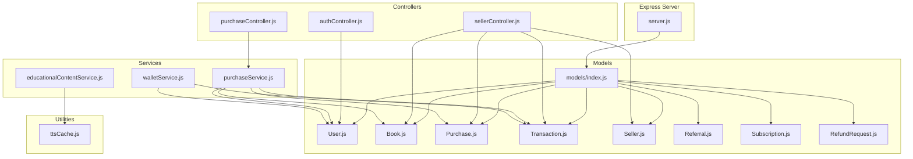
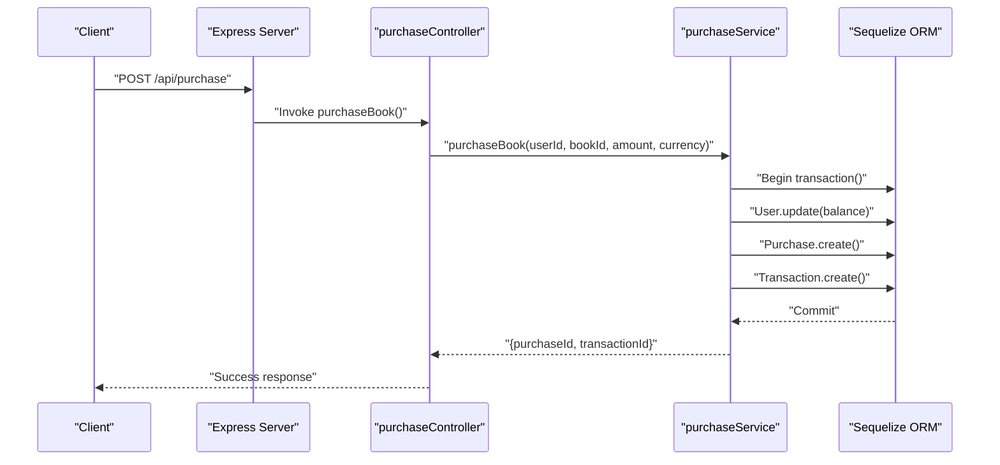
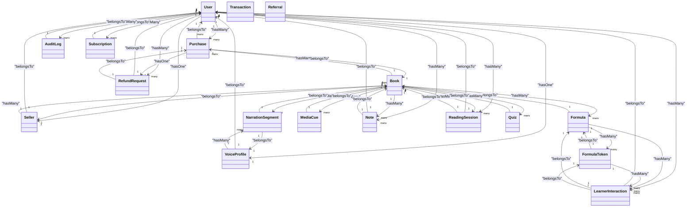
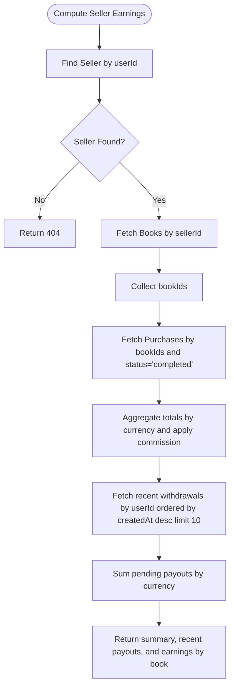
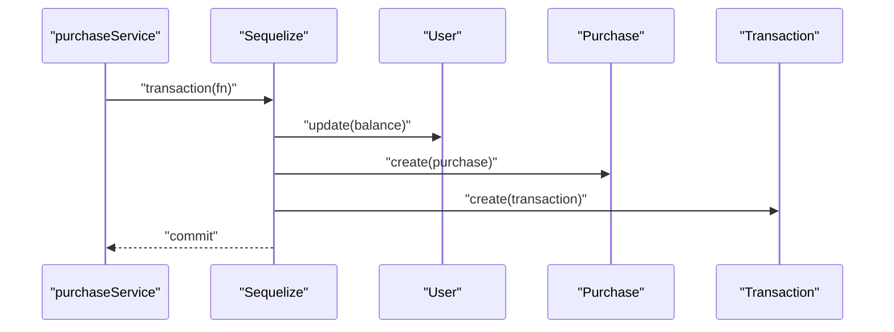
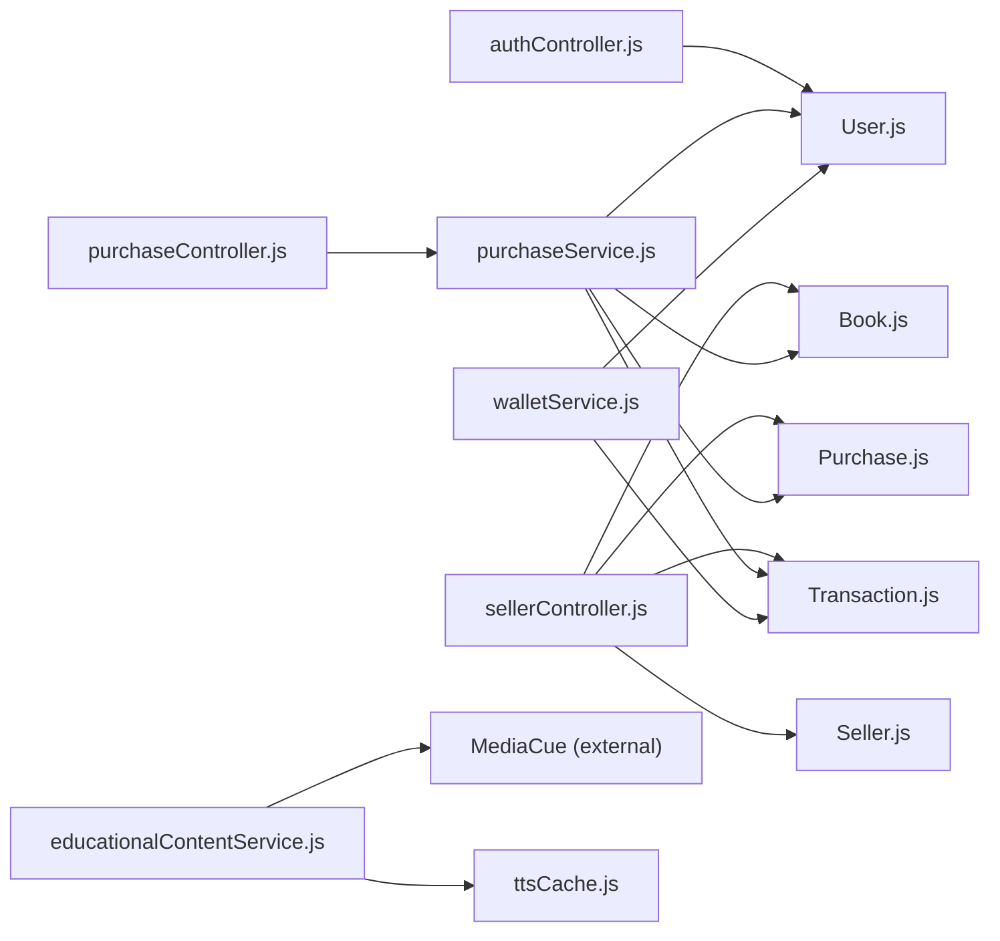

# Data Access Patterns

<cite>
**Referenced Files in This Document**
- [server.js](file://backend/server.js)
- [models/index.js](file://backend/models/index.js)
- [User.js](file://backend/models/User.js)
- [Book.js](file://backend/models/Book.js)
- [Purchase.js](file://backend/models/Purchase.js)
- [Transaction.js](file://backend/models/Transaction.js)
- [Seller.js](file://backend/models/Seller.js)
- [Referral.js](file://backend/models/Referral.js)
- [Subscription.js](file://backend/models/Subscription.js)
- [RefundRequest.js](file://backend/models/RefundRequest.js)
- [authController.js](file://backend/controllers/authController.js)
- [purchaseController.js](file://backend/controllers/purchaseController.js)
- [sellerController.js](file://backend/controllers/sellerController.js)
- [purchaseService.js](file://backend/services/purchaseService.js)
- [walletService.js](file://backend/services/walletService.js)
- [educationalContentService.js](file://backend/services/educationalContentService.js)
- [ttsCache.js](file://backend/utils/ttsCache.js)
</cite>

## Table of Contents
1. [Introduction](#introduction)
2. [Project Structure](#project-structure)
3. [Core Components](#core-components)
4. [Architecture Overview](#architecture-overview)
5. [Detailed Component Analysis](#detailed-component-analysis)
6. [Dependency Analysis](#dependency-analysis)
7. [Performance Considerations](#performance-considerations)
8. [Troubleshooting Guide](#troubleshooting-guide)
9. [Conclusion](#conclusion)

## Introduction
This document explains the data access patterns and ORM usage in QuantumMint Bookstore’s backend. It covers Sequelize configuration, model associations, query patterns, caching strategies, connection pooling, transaction management, and service-layer integration. It also highlights eager loading, N+1 prevention, and performance optimization techniques observed in the codebase.

## Project Structure
The backend follows a layered architecture:
- Express server initializes Sequelize, exposes models and connection to controllers.
- Controllers orchestrate requests and delegate business logic to services.
- Services encapsulate data access and business rules, often using Sequelize models and transactions.
- Models define domain entities and associations.
- Utilities provide cross-cutting concerns such as caching.

**Diagram sources**
- [server.js:57-92](file://backend/server.js#L57-L92)
- [models/index.js:24-44](file://backend/models/index.js#L24-L44)
- [authController.js:46-69](file://backend/controllers/authController.js#L46-L69)
- [purchaseController.js:7-12](file://backend/controllers/purchaseController.js#L7-L12)
- [sellerController.js:1-211](file://backend/controllers/sellerController.js#L1-L211)
- [purchaseService.js:1-68](file://backend/services/purchaseService.js#L1-L68)
- [walletService.js:1-80](file://backend/services/walletService.js#L1-L80)
- [educationalContentService.js:1-181](file://backend/services/educationalContentService.js#L1-L181)
- [ttsCache.js:1-59](file://backend/utils/ttsCache.js#L1-L59)

**Section sources**
- [server.js:57-92](file://backend/server.js#L57-L92)
- [models/index.js:24-44](file://backend/models/index.js#L24-L44)

## Core Components
- Sequelize initialization and connection pooling:
  - Dialect selection supports MySQL or PostgreSQL with defaults; falls back to SQLite locally.
  - Pool configuration sets concurrency limits and timeouts.
  - Models are registered and associations are defined centrally.
- Controllers:
  - Auth controller resolves models from app context and performs CRUD-like operations.
  - Purchase controller delegates purchase logic to a service.
  - Seller controller demonstrates joins and aggregations across related models.
- Services:
  - Purchase service coordinates atomic updates across User, Purchase, and Transaction using Sequelize transactions.
  - Wallet service aggregates balances and paginates transactions; includes a direct SQL update for atomic credit.
  - Educational content service orchestrates external TTS processing and bulk inserts MediaCue records.
- Caching:
  - Redis-backed cache for TTS audio URLs with invalidation by book.

**Section sources**
- [server.js:57-92](file://backend/server.js#L57-L92)
- [authController.js:46-69](file://backend/controllers/authController.js#L46-L69)
- [purchaseController.js:7-12](file://backend/controllers/purchaseController.js#L7-L12)
- [sellerController.js:55-157](file://backend/controllers/sellerController.js#L55-L157)
- [purchaseService.js:37-66](file://backend/services/purchaseService.js#L37-L66)
- [walletService.js:32-79](file://backend/services/walletService.js#L32-L79)
- [educationalContentService.js:77-85](file://backend/services/educationalContentService.js#L77-L85)
- [ttsCache.js:1-59](file://backend/utils/ttsCache.js#L1-L59)

## Architecture Overview
The backend uses a clean separation of concerns:
- Express server initializes Sequelize and exposes models and connection.
- Controllers depend on services, not models directly.
- Services encapsulate data access and business logic, leveraging Sequelize models and transactions.
- Utilities provide caching and offload heavy tasks.

**Diagram sources**
- [purchaseController.js:7-12](file://backend/controllers/purchaseController.js#L7-L12)
- [purchaseService.js:37-66](file://backend/services/purchaseService.js#L37-L66)

## Detailed Component Analysis

### Sequelize Configuration and Model Associations
- Initialization:
  - Dialect is configurable; defaults to MySQL or PostgreSQL depending on env; SQLite fallback for local dev.
  - Connection pooling configured with max, min, acquire, and idle thresholds.
  - Models are loaded and associations are defined in a single module for centralized management.
- Associations:
  - One-to-many and one-to-one relationships are declared between User, Purchase, Transaction, Referral, Subscription, RefundRequest, Book, Seller, VoiceProfile, Formula, FormulaToken, NarrationSegment, LearnerInteraction, MediaCue, Note, ReadingSession, Quiz, and AuditLog.
  - Includes named associations (e.g., as: 'ReferralsSent') and foreign keys explicitly set for clarity.

**Diagram sources**
- [models/index.js:45-146](file://backend/models/index.js#L45-L146)

**Section sources**
- [server.js:57-84](file://backend/server.js#L57-L84)
- [models/index.js:45-146](file://backend/models/index.js#L45-L146)

### Query Patterns and CRUD Operations
- Basic CRUD:
  - Controllers resolve models from app context and perform create, read, update, and delete operations.
  - Examples include user registration/login and seller profile retrieval.
- Aggregation and Joins:
  - Seller earnings computation involves joining Book, Purchase, and Transaction to compute totals and recent payouts.
  - Includes filtering by status and ordering by creation date.
- Pagination:
  - Wallet service paginates Transaction records using limit/offset with counts.

**Diagram sources**
- [sellerController.js:77-152](file://backend/controllers/sellerController.js#L77-L152)

**Section sources**
- [authController.js:46-69](file://backend/controllers/authController.js#L46-L69)
- [sellerController.js:77-152](file://backend/controllers/sellerController.js#L77-L152)
- [walletService.js:40-62](file://backend/services/walletService.js#L40-L62)

### Complex Joins and Aggregate Queries
- The seller earnings endpoint demonstrates:
  - Join-like logic via separate queries and in-memory aggregation.
  - Filtering and grouping by currency and status.
  - Ordering and limiting for recent items.
- These patterns avoid raw SQL while maintaining clarity and testability.

**Section sources**
- [sellerController.js:86-152](file://backend/controllers/sellerController.js#L86-L152)

### Eager Loading, Lazy Loading, and N+1 Prevention
- Eager loading:
  - Controllers use include to load associated data in a single request (e.g., Seller include User).
- Lazy loading:
  - Models support association getters; however, the codebase primarily uses eager loading via include to prevent N+1 queries.
- N+1 prevention:
  - Seller earnings aggregates purchases per book using a single findAll and in-memory filtering/grouping.
  - Educational content service uses bulkCreate to insert multiple cues efficiently.

**Section sources**
- [sellerController.js:58-61](file://backend/controllers/sellerController.js#L58-L61)
- [educationalContentService.js:77-85](file://backend/services/educationalContentService.js#L77-L85)

### Transactions, Batch Operations, and Consistency
- Atomicity:
  - Purchase service wraps balance deduction, purchase record creation, and transaction logging in a single Sequelize transaction.
- Batch operations:
  - Educational content service processes pages in small batches and uses bulkCreate for MediaCue entries.
- Consistency:
  - Wallet credit uses a direct SQL UPDATE with a parameterized query to avoid race conditions and ensure atomic increments.

**Diagram sources**
- [purchaseService.js:37-66](file://backend/services/purchaseService.js#L37-L66)

**Section sources**
- [purchaseService.js:37-66](file://backend/services/purchaseService.js#L37-L66)
- [educationalContentService.js:100-120](file://backend/services/educationalContentService.js#L100-L120)
- [walletService.js:64-79](file://backend/services/walletService.js#L64-L79)

### Caching Strategies
- TTS audio caching:
  - Redis-backed cache stores synthesized audio URLs keyed by text hash.
  - Provides TTL-based expiration and invalidation by book scope.
- Usage:
  - Educational content service integrates caching to avoid redundant synthesis.

**Section sources**
- [ttsCache.js:17-55](file://backend/utils/ttsCache.js#L17-L55)
- [educationalContentService.js:77-85](file://backend/services/educationalContentService.js#L77-L85)

### Service Layer Integration and Data Access Abstraction
- Controllers depend on services, not models directly.
- Services encapsulate:
  - Validation and business rules.
  - Data access with Sequelize models.
  - Transactions and batch operations.
- Models remain focused on schema and associations, enabling reuse across services.

**Section sources**
- [purchaseController.js:1-13](file://backend/controllers/purchaseController.js#L1-L13)
- [purchaseService.js:1-68](file://backend/services/purchaseService.js#L1-L68)
- [sellerController.js:1-211](file://backend/controllers/sellerController.js#L1-L211)

## Dependency Analysis
- Centralized model registration and associations in models/index.js decouple controllers from model wiring.
- Controllers rely on app-provided models and Sequelize instance.
- Services depend on models and coordinate transactions and batch operations.
- Utilities (e.g., Redis cache) are injected into services or used directly by controllers.

**Diagram sources**
- [models/index.js:24-44](file://backend/models/index.js#L24-L44)
- [authController.js:46-69](file://backend/controllers/authController.js#L46-L69)
- [purchaseController.js:7-12](file://backend/controllers/purchaseController.js#L7-L12)
- [sellerController.js:1-211](file://backend/controllers/sellerController.js#L1-L211)
- [purchaseService.js:1-68](file://backend/services/purchaseService.js#L1-L68)
- [walletService.js:1-80](file://backend/services/walletService.js#L1-L80)
- [educationalContentService.js:1-181](file://backend/services/educationalContentService.js#L1-L181)
- [ttsCache.js:1-59](file://backend/utils/ttsCache.js#L1-L59)

**Section sources**
- [models/index.js:24-44](file://backend/models/index.js#L24-L44)
- [authController.js:46-69](file://backend/controllers/authController.js#L46-L69)
- [purchaseController.js:7-12](file://backend/controllers/purchaseController.js#L7-L12)
- [sellerController.js:1-211](file://backend/controllers/sellerController.js#L1-L211)
- [purchaseService.js:1-68](file://backend/services/purchaseService.js#L1-L68)
- [walletService.js:1-80](file://backend/services/walletService.js#L1-L80)
- [educationalContentService.js:1-181](file://backend/services/educationalContentService.js#L1-L181)
- [ttsCache.js:1-59](file://backend/utils/ttsCache.js#L1-L59)

## Performance Considerations
- Connection pooling:
  - Pool sizes and acquisition timeouts are configured at initialization; tune max/min based on workload.
- Query efficiency:
  - Prefer eager loading with include to avoid N+1 queries.
  - Use bulk operations (bulkCreate) for high-volume inserts.
- Atomic updates:
  - Use direct SQL UPDATE for atomic increments to reduce read-modify-write races.
- Caching:
  - Cache synthesized audio URLs to minimize repeated work and external service calls.
- Pagination:
  - Use limit/offset with counts for scalable listing APIs.

[No sources needed since this section provides general guidance]

## Troubleshooting Guide
- Authentication failures:
  - Ensure JWT secret is configured in production; otherwise startup will log warnings or errors depending on environment.
- Database connectivity:
  - Verify DB_HOST, DB_NAME, DB_USER, DB_PASS; confirm dialect and port alignment with target database.
- Transaction anomalies:
  - Confirm transaction blocks wrap all related writes; ensure rollback paths are handled.
- Cache connectivity:
  - Validate Redis host/port/password; check error logs for connection issues.

**Section sources**
- [authController.js:6-28](file://backend/controllers/authController.js#L6-L28)
- [server.js:57-84](file://backend/server.js#L57-L84)
- [purchaseService.js:37-66](file://backend/services/purchaseService.js#L37-L66)
- [ttsCache.js:12-15](file://backend/utils/ttsCache.js#L12-L15)

## Conclusion
QuantumMint Bookstore employs a clean, layered architecture with Sequelize as the central data access technology. Associations are centralized, controllers delegate to services, and services enforce business rules and data consistency using transactions and batch operations. Eager loading prevents N+1 queries, while Redis caching accelerates TTS workflows. Connection pooling and atomic updates further improve reliability and performance.