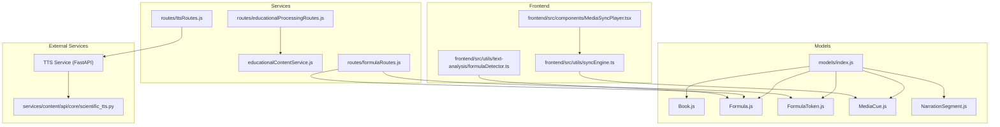
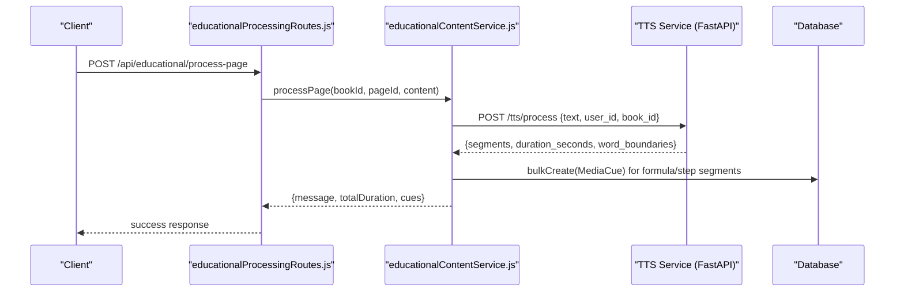
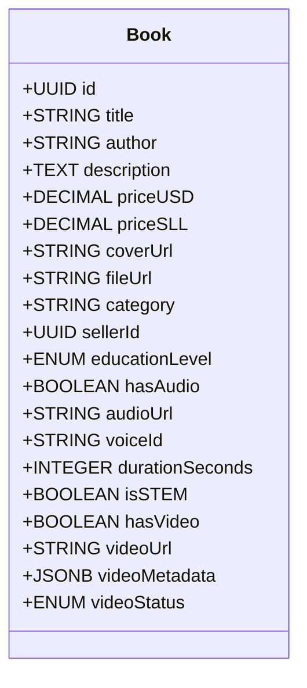
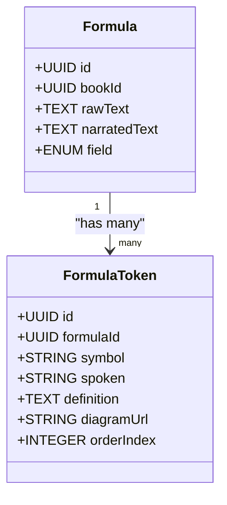
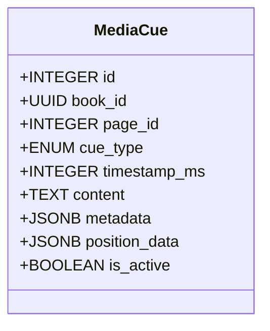
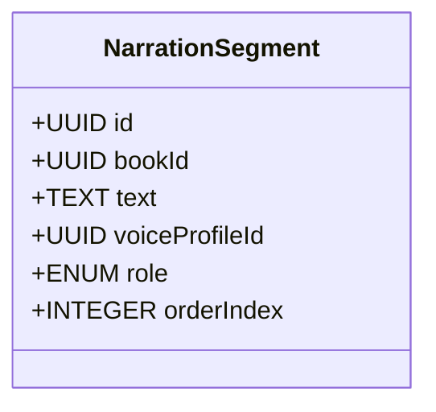
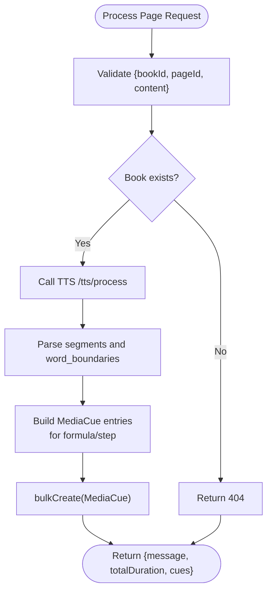
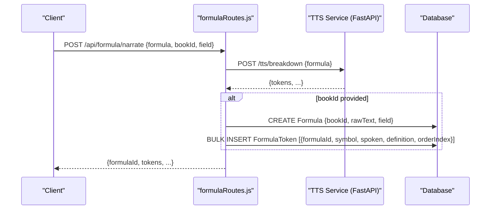
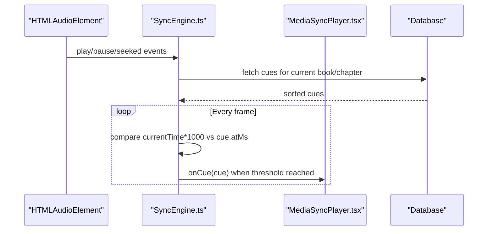
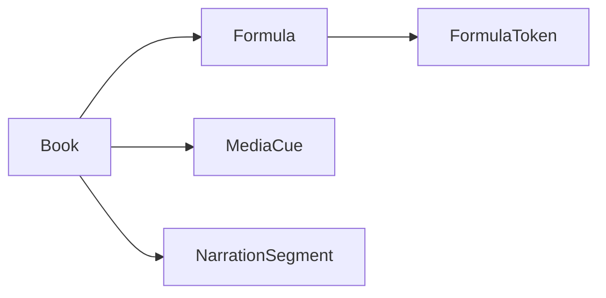

# Content and Creation Models

<cite>
**Referenced Files in This Document**
- [Book.js](file://backend/models/Book.js)
- [Formula.js](file://backend/models/Formula.js)
- [FormulaToken.js](file://backend/models/Formulatoken.js)
- [MediaCue.js](file://backend/models/MediaCue.js)
- [NarrationSegment.js](file://backend/models/NarrationSegment.js)
- [index.js](file://backend/models/index.js)
- [educationalContentService.js](file://backend/services/educationalContentService.js)
- [formulaRoutes.js](file://backend/routes/formulaRoutes.js)
- [ttsRoutes.js](file://backend/routes/ttsRoutes.js)
- [educationalProcessingRoutes.js](file://backend/routes/educationalProcessingRoutes.js)
- [scientific_tts.py](file://services/content/api/core/scientific_tts.py)
- [formulaDetector.ts](file://frontend/src/utils/text-analysis/formulaDetector.ts)
- [syncEngine.ts](file://frontend/src/utils/syncEngine.ts)
- [MediaSyncPlayer.tsx](file://frontend/src/components/MediaSyncPlayer.tsx)
</cite>

## Table of Contents
1. [Introduction](#introduction)
2. [Project Structure](#project-structure)
3. [Core Components](#core-components)
4. [Architecture Overview](#architecture-overview)
5. [Detailed Component Analysis](#detailed-component-analysis)
6. [Dependency Analysis](#dependency-analysis)
7. [Performance Considerations](#performance-considerations)
8. [Troubleshooting Guide](#troubleshooting-guide)
9. [Conclusion](#conclusion)
10. [Appendices](#appendices)

## Introduction
This document provides comprehensive data model documentation for content creation and educational entities. It covers:
- The Book model with metadata, pricing, and media-related fields
- The Formula model for mathematical content and its relationship to FormulaToken
- The MediaCue model for synchronized audio/video cues
- The NarrationSegment model for voice-over timing and roles
It also explains content creation workflows, formula processing pipelines, and media synchronization mechanisms, including validation rules, business constraints, and practical examples.

## Project Structure
The models are defined in the backend under the models directory and integrated via the central index file. Services orchestrate educational processing and TTS workflows. Frontend utilities support formula detection and media synchronization.

**Diagram sources**
- [index.js:45-121](file://backend/models/index.js#L45-L121)
- [Book.js:1-92](file://backend/models/Book.js#L1-L92)
- [Formula.js:1-30](file://backend/models/Formula.js#L1-L30)
- [FormulaToken.js:1-38](file://backend/models/Formulatoken.js#L1-L38)
- [MediaCue.js:1-49](file://backend/models/MediaCue.js#L1-L49)
- [NarrationSegment.js:1-34](file://backend/models/NarrationSegment.js#L1-L34)
- [educationalContentService.js:10-120](file://backend/services/educationalContentService.js#L10-L120)
- [formulaRoutes.js:14-65](file://backend/routes/formulaRoutes.js#L14-L65)
- [ttsRoutes.js:14-51](file://backend/routes/ttsRoutes.js#L14-L51)
- [educationalProcessingRoutes.js:12-41](file://backend/routes/educationalProcessingRoutes.js#L12-L41)
- [scientific_tts.py:120-201](file://services/content/api/core/scientific_tts.py#L120-L201)
- [formulaDetector.ts:1-11](file://frontend/src/utils/text-analysis/formulaDetector.ts#L1-L11)
- [syncEngine.ts:16-46](file://frontend/src/utils/syncEngine.ts#L16-L46)
- [MediaSyncPlayer.tsx:168-207](file://frontend/src/components/MediaSyncPlayer.tsx#L168-L207)

**Section sources**
- [index.js:24-167](file://backend/models/index.js#L24-L167)
- [Book.js:1-92](file://backend/models/Book.js#L1-L92)
- [Formula.js:1-30](file://backend/models/Formula.js#L1-L30)
- [FormulaToken.js:1-38](file://backend/models/Formulatoken.js#L1-L38)
- [MediaCue.js:1-49](file://backend/models/MediaCue.js#L1-L49)
- [NarrationSegment.js:1-34](file://backend/models/NarrationSegment.js#L1-L34)

## Core Components
This section documents each model’s fields, data types, constraints, and relationships.

- Book
  - Purpose: Represents an educational book with metadata, pricing, and media assets.
  - Key fields:
    - id: UUID primary key
    - title: STRING, required
    - author: STRING, required
    - description: TEXT, optional
    - priceUSD: DECIMAL(10,2), required, default 0.00
    - priceSLL: DECIMAL(10,2), required, default 0.00
    - coverUrl: STRING, optional
    - fileUrl: STRING, required
    - category: STRING, optional
    - sellerId: UUID, optional
    - educationLevel: ENUM(JSS, SSS, College, University, Adult Education, General), default General
    - hasAudio: BOOLEAN, default false
    - audioUrl: STRING, optional
    - voiceId: STRING, optional
    - durationSeconds: INTEGER, default 0
    - isSTEM: BOOLEAN, default false
    - hasVideo: BOOLEAN, default false
    - videoUrl: STRING, optional
    - videoMetadata: JSONB, default {}
    - videoStatus: ENUM(none, pending, processing, completed, failed), default none
  - Validation/business constraints:
    - title and author are required.
    - price fields are required decimals with two decimal places.
    - educationLevel must be one of the enumerated values.
    - Media flags and URLs are mutually dependent (e.g., hasAudio implies audioUrl may be present).
    - videoMetadata and videoStatus track video lifecycle and structured metadata.

- Formula
  - Purpose: Stores raw and optionally narrated mathematical content with STEM field classification.
  - Key fields:
    - id: UUID primary key
    - bookId: UUID, required (foreign key to Book)
    - rawText: TEXT, required
    - narratedText: TEXT, optional
    - field: ENUM(math, physics, chemistry, engineering), default math
  - Relationships:
    - One-to-many with FormulaToken via formulaId
    - Many-to-one with Book via bookId

- FormulaToken
  - Purpose: Tokenized components of a Formula with semantic annotations for narration and visuals.
  - Key fields:
    - id: UUID primary key
    - formulaId: UUID, required (foreign key to Formula)
    - symbol: STRING, required
    - spoken: STRING, required
    - definition: TEXT, optional
    - diagramUrl: STRING, optional
    - orderIndex: INTEGER, default 0
  - Relationships:
    - Many-to-one with Formula via formulaId

- MediaCue
  - Purpose: Synchronized cues for audio/video playback aligned to content (e.g., formulas, steps).
  - Key fields:
    - id: INTEGER primary key, auto-increment
    - book_id: UUID, required (foreign key to Book)
    - page_id: INTEGER, required
    - cue_type: ENUM(visual, formula, step, highlight), required
    - timestamp_ms: INTEGER, required
    - content: TEXT, required
    - metadata: JSONB, default {}
    - position_data: JSONB, default {}
    - is_active: BOOLEAN, default true
  - Relationships:
    - Many-to-one with Book via book_id

- NarrationSegment
  - Purpose: Voice-over segments for a book with speaker role and ordering.
  - Key fields:
    - id: UUID primary key
    - bookId: UUID, required (foreign key to Book)
    - text: TEXT, required
    - voiceProfileId: UUID, optional (foreign key to VoiceProfile)
    - role: ENUM(narrator, tutor, character, explainer), default narrator
    - orderIndex: INTEGER, default 0
  - Relationships:
    - Many-to-one with Book via bookId
    - Many-to-one with VoiceProfile via voiceProfileId

**Section sources**
- [Book.js:4-87](file://backend/models/Book.js#L4-L87)
- [Formula.js:4-26](file://backend/models/Formula.js#L4-L26)
- [FormulaToken.js:4-34](file://backend/models/Formulatoken.js#L4-L34)
- [MediaCue.js:4-45](file://backend/models/MediaCue.js#L4-L45)
- [NarrationSegment.js:4-30](file://backend/models/NarrationSegment.js#L4-L30)

## Architecture Overview
The system integrates backend models, services, and routes with external TTS and media-sync services. Educational content processing orchestrates formula detection, narration, and cue generation. Frontend utilities handle formula parsing and media synchronization.

**Diagram sources**
- [educationalProcessingRoutes.js:12-41](file://backend/routes/educationalProcessingRoutes.js#L12-L41)
- [educationalContentService.js:15-91](file://backend/services/educationalContentService.js#L15-L91)
- [ttsRoutes.js:14-51](file://backend/routes/ttsRoutes.js#L14-L51)

## Detailed Component Analysis

### Book Model
- Responsibilities:
  - Stores book metadata and pricing in multiple currencies.
  - Tracks media assets (audio, video) and their statuses.
  - Associates with sellers and supports STEM categorization.
- Constraints:
  - Price fields are non-negative decimals.
  - Education level is constrained to predefined categories.
  - Media flags imply presence of associated URLs and metadata.

**Diagram sources**
- [Book.js:4-87](file://backend/models/Book.js#L4-L87)

**Section sources**
- [Book.js:4-87](file://backend/models/Book.js#L4-L87)

### Formula and FormulaToken Models
- Responsibilities:
  - Formula stores raw and optionally narrated STEM content with field classification.
  - FormulaToken decomposes a formula into semantic tokens with spoken forms and definitions.
- Relationships:
  - Formula has many FormulaTokens ordered by index.
  - Formula belongs to a Book.

**Diagram sources**
- [Formula.js:4-26](file://backend/models/Formula.js#L4-L26)
- [FormulaToken.js:4-34](file://backend/models/Formulatoken.js#L4-L34)
- [index.js:91-97](file://backend/models/index.js#L91-L97)

**Section sources**
- [Formula.js:4-26](file://backend/models/Formula.js#L4-L26)
- [FormulaToken.js:4-34](file://backend/models/Formulatoken.js#L4-L34)
- [index.js:91-97](file://backend/models/index.js#L91-L97)

### MediaCue Model
- Responsibilities:
  - Encodes synchronized cues for audio/video playback.
  - Supports multiple cue types (visual, formula, step, highlight).
  - Stores content and metadata for rendering and interaction.
- Constraints:
  - Timestamps are in milliseconds.
  - Metadata and position_data are JSONB blobs for extensibility.

**Diagram sources**
- [MediaCue.js:4-45](file://backend/models/MediaCue.js#L4-L45)

**Section sources**
- [MediaCue.js:4-45](file://backend/models/MediaCue.js#L4-L45)

### NarrationSegment Model
- Responsibilities:
  - Represents voice-over segments for a book.
  - Supports multiple roles (narrator, tutor, character, explainer).
  - Maintains ordering for sequential playback.
- Relationships:
  - Belongs to a Book and optionally to a VoiceProfile.

**Diagram sources**
- [NarrationSegment.js:4-30](file://backend/models/NarrationSegment.js#L4-L30)
- [index.js:99-105](file://backend/models/index.js#L99-L105)

**Section sources**
- [NarrationSegment.js:4-30](file://backend/models/NarrationSegment.js#L4-L30)
- [index.js:99-105](file://backend/models/index.js#L99-L105)

### Educational Content Processing Pipeline
- Workflow:
  - Route validates inputs and checks book existence.
  - Service calls TTS to segment content and annotate formulas/steps.
  - Service derives timestamps from word boundaries and creates MediaCue records.
  - Results include total duration and generated cues.
- Bulk processing:
  - Pages are processed in small batches to avoid overload.

**Diagram sources**
- [educationalProcessingRoutes.js:12-41](file://backend/routes/educationalProcessingRoutes.js#L12-L41)
- [educationalContentService.js:15-91](file://backend/services/educationalContentService.js#L15-L91)

**Section sources**
- [educationalProcessingRoutes.js:12-41](file://backend/routes/educationalProcessingRoutes.js#L12-L41)
- [educationalContentService.js:15-120](file://backend/services/educationalContentService.js#L15-L120)

### Formula Annotation and Narration
- Workflow:
  - Route accepts formula text and optional bookId.
  - Calls TTS breakdown endpoint to tokenize and describe formula components.
  - Optionally persists Formula and FormulaToken records.
  - Returns breakdown result and optional formulaId.

**Diagram sources**
- [formulaRoutes.js:14-65](file://backend/routes/formulaRoutes.js#L14-L65)
- [ttsRoutes.js:143-157](file://backend/routes/ttsRoutes.js#L143-L157)

**Section sources**
- [formulaRoutes.js:14-65](file://backend/routes/formulaRoutes.js#L14-L65)
- [ttsRoutes.js:143-157](file://backend/routes/ttsRoutes.js#L143-L157)

### Media Synchronization Mechanism
- Frontend synchronization:
  - SyncEngine tracks audio time and fires cues whose timestamps have passed.
  - Cues are sorted by time to ensure deterministic firing.
- Backend storage:
  - MediaCue entries are created during educational processing with accurate timestamps.

**Diagram sources**
- [syncEngine.ts:16-46](file://frontend/src/utils/syncEngine.ts#L16-L46)
- [MediaSyncPlayer.tsx:168-207](file://frontend/src/components/MediaSyncPlayer.tsx#L168-L207)
- [MediaCue.js:4-45](file://backend/models/MediaCue.js#L4-L45)

**Section sources**
- [syncEngine.ts:16-46](file://frontend/src/utils/syncEngine.ts#L16-L46)
- [MediaSyncPlayer.tsx:168-207](file://frontend/src/components/MediaSyncPlayer.tsx#L168-L207)
- [MediaCue.js:4-45](file://backend/models/MediaCue.js#L4-L45)

## Dependency Analysis
The models define associations that govern referential integrity and cascading behavior. These relationships are crucial for maintaining data consistency across content creation and educational workflows.

**Diagram sources**
- [index.js:91-105](file://backend/models/index.js#L91-L105)

**Section sources**
- [index.js:45-121](file://backend/models/index.js#L45-L121)

## Performance Considerations
- Batch processing: Educational content service processes pages in small batches to prevent overload.
- Efficient queries: Frontend SyncEngine sorts cues once and uses a simple loop to fire timed events.
- Data types: Using appropriate numeric and JSONB types reduces storage overhead and improves indexing potential.
- External service timeouts: Routes forward to TTS services with proper error handling to avoid hanging requests.

[No sources needed since this section provides general guidance]

## Troubleshooting Guide
- Formula narration failures:
  - Verify TTS service availability and endpoint reachability.
  - Ensure formula text is well-formed and supported by the TTS breakdown endpoint.
- Educational processing errors:
  - Confirm bookId exists and user has appropriate permissions.
  - Check that content is provided and within acceptable size limits.
- Media cue synchronization:
  - Validate that cues are stored with correct timestamps and belong to the intended book.
  - Ensure audio element events are properly bound in the player component.

**Section sources**
- [educationalProcessingRoutes.js:12-41](file://backend/routes/educationalProcessingRoutes.js#L12-L41)
- [educationalContentService.js:87-91](file://backend/services/educationalContentService.js#L87-L91)
- [ttsRoutes.js:14-51](file://backend/routes/ttsRoutes.js#L14-L51)

## Conclusion
The content creation and educational models form a cohesive system for managing metadata, formulas, narration, and synchronized media. Robust associations, clear validation rules, and well-defined workflows enable scalable publishing and immersive reading experiences.

[No sources needed since this section summarizes without analyzing specific files]

## Appendices

### Field Definitions and Business Constraints
- Book
  - Required fields: title, author, fileUrl
  - Defaults: priceUSD=0.00, priceSLL=0.00, educationLevel=General, durationSeconds=0
  - Enumerations: educationLevel, videoStatus
- Formula
  - Required: rawText
  - Defaults: field=math
- FormulaToken
  - Required: symbol, spoken
  - Defaults: orderIndex=0
- MediaCue
  - Required: book_id, page_id, cue_type, timestamp_ms, content
  - Defaults: is_active=true
- NarrationSegment
  - Required: bookId, text
  - Defaults: role=narrator, orderIndex=0

**Section sources**
- [Book.js:4-87](file://backend/models/Book.js#L4-L87)
- [Formula.js:4-26](file://backend/models/Formula.js#L4-L26)
- [FormulaToken.js:4-34](file://backend/models/Formulatoken.js#L4-L34)
- [MediaCue.js:4-45](file://backend/models/MediaCue.js#L4-L45)
- [NarrationSegment.js:4-30](file://backend/models/NarrationSegment.js#L4-L30)

### Example Workflows
- Book publishing:
  - Create a Book record with metadata and pricing.
  - Optionally attach audio/video assets and update media flags/status.
- Formula annotation:
  - Send formula text to the formula narration endpoint.
  - Persist Formula and FormulaToken records for later retrieval.
- Multimedia content creation:
  - Use educational processing to generate MediaCue entries.
  - Play synchronized audio/video with cues rendered in the UI.

**Section sources**
- [Book.js:4-87](file://backend/models/Book.js#L4-L87)
- [formulaRoutes.js:14-65](file://backend/routes/formulaRoutes.js#L14-L65)
- [educationalContentService.js:15-91](file://backend/services/educationalContentService.js#L15-L91)
- [MediaSyncPlayer.tsx:168-207](file://frontend/src/components/MediaSyncPlayer.tsx#L168-L207)