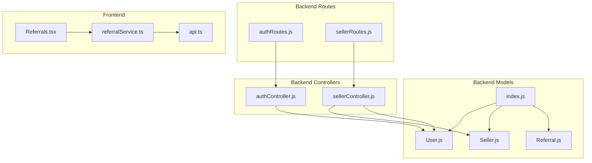
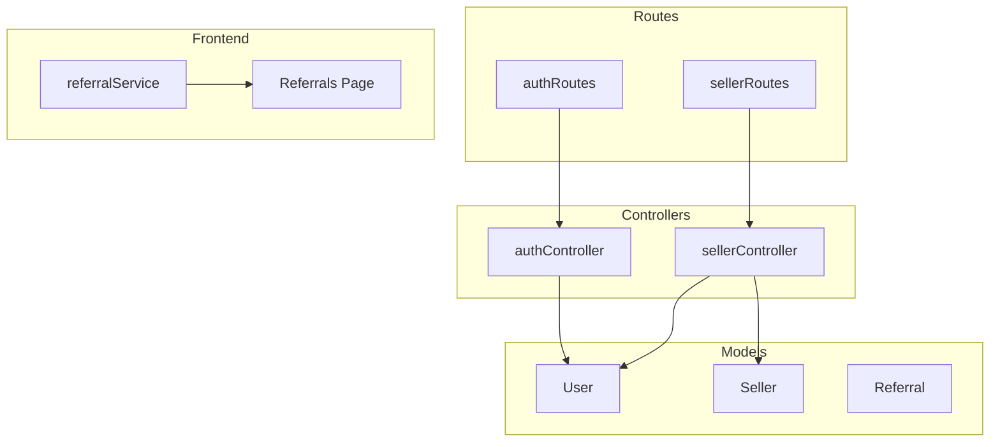
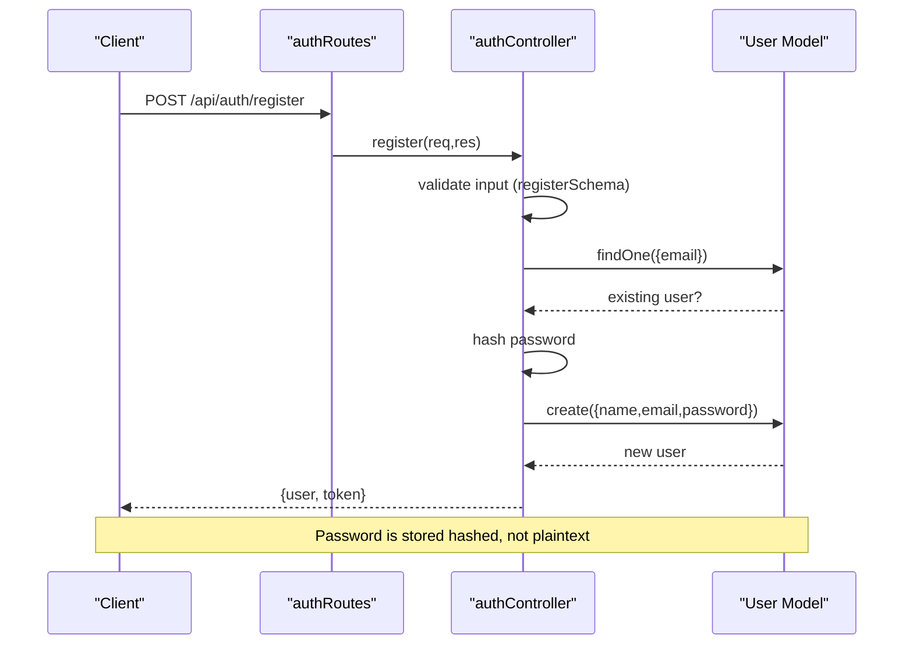
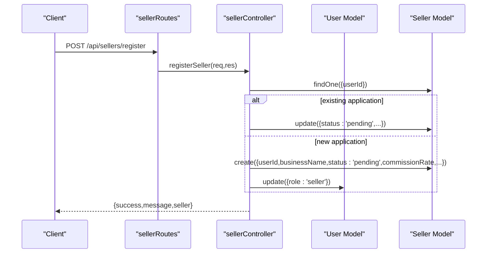
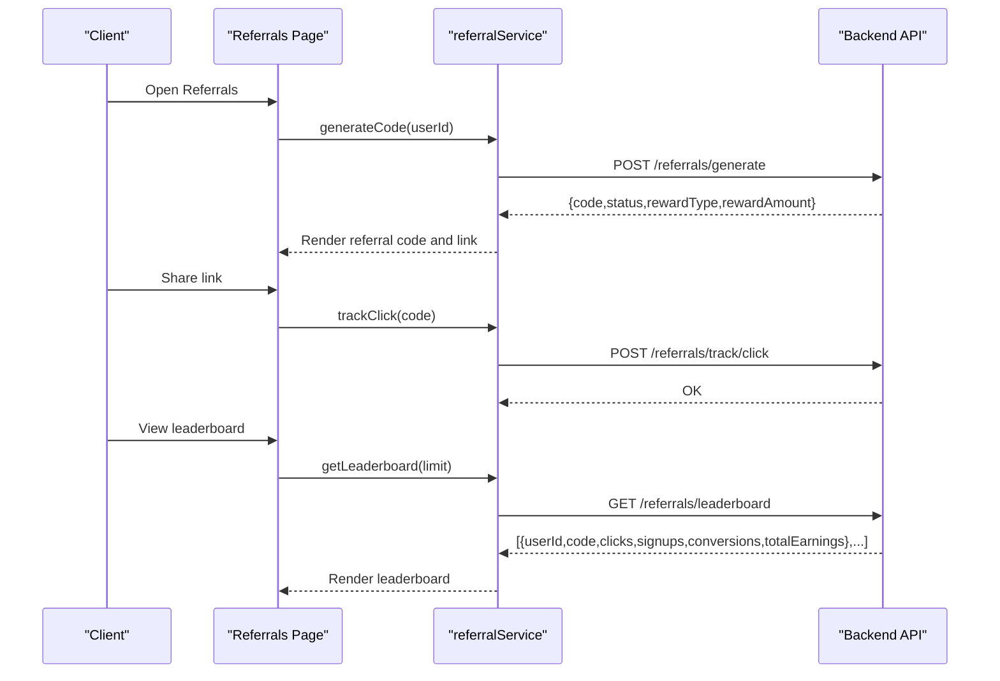
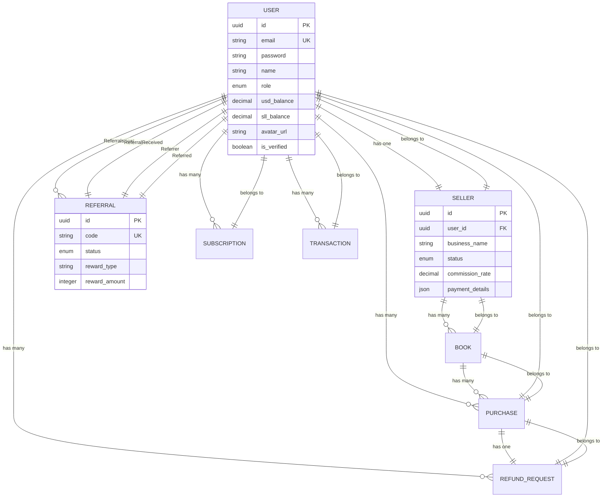

# Core User Models

<cite>
**Referenced Files in This Document**
- [User.js](file://backend/models/User.js)
- [Seller.js](file://backend/models/Seller.js)
- [Referral.js](file://backend/models/Referral.js)
- [index.js](file://backend/models/index.js)
- [authSchema.js](file://backend/validation/authSchema.js)
- [authController.js](file://backend/controllers/authController.js)
- [authRoutes.js](file://backend/routes/authRoutes.js)
- [sellerController.js](file://backend/controllers/sellerController.js)
- [sellerRoutes.js](file://backend/routes/sellerRoutes.js)
- [referralService.ts](file://frontend/src/api/services/referralService.ts)
- [api.ts](file://frontend/src/utils/api.ts)
- [Referrals.tsx](file://frontend/src/pages/Referrals.tsx)
</cite>

## Table of Contents
1. [Introduction](#introduction)
2. [Project Structure](#project-structure)
3. [Core Components](#core-components)
4. [Architecture Overview](#architecture-overview)
5. [Detailed Component Analysis](#detailed-component-analysis)
6. [Dependency Analysis](#dependency-analysis)
7. [Performance Considerations](#performance-considerations)
8. [Troubleshooting Guide](#troubleshooting-guide)
9. [Conclusion](#conclusion)
10. [Appendices](#appendices)

## Introduction
This document provides comprehensive data model documentation for the core user-related entities in QuantumMint Bookstore. It covers the User, Seller, and Referral models, detailing field definitions, data types, constraints, validation rules, and business logic. It also explains model associations, including the User-Seller one-to-one relationship and the User-Referral bidirectional relationships. Finally, it includes practical usage examples for user registration, seller application, and referral tracking scenarios.

## Project Structure
The relevant models and their associations are defined in the backend models directory. Controllers and routes expose CRUD and business workflows for authentication, seller onboarding, and referral interactions. Frontend services and pages consume the backend APIs to support user-facing flows.

**Diagram sources**
- [index.js:24-174](file://backend/models/index.js#L24-L174)
- [User.js:1-50](file://backend/models/User.js#L1-L50)
- [Seller.js:1-30](file://backend/models/Seller.js#L1-L30)
- [Referral.js:1-31](file://backend/models/Referral.js#L1-L31)
- [authController.js:30-135](file://backend/controllers/authController.js#L30-L135)
- [sellerController.js:7-211](file://backend/controllers/sellerController.js#L7-L211)
- [authRoutes.js:1-11](file://backend/routes/authRoutes.js#L1-L11)
- [sellerRoutes.js:1-42](file://backend/routes/sellerRoutes.js#L1-L42)
- [referralService.ts:1-34](file://frontend/src/api/services/referralService.ts#L1-L34)
- [api.ts:827-827](file://frontend/src/utils/api.ts#L827-L827)
- [Referrals.tsx:94-176](file://frontend/src/pages/Referrals.tsx#L94-L176)

**Section sources**
- [index.js:24-174](file://backend/models/index.js#L24-L174)
- [authRoutes.js:1-11](file://backend/routes/authRoutes.js#L1-L11)
- [sellerRoutes.js:1-42](file://backend/routes/sellerRoutes.js#L1-L42)

## Core Components
This section documents the three core models: User, Seller, and Referral. It describes fields, data types, constraints, and validation rules.

- User model
  - Purpose: Represents application users with authentication, profile, balances, and verification state.
  - Key fields and constraints:
    - id: UUID, primary key, auto-generated.
    - email: STRING, required, unique, validated as email.
    - password: STRING, required (hashed before persistence).
    - name: STRING, required.
    - role: ENUM('user', 'seller', 'admin'), defaults to 'user'.
    - usdBalance: DECIMAL(15, 2), defaults to 0.00.
    - sllBalance: DECIMAL(15, 2), defaults to 0.00.
    - avatarUrl: STRING, optional.
    - isVerified: BOOLEAN, defaults to false.
  - Validation rules:
    - Registration requires name (min length), email (valid format), and password (min length).
    - Login requires email (valid format) and password (non-empty).

- Seller model
  - Purpose: Represents a user's seller application and profile.
  - Key fields and constraints:
    - id: UUID, primary key, auto-generated.
    - businessName: STRING, required.
    - status: ENUM('pending', 'approved', 'rejected'), defaults to 'pending'.
    - commissionRate: DECIMAL(5, 2), defaults to 10.00.
    - paymentDetails: JSON, optional.
  - Business rules:
    - On application submission, status reverts to 'pending' if updating an existing application.
    - Default commission rate is 10%.

- Referral model
  - Purpose: Stores referral codes and reward mechanics.
  - Key fields and constraints:
    - id: UUID, primary key, auto-generated.
    - code: STRING, required, unique.
    - status: ENUM('active', 'pending', 'completed'), defaults to 'pending'.
    - rewardType: STRING, defaults to 'reading_time'; supports 'reading_time' or 'cash'.
    - rewardAmount: INTEGER, defaults to 120 (minutes).
  - Business rules:
    - Reward defaults to 120 minutes (2 hours) of reading time.
    - Status progression is managed by backend workflows (not shown here).

**Section sources**
- [User.js:1-50](file://backend/models/User.js#L1-L50)
- [Seller.js:1-30](file://backend/models/Seller.js#L1-L30)
- [Referral.js:1-31](file://backend/models/Referral.js#L1-L31)
- [authSchema.js:1-18](file://backend/validation/authSchema.js#L1-L18)

## Architecture Overview
The backend uses Sequelize models with explicit associations. Authentication flows are handled via dedicated routes and controllers. Seller onboarding integrates with User roles. Referral mechanics are exposed via frontend services and pages.

**Diagram sources**
- [index.js:71-85](file://backend/models/index.js#L71-L85)
- [authController.js:30-135](file://backend/controllers/authController.js#L30-L135)
- [sellerController.js:7-211](file://backend/controllers/sellerController.js#L7-L211)
- [authRoutes.js:1-11](file://backend/routes/authRoutes.js#L1-L11)
- [sellerRoutes.js:1-42](file://backend/routes/sellerRoutes.js#L1-L42)
- [referralService.ts:1-34](file://frontend/src/api/services/referralService.ts#L1-L34)
- [Referrals.tsx:94-176](file://frontend/src/pages/Referrals.tsx#L94-L176)

## Detailed Component Analysis

### User Model
- Fields and constraints:
  - id: UUID, primary key.
  - email: STRING, required, unique, validated as email.
  - password: STRING, required (hashed before persistence).
  - name: STRING, required.
  - role: ENUM('user', 'seller', 'admin'), defaults to 'user'.
  - usdBalance: DECIMAL(15, 2), defaults to 0.00.
  - sllBalance: DECIMAL(15, 2), defaults to 0.00.
  - avatarUrl: STRING, optional.
  - isVerified: BOOLEAN, defaults to false.
- Validation rules:
  - Registration: name (min length), email (valid format), password (min length).
  - Login: email (valid format), password (required).
- Usage examples:
  - User registration: POST /api/auth/register with name, email, password.
  - User login: POST /api/auth/login with email, password.
  - Fetch current user: GET /api/auth/me (requires authentication).

**Diagram sources**
- [authRoutes.js:6-8](file://backend/routes/authRoutes.js#L6-L8)
- [authController.js:30-77](file://backend/controllers/authController.js#L30-L77)
- [authSchema.js:3-7](file://backend/validation/authSchema.js#L3-L7)
- [User.js:10-21](file://backend/models/User.js#L10-L21)

**Section sources**
- [User.js:1-50](file://backend/models/User.js#L1-L50)
- [authSchema.js:1-18](file://backend/validation/authSchema.js#L1-L18)
- [authController.js:30-135](file://backend/controllers/authController.js#L30-L135)
- [authRoutes.js:1-11](file://backend/routes/authRoutes.js#L1-L11)

### Seller Model
- Fields and constraints:
  - id: UUID, primary key.
  - businessName: STRING, required.
  - status: ENUM('pending', 'approved', 'rejected'), defaults to 'pending'.
  - commissionRate: DECIMAL(5, 2), defaults to 10.00.
  - paymentDetails: JSON, optional.
- Business rules:
  - On application submission, updates existing application and resets status to 'pending'.
  - Default commission rate is 10%.
  - User role may be updated to 'seller' upon application (implementation note).
- Usage examples:
  - Apply as seller: POST /api/sellers/register (authenticated).
  - View seller profile: GET /api/sellers/profile (authenticated).
  - View earnings: GET /api/sellers/earnings (authenticated).
  - Request payout: POST /api/sellers/payout (authenticated).

**Diagram sources**
- [sellerRoutes.js:11-11](file://backend/routes/sellerRoutes.js#L11-L11)
- [sellerController.js:7-50](file://backend/controllers/sellerController.js#L7-L50)
- [Seller.js:10-25](file://backend/models/Seller.js#L10-L25)
- [User.js:26-29](file://backend/models/User.js#L26-L29)

**Section sources**
- [Seller.js:1-30](file://backend/models/Seller.js#L1-L30)
- [sellerController.js:7-211](file://backend/controllers/sellerController.js#L7-L211)
- [sellerRoutes.js:1-42](file://backend/routes/sellerRoutes.js#L1-L42)

### Referral Model
- Fields and constraints:
  - id: UUID, primary key.
  - code: STRING, required, unique.
  - status: ENUM('active', 'pending', 'completed'), defaults to 'pending'.
  - rewardType: STRING, defaults to 'reading_time'; supports 'reading_time' or 'cash'.
  - rewardAmount: INTEGER, defaults to 120 (minutes).
- Business rules:
  - Default reward is 120 minutes (2 hours) of reading time.
  - Status progression is managed by backend workflows (not shown here).
- Frontend integration:
  - Services expose endpoints for generating referral codes, tracking clicks, retrieving user referral data, and fetching leaderboards.
  - UI displays referral link, sharing options, history, and status indicators.

**Diagram sources**
- [referralService.ts:8-33](file://frontend/src/api/services/referralService.ts#L8-L33)
- [Referrals.tsx:94-176](file://frontend/src/pages/Referrals.tsx#L94-L176)
- [Referral.js:10-26](file://backend/models/Referral.js#L10-L26)

**Section sources**
- [Referral.js:1-31](file://backend/models/Referral.js#L1-L31)
- [referralService.ts:1-34](file://frontend/src/api/services/referralService.ts#L1-L34)
- [Referrals.tsx:94-176](file://frontend/src/pages/Referrals.tsx#L94-L176)

## Dependency Analysis
Model associations define relationships among entities. The following associations are established:

- User has one Seller (one-to-one via foreign key).
- Seller belongs to User (one-to-one via foreign key).
- User has many Purchases (one-to-many).
- Purchase belongs to User (many-to-one).
- User has many RefundRequests (one-to-many).
- RefundRequest belongs to User (many-to-one).
- Purchase has one RefundRequest (one-to-one).
- RefundRequest belongs to Purchase (one-to-one).
- User has many Subscriptions (one-to-many).
- Subscription belongs to User (many-to-one).
- Book has many Purchases (one-to-many).
- Purchase belongs to Book (many-to-one).
- User has many Transactions (one-to-many).
- Transaction belongs to User (many-to-one).
- Seller has many Books (one-to-many).
- Book belongs to Seller (many-to-one).
- User has many Referrals (sent) via ReferralsSent association.
- Referral belongs to User (as Referrer) via referrerId.
- User has one Referral (received) via ReferralReceived association.
- Referral belongs to User (as Referred) via referredId.

**Diagram sources**
- [index.js:45-85](file://backend/models/index.js#L45-L85)
- [User.js:1-50](file://backend/models/User.js#L1-L50)
- [Seller.js:1-30](file://backend/models/Seller.js#L1-L30)
- [Referral.js:1-31](file://backend/models/Referral.js#L1-L31)

**Section sources**
- [index.js:45-85](file://backend/models/index.js#L45-L85)

## Performance Considerations
- Indexing: Ensure unique indexes on email (User), code (Referral), and foreign keys to optimize joins and lookups.
- Validation: Keep validation schemas minimal and efficient; avoid heavy synchronous checks in hot paths.
- Password hashing: Use appropriate salt rounds and consider asynchronous hashing to prevent blocking the event loop.
- Associations: Use eager loading (include) judiciously to avoid N+1 queries; batch operations where possible.
- Caching: Cache frequently accessed referral and seller data for read-heavy operations.

## Troubleshooting Guide
- Authentication
  - Registration fails validation: Verify input matches registration schema (name, email, password).
  - Duplicate email: Ensure uniqueness constraint is respected; handle duplicate detection before creation.
  - Login failures: Confirm hashed password comparison succeeds; check user existence by email.
- Seller onboarding
  - Application not found: Ensure userId is present and correctly mapped to the logged-in user.
  - Role not updated: Confirm role assignment logic executes after successful application submission.
- Referral program
  - Missing referral data: Verify userId passed to referral endpoints and that associations are properly loaded.
  - Leaderboard empty: Confirm referral records exist and status progression is handled by backend workflows.

**Section sources**
- [authController.js:30-135](file://backend/controllers/authController.js#L30-L135)
- [authSchema.js:1-18](file://backend/validation/authSchema.js#L1-L18)
- [sellerController.js:7-211](file://backend/controllers/sellerController.js#L7-L211)
- [referralService.ts:1-34](file://frontend/src/api/services/referralService.ts#L1-L34)

## Conclusion
The User, Seller, and Referral models form the backbone of user identity, seller onboarding, and referral mechanics in QuantumMint Bookstore. Clear field definitions, constraints, and validation rules ensure data integrity. Explicit model associations enable robust relationships and efficient querying. The provided usage examples and troubleshooting guidance help developers implement and maintain these features effectively.

## Appendices
- Usage examples
  - User registration: POST /api/auth/register with name, email, password.
  - User login: POST /api/auth/login with email, password.
  - Apply as seller: POST /api/sellers/register (authenticated).
  - View seller profile: GET /api/sellers/profile (authenticated).
  - Request payout: POST /api/sellers/payout (authenticated).
  - Generate referral code: POST /referrals/generate (via frontend service).
  - Track referral click: POST /referrals/track/click (via frontend service).
  - Get leaderboard: GET /referrals/leaderboard (via frontend service).