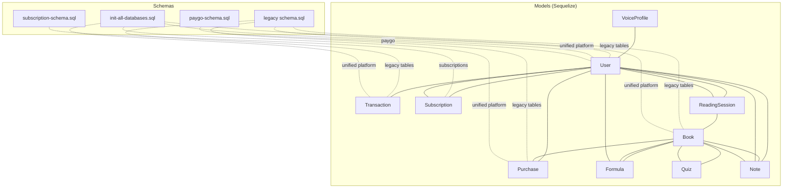
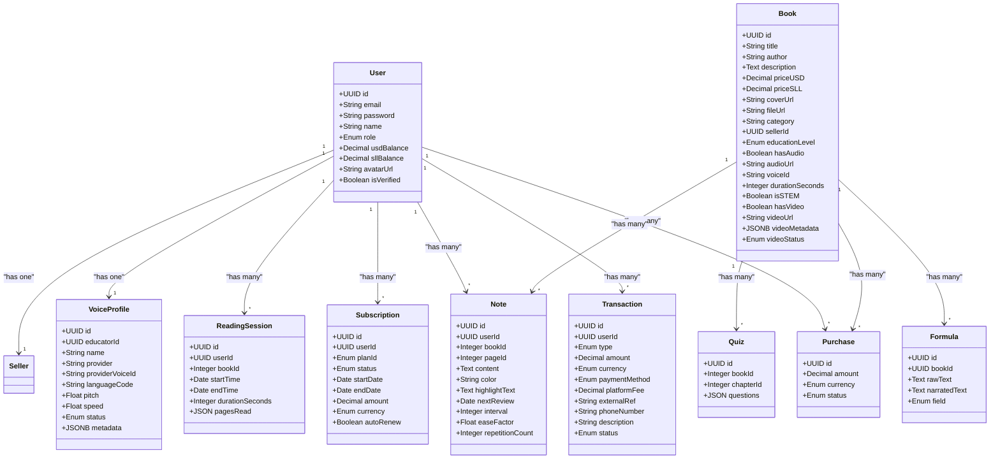
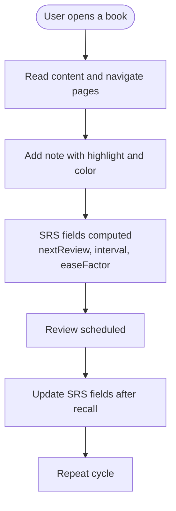
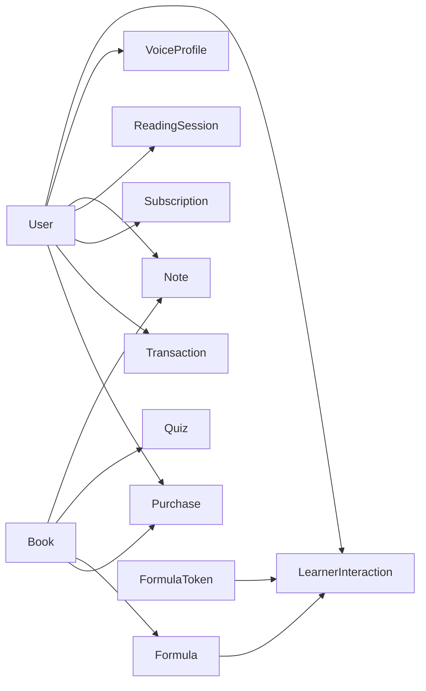

# Data Models Reference

<cite>
**Referenced Files in This Document**
- [index.js](file://backend/models/index.js)
- [User.js](file://backend/models/User.js)
- [Book.js](file://backend/models/Book.js)
- [Purchase.js](file://backend/models/Purchase.js)
- [Transaction.js](file://backend/models/Transaction.js)
- [Subscription.js](file://backend/models/Subscription.js)
- [ReadingSession.js](file://backend/models/ReadingSession.js)
- [VoiceProfile.js](file://backend/models/VoiceProfile.js)
- [Formula.js](file://backend/models/Formula.js)
- [Quiz.js](file://backend/models/Quiz.js)
- [Note.js](file://backend/models/Note.js)
- [schema.sql](file://backend/schema.sql)
- [init-all-databases.sql](file://database/init-all-databases.sql)
- [subscription-schema.sql](file://database/subscription-schema.sql)
- [paygo-schema.sql](file://database/paygo-schema.sql)
</cite>

## Table of Contents
1. [Introduction](#introduction)
2. [Project Structure](#project-structure)
3. [Core Components](#core-components)
4. [Architecture Overview](#architecture-overview)
5. [Detailed Component Analysis](#detailed-component-analysis)
6. [Dependency Analysis](#dependency-analysis)
7. [Performance Considerations](#performance-considerations)
8. [Troubleshooting Guide](#troubleshooting-guide)
9. [Conclusion](#conclusion)
10. [Appendices](#appendices)

## Introduction
This document provides a comprehensive data model reference for QuantumMint Bookstore’s backend. It covers 15+ database entities, detailing fields, data types, constraints, defaults, validations, and business rules. It also explains model associations, initialization, and usage patterns across the bookstore, subscription, and pay-as-you-go systems.

## Project Structure
The data models are defined using Sequelize ORM and organized under backend/models. A central initializer registers models and defines associations. The database schemas are maintained in SQL files for both the legacy bookstore schema and the unified platform schema, plus dedicated subscription and paygo schemas.

**Diagram sources**
- [index.js:24-167](file://backend/models/index.js#L24-L167)
- [schema.sql:7-132](file://backend/schema.sql#L7-L132)
- [init-all-databases.sql:11-470](file://database/init-all-databases.sql#L11-L470)
- [subscription-schema.sql:17-644](file://database/subscription-schema.sql#L17-L644)
- [paygo-schema.sql:7-371](file://database/paygo-schema.sql#L7-L371)

**Section sources**
- [index.js:1-168](file://backend/models/index.js#L1-L168)
- [schema.sql:1-132](file://backend/schema.sql#L1-L132)
- [init-all-databases.sql:1-470](file://database/init-all-databases.sql#L1-L470)
- [subscription-schema.sql:1-644](file://database/subscription-schema.sql#L1-L644)
- [paygo-schema.sql:1-371](file://database/paygo-schema.sql#L1-L371)

## Core Components
Below are the primary entities and their core attributes, constraints, defaults, and validation patterns. Business rules and usage notes are included for each.

- User
  - Purpose: Authentication, roles, balances, verification.
  - Key fields: id (UUID), email (unique, validated), password, name, role, usdBalance, sllBalance, avatarUrl, isVerified.
  - Defaults and constraints: role defaults to user; balances default to 0; email validated as email; isVerified defaults to false.
  - Validation: email format enforced via validator.
  - Associations: purchases, transactions, subscriptions, seller profile, voice profiles, notes, reading sessions.
  - Business rules: role determines access; dual-currency balances; verified flag impacts account state.

- Book
  - Purpose: E-book metadata, pricing, STEM categorization, optional audio/video assets.
  - Key fields: id, title, author, description, priceUSD, priceSLL, coverUrl, fileUrl, category, sellerId, educationLevel, hasAudio, audioUrl, voiceId, durationSeconds, isSTEM, hasVideo, videoUrl, videoMetadata, videoStatus.
  - Defaults and constraints: educationLevel defaults to General; STEM flags default to false; durations default to 0; videoStatus defaults to none.
  - Validation: fileUrl required; educationLevel enum constrained.
  - Associations: purchases, formulas, quizzes, notes, narration segments.
  - Business rules: STEM flag enables scientific features; video/audio flags indicate availability; metadata supports advanced rendering.

- Purchase
  - Purpose: Records completed/pending/failed purchases with currency and amount.
  - Key fields: id, amount, currency (USD/SLL), status (completed/pending/failed).
  - Defaults and constraints: defaults to USD and completed; amount required.
  - Associations: belongs to User and Book.
  - Business rules: amount reflects final price; currency aligns with user’s preferred currency.

- Transaction
  - Purpose: Wallet activity including deposits, withdrawals, purchases, referrals, gifts, admin adjustments, refunds.
  - Key fields: id, userId, type (deposit/purchase/withdrawal/referral_bonus/gift/admin_adjustment/refund), amount, currency (SLL/USD), paymentMethod, platformFee, externalRef, phoneNumber, description, status (completed/pending/failed/processing).
  - Defaults and constraints: defaults to SLL and pending; platformFee defaults to 0; type and status enums constrained.
  - Associations: belongs to User.
  - Business rules: platformFee tracks marketplace costs; externalRef links to payment provider.

- Subscription
  - Purpose: Legacy subscription model for time-bound access with plan identifiers and auto-renewal.
  - Key fields: id, userId, planId (enum of predefined durations), status (active/expired/cancelled), startDate, endDate, amount, currency (SLL/USD), autoRenew.
  - Defaults and constraints: defaults to SLL and non-auto-renew; dates required; amount required.
  - Associations: belongs to User.
  - Business rules: planId encodes access length; autoRenew toggles recurring billing.

- ReadingSession
  - Purpose: Tracks reading sessions with timestamps, duration, and pages read.
  - Key fields: id, userId, bookId, startTime, endTime, durationSeconds, pagesRead (JSON array).
  - Defaults and constraints: defaults to current time for start; durationSeconds defaults to 0; pagesRead defaults to empty array.
  - Associations: belongs to User and Book.
  - Business rules: pagesRead stores page IDs for spaced repetition; durationSeconds accumulates reading time.

- VoiceProfile
  - Purpose: Stores narrator voice configurations for audiobooks.
  - Key fields: id, educatorId, name, provider (default azure), providerVoiceId, languageCode (default en-US), pitch, speed, status (active/inactive/analyzing), metadata.
  - Defaults and constraints: provider defaults to azure; languageCode defaults to en-US; pitch/speed default to 1.0; status defaults to active.
  - Associations: belongs to Seller (via educatorId).
  - Business rules: metadata stores provider-specific settings; status controls availability.

- Formula
  - Purpose: Scientific formula representation linked to books.
  - Key fields: id, bookId, rawText, narratedText, field (math/physics/chemistry/engineering).
  - Defaults and constraints: field defaults to math.
  - Associations: belongs to Book; linked to tokens and learner interactions.
  - Business rules: field categorizes scientific domain; narratedText supports TTS.

- Quiz
  - Purpose: Assessment items per book/chapter.
  - Key fields: id, bookId, chapterId, questions (JSON array of items).
  - Defaults and constraints: questions required as JSON.
  - Associations: belongs to Book.
  - Business rules: questions include content and explanations for adaptive learning.

- Note
  - Purpose: Annotations with SRS scheduling for spaced repetition.
  - Key fields: id, userId, bookId, pageId, content, color (yellow/blue/green/pink), highlightText, nextReview, interval, easeFactor, repetitionCount.
  - Defaults and constraints: color defaults to yellow; nextReview defaults to now; interval/easeFactor/repetitionCount default to sensible values.
  - Associations: belongs to User and Book.
  - Business rules: SRS fields drive review scheduling; highlightText captures selected text.

**Section sources**
- [User.js:3-49](file://backend/models/User.js#L3-L49)
- [Book.js:3-91](file://backend/models/Book.js#L3-L91)
- [Purchase.js:3-25](file://backend/models/Purchase.js#L3-L25)
- [Transaction.js:3-53](file://backend/models/Transaction.js#L3-L53)
- [Subscription.js:3-45](file://backend/models/Subscription.js#L3-L45)
- [ReadingSession.js:3-37](file://backend/models/ReadingSession.js#L3-L37)
- [VoiceProfile.js:3-49](file://backend/models/VoiceProfile.js#L3-L49)
- [Formula.js:3-29](file://backend/models/Formulajs#L3-L29)
- [Quiz.js:3-25](file://backend/models/Quiz.js#L3-L25)
- [Note.js:3-54](file://backend/models/Note.js#L3-L54)

## Architecture Overview
The models are initialized centrally and associations are declared to enforce referential integrity and simplify queries. The legacy bookstore schema coexists with a unified platform schema, while subscription and paygo schemas extend functionality for recurring billing and usage-based pricing.

**Diagram sources**
- [index.js:24-167](file://backend/models/index.js#L24-L167)
- [User.js:3-49](file://backend/models/User.js#L3-L49)
- [Book.js:3-91](file://backend/models/Book.js#L3-L91)
- [Purchase.js:3-25](file://backend/models/Purchase.js#L3-L25)
- [Transaction.js:3-53](file://backend/models/Transaction.js#L3-L53)
- [Subscription.js:3-45](file://backend/models/Subscription.js#L3-L45)
- [ReadingSession.js:3-37](file://backend/models/ReadingSession.js#L3-L37)
- [VoiceProfile.js:3-49](file://backend/models/VoiceProfile.js#L3-L49)
- [Formula.js:3-29](file://backend/models/Formula.js#L3-L29)
- [Quiz.js:3-25](file://backend/models/Quiz.js#L3-L25)
- [Note.js:3-54](file://backend/models/Note.js#L3-L54)

**Section sources**
- [index.js:45-146](file://backend/models/index.js#L45-L146)

## Detailed Component Analysis

### User Model
- Initialization: Defined with Sequelize, UUID primary key, email uniqueness, and password requirement.
- Validation: Email format enforced; password mandatory.
- Defaults: role=user, balances=0, isVerified=false.
- Associations: purchases, transactions, subscriptions, seller, voice profiles, notes, reading sessions.
- Usage examples:
  - Create a new user with verified=false and zero balances.
  - Update balances after a purchase or deposit.
  - Enforce role-based access checks.

**Section sources**
- [User.js:3-49](file://backend/models/User.js#L3-L49)
- [index.js:47-73](file://backend/models/index.js#L47-L73)

### Book Model
- Initialization: Defines metadata, pricing in USD/SLL, STEM flags, optional audio/video fields, and video status.
- Validation: fileUrl required; educationLevel enum constrained.
- Defaults: educationLevel=General; isSTEM=false; durations=0; videoStatus=none.
- Associations: purchases, formulas, quizzes, notes, narration segments.
- Usage examples:
  - Set isSTEM=true for scientific content; populate videoMetadata for player configuration.
  - Use priceUSD/priceSLL for multi-currency checkout.

**Section sources**
- [Book.js:3-91](file://backend/models/Book.js#L3-L91)
- [index.js:63-121](file://backend/models/index.js#L63-L121)

### Purchase Model
- Initialization: Amount and currency required; status defaults to completed.
- Validation: Amount must be positive; currency enum constrained.
- Associations: belongs to User and Book.
- Usage examples:
  - Record completed purchases with final amounts and currencies.
  - Link refunds to purchases via RefundRequest.

**Section sources**
- [Purchase.js:3-25](file://backend/models/Purchase.js#L3-L25)
- [index.js:55-57](file://backend/models/index.js#L55-L57)

### Transaction Model
- Initialization: Type and amount required; status defaults to pending; currency defaults to SLL.
- Validation: Type and status enums constrained; platformFee defaults to 0.
- Associations: belongs to User.
- Usage examples:
  - Track deposits via orange_money/afrimoney/qmoney/stripe.
  - Log admin adjustments and refunds with descriptions.

**Section sources**
- [Transaction.js:3-53](file://backend/models/Transaction.js#L3-L53)
- [index.js:67-69](file://backend/models/index.js#L67-L69)

### Subscription Model
- Initialization: planId enum encodes access lengths; autoRenew defaults to false.
- Validation: status and currency enums constrained; dates required.
- Associations: belongs to User.
- Usage examples:
  - Activate autoRenew for recurring billing.
  - Map planId to access durations and pricing tiers.

**Section sources**
- [Subscription.js:3-45](file://backend/models/Subscription.js#L3-L45)
- [index.js:59-61](file://backend/models/index.js#L59-L61)

### ReadingSession Model
- Initialization: Tracks session start/end, duration, and pages read.
- Validation: pagesRead stored as JSON; defaults for timestamps and duration.
- Associations: belongs to User and Book.
- Usage examples:
  - Update durationSeconds incrementally during reading.
  - Persist pagesRead for spaced repetition scheduling.

**Section sources**
- [ReadingSession.js:3-37](file://backend/models/ReadingSession.js#L3-L37)
- [index.js:131-137](file://backend/models/index.js#L131-L137)

### VoiceProfile Model
- Initialization: Provider, language, pitch, speed, and status configurable.
- Validation: provider defaults to azure; languageCode defaults to en-US; status enum constrained.
- Associations: belongs to Seller (via educatorId).
- Usage examples:
  - Configure narrator voice for audiobooks.
  - Store provider-specific metadata for synthesis.

**Section sources**
- [VoiceProfile.js:3-49](file://backend/models/VoiceProfile.js#L3-L49)
- [index.js:87-89](file://backend/models/index.js#L87-L89)

### Formula Model
- Initialization: rawText required; narratedText optional; field defaults to math.
- Validation: field enum constrained.
- Associations: belongs to Book; linked to tokens and learner interactions.
- Usage examples:
  - Parse LaTeX-like rawText into structured tokens.
  - Generate narratedText for TTS-based explanations.

**Section sources**
- [Formula.js:3-29](file://backend/models/Formula.js#L3-L29)
- [index.js:91-97](file://backend/models/index.js#L91-L97)

### Quiz Model
- Initialization: questions stored as JSON array; chapterId optional.
- Validation: questions required as JSON.
- Associations: belongs to Book.
- Usage examples:
  - Store assessment items with options and explanations.
  - Link to chapters for chapter-wise testing.

**Section sources**
- [Quiz.js:3-25](file://backend/models/Quiz.js#L3-L25)
- [index.js:139-141](file://backend/models/index.js#L139-L141)

### Note Model
- Initialization: Color defaults to yellow; SRS fields include nextReview, interval, easeFactor, repetitionCount.
- Validation: content required; highlightText optional.
- Associations: belongs to User and Book.
- Usage examples:
  - Create annotations with color coding.
  - Schedule spaced repetition reviews using SRS fields.

**Section sources**
- [Note.js:3-54](file://backend/models/Note.js#L3-L54)
- [index.js:123-129](file://backend/models/index.js#L123-L129)

### Conceptual Overview
The following conceptual flow illustrates how a user interacts with content, generates notes, and schedules reviews:

[No sources needed since this diagram shows conceptual workflow, not actual code structure]

[No sources needed since this section doesn't analyze specific source files]

## Dependency Analysis
The model initializer defines foreign keys and associations across entities. These relationships ensure referential integrity and enable efficient joins for reporting and user experiences.

**Diagram sources**
- [index.js:45-146](file://backend/models/index.js#L45-L146)

**Section sources**
- [index.js:45-146](file://backend/models/index.js#L45-L146)

## Performance Considerations
- Indexes: The unified platform schema includes numerous indexes on frequently queried columns (e.g., idx_user_subscriptions, idx_subscription_usage). Ensure similar indexes exist for legacy tables if performance degrades.
- Enum constraints: Using enums reduces storage and speeds up filtering but requires schema changes to extend values.
- JSON/JSONB: Storing arrays and metadata in JSON/JSONB improves flexibility but can complicate indexing; consider normalized tables for high-cardinality data.
- Caching: Frequently accessed notes, formulas, and quizzes can benefit from caching layers to reduce database load.

[No sources needed since this section provides general guidance]

## Troubleshooting Guide
- Email validation failures: Ensure email follows standard format; check uniqueness constraints.
- Missing foreign keys: Verify associations are defined in the initializer and corresponding tables exist.
- Enum mismatches: Confirm enum values match allowed sets (e.g., status, currency, field).
- Decimal precision: Validate that amounts fit decimal scale/precision to avoid truncation.
- Timestamp drift: Use database defaults for createdAt/updatedAt to prevent inconsistencies.

**Section sources**
- [User.js:14-16](file://backend/models/User.js#L14-L16)
- [schema.sql:7-132](file://backend/schema.sql#L7-L132)
- [init-all-databases.sql:11-470](file://database/init-all-databases.sql#L11-L470)
- [subscription-schema.sql:17-644](file://database/subscription-schema.sql#L17-L644)
- [paygo-schema.sql:7-371](file://database/paygo-schema.sql#L7-L371)

## Conclusion
QuantumMint Bookstore’s data models combine a robust legacy schema with a unified platform schema and specialized subscription and paygo systems. The Sequelize models define clear fields, constraints, defaults, and associations, enabling scalable and maintainable functionality across purchases, reading sessions, notes, formulas, quizzes, and voice profiles.

[No sources needed since this section summarizes without analyzing specific files]

## Appendices

### Appendix A: Legacy Schema Highlights
- Users, Sellers, Books, Purchases, Transactions, Wallets, PaymentMethods, Referrals tables with primary keys, foreign keys, enums, and defaults.
- Business rules: Sellers linked to Users; Purchases link Users and Books; Referrals track referrers and referred users.

**Section sources**
- [schema.sql:7-132](file://backend/schema.sql#L7-L132)

### Appendix B: Unified Platform Schema Highlights
- Users, Products, Purchases, Subscriptions, Consumption History, Reviews, Wishlists, Cart Items, Notifications tables with UUIDs, enums, JSONB, and indexes.
- Business rules: Products unify video/audiobook/ebook metadata; Consumption History tracks progress and notes; Reviews include helpfulness and moderation.

**Section sources**
- [init-all-databases.sql:11-470](file://database/init-all-databases.sql#L11-L470)

### Appendix C: Subscription Schema Highlights
- Subscription Plans, User Subscriptions, Usage Tracking, Invoices, Coupons, Events, Access Logs, Analytics tables with UUIDs, enums, JSONB, triggers, and seed data.
- Business rules: Access duration calculated by trigger; coupons apply discounts; analytics pre-aggregates metrics.

**Section sources**
- [subscription-schema.sql:17-644](file://database/subscription-schema.sql#L17-L644)

### Appendix D: PayGo Schema Highlights
- PayGo Wallets, Transactions, Sessions, Rate Cards tables with balances, charges, sessions, and rate calculations.
- Business rules: Automatic rate calculation; balance checks; session heartbeats; daily/monthly spending limits.

**Section sources**
- [paygo-schema.sql:7-371](file://database/paygo-schema.sql#L7-L371)