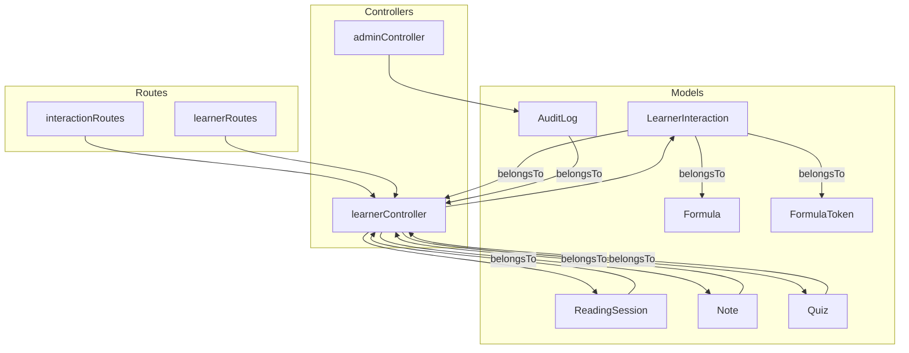
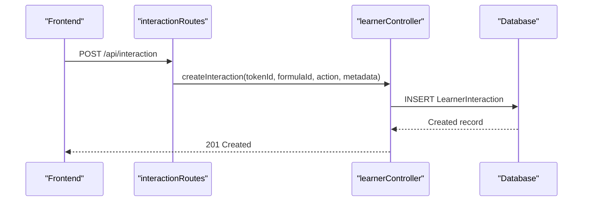
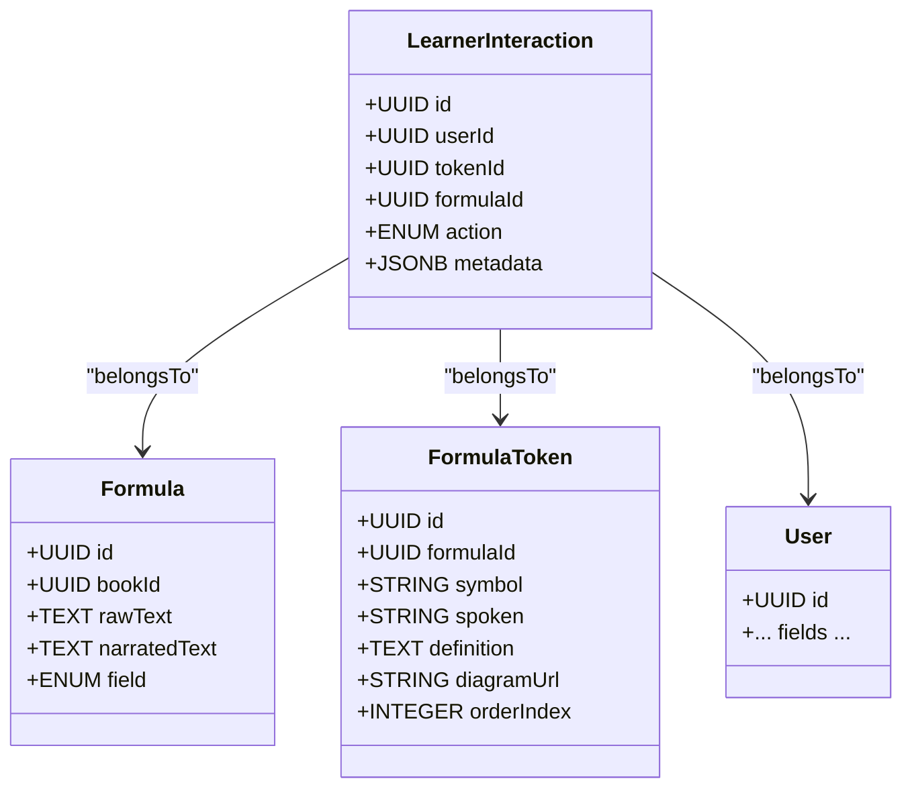
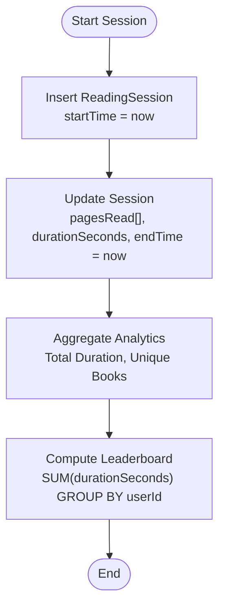
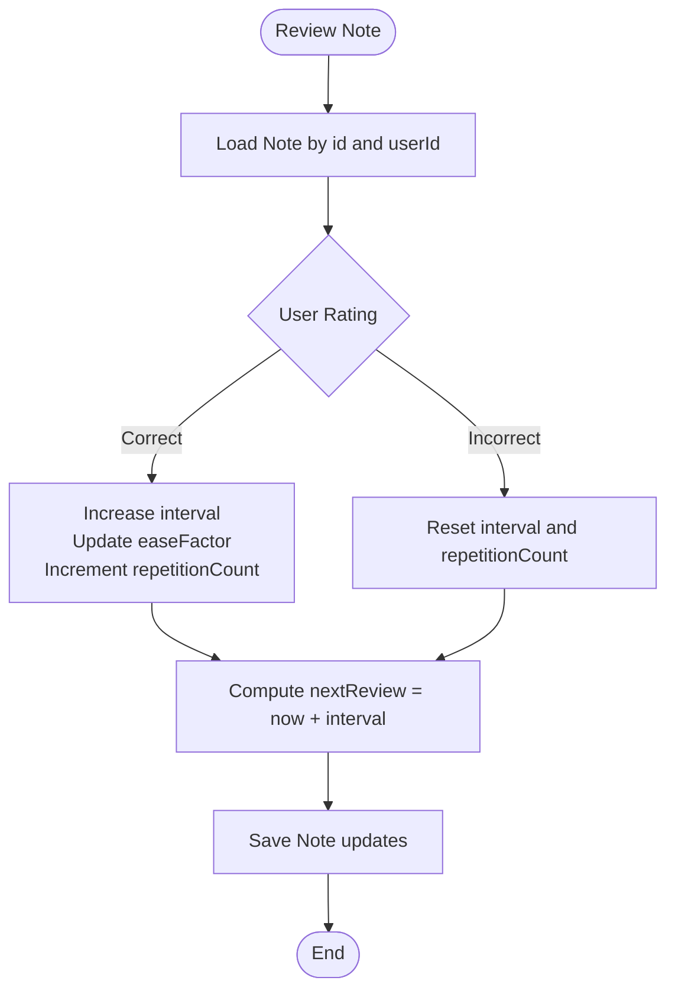
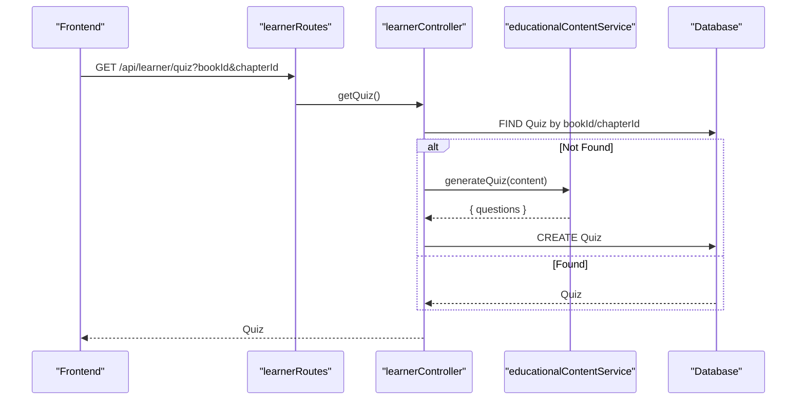
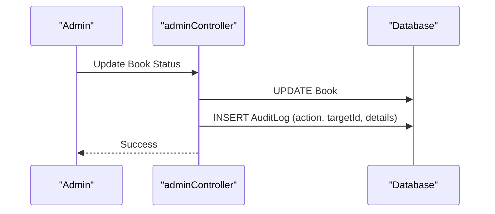
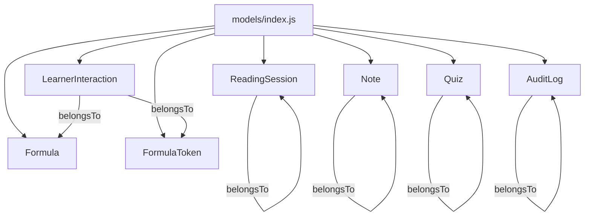

# Interaction and Analytics Models

<cite>
**Referenced Files in This Document**
- [LearnerInteraction.js](file://backend/models/LearnerInteraction.js)
- [ReadingSession.js](file://backend/models/ReadingSession.js)
- [Note.js](file://backend/models/Note.js)
- [Quiz.js](file://backend/models/Quiz.js)
- [AuditLog.js](file://backend/models/AuditLog.js)
- [Formula.js](file://backend/models/Formula.js)
- [FormulaToken.js](file://backend/models/FormulaToken.js)
- [index.js](file://backend/models/index.js)
- [interactionRoutes.js](file://backend/routes/interactionRoutes.js)
- [learnerRoutes.js](file://backend/routes/learnerRoutes.js)
- [learnerController.js](file://backend/controllers/learnerController.js)
- [adminController.js](file://backend/controllers/adminController.js)
- [educationalContentService.js](file://backend/services/educationalContentService.js)
</cite>

## Table of Contents
1. [Introduction](#introduction)
2. [Project Structure](#project-structure)
3. [Core Components](#core-components)
4. [Architecture Overview](#architecture-overview)
5. [Detailed Component Analysis](#detailed-component-analysis)
6. [Dependency Analysis](#dependency-analysis)
7. [Performance Considerations](#performance-considerations)
8. [Troubleshooting Guide](#troubleshooting-guide)
9. [Conclusion](#conclusion)
10. [Appendices](#appendices)

## Introduction
This document provides comprehensive data model documentation for learner interaction and analytics entities in the educational platform. It covers:
- LearnerInteraction: formula comprehension tracking, token-level interactions, and learning progress metadata
- ReadingSession: session timestamps, progress tracking, reading duration, and completion status
- Note: student annotations with highlighting, bookmarking, and spaced-repetition scheduling (SRS)
- Quiz: assessment content including questions, options, correct answers, and explanations
- AuditLog: administrative actions, system changes, and compliance tracking

It also explains field definitions, indexing strategies, analytical query patterns, learning analytics workflows, progress monitoring, and assessment scoring systems, with practical examples for interaction tracking, session analytics, and quiz administration.

## Project Structure
The models are defined under backend/models and initialized via backend/models/index.js, which defines associations between entities. Controllers in backend/controllers orchestrate analytics, SRS, quizzes, and session tracking. Routes in backend/routes connect HTTP endpoints to controllers.

**Diagram sources**
- [index.js:107-145](file://backend/models/index.js#L107-L145)
- [interactionRoutes.js:1-55](file://backend/routes/interactionRoutes.js#L1-L55)
- [learnerRoutes.js:1-32](file://backend/routes/learnerRoutes.js#L1-L32)
- [learnerController.js:1-281](file://backend/controllers/learnerController.js#L1-L281)
- [adminController.js:1-651](file://backend/controllers/adminController.js#L1-L651)

**Section sources**
- [index.js:1-168](file://backend/models/index.js#L1-L168)
- [interactionRoutes.js:1-55](file://backend/routes/interactionRoutes.js#L1-L55)
- [learnerRoutes.js:1-32](file://backend/routes/learnerRoutes.js#L1-L32)

## Core Components
This section documents each model’s fields, constraints, and typical usage patterns.

- LearnerInteraction
  - Purpose: Track learner interactions with formulas and tokens (e.g., tap, replay, expand, view) along with metadata.
  - Key fields: id, userId, tokenId, formulaId, action (ENUM), metadata (JSONB).
  - Typical queries: Count actions per formula, filter by user or formula, aggregate metadata insights.
  - Indexing strategy: Consider composite indexes on (userId, formulaId), (tokenId), and (formulaId) for analytics.

- ReadingSession
  - Purpose: Capture reading sessions with start/end times, duration, and pages read.
  - Key fields: id, userId, bookId, startTime, endTime, durationSeconds, pagesRead (JSON array).
  - Typical queries: Summarize total time per user, compute leaderboards, filter by date range.
  - Indexing strategy: Index on (userId, startTime), (bookId, startTime), and (userId, bookId, startTime).

- Note
  - Purpose: Student annotations with optional highlighting and SRS scheduling.
  - Key fields: id, userId, bookId, pageId, content (TEXT), color (default yellow), highlightText (optional), SRS fields (nextReview, interval, easeFactor, repetitionCount).
  - Typical queries: Fetch overdue SRS items, update SRS intervals/ease factors.
  - Indexing strategy: Index on (userId, nextReview), (bookId, pageId), and (userId, bookId).

- Quiz
  - Purpose: Assessment content stored as JSON with questions, options, correct answers, and explanations.
  - Key fields: id, bookId, chapterId (optional), questions (JSON array).
  - Typical queries: Retrieve quiz by book/chapter, generate quiz dynamically if missing.
  - Indexing strategy: Index on (bookId, chapterId).

- AuditLog
  - Purpose: Administrative audit trail with action type, target, and details.
  - Key fields: id, adminId, action (STRING), targetId (STRING), details (JSON).
  - Typical queries: Filter logs by action or target, paginate with ordering by creation time.
  - Indexing strategy: Index on (adminId, createdAt), (action, targetId).

**Section sources**
- [LearnerInteraction.js:1-34](file://backend/models/LearnerInteraction.js#L1-L34)
- [ReadingSession.js:1-38](file://backend/models/ReadingSession.js#L1-L38)
- [Note.js:1-55](file://backend/models/Note.js#L1-L55)
- [Quiz.js:1-26](file://backend/models/Quiz.js#L1-L26)
- [AuditLog.js:1-30](file://backend/models/AuditLog.js#L1-L30)

## Architecture Overview
The learner interaction and analytics pipeline integrates frontend components, routes, controllers, and models. Interaction logging is exposed via a dedicated route, while reading sessions, notes, quizzes, and audits are managed through learner and admin controllers.

**Diagram sources**
- [interactionRoutes.js:10-28](file://backend/routes/interactionRoutes.js#L10-L28)
- [learnerController.js:1-281](file://backend/controllers/learnerController.js#L1-L281)

## Detailed Component Analysis

### LearnerInteraction Model
- Fields
  - id: UUID primary key
  - userId: UUID of the learner
  - tokenId: Optional UUID linking to a FormulaToken
  - formulaId: Optional UUID linking to a Formula
  - action: ENUM with values tap, replay, expand, view
  - metadata: JSONB for arbitrary interaction details
- Associations
  - Belongs to User, Formula, and FormulaToken via foreign keys
- Typical analytics
  - Action frequency per formula
  - Average time-to-comprehension using metadata timing
  - Token-level engagement heatmaps
- Indexing recommendations
  - Composite: (userId, formulaId)
  - Single: (tokenId), (formulaId), (action)

**Diagram sources**
- [LearnerInteraction.js:4-30](file://backend/models/LearnerInteraction.js#L4-L30)
- [Formula.js:3-26](file://backend/models/Formula.js#L3-L26)
- [FormulaToken.js:3-34](file://backend/models/FormulaToken.js#L3-L34)
- [index.js:107-117](file://backend/models/index.js#L107-L117)

**Section sources**
- [LearnerInteraction.js:1-34](file://backend/models/LearnerInteraction.js#L1-L34)
- [index.js:107-117](file://backend/models/index.js#L107-L117)

### ReadingSession Model
- Fields
  - id: UUID primary key
  - userId: UUID of the learner
  - bookId: Integer identifier of the book
  - startTime: Date (default NOW)
  - endTime: Optional Date
  - durationSeconds: Integer (default 0)
  - pagesRead: JSON array of page IDs
- Analytics
  - Total reading time per user
  - Unique books read
  - Leaderboard aggregation by sum of durations
- Indexing recommendations
  - Composite: (userId, startTime)
  - Composite: (bookId, startTime)
  - Composite: (userId, bookId, startTime)

**Diagram sources**
- [ReadingSession.js:4-34](file://backend/models/ReadingSession.js#L4-L34)
- [learnerController.js:119-198](file://backend/controllers/learnerController.js#L119-L198)

**Section sources**
- [ReadingSession.js:1-38](file://backend/models/ReadingSession.js#L1-L38)
- [learnerController.js:119-198](file://backend/controllers/learnerController.js#L119-L198)

### Note Model
- Fields
  - id: UUID primary key
  - userId: UUID of the learner
  - bookId: Integer identifier of the book
  - pageId: Integer identifier of the page
  - content: TEXT annotation
  - color: STRING (default yellow)
  - highlightText: Optional TEXT
  - SRS fields: nextReview, interval, easeFactor, repetitionCount
- SRS Algorithm
  - Implements SM-2 logic to schedule next review based on user ratings
- Indexing recommendations
  - Composite: (userId, nextReview)
  - Composite: (bookId, pageId)
  - Composite: (userId, bookId)

**Diagram sources**
- [Note.js:4-51](file://backend/models/Note.js#L4-L51)
- [learnerController.js:70-114](file://backend/controllers/learnerController.js#L70-L114)

**Section sources**
- [Note.js:1-55](file://backend/models/Note.js#L1-L55)
- [learnerController.js:53-114](file://backend/controllers/learnerController.js#L53-L114)

### Quiz Model
- Fields
  - id: UUID primary key
  - bookId: Integer identifier of the book
  - chapterId: Optional integer identifier of the chapter
  - questions: JSON array of question objects with fields question, options, correctAnswer, explanation
- Dynamic Generation
  - If a quiz does not exist for a book/chapter, the controller generates one using the educational content service
- Indexing recommendations
  - Composite: (bookId, chapterId)

**Diagram sources**
- [learnerRoutes.js:28-30](file://backend/routes/learnerRoutes.js#L28-L30)
- [learnerController.js:247-280](file://backend/controllers/learnerController.js#L247-L280)
- [educationalContentService.js:126-177](file://backend/services/educationalContentService.js#L126-L177)

**Section sources**
- [Quiz.js:1-26](file://backend/models/Quiz.js#L1-L26)
- [learnerController.js:247-280](file://backend/controllers/learnerController.js#L247-L280)
- [educationalContentService.js:126-177](file://backend/services/educationalContentService.js#L126-L177)

### AuditLog Model
- Fields
  - id: UUID primary key
  - adminId: UUID of the administrator
  - action: STRING describing the action
  - targetId: STRING identifier of the target entity
  - details: JSON with contextual information
- Admin Workflows
  - Used to record actions such as approving sellers, adjusting balances, processing payouts, and refund decisions
- Indexing recommendations
  - Composite: (adminId, createdAt)
  - Single: (action, targetId)

**Diagram sources**
- [adminController.js:103-131](file://backend/controllers/adminController.js#L103-L131)
- [AuditLog.js:4-26](file://backend/models/AuditLog.js#L4-L26)

**Section sources**
- [AuditLog.js:1-30](file://backend/models/AuditLog.js#L1-L30)
- [adminController.js:9-21](file://backend/controllers/adminController.js#L9-L21)

## Dependency Analysis
The models are initialized and associated in backend/models/index.js. Routes delegate to controllers, which operate on models and services.

**Diagram sources**
- [index.js:24-44](file://backend/models/index.js#L24-L44)
- [index.js:107-145](file://backend/models/index.js#L107-L145)

**Section sources**
- [index.js:1-168](file://backend/models/index.js#L1-L168)

## Performance Considerations
- Indexing
  - Add composite indexes on frequently queried fields:
    - (userId, formulaId) for LearnerInteraction analytics
    - (userId, startTime) for ReadingSession aggregations
    - (bookId, startTime) for per-book session analytics
    - (userId, nextReview) for SRS due lists
    - (bookId, chapterId) for Quiz retrieval
    - (adminId, createdAt) for AuditLog filtering
- Pagination and Limits
  - Apply LIMIT and OFFSET for analytics endpoints to cap result sizes
- Aggregation Efficiency
  - Prefer SQL-level aggregations (SUM, COUNT, GROUP BY) in controllers to reduce payload sizes
- JSON/JSONB Storage
  - Use targeted queries with JSON operators where necessary; avoid scanning entire JSON fields without filters
- Asynchronous Workflows
  - Offload heavy analytics computations to background jobs or scheduled tasks

## Troubleshooting Guide
- Interaction Logging Failures
  - Verify authentication middleware is applied to interaction routes
  - Ensure required fields (tokenId, formulaId, action) are passed; defaults apply for optional fields
- Reading Session Updates
  - Confirm session ownership (userId match) before updates
  - Validate that durationSeconds and pagesRead arrays are properly formatted
- SRS Review Errors
  - Ensure note exists and belongs to the requesting user
  - Validate rating values conform to expected ranges
- Quiz Retrieval/Generation
  - If a quiz is missing, confirm educational content service availability and question count thresholds
- Audit Log Recording
  - Confirm admin actions call the helper to persist logs with appropriate details

**Section sources**
- [interactionRoutes.js:10-28](file://backend/routes/interactionRoutes.js#L10-L28)
- [learnerController.js:134-154](file://backend/controllers/learnerController.js#L134-L154)
- [learnerController.js:70-114](file://backend/controllers/learnerController.js#L70-L114)
- [learnerController.js:247-280](file://backend/controllers/learnerController.js#L247-L280)
- [adminController.js:9-21](file://backend/controllers/adminController.js#L9-L21)

## Conclusion
The learner interaction and analytics models form a cohesive foundation for tracking comprehension, reading behavior, note-taking, assessments, and administrative oversight. By applying recommended indexing strategies, leveraging controller-level aggregations, and following the documented workflows, the platform can deliver robust learning insights and scalable analytics.

## Appendices

### Field Definitions and Constraints
- LearnerInteraction
  - id: UUID, PK
  - userId: UUID, NOT NULL
  - tokenId: UUID, NULLABLE
  - formulaId: UUID, NULLABLE
  - action: ENUM('tap','replay','expand','view'), DEFAULT 'tap'
  - metadata: JSONB, DEFAULT '{}'

- ReadingSession
  - id: UUID, PK
  - userId: UUID, NOT NULL
  - bookId: INTEGER, NOT NULL
  - startTime: DATE, DEFAULT NOW
  - endTime: DATE, NULLABLE
  - durationSeconds: INTEGER, DEFAULT 0
  - pagesRead: JSON, DEFAULT []

- Note
  - id: UUID, PK
  - userId: UUID, NOT NULL
  - bookId: INTEGER, NOT NULL
  - pageId: INTEGER, NOT NULL
  - content: TEXT, NOT NULL
  - color: STRING, DEFAULT 'yellow'
  - highlightText: TEXT, NULLABLE
  - nextReview: DATE, DEFAULT NOW
  - interval: INTEGER, DEFAULT 0
  - easeFactor: FLOAT, DEFAULT 2.5
  - repetitionCount: INTEGER, DEFAULT 0

- Quiz
  - id: UUID, PK
  - bookId: INTEGER, NOT NULL
  - chapterId: INTEGER, NULLABLE
  - questions: JSON, NOT NULL

- AuditLog
  - id: UUID, PK
  - adminId: UUID, NOT NULL
  - action: STRING, NOT NULL
  - targetId: STRING, NULLABLE
  - details: JSON, NULLABLE

**Section sources**
- [LearnerInteraction.js:4-30](file://backend/models/LearnerInteraction.js#L4-L30)
- [ReadingSession.js:4-34](file://backend/models/ReadingSession.js#L4-L34)
- [Note.js:4-51](file://backend/models/Note.js#L4-L51)
- [Quiz.js:4-22](file://backend/models/Quiz.js#L4-L22)
- [AuditLog.js:4-26](file://backend/models/AuditLog.js#L4-L26)

### Analytical Query Patterns
- LearnerInteraction
  - Top formula interactions: GROUP BY formulaId, COUNT(action), ORDER BY count DESC
  - Action distribution: GROUP BY action, COUNT(*)
  - Metadata analysis: Extract fields from metadata JSONB for trends

- ReadingSession
  - Per-user totals: SUM(durationSeconds) GROUP BY userId
  - Completion rate: COUNT(endTime IS NOT NULL) / COUNT(*) per user
  - Time series: GROUP BY DATE(startTime) for daily activity

- Note
  - Due items: WHERE nextReview <= NOW ORDER BY nextReview ASC
  - SRS retention: COUNT(repetitionCount > 0) / COUNT(*) by user

- Quiz
  - Quiz presence: EXISTS(SELECT 1 FROM Quiz WHERE bookId=?, chapterId=?)
  - Dynamic generation fallback: Pad questions to minimum required count

- AuditLog
  - Action frequency: GROUP BY action, COUNT(*)
  - Recent activity: ORDER BY createdAt DESC LIMIT N

**Section sources**
- [learnerController.js:156-198](file://backend/controllers/learnerController.js#L156-L198)
- [learnerController.js:53-114](file://backend/controllers/learnerController.js#L53-L114)
- [learnerController.js:247-280](file://backend/controllers/learnerController.js#L247-L280)
- [adminController.js:311-337](file://backend/controllers/adminController.js#L311-L337)

### Learning Analytics Workflows
- Interaction Tracking
  - Endpoint: POST /api/interaction
  - Use cases: Formula taps, token replays, expansion events, view logs
  - Insights: Engagement per formula, token difficulty, comprehension time

- Session Analytics
  - Endpoints: POST /api/learner/sessions/start, PUT /api/learner/sessions/:id, GET /api/learner/analytics
  - Use cases: Start/stop sessions, update progress, compute weekly hours and unique books read
  - Insights: Leaderboards, reading streaks, per-chapter review metrics

- SRS Review
  - Endpoints: GET /api/learner/srs/due, POST /api/learner/srs/review/:id
  - Use cases: Fetch due cards, update SRS intervals and ease factors
  - Insights: Retention rates, optimal spacing intervals

- Quiz Administration
  - Endpoint: GET /api/learner/quiz
  - Use cases: Retrieve chapter quizzes, auto-generate if missing
  - Insights: Assessment coverage, question quality, pass rates

**Section sources**
- [interactionRoutes.js:10-28](file://backend/routes/interactionRoutes.js#L10-L28)
- [learnerRoutes.js:17-30](file://backend/routes/learnerRoutes.js#L17-L30)
- [learnerController.js:119-198](file://backend/controllers/learnerController.js#L119-L198)
- [educationalContentService.js:126-177](file://backend/services/educationalContentService.js#L126-L177)