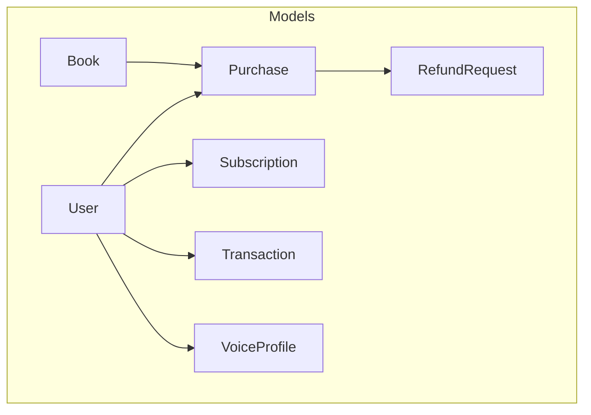
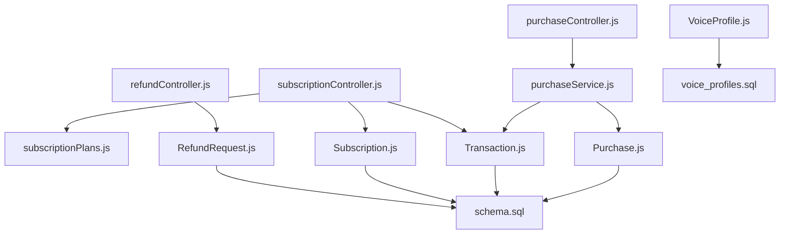
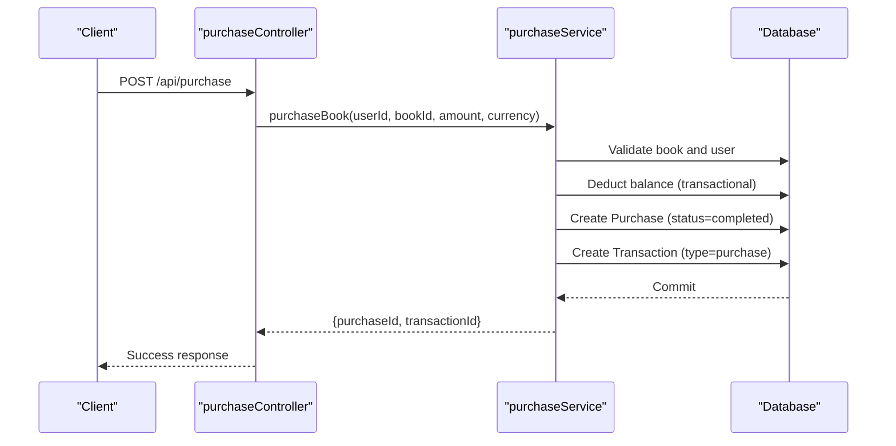
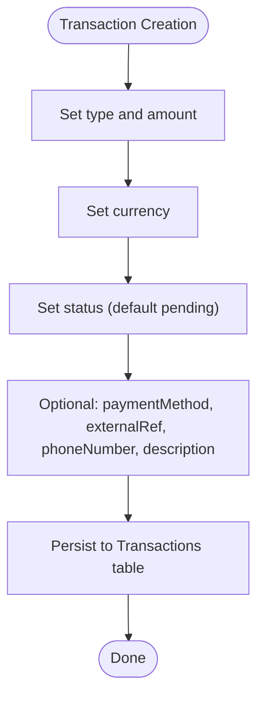
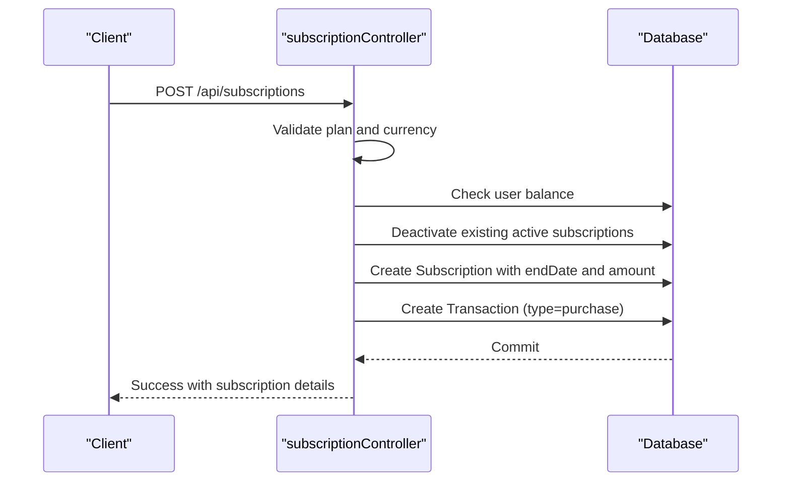
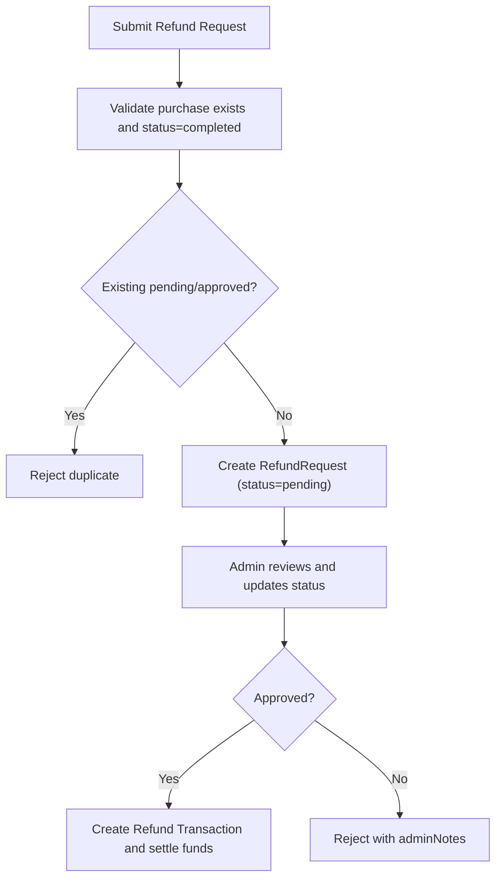
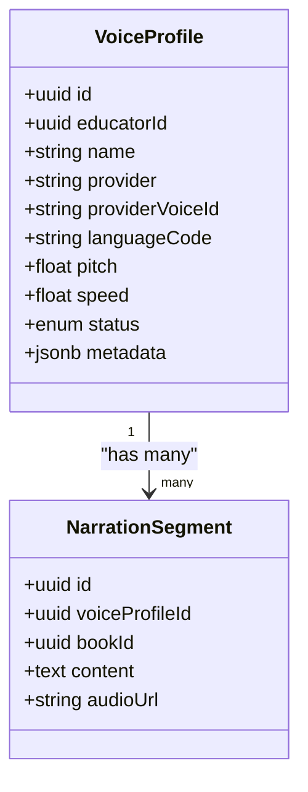
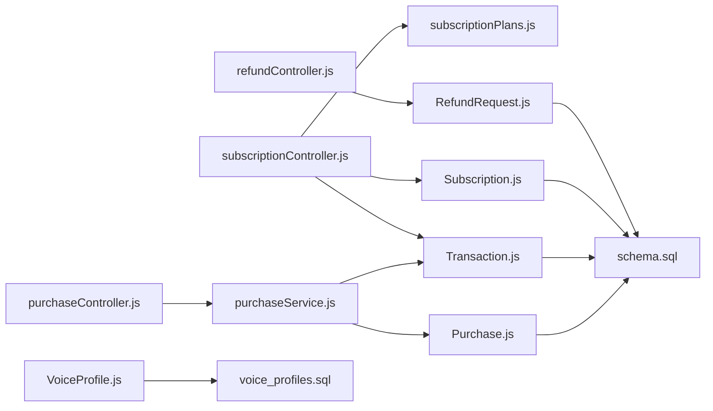

# Transactional Models

<cite>
**Referenced Files in This Document**
- [Purchase.js](file://backend/models/Purchase.js)
- [Transaction.js](file://backend/models/Transaction.js)
- [Subscription.js](file://backend/models/Subscription.js)
- [RefundRequest.js](file://backend/models/RefundRequest.js)
- [VoiceProfile.js](file://backend/models/VoiceProfile.js)
- [purchaseController.js](file://backend/controllers/purchaseController.js)
- [subscriptionController.js](file://backend/controllers/subscriptionController.js)
- [refundController.js](file://backend/controllers/refundController.js)
- [purchaseService.js](file://backend/services/purchaseService.js)
- [subscriptionPlans.js](file://backend/config/subscriptionPlans.js)
- [index.js](file://backend/models/index.js)
- [schema.sql](file://backend/schema.sql)
- [voice_profiles.sql](file://database/voice_profiles.sql)
</cite>

## Table of Contents
1. [Introduction](#introduction)
2. [Project Structure](#project-structure)
3. [Core Components](#core-components)
4. [Architecture Overview](#architecture-overview)
5. [Detailed Component Analysis](#detailed-component-analysis)
6. [Dependency Analysis](#dependency-analysis)
7. [Performance Considerations](#performance-considerations)
8. [Troubleshooting Guide](#troubleshooting-guide)
9. [Conclusion](#conclusion)
10. [Appendices](#appendices)

## Introduction
This document provides comprehensive data model documentation for financial and subscription transaction entities in the bookstore platform. It covers the Purchase, Transaction, Subscription, RefundRequest, and VoiceProfile models, detailing field definitions, validation rules, financial constraints, and operational workflows. It also explains payment processing, subscription billing cycles, refund handling, and voice customization systems with practical examples.

## Project Structure
The transactional models are defined as Sequelize models and integrated with controllers and services to enforce business logic. Associations between models define relationships used by controllers and services.

**Diagram sources**
- [index.js:45-118](file://backend/models/index.js#L45-L118)

**Section sources**
- [index.js:24-167](file://backend/models/index.js#L24-L167)

## Core Components
This section documents each model’s fields, data types, constraints, and typical usage.

- Purchase
  - Purpose: Records completed book purchases with amount, currency, and status.
  - Key fields: id, userId, bookId, amount, currency, status.
  - Constraints: amount is decimal with precision sufficient for pricing; currency is restricted to USD/SLL; status defaults to completed.
  - Associations: belongs to User and Book; one-to-one with RefundRequest.

- Transaction
  - Purpose: General ledger for financial activity including deposits, withdrawals, purchases, and refunds.
  - Key fields: id, userId, type, amount, currency, paymentMethod, platformFee, externalRef, phoneNumber, description, status.
  - Constraints: type enumerates supported transaction categories; status supports lifecycle states; platformFee allows precise fee recording.
  - Associations: belongs to User.

- Subscription
  - Purpose: Tracks user subscriptions with plan, billing cycle, and renewal settings.
  - Key fields: id, userId, planId, status, startDate, endDate, amount, currency, autoRenew.
  - Constraints: planId enumerates predefined durations; status defaults to active; autoRenew defaults to false.
  - Associations: belongs to User; one-to-many with Transaction for purchase records.

- RefundRequest
  - Purpose: Manages learner-initiated refund requests with status tracking and administrative notes.
  - Key fields: id, userId, purchaseId, reason, status, adminNotes, amount, currency.
  - Constraints: status defaults to pending; amount and currency mirror the original purchase.
  - Associations: belongs to User and Purchase.

- VoiceProfile
  - Purpose: Stores personalized narrator settings and audio customization parameters.
  - Key fields: id, educatorId, name, provider, providerVoiceId, languageCode, pitch, speed, status, metadata.
  - Constraints: provider defaults to azure; languageCode defaults to en-US; pitch/speed default to neutral values; status defaults to active.
  - Associations: belongs to Seller (via educatorId); one-to-many with NarrationSegment.

**Section sources**
- [Purchase.js:4-22](file://backend/models/Purchase.js#L4-L22)
- [Transaction.js:4-50](file://backend/models/Transaction.js#L4-L50)
- [Subscription.js:4-42](file://backend/models/Subscription.js#L4-L42)
- [RefundRequest.js:4-38](file://backend/models/RefundRequest.js#L4-L38)
- [VoiceProfile.js:4-46](file://backend/models/VoiceProfile.js#L4-L46)
- [index.js:47-105](file://backend/models/index.js#L47-L105)

## Architecture Overview
The system uses a layered architecture:
- Controllers orchestrate requests and delegate to services.
- Services encapsulate business logic and coordinate model updates.
- Models define schema and associations.
- Database schema files define physical tables and constraints.

**Diagram sources**
- [purchaseController.js:7-12](file://backend/controllers/purchaseController.js#L7-L12)
- [subscriptionController.js:34-109](file://backend/controllers/subscriptionController.js#L34-L109)
- [refundController.js:17-79](file://backend/controllers/refundController.js#L17-L79)
- [purchaseService.js:4-67](file://backend/services/purchaseService.js#L4-L67)
- [subscriptionPlans.js:13-18](file://backend/config/subscriptionPlans.js#L13-L18)
- [Purchase.js:4-22](file://backend/models/Purchase.js#L4-L22)
- [Transaction.js:4-50](file://backend/models/Transaction.js#L4-L50)
- [Subscription.js:4-42](file://backend/models/Subscription.js#L4-L42)
- [RefundRequest.js:4-38](file://backend/models/RefundRequest.js#L4-L38)
- [VoiceProfile.js:4-46](file://backend/models/VoiceProfile.js#L4-L46)
- [schema.sql:57-92](file://backend/schema.sql#L57-L92)
- [voice_profiles.sql:3-31](file://database/voice_profiles.sql#L3-L31)

## Detailed Component Analysis

### Purchase Model
- Fields and constraints
  - amount: DECIMAL(10, 2), required; validated against book price during purchase.
  - currency: ENUM('USD', 'SLL'), default 'USD'.
  - status: ENUM('completed', 'pending', 'failed'), default 'completed'.
- Validation rules
  - Amount must match the book’s price in the selected currency.
  - User must have sufficient balance in the chosen currency.
- Financial constraints
  - Purchase triggers a corresponding Transaction of type 'purchase' with identical amount and currency.
- Purchase history
  - Controlled via User-Purchase association; queries support filtering by user and ordering by creation date.

**Diagram sources**
- [purchaseController.js:7-12](file://backend/controllers/purchaseController.js#L7-L12)
- [purchaseService.js:4-67](file://backend/services/purchaseService.js#L4-L67)
- [Purchase.js:4-22](file://backend/models/Purchase.js#L4-L22)
- [Transaction.js:4-50](file://backend/models/Transaction.js#L4-L50)

**Section sources**
- [Purchase.js:4-22](file://backend/models/Purchase.js#L4-L22)
- [purchaseService.js:4-67](file://backend/services/purchaseService.js#L4-L67)
- [purchaseController.js:7-12](file://backend/controllers/purchaseController.js#L7-L12)
- [schema.sql:57-69](file://backend/schema.sql#L57-L69)

### Transaction Model
- Fields and constraints
  - type: ENUM('deposit', 'purchase', 'withdrawal', 'referral_bonus', 'gift', 'admin_adjustment', 'refund').
  - amount: DECIMAL(15, 2), required.
  - currency: ENUM('SLL', 'USD'), default 'SLL'.
  - status: ENUM('completed', 'pending', 'failed', 'processing'), default 'pending'.
  - paymentMethod: ENUM('orange_money', 'afrimoney', 'qmoney', 'stripe'), optional.
- Financial constraints
  - Supports platform fee recording via platformFee.
  - Used for audit trails and reconciliation across all financial activities.

**Diagram sources**
- [Transaction.js:4-50](file://backend/models/Transaction.js#L4-L50)
- [schema.sql:70-92](file://backend/schema.sql#L70-L92)

**Section sources**
- [Transaction.js:4-50](file://backend/models/Transaction.js#L4-L50)
- [schema.sql:70-92](file://backend/schema.sql#L70-L92)

### Subscription Model
- Fields and constraints
  - planId: ENUM('12hours', '24hours', '7days', '30days').
  - status: ENUM('active', 'expired', 'cancelled'), default 'active'.
  - startDate: DATE, default NOW.
  - endDate: DATE, required; computed from plan duration.
  - amount: DECIMAL(15, 2), required; derived from plan and currency.
  - currency: ENUM('SLL', 'USD'), default 'SLL'.
  - autoRenew: BOOLEAN, default false.
- Billing cycles and renewal
  - End date calculated from plan duration in hours.
  - Renewal behavior controlled by autoRenew; cancellation sets status to 'cancelled'.
- Financial processing
  - Deducts user balance in the chosen currency.
  - Creates a Transaction of type 'purchase' with description indicating plan.

**Diagram sources**
- [subscriptionController.js:34-109](file://backend/controllers/subscriptionController.js#L34-L109)
- [subscriptionPlans.js:13-18](file://backend/config/subscriptionPlans.js#L13-L18)
- [Subscription.js:4-42](file://backend/models/Subscription.js#L4-L42)
- [Transaction.js:4-50](file://backend/models/Transaction.js#L4-L50)

**Section sources**
- [Subscription.js:4-42](file://backend/models/Subscription.js#L4-L42)
- [subscriptionController.js:34-109](file://backend/controllers/subscriptionController.js#L34-L109)
- [subscriptionPlans.js:13-18](file://backend/config/subscriptionPlans.js#L13-L18)
- [schema.sql:57-92](file://backend/schema.sql#L57-L92)

### RefundRequest Model
- Fields and constraints
  - reason: TEXT, required.
  - status: ENUM('pending', 'approved', 'rejected'), default 'pending'.
  - amount and currency: mirror the original purchase.
  - adminNotes: TEXT, optional.
- Eligibility and workflow
  - Only completed purchases are eligible.
  - Duplicate requests (pending/approved) are prevented.
  - Learner can list eligible purchases and submit requests.
- Approval and reconciliation
  - Status transitions managed by administrators; mirrored by Transaction entries upon processing.

**Diagram sources**
- [refundController.js:17-79](file://backend/controllers/refundController.js#L17-L79)
- [RefundRequest.js:4-38](file://backend/models/RefundRequest.js#L4-L38)
- [Purchase.js:4-22](file://backend/models/Purchase.js#L4-L22)
- [Transaction.js:4-50](file://backend/models/Transaction.js#L4-L50)

**Section sources**
- [RefundRequest.js:4-38](file://backend/models/RefundRequest.js#L4-L38)
- [refundController.js:17-113](file://backend/controllers/refundController.js#L17-L113)
- [schema.sql:57-92](file://backend/schema.sql#L57-L92)

### VoiceProfile Model
- Fields and constraints
  - educatorId: UUID, required; links to Seller (educator).
  - name: STRING, required; human-readable profile name.
  - provider/providerVoiceId: STRING; provider-specific identifiers.
  - languageCode: STRING, default 'en-US'.
  - pitch/speed: FLOAT, defaults to 1.0 (neutral).
  - status: ENUM('active', 'inactive', 'analyzing'), default 'active'.
  - metadata: JSONB, default empty object.
- Associations and usage
  - Belongs to Seller; used by NarrationSegment for audio generation.
  - Supports advanced audio customization and analytics.

**Diagram sources**
- [VoiceProfile.js:4-46](file://backend/models/VoiceProfile.js#L4-L46)
- [index.js:103-105](file://backend/models/index.js#L103-L105)
- [voice_profiles.sql:3-31](file://database/voice_profiles.sql#L3-L31)

**Section sources**
- [VoiceProfile.js:4-46](file://backend/models/VoiceProfile.js#L4-L46)
- [index.js:87-105](file://backend/models/index.js#L87-L105)
- [voice_profiles.sql:3-31](file://database/voice_profiles.sql#L3-L31)

## Dependency Analysis
The models and controllers depend on each other as follows:
- Controllers depend on services for business logic.
- Services depend on models for persistence and associations.
- Models depend on Sequelize definitions and database schema.

**Diagram sources**
- [purchaseController.js:7-12](file://backend/controllers/purchaseController.js#L7-L12)
- [purchaseService.js:4-67](file://backend/services/purchaseService.js#L4-L67)
- [subscriptionController.js:34-109](file://backend/controllers/subscriptionController.js#L34-L109)
- [subscriptionPlans.js:13-18](file://backend/config/subscriptionPlans.js#L13-L18)
- [refundController.js:17-79](file://backend/controllers/refundController.js#L17-L79)
- [Purchase.js:4-22](file://backend/models/Purchase.js#L4-L22)
- [Transaction.js:4-50](file://backend/models/Transaction.js#L4-L50)
- [Subscription.js:4-42](file://backend/models/Subscription.js#L4-L42)
- [RefundRequest.js:4-38](file://backend/models/RefundRequest.js#L4-L38)
- [VoiceProfile.js:4-46](file://backend/models/VoiceProfile.js#L4-L46)
- [schema.sql:57-92](file://backend/schema.sql#L57-L92)
- [voice_profiles.sql:3-31](file://database/voice_profiles.sql#L3-L31)

**Section sources**
- [index.js:45-118](file://backend/models/index.js#L45-L118)

## Performance Considerations
- Use ENUMs and constrained strings to reduce storage overhead and improve query performance.
- Add database indexes on frequently queried fields (userId, status, createdAt) to optimize transaction and subscription queries.
- Batch operations and transactions (as implemented) prevent partial writes and maintain consistency under load.
- Consider partitioning large tables (e.g., Transactions) by date for historical reporting and analytics.

## Troubleshooting Guide
Common issues and resolutions:
- Insufficient balance
  - Symptom: Purchase/subscription fails with insufficient funds.
  - Resolution: Verify user balance in the target currency and retry with corrected amount.
  - Reference: [purchaseService.js:32-35](file://backend/services/purchaseService.js#L32-L35), [subscriptionController.js:47-51](file://backend/controllers/subscriptionController.js#L47-L51)
- Amount mismatch
  - Symptom: Purchase rejected due to amount not matching book price.
  - Resolution: Ensure amount equals the book’s price in the selected currency.
  - Reference: [purchaseService.js:19-25](file://backend/services/purchaseService.js#L19-L25)
- Duplicate refund request
  - Symptom: 409 conflict when submitting refund for the same purchase.
  - Resolution: Wait for resolution of existing pending/approved request.
  - Reference: [refundController.js:45-56](file://backend/controllers/refundController.js#L45-L56)
- Expired subscription
  - Symptom: Active subscription not returned after expiration.
  - Resolution: System updates status to expired automatically; re-subscribe if needed.
  - Reference: [subscriptionController.js:21-25](file://backend/controllers/subscriptionController.js#L21-L25)

**Section sources**
- [purchaseService.js:32-35](file://backend/services/purchaseService.js#L32-L35)
- [subscriptionController.js:21-25](file://backend/controllers/subscriptionController.js#L21-L25)
- [refundController.js:45-56](file://backend/controllers/refundController.js#L45-L56)

## Conclusion
The transactional models provide a robust foundation for financial operations, subscription management, and voice customization. Their design emphasizes data integrity, clear workflows, and extensibility. Controllers and services enforce validation and business rules, while associations enable efficient querying and reporting.

## Appendices
- Example scenarios
  - Purchase transaction
    - User selects a book, amount equals the book’s price in chosen currency, balance is deducted, and a purchase and transaction records are created.
    - References: [purchaseController.js:7-12](file://backend/controllers/purchaseController.js#L7-L12), [purchaseService.js:4-67](file://backend/services/purchaseService.js#L4-L67)
  - Subscription management
    - User chooses a plan, system validates balance, calculates end date, deactivates prior subscriptions, creates subscription and transaction records.
    - References: [subscriptionController.js:34-109](file://backend/controllers/subscriptionController.js#L34-L109), [subscriptionPlans.js:13-18](file://backend/config/subscriptionPlans.js#L13-L18)
  - Refund handling
    - Learner submits refund for a completed purchase; system prevents duplicates and logs the request; administrator approves/rejects.
    - References: [refundController.js:17-79](file://backend/controllers/refundController.js#L17-L79), [RefundRequest.js:4-38](file://backend/models/RefundRequest.js#L4-L38)