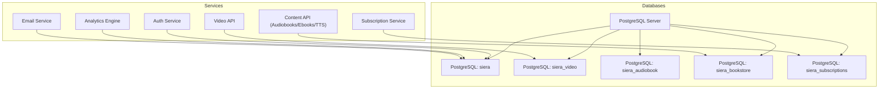
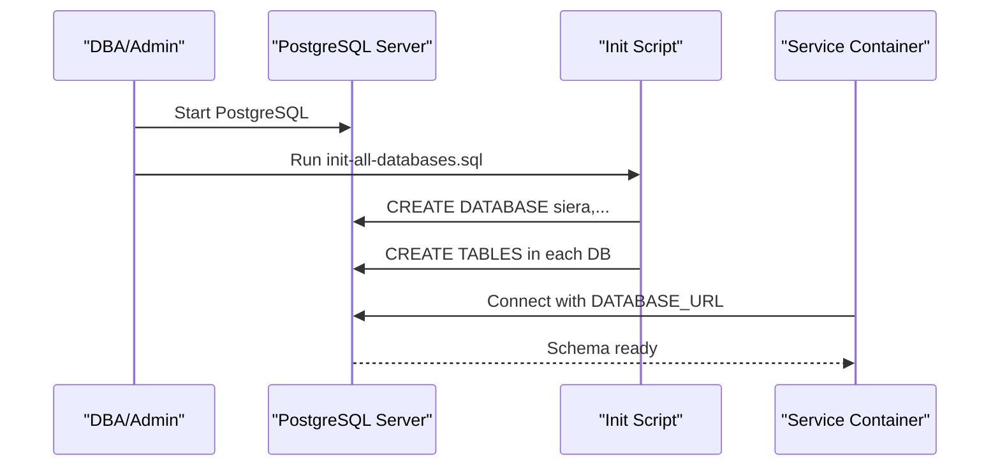
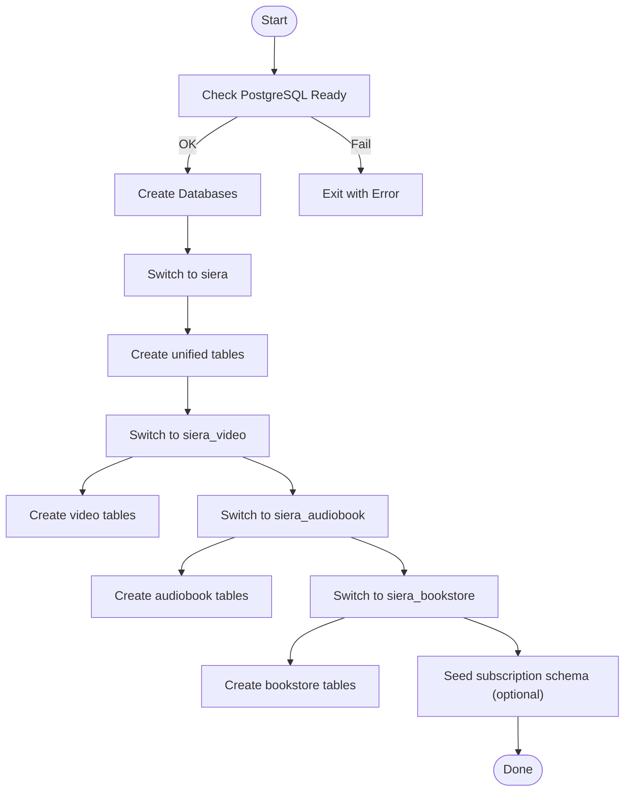
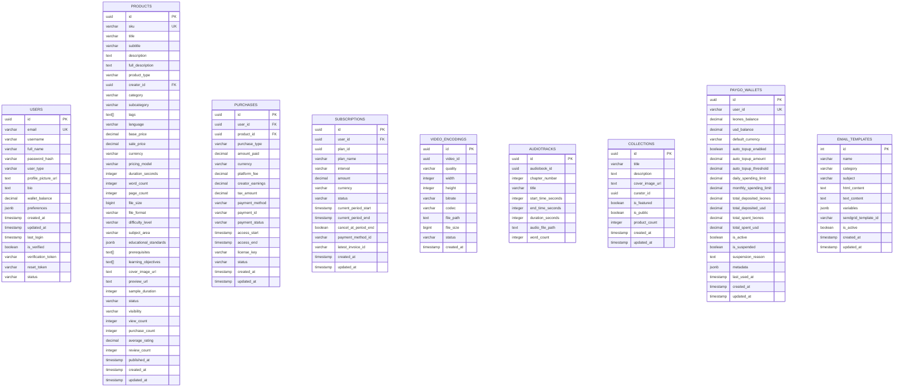
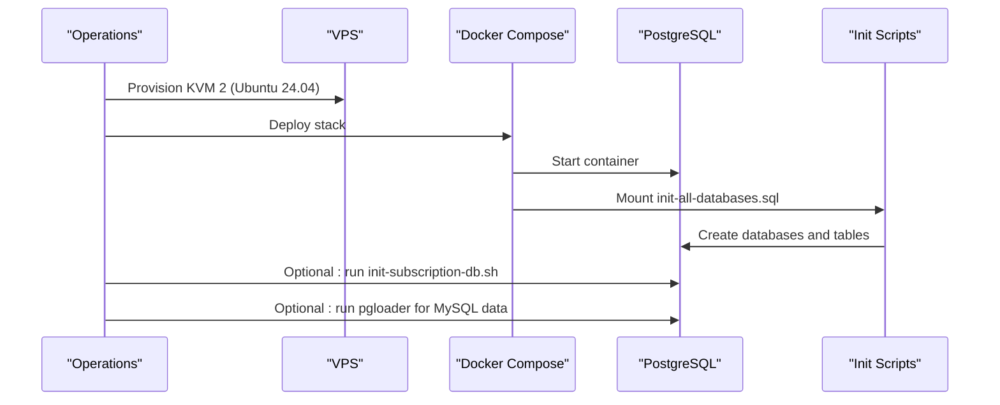
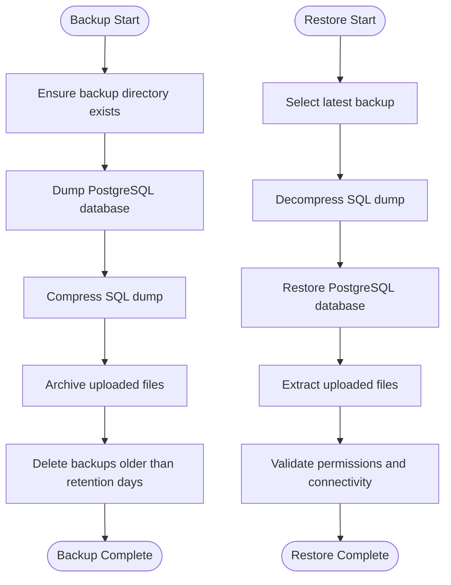
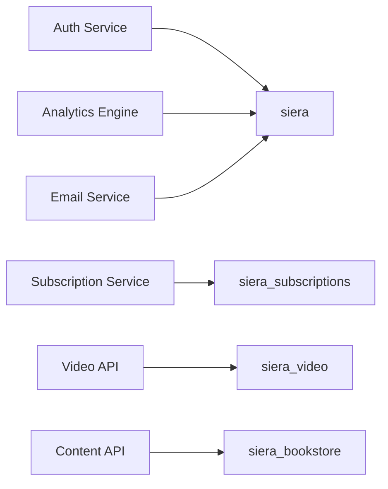

# Database Administration

<cite>
**Referenced Files in This Document**
- [init-all-databases.sql](file://database/init-all-databases.sql)
- [init-subscription-db.sh](file://database/init-subscription-db.sh)
- [subscription-schema.sql](file://database/subscription-schema.sql)
- [paygo-schema.sql](file://database/paygo-schema.sql)
- [video_jobs.sql](file://database/video_jobs.sql)
- [voice_profiles.sql](file://database/voice_profiles.sql)
- [educational_schema_update.sql](file://database/educational_schema_update.sql)
- [email-schema.sql](file://services/shared/database/email-schema.sql)
- [docker-compose.yml](file://infrastructure/docker-compose.yml)
- [backup.sh](file://infrastructure/vps-migration/scripts/backup.sh)
- [MIGRATION_GUIDE.md](file://infrastructure/vps-migration/MIGRATION_GUIDE.md)
- [init.sql](file://infrastructure/vps-migration/postgres/init.sql)
</cite>

## Table of Contents
1. [Introduction](#introduction)
2. [Project Structure](#project-structure)
3. [Core Components](#core-components)
4. [Architecture Overview](#architecture-overview)
5. [Detailed Component Analysis](#detailed-component-analysis)
6. [Dependency Analysis](#dependency-analysis)
7. [Performance Considerations](#performance-considerations)
8. [Troubleshooting Guide](#troubleshooting-guide)
9. [Conclusion](#conclusion)
10. [Appendices](#appendices)

## Introduction
This document provides comprehensive database administration guidance for QuantumMint Bookstore. It covers database initialization, schema management, migration procedures, backup and restore strategies, disaster recovery planning, monitoring and performance tuning, security and access control, multi-database architecture with domain-specific schemas, maintenance procedures, index optimization, and troubleshooting.

## Project Structure
QuantumMint operates a multi-database architecture with dedicated schemas for unified services, video platform, audiobook platform, bookstore, subscription management, and email. Initialization scripts and Docker orchestration define how databases are provisioned and connected to services.

**Diagram sources**
- [docker-compose.yml:257-269](file://infrastructure/docker-compose.yml#L257-L269)
- [docker-compose.yml:75-99](file://infrastructure/docker-compose.yml#L75-L99)
- [docker-compose.yml:120-122](file://infrastructure/docker-compose.yml#L120-L122)
- [docker-compose.yml:171-172](file://infrastructure/docker-compose.yml#L171-L172)

**Section sources**
- [docker-compose.yml:257-269](file://infrastructure/docker-compose.yml#L257-L269)
- [docker-compose.yml:75-99](file://infrastructure/docker-compose.yml#L75-L99)
- [docker-compose.yml:120-122](file://infrastructure/docker-compose.yml#L120-L122)
- [docker-compose.yml:171-172](file://infrastructure/docker-compose.yml#L171-L172)

## Core Components
- Unified database (siera): central user, product, purchase, subscription, and engagement tables for cross-domain insights.
- Video database (siera_video): video encodings, processing jobs, and storage usage.
- Audiobook database (siera_audiobook): chapters, scientific explanations, and formula explanations.
- Bookstore database (siera_bookstore): collections, recommendations, and content curation.
- Subscription database (siera_subscriptions): plans, invoices, coupons, usage logs, analytics, and webhook events.
- PayGo database (paygo-schema.sql): wallets, transactions, sessions, and rate cards for pay-per-minute access.
- Educational schema (educational_schema_update.sql): categories, pages, media cues, reading progress, reviews, achievements, and analytics.
- Email schema (email-schema.sql): templates, campaigns, logs, preferences, alerts, queues, and metrics.
- Orchestration (docker-compose.yml): defines database provisioning, connection strings, and service dependencies.
- Initialization (init-all-databases.sql): creates all databases and tables in a single run.
- Subscription init (init-subscription-db.sh): standalone script to create and seed the subscription database.
- Backup automation (backup.sh): automated daily backups for PostgreSQL and uploaded files.
- Migration guide (MIGRATION_GUIDE.md): VPS migration steps and rollback plan.

**Section sources**
- [init-all-databases.sql:1-470](file://database/init-all-databases.sql#L1-L470)
- [subscription-schema.sql:1-644](file://database/subscription-schema.sql#L1-L644)
- [paygo-schema.sql:1-371](file://database/paygo-schema.sql#L1-L371)
- [video_jobs.sql:1-53](file://database/video_jobs.sql#L1-L53)
- [voice_profiles.sql:1-38](file://database/voice_profiles.sql#L1-L38)
- [educational_schema_update.sql:1-188](file://database/educational_schema_update.sql#L1-L188)
- [email-schema.sql:1-213](file://services/shared/database/email-schema.sql#L1-L213)
- [docker-compose.yml:257-269](file://infrastructure/docker-compose.yml#L257-L269)
- [init-subscription-db.sh:1-46](file://database/init-subscription-db.sh#L1-L46)
- [backup.sh:1-19](file://infrastructure/vps-migration/scripts/backup.sh#L1-L19)
- [MIGRATION_GUIDE.md:1-118](file://infrastructure/vps-migration/MIGRATION_GUIDE.md#L1-L118)

## Architecture Overview
The system uses PostgreSQL with multiple logical databases, each mapped to a domain-specific schema. Services connect using environment variables and Docker networking. Initialization scripts populate schemas during first boot.

**Diagram sources**
- [docker-compose.yml:257-269](file://infrastructure/docker-compose.yml#L257-L269)
- [init-all-databases.sql:1-470](file://database/init-all-databases.sql#L1-L470)

**Section sources**
- [docker-compose.yml:257-269](file://infrastructure/docker-compose.yml#L257-L269)
- [init-all-databases.sql:1-470](file://database/init-all-databases.sql#L1-L470)

## Detailed Component Analysis

### Database Initialization and Schema Management
- Multi-database creation and schema bootstrap are performed by a single SQL script that connects to each target database and creates domain-specific tables.
- The subscription database can also be initialized independently via a shell script that checks connectivity, creates the database if missing, and executes the subscription schema.
- Educational schema updates augment existing tables with columns and add new tables for immersive learning experiences.

**Diagram sources**
- [init-all-databases.sql:1-470](file://database/init-all-databases.sql#L1-L470)
- [init-subscription-db.sh:1-46](file://database/init-subscription-db.sh#L1-L46)

**Section sources**
- [init-all-databases.sql:1-470](file://database/init-all-databases.sql#L1-L470)
- [init-subscription-db.sh:1-46](file://database/init-subscription-db.sh#L1-L46)
- [educational_schema_update.sql:1-188](file://database/educational_schema_update.sql#L1-L188)

### Multi-Database Architecture and Domain Schemas
- siera: unified users, products, purchases, subscriptions, consumption history, reviews, wishlists, cart, notifications.
- siera_video: video encodings, processing jobs, storage usage.
- siera_audiobook: chapters, scientific explanations, formula explanations.
- siera_bookstore: collections, collection items, recommendations.
- siera_subscriptions: plans, user subscriptions, usage logs, invoices, coupons, events, access logs, analytics.
- PayGo: wallets, transactions, sessions, rate cards, utility functions.
- Educational: categories, pages, media cues, reading progress, reviews, achievements, analytics.
- Email: templates, campaigns, logs, preferences, alerts, queues, metrics.

**Diagram sources**
- [init-all-databases.sql:11-470](file://database/init-all-databases.sql#L11-L470)
- [video_jobs.sql:4-19](file://database/video_jobs.sql#L4-L19)
- [voice_profiles.sql:3-31](file://database/voice_profiles.sql#L3-L31)
- [subscription-schema.sql:20-123](file://database/subscription-schema.sql#L20-L123)
- [paygo-schema.sql:8-43](file://database/paygo-schema.sql#L8-L43)
- [email-schema.sql:5-17](file://services/shared/database/email-schema.sql#L5-L17)

**Section sources**
- [init-all-databases.sql:11-470](file://database/init-all-databases.sql#L11-L470)
- [subscription-schema.sql:20-123](file://database/subscription-schema.sql#L20-L123)
- [paygo-schema.sql:8-43](file://database/paygo-schema.sql#L8-L43)
- [video_jobs.sql:4-19](file://database/video_jobs.sql#L4-L19)
- [voice_profiles.sql:3-31](file://database/voice_profiles.sql#L3-L31)
- [email-schema.sql:5-17](file://services/shared/database/email-schema.sql#L5-L17)

### Migration Procedures
- Local to VPS: Use the migration guide to provision a VPS, set environment variables, and deploy with Docker Compose. The init.sql script provisions optimized tables for the educational platform and sets up full-text search and triggers.
- Data migration: Use tools like pgloader to migrate from MySQL to PostgreSQL after containers are running.
- Subscription schema: Use the dedicated init script to create and seed the subscription database independently.

**Diagram sources**
- [MIGRATION_GUIDE.md:74-86](file://infrastructure/vps-migration/MIGRATION_GUIDE.md#L74-L86)
- [docker-compose.yml:257-269](file://infrastructure/docker-compose.yml#L257-L269)
- [init-all-databases.sql:1-470](file://database/init-all-databases.sql#L1-L470)
- [init-subscription-db.sh:1-46](file://database/init-subscription-db.sh#L1-L46)

**Section sources**
- [MIGRATION_GUIDE.md:74-86](file://infrastructure/vps-migration/MIGRATION_GUIDE.md#L74-L86)
- [docker-compose.yml:257-269](file://infrastructure/docker-compose.yml#L257-L269)
- [init-all-databases.sql:1-470](file://database/init-all-databases.sql#L1-L470)
- [init-subscription-db.sh:1-46](file://database/init-subscription-db.sh#L1-L46)

### Backup Strategies and Restore Procedures
- Automated backups: A backup script compresses PostgreSQL dumps and archives uploaded files, retaining backups for a specified retention period.
- Restore procedure: Restore the latest compressed dump and extract uploaded files to their respective paths. Validate connectivity and permissions before restoring.

**Diagram sources**
- [backup.sh:1-19](file://infrastructure/vps-migration/scripts/backup.sh#L1-L19)

**Section sources**
- [backup.sh:1-19](file://infrastructure/vps-migration/scripts/backup.sh#L1-L19)

### Disaster Recovery Planning
- Keep the old hosting active for a grace period to facilitate rollback.
- Maintain DNS records pointing to the previous host during rollback.
- Schedule automated backups and test periodic restores to ensure recoverability.

**Section sources**
- [MIGRATION_GUIDE.md:105-108](file://infrastructure/vps-migration/MIGRATION_GUIDE.md#L105-L108)

### Monitoring, Performance Tuning, and Capacity Planning
- Monitoring stack: Grafana is included in the Docker Compose configuration for visualization.
- Indexing: The educational init script adds full-text search indexes and performance-critical indexes for users, books, chapters, and usage logs.
- Triggers: A generic function updates timestamps for tables to maintain audit trails.
- Capacity planning: Plan disk space for video/audio assets and configure volume mounts accordingly.

**Section sources**
- [docker-compose.yml:335-346](file://infrastructure/docker-compose.yml#L335-L346)
- [init.sql:34-88](file://infrastructure/vps-migration/postgres/init.sql#L34-L88)

### Security Measures, Access Control, and Audit Logging
- Database roles and credentials: Use strong passwords and rotate secrets regularly. Restrict network exposure to internal Docker networks.
- Access control: Services connect using DATABASE_URL environment variables; avoid exposing credentials in logs.
- Audit logging: Triggers update timestamps; consider adding row-level security policies and audit tables for sensitive operations.

**Section sources**
- [docker-compose.yml:75-99](file://infrastructure/docker-compose.yml#L75-L99)
- [docker-compose.yml:120-122](file://infrastructure/docker-compose.yml#L120-L122)
- [docker-compose.yml:171-172](file://infrastructure/docker-compose.yml#L171-L172)

### Maintenance Procedures, Index Optimization, and Health Monitoring
- Routine maintenance: Vacuum and analyze periodically; schedule reindexing for frequently scanned columns.
- Index optimization: Use composite indexes on commonly filtered columns (e.g., user_id, status, created_at).
- Health monitoring: Use the provided healthcheck script and integrate with monitoring dashboards.

**Section sources**
- [video_jobs.sql:21-24](file://database/video_jobs.sql#L21-L24)
- [init.sql:67-70](file://infrastructure/vps-migration/postgres/init.sql#L67-L70)
- [MIGRATION_GUIDE.md:97-99](file://infrastructure/vps-migration/MIGRATION_GUIDE.md#L97-L99)

### Troubleshooting Guides
- PostgreSQL not ready: Ensure the database service is healthy and reachable before running initialization scripts.
- Schema conflicts: Drop and recreate databases only in controlled environments; use migrations for production.
- Backup failures: Verify backup directory permissions and retention settings; confirm compression availability.

**Section sources**
- [init-subscription-db.sh:16-21](file://database/init-subscription-db.sh#L16-L21)
- [backup.sh:15-16](file://infrastructure/vps-migration/scripts/backup.sh#L15-L16)

## Dependency Analysis
The services depend on specific databases via environment variables. The orchestration file defines these connections and ensures services start after the database is ready.

**Diagram sources**
- [docker-compose.yml:75-99](file://infrastructure/docker-compose.yml#L75-L99)
- [docker-compose.yml:120-122](file://infrastructure/docker-compose.yml#L120-L122)
- [docker-compose.yml:171-172](file://infrastructure/docker-compose.yml#L171-L172)

**Section sources**
- [docker-compose.yml:75-99](file://infrastructure/docker-compose.yml#L75-L99)
- [docker-compose.yml:120-122](file://infrastructure/docker-compose.yml#L120-L122)
- [docker-compose.yml:171-172](file://infrastructure/docker-compose.yml#L171-L172)

## Performance Considerations
- Use appropriate indexes on join and filter columns.
- Normalize data to reduce redundancy while denormalizing for reporting (e.g., analytics tables).
- Monitor slow queries and optimize with EXPLAIN/EXPLAIN ANALYZE.
- Scale horizontally by adding replicas for read-heavy workloads.

## Troubleshooting Guide
- Initialization fails: Confirm PostgreSQL readiness and correct credentials in environment variables.
- Schema mismatch: Ensure the correct initialization script is applied to the intended database.
- Backup/restore issues: Validate file permissions and compression tools availability.

**Section sources**
- [init-subscription-db.sh:16-21](file://database/init-subscription-db.sh#L16-L21)
- [backup.sh:15-16](file://infrastructure/vps-migration/scripts/backup.sh#L15-L16)

## Conclusion
QuantumMint’s database administration relies on a multi-database, domain-driven schema design with robust initialization, migration, backup, and monitoring practices. Adhering to the outlined procedures ensures reliable operations, scalability, and resilience.

## Appendices
- Appendix A: Connection strings and service mappings are defined in the orchestration file.
- Appendix B: Subscription schema seeding and utility functions are defined in the subscription schema file.
- Appendix C: Educational schema updates include indexes and sample data for categories and achievements.

**Section sources**
- [docker-compose.yml:257-269](file://infrastructure/docker-compose.yml#L257-L269)
- [subscription-schema.sql:424-644](file://database/subscription-schema.sql#L424-L644)
- [educational_schema_update.sql:163-188](file://database/educational_schema_update.sql#L163-L188)