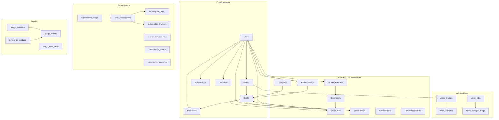
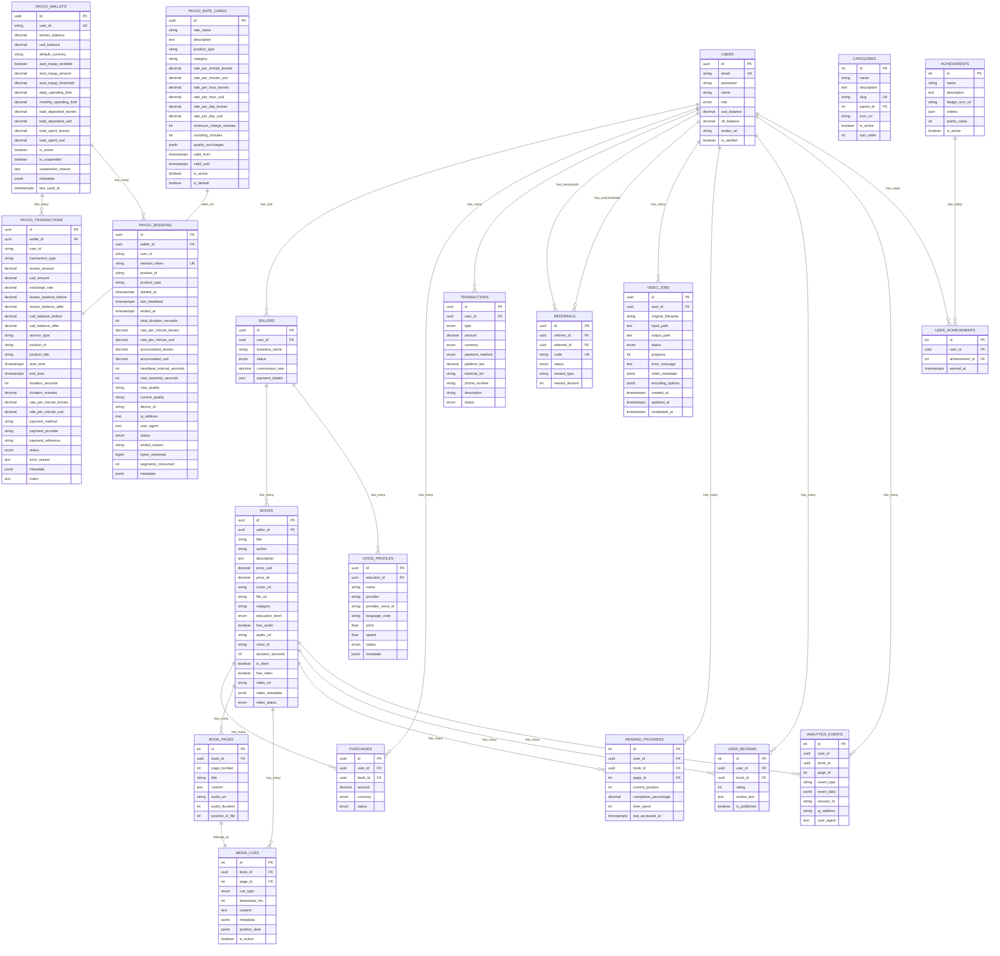
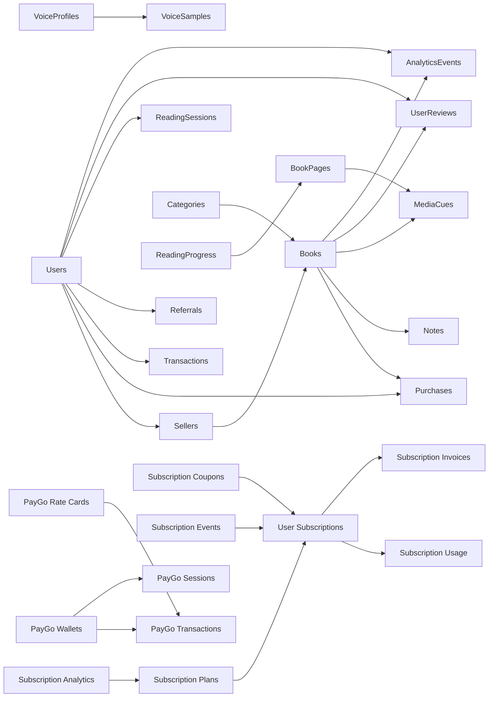

# Database Design

<cite>
**Referenced Files in This Document**
- [schema.sql](file://backend/schema.sql)
- [init-all-databases.sql](file://database/init-all-databases.sql)
- [paygo-schema.sql](file://database/paygo-schema.sql)
- [subscription-schema.sql](file://database/subscription-schema.sql)
- [voice_profiles.sql](file://database/voice_profiles.sql)
- [video_jobs.sql](file://database/video_jobs.sql)
- [educational_schema_update.sql](file://database/educational_schema_update.sql)
- [models/index.js](file://backend/models/index.js)
- [User.js](file://backend/models/User.js)
- [Book.js](file://backend/models/Book.js)
- [Purchase.js](file://backend/models/Purchase.js)
- [Transaction.js](file://backend/models/Transaction.js)
- [Seller.js](file://backend/models/Seller.js)
- [Subscription.js](file://backend/models/Subscription.js)
- [ReadingSession.js](file://backend/models/ReadingSession.js)
- [VoiceProfile.js](file://backend/models/VoiceProfile.js)
- [Formula.js](file://backend/models/Formulas.js)
- [MediaCue.js](file://backend/models/MediaCue.js)
- [Note.js](file://backend/models/Note.js)
</cite>

## Table of Contents
1. [Introduction](#introduction)
2. [Project Structure](#project-structure)
3. [Core Components](#core-components)
4. [Architecture Overview](#architecture-overview)
5. [Detailed Component Analysis](#detailed-component-analysis)
6. [Dependency Analysis](#dependency-analysis)
7. [Performance Considerations](#performance-considerations)
8. [Troubleshooting Guide](#troubleshooting-guide)
9. [Conclusion](#conclusion)
10. [Appendices](#appendices)

## Introduction
This document provides comprehensive data model documentation for the QuantumMint Bookstore database design. It covers entity relationship diagrams, field definitions, data types, constraints, indexes, and relationships across multiple domains: core bookstore operations, subscriptions, pay-per-minute (PayGo) usage, voice profiles, educational enhancements, and media synchronization. It also documents validation rules, referential integrity, schema evolution strategies, migration patterns, data lifecycle management, access patterns, caching strategies, performance optimization, security measures, backup, and disaster recovery planning.

## Project Structure
The database design spans multiple SQL initialization and schema update scripts, plus Sequelize models that define entities and associations in the backend. The key schema sources are:
- Core bookstore schema: [schema.sql](file://backend/schema.sql)
- Unified platform schema (PostgreSQL): [init-all-databases.sql](file://database/init-all-databases.sql)
- Pay-per-minute (PayGo) schema: [paygo-schema.sql](file://database/paygo-schema.sql)
- Subscription schema: [subscription-schema.sql](file://database/subscription-schema.sql)
- Voice profiles schema: [voice_profiles.sql](file://database/voice_profiles.sql)
- Video jobs schema: [video_jobs.sql](file://database/video_jobs.sql)
- Educational platform updates: [educational_schema_update.sql](file://database/educational_schema_update.sql)
- Backend model associations: [models/index.js](file://backend/models/index.js)

**Diagram sources**
- [schema.sql:7-132](file://backend/schema.sql#L7-L132)
- [init-all-databases.sql:11-470](file://database/init-all-databases.sql#L11-L470)
- [paygo-schema.sql:7-371](file://database/paygo-schema.sql#L7-L371)
- [subscription-schema.sql:18-644](file://database/subscription-schema.sql#L18-L644)
- [voice_profiles.sql:3-38](file://database/voice_profiles.sql#L3-L38)
- [video_jobs.sql:4-53](file://database/video_jobs.sql#L4-L53)
- [educational_schema_update.sql:6-188](file://database/educational_schema_update.sql#L6-L188)

**Section sources**
- [schema.sql:1-132](file://backend/schema.sql#L1-L132)
- [init-all-databases.sql:1-470](file://database/init-all-databases.sql#L1-L470)
- [paygo-schema.sql:1-371](file://database/paygo-schema.sql#L1-L371)
- [subscription-schema.sql:1-644](file://database/subscription-schema.sql#L1-L644)
- [voice_profiles.sql:1-38](file://database/voice_profiles.sql#L1-L38)
- [video_jobs.sql:1-53](file://database/video_jobs.sql#L1-L53)
- [educational_schema_update.sql:1-188](file://database/educational_schema_update.sql#L1-L188)

## Core Components
This section defines the primary entities and their attributes, constraints, and indexes. It consolidates the core bookstore, unified platform, PayGo, subscription, voice, video, and educational schemas.

- Users
  - Purpose: Authentication, roles, balances, verification, and metadata.
  - Primary key: id (UUID)
  - Constraints: email unique; role enum; balances default zero; verification flag.
  - Indexes: none declared in core schema; consider adding indexes on email and status for auth/search.
  - Related to: Sellers (1:1), Purchases (1:N), Transactions (1:N), Referrals (sent/received), ReadingSessions (1:N), Notes (1:N), VoiceProfiles (1:N via educatorId), AuditLogs (1:N).

- Sellers
  - Purpose: Monetization and commission tracking.
  - Primary key: id (UUID); Foreign key: userId -> Users(id) cascade delete.
  - Constraints: status enum; commission default 10%; JSON payment details.
  - Indexes: none declared; consider unique(userId) and status.

- Books
  - Purpose: Product catalog with pricing, metadata, STEM flags, and media URLs.
  - Primary key: id (UUID); Foreign key: sellerId -> Sellers(id) set null on delete.
  - Constraints: educationLevel enum; dual-currency pricing; optional STEM/video/audio flags.
  - Indexes: none declared; consider category, educationLevel, and fileUrl.

- Purchases
  - Purpose: One-time transactions linking users and books.
  - Primary key: id (UUID); Foreign keys: userId -> Users(id), bookId -> Books(id) both cascade delete.
  - Constraints: currency enum; status enum; amount decimal.
  - Indexes: none declared; consider (userId, createdAt), (bookId, status).

- Transactions
  - Purpose: Wallet activity (deposits, purchases, withdrawals, bonuses, gifts).
  - Primary key: id (UUID); Foreign key: userId -> Users(id) cascade delete.
  - Constraints: type enum; amount decimal; paymentMethod enum; status enum.
  - Indexes: none declared; consider (userId, createdAt), (userId, type).

- Referrals
  - Purpose: Tracking referral codes, rewards, and statuses.
  - Primary key: id (UUID); Foreign keys: referrerId -> Users(id), referredId -> Users(id) set null on delete.
  - Constraints: code unique; rewardType default reading_time; rewardAmount default 120.
  - Indexes: none declared; consider (code, status).

- subscription_plans
  - Purpose: Subscription tiers with access periods, pricing, limits, and features.
  - Primary key: id (UUID); computed access_duration_seconds via trigger.
  - Constraints: access_period_unit enum; billing_interval enum; allowed_product_types array; is_active, is_featured booleans.
  - Indexes: SKU, active, featured.

- user_subscriptions
  - Purpose: Active subscriptions per user with billing cycles, usage tracking, and limits.
  - Primary key: id (UUID); Foreign key: plan_id -> subscription_plans(id).
  - Constraints: status enum; trial flags; auto_renew; monthly counters; JSON metadata.
  - Indexes: user_id, status, period_end, plan_id.

- subscription_usage
  - Purpose: Track usage events (streams/downloads/views) with cost and bandwidth.
  - Primary key: id (UUID); Foreign key: subscription_id -> user_subscriptions(id) cascade delete.
  - Constraints: usage_type enum; timestamps; quality; device/IP/user-agent; cost/bandwidth.
  - Indexes: subscription_id, user_id, start_time, usage_type, product_id.

- subscription_invoices
  - Purpose: Invoices with amounts, taxes, discounts, and payment metadata.
  - Primary key: id (UUID); Foreign key: subscription_id -> user_subscriptions(id).
  - Constraints: invoice_number unique; status enum; billing address JSON; PDF/receipt URLs.
  - Indexes: user_id, subscription_id, status, invoice_number, period_start.

- subscription_coupons
  - Purpose: Discount codes with validity, restrictions, and redemption tracking.
  - Primary key: id (UUID); constraints: discount_type enum; validity dates; restriction arrays.
  - Indexes: code, active, valid_from, valid_until.

- subscription_events
  - Purpose: Webhook event storage with retry tracking.
  - Primary key: id (UUID); unique event_id; processed flag; provider/type indexing.
  - Indexes: event_type, provider, processed, created_at.

- subscription_analytics
  - Purpose: Pre-aggregated KPIs by date and plan.
  - Primary key: id (UUID); unique(date, plan_id); MRR/ARR, churn, usage metrics.
  - Indexes: date, plan_id.

- paygo_wallets
  - Purpose: Dual-currency prepaid wallets with limits and auto-top-up.
  - Primary key: id (UUID); unique(user_id); constraints: non-negative balances; limits; status booleans.
  - Indexes: user_id, is_active.

- paygo_transactions
  - Purpose: Deposit, charge, refund, adjustment records with balances and product linkage.
  - Primary key: id (UUID); Foreign key: wallet_id -> paygo_wallets(id) cascade delete.
  - Constraints: transaction_type enum; amounts; rate_per_minute; product linkage; status enum.
  - Indexes: user_id, wallet_id, transaction_type, created_at, product_id.

- paygo_sessions
  - Purpose: Real-time usage sessions with heartbeats, quality, and device info.
  - Primary key: id (UUID); unique session_token; Foreign key: wallet_id -> paygo_wallets(id) cascade delete.
  - Constraints: status enum; timing; rate; device info; streaming stats; metadata.
  - Indexes: user_id, session_token, status, status='active', started_at.

- paygo_rate_cards
  - Purpose: Content-type and category-specific rates with minimums and quality surcharges.
  - Primary key: id (UUID); constraints: rate per minute/hour/day; validity; is_active/is_default.
  - Indexes: is_active, product_type, is_default.

- voice_profiles
  - Purpose: Educator voice profiles with provider, language, and synthesis parameters.
  - Primary key: id (UUID); Foreign key: educator_id -> Users(id) cascade delete.
  - Constraints: provider, language_code, status enum; JSON metadata.
  - Indexes: none declared; consider (provider, status).

- voice_samples
  - Purpose: Audio samples linked to voice profiles with quality metrics.
  - Primary key: id (UUID); Foreign key: profile_id -> voice_profiles(id) cascade delete.
  - Constraints: storage provider, duration, sample_rate, channels, format, SNR, clipping detection.
  - Indexes: none declared; consider (profile_id).

- video_jobs
  - Purpose: Video processing pipeline with status, progress, and metadata.
  - Primary key: id (UUID); Foreign key: user_id -> Users(id).
  - Constraints: status enum; progress 0–100; JSONB metadata/options; timestamps.
  - Indexes: user_id, status, created_at desc; pending; metadata GIN.

- video_storage_usage
  - Purpose: Storage usage tracking per user/job for billing.
  - Primary key: id (UUID); Foreign key: video_job_id -> video_jobs(id) set null on delete.
  - Constraints: file_path, file_size, storage_type enum.
  - Indexes: user_id, created_at.

- Categories
  - Purpose: Hierarchical taxonomy for educational content.
  - Primary key: id (int auto-increment); Foreign key: parent_id -> Categories(id) set null on delete.
  - Constraints: slug unique; is_active; sort_order.
  - Indexes: slug, parent_id, is_active.

- BookPages
  - Purpose: Structured pages within books with audio and ordering.
  - Primary key: id (int auto-increment); Foreign key: book_id -> Books(id) cascade delete.
  - Constraints: unique(book_id, page_number); timestamps; audio metadata.
  - Indexes: book_id, page_number.

- MediaCues
  - Purpose: Synchronization cues (visual, formula, step, highlight) aligned to audio.
  - Primary key: id (int auto-increment); Foreign keys: book_id -> Books(id), page_id -> BookPages(id) cascade delete.
  - Constraints: cue_type enum; timestamp_ms; JSON metadata/position; is_active.
  - Indexes: book_id, page_id, timestamp_ms, cue_type, is_active.

- ReadingProgress
  - Purpose: Per-user progress tracking per page.
  - Primary key: id (int auto-increment); Foreign keys: user_id -> Users(id), book_id -> Books(id), page_id -> BookPages(id) cascade delete.
  - Constraints: unique(user_id, book_id, page_id); completion percentage; timestamps.
  - Indexes: user_id, book_id, completion_percentage.

- UserReviews
  - Purpose: Ratings and reviews with publication control.
  - Primary key: id (int auto-increment); Foreign keys: user_id -> Users(id), book_id -> Books(id) cascade delete.
  - Constraints: rating 1–5; is_published; unique(user_id, book_id); timestamps.
  - Indexes: user_id, book_id, rating, is_published.

- AnalyticsEvents
  - Purpose: Behavioral analytics events with session context.
  - Primary key: id (int auto-increment); optional user/book/page linkage; event_type; IP/user-agent; timestamps.
  - Indexes: user_id, book_id, event_type, session_id, created_at.

- Achievements and UserAchievements
  - Purpose: Gamification with criteria and earned timestamps.
  - Primary key: id (int auto-increment); Foreign key: achievement_id -> Achievements(id) cascade delete.
  - Constraints: unique(user_id, achievement_id); timestamps; criteria JSON.
  - Indexes: user_id, earned_at.

**Section sources**
- [schema.sql:7-132](file://backend/schema.sql#L7-L132)
- [init-all-databases.sql:11-470](file://database/init-all-databases.sql#L11-L470)
- [paygo-schema.sql:7-371](file://database/paygo-schema.sql#L7-L371)
- [subscription-schema.sql:18-644](file://database/subscription-schema.sql#L18-L644)
- [voice_profiles.sql:3-38](file://database/voice_profiles.sql#L3-L38)
- [video_jobs.sql:4-53](file://database/video_jobs.sql#L4-L53)
- [educational_schema_update.sql:6-188](file://database/educational_schema_update.sql#L6-L188)

## Architecture Overview
The database architecture integrates:
- Core bookstore domain (users, sellers, books, purchases, transactions, referrals)
- Unified platform domain (products, creators, purchases, subscriptions, consumption history, reviews, wishlists, cart, notifications)
- Pay-per-minute (PayGo) domain (wallets, transactions, sessions, rate cards)
- Voice and media domains (voice profiles, samples, video jobs, storage usage)
- Educational enhancement domain (categories, pages, cues, progress, reviews, analytics, achievements)

**Diagram sources**
- [schema.sql:7-132](file://backend/schema.sql#L7-L132)
- [init-all-databases.sql:11-470](file://database/init-all-databases.sql#L11-L470)
- [paygo-schema.sql:7-371](file://database/paygo-schema.sql#L7-L371)
- [voice_profiles.sql:3-38](file://database/voice_profiles.sql#L3-L38)
- [video_jobs.sql:4-53](file://database/video_jobs.sql#L4-L53)
- [educational_schema_update.sql:6-188](file://database/educational_schema_update.sql#L6-L188)

## Detailed Component Analysis

### Core Bookstore Entities
- Users
  - Data types: UUID primary key; STRING email unique; STRING password; STRING name; ENUM role; DECIMAL balances; STRING avatar; BOOLEAN isVerified.
  - Validation: email format enforced by Sequelize validator; role enum enforced by DB.
  - Indexes: none declared; consider email and status.
  - Referential integrity: cascade deletes for related entities.

- Sellers
  - Data types: UUID primary key; UUID userId FK; STRING businessName; ENUM status; DECIMAL commissionRate; JSON paymentDetails.
  - Validation: default pending; 10% commission default.
  - Indexes: none declared; consider unique(userId) and status.

- Books
  - Data types: UUID primary key; optional UUID sellerId FK; STRING title/author; TEXT description; DECIMAL priceUSD/priceSLL; STRING coverUrl/fileUrl; STRING category; ENUM educationLevel; flags for audio/video; JSONB videoMetadata; ENUM videoStatus.
  - Validation: educationLevel enum; dual pricing; STEM/video/audio flags.
  - Indexes: none declared; consider category, educationLevel.

- Purchases
  - Data types: UUID primary key; UUID userId FK; UUID bookId FK; DECIMAL amount; ENUM currency; ENUM status.
  - Validation: currency and status enums; amount non-negative.
  - Indexes: none declared; consider (userId, createdAt), (bookId, status).

- Transactions
  - Data types: UUID primary key; UUID userId FK; ENUM type; DECIMAL amount; ENUM currency; ENUM paymentMethod; DECIMAL platformFee; STRING externalRef/phoneNumber/description; ENUM status.
  - Validation: type and status enums; fee default zero.
  - Indexes: none declared; consider (userId, createdAt), (userId, type).

- Referrals
  - Data types: UUID primary key; UUID referrerId FK; optional UUID referredId FK; STRING code unique; ENUM status; STRING rewardType; INT rewardAmount.
  - Validation: code unique; default reward 120 minutes.
  - Indexes: none declared; consider (code, status).

**Section sources**
- [User.js:4-49](file://backend/models/User.js#L4-L49)
- [Seller.js:3-29](file://backend/models/Seller.js#L3-L29)
- [Book.js:3-91](file://backend/models/Book.js#L3-L91)
- [Purchase.js:3-25](file://backend/models/Purchase.js#L3-L25)
- [Transaction.js:3-53](file://backend/models/Transaction.js#L3-L53)
- [Referral.js:3-30](file://backend/models/Referral.js#L3-L30)
- [schema.sql:7-132](file://backend/schema.sql#L7-L132)

### Subscription Domain
- subscription_plans
  - Data types: UUID primary key; SKU unique; STRING name/description; ENUM access_period_unit; INT access_period_value; INT access_duration_seconds (computed); DECIMAL price_amount; ENUM billing_interval/recurring_interval; INT max_concurrent_streams/max_downloads/max_offline_devices; TEXT[] allowed_product_types/categories/excluded_categories; booleans is_active/is_featured/requires_approval/trial; INT trial_period_days; JSONB features/restrictions; timestamps.
  - Triggers: access_duration_seconds auto-computed based on unit/value.
  - Indexes: SKU, is_active, is_featured.

- user_subscriptions
  - Data types: UUID primary key; STRING user_id; UUID plan_id FK; ENUM status; timestamps for periods; booleans for trial/auto-renew; INT usage counters; JSONB metadata/notes; timestamps.
  - Indexes: user_id, status, period_end, plan_id.

- subscription_usage
  - Data types: UUID primary key; UUID subscription_id FK; STRING user_id; ENUM usage_type; STRING product_id/product_type/category; timestamps; INT duration_seconds; STRING quality/device_id/ip/user_agent; BIGINT data_transferred_bytes; DECIMAL estimated_cost; booleans completed/error_reason.
  - Indexes: subscription_id, user_id, start_time, usage_type, product_id.

- subscription_invoices
  - Data types: UUID primary key; UUID subscription_id FK; STRING user_id; STRING invoice_number unique; timestamps for period/due; DECIMAL subtotal/tax/total/discount; ENUM status; timestamps paid_at/payment metadata; JSONB billing_address/tax_id; TEXT invoice_pdf_url/hosted_invoice_url/receipt_number; JSONB metadata/notes.
  - Indexes: user_id, subscription_id, status, invoice_number, period_start.

- subscription_coupons
  - Data types: UUID primary key; STRING code unique; STRING name/description; ENUM discount_type; DECIMAL discount_value/discount_currency; timestamps valid_from/valid_until; INT max_redemptions/times_redeemed; UUID[] applies_to_plan_ids; DECIMAL min_subscription_amount/max_discount_amount; booleans once_per_customer/new_customers_only; booleans is_active.
  - Indexes: code, is_active, valid_from, valid_until.

- subscription_events
  - Data types: UUID primary key; STRING event_id unique; STRING event_type; STRING provider/provider_event_id; JSONB payload; booleans processed/processing_error/retry_count; timestamps created_at/processed_at.
  - Indexes: event_type, provider, processed, created_at.

- subscription_analytics
  - Data types: UUID primary key; DATE date; UUID plan_id FK; INT active_subscriptions/new_subscriptions/cancelled_subscriptions/churned_subscriptions/trial_conversions; DECIMAL mrr/arr/total_revenue; DECIMAL total_streaming_hours/average_streaming_hours; INT peak_concurrent_users/total_downloads; DECIMAL customer_acquisition_cost/lifetime_value/churn_rate; timestamps created_at/updated_at.
  - Indexes: date, plan_id; unique(date, plan_id).

**Section sources**
- [subscription-schema.sql:18-644](file://database/subscription-schema.sql#L18-L644)
- [models/index.js:59-61](file://backend/models/index.js#L59-L61)

### Pay-Per-Minute (PayGo) Domain
- paygo_wallets
  - Data types: UUID primary key; STRING user_id unique; DECIMAL leones/usd_balance (non-negative); STRING default_currency; booleans auto_topup_enabled; DECIMAL auto_topup_amount/auto_topup_threshold; DECIMAL daily/monthly spending limits; DECIMAL totals; booleans is_active/is_suspended; text suspension_reason; JSONB metadata; timestamptz last_used_at; timestamps.
  - Indexes: user_id, is_active.

- paygo_transactions
  - Data types: UUID primary key; UUID wallet_id FK; STRING user_id; STRING transaction_type (enum); DECIMAL leones/usd_amount; DECIMAL exchange_rate; DECIMAL balances before/after; STRING service_type/product_id/product_title; timestamps start/end/duration; DECIMAL duration_minutes/rate_per_minute; STRING payment_method/provider/reference; ENUM status; text error_reason; JSONB metadata/notes; timestamps.
  - Indexes: user_id, wallet_id, transaction_type, created_at, product_id.

- paygo_sessions
  - Data types: UUID primary key; UUID wallet_id FK; STRING user_id; STRING session_token unique; STRING product_id/product_type; timestamps started_at/last_heartbeat/ended_at/updated_at; INT total_duration_seconds; DECIMAL rate_per_minute_leones/usd; DECIMAL accumulated_leones/usd; INT heartbeat_interval_seconds/max_inactivity_seconds; STRING max_quality/current_quality; STRING device_id/ip_address/user_agent; ENUM status; STRING ended_reason; BIGINT bytes_streamed; INT segments_consumed; JSONB metadata.
  - Indexes: user_id, session_token, status, status='active', started_at.

- paygo_rate_cards
  - Data types: UUID primary key; STRING rate_name/description; STRING product_type/category; DECIMAL rate_per_minute_leones/usd; DECIMAL rate_per_hour_leones/usd; DECIMAL rate_per_day_leones/usd; INT minimum_charge_minutes/rounding_minutes; JSONB quality_surcharges; timestamps valid_from/valid_until; booleans is_active/is_default.
  - Indexes: is_active, product_type, is_default.

- Functions and Triggers
  - calculate_paygo_charge(duration_seconds, rate_per_minute_leones, rate_per_minute_usd, minimum_minutes): returns leones_charge, usd_charge, charged_minutes.
  - check_paygo_balance(user_id, required_leones, required_usd): returns has_sufficient_balance, current balances, required amounts, can_proceed.
  - update_updated_at triggers on paygo_wallets, paygo_sessions, paygo_rate_cards.

**Section sources**
- [paygo-schema.sql:7-371](file://database/paygo-schema.sql#L7-L371)

### Voice Profiles and Media Jobs
- voice_profiles
  - Data types: UUID primary key; UUID educator_id FK; FLOAT base_pitch_hz/spectral_tilt/formant_shift; STRING provider/provider_voice_id/language_code; INT sample_count/total_duration_seconds; ENUM status; timestamptz created_at/updated_at.
  - Indexes: none declared; consider (provider, status).

- voice_samples
  - Data types: UUID primary key; UUID profile_id FK; TEXT storage_path; STRING storage_provider; FLOAT duration_seconds/sample_rate; INT channels/format; STRING snr_db/clipping_detected; timestamptz created_at.
  - Indexes: none declared; consider (profile_id).

- video_jobs
  - Data types: UUID primary key; UUID user_id FK; STRING original_filename; TEXT input_path/output_path; ENUM status; INT progress (0–100); TEXT error_message; JSONB video_metadata/encoding_options; timestamptz timestamps.
  - Indexes: user_id, status, created_at desc; pending; metadata GIN.

- video_storage_usage
  - Data types: UUID primary key; UUID user_id; optional UUID video_job_id FK; TEXT file_path; BIGINT file_size; ENUM storage_type; timestamptz created_at.
  - Indexes: user_id, created_at.

**Section sources**
- [voice_profiles.sql:3-38](file://database/voice_profiles.sql#L3-L38)
- [video_jobs.sql:4-53](file://database/video_jobs.sql#L4-L53)

### Educational Enhancements
- Categories
  - Data types: INT primary key; STRING name/description/slug unique; optional INT parent_id FK; STRING icon_url; booleans is_active/sort_order; timestamps.
  - Indexes: slug, parent_id, is_active.

- BookPages
  - Data types: INT primary key; UUID book_id FK; INT page_number; STRING title; TEXT content; optional STRING audio_url; INT audio_duration/position_in_file; timestamps.
  - Indexes: book_id, page_number; unique(book_id, page_number).

- MediaCues
  - Data types: INT primary key; UUID book_id FK; INT page_id FK; ENUM cue_type; INT timestamp_ms; TEXT content; JSONB metadata/position_data; booleans is_active.
  - Indexes: book_id, page_id, timestamp_ms, cue_type, is_active.

- ReadingProgress
  - Data types: INT primary key; UUID user_id FK; UUID book_id FK; INT page_id FK; INT current_position; DECIMAL completion_percentage; INT time_spent; timestamptz last_accessed_at; timestamps.
  - Indexes: user_id, book_id, completion_percentage; unique(user_id, book_id, page_id).

- UserReviews
  - Data types: INT primary key; UUID user_id FK; UUID book_id FK; INT rating (1–5); TEXT review_text; booleans is_published; timestamps.
  - Indexes: user_id, book_id, rating, is_published; unique(user_id, book_id).

- AnalyticsEvents
  - Data types: INT primary key; optional UUID user_id; optional UUID book_id; optional INT page_id; STRING event_type; JSONB event_data; STRING session_id; STRING ip_address; TEXT user_agent; timestamps.
  - Indexes: user_id, book_id, event_type, session_id, created_at.

- Achievements and UserAchievements
  - Data types: INT primary key; STRING name/description/badge_icon_url; JSON criteria; INT points_value; booleans is_active; timestamps.
  - Data types: INT primary key; UUID user_id FK; INT achievement_id FK; timestamptz earned_at; timestamps.
  - Indexes: user_id, earned_at; unique(user_id, achievement_id).

**Section sources**
- [educational_schema_update.sql:6-188](file://database/educational_schema_update.sql#L6-L188)
- [MediaCue.js:3-48](file://backend/models/MediaCue.js#L3-L48)
- [ReadingSession.js:3-37](file://backend/models/ReadingSession.js#L3-L37)
- [Note.js:3-54](file://backend/models/Note.js#L3-L54)

### Backend Model Associations (Sequelize)
The backend models define associations that enforce referential integrity and simplify joins. Notable relationships include:
- User ↔ Purchase (hasMany/belongsTo)
- User ↔ RefundRequest (hasMany/belongsTo)
- Purchase ↔ RefundRequest (hasOne/belongsTo)
- User ↔ Subscription (hasMany/belongsTo)
- Book ↔ Purchase (hasMany/belongsTo)
- User ↔ Transaction (hasMany/belongsTo)
- User ↔ Seller (hasOne/belongsTo)
- Seller ↔ Book (hasMany/belongsTo)
- User ↔ Referral (hasMany/belongsTo as sent/received)
- Seller ↔ VoiceProfile (hasMany/belongsTo)
- Book ↔ Formula (hasMany/belongsTo)
- Formula ↔ FormulaToken (hasMany/belongsTo)
- Book ↔ NarrationSegment (hasMany/belongsTo)
- VoiceProfile ↔ NarrationSegment (hasMany/belongsTo)
- User ↔ LearnerInteraction (hasMany/belongsTo)
- Formula ↔ LearnerInteraction (hasMany/belongsTo)
- FormulaToken ↔ LearnerInteraction (hasMany/belongsTo)
- Book ↔ MediaCue (hasMany/belongsTo)
- User ↔ Note (hasMany/belongsTo)
- Book ↔ Note (hasMany/belongsTo)
- User ↔ ReadingSession (hasMany/belongsTo)
- Book ↔ ReadingSession (hasMany/belongsTo)
- Book ↔ Quiz (hasMany/belongsTo)
- User ↔ AuditLog (hasMany/belongsTo)

**Section sources**
- [models/index.js:45-167](file://backend/models/index.js#L45-L167)

## Dependency Analysis
- Internal dependencies
  - Core bookstore: Users → Sellers → Books → Purchases; Users → Transactions; Users → Referrals; Users → ReadingSessions; Books → Notes; Books → MediaCues; Users → UserReviews; Books → UserReviews; Users → AnalyticsEvents; Books → AnalyticsEvents; Categories → Books; BookPages → MediaCues; ReadingProgress → BookPages; UserAchievements → Achievements.
  - Subscriptions: subscription_plans ↔ user_subscriptions; user_subscriptions → subscription_usage; user_subscriptions → subscription_invoices; subscription_coupons ↔ user_subscriptions; subscription_events ↔ user_subscriptions; subscription_analytics.
  - PayGo: paygo_wallets ↔ paygo_transactions; paygo_wallets ↔ paygo_sessions; paygo_rate_cards ↔ paygo_transactions.
  - Voice: voice_profiles ↔ voice_samples.
  - Video: video_jobs ↔ video_storage_usage.

- External dependencies
  - Payment providers (Orange Money, Afrimoney, QMoney, Stripe) integrated via enums and external references.
  - Voice providers (Azure, ElevenLabs) integrated via provider fields.
  - Analytics and notifications via JSONB fields and separate tables.

**Diagram sources**
- [models/index.js:45-167](file://backend/models/index.js#L45-L167)
- [schema.sql:7-132](file://backend/schema.sql#L7-L132)
- [init-all-databases.sql:11-470](file://database/init-all-databases.sql#L11-L470)
- [paygo-schema.sql:7-371](file://database/paygo-schema.sql#L7-L371)
- [subscription-schema.sql:18-644](file://database/subscription-schema.sql#L18-L644)
- [voice_profiles.sql:3-38](file://database/voice_profiles.sql#L3-L38)
- [video_jobs.sql:4-53](file://database/video_jobs.sql#L4-L53)
- [educational_schema_update.sql:6-188](file://database/educational_schema_update.sql#L6-L188)

**Section sources**
- [models/index.js:45-167](file://backend/models/index.js#L45-L167)

## Performance Considerations
- Indexing strategy
  - Core: Add indexes on Users(email, status), Sellers(userId, status), Books(category, educationLevel), Purchases(userId, createdAt), Transactions(userId, createdAt), Referrals(code, status), PayGo wallets(user_id, is_active), PayGo sessions(user_id, status='active'), Video jobs(user_id, status, created_at desc), Analytics events(user_id, book_id, event_type).
  - Subscriptions: Ensure indexes on user_subscriptions(user_id, status, current_period_end), subscription_usage(subscription_id, start_time), subscription_invoices(user_id, status, period_start), subscription_events(event_type, provider, processed).
  - Education: Categories(slug, parent_id, is_active), BookPages(book_id, page_number), MediaCues(book_id, page_id, timestamp_ms), ReadingProgress(user_id, book_id, completion_percentage), UserReviews(user_id, book_id, rating).

- Query optimization
  - Use selective filters with ENUM checks and range scans on timestamps.
  - Prefer covering indexes for frequent reporting (e.g., subscription_analytics(date, plan_id)).
  - Batch writes for PayGo transactions and video jobs.

- Caching strategies
  - Cache frequently accessed subscription plans and rate cards.
  - Cache user wallet balances and recent transactions.
  - Cache video job status and metadata for player UI.

- Concurrency and locking
  - Use advisory locks for PayGo session creation and balance checks.
  - Partition analytics tables by date for large-scale reporting.

[No sources needed since this section provides general guidance]

## Troubleshooting Guide
- Common integrity violations
  - Unique violations: email in Users, SKU/code in subscription_plans/coupons/referrals; unique(book_id, page_number) in BookPages; unique(user_id, book_id, page_id) in ReadingProgress; unique(user_id, book_id) in UserReviews; unique(user_id, achievement_id) in UserAchievements.
  - Enum violations: role, currency, status, usage_type, payment_method, provider, storage_type, event_type, access_type, discount_type, invoice status, coupon status, analytics status.
  - FK violations: ensure referenced records exist before insert/update.

- PayGo troubleshooting
  - Insufficient balance: use check_paygo_balance function to validate balances before charging.
  - Charge calculation: use calculate_paygo_charge to apply minimum minutes and rounding.
  - Session cleanup: ensure heartbeats update last_heartbeat and sessions expire after max_inactivity_seconds.

- Subscription troubleshooting
  - Active subscription lookup: use get_active_subscription function to fetch current plan and remaining time.
  - Usage tracking: verify subscription_usage entries align with user_subscriptions and product IDs.

- Video jobs troubleshooting
  - Pending jobs: use indexes on status to identify queued/processing jobs.
  - Storage billing: reconcile video_storage_usage with job outputs.

**Section sources**
- [paygo-schema.sql:260-371](file://database/paygo-schema.sql#L260-L371)
- [subscription-schema.sql:606-631](file://database/subscription-schema.sql#L606-L631)
- [video_jobs.sql:21-53](file://database/video_jobs.sql#L21-L53)

## Conclusion
The QuantumMint Bookstore database design integrates a robust core bookstore domain with advanced capabilities for subscriptions, PayGo usage, voice synthesis, video processing, and immersive educational experiences. The schema enforces strong referential integrity, supports rich validations, and provides extensible indexes and pre-aggregated analytics. Migration patterns leverage triggers, seed data, and modular schema updates to evolve the platform safely. Performance and reliability are addressed through targeted indexing, caching, and operational safeguards.

[No sources needed since this section summarizes without analyzing specific files]

## Appendices

### Data Validation Rules and Business Constraints
- Enums and defaults
  - role (Users), currency (Purchases/Transactions), status (Purchases/Transactions/Referrals/PayGo Sessions), usage_type (Usage), payment_method (Transactions), provider (VoiceProfiles), storage_type (Video storage), event_type (Events), access_type (Access logs), discount_type (Coupons), invoice_status (Invoices), coupon_status (Coupons), analytics_status (Analytics).
- Numeric constraints
  - Decimal precision/scale for balances, fees, rates; non-negative checks for balances; progress 0–100; rating 1–5.
- Uniqueness
  - email (Users), SKU (subscription_plans), code (Referrals), user_id (PayGo wallets), session_token (PayGo sessions), product_id (PayGo rate cards), slug (Categories), unique composite keys for ReadingProgress, UserReviews, UserAchievements.

**Section sources**
- [User.js:14-28](file://backend/models/User.js#L14-L28)
- [Purchase.js:14-21](file://backend/models/Purchase.js#L14-L21)
- [Transaction.js:14-49](file://backend/models/Transaction.js#L14-L49)
- [Referral.js:10-26](file://backend/models/Referral.js#L10-L26)
- [Subscription.js:14-41](file://backend/models/Subscription.js#L14-L41)
- [ReadingSession.js:10-33](file://backend/models/ReadingSession.js#L10-L33)
- [VoiceProfile.js:18-45](file://backend/models/VoiceProfile.js#L18-L45)
- [schema.sql:10-132](file://backend/schema.sql#L10-L132)
- [subscription-schema.sql:20-644](file://database/subscription-schema.sql#L20-L644)
- [paygo-schema.sql:8-371](file://database/paygo-schema.sql#L8-L371)
- [voice_profiles.sql:3-38](file://database/voice_profiles.sql#L3-L38)
- [video_jobs.sql:4-53](file://database/video_jobs.sql#L4-L53)
- [educational_schema_update.sql:6-188](file://database/educational_schema_update.sql#L6-L188)

### Database Schema Evolution Strategies
- Incremental migrations
  - Use ALTER TABLE statements for small, safe changes (e.g., adding columns to Books).
  - Seed initial data for new entities (e.g., subscription_plans, coupons).
- Triggers and functions
  - Compute derived fields (e.g., access_duration_seconds) and update timestamps automatically.
- Modular schema files
  - Separate concerns: core bookstore, unified platform, PayGo, subscriptions, voice, video, education.
- Rollback-safe patterns
  - Preserve old indexes and constraints during updates; revert with ALTER TABLE ... DROP COLUMN IF EXISTS.

**Section sources**
- [educational_schema_update.sql:6-188](file://database/educational_schema_update.sql#L6-L188)
- [subscription-schema.sql:369-422](file://database/subscription-schema.sql#L369-L422)
- [paygo-schema.sql:348-371](file://database/paygo-schema.sql#L348-L371)

### Data Lifecycle Management
- Retention policies
  - Analytics: archive historical subscription_analytics by quarter/year.
  - Logs: retain subscription_access_logs and subscription_events for compliance windows.
  - Video: purge failed video_jobs and associated storage after retention.
- Archiving
  - Move inactive user_subscriptions to archive tables by status and period_end.
- Deletion
  - Cascade deletes for Users remove related Purchases, Transactions, Referrals, ReadingSessions, Notes, VoiceProfiles, and AuditLogs.

**Section sources**
- [subscription-schema.sql:290-324](file://database/subscription-schema.sql#L290-L324)
- [video_jobs.sql:4-53](file://database/video_jobs.sql#L4-L53)

### Data Access Patterns, Caching, and Performance
- Access patterns
  - User-centric: list purchases, transactions, subscriptions, reading sessions.
  - Product-centric: list books, pages, cues, reviews, analytics events.
  - Administrative: manage plans, coupons, invoices, access logs, analytics.
- Caching
  - Cache subscription_plans and paygo_rate_cards; cache user wallet balances and recent transactions; cache video job status and metadata.
- Performance
  - Use indexes on foreign keys and frequently filtered columns; partition analytics by date; batch inserts for PayGo transactions.

**Section sources**
- [subscription-schema.sql:18-644](file://database/subscription-schema.sql#L18-L644)
- [paygo-schema.sql:7-371](file://database/paygo-schema.sql#L7-L371)
- [video_jobs.sql:21-53](file://database/video_jobs.sql#L21-L53)

### Data Security Measures, Backup, and Disaster Recovery
- Security
  - Hash passwords; store sensitive payment data via provider APIs; encrypt stored audio/video assets; restrict access to audit logs and analytics.
- Backups
  - Full backups nightly; incremental logs hourly; store offsite; test restore procedures quarterly.
- DR
  - Multi-region replicas; automated failover; RPO/RTO targets; hot standby for PayGo and subscription services.

[No sources needed since this section provides general guidance]