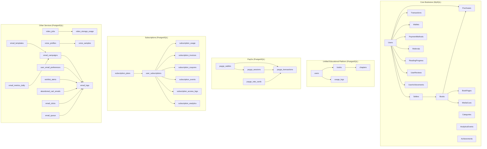
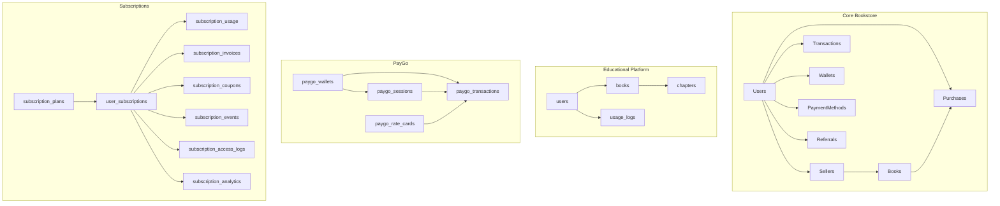
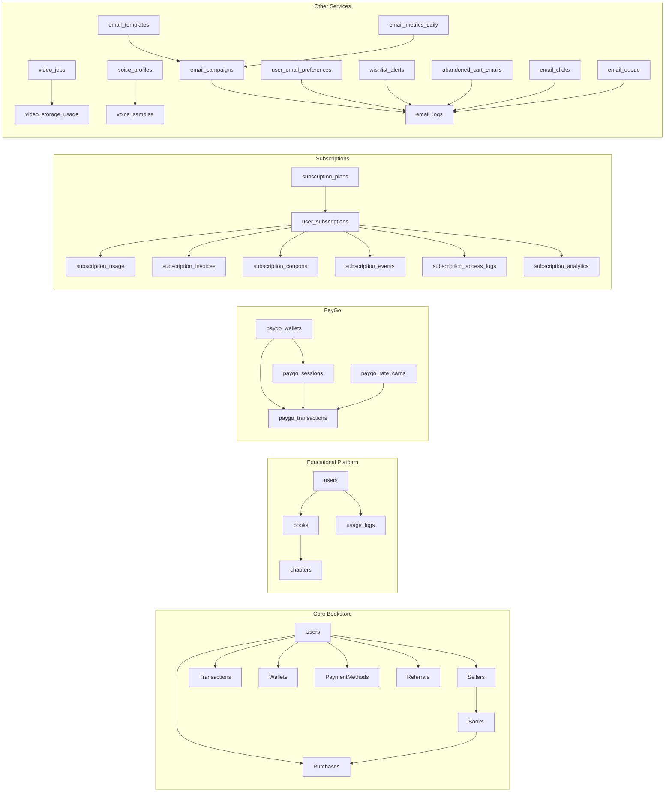

# Database Relationships and Constraints

<cite>
**Referenced Files in This Document**
- [schema.sql](file://backend/schema.sql)
- [educational_schema_update.sql](file://database/educational_schema_update.sql)
- [init-all-databases.sql](file://database/init-all-databases.sql)
- [paygo-schema.sql](file://database/paygo-schema.sql)
- [subscription-schema.sql](file://database/subscription-schema.sql)
- [video_jobs.sql](file://database/video_jobs.sql)
- [voice_profiles.sql](file://database/voice_profiles.sql)
- [init.sql](file://infrastructure/vps-migration/postgres/init.sql)
- [email-schema.sql](file://services/shared/database/email-schema.sql)
- [User.js](file://backend/models/User.js)
- [Book.js](file://backend/models/Book.js)
- [Purchase.js](file://backend/models/Purchase.js)
- [Seller.js](file://backend/models/Seller.js)
- [index.js](file://backend/models/index.js)
</cite>

## Table of Contents
1. [Introduction](#introduction)
2. [Project Structure](#project-structure)
3. [Core Components](#core-components)
4. [Architecture Overview](#architecture-overview)
5. [Detailed Component Analysis](#detailed-component-analysis)
6. [Dependency Analysis](#dependency-analysis)
7. [Performance Considerations](#performance-considerations)
8. [Troubleshooting Guide](#troubleshooting-guide)
9. [Conclusion](#conclusion)
10. [Appendices](#appendices)

## Introduction
This document provides a comprehensive analysis of database relationships and constraints in QuantumMint Bookstore. It documents primary keys, foreign keys, unique constraints, check constraints, referential integrity rules, cascade behaviors, and constraint validation. It also outlines schema evolution strategies, migration patterns, indexing approaches, performance implications, and query optimization techniques. Practical examples of complex joins and relationship queries are included to guide developers and analysts.

## Project Structure
QuantumMint Bookstore maintains multiple related schemas across domains:
- Core bookstore schema (MySQL-style identifiers and enums)
- Unified educational platform schema (PostgreSQL UUIDs, JSONB, GIN indices)
- Pay-per-minute (PayGo) schema (PostgreSQL)
- Subscription schema (PostgreSQL)
- Video processing and voice profiles schemas (PostgreSQL)
- Email system schema (PostgreSQL/MySQL compatible)
- VPS migration bootstrap (PostgreSQL)

**Diagram sources**
- [schema.sql:8-132](file://backend/schema.sql#L8-L132)
- [educational_schema_update.sql:19-188](file://database/educational_schema_update.sql#L19-L188)
- [init-all-databases.sql:11-470](file://database/init-all-databases.sql#L11-L470)
- [paygo-schema.sql:7-371](file://database/paygo-schema.sql#L7-L371)
- [subscription-schema.sql:17-644](file://database/subscription-schema.sql#L17-L644)
- [video_jobs.sql:4-53](file://database/video_jobs.sql#L4-L53)
- [voice_profiles.sql:3-38](file://database/voice_profiles.sql#L3-L38)
- [email-schema.sql:4-213](file://services/shared/database/email-schema.sql#L4-L213)
- [init.sql:6-88](file://infrastructure/vps-migration/postgres/init.sql#L6-L88)

**Section sources**
- [schema.sql:1-132](file://backend/schema.sql#L1-L132)
- [educational_schema_update.sql:1-188](file://database/educational_schema_update.sql#L1-L188)
- [init-all-databases.sql:1-470](file://database/init-all-databases.sql#L1-L470)
- [paygo-schema.sql:1-371](file://database/paygo-schema.sql#L1-L371)
- [subscription-schema.sql:1-644](file://database/subscription-schema.sql#L1-L644)
- [video_jobs.sql:1-53](file://database/video_jobs.sql#L1-L53)
- [voice_profiles.sql:1-38](file://database/voice_profiles.sql#L1-L38)
- [email-schema.sql:1-213](file://services/shared/database/email-schema.sql#L1-L213)
- [init.sql:1-88](file://infrastructure/vps-migration/postgres/init.sql#L1-L88)

## Core Components
This section catalogs primary keys, foreign keys, unique constraints, and check constraints for major tables across schemas.

- Core Bookstore (MySQL-style)
  - Users: id (PK), email (UNIQUE), role, balance, timestamps
  - Sellers: id (PK), userId (FK Users.id, ON DELETE CASCADE)
  - Books: id (PK), sellerId (FK Sellers.id, ON DELETE SET NULL)
  - Purchases: id (PK), userId (FK Users.id, ON DELETE CASCADE), bookId (FK Books.id, ON DELETE CASCADE)
  - Transactions: id (PK), userId (FK Users.id, ON DELETE CASCADE)
  - Wallets: id (PK), userId (UNIQUE FK Users.id, ON DELETE CASCADE)
  - PaymentMethods: id (PK), userId (FK Users.id, ON DELETE CASCADE), unique(userId, type)
  - Referrals: id (PK), referrerId (FK Users.id, ON DELETE CASCADE), referredId (FK Users.id, ON DELETE SET NULL), code (UNIQUE)
  - Categories: id (PK), slug (UNIQUE), parent_id (FK Categories.id, ON DELETE SET NULL)
  - BookPages: id (PK), unique(book_id, page_number), indexes(book_id, page_number)
  - MediaCues: id (PK), unique(book_id, page_id), indexes(book_id, page_id, timestamp_ms, cue_type)
  - ReadingProgress: id (PK), unique(user_id, book_id, page_id), indexes(user_id, book_id, completion_percentage)
  - UserReviews: id (PK), unique(user_id, book_id), rating CHECK(1..5), indexes(user_id, book_id, rating)
  - AnalyticsEvents: id (PK), indexes(user_id, book_id, event_type, session_id, created_at)
  - Achievements: id (PK), indexes(active)
  - UserAchievements: id (PK), unique(user_id, achievement_id), indexes(user_id, earned_at)

- Unified Educational Platform (PostgreSQL)
  - users: id (PK), email (UNIQUE), role CHECK, timestamps
  - books: id (PK), creator_id (FK users.id, ON DELETE CASCADE), slug (UNIQUE), status CHECK, indexes(title_trgm, search)
  - chapters: id (PK), book_id (FK books.id, ON DELETE CASCADE), unique(book_id, chapter_number), indexes(book_id, audio_url)
  - usage_logs: id (PK), user_id (FK users.id, ON DELETE CASCADE), service CHECK, indexes(user_id, service, created_at)

- PayGo (PostgreSQL)
  - paygo_wallets: id (PK), user_id (UNIQUE), balances CHECK(greater than or equal to zero), limits, indexes(user_id, is_active)
  - paygo_transactions: id (PK), wallet_id (FK paygo_wallets.id, ON DELETE CASCADE), transaction_type CHECK, indexes(user_id, wallet_id, type, created_at, product_id)
  - paygo_sessions: id (PK), wallet_id (FK paygo_wallets.id, ON DELETE CASCADE), session_token (UNIQUE), status CHECK, indexes(user_id, session_token, status, status='active', started_at)
  - paygo_rate_cards: id (PK), product_type CHECK, indexes(is_active, product_type, is_default=true)

- Subscriptions (PostgreSQL)
  - subscription_plans: id (PK), sku (UNIQUE), access_period_unit CHECK, billing_interval CHECK, recurring_interval CHECK, indexes(sku, is_active, is_featured)
  - user_subscriptions: id (PK), plan_id (FK subscription_plans.id), status CHECK, indexes(user_id, status, current_period_end, plan_id)
  - subscription_usage: id (PK), subscription_id (FK user_subscriptions.id, ON DELETE CASCADE), usage_type CHECK, indexes(subscription_id, user_id, start_time, usage_type, product_id)
  - subscription_invoices: id (PK), subscription_id (FK user_subscriptions.id), status CHECK, indexes(user_id, subscription_id, status, invoice_number, period_start)
  - subscription_coupons: id (PK), code (UNIQUE), discount_type CHECK, indexes(code, is_active, valid_from, valid_until)
  - subscription_events: id (PK), event_id (UNIQUE), event_type CHECK, indexes(event_type, provider, processed, created_at)
  - subscription_access_logs: id (PK), subscription_id (FK user_subscriptions.id), access_type CHECK, indexes(user_id, accessed_at, access_type, subscription_id)
  - subscription_analytics: id (PK), unique(date, plan_id), indexes(date, plan_id)

- Video Jobs and Voice Profiles (PostgreSQL)
  - video_jobs: id (PK), status CHECK(progress 0–100), indexes(user_id, status, created_at DESC, pending status, metadata GIN)
  - video_storage_usage: id (PK), video_job_id (FK video_jobs.id, ON DELETE SET NULL), storage_type CHECK, indexes(user_id, created_at)
  - voice_profiles: id (PK), educator_id, provider, language_code, status CHECK, indexes(educator_id)
  - voice_samples: id (PK), profile_id (FK voice_profiles.id, ON DELETE CASCADE), indexes(profile_id)

- Email System (PostgreSQL/MySQL compatible)
  - email_templates: id (PK), category CHECK, indexes(name)
  - email_campaigns: id (PK), template_id (FK email_templates.id), status CHECK, indexes(name, status, sent_at)
  - email_logs: id (PK), campaign_id (FK email_campaigns.id), indexes(recipient_email, sent_at, campaign_id)
  - user_email_preferences: id (PK), user_id (UNIQUE), email (UNIQUE), digest_frequency CHECK, indexes(user_id, email)
  - wishlist_alerts: id (PK), user_id/book_id UNIQUE, alert_type CHECK, indexes(user_id, book_id, email_sent)
  - abandoned_cart_emails: id (PK), cart_id, user_id/user_email, reminder_sequence CHECK, indexes(cart_id, user_email)
  - email_clicks: id (PK), email_log_id (FK email_logs.id), indexes(email_log_id, url)
  - email_queue: id (PK), status CHECK, priority CHECK(1–10), indexes(status, priority, scheduled_for)
  - email_metrics_daily: id (PK), metric_date (UNIQUE), indexes(metric_date)

**Section sources**
- [schema.sql:8-132](file://backend/schema.sql#L8-L132)
- [educational_schema_update.sql:19-188](file://database/educational_schema_update.sql#L19-L188)
- [init-all-databases.sql:11-470](file://database/init-all-databases.sql#L11-L470)
- [paygo-schema.sql:7-371](file://database/paygo-schema.sql#L7-L371)
- [subscription-schema.sql:17-644](file://database/subscription-schema.sql#L17-L644)
- [video_jobs.sql:4-53](file://database/video_jobs.sql#L4-L53)
- [voice_profiles.sql:3-38](file://database/voice_profiles.sql#L3-L38)
- [email-schema.sql:4-213](file://services/shared/database/email-schema.sql#L4-L213)
- [init.sql:6-88](file://infrastructure/vps-migration/postgres/init.sql#L6-L88)

## Architecture Overview
The bookstore leverages multiple specialized schemas:
- Core Bookstore schema manages users, sellers, books, purchases, wallets, and payment methods with strict referential integrity and cascading deletes.
- Unified Educational Platform schema supports advanced content structures (books, chapters, usage logs) with full-text search and GIN indexing.
- PayGo schema enforces financial constraints (balances, limits, rates) and tracks real-time usage sessions.
- Subscription schema governs time-based access, recurring billing, coupons, invoices, and analytics.
- Video and voice schemas handle media processing and voice cloning metadata.
- Email schema provides transactional and marketing automation with robust indexing and views.

**Diagram sources**
- [schema.sql:8-132](file://backend/schema.sql#L8-L132)
- [init-all-databases.sql:11-470](file://database/init-all-databases.sql#L11-L470)
- [paygo-schema.sql:7-371](file://database/paygo-schema.sql#L7-L371)
- [subscription-schema.sql:17-644](file://database/subscription-schema.sql#L17-L644)
- [init.sql:6-88](file://infrastructure/vps-migration/postgres/init.sql#L6-L88)

## Detailed Component Analysis

### Core Bookstore Relationships
- Primary Keys
  - Users: id (CHAR(36))
  - Sellers: id (CHAR(36))
  - Books: id (CHAR(36))
  - Purchases: id (CHAR(36))
  - Transactions: id (CHAR(36))
  - Wallets: id (CHAR(36))
  - PaymentMethods: id (CHAR(36))
  - Referrals: id (CHAR(36))
  - Categories: id (INT AUTO_INCREMENT)
  - BookPages: id (INT AUTO_INCREMENT)
  - MediaCues: id (INT AUTO_INCREMENT)
  - ReadingProgress: id (INT AUTO_INCREMENT)
  - UserReviews: id (INT AUTO_INCREMENT)
  - AnalyticsEvents: id (INT AUTO_INCREMENT)
  - Achievements: id (INT AUTO_INCREMENT)
  - UserAchievements: id (INT AUTO_INCREMENT)

- Foreign Keys and Cascade Behaviors
  - Sellers.userId → Users.id (ON DELETE CASCADE)
  - Books.sellerId → Sellers.id (ON DELETE SET NULL)
  - Purchases.userId → Users.id (ON DELETE CASCADE)
  - Purchases.bookId → Books.id (ON DELETE CASCADE)
  - Transactions.userId → Users.id (ON DELETE CASCADE)
  - Wallets.userId → Users.id (ON DELETE CASCADE)
  - PaymentMethods.userId → Users.id (ON DELETE CASCADE)
  - Referrals.referrerId → Users.id (ON DELETE CASCADE)
  - Referrals.referredId → Users.id (ON DELETE SET NULL)
  - Categories.parent_id → Categories.id (ON DELETE SET NULL)
  - BookPages.book_id → Books.id (ON DELETE CASCADE)
  - MediaCues.book_id → Books.id (ON DELETE CASCADE)
  - MediaCues.page_id → BookPages.id (ON DELETE CASCADE)
  - ReadingProgress.user_id → Users.id (ON DELETE CASCADE)
  - ReadingProgress.book_id → Books.id (ON DELETE CASCADE)
  - ReadingProgress.page_id → BookPages.id (ON DELETE CASCADE)
  - UserReviews.user_id → Users.id (ON DELETE CASCADE)
  - UserReviews.book_id → Books.id (ON DELETE CASCADE)
  - UserAchievements.user_id → Users.id (ON DELETE CASCADE)
  - UserAchievements.achievement_id → Achievements.id (ON DELETE CASCADE)

- Unique Constraints
  - Users.email (UNIQUE)
  - Wallets.userId (UNIQUE)
  - PaymentMethods (unique(userId, type))
  - Referrals.code (UNIQUE)
  - Categories.slug (UNIQUE)
  - BookPages (unique(book_id, page_number))
  - ReadingProgress (unique(user_id, book_id, page_id))
  - UserReviews (unique(user_id, book_id))
  - UserAchievements (unique(user_id, achievement_id))

- Check Constraints
  - Users.role ENUM('user', 'educator', 'admin')
  - Books.educationLevel ENUM('JSS','SSS','College','University','Adult Education','General')
  - Purchases.currency ENUM('USD','SLL'), status ENUM('completed','pending','failed')
  - Transactions.type ENUM('deposit','purchase','withdrawal','referral_bonus','gift'), status ENUM('completed','pending','failed','processing')
  - PaymentMethods.type ENUM('orange_money','afrimoney','qmoney','stripe')
  - Referrals.status ENUM('active','pending','completed')
  - Categories.is_active BOOLEAN
  - MediaCues.cue_type ENUM('visual','formula','step','highlight')
  - MediaCues.is_active BOOLEAN
  - UserReviews.rating CHECK (1<=rating<=5)
  - AnalyticsEvents.event_type VARCHAR(50)
  - Achievements.is_active BOOLEAN
  - UserAchievements.earned_at TIMESTAMP

- Referential Integrity and Validation
  - Cascading deletes propagate from Users to dependent entities (Sellers, Purchases, Transactions, Wallets, PaymentMethods, Referrals, ReadingProgress, UserReviews, UserAchievements).
  - SET NULL ensures soft-deletion safety for optional relationships (Books.sellerId).
  - Unique constraints prevent duplicate combinations (e.g., PaymentMethods per user-type, user-book-page triple).

**Section sources**
- [schema.sql:8-132](file://backend/schema.sql#L8-L132)
- [educational_schema_update.sql:19-188](file://database/educational_schema_update.sql#L19-L188)

### Educational Platform Schema
- Primary Keys
  - users: id (UUID)
  - books: id (UUID)
  - chapters: id (UUID)
  - usage_logs: id (UUID)

- Foreign Keys and Cascade Behaviors
  - books.creator_id → users.id (ON DELETE CASCADE)
  - chapters.book_id → books.id (ON DELETE CASCADE)

- Unique Constraints
  - books.slug (UNIQUE)
  - chapters (unique(book_id, chapter_number))

- Check Constraints
  - users.role CHECK(role IN ('learner','creator','admin'))
  - books.status CHECK(status IN ('draft','pending','approved','rejected'))
  - usage_logs.service CHECK(service IN ('tts','storage','bandwidth'))

- Indexing and Search
  - GIN trigram index on books.title for fuzzy matching.
  - GIN index on books.to_tsvector(...) for full-text search.
  - Indexes on chapters(book_id, audio_url) to optimize presence of audio assets.

**Section sources**
- [init.sql:6-88](file://infrastructure/vps-migration/postgres/init.sql#L6-L88)
- [init-all-databases.sql:11-109](file://database/init-all-databases.sql#L11-L109)

### PayGo Schema
- Primary Keys
  - paygo_wallets: id (UUID)
  - paygo_transactions: id (UUID)
  - paygo_sessions: id (UUID)
  - paygo_rate_cards: id (UUID)

- Foreign Keys and Cascade Behaviors
  - paygo_transactions.wallet_id → paygo_wallets.id (ON DELETE CASCADE)
  - paygo_sessions.wallet_id → paygo_wallets.id (ON DELETE CASCADE)

- Unique Constraints
  - paygo_wallets.user_id (UNIQUE)
  - paygo_sessions.session_token (UNIQUE)

- Check Constraints
  - paygo_wallets.leones_balance >= 0, usd_balance >= 0
  - paygo_transactions.transaction_type CHECK among predefined set
  - paygo_sessions.status CHECK among ('active','paused','ended','expired','cancelled')
  - paygo_rate_cards.product_type CHECK among ('video','audiobook','ebook','live_stream')

- Indexing
  - Composite and filtered indexes for user-centric queries, transaction categorization, and active sessions.

**Section sources**
- [paygo-schema.sql:7-371](file://database/paygo-schema.sql#L7-L371)

### Subscription Schema
- Primary Keys
  - subscription_plans: id (UUID)
  - user_subscriptions: id (UUID)
  - subscription_usage: id (UUID)
  - subscription_invoices: id (UUID)
  - subscription_coupons: id (UUID)
  - subscription_events: id (UUID)
  - subscription_access_logs: id (UUID)
  - subscription_analytics: id (UUID)

- Foreign Keys and Cascade Behaviors
  - user_subscriptions.plan_id → subscription_plans.id
  - subscription_usage.subscription_id → user_subscriptions.id (ON DELETE CASCADE)
  - subscription_invoices.subscription_id → user_subscriptions.id

- Unique Constraints
  - subscription_plans.sku (UNIQUE)
  - subscription_analytics (unique(date, plan_id))
  - subscription_coupons.code (UNIQUE)

- Check Constraints
  - subscription_plans.access_period_unit IN ('hour','day','week','month','year')
  - user_subscriptions.status IN ('active','cancelled','expired','suspended','pending','trial','paused')
  - subscription_usage.usage_type IN ('stream','download','view','access','offline')
  - subscription_invoices.status IN ('draft','open','paid','void','uncollectible')
  - subscription_coupons.discount_type IN ('percentage','fixed_amount','free_trial')

- Triggers and Functions
  - Auto-calculation of access_duration_seconds based on access_period_unit/value.
  - Updated-at triggers for consistent audit trails.

**Section sources**
- [subscription-schema.sql:17-644](file://database/subscription-schema.sql#L17-L644)

### Video Jobs and Voice Profiles
- Primary Keys
  - video_jobs: id (UUID)
  - video_storage_usage: id (UUID)
  - voice_profiles: id (UUID)
  - voice_samples: id (UUID)

- Foreign Keys and Cascade Behaviors
  - voice_samples.profile_id → voice_profiles.id (ON DELETE CASCADE)
  - video_storage_usage.video_job_id → video_jobs.id (ON DELETE SET NULL)

- Check Constraints
  - video_jobs.status IN ('queued','processing','completed','failed','cancelled')
  - video_jobs.progress BETWEEN 0 AND 100
  - video_storage_usage.storage_type IN ('original','encoded','thumbnail')
  - voice_profiles.status IN ('analyzing',...)

- Indexing
  - video_jobs: composite and filtered indexes for pending jobs and metadata GIN.
  - voice_profiles: indexes on educator_id.

**Section sources**
- [video_jobs.sql:4-53](file://database/video_jobs.sql#L4-L53)
- [voice_profiles.sql:3-38](file://database/voice_profiles.sql#L3-L38)

### Email System Schema
- Primary Keys
  - email_templates: id (SERIAL)
  - email_campaigns: id (SERIAL)
  - email_logs: id (SERIAL)
  - user_email_preferences: id (SERIAL)
  - wishlist_alerts: id (SERIAL)
  - abandoned_cart_emails: id (SERIAL)
  - email_clicks: id (SERIAL)
  - email_queue: id (SERIAL)
  - email_metrics_daily: id (SERIAL)

- Foreign Keys and Cascade Behaviors
  - email_campaigns.template_id → email_templates.id
  - email_logs.campaign_id → email_campaigns.id
  - wishlist_alerts.user_id → users.id (via join; logical)
  - abandoned_cart_emails.user_id → users.id (via join; logical)
  - email_clicks.email_log_id → email_logs.id

- Check Constraints
  - email_campaigns.status IN ('draft','scheduled','sending','sent','cancelled')
  - user_email_preferences.digest_frequency IN ('immediate','daily','weekly','never')
  - wishlist_alerts.alert_type IN ('back_in_stock','price_drop')
  - abandoned_cart_emails.reminder_sequence IN (1,2,3)
  - email_queue.status IN ('pending','processing','sent','failed','cancelled')

- Views
  - email_campaign_performance: computed rates from campaign metrics.
  - recent_email_activity: status derivation from log timestamps.

**Section sources**
- [email-schema.sql:4-213](file://services/shared/database/email-schema.sql#L4-L213)

### ORM Model Relationships (Application Layer)
The Sequelize models define associations that mirror database constraints:
- User ↔ Seller (One-to-One via userId)
- User ↔ Book (Seller’s books via sellerId)
- Book ↔ Purchase (One-to-Many)
- User ↔ Transaction (One-to-Many)
- User ↔ Referral (Sent/Received)
- Book ↔ MediaCue (One-to-Many)
- User ↔ Note (One-to-Many)
- Book ↔ Note (One-to-Many)
- Formula ↔ FormulaToken (One-to-Many)
- Formula ↔ LearnerInteraction (One-to-Many)
- FormulaToken ↔ LearnerInteraction (One-to-Many)
- Book ↔ NarrationSegment (One-to-Many)
- VoiceProfile ↔ NarrationSegment (One-to-Many)
- User ↔ LearnerInteraction (One-to-Many)

These associations enforce referential integrity at the application level and enable eager loading and joins.

**Section sources**
- [index.js:62-128](file://backend/models/index.js#L62-L128)
- [User.js:1-50](file://backend/models/User.js#L1-L50)
- [Book.js:1-92](file://backend/models/Book.js#L1-L92)
- [Purchase.js:1-26](file://backend/models/Purchase.js#L1-L26)
- [Seller.js:1-30](file://backend/models/Seller.js#L1-L30)

## Dependency Analysis
This section maps dependencies across schemas and highlights potential circularities and cross-service references.

**Diagram sources**
- [schema.sql:8-132](file://backend/schema.sql#L8-L132)
- [init-all-databases.sql:11-470](file://database/init-all-databases.sql#L11-L470)
- [paygo-schema.sql:7-371](file://database/paygo-schema.sql#L7-L371)
- [subscription-schema.sql:17-644](file://database/subscription-schema.sql#L17-L644)
- [video_jobs.sql:4-53](file://database/video_jobs.sql#L4-L53)
- [voice_profiles.sql:3-38](file://database/voice_profiles.sql#L3-L38)
- [email-schema.sql:4-213](file://services/shared/database/email-schema.sql#L4-L213)
- [init.sql:6-88](file://infrastructure/vps-migration/postgres/init.sql#L6-L88)

**Section sources**
- [schema.sql:8-132](file://backend/schema.sql#L8-L132)
- [init-all-databases.sql:11-470](file://database/init-all-databases.sql#L11-L470)
- [paygo-schema.sql:7-371](file://database/paygo-schema.sql#L7-L371)
- [subscription-schema.sql:17-644](file://database/subscription-schema.sql#L17-L644)
- [video_jobs.sql:4-53](file://database/video_jobs.sql#L4-L53)
- [voice_profiles.sql:3-38](file://database/voice_profiles.sql#L3-L38)
- [email-schema.sql:4-213](file://services/shared/database/email-schema.sql#L4-L213)
- [init.sql:6-88](file://infrastructure/vps-migration/postgres/init.sql#L6-L88)

## Performance Considerations
- Indexing Strategies
  - Core Bookstore: composite indexes on (userId, bookId) for purchases; indexes on foreign keys and frequently filtered columns (e.g., Referrals.referredId).
  - Educational Platform: GIN trigram and full-text indexes on books; partial indexes for active sessions and audio availability.
  - PayGo: indexes on user_id, wallet_id, transaction_type, created_at, product_id; filtered index on active sessions.
  - Subscriptions: indexes on user_id/status/current_period_end; analytics on date/plan_id.
  - Video/voice: GIN metadata for video_jobs; indexes on educator_id/profile_id.
  - Email: composite and filtered indexes for campaign performance and queue prioritization.

- Query Optimization Techniques
  - Use JOINs with indexed foreign keys to minimize scans.
  - Prefer selective filters on indexed columns (status, type, timestamps).
  - Utilize partial indexes for hot conditions (e.g., active sessions).
  - Aggregate early and avoid N+1 queries via eager loading (Sequelize associations).
  - Use GIN indexes for text search and JSONB fields.

- Constraint Validation and Integrity
  - Check constraints enforce domain validity (enums, ranges).
  - Unique constraints prevent duplicates across business rules.
  - Cascading deletes maintain referential consistency during soft/hard deletions.

[No sources needed since this section provides general guidance]

## Troubleshooting Guide
Common issues and resolutions:
- Constraint Violations
  - Unique violations: Verify uniqueness scope (e.g., PaymentMethods unique(userId,type)).
  - Check constraint failures: Validate enum values and numeric bounds (e.g., UserReviews.rating).
  - Foreign key failures: Ensure referenced records exist before insert/update.

- Cascade Behavior
  - Deleting a User cascades to dependent entities; confirm expected behavior before deletion.
  - SET NULL for optional relationships prevents orphaning while preserving data.

- Index-Related Performance Problems
  - Missing indexes cause slow JOINs; add indexes on foreign keys and filter columns.
  - Over-indexing increases write overhead; review query patterns and remove redundant indexes.

- PayGo and Subscription Edge Cases
  - Insufficient balance triggers: Use provided functions to pre-validate balances.
  - Subscription expiration: Monitor current_period_end and status transitions.

**Section sources**
- [schema.sql:8-132](file://backend/schema.sql#L8-L132)
- [paygo-schema.sql:7-371](file://database/paygo-schema.sql#L7-L371)
- [subscription-schema.sql:17-644](file://database/subscription-schema.sql#L17-L644)

## Conclusion
QuantumMint Bookstore employs a multi-schema architecture with strong relational integrity enforced through primary keys, foreign keys, unique constraints, and check constraints. Cascading behaviors ensure referential consistency, while targeted indexing and GIN-based search enable scalable performance. Migration patterns leverage SQL scripts and triggers to evolve schemas safely. Application-layer associations reinforce integrity and simplify complex queries.

[No sources needed since this section summarizes without analyzing specific files]

## Appendices

### Schema Evolution Strategy and Migration Patterns
- Core Bookstore
  - Use ALTER TABLE to add columns and indexes incrementally (e.g., educational columns and indexes on Books).
  - Maintain backward compatibility by adding columns with defaults and updating existing rows.

- Educational Platform
  - Add tables and indexes via dedicated update scripts; seed initial data for categories and achievements.

- PayGo and Subscriptions
  - Create tables with constraints and indexes; add utility functions and triggers for business logic.
  - Seed default rate cards and plans to bootstrap services.

- Video and Voice
  - Define tables with appropriate CHECK constraints and indexes; add triggers for updated_at.

- Email System
  - Normalize entities with foreign keys; introduce views for reporting; add indexes for performance.

**Section sources**
- [educational_schema_update.sql:1-188](file://database/educational_schema_update.sql#L1-L188)
- [paygo-schema.sql:7-371](file://database/paygo-schema.sql#L7-L371)
- [subscription-schema.sql:17-644](file://database/subscription-schema.sql#L17-L644)
- [video_jobs.sql:4-53](file://database/video_jobs.sql#L4-L53)
- [voice_profiles.sql:3-38](file://database/voice_profiles.sql#L3-L38)
- [email-schema.sql:4-213](file://services/shared/database/email-schema.sql#L4-L213)

### Example Queries and Joins
- Retrieve a user’s purchases with book details and seller information:
  - Join Users → Purchases → Books → Sellers
  - Filter by user_id and status; order by created_at desc.

- Compute PayGo charges for a session:
  - Use calculate_paygo_charge function with duration and rate card.
  - Validate balance with check_paygo_balance before charging.

- List active subscriptions with plan details and usage stats:
  - Join user_subscriptions → subscription_plans → subscription_usage
  - Filter by status and period_end; aggregate usage metrics.

- Find chapters with TTS audio for a book:
  - Join books → chapters where audio_url IS NOT NULL
  - Order by chapter_number.

- Email campaign performance:
  - Use email_campaign_performance view to compute open/click/bounce rates.

**Section sources**
- [schema.sql:58-69](file://backend/schema.sql#L58-L69)
- [paygo-schema.sql:260-371](file://database/paygo-schema.sql#L260-L371)
- [subscription-schema.sql:606-631](file://database/subscription-schema.sql#L606-L631)
- [init.sql:40-70](file://infrastructure/vps-migration/postgres/init.sql#L40-L70)
- [email-schema.sql:171-206](file://services/shared/database/email-schema.sql#L171-L206)