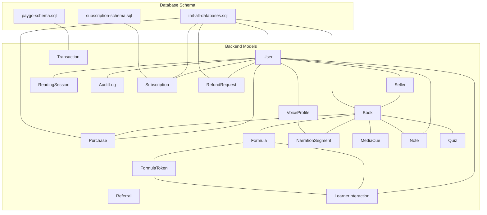
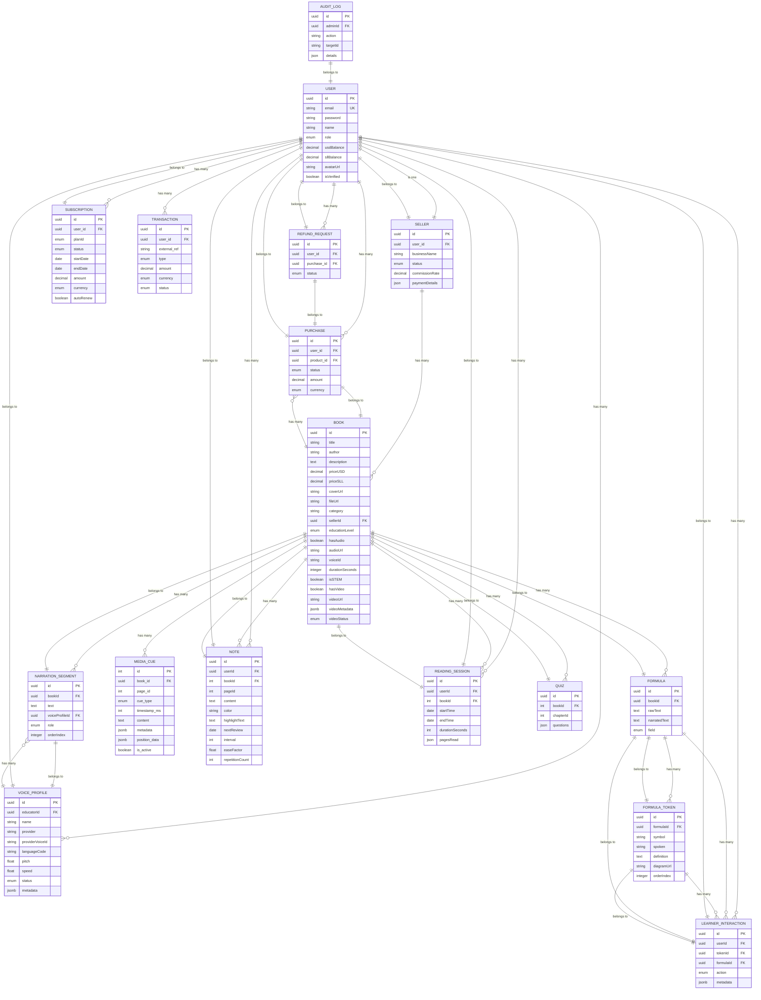
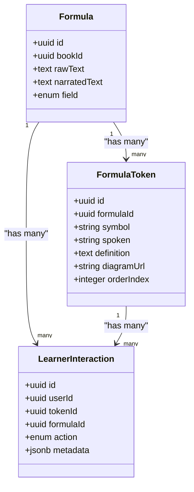
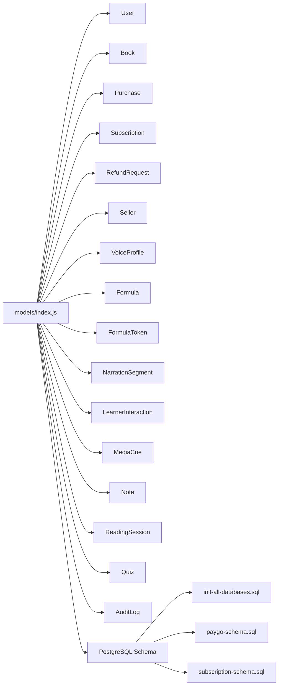

# Entity Relationship Models

<cite>
**Referenced Files in This Document**
- [index.js](file://backend/models/index.js)
- [User.js](file://backend/models/User.js)
- [Book.js](file://backend/models/Book.js)
- [Purchase.js](file://backend/models/Purchase.js)
- [Seller.js](file://backend/models/Seller.js)
- [VoiceProfile.js](file://backend/models/VoiceProfile.js)
- [Formula.js](file://backend/models/Formula.js)
- [FormulaToken.js](file://backend/models/FormulaToken.js)
- [NarrationSegment.js](file://backend/models/NarrationSegment.js)
- [LearnerInteraction.js](file://backend/models/LearnerInteraction.js)
- [MediaCue.js](file://backend/models/MediaCue.js)
- [Note.js](file://backend/models/Note.js)
- [ReadingSession.js](file://backend/models/ReadingSession.js)
- [Quiz.js](file://backend/models/Quiz.js)
- [AuditLog.js](file://backend/models/AuditLog.js)
- [Referral.js](file://backend/models/Referral.js)
- [Subscription.js](file://backend/models/Subscription.js)
- [RefundRequest.js](file://backend/models/RefundRequest.js)
- [Transaction.js](file://backend/models/Transaction.js)
- [init-all-databases.sql](file://database/init-all-databases.sql)
- [paygo-schema.sql](file://database/paygo-schema.sql)
- [subscription-schema.sql](file://database/subscription-schema.sql)
</cite>

## Table of Contents
1. [Introduction](#introduction)
2. [Project Structure](#project-structure)
3. [Core Components](#core-components)
4. [Architecture Overview](#architecture-overview)
5. [Detailed Component Analysis](#detailed-component-analysis)
6. [Dependency Analysis](#dependency-analysis)
7. [Performance Considerations](#performance-considerations)
8. [Troubleshooting Guide](#troubleshooting-guide)
9. [Conclusion](#conclusion)

## Introduction
This document provides comprehensive entity relationship documentation for the QuantumMint Bookstore database models. It details all major models, their primary keys, foreign key constraints, referential integrity rules, and association patterns. It also explains many-to-many relationships, one-to-one mappings, cascading behaviors, and complex relationships such as Formula-FormulaToken-LearnerInteraction. Business logic behind each association is explained, along with join strategies, query optimization patterns, and data consistency enforcement mechanisms.

## Project Structure
The backend models are defined using Sequelize ORM and registered in a central initializer that defines associations among models. The database schema is split across multiple SQL files:
- Unified platform schema for users, products, purchases, subscriptions, and related entities
- Pay-per-minute (PayGo) schema for wallet, transactions, and sessions
- Subscription schema for plan and usage tracking

**Diagram sources**
- [index.js:45-167](file://backend/models/index.js#L45-L167)
- [init-all-databases.sql:11-470](file://database/init-all-databases.sql#L11-L470)
- [paygo-schema.sql:7-371](file://database/paygo-schema.sql#L7-L371)
- [subscription-schema.sql:17-644](file://database/subscription-schema.sql#L17-L644)

**Section sources**
- [index.js:1-168](file://backend/models/index.js#L1-L168)
- [init-all-databases.sql:1-470](file://database/init-all-databases.sql#L1-L470)
- [paygo-schema.sql:1-371](file://database/paygo-schema.sql#L1-L371)
- [subscription-schema.sql:1-644](file://database/subscription-schema.sql#L1-L644)

## Core Components
Below are the core models and their primary keys. Foreign keys and associations are documented in the next section.

- User: UUID primary key
- Book: UUID primary key
- Purchase: UUID primary key
- Transaction: UUID primary key
- Referral: UUID primary key
- Seller: UUID primary key
- VoiceProfile: UUID primary key
- Formula: UUID primary key
- FormulaToken: UUID primary key
- NarrationSegment: UUID primary key
- LearnerInteraction: UUID primary key
- MediaCue: integer primary key (auto-increment)
- Note: UUID primary key
- ReadingSession: UUID primary key
- Quiz: UUID primary key
- AuditLog: UUID primary key
- Subscription: UUID primary key
- RefundRequest: UUID primary key

**Section sources**
- [User.js:4-48](file://backend/models/User.js#L4-L48)
- [Book.js:4-90](file://backend/models/Book.js#L4-L90)
- [Purchase.js:4-24](file://backend/models/Purchase.js#L4-L24)
- [Transaction.js](file://backend/models/Transaction.js)
- [Referral.js:4-29](file://backend/models/Referral.js#L4-L29)
- [Seller.js:4-28](file://backend/models/Seller.js#L4-L28)
- [VoiceProfile.js:4-48](file://backend/models/VoiceProfile.js#L4-L48)
- [Formula.js:4-28](file://backend/models/Formula.js#L4-L28)
- [FormulaToken.js:4-36](file://backend/models/FormulaToken.js#L4-L36)
- [NarrationSegment.js:4-32](file://backend/models/NarrationSegment.js#L4-L32)
- [LearnerInteraction.js:4-32](file://backend/models/LearnerInteraction.js#L4-L32)
- [MediaCue.js:4-47](file://backend/models/MediaCue.js#L4-L47)
- [Note.js:4-53](file://backend/models/Note.js#L4-L53)
- [ReadingSession.js:4-36](file://backend/models/ReadingSession.js#L4-L36)
- [Quiz.js:4-24](file://backend/models/Quiz.js#L4-L24)
- [AuditLog.js:4-28](file://backend/models/AuditLog.js#L4-L28)
- [Subscription.js:4-44](file://backend/models/Subscription.js#L4-L44)
- [RefundRequest.js](file://backend/models/RefundRequest.js)

## Architecture Overview
The entity relationships are defined in the Sequelize model initializer and enforced via foreign keys and indexes in the database schema. Associations include:
- One-to-many: User → Purchase, User → RefundRequest, User → Subscription, User → Transaction, User → Seller, User → VoiceProfile, User → Note, User → ReadingSession, User → LearnerInteraction, User → AuditLog
- Many-to-one: Purchase → User, Purchase → Book, RefundRequest → User, RefundRequest → Purchase, Subscription → User
- One-to-one: User → Seller, User → VoiceProfile
- One-to-many: Book → Purchase, Book → Formula, Book → NarrationSegment, Book → MediaCue, Book → Note, Book → ReadingSession, Book → Quiz
- Many-to-one: Formula → Book, Formula → LearnerInteraction, FormulaToken → Formula, FormulaToken → LearnerInteraction
- Many-to-one: NarrationSegment → Book, NarrationSegment → VoiceProfile
- Many-to-one: Note → User, Note → Book
- Many-to-one: ReadingSession → User, ReadingSession → Book
- Many-to-one: Quiz → Book
- Many-to-one: AuditLog → User

**Diagram sources**
- [index.js:45-167](file://backend/models/index.js#L45-L167)
- [User.js:4-48](file://backend/models/User.js#L4-L48)
- [Book.js:4-90](file://backend/models/Book.js#L4-L90)
- [Purchase.js:4-24](file://backend/models/Purchase.js#L4-L24)
- [RefundRequest.js](file://backend/models/RefundRequest.js)
- [Subscription.js:4-44](file://backend/models/Subscription.js#L4-L44)
- [Transaction.js](file://backend/models/Transaction.js)
- [Seller.js:4-28](file://backend/models/Seller.js#L4-L28)
- [VoiceProfile.js:4-48](file://backend/models/VoiceProfile.js#L4-L48)
- [Formula.js:4-28](file://backend/models/Formula.js#L4-L28)
- [FormulaToken.js:4-36](file://backend/models/FormulaToken.js#L4-L36)
- [NarrationSegment.js:4-32](file://backend/models/NarrationSegment.js#L4-L32)
- [LearnerInteraction.js:4-32](file://backend/models/LearnerInteraction.js#L4-L32)
- [MediaCue.js:4-47](file://backend/models/MediaCue.js#L4-L47)
- [Note.js:4-53](file://backend/models/Note.js#L4-L53)
- [ReadingSession.js:4-36](file://backend/models/ReadingSession.js#L4-L36)
- [Quiz.js:4-24](file://backend/models/Quiz.js#L4-L24)
- [AuditLog.js:4-28](file://backend/models/AuditLog.js#L4-L28)

## Detailed Component Analysis

### Association Patterns and Referential Integrity

- User-Purchase
  - One-to-many: User → Purchase
  - Foreign key: Purchase.user_id references User.id
  - Cascades: User deletion behavior set to SET NULL for purchase records; Purchase deletion restricted per unified schema
  - Business logic: Tracks all purchases made by a user; purchase records persist even if user account is removed for auditability
  - Join strategy: Index on Purchase.user_id for efficient lookups

- Book-Purchase
  - One-to-many: Book → Purchase
  - Foreign key: Purchase.product_id references Book.id
  - Cascades: Purchase deletion restricted to preserve historical access records
  - Business logic: Links purchases to specific books; supports analytics and reporting
  - Join strategy: Index on Purchase.product_id

- User-Subscription
  - One-to-many: User → Subscription
  - Foreign key: Subscription.user_id references User.id
  - Cascades: CASCADE on user deletion to maintain referential integrity in subscription lifecycle
  - Business logic: Manages user’s active and past subscriptions
  - Join strategy: Index on Subscription.user_id

- User-Seller
  - One-to-one: User → Seller
  - Foreign key: Seller.user_id references User.id
  - Cascades: Not explicitly defined in model initializer; typically cascade on delete handled by application logic
  - Business logic: Enables users to become sellers with associated commission and status
  - Join strategy: Index on Seller.user_id

- Book-Seller
  - One-to-many: Seller → Book
  - Foreign key: Book.sellerId references Seller.id
  - Cascades: Not explicitly defined in model initializer
  - Business logic: Associates books to their respective sellers
  - Join strategy: Index on Book.sellerId

- User-Referral (referrer)
  - One-to-many: User → Referral (as referrer)
  - Foreign key: Referral.referrerId references User.id
  - Cascades: Not explicitly defined
  - Business logic: Tracks referrals sent by a user
  - Join strategy: Index on Referral.referrerId

- User-Referral (referred)
  - One-to-one: User → Referral (as referred)
  - Foreign key: Referral.referredId references User.id
  - Cascades: Not explicitly defined
  - Business logic: Tracks the user who was referred
  - Join strategy: Index on Referral.referredId

- User-Transaction
  - One-to-many: User → Transaction
  - Foreign key: Transaction.user_id references User.id
  - Cascades: Not explicitly defined
  - Business logic: Records financial transactions for wallets and PayGo
  - Join strategy: Index on Transaction.user_id

- Formula-FormulaToken-LearnerInteraction
  - One-to-many: Formula → FormulaToken
  - One-to-many: Formula → LearnerInteraction
  - One-to-many: FormulaToken → LearnerInteraction
  - Foreign keys: FormulaToken.formulaId → Formula.id; LearnerInteraction.tokenId → FormulaToken.id; LearnerInteraction.formulaId → Formula.id
  - Cascades: Not explicitly defined in model initializer
  - Business logic: Supports granular learner interactions with tokens inside formulas
  - Join strategy: Composite queries on formulaId/tokenId; indexes on formulaId and tokenId recommended

- Book-MediaCue
  - One-to-many: Book → MediaCue
  - Foreign key: MediaCue.book_id references Book.id
  - Cascades: Not explicitly defined
  - Business logic: Stores interactive cues for pages within a book
  - Join strategy: Index on MediaCue.book_id

- User-Note, Book-Note
  - One-to-many: User → Note; Book → Note
  - Foreign keys: Note.userId → User.id; Note.bookId → Book.id
  - Cascades: Not explicitly defined
  - Business logic: Learner notes with spaced repetition fields
  - Join strategy: Index on Note.userId and Note.bookId

- User-ReadingSession, Book-ReadingSession
  - One-to-many: User → ReadingSession; Book → ReadingSession
  - Foreign keys: ReadingSession.userId → User.id; ReadingSession.bookId → Book.id
  - Cascades: Not explicitly defined
  - Business logic: Tracks reading sessions and pages read
  - Join strategy: Index on ReadingSession.userId and ReadingSession.bookId

- Book-Quiz
  - One-to-many: Book → Quiz
  - Foreign key: Quiz.bookId → Book.id
  - Cascades: Not explicitly defined
  - Business logic: Chapter quizzes embedded in books
  - Join strategy: Index on Quiz.bookId

- User-AuditLog
  - One-to-many: User → AuditLog
  - Foreign key: AuditLog.adminId → User.id
  - Cascades: Not explicitly defined
  - Business logic: Logs administrative actions performed by admins
  - Join strategy: Index on AuditLog.adminId

- User-VoiceProfile, Book-NarrationSegment, VoiceProfile-NarrationSegment
  - One-to-many: User → VoiceProfile; Book → NarrationSegment; VoiceProfile → NarrationSegment
  - Foreign keys: VoiceProfile.educatorId → User.id; NarrationSegment.bookId → Book.id; NarrationSegment.voiceProfileId → VoiceProfile.id
  - Cascades: Not explicitly defined
  - Business logic: Educational narration with voice profiles and segments
  - Join strategy: Index on educatorId, bookId, voiceProfileId

**Section sources**
- [index.js:47-167](file://backend/models/index.js#L47-L167)
- [init-all-databases.sql:180-272](file://database/init-all-databases.sql#L180-L272)
- [paygo-schema.sql:48-165](file://database/paygo-schema.sql#L48-L165)
- [subscription-schema.sql:75-123](file://database/subscription-schema.sql#L75-L123)

### Complex Relationship: Formula-FormulaToken-LearnerInteraction

**Diagram sources**
- [Formula.js:4-28](file://backend/models/Formula.js#L4-L28)
- [FormulaToken.js:4-36](file://backend/models/FormulaToken.js#L4-L36)
- [LearnerInteraction.js:4-32](file://backend/models/LearnerInteraction.js#L4-L32)

**Section sources**
- [index.js:95-117](file://backend/models/index.js#L95-L117)

### Business Logic Behind Associations
- Purchases track completed transactions and support refund requests; restrict deletion to maintain audit trails.
- Subscriptions manage recurring access with plan-based entitlements; cascade user deletions to keep subscription records consistent.
- Learner interactions with formulas enable adaptive learning experiences; tokens represent atomic units of understanding.
- Media cues and narration segments enhance accessibility and engagement for educational content.
- Notes and reading sessions support spaced repetition and progress tracking.

[No sources needed since this section synthesizes previously cited details]

## Dependency Analysis
The model initializer defines all associations centrally. The database schema enforces referential integrity via foreign keys and indexes. PayGo and subscription schemas augment the core bookstore domain with financial and access-control capabilities.

**Diagram sources**
- [index.js:24-167](file://backend/models/index.js#L24-L167)
- [init-all-databases.sql:1-470](file://database/init-all-databases.sql#L1-L470)
- [paygo-schema.sql:1-371](file://database/paygo-schema.sql#L1-L371)
- [subscription-schema.sql:1-644](file://database/subscription-schema.sql#L1-L644)

**Section sources**
- [index.js:1-168](file://backend/models/index.js#L1-L168)
- [init-all-databases.sql:1-470](file://database/init-all-databases.sql#L1-L470)
- [paygo-schema.sql:1-371](file://database/paygo-schema.sql#L1-L371)
- [subscription-schema.sql:1-644](file://database/subscription-schema.sql#L1-L644)

## Performance Considerations
- Indexes on foreign keys: Ensure indexes on Purchase.user_id, Purchase.product_id, Subscription.user_id, Note.userId/bookId, ReadingSession.userId/bookId, Quiz.bookId, MediaCue.book_id, LearnerInteraction.userId/formulaId/tokenId, NarrationSegment.bookId/voiceProfileId, and AuditLog.adminId for efficient joins.
- Partitioning and materialized views: Consider partitioning purchases and reading sessions by date for large-scale analytics.
- Denormalization for analytics: Pre-aggregate metrics in separate tables (e.g., purchase counts, reading statistics) to reduce complex joins during reporting.
- Caching: Cache frequently accessed lookup data such as subscription plans and formula token definitions.
- Batch operations: Use bulk inserts for learner interactions and reading sessions to minimize round trips.

[No sources needed since this section provides general guidance]

## Troubleshooting Guide
- Foreign key constraint violations: Verify that foreign keys match existing primary keys and that cascading rules align with intended behavior.
- Missing indexes causing slow queries: Add indexes on commonly filtered/joined columns (e.g., user_id, product_id, book_id).
- Data consistency in PayGo and subscriptions: Ensure triggers/functions update timestamps and derived fields consistently; validate wallet balances before charging.
- Audit trail gaps: Confirm that admin actions are logged to AuditLog and that adminId references valid users.

**Section sources**
- [index.js:45-167](file://backend/models/index.js#L45-L167)
- [init-all-databases.sql:180-272](file://database/init-all-databases.sql#L180-L272)
- [paygo-schema.sql:348-371](file://database/paygo-schema.sql#L348-L371)
- [subscription-schema.sql:366-422](file://database/subscription-schema.sql#L366-L422)

## Conclusion
The QuantumMint Bookstore database models form a cohesive domain with clear primary and foreign key relationships. Associations capture essential business flows such as purchases, subscriptions, learner interactions, and educational content delivery. Enforcing referential integrity via foreign keys and indexes, combined with appropriate cascading behaviors, ensures data consistency. Optimizing queries with targeted indexes and considering pre-aggregated analytics tables will improve performance at scale.