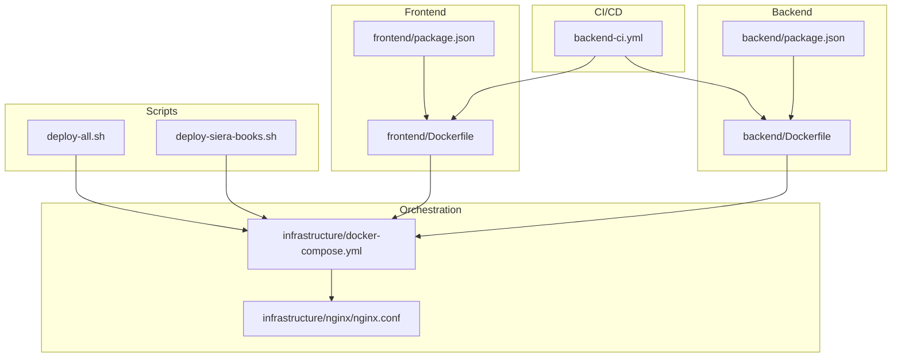
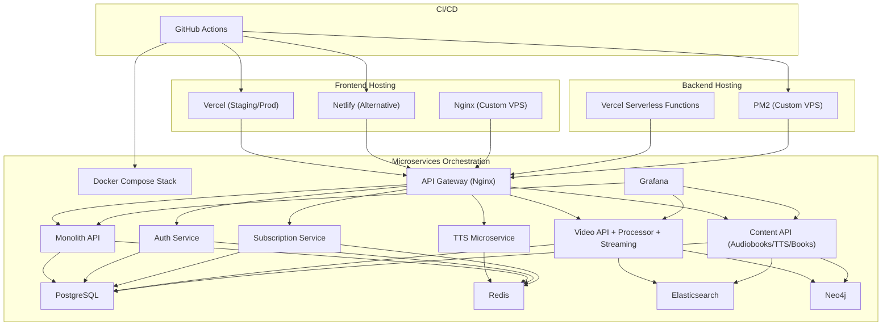
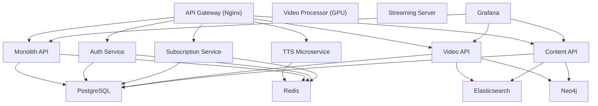
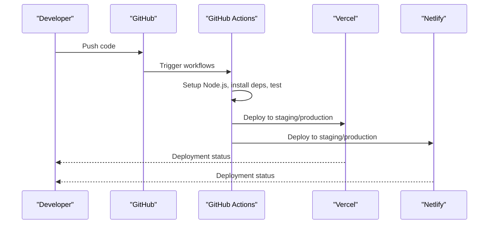
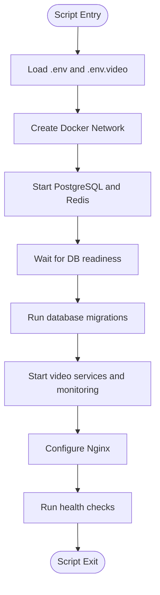
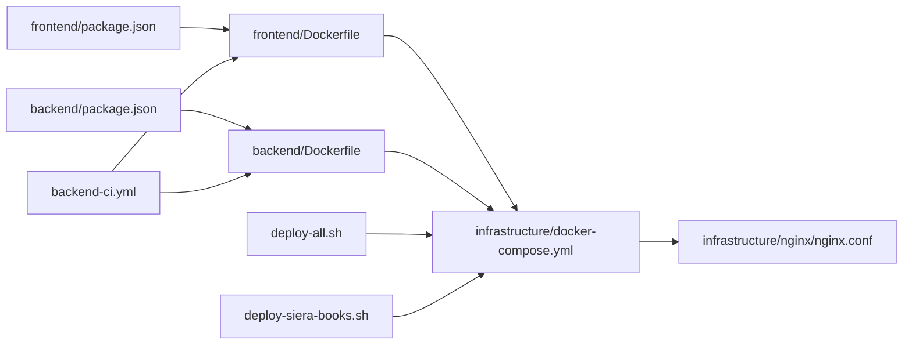

# Deployment Strategies and Automation

<cite>
**Referenced Files in This Document**
- [DEPLOYMENT.md](file://docs/DEPLOYMENT.md)
- [backend-ci.yml](file://.github/workflows/backend-ci.yml)
- [backend Dockerfile](file://backend/Dockerfile)
- [frontend Dockerfile](file://frontend/Dockerfile)
- [infrastructure docker-compose.yml](file://infrastructure/docker-compose.yml)
- [deploy-all.sh](file://deploy-all.sh)
- [deploy-siera-books.sh](file://deploy-siera-books.sh)
- [backend package.json](file://backend/package.json)
- [frontend package.json](file://frontend/package.json)
- [video-api Dockerfile](file://services/video/api/Dockerfile)
- [content-api Dockerfile](file://services/content/api/Dockerfile)
- [infrastructure nginx.conf](file://infrastructure/nginx/nginx.conf)
</cite>

## Table of Contents
1. [Introduction](#introduction)
2. [Project Structure](#project-structure)
3. [Core Components](#core-components)
4. [Architecture Overview](#architecture-overview)
5. [Detailed Component Analysis](#detailed-component-analysis)
6. [Dependency Analysis](#dependency-analysis)
7. [Performance Considerations](#performance-considerations)
8. [Troubleshooting Guide](#troubleshooting-guide)
9. [Conclusion](#conclusion)
10. [Appendices](#appendices)

## Introduction
This document provides comprehensive deployment strategies for the QuantumMint Bookstore platform across local development, staging, and production environments. It covers multi-environment deployment options including Vercel, Netlify, and custom VPS deployments, along with Docker-based infrastructure orchestration, environment variable management, and automated deployment pipelines using GitHub Actions. It also details pre-deployment checks, rollback procedures, deployment checklists, environment-specific configurations, and automation scripts. Practical step-by-step instructions and troubleshooting guidance are included for each deployment target.

## Project Structure
The platform consists of:
- Frontend built with Vite and React, packaged via a two-stage Dockerfile for production.
- Backend API written in Node.js, packaged with a minimal Alpine Linux image.
- A microservices-oriented Docker Compose stack orchestrating multiple services including video APIs, content APIs, TTS, Redis, PostgreSQL, Elasticsearch, Neo4j, Grafana, and monitoring.
- CI/CD workflows using GitHub Actions for backend and related services.
- Shell scripts for automated deployment to VPS environments.

**Diagram sources**
- [frontend Dockerfile:1-15](file://frontend/Dockerfile#L1-L15)
- [backend Dockerfile:1-8](file://backend/Dockerfile#L1-L8)
- [infrastructure docker-compose.yml:1-373](file://infrastructure/docker-compose.yml#L1-L373)
- [infrastructure nginx.conf:1-49](file://infrastructure/nginx/nginx.conf#L1-L49)
- [.github workflows backend-ci.yml:1-58](file://.github/workflows/backend-ci.yml#L1-L58)
- [deploy-all.sh:1-78](file://deploy-all.sh#L1-L78)
- [deploy-siera-books.sh:1-73](file://deploy-siera-books.sh#L1-L73)

**Section sources**
- [frontend package.json:1-47](file://frontend/package.json#L1-L47)
- [backend package.json:1-52](file://backend/package.json#L1-L52)
- [infrastructure docker-compose.yml:1-373](file://infrastructure/docker-compose.yml#L1-L373)
- [infrastructure nginx.conf:1-49](file://infrastructure/nginx/nginx.conf#L1-L49)
- [backend-ci.yml:1-58](file://.github/workflows/backend-ci.yml#L1-L58)
- [deploy-all.sh:1-78](file://deploy-all.sh#L1-L78)
- [deploy-siera-books.sh:1-73](file://deploy-siera-books.sh#L1-L73)

## Core Components
- Frontend build and delivery: Vite-based React app built into a static site served by Nginx inside a containerized production stage.
- Backend API: Node.js Express server packaged for production with minimal dependencies.
- Microservices stack: A Docker Compose orchestrated set of services including API gateway, monolith API, user management, subscriptions, video platform, content API, TTS, Redis, PostgreSQL, Elasticsearch, Neo4j, Grafana, and analytics.
- CI/CD: GitHub Actions workflows for backend and voice profile tests; Vercel/Netlify for frontend deployment; shell scripts for VPS deployments.
- Environment variables: Managed via Vercel/Netlify variables, .env files, and Docker Compose environment blocks.

Key deployment artifacts and roles:
- Frontend Dockerfile: Two-stage build and Nginx serving.
- Backend Dockerfile: Minimal production image.
- Infrastructure docker-compose.yml: Full-stack orchestration with networking, volumes, and healthchecks.
- deploy-all.sh and deploy-siera-books.sh: Automated deployment scripts for VPS environments.
- backend-ci.yml: Backend-focused CI pipeline.

**Section sources**
- [frontend Dockerfile:1-15](file://frontend/Dockerfile#L1-L15)
- [backend Dockerfile:1-8](file://backend/Dockerfile#L1-L8)
- [infrastructure docker-compose.yml:1-373](file://infrastructure/docker-compose.yml#L1-L373)
- [deploy-all.sh:1-78](file://deploy-all.sh#L1-L78)
- [deploy-siera-books.sh:1-73](file://deploy-siera-books.sh#L1-L73)
- [backend-ci.yml:1-58](file://.github/workflows/backend-ci.yml#L1-L58)

## Architecture Overview
The deployment architecture supports:
- Local development with optional Dockerized backend services.
- Staging and production via Vercel (frontend), Netlify (alternative), or custom VPS with Nginx and PM2.
- A Docker-based microservices stack for integrated services and centralized monitoring.

**Diagram sources**
- [infrastructure docker-compose.yml:1-373](file://infrastructure/docker-compose.yml#L1-L373)
- [infrastructure nginx.conf:1-49](file://infrastructure/nginx/nginx.conf#L1-L49)
- [backend-ci.yml:1-58](file://.github/workflows/backend-ci.yml#L1-L58)

**Section sources**
- [infrastructure docker-compose.yml:1-373](file://infrastructure/docker-compose.yml#L1-L373)
- [infrastructure nginx.conf:1-49](file://infrastructure/nginx/nginx.conf#L1-L49)
- [backend-ci.yml:1-58](file://.github/workflows/backend-ci.yml#L1-L58)

## Detailed Component Analysis

### Local Development Deployment
- Prerequisites: Node.js 18+, npm 9+, Git, optional Docker and PostgreSQL.
- Steps:
  - Clone repository and install dependencies.
  - Create a local environment file (.env.local).
  - Start development servers for frontend (Vite), backend (if available), and TTS service.
- Environment variables:
  - Application and API endpoints tailored for local URLs.
  - Payment gateways in test mode.
  - Feature flags for analytics and payments.

Practical steps and environment configuration are documented in the deployment guide.

**Section sources**
- [DEPLOYMENT.md:17-86](file://docs/DEPLOYMENT.md#L17-L86)

### Staging Deployment (Vercel)
- Purpose: QA, demos, integration, and performance testing.
- Steps:
  - Install Vercel CLI, log in, and deploy with staging environment.
  - Set environment variables for staging endpoints and payment keys.
- Environment variables:
  - Application URL, API base URL, TTS service URL, analytics flag, and Stripe publishable key.

**Section sources**
- [DEPLOYMENT.md:89-144](file://docs/DEPLOYMENT.md#L89-L144)

### Staging Deployment (Netlify)
- Steps:
  - Install Netlify CLI, log in, initialize site, and deploy.
- Configuration:
  - Build command and publish directory.
  - Redirects to support SPA routing.
  - Security headers applied via headers configuration.

**Section sources**
- [DEPLOYMENT.md:206-246](file://docs/DEPLOYMENT.md#L206-L246)

### Production Deployment (Vercel)
- Advantages: Automatic deployments from Git, global CDN, serverless functions, free SSL.
- Steps:
  - Link project to Vercel, set production environment variables, and deploy to production.
- Custom domain:
  - Add domain and configure DNS records.

**Section sources**
- [DEPLOYMENT.md:147-204](file://docs/DEPLOYMENT.md#L147-L204)

### Production Deployment (Netlify)
- Steps:
  - Install Netlify CLI, log in, initialize site, and deploy to production.
- Configuration:
  - Build settings, redirects, and security headers.

**Section sources**
- [DEPLOYMENT.md:206-246](file://docs/DEPLOYMENT.md#L206-L246)

### Production Deployment (Custom VPS)
- Requirements: Ubuntu 22.04 LTS, Nginx, PM2, Let’s Encrypt.
- Steps:
  - Provision server, install Node.js and Nginx.
  - Clone repository, install dependencies, and build.
  - Configure Nginx virtual host for static assets and SPA fallback.
  - Obtain SSL certificates with Certbot and enable auto-renewal.
- Process management:
  - Use PM2 to manage Node.js applications with cluster mode and persistence.

**Section sources**
- [DEPLOYMENT.md:247-320](file://docs/DEPLOYMENT.md#L247-L320)

### Backend Deployment Options
- Database:
  - Managed or self-hosted PostgreSQL with connection string and migrations.
- API server:
  - Vercel Serverless Functions, Railway, Heroku, or custom VPS with PM2.
- PM2 configuration:
  - Cluster mode with environment variables for production.

**Section sources**
- [DEPLOYMENT.md:323-388](file://docs/DEPLOYMENT.md#L323-L388)

### TTS Service
- Recommended: Dedicated server for TTS processing.
- Example:
  - Start TTS service with PM2 on port 7001.

**Section sources**
- [DEPLOYMENT.md:390-398](file://docs/DEPLOYMENT.md#L390-L398)

### Docker-Based Infrastructure Orchestration
- Services:
  - API Gateway (Nginx), Monolith API, Auth, Subscription, Video Platform, Content API, TTS, Redis, PostgreSQL, Elasticsearch, Neo4j, Grafana, Analytics Engine.
- Networking and volumes:
  - Bridge network and named volumes for persistent data.
- Health checks:
  - Healthcheck directives for key services.
- Frontend and Admin:
  - Separate containers for web frontend and admin dashboard.

**Diagram sources**
- [infrastructure docker-compose.yml:1-373](file://infrastructure/docker-compose.yml#L1-L373)

**Section sources**
- [infrastructure docker-compose.yml:1-373](file://infrastructure/docker-compose.yml#L1-L373)

### Environment Variable Management
- Frontend:
  - Vercel/Netlify environment variables for API base URLs, payment keys, and analytics.
  - Local .env.local for development.
- Backend:
  - .env files (gitignored), Docker Compose environment blocks, and secrets managers.
- Docker Compose:
  - Environment variables for database credentials, JWT secret, and service-specific settings.

**Section sources**
- [DEPLOYMENT.md:49-69](file://docs/DEPLOYMENT.md#L49-L69)
- [DEPLOYMENT.md:126-143](file://docs/DEPLOYMENT.md#L126-L143)
- [infrastructure docker-compose.yml:34-43](file://infrastructure/docker-compose.yml#L34-L43)

### Automated Deployment Pipelines (GitHub Actions)
- Backend CI:
  - Runs on pushes and pull requests to main/master/dev.
  - Sets up Node.js 20, installs backend dependencies, runs tests, and performs an informational audit.
- Frontend CI:
  - Can be integrated similarly for build, lint, type-check, and test stages.
- Production deployment:
  - Vercel action with tokens and project identifiers for automated deployments.

**Diagram sources**
- [backend-ci.yml:1-58](file://.github/workflows/backend-ci.yml#L1-L58)
- [DEPLOYMENT.md:514-554](file://docs/DEPLOYMENT.md#L514-L554)

**Section sources**
- [backend-ci.yml:1-58](file://.github/workflows/backend-ci.yml#L1-L58)
- [DEPLOYMENT.md:510-575](file://docs/DEPLOYMENT.md#L510-L575)

### Pre-deployment Checks
- Linting, type checking, unit tests, and build verification.
- CI workflow for pull requests ensures quality gates before merging.

**Section sources**
- [DEPLOYMENT.md:556-575](file://docs/DEPLOYMENT.md#L556-L575)

### Rollback Procedures
- Vercel:
  - List deployments and rollback to a previous deployment URL.
- Manual rollback (VPS):
  - SSH into server, switch to previous commit, rebuild, and restart services.
- Database rollback:
  - Rollback last migration or to a specific version.

**Section sources**
- [DEPLOYMENT.md:579-615](file://docs/DEPLOYMENT.md#L579-L615)

### Deployment Checklists
- Pre-deployment:
  - Tests passing, environment variables configured, SSL valid, database backed up, monitoring enabled.
- Deployment:
  - Build successful, assets uploaded to CDN, DNS updated, health checks passing, smoke tests passed.
- Post-deployment:
  - Monitor error rates, check performance metrics, verify payment processing, test critical flows, update documentation, notify stakeholders.

**Section sources**
- [DEPLOYMENT.md:619-646](file://docs/DEPLOYMENT.md#L619-L646)

### Multi-Region Deployment
- CDN:
  - Vercel provides automatic global CDN; Cloudflare can be added for additional edge optimization.
- Geographic considerations:
  - Optimize for Sierra Leone with African CDN nodes, local payment processors, lightweight assets, and PWA support.

**Section sources**
- [DEPLOYMENT.md:649-672](file://docs/DEPLOYMENT.md#L649-L672)

### Backup Strategy
- Automated backups:
  - Database dumps scheduled nightly.
  - File storage synced to S3.
- Retention policy:
  - Daily, weekly, and monthly retention windows.

**Section sources**
- [DEPLOYMENT.md:675-698](file://docs/DEPLOYMENT.md#L675-L698)

### Support and Maintenance
- On-call rotation responsibilities and tools.
- Scheduled maintenance windows with advance notice and status updates.

**Section sources**
- [DEPLOYMENT.md:701-725](file://docs/DEPLOYMENT.md#L701-L725)

### Success Metrics
- Uptime, performance targets, error rate, deployment frequency, and mean time to recovery.

**Section sources**
- [DEPLOYMENT.md:728-734](file://docs/DEPLOYMENT.md#L728-L734)

### Additional Resources
- Links to Vercel, Netlify, PM2, Let's Encrypt, and Sentry documentation.

**Section sources**
- [DEPLOYMENT.md:738-744](file://docs/DEPLOYMENT.md#L738-L744)

### Environment-Specific Configurations
- Local:
  - .env.local with development endpoints and test keys.
- Staging:
  - Vercel/Netlify environment variables for staging URLs and test keys.
- Production:
  - Vercel/Netlify environment variables for production URLs and live keys.
  - Docker Compose environment blocks for internal services.

**Section sources**
- [DEPLOYMENT.md:49-69](file://docs/DEPLOYMENT.md#L49-L69)
- [DEPLOYMENT.md:126-143](file://docs/DEPLOYMENT.md#L126-L143)
- [DEPLOYMENT.md:184-192](file://docs/DEPLOYMENT.md#L184-L192)
- [DEPLOYMENT.md:217-221](file://docs/DEPLOYMENT.md#L217-L221)
- [infrastructure docker-compose.yml:34-43](file://infrastructure/docker-compose.yml#L34-L43)

### Deployment Automation Scripts
- deploy-all.sh:
  - Loads environment, creates Docker network, starts core services, waits for DB readiness, runs migrations, starts video services, monitors stack, configures Nginx, and performs health checks.
- deploy-siera-books.sh:
  - Validates prerequisites, pulls latest code, checks environment, starts database, builds application, sets up SSL, and runs health checks.

**Diagram sources**
- [deploy-all.sh:1-78](file://deploy-all.sh#L1-L78)

**Section sources**
- [deploy-all.sh:1-78](file://deploy-all.sh#L1-L78)
- [deploy-siera-books.sh:1-73](file://deploy-siera-books.sh#L1-L73)

## Dependency Analysis
- Frontend build depends on Vite and React; production image built with Nginx.
- Backend depends on Express, database drivers, and monitoring libraries.
- Docker Compose orchestrates interdependent services with explicit dependencies and health checks.
- CI/CD depends on GitHub Actions and external platforms (Vercel/Netlify) for deployment.

**Diagram sources**
- [frontend package.json:1-47](file://frontend/package.json#L1-L47)
- [backend package.json:1-52](file://backend/package.json#L1-L52)
- [frontend Dockerfile:1-15](file://frontend/Dockerfile#L1-L15)
- [backend Dockerfile:1-8](file://backend/Dockerfile#L1-L8)
- [infrastructure docker-compose.yml:1-373](file://infrastructure/docker-compose.yml#L1-L373)
- [infrastructure nginx.conf:1-49](file://infrastructure/nginx/nginx.conf#L1-L49)
- [backend-ci.yml:1-58](file://.github/workflows/backend-ci.yml#L1-L58)
- [deploy-all.sh:1-78](file://deploy-all.sh#L1-L78)
- [deploy-siera-books.sh:1-73](file://deploy-siera-books.sh#L1-L73)

**Section sources**
- [frontend package.json:1-47](file://frontend/package.json#L1-L47)
- [backend package.json:1-52](file://backend/package.json#L1-L52)
- [infrastructure docker-compose.yml:1-373](file://infrastructure/docker-compose.yml#L1-L373)

## Performance Considerations
- Use Vercel or Netlify CDNs for global distribution.
- Enable gzip and cache static assets in Nginx.
- Monitor Web Vitals and backend performance metrics.
- Optimize for mobile connectivity in target regions.

[No sources needed since this section provides general guidance]

## Troubleshooting Guide
Common issues and resolutions:
- Environment variables not loaded:
  - Ensure .env files are present and correctly formatted; verify Vercel/Netlify environment variables.
- Database connectivity:
  - Confirm connection strings, credentials, and service health; check Docker Compose logs.
- SSL configuration:
  - Use Certbot for VPS; verify certificate paths and Nginx reload.
- Health checks failing:
  - Inspect service logs and health endpoints; confirm dependencies are reachable.
- CI failures:
  - Review GitHub Actions logs for linting, type-check, test, and build errors.

**Section sources**
- [DEPLOYMENT.md:579-615](file://docs/DEPLOYMENT.md#L579-L615)
- [deploy-all.sh:59-78](file://deploy-all.sh#L59-L78)
- [deploy-siera-books.sh:65-73](file://deploy-siera-books.sh#L65-L73)

## Conclusion
The QuantumMint Bookstore platform supports flexible deployment strategies across local, staging, and production environments. The combination of Vercel/Netlify for frontend delivery, Docker-based microservices orchestration for backend services, and robust CI/CD pipelines enables reliable, scalable, and maintainable deployments. Adhering to environment-specific configurations, pre-deployment checks, and rollback procedures ensures smooth operations and rapid recovery from incidents.

[No sources needed since this section summarizes without analyzing specific files]

## Appendices
- Additional resources and links for deployment tools and documentation.

**Section sources**
- [DEPLOYMENT.md:738-744](file://docs/DEPLOYMENT.md#L738-L744)