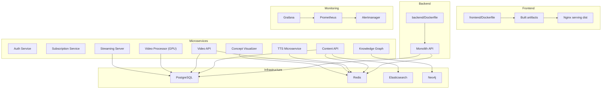
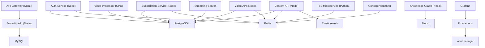
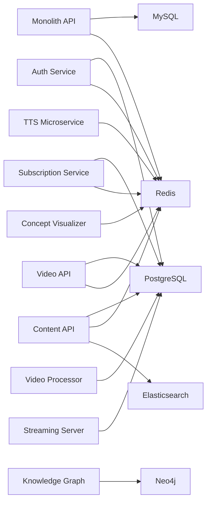

# Deployment and Operations

<cite>
**Referenced Files in This Document**
- [DEPLOYMENT.md](file://docs/DEPLOYMENT.md)
- [docker-compose.yml](file://infrastructure/docker-compose.yml)
- [backend/Dockerfile](file://backend/Dockerfile)
- [frontend/Dockerfile](file://frontend/Dockerfile)
- [infrastructure/Dockerfile](file://infrastructure/Dockerfile)
- [prometheus.yml](file://prometheus/prometheus.yml)
- [alerts.yml](file://prometheus/alerts.yml)
- [alertmanager.yml](file://prometheus/alertmanager.yml)
- [datasource.yml](file://grafana/datasources/datasource.yml)
- [video_dashboard.json](file://grafana/dashboards/video_dashboard.json)
- [backend-ci.yml](file://.github/workflows/backend-ci.yml)
- [backup.sh](file://infrastructure/vps-migration/scripts/backup.sh)
- [deploy-tts-orchestration.sh](file://infrastructure/vps-migration/scripts/deploy-tts-orchestration.sh)
- [healthcheck.sh](file://infrastructure/vps-migration/scripts/healthcheck.sh)
</cite>

## Table of Contents
1. [Introduction](#introduction)
2. [Project Structure](#project-structure)
3. [Core Components](#core-components)
4. [Architecture Overview](#architecture-overview)
5. [Detailed Component Analysis](#detailed-component-analysis)
6. [Dependency Analysis](#dependency-analysis)
7. [Performance Considerations](#performance-considerations)
8. [Troubleshooting Guide](#troubleshooting-guide)
9. [Conclusion](#conclusion)
10. [Appendices](#appendices)

## Introduction
This document provides comprehensive deployment and operations guidance for the QuantumMint Bookstore platform. It covers production deployment strategies, environment configuration management, infrastructure provisioning, monitoring and alerting with Prometheus and Grafana, CI/CD pipelines, automated deployment processes, rollback procedures, capacity planning, scaling strategies, security hardening, disaster recovery, and operational runbooks.

## Project Structure
The platform consists of:
- A frontend built with Vite and served via Nginx in a multi-stage Dockerfile
- A backend monolith containerized with Node.js
- A microservices mesh orchestrated by Docker Compose including authentication, subscriptions, video processing, content APIs, TTS, visualization, knowledge graph, and infrastructure services (PostgreSQL, Redis, Neo4j, Elasticsearch)
- Monitoring stack with Prometheus, Alertmanager, and Grafana dashboards
- CI/CD workflows using GitHub Actions
- Operational scripts for VPS deployments and health checks

**Diagram sources**
- [docker-compose.yml:1-373](file://infrastructure/docker-compose.yml#L1-L373)
- [frontend/Dockerfile:1-15](file://frontend/Dockerfile#L1-L15)
- [backend/Dockerfile:1-8](file://backend/Dockerfile#L1-L8)
- [prometheus.yml:1-29](file://prometheus/prometheus.yml#L1-L29)
- [datasource.yml:1-11](file://grafana/datasources/datasource.yml#L1-L11)

**Section sources**
- [docker-compose.yml:1-373](file://infrastructure/docker-compose.yml#L1-L373)
- [frontend/Dockerfile:1-15](file://frontend/Dockerfile#L1-L15)
- [backend/Dockerfile:1-8](file://backend/Dockerfile#L1-L8)

## Core Components
- Containerization strategy:
  - Frontend: multi-stage build with Nginx for production serving
  - Backend: minimal production image
  - Infrastructure: official images for databases and caches
- Orchestration: Docker Compose defines service dependencies, networking, volumes, and resource limits (including GPU)
- Monitoring: Prometheus scrapes selected services, Alertmanager routes notifications, Grafana visualizes metrics
- CI/CD: GitHub Actions workflows for backend and voice profile tests

Key operational files:
- [docker-compose.yml:1-373](file://infrastructure/docker-compose.yml#L1-L373)
- [frontend/Dockerfile:1-15](file://frontend/Dockerfile#L1-L15)
- [backend/Dockerfile:1-8](file://backend/Dockerfile#L1-L8)
- [prometheus.yml:1-29](file://prometheus/prometheus.yml#L1-L29)
- [alerts.yml:1-65](file://prometheus/alerts.yml#L1-L65)
- [alertmanager.yml:1-16](file://prometheus/alertmanager.yml#L1-L16)
- [datasource.yml:1-11](file://grafana/datasources/datasource.yml#L1-L11)
- [video_dashboard.json:1-51](file://grafana/dashboards/video_dashboard.json#L1-L51)
- [backend-ci.yml:1-58](file://.github/workflows/backend-ci.yml#L1-L58)

**Section sources**
- [docker-compose.yml:1-373](file://infrastructure/docker-compose.yml#L1-L373)
- [frontend/Dockerfile:1-15](file://frontend/Dockerfile#L1-L15)
- [backend/Dockerfile:1-8](file://backend/Dockerfile#L1-L8)
- [prometheus.yml:1-29](file://prometheus/prometheus.yml#L1-L29)
- [alerts.yml:1-65](file://prometheus/alerts.yml#L1-L65)
- [alertmanager.yml:1-16](file://prometheus/alertmanager.yml#L1-L16)
- [datasource.yml:1-11](file://grafana/datasources/datasource.yml#L1-L11)
- [video_dashboard.json:1-51](file://grafana/dashboards/video_dashboard.json#L1-L51)
- [backend-ci.yml:1-58](file://.github/workflows/backend-ci.yml#L1-L58)

## Architecture Overview
The deployment architecture combines a reverse proxy/API gateway with a monolithic backend and a set of specialized microservices. Services communicate over an internal Docker network, persist state via mounted volumes, and expose metrics for monitoring.

**Diagram sources**
- [docker-compose.yml:1-373](file://infrastructure/docker-compose.yml#L1-L373)
- [prometheus.yml:1-29](file://prometheus/prometheus.yml#L1-L29)

**Section sources**
- [docker-compose.yml:1-373](file://infrastructure/docker-compose.yml#L1-L373)

## Detailed Component Analysis

### Docker-Based Deployment Strategy
- Frontend:
  - Multi-stage build produces optimized static assets and serves them via Nginx
  - Exposes port 80 inside the container
- Backend:
  - Minimal production image with installed dependencies and exposed port
- Infrastructure services:
  - PostgreSQL, Redis, Neo4j, Elasticsearch configured with persistent volumes and environment variables
- Networking and volumes:
  - Internal bridge network isolates services
  - Shared volumes for uploads, generated content, and model caches

Operational references:
- [frontend/Dockerfile:1-15](file://frontend/Dockerfile#L1-L15)
- [backend/Dockerfile:1-8](file://backend/Dockerfile#L1-L8)
- [infrastructure/Dockerfile:1-9](file://infrastructure/Dockerfile#L1-L9)
- [docker-compose.yml:1-373](file://infrastructure/docker-compose.yml#L1-L373)

**Section sources**
- [frontend/Dockerfile:1-15](file://frontend/Dockerfile#L1-L15)
- [backend/Dockerfile:1-8](file://backend/Dockerfile#L1-L8)
- [infrastructure/Dockerfile:1-9](file://infrastructure/Dockerfile#L1-L9)
- [docker-compose.yml:1-373](file://infrastructure/docker-compose.yml#L1-L373)

### Environment Configuration Management
- Environment variables are injected via Docker Compose environment blocks and referenced in service definitions
- Examples include database credentials, JWT secrets, Stripe client IDs, and service URLs
- Secrets should be managed externally (e.g., Docker secrets, CI/CD secrets, or external secret managers) and not committed to the repository

References:
- [docker-compose.yml:34-43](file://infrastructure/docker-compose.yml#L34-L43)
- [docker-compose.yml:73-76](file://infrastructure/docker-compose.yml#L73-L76)
- [docker-compose.yml:93-101](file://infrastructure/docker-compose.yml#L93-L101)

**Section sources**
- [docker-compose.yml:34-43](file://infrastructure/docker-compose.yml#L34-L43)
- [docker-compose.yml:73-76](file://infrastructure/docker-compose.yml#L73-L76)
- [docker-compose.yml:93-101](file://infrastructure/docker-compose.yml#L93-L101)

### Infrastructure Provisioning
- Docker Compose orchestrates all services, including:
  - API gateway with SSL mounts and static asset volumes
  - Monolith API with database connectivity
  - PostgreSQL cluster initialization with multiple databases
  - Redis, Neo4j, and Elasticsearch with persisted data
  - Video platform services with GPU-enabled processor
  - Monitoring stack (Grafana, Prometheus, Alertmanager)
- GPU scheduling is configured for the video processor

References:
- [docker-compose.yml:1-373](file://infrastructure/docker-compose.yml#L1-L373)

**Section sources**
- [docker-compose.yml:1-373](file://infrastructure/docker-compose.yml#L1-L373)

### Monitoring Setup with Prometheus and Grafana
- Prometheus:
  - Scrapes the monolith API, video API, and video worker metrics endpoints
  - Includes alerting rules for queue depth, error rates, encoding performance, GPU utilization, and storage growth
- Alertmanager:
  - Routes alerts to a webhook endpoint
- Grafana:
  - Data source configured to Prometheus
  - Dashboard for video processing metrics (queue depth, processing time, error rate, throughput)

References:
- [prometheus.yml:1-29](file://prometheus/prometheus.yml#L1-L29)
- [alerts.yml:1-65](file://prometheus/alerts.yml#L1-L65)
- [alertmanager.yml:1-16](file://prometheus/alertmanager.yml#L1-L16)
- [datasource.yml:1-11](file://grafana/datasources/datasource.yml#L1-L11)
- [video_dashboard.json:1-51](file://grafana/dashboards/video_dashboard.json#L1-L51)

**Section sources**
- [prometheus.yml:1-29](file://prometheus/prometheus.yml#L1-L29)
- [alerts.yml:1-65](file://prometheus/alerts.yml#L1-L65)
- [alertmanager.yml:1-16](file://prometheus/alertmanager.yml#L1-L16)
- [datasource.yml:1-11](file://grafana/datasources/datasource.yml#L1-L11)
- [video_dashboard.json:1-51](file://grafana/dashboards/video_dashboard.json#L1-L51)

### CI/CD Pipeline and Automated Deployment
- Backend CI workflow:
  - Runs on pushes and pull requests to main/master/dev
  - Sets up Node.js 20, installs backend dependencies, runs tests, and performs an optional moderate-level audit
- Additional job for voice profile tests with explicit environment variable injection
- Frontend deployment options include Vercel, Netlify, or custom VPS with Nginx and PM2

References:
- [backend-ci.yml:1-58](file://.github/workflows/backend-ci.yml#L1-L58)
- [DEPLOYMENT.md:510-576](file://docs/DEPLOYMENT.md#L510-L576)

**Section sources**
- [backend-ci.yml:1-58](file://.github/workflows/backend-ci.yml#L1-L58)
- [DEPLOYMENT.md:510-576](file://docs/DEPLOYMENT.md#L510-L576)

### Rollback Procedures
- Vercel rollback:
  - List deployments and roll back to a previous deployment URL
- Manual rollback on VPS:
  - SSH into the server, switch to the previous commit, rebuild, and restart services
- Database rollback:
  - Roll back the last migration or to a specific version

References:
- [DEPLOYMENT.md:579-616](file://docs/DEPLOYMENT.md#L579-L616)

**Section sources**
- [DEPLOYMENT.md:579-616](file://docs/DEPLOYMENT.md#L579-L616)

### Capacity Planning and Scaling Strategies
- Horizontal scaling:
  - Use Docker Compose scale for stateless services (e.g., content API, TTS)
  - Consider load balancing at the gateway level
- Vertical scaling:
  - Increase CPU/RAM for GPU-enabled video processor and database instances
- Storage:
  - Persistent volumes for uploads and generated content; configure retention policies
- CDN and caching:
  - Frontend served via CDN; enable browser caching and compression

References:
- [docker-compose.yml:133-149](file://infrastructure/docker-compose.yml#L133-L149)
- [DEPLOYMENT.md:649-672](file://docs/DEPLOYMENT.md#L649-L672)

**Section sources**
- [docker-compose.yml:133-149](file://infrastructure/docker-compose.yml#L133-L149)
- [DEPLOYMENT.md:649-672](file://docs/DEPLOYMENT.md#L649-L672)

### Security Hardening
- Secrets management:
  - Never commit secrets; use environment variables or secret managers
- Transport security:
  - SSL/TLS termination at the gateway; enforce HTTPS
- Network security:
  - Internal Docker network isolation; restrict unnecessary ports
- Access control:
  - Restrict Grafana admin password via environment variable
- Headers and CSP:
  - Enforce security headers at the gateway/Nginx

References:
- [DEPLOYMENT.md:401-442](file://docs/DEPLOYMENT.md#L401-L442)
- [docker-compose.yml:336-345](file://infrastructure/docker-compose.yml#L336-L345)

**Section sources**
- [DEPLOYMENT.md:401-442](file://docs/DEPLOYMENT.md#L401-L442)
- [docker-compose.yml:336-345](file://infrastructure/docker-compose.yml#L336-L345)

### Disaster Recovery Planning
- Automated backups:
  - Database dumps and uploaded files tarred and gzipped
  - Retention policy applied with age-based cleanup
- Health monitoring:
  - Health check scripts report container status, disk/memory usage, PostgreSQL connections, and recent error logs
- Deployment verification:
  - Post-deployment smoke tests and metrics verification

References:
- [backup.sh:1-19](file://infrastructure/vps-migration/scripts/backup.sh#L1-L19)
- [healthcheck.sh:1-24](file://infrastructure/vps-migration/scripts/healthcheck.sh#L1-L24)
- [DEPLOYMENT.md:675-698](file://docs/DEPLOYMENT.md#L675-L698)

**Section sources**
- [backup.sh:1-19](file://infrastructure/vps-migration/scripts/backup.sh#L1-L19)
- [healthcheck.sh:1-24](file://infrastructure/vps-migration/scripts/healthcheck.sh#L1-L24)
- [DEPLOYMENT.md:675-698](file://docs/DEPLOYMENT.md#L675-L698)

### Operational Runbooks
- Pre-deployment checklist:
  - Tests passing, environment variables configured, SSL valid, database backed up, monitoring enabled
- Deployment checklist:
  - Build successful, assets uploaded, DNS updated, health checks passing, smoke tests passed
- Post-deployment checklist:
  - Monitor error rates, check performance metrics, verify payment processing, test critical flows, update documentation, notify stakeholders

References:
- [DEPLOYMENT.md:619-646](file://docs/DEPLOYMENT.md#L619-L646)

**Section sources**
- [DEPLOYMENT.md:619-646](file://docs/DEPLOYMENT.md#L619-L646)

## Dependency Analysis
The orchestration file defines service interdependencies and shared resources. The diagram below highlights primary dependencies among services and their data stores.

**Diagram sources**
- [docker-compose.yml:1-373](file://infrastructure/docker-compose.yml#L1-L373)

**Section sources**
- [docker-compose.yml:1-373](file://infrastructure/docker-compose.yml#L1-L373)

## Performance Considerations
- GPU acceleration:
  - Video processor configured for GPU scheduling; monitor utilization and queue depth
- Database sizing:
  - Adjust memory limits for PostgreSQL and Elasticsearch; monitor connection counts
- Caching:
  - Redis used for session and cache; tune persistence and eviction policies
- CDN and compression:
  - Enable gzip and long-term caching for static assets

References:
- [docker-compose.yml:133-149](file://infrastructure/docker-compose.yml#L133-L149)
- [prometheus.yml:1-29](file://prometheus/prometheus.yml#L1-L29)
- [alerts.yml:1-65](file://prometheus/alerts.yml#L1-L65)

**Section sources**
- [docker-compose.yml:133-149](file://infrastructure/docker-compose.yml#L133-L149)
- [prometheus.yml:1-29](file://prometheus/prometheus.yml#L1-L29)
- [alerts.yml:1-65](file://prometheus/alerts.yml#L1-L65)

## Troubleshooting Guide
Common operational tasks and diagnostics:
- Health check script:
  - Lists containers, disk/memory usage, PostgreSQL connections, and recent backend error logs
- TTS orchestration deployment:
  - Loads environment, validates Docker and Compose, builds and starts services, applies NGINX config, runs migrations, and performs a functional health check
- Backup automation:
  - Creates compressed database and file backups with retention cleanup

References:
- [healthcheck.sh:1-24](file://infrastructure/vps-migration/scripts/healthcheck.sh#L1-L24)
- [deploy-tts-orchestration.sh:1-43](file://infrastructure/vps-migration/scripts/deploy-tts-orchestration.sh#L1-L43)
- [backup.sh:1-19](file://infrastructure/vps-migration/scripts/backup.sh#L1-L19)

**Section sources**
- [healthcheck.sh:1-24](file://infrastructure/vps-migration/scripts/healthcheck.sh#L1-L24)
- [deploy-tts-orchestration.sh:1-43](file://infrastructure/vps-migration/scripts/deploy-tts-orchestration.sh#L1-L43)
- [backup.sh:1-19](file://infrastructure/vps-migration/scripts/backup.sh#L1-L19)

## Conclusion
This guide consolidates production-grade deployment, monitoring, CI/CD, and operations practices for the QuantumMint Bookstore platform. By leveraging Docker Compose for orchestration, Prometheus/Grafana for observability, GitHub Actions for CI, and robust backup/health scripts, teams can maintain a secure, scalable, and resilient system.

## Appendices
- Additional deployment options and environment variables are documented in the platform’s deployment guide.

**Section sources**
- [DEPLOYMENT.md:1-761](file://docs/DEPLOYMENT.md#L1-L761)