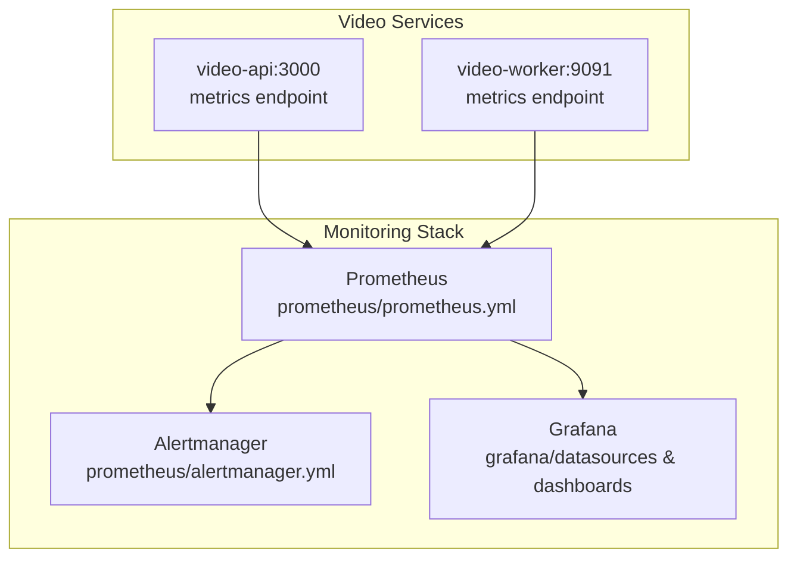
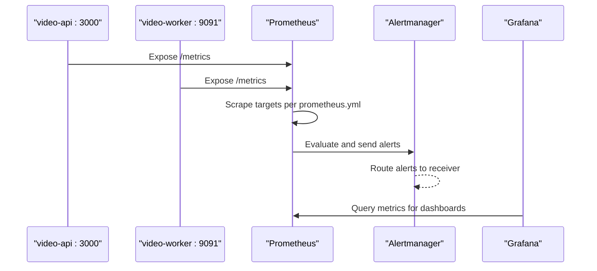
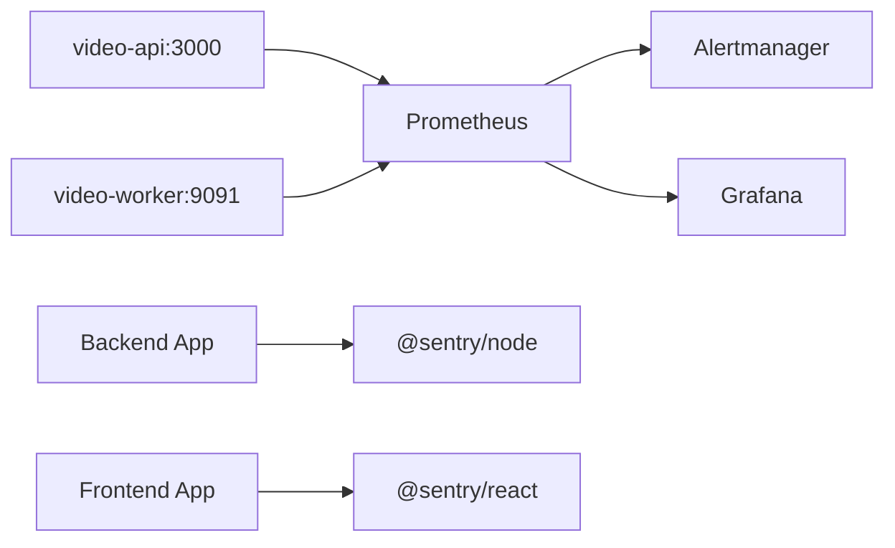

# Monitoring and Observability

<cite>
**Referenced Files in This Document**
- [docker-compose.monitoring.yml](file://docker-compose.monitoring.yml)
- [prometheus.yml](file://prometheus/prometheus.yml)
- [alertmanager.yml](file://prometheus/alertmanager.yml)
- [alerts.yml](file://prometheus/alerts.yml)
- [datasource.yml](file://grafana/datasources/datasource.yml)
- [video_dashboard.json](file://grafana/dashboards/video_dashboard.json)
- [sentry.js](file://backend/utils/sentry.js)
- [sentry.ts](file://frontend/src/utils/sentry.ts)
- [package.json](file://backend/package.json)
- [package.json](file://frontend/package.json)
- [metrics.js](file://services/video/api/metrics.js)
- [metrics.js](file://services/video/worker/metrics.js)
- [prometheus.yml](file://infrastructure/monitoring/prometheus.yml)
</cite>

## Table of Contents
1. [Introduction](#introduction)
2. [Project Structure](#project-structure)
3. [Core Components](#core-components)
4. [Architecture Overview](#architecture-overview)
5. [Detailed Component Analysis](#detailed-component-analysis)
6. [Dependency Analysis](#dependency-analysis)
7. [Performance Considerations](#performance-considerations)
8. [Troubleshooting Guide](#troubleshooting-guide)
9. [Conclusion](#conclusion)
10. [Appendices](#appendices)

## Introduction
This document describes the monitoring and observability stack for the platform, including Prometheus for metrics scraping and alerting, Alertmanager for alert routing, and Grafana for dashboards. It also documents the error tracking setup with Sentry for both frontend and backend applications, performance monitoring via Web Vitals integration, and custom metrics collection for video services. Guidance is included for configuring dashboards, alerting rules, notification channels, and operational best practices.

## Project Structure
The monitoring stack is orchestrated via a dedicated compose file that provisions Prometheus, Alertmanager, and Grafana. Metrics are exposed by the video API and worker services, and Grafana is provisioned with a default Prometheus data source and a dashboard for video processing.

**Diagram sources**
- [docker-compose.monitoring.yml:4-53](file://docker-compose.monitoring.yml#L4-L53)
- [prometheus.yml:15-28](file://prometheus/prometheus.yml#L15-L28)
- [datasource.yml:4-10](file://grafana/datasources/datasource.yml#L4-L10)
- [video_dashboard.json:1-50](file://grafana/dashboards/video_dashboard.json#L1-L50)

**Section sources**
- [docker-compose.monitoring.yml:1-63](file://docker-compose.monitoring.yml#L1-L63)
- [prometheus.yml:1-29](file://prometheus/prometheus.yml#L1-L29)
- [alertmanager.yml:1-16](file://prometheus/alertmanager.yml#L1-L16)
- [datasource.yml:1-11](file://grafana/datasources/datasource.yml#L1-L11)
- [video_dashboard.json:1-51](file://grafana/dashboards/video_dashboard.json#L1-L51)

## Core Components
- Prometheus: Scrapes metrics from video API and worker, evaluates alert rules, and persists data.
- Alertmanager: Receives alerts from Prometheus and routes them to configured receivers.
- Grafana: Visualizes metrics from Prometheus with pre-provisioned dashboards and data source.
- Sentry (backend): Centralized error tracking initialized with environment configuration.
- Sentry (frontend): Browser-side error and performance monitoring with sampling and session replay.
- Video Metrics: Custom metrics for uploads, queue depth, processing time, errors, and streaming.

**Section sources**
- [prometheus.yml:1-29](file://prometheus/prometheus.yml#L1-L29)
- [alertmanager.yml:1-16](file://prometheus/alertmanager.yml#L1-L16)
- [datasource.yml:1-11](file://grafana/datasources/datasource.yml#L1-L11)
- [video_dashboard.json:1-51](file://grafana/dashboards/video_dashboard.json#L1-L51)
- [sentry.js:1-22](file://backend/utils/sentry.js#L1-L22)
- [sentry.ts:1-35](file://frontend/src/utils/sentry.ts#L1-L35)
- [metrics.js:1-79](file://services/video/api/metrics.js#L1-L79)
- [metrics.js:1-44](file://services/video/worker/metrics.js#L1-L44)

## Architecture Overview
The monitoring pipeline collects metrics from services, stores them in Prometheus, evaluates alert rules, and forwards notifications to Alertmanager. Grafana queries Prometheus to render dashboards.

**Diagram sources**
- [prometheus.yml:15-28](file://prometheus/prometheus.yml#L15-L28)
- [alertmanager.yml:5-15](file://prometheus/alertmanager.yml#L5-L15)
- [datasource.yml:4-10](file://grafana/datasources/datasource.yml#L4-L10)

## Detailed Component Analysis

### Prometheus Configuration
- Global scrape and evaluation intervals are defined.
- Alerting configuration points to Alertmanager.
- Scrapes Prometheus itself and two video service targets with explicit metrics paths.

Key configuration highlights:
- Scrape interval and evaluation interval
- Alertmanager target discovery
- Target jobs for video-api and video-worker with metrics endpoints

**Section sources**
- [prometheus.yml:1-29](file://prometheus/prometheus.yml#L1-L29)

### Alertmanager Configuration
- Global resolution timeout and routing configuration.
- Grouping and timing for alerts.
- Receiver configured to forward to a webhook endpoint.

Operational notes:
- Adjust repeat interval and webhook URL for production environments.
- Ensure the webhook endpoint is reachable and secured.

**Section sources**
- [alertmanager.yml:1-16](file://prometheus/alertmanager.yml#L1-L16)

### Alerting Rules
Predefined alert groups for video processing:
- Queue depth threshold exceeded
- High error rate over processing volume
- Slow encoding for specific quality
- GPU utilization detection
- Rapid storage growth

Each rule defines conditions, durations, severity labels, and annotations with contextual values.

**Section sources**
- [alerts.yml:1-65](file://prometheus/alerts.yml#L1-L65)

### Grafana Provisioning and Dashboard
- Prometheus data source is provisioned as default.
- Dashboards are mounted and loaded automatically.
- Dashboard panels include queue depth, processing time heatmaps, error rates, and throughput.

Dashboard panels:
- Queue depth stat panel with thresholds
- Heatmap of processing time by quality
- Timeseries of error rates
- Timeseries of stream throughput

**Section sources**
- [datasource.yml:1-11](file://grafana/datasources/datasource.yml#L1-L11)
- [video_dashboard.json:1-51](file://grafana/dashboards/video_dashboard.json#L1-L51)

### Backend Sentry Setup
- Initializes Sentry with DSN from environment variables.
- Sets environment and tracing sampling.
- Disabled if DSN is missing; logs a warning.

Integration points:
- Import and initialize Sentry early in the backend lifecycle.
- Use standardized error capture utilities.

**Section sources**
- [sentry.js:1-22](file://backend/utils/sentry.js#L1-L22)
- [package.json:16-39](file://backend/package.json#L16-L39)

### Frontend Sentry Setup
- Initializes Sentry with browser and React integrations.
- Enables Tracing and Session Replay with sampling rates.
- Environment is derived from build mode.
- Provides helpers for correlation tagging and error capture.

Integration points:
- Initialize Sentry during app bootstrap.
- Wrap top-level error boundaries and route guards as appropriate.

**Section sources**
- [sentry.ts:1-35](file://frontend/src/utils/sentry.ts#L1-L35)
- [package.json:12-33](file://frontend/package.json#L12-L33)

### Video Metrics Collection
Two service components expose metrics via a shared registry:
- video-api metrics module exports upload, queue depth, processing time, error, and streaming counters/histograms.
- video-worker metrics module exports queue depth, processing time, and error counters.

Metric definitions:
- video_upload_duration_seconds (histogram)
- video_upload_bytes_total (counter)
- video_queue_depth (gauge)
- video_processing_duration_seconds (histogram with labels)
- video_processing_errors_total (counter with labels)
- video_stream_requests_total (counter with labels)
- video_stream_bytes_total (counter with labels)

These metrics are scraped by Prometheus and used by alert rules and dashboards.

**Section sources**
- [metrics.js:1-79](file://services/video/api/metrics.js#L1-L79)
- [metrics.js:1-44](file://services/video/worker/metrics.js#L1-L44)

### Infrastructure-Level Prometheus
An additional monitoring configuration exists under infrastructure for broader service coverage, including streaming server.

**Section sources**
- [prometheus.yml:1-11](file://infrastructure/monitoring/prometheus.yml#L1-L11)

## Dependency Analysis
The monitoring stack components depend on each other as follows:
- Prometheus depends on targets exposing metrics endpoints.
- Alertmanager depends on Prometheus for alert emission.
- Grafana depends on Prometheus as a data source.
- Sentry libraries are integrated into backend and frontend applications.

**Diagram sources**
- [prometheus.yml:15-28](file://prometheus/prometheus.yml#L15-L28)
- [alertmanager.yml:10-15](file://prometheus/alertmanager.yml#L10-L15)
- [datasource.yml:4-10](file://grafana/datasources/datasource.yml#L4-L10)
- [sentry.js:1-22](file://backend/utils/sentry.js#L1-L22)
- [sentry.ts:1-35](file://frontend/src/utils/sentry.ts#L1-L35)

**Section sources**
- [prometheus.yml:1-29](file://prometheus/prometheus.yml#L1-L29)
- [alertmanager.yml:1-16](file://prometheus/alertmanager.yml#L1-L16)
- [datasource.yml:1-11](file://grafana/datasources/datasource.yml#L1-L11)
- [sentry.js:1-22](file://backend/utils/sentry.js#L1-L22)
- [sentry.ts:1-35](file://frontend/src/utils/sentry.ts#L1-L35)

## Performance Considerations
- Use appropriate histogram buckets for processing duration to balance precision and cardinality.
- Tune scrape intervals and retention to match data volume and storage capacity.
- Limit alert grouping and repetition intervals to avoid notification storms.
- Enable selective sampling for performance monitoring to control overhead.

[No sources needed since this section provides general guidance]

## Troubleshooting Guide
Common issues and resolutions:
- Prometheus cannot reach targets:
  - Verify service names and ports in scrape configs.
  - Confirm network connectivity and container health.
- Alerts not firing:
  - Check rule expressions and thresholds.
  - Validate Alertmanager route configuration and receiver URL.
- Grafana shows no data:
  - Confirm Prometheus data source URL and availability.
  - Ensure dashboards are provisioned and loaded.
- Sentry not capturing errors:
  - Verify DSN environment variables are set.
  - Check initialization order and environment mode.
- Metrics missing in dashboards:
  - Confirm metrics are exported and labeled consistently.
  - Validate Prometheus scrape job and target reachability.

**Section sources**
- [prometheus.yml:15-28](file://prometheus/prometheus.yml#L15-L28)
- [alertmanager.yml:5-15](file://prometheus/alertmanager.yml#L5-L15)
- [datasource.yml:4-10](file://grafana/datasources/datasource.yml#L4-L10)
- [sentry.js:4-9](file://backend/utils/sentry.js#L4-L9)
- [sentry.ts:4-9](file://frontend/src/utils/sentry.ts#L4-L9)

## Conclusion
The monitoring stack integrates Prometheus, Alertmanager, and Grafana with Sentry-based error tracking for both backend and frontend. Custom metrics for video services enable robust alerting and visualization. By following the setup instructions and operational guidance here, teams can maintain visibility, reliability, and performance across the platform.

[No sources needed since this section summarizes without analyzing specific files]

## Appendices

### Setup Instructions
- Start the monitoring stack:
  - Use the monitoring compose file to launch Prometheus, Alertmanager, and Grafana.
  - Ensure volumes and ports are mapped as configured.
- Configure Prometheus:
  - Place prometheus.yml and alerts.yml in the prometheus directory.
  - Confirm scrape jobs for video-api and video-worker.
- Configure Alertmanager:
  - Update alertmanager.yml with desired receiver URLs and routing.
- Configure Grafana:
  - Mount dashboards and datasources as shown in provisioning files.
  - Access Grafana at the configured port and log in with the admin password.
- Enable Sentry:
  - Set DSN environment variables for backend and frontend.
  - Initialize Sentry in application startup code.

**Section sources**
- [docker-compose.monitoring.yml:4-53](file://docker-compose.monitoring.yml#L4-L53)
- [prometheus.yml:1-29](file://prometheus/prometheus.yml#L1-L29)
- [alertmanager.yml:1-16](file://prometheus/alertmanager.yml#L1-L16)
- [datasource.yml:1-11](file://grafana/datasources/datasource.yml#L1-L11)
- [sentry.js:3-15](file://backend/utils/sentry.js#L3-L15)
- [sentry.ts:3-23](file://frontend/src/utils/sentry.ts#L3-L23)

### Metric Definitions
- video_upload_duration_seconds: Histogram of chunk upload durations with status labels.
- video_upload_bytes_total: Counter of total uploaded bytes with user_id labels.
- video_queue_depth: Gauge of pending processing jobs.
- video_processing_duration_seconds: Histogram of encoding time with quality/format/gpu_used labels.
- video_processing_errors_total: Counter of failed jobs with error_type and quality labels.
- video_stream_requests_total: Counter of stream requests with format/quality/status labels.
- video_stream_bytes_total: Counter of bytes streamed with format labels.

**Section sources**
- [metrics.js:10-62](file://services/video/api/metrics.js#L10-L62)
- [metrics.js:10-31](file://services/video/worker/metrics.js#L10-L31)

### Alerting Rules Reference
- VideoQueueBackingUp: Triggered when queue depth exceeds threshold for a sustained period.
- VideoProcessingHighErrorRate: Triggered when error rate exceeds percentage of processed jobs.
- VideoEncodingTooSlow: Triggered when 95th percentile encoding time exceeds threshold.
- GPUUnderutilized: Triggered when queue has work but GPU-accelerated processing is not detected.
- VideoStorageGrowingFast: Triggered when storage grows above a per-hour threshold.

Severity and annotations are defined per rule.

**Section sources**
- [alerts.yml:3-64](file://prometheus/alerts.yml#L3-L64)

### Dashboard Panels Reference
- Queue Depth: Stat panel with thresholds for jobs waiting.
- Processing Time by Quality: Heatmap of processing duration buckets by quality.
- Error Rate: Timeseries of error totals by type.
- Stream Throughput: Timeseries of bytes streamed by format.

**Section sources**
- [video_dashboard.json:4-47](file://grafana/dashboards/video_dashboard.json#L4-L47)

### Web Vitals Integration
- Frontend Sentry integration includes browser tracing and replay integrations.
- Sampling rates can be tuned to balance performance overhead and observability.
- Correlation IDs can be set to link frontend errors to backend traces.

**Section sources**
- [sentry.ts:11-23](file://frontend/src/utils/sentry.ts#L11-L23)
- [sentry.ts:26-34](file://frontend/src/utils/sentry.ts#L26-L34)

### Uptime Monitoring
- Consider adding external uptime checks (e.g., status pages, synthetic transactions) to complement internal metrics.
- Use Alertmanager to route uptime-related alerts to appropriate channels.

[No sources needed since this section provides general guidance]

### Custom Alerts and Operational Dashboards
- Extend alert rules in alerts.yml with domain-specific thresholds.
- Add new panels to Grafana dashboards using existing metric names.
- Ensure labels on metrics are consistent across services for reliable aggregation.

**Section sources**
- [alerts.yml:1-65](file://prometheus/alerts.yml#L1-L65)
- [video_dashboard.json:1-51](file://grafana/dashboards/video_dashboard.json#L1-L51)