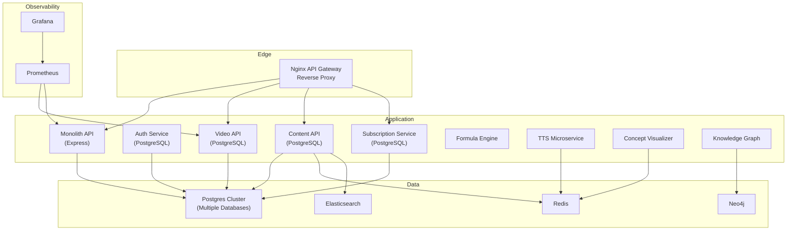
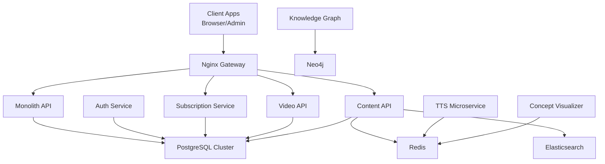
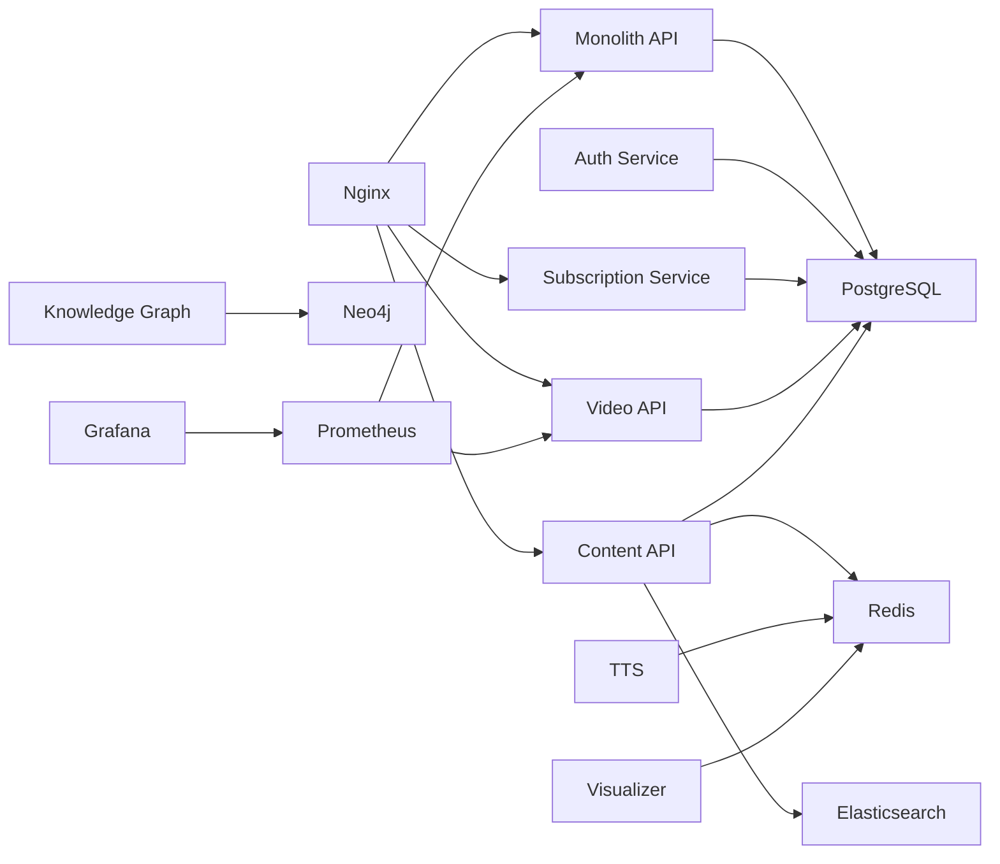

# Operational Procedures and Maintenance

<cite>
**Referenced Files in This Document**
- [DEPLOYMENT.md](file://docs/DEPLOYMENT.md)
- [MIGRATION_GUIDE.md](file://infrastructure/vps-migration/MIGRATION_GUIDE.md)
- [docker-compose.yml](file://infrastructure/docker-compose.yml)
- [backup.sh](file://infrastructure/vps-migration/scripts/backup.sh)
- [prometheus.yml](file://prometheus/prometheus.yml)
- [datasource.yml](file://grafana/datasources/datasource.yml)
- [nginx.conf](file://infrastructure/nginx/nginx.conf)
- [init-all-databases.sql](file://database/init-all-databases.sql)
- [init.sql](file://infrastructure/vps-migration/postgres/init.sql)
- [backend-ci.yml](file://.github/workflows/backend-ci.yml)
- [SETUP_GUIDE.md](file://docs/SETUP_GUIDE.md)
- [package.json](file://backend/package.json)
</cite>

## Table of Contents
1. [Introduction](#introduction)
2. [Project Structure](#project-structure)
3. [Core Components](#core-components)
4. [Architecture Overview](#architecture-overview)
5. [Detailed Component Analysis](#detailed-component-analysis)
6. [Dependency Analysis](#dependency-analysis)
7. [Performance Considerations](#performance-considerations)
8. [Troubleshooting Guide](#troubleshooting-guide)
9. [Conclusion](#conclusion)
10. [Appendices](#appendices)

## Introduction
This document defines comprehensive operational procedures for day-to-day operations, maintenance, and incident response for the QuantumMint Bookstore platform. It consolidates backup strategies, disaster recovery, capacity planning, scaling, maintenance windows, on-call rotation, support workflows, runbooks for common scenarios, performance tuning, security hardening, database migrations, service upgrades, and emergency response protocols with escalation paths and communications.

## Project Structure
The platform is composed of:
- A unified Docker Compose environment orchestrating API gateways, microservices, databases, caches, search, and monitoring.
- A frontend and admin dashboard served via Nginx.
- A multi-database schema supporting core, video, audiobook, and subscription domains.
- CI/CD automation via GitHub Actions.
- Monitoring stack with Prometheus and Grafana.

**Diagram sources**
- [docker-compose.yml:1-373](file://infrastructure/docker-compose.yml#L1-L373)
- [nginx.conf:1-49](file://infrastructure/nginx/nginx.conf#L1-L49)
- [prometheus.yml:1-29](file://prometheus/prometheus.yml#L1-L29)
- [datasource.yml:1-11](file://grafana/datasources/datasource.yml#L1-L11)

**Section sources**
- [docker-compose.yml:1-373](file://infrastructure/docker-compose.yml#L1-L373)
- [nginx.conf:1-49](file://infrastructure/nginx/nginx.conf#L1-L49)

## Core Components
- API Gateway and Reverse Proxy: Nginx routes traffic to backend services and serves static assets.
- Monolith API: Central backend written in Node.js/Express with database connectivity and middleware.
- Microservices: Auth, Subscription, Video, Content, TTS, Formula Engine, Concept Visualizer, Knowledge Graph.
- Data Layer: PostgreSQL cluster with multiple logical databases; Redis for caching; Elasticsearch for search; Neo4j for graph.
- Observability: Prometheus scraping metrics; Grafana dashboard connected to Prometheus.
- CI/CD: GitHub Actions workflows for backend and voice profile tests.

**Section sources**
- [docker-compose.yml:1-373](file://infrastructure/docker-compose.yml#L1-L373)
- [backend/package.json:1-52](file://backend/package.json#L1-L52)
- [prometheus.yml:1-29](file://prometheus/prometheus.yml#L1-L29)
- [datasource.yml:1-11](file://grafana/datasources/datasource.yml#L1-L11)
- [.github/workflows/backend-ci.yml:1-58](file://.github/workflows/backend-ci.yml#L1-L58)

## Architecture Overview
The platform uses a hybrid monolith-gateway plus microservices pattern. Nginx acts as the API gateway and reverse proxy, routing requests to specialized services. PostgreSQL hosts multiple logical databases for different domains. Redis, Elasticsearch, and Neo4j support caching, search, and knowledge graph workloads. Prometheus and Grafana provide observability.

**Diagram sources**
- [docker-compose.yml:1-373](file://infrastructure/docker-compose.yml#L1-L373)
- [nginx.conf:1-49](file://infrastructure/nginx/nginx.conf#L1-L49)

## Detailed Component Analysis

### Backup Strategy
- Database backups: Scheduled automated dumps of PostgreSQL databases with retention policies.
- File storage synchronization: Archive and retain generated content and uploads.
- Retention policy: Daily backups kept for a week; weekly and monthly archives retained per policy.

Operational steps:
- Schedule a daily cron job to dump each logical database and compress the output.
- Archive uploaded content (e.g., videos, audiobooks, ebooks) to offsite storage.
- Enforce retention by deleting backups older than the defined period.
- Validate backup integrity periodically and test restore procedures.

**Section sources**
- [DEPLOYMENT.md:675-700](file://docs/DEPLOYMENT.md#L675-L700)
- [MIGRATION_GUIDE.md:91-98](file://infrastructure/vps-migration/MIGRATION_GUIDE.md#L91-L98)
- [backup.sh:1-19](file://infrastructure/vps-migration/scripts/backup.sh#L1-L19)

### Disaster Recovery Procedures
- Recovery from database failure: Restore from the most recent backup; replay logs if applicable; validate data consistency.
- Recovery from file storage failure: Recreate missing directories and re-upload content from CDN or local archives.
- Recovery from service outage: Restart failed containers; verify network connectivity; confirm health checks pass.
- Rollback strategy: Use Vercel or manual rollback to previous releases; revert database migrations as needed.

**Section sources**
- [DEPLOYMENT.md:579-616](file://docs/DEPLOYMENT.md#L579-L616)
- [MIGRATION_GUIDE.md:105-108](file://infrastructure/vps-migration/MIGRATION_GUIDE.md#L105-L108)

### Capacity Planning and Scaling
- Horizontal scaling: Use Docker Compose with multiple replicas for stateless services; place a load balancer in front of the gateway.
- Vertical scaling: Increase CPU/RAM for database and compute-intensive services (e.g., video processor).
- Database scaling: Separate read replicas for reporting; shard by domain if needed; optimize queries and indexes.
- Caching: Tune Redis memory limits and eviction policies; monitor hit ratios.
- CDN and edge: Distribute static assets globally; configure caching headers.

**Section sources**
- [DEPLOYMENT.md:649-672](file://docs/DEPLOYMENT.md#L649-L672)
- [docker-compose.yml:1-373](file://infrastructure/docker-compose.yml#L1-L373)

### Maintenance Windows and On-Call Rotation
- Maintenance windows: Schedule during low-traffic periods (e.g., Sunday 2–4 AM GMT); notify stakeholders in advance.
- On-call rotation: Assign team members to monitor alerts, respond to incidents, and perform emergency fixes; use PagerDuty and Slack.
- Communication: Update status page during planned maintenance; document postmortems after incidents.

**Section sources**
- [DEPLOYMENT.md:701-726](file://docs/DEPLOYMENT.md#L701-L726)

### Support Workflows
- Ticketing: Route issues to appropriate teams (frontend, backend, video, content).
- Escalation: Define clear escalation paths (Tier 1 → Tier 2 → Tier 3) with SLAs.
- Knowledge base: Maintain runbooks and FAQs for common issues.

[No sources needed since this section provides general guidance]

### Operational Runbooks

#### Database Migration
- Preparation: Back up target databases; freeze writes if necessary; validate prerequisites.
- Execution: Run migration scripts against each logical database; verify schema changes.
- Rollback: Revert to previous version using migration rollback commands; restore backups if needed.
- Validation: Run smoke tests and verify data integrity.

**Section sources**
- [DEPLOYMENT.md:607-616](file://docs/DEPLOYMENT.md#L607-L616)
- [init-all-databases.sql:1-470](file://database/init-all-databases.sql#L1-L470)
- [init.sql:1-88](file://infrastructure/vps-migration/postgres/init.sql#L1-L88)

#### Service Upgrade
- Pre-check: Ensure tests pass; verify environment variables; prepare rollback plan.
- Deploy: Use CI/CD to deploy; monitor health endpoints; validate metrics.
- Post-deploy: Run smoke tests; check error rates and performance; update documentation.

**Section sources**
- [DEPLOYMENT.md:510-576](file://docs/DEPLOYMENT.md#L510-L576)
- [.github/workflows/backend-ci.yml:1-58](file://.github/workflows/backend-ci.yml#L1-L58)

#### Emergency Response Protocol
- Incident classification: Categorize by severity and impact.
- Activation: Notify on-call; engage stakeholders; activate runbooks.
- Containment: Isolate affected services; roll back risky changes; apply hotfixes.
- Resolution: Fix root cause; validate fix; communicate resolution.
- Postmortem: Document timeline, actions, and improvements.

**Section sources**
- [DEPLOYMENT.md:701-726](file://docs/DEPLOYMENT.md#L701-L726)

### Performance Tuning Guidelines
- Database: Add missing indexes; optimize slow queries; monitor locks; tune connection pooling.
- Caching: Increase Redis memory; set TTLs; monitor cache hit ratio; invalidate stale entries.
- Search: Adjust Elasticsearch heap size; tune refresh intervals; optimize analyzers.
- Gateway: Tune Nginx worker connections; enable compression; set timeouts.
- Observability: Increase scrape intervals for noisy services; filter noisy metrics; set meaningful alerts.

**Section sources**
- [init-all-databases.sql:1-470](file://database/init-all-databases.sql#L1-L470)
- [init.sql:67-88](file://infrastructure/vps-migration/postgres/init.sql#L67-L88)
- [nginx.conf:1-49](file://infrastructure/nginx/nginx.conf#L1-L49)
- [prometheus.yml:1-29](file://prometheus/prometheus.yml#L1-L29)

### Security Hardening Procedures
- Secrets management: Store secrets in environment variables or secret managers; never commit to repo.
- Transport security: Enforce HTTPS; configure HSTS; use strong TLS ciphers.
- Network security: Restrict inbound ports; enable firewalls; segment networks.
- Application security: Apply rate limiting; enforce CORS; sanitize inputs; rotate JWT secrets.
- Email security: Configure SPF/DKIM/DMARC; monitor bounce/reports; rate limit webhooks.

**Section sources**
- [DEPLOYMENT.md:401-442](file://docs/DEPLOYMENT.md#L401-L442)
- [SETUP_GUIDE.md:300-312](file://docs/SETUP_GUIDE.md#L300-L312)

## Dependency Analysis
The system exhibits layered dependencies:
- Gateway depends on backend services.
- Backend services depend on PostgreSQL, Redis, Elasticsearch, and Neo4j.
- Observability depends on Prometheus scraping metrics from services and Grafana for dashboards.

**Diagram sources**
- [docker-compose.yml:1-373](file://infrastructure/docker-compose.yml#L1-L373)
- [prometheus.yml:1-29](file://prometheus/prometheus.yml#L1-L29)
- [datasource.yml:1-11](file://grafana/datasources/datasource.yml#L1-L11)

**Section sources**
- [docker-compose.yml:1-373](file://infrastructure/docker-compose.yml#L1-L373)
- [prometheus.yml:1-29](file://prometheus/prometheus.yml#L1-L29)
- [datasource.yml:1-11](file://grafana/datasources/datasource.yml#L1-L11)

## Performance Considerations
- Database: Use UUID primary keys; add selective indexes; partition large tables; batch writes.
- Caching: Cache frequently accessed metadata; cache TTS audio URLs; invalidate on content updates.
- Search: Use Elasticsearch analyzers tuned for content; precompute aggregations; paginate results.
- Gateway: Enable gzip/HTTP/2; cache static assets; set upstream timeouts.
- Observability: Reduce cardinality of labels; sample traces selectively; alert on SLO breaches.

[No sources needed since this section provides general guidance]

## Troubleshooting Guide
Common scenarios and resolutions:
- Database connectivity: Verify connection strings; check service health; confirm credentials.
- Slow queries: Inspect query plans; add indexes; rewrite inefficient queries.
- Cache misses: Validate cache keys; adjust TTLs; monitor eviction policies.
- Service outages: Check container logs; restart unhealthy services; verify dependencies.
- Monitoring gaps: Confirm Prometheus targets; validate metric endpoints; check Grafana data source.

**Section sources**
- [SETUP_GUIDE.md:313-342](file://docs/SETUP_GUIDE.md#L313-L342)

## Conclusion
This document establishes repeatable operational procedures for maintaining and evolving the QuantumMint Bookstore platform. By following the outlined backup, DR, capacity planning, maintenance windows, on-call, runbooks, performance tuning, and security practices, the team can sustain reliability, performance, and security across environments.

[No sources needed since this section summarizes without analyzing specific files]

## Appendices

### Appendix A: Monitoring and Alerting
- Prometheus jobs for video API and worker metrics; Grafana data source configured to Prometheus.
- Set SLO-based alerts for uptime, error rate, latency, and throughput.

**Section sources**
- [prometheus.yml:1-29](file://prometheus/prometheus.yml#L1-L29)
- [datasource.yml:1-11](file://grafana/datasources/datasource.yml#L1-L11)

### Appendix B: CI/CD and Pre-deployment Checks
- GitHub Actions workflow runs backend tests and optional audit.
- Pre-deployment checks include linting, type checking, tests, and builds.

**Section sources**
- [.github/workflows/backend-ci.yml:1-58](file://.github/workflows/backend-ci.yml#L1-L58)
- [DEPLOYMENT.md:556-576](file://docs/DEPLOYMENT.md#L556-L576)