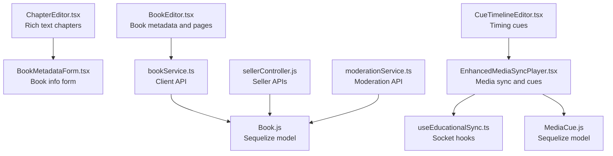
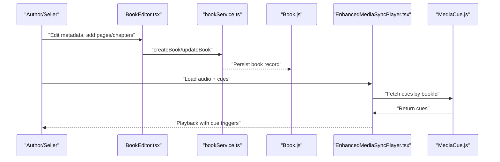
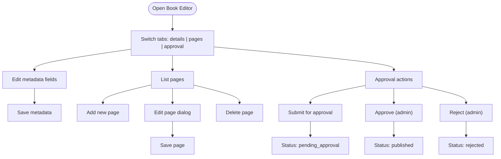
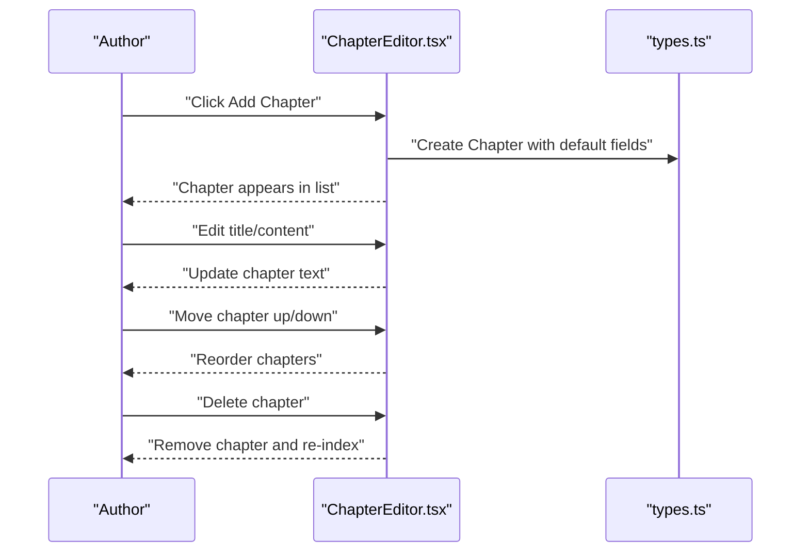
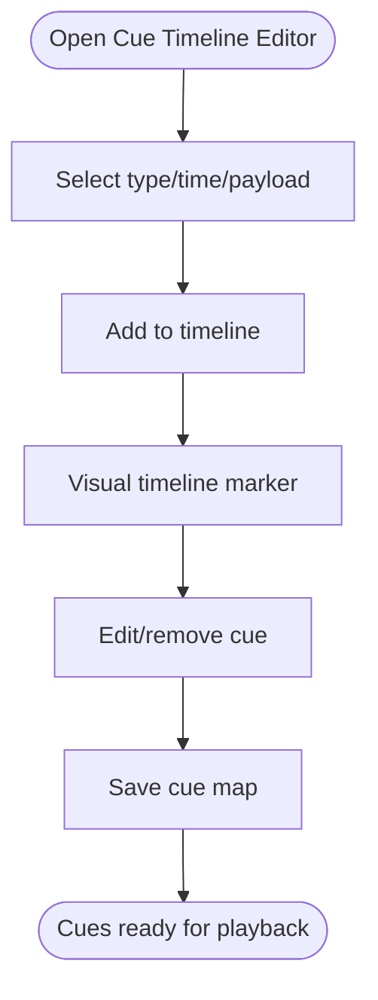
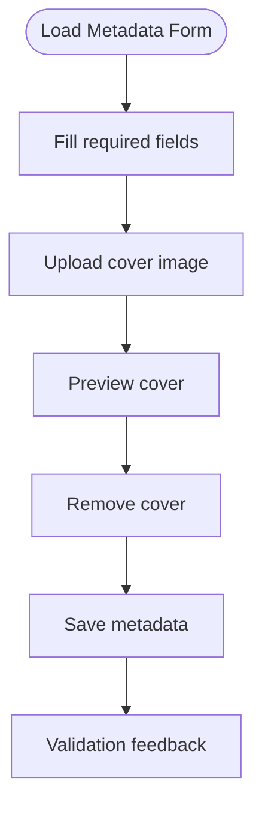
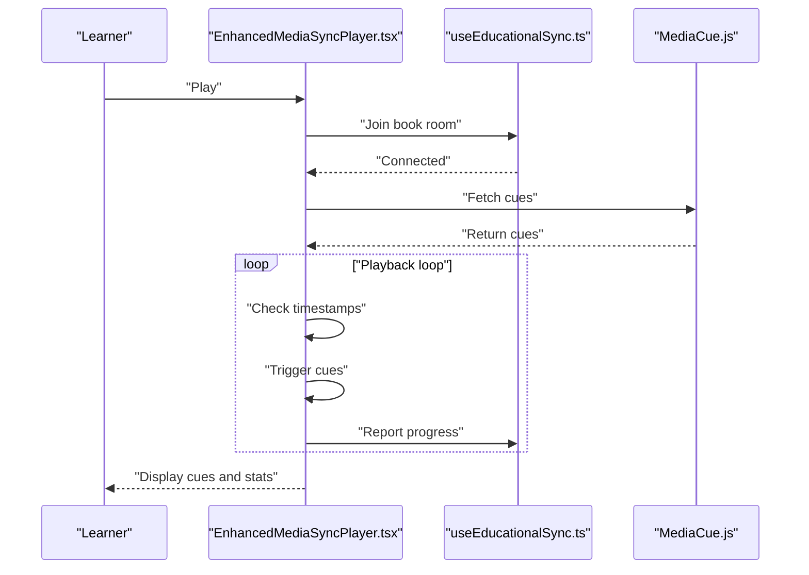
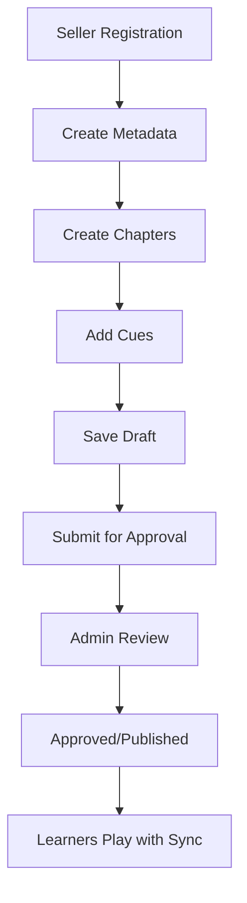
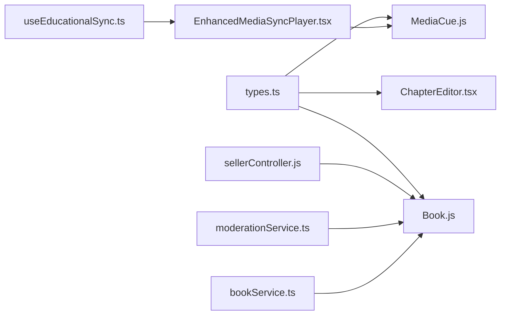

# Content Creation Tools

<cite>
**Referenced Files in This Document**
- [BookEditor.tsx](file://frontend/src/pages/BookEditor.tsx)
- [ChapterEditor.tsx](file://frontend/src/components/ChapterEditor.tsx)
- [CueTimelineEditor.tsx](file://frontend/src/components/CueTimelineEditor.tsx)
- [BookMetadataForm.tsx](file://frontend/src/components/BookMetadataForm.tsx)
- [EnhancedMediaSyncPlayer.tsx](file://frontend/src/components/EnhancedMediaSyncPlayer.tsx)
- [bookService.ts](file://frontend/src/api/services/bookService.ts)
- [types.ts](file://frontend/src/types/types.ts)
- [Book.js](file://backend/models/Book.js)
- [MediaCue.js](file://backend/models/MediaCue.js)
- [sellerController.js](file://backend/controllers/sellerController.js)
- [moderationService.ts](file://frontend/src/api/services/moderationService.ts)
- [useEducationalSync.ts](file://frontend/src/hooks/useEducationalSync.ts)
</cite>

## Table of Contents
1. [Introduction](#introduction)
2. [Project Structure](#project-structure)
3. [Core Components](#core-components)
4. [Architecture Overview](#architecture-overview)
5. [Detailed Component Analysis](#detailed-component-analysis)
6. [Dependency Analysis](#dependency-analysis)
7. [Performance Considerations](#performance-considerations)
8. [Troubleshooting Guide](#troubleshooting-guide)
9. [Conclusion](#conclusion)
10. [Appendices](#appendices)

## Introduction
This document describes the content creation and editing tools for the bookstore platform. It covers the book editor interface, chapter management, content structuring, chapter editor with rich text formatting and media integration, the cue timeline editor for precise timing control, book metadata forms, content validation and quality assurance, the end-to-end content creation workflow, examples of templates and formatting options, and advanced features such as content moderation, version control, and collaborative editing.

## Project Structure
The content creation tools span the frontend React application and the backend services:
- Frontend pages and components implement the editors and players.
- Backend models define the data structures for books and cues.
- Controllers expose seller and moderation APIs.
- Services encapsulate client-side API interactions.

**Diagram sources**
- [BookEditor.tsx:1-426](file://frontend/src/pages/BookEditor.tsx#L1-L426)
- [ChapterEditor.tsx:1-210](file://frontend/src/components/ChapterEditor.tsx#L1-L210)
- [CueTimelineEditor.tsx:1-152](file://frontend/src/components/CueTimelineEditor.tsx#L1-L152)
- [BookMetadataForm.tsx:1-171](file://frontend/src/components/BookMetadataForm.tsx#L1-L171)
- [EnhancedMediaSyncPlayer.tsx:1-577](file://frontend/src/components/EnhancedMediaSyncPlayer.tsx#L1-L577)
- [bookService.ts:1-47](file://frontend/src/api/services/bookService.ts#L1-L47)
- [Book.js:1-92](file://backend/models/Book.js#L1-L92)
- [MediaCue.js:1-49](file://backend/models/MediaCue.js#L1-L49)
- [sellerController.js:1-211](file://backend/controllers/sellerController.js#L1-L211)
- [useEducationalSync.ts](file://frontend/src/hooks/useEducationalSync.ts)

**Section sources**
- [BookEditor.tsx:1-426](file://frontend/src/pages/BookEditor.tsx#L1-L426)
- [ChapterEditor.tsx:1-210](file://frontend/src/components/ChapterEditor.tsx#L1-L210)
- [CueTimelineEditor.tsx:1-152](file://frontend/src/components/CueTimelineEditor.tsx#L1-L152)
- [BookMetadataForm.tsx:1-171](file://frontend/src/components/BookMetadataForm.tsx#L1-L171)
- [EnhancedMediaSyncPlayer.tsx:1-577](file://frontend/src/components/EnhancedMediaSyncPlayer.tsx#L1-L577)
- [bookService.ts:1-47](file://frontend/src/api/services/bookService.ts#L1-L47)
- [Book.js:1-92](file://backend/models/Book.js#L1-L92)
- [MediaCue.js:1-49](file://backend/models/MediaCue.js#L1-L49)
- [sellerController.js:1-211](file://backend/controllers/sellerController.js#L1-L211)
- [useEducationalSync.ts](file://frontend/src/hooks/useEducationalSync.ts)

## Core Components
- Book Editor: Manages book metadata, pages, and submission/approval lifecycle.
- Chapter Editor: Creates and edits chapters with rich text, ordering, and word count estimation.
- Cue Timeline Editor: Adds visual/formula/step cues synchronized to audio timing.
- Book Metadata Form: Validates and captures essential book information with cover upload.
- Enhanced Media Sync Player: Plays synchronized media, triggers cues, adaptive pacing, and PayGO billing.
- Book Service: Client API for CRUD operations on books.
- Backend Models: Book and MediaCue Sequelize models.
- Seller Controller: Seller registration, earnings, and voice profile retrieval.
- Moderation Service: Content moderation endpoints for admin workflows.
- Educational Sync Hook: Socket-based collaboration and cue synchronization.

**Section sources**
- [BookEditor.tsx:30-140](file://frontend/src/pages/BookEditor.tsx#L30-L140)
- [ChapterEditor.tsx:14-75](file://frontend/src/components/ChapterEditor.tsx#L14-L75)
- [CueTimelineEditor.tsx:6-31](file://frontend/src/components/CueTimelineEditor.tsx#L6-L31)
- [BookMetadataForm.tsx:32-46](file://frontend/src/components/BookMetadataForm.tsx#L32-L46)
- [EnhancedMediaSyncPlayer.tsx:28-155](file://frontend/src/components/EnhancedMediaSyncPlayer.tsx#L28-L155)
- [bookService.ts:4-46](file://frontend/src/api/services/bookService.ts#L4-L46)
- [Book.js:4-88](file://backend/models/Book.js#L4-L88)
- [MediaCue.js:4-45](file://backend/models/MediaCue.js#L4-L45)
- [sellerController.js:7-50](file://backend/controllers/sellerController.js#L7-L50)
- [moderationService.ts:6-44](file://frontend/src/api/services/moderationService.ts#L6-L44)
- [useEducationalSync.ts](file://frontend/src/hooks/useEducationalSync.ts)

## Architecture Overview
The content creation workflow integrates frontend editors with backend models and services. Editors capture structured content and metadata, persist via API, and synchronize cues during playback.

**Diagram sources**
- [BookEditor.tsx:82-124](file://frontend/src/pages/BookEditor.tsx#L82-L124)
- [bookService.ts:22-31](file://frontend/src/api/services/bookService.ts#L22-L31)
- [Book.js:4-88](file://backend/models/Book.js#L4-L88)
- [EnhancedMediaSyncPlayer.tsx:54-155](file://frontend/src/components/EnhancedMediaSyncPlayer.tsx#L54-L155)
- [MediaCue.js:4-45](file://backend/models/MediaCue.js#L4-L45)

## Detailed Component Analysis

### Book Editor
The Book Editor manages book metadata, pages, and approval lifecycle. It supports:
- Editing metadata fields (title, author, description, category, prices, cover).
- Managing pages with title, content, audio URL, and duration.
- Submitting for approval and admin actions (approve/reject).
- Status badges and rejection reasons.

**Diagram sources**
- [BookEditor.tsx:30-140](file://frontend/src/pages/BookEditor.tsx#L30-L140)

**Section sources**
- [BookEditor.tsx:30-140](file://frontend/src/pages/BookEditor.tsx#L30-L140)

### Chapter Editor
The Chapter Editor provides a rich text editor for chapters with:
- Chapter list sidebar with add/move/delete actions.
- Rich text editing with formatting toolbar.
- Word count and estimated reading time.
- Ordering via up/down arrows.

**Diagram sources**
- [ChapterEditor.tsx:22-68](file://frontend/src/components/ChapterEditor.tsx#L22-L68)
- [types.ts:55-63](file://frontend/src/types/types.ts#L55-L63)

**Section sources**
- [ChapterEditor.tsx:14-75](file://frontend/src/components/ChapterEditor.tsx#L14-L75)
- [types.ts:55-63](file://frontend/src/types/types.ts#L55-L63)

### Cue Timeline Editor
The Cue Timeline Editor enables precise synchronization of cues to audio:
- Add cues with type (formula, visual, step), timestamp (ms), and payload.
- Visual timeline with draggable cue markers.
- Cue list with remove actions.
- Save callback for persisted cue map.

**Diagram sources**
- [CueTimelineEditor.tsx:6-31](file://frontend/src/components/CueTimelineEditor.tsx#L6-L31)
- [CueTimelineEditor.tsx:94-149](file://frontend/src/components/CueTimelineEditor.tsx#L94-L149)

**Section sources**
- [CueTimelineEditor.tsx:6-31](file://frontend/src/components/CueTimelineEditor.tsx#L6-L31)
- [CueTimelineEditor.tsx:94-149](file://frontend/src/components/CueTimelineEditor.tsx#L94-L149)

### Book Metadata Form
The Book Metadata Form captures essential book information:
- Title, author, genre, description.
- Cover image upload with preview and removal.
- Required fields enforcement and character counters.

**Diagram sources**
- [BookMetadataForm.tsx:32-46](file://frontend/src/components/BookMetadataForm.tsx#L32-L46)
- [BookMetadataForm.tsx:129-166](file://frontend/src/components/BookMetadataForm.tsx#L129-L166)

**Section sources**
- [BookMetadataForm.tsx:32-46](file://frontend/src/components/BookMetadataForm.tsx#L32-L46)
- [BookMetadataForm.tsx:129-166](file://frontend/src/components/BookMetadataForm.tsx#L129-L166)

### Enhanced Media Sync Player
The Enhanced Media Sync Player synchronizes playback with cues:
- Playback controls, seek bar, volume, and speed.
- Adaptive pacing based on cue complexity.
- PayGO session management and cost calculation.
- Real-time cue display and active cues list.
- Educational sync via sockets for collaborative features.

**Diagram sources**
- [EnhancedMediaSyncPlayer.tsx:28-155](file://frontend/src/components/EnhancedMediaSyncPlayer.tsx#L28-L155)
- [useEducationalSync.ts](file://frontend/src/hooks/useEducationalSync.ts)
- [MediaCue.js:4-45](file://backend/models/MediaCue.js#L4-L45)

**Section sources**
- [EnhancedMediaSyncPlayer.tsx:28-155](file://frontend/src/components/EnhancedMediaSyncPlayer.tsx#L28-L155)
- [useEducationalSync.ts](file://frontend/src/hooks/useEducationalSync.ts)
- [MediaCue.js:4-45](file://backend/models/MediaCue.js#L4-L45)

### Content Validation and Quality Assurance
- Metadata form enforces required fields and provides character counts.
- Chapter editor estimates reading time and word counts.
- Book Editor validates submission states and rejection reasons.
- Moderation service supports automated and manual review workflows.

**Section sources**
- [BookMetadataForm.tsx:56-121](file://frontend/src/components/BookMetadataForm.tsx#L56-L121)
- [ChapterEditor.tsx:70-74](file://frontend/src/components/ChapterEditor.tsx#L70-L74)
- [BookEditor.tsx:131-140](file://frontend/src/pages/BookEditor.tsx#L131-L140)
- [moderationService.ts:6-44](file://frontend/src/api/services/moderationService.ts#L6-L44)

### Content Creation Workflow
End-to-end workflow from setup to publishing:
1. Author/Seller registers and sets up profile.
2. Create book metadata and cover.
3. Build chapters with rich text and media.
4. Add cues for formulas, visuals, and steps.
5. Save and submit for approval.
6. Admin approves and publishes.
7. Learners consume via the media sync player.

**Diagram sources**
- [sellerController.js:7-50](file://backend/controllers/sellerController.js#L7-L50)
- [BookEditor.tsx:82-124](file://frontend/src/pages/BookEditor.tsx#L82-L124)
- [EnhancedMediaSyncPlayer.tsx:54-155](file://frontend/src/components/EnhancedMediaSyncPlayer.tsx#L54-L155)

**Section sources**
- [sellerController.js:7-50](file://backend/controllers/sellerController.js#L7-L50)
- [BookEditor.tsx:82-124](file://frontend/src/pages/BookEditor.tsx#L82-L124)
- [EnhancedMediaSyncPlayer.tsx:54-155](file://frontend/src/components/EnhancedMediaSyncPlayer.tsx#L54-L155)

### Templates, Formatting Options, and Advanced Features
- Templates: Use the chapter editor’s default empty chapter and page templates to bootstrap content.
- Formatting: Rich text toolbar supports headers, bold, italic, lists, blockquotes, and code blocks.
- Media Integration: Embed images via chapter content; attach audio URLs in pages/chapters; link cue payloads to external assets.
- Advanced: Adaptive pacing adjusts playback speed based on cue complexity; collaborative editing via educational sync sockets; PayGO billing tracks session costs.

**Section sources**
- [ChapterEditor.tsx:162-177](file://frontend/src/components/ChapterEditor.tsx#L162-L177)
- [EnhancedMediaSyncPlayer.tsx:101-119](file://frontend/src/components/EnhancedMediaSyncPlayer.tsx#L101-L119)
- [useEducationalSync.ts](file://frontend/src/hooks/useEducationalSync.ts)

### Content Moderation, Version Control, and Collaborative Editing
- Moderation: Automated and manual moderation endpoints support book and review moderation with flags and required actions.
- Version Control: Not implemented in the reviewed code; consider storing chapter revisions and audit logs at the application level.
- Collaborative Editing: Educational sync hook establishes sockets for real-time collaboration and cue synchronization.

**Section sources**
- [moderationService.ts:6-44](file://frontend/src/api/services/moderationService.ts#L6-L44)
- [useEducationalSync.ts](file://frontend/src/hooks/useEducationalSync.ts)

## Dependency Analysis
The frontend components depend on shared types and services, while backend models define persistence contracts.

**Diagram sources**
- [types.ts:55-84](file://frontend/src/types/types.ts#L55-L84)
- [ChapterEditor.tsx:5](file://frontend/src/components/ChapterEditor.tsx#L5)
- [Book.js:4-88](file://backend/models/Book.js#L4-L88)
- [MediaCue.js:4-45](file://backend/models/MediaCue.js#L4-L45)
- [sellerController.js:1-211](file://backend/controllers/sellerController.js#L1-L211)
- [moderationService.ts:1-45](file://frontend/src/api/services/moderationService.ts#L1-L45)
- [bookService.ts:1-47](file://frontend/src/api/services/bookService.ts#L1-L47)
- [EnhancedMediaSyncPlayer.tsx:16-36](file://frontend/src/components/EnhancedMediaSyncPlayer.tsx#L16-L36)
- [useEducationalSync.ts](file://frontend/src/hooks/useEducationalSync.ts)

**Section sources**
- [types.ts:55-84](file://frontend/src/types/types.ts#L55-L84)
- [ChapterEditor.tsx:5](file://frontend/src/components/ChapterEditor.tsx#L5)
- [Book.js:4-88](file://backend/models/Book.js#L4-L88)
- [MediaCue.js:4-45](file://backend/models/MediaCue.js#L4-L45)
- [sellerController.js:1-211](file://backend/controllers/sellerController.js#L1-L211)
- [moderationService.ts:1-45](file://frontend/src/api/services/moderationService.ts#L1-L45)
- [bookService.ts:1-47](file://frontend/src/api/services/bookService.ts#L1-L47)
- [EnhancedMediaSyncPlayer.tsx:16-36](file://frontend/src/components/EnhancedMediaSyncPlayer.tsx#L16-L36)
- [useEducationalSync.ts](file://frontend/src/hooks/useEducationalSync.ts)

## Performance Considerations
- Rendering: Keep chapter content lightweight; defer heavy computations (word count) to background updates.
- Playback: Adaptive pacing reduces unnecessary DOM churn; throttle cue triggers to avoid frequent re-renders.
- Network: Batch saves for chapters and cues; debounce user input in editors.
- Storage: Use JSONB fields for flexible cue metadata; index book_id and timestamp_ms for cue queries.

## Troubleshooting Guide
- Submission Issues: Ensure required metadata is filled; confirm status transitions from draft to pending approval.
- Cue Timing: Verify timestamps are within audio duration; check cue type payloads and sorting.
- Player Problems: Confirm socket connection status; ensure cues are fetched for the current book.
- Moderation: Use moderation endpoints to flag and review content; check history for audit trails.

**Section sources**
- [BookEditor.tsx:131-140](file://frontend/src/pages/BookEditor.tsx#L131-L140)
- [CueTimelineEditor.tsx:54-63](file://frontend/src/components/CueTimelineEditor.tsx#L54-L63)
- [EnhancedMediaSyncPlayer.tsx:320-336](file://frontend/src/components/EnhancedMediaSyncPlayer.tsx#L320-L336)
- [moderationService.ts:28-44](file://frontend/src/api/services/moderationService.ts#L28-L44)

## Conclusion
The content creation tools provide a robust foundation for authors and sellers to build structured, synchronized audiobooks. With rich text editing, precise cue timing, media integration, and moderation workflows, creators can produce high-quality educational content. The architecture supports scalability and future enhancements such as version control and expanded collaborative features.

## Appendices
- Example Templates:
  - Chapter Template: Use the chapter editor’s default empty chapter to scaffold content.
  - Page Template: Use the book editor’s “Add Page” to create a new page with default fields.
- Formatting Options:
  - Headers, bold, italic, lists, blockquotes, code blocks.
- Advanced Features:
  - Adaptive pacing, collaborative editing via sockets, PayGO billing integration.