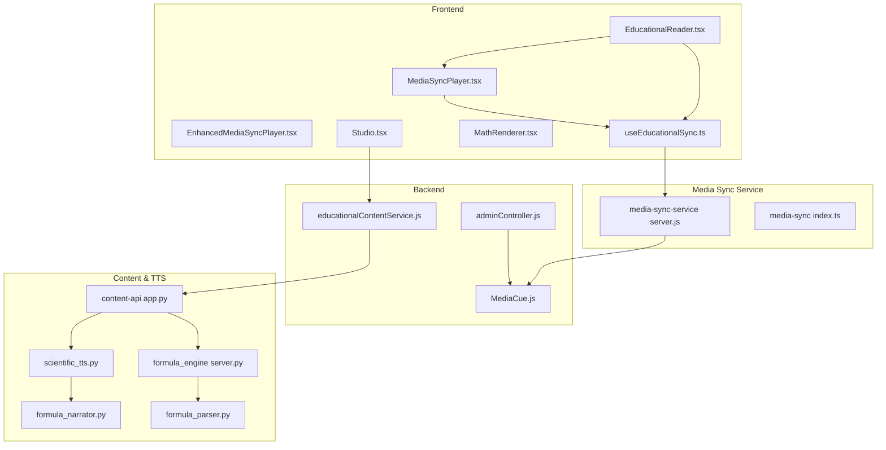
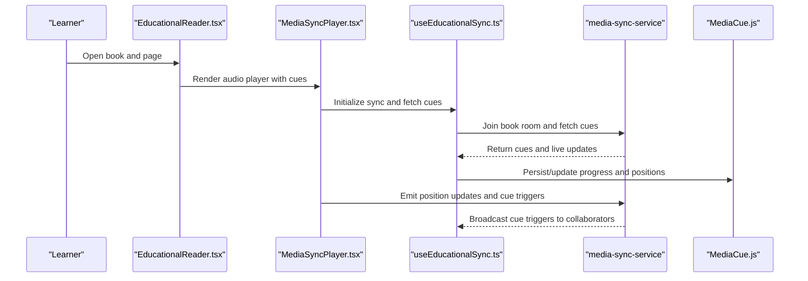
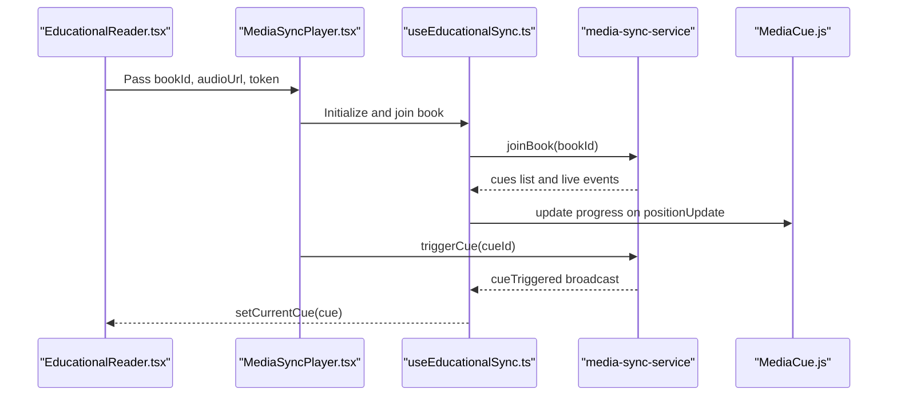
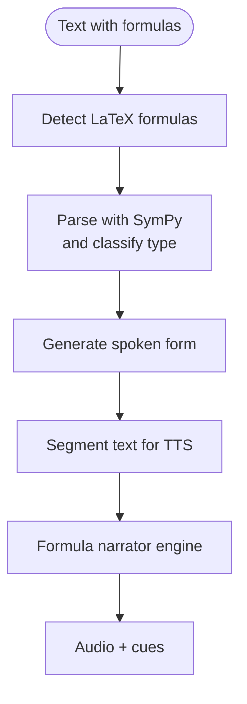
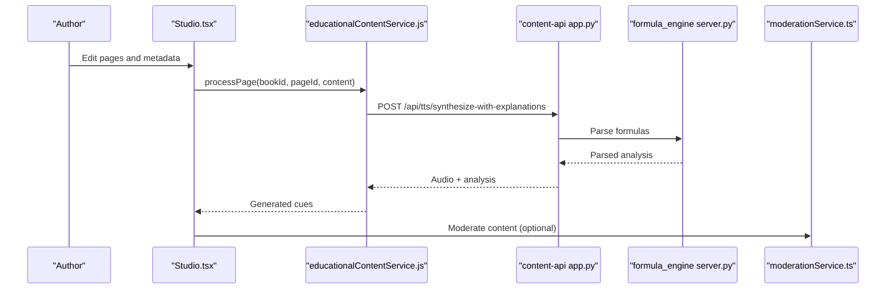
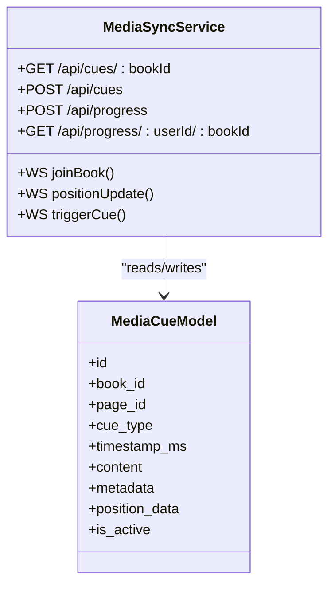
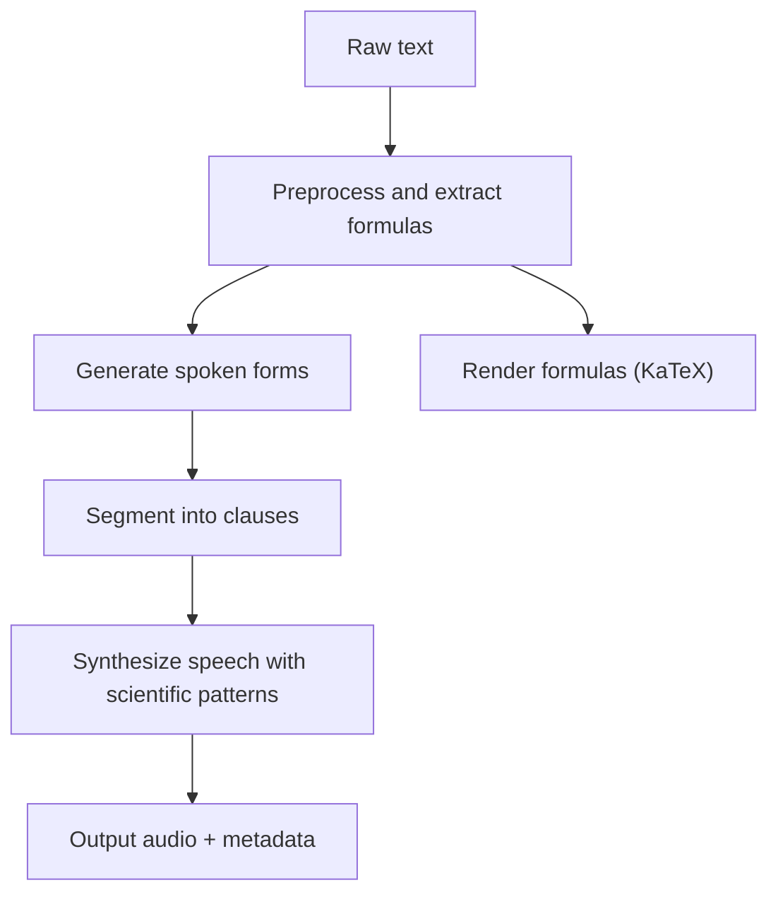
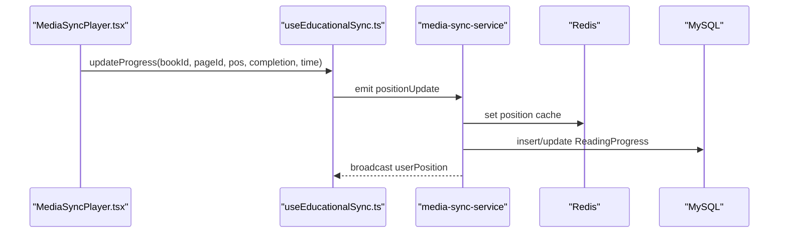
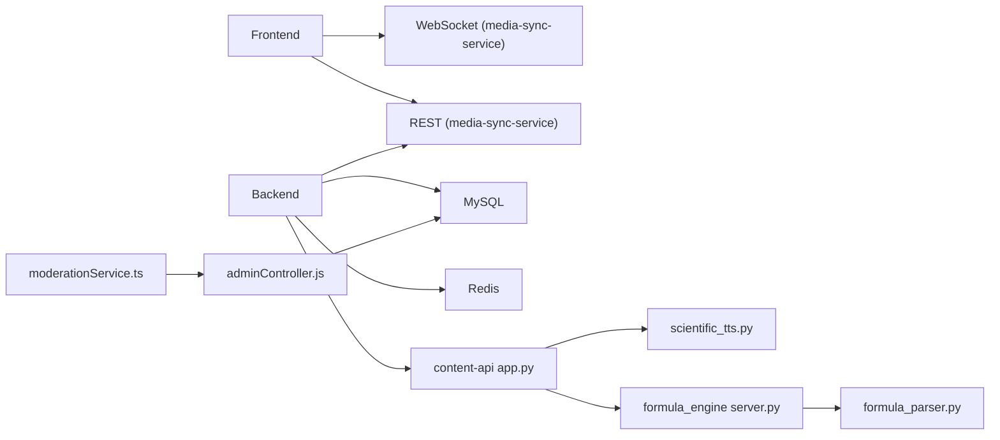

# Educational Content System

<cite>
**Referenced Files in This Document**
- [EducationalReader.tsx](file://frontend/src/pages/EducationalReader.tsx)
- [MediaSyncPlayer.tsx](file://frontend/src/components/MediaSyncPlayer.tsx)
- [EnhancedMediaSyncPlayer.tsx](file://frontend/src/components/EnhancedMediaSyncPlayer.tsx)
- [useEducationalSync.ts](file://frontend/src/hooks/useEducationalSync.ts)
- [MathRenderer.tsx](file://frontend/src/components/MathRenderer.tsx)
- [formulaDetector.ts](file://frontend/src/utils/text-analysis/formulaDetector.ts)
- [Studio.tsx](file://frontend/src/pages/Studio.tsx)
- [media-sync-service server.js](file://services/media-sync-service/src/server.js)
- [media-sync index.ts](file://services/media-sync/src/index.ts)
- [content-api app.py](file://services/content/api/app.py)
- [scientific_tts.py](file://services/content/api/core/scientific_tts.py)
- [formula_engine server.py](file://services/formula-engine/server.py)
- [formula_parser.py](file://services/formula-engine/core/formula_parser.py)
- [formula_narrator.py](file://services/tts/python/formula_narrator.py)
- [educationalContentService.js](file://backend/services/educationalContentService.js)
- [MediaCue.js](file://backend/models/MediaCue.js)
- [adminController.js](file://backend/controllers/adminController.js)
- [moderationService.ts](file://frontend/src/api/services/moderationService.ts)
- [EDUCATIONAL_PLATFORM_SUMMARY.md](file://EDUCATIONAL_PLATFORM_SUMMARY.md)
</cite>

## Table of Contents
1. [Introduction](#introduction)
2. [Project Structure](#project-structure)
3. [Core Components](#core-components)
4. [Architecture Overview](#architecture-overview)
5. [Detailed Component Analysis](#detailed-component-analysis)
6. [Dependency Analysis](#dependency-analysis)
7. [Performance Considerations](#performance-considerations)
8. [Troubleshooting Guide](#troubleshooting-guide)
9. [Conclusion](#conclusion)
10. [Appendices](#appendices)

## Introduction
This document explains the educational content system that delivers immersive, synchronized learning experiences. It covers interactive readers, formula processing, STEM-aware text-to-speech, multi-modal synchronization (text, audio, visual), content creation tools, media synchronization, adaptive reading features, moderation, and quality assurance. The system integrates frontend components, backend services, and specialized microservices for media synchronization, content orchestration, formula parsing, and TTS.

## Project Structure
The educational platform spans frontend React components, backend controllers and services, and microservices for media synchronization, content processing, formula parsing, and TTS.

**Diagram sources**
- [EducationalReader.tsx:1-401](file://frontend/src/pages/EducationalReader.tsx#L1-L401)
- [MediaSyncPlayer.tsx:1-51](file://frontend/src/components/MediaSyncPlayer.tsx#L1-L51)
- [EnhancedMediaSyncPlayer.tsx:1-26](file://frontend/src/components/EnhancedMediaSyncPlayer.tsx#L1-L26)
- [useEducationalSync.ts:1-246](file://frontend/src/hooks/useEducationalSync.ts#L1-L246)
- [MathRenderer.tsx:1-33](file://frontend/src/components/MathRenderer.tsx#L1-L33)
- [Studio.tsx:1-200](file://frontend/src/pages/Studio.tsx#L1-L200)
- [media-sync-service server.js:1-309](file://services/media-sync-service/src/server.js#L1-L309)
- [media-sync index.ts:1-38](file://services/media-sync/src/index.ts#L1-L38)
- [content-api app.py:1-266](file://services/content/api/app.py#L1-L266)
- [scientific_tts.py:1-407](file://services/content/api/core/scientific_tts.py#L1-L407)
- [formula_engine server.py:1-25](file://services/formula-engine/server.py#L1-L25)
- [formula_parser.py:1-133](file://services/formula-engine/core/formula_parser.py#L1-L133)
- [formula_narrator.py:1-169](file://services/tts/python/formula_narrator.py#L1-L169)
- [educationalContentService.js:1-181](file://backend/services/educationalContentService.js#L1-L181)
- [MediaCue.js:1-49](file://backend/models/MediaCue.js#L1-L49)
- [adminController.js:1-599](file://backend/controllers/adminController.js#L1-L599)

**Section sources**
- [EDUCATIONAL_PLATFORM_SUMMARY.md:1-268](file://EDUCATIONAL_PLATFORM_SUMMARY.md#L1-L268)

## Core Components
- Interactive Reader: Split-screen reader with page navigation, media sync integration, and real-time cue rendering.
- Media Sync Player: Audio playback with synchronization, cue triggering, progress tracking, and volume/playback controls.
- Educational Sync Hook: Real-time WebSocket connection, cue synchronization, progress tracking, and collaborative features.
- Formula Processing: STEM-aware formula detection, parsing, narration, and rendering.
- Content Creation Tools: Studio for authoring, AI-assisted generation, and quality review.
- Media Synchronization Service: WebSocket-based real-time synchronization, Redis caching, and progress tracking.
- Backend Educational Service: Orchestration of STEM content processing, quiz generation, and cue persistence.

**Section sources**
- [EducationalReader.tsx:1-401](file://frontend/src/pages/EducationalReader.tsx#L1-L401)
- [MediaSyncPlayer.tsx:1-51](file://frontend/src/components/MediaSyncPlayer.tsx#L1-L51)
- [useEducationalSync.ts:1-246](file://frontend/src/hooks/useEducationalSync.ts#L1-L246)
- [educationalContentService.js:1-181](file://backend/services/educationalContentService.js#L1-L181)
- [media-sync-service server.js:1-309](file://services/media-sync-service/src/server.js#L1-L309)

## Architecture Overview
The system is event-driven and modular:
- Frontend renders the educational reader and integrates with the media sync service via WebSocket.
- Backend services orchestrate content processing and persist cues.
- Microservices handle media synchronization, content generation, formula parsing, and TTS.

**Diagram sources**
- [EducationalReader.tsx:1-401](file://frontend/src/pages/EducationalReader.tsx#L1-L401)
- [MediaSyncPlayer.tsx:1-51](file://frontend/src/components/MediaSyncPlayer.tsx#L1-L51)
- [useEducationalSync.ts:1-246](file://frontend/src/hooks/useEducationalSync.ts#L1-L246)
- [media-sync-service server.js:238-284](file://services/media-sync-service/src/server.js#L238-L284)
- [MediaCue.js:1-49](file://backend/models/MediaCue.js#L1-L49)

## Detailed Component Analysis

### Interactive Reader and Media Sync
- The reader displays split-screen content with page navigation and integrates the media sync player.
- The media sync player manages audio playback, synchronization, and cue rendering.
- The educational sync hook establishes a WebSocket connection, handles real-time cue events, and persists reading progress.

**Diagram sources**
- [EducationalReader.tsx:300-320](file://frontend/src/pages/EducationalReader.tsx#L300-L320)
- [MediaSyncPlayer.tsx:21-51](file://frontend/src/components/MediaSyncPlayer.tsx#L21-L51)
- [useEducationalSync.ts:128-152](file://frontend/src/hooks/useEducationalSync.ts#L128-L152)
- [media-sync-service server.js:238-284](file://services/media-sync-service/src/server.js#L238-L284)
- [MediaCue.js:1-49](file://backend/models/MediaCue.js#L1-L49)

**Section sources**
- [EducationalReader.tsx:288-320](file://frontend/src/pages/EducationalReader.tsx#L288-L320)
- [MediaSyncPlayer.tsx:21-51](file://frontend/src/components/MediaSyncPlayer.tsx#L21-L51)
- [useEducationalSync.ts:36-152](file://frontend/src/hooks/useEducationalSync.ts#L36-L152)
- [media-sync-service server.js:87-120](file://services/media-sync-service/src/server.js#L87-L120)

### Formula Detection, Parsing, and Narration
- Formula detection identifies LaTeX patterns in text.
- The formula engine parses expressions and generates spoken forms.
- The TTS engine converts formulas to narration and segments text for natural speech.
- The narrator provides universal STEM formula narration across Math, Physics, Chemistry, and Engineering.

**Diagram sources**
- [formulaDetector.ts:1-11](file://frontend/src/utils/text-analysis/formulaDetector.ts#L1-L11)
- [formula_parser.py:10-37](file://services/formula-engine/core/formula_parser.py#L10-L37)
- [scientific_tts.py:120-155](file://services/content/api/core/scientific_tts.py#L120-L155)
- [formula_narrator.py:137-169](file://services/tts/python/formula_narrator.py#L137-L169)

**Section sources**
- [formulaDetector.ts:1-11](file://frontend/src/utils/text-analysis/formulaDetector.ts#L1-L11)
- [formula_parser.py:10-133](file://services/formula-engine/core/formula_parser.py#L10-L133)
- [scientific_tts.py:89-118](file://services/content/api/core/scientific_tts.py#L89-L118)
- [formula_narrator.py:1-169](file://services/tts/python/formula_narrator.py#L1-L169)

### Content Creation Tools and Quality Assurance
- Studio enables authoring, AI-assisted generation, voice selection, and quality review.
- Educational content service orchestrates STEM processing, generates cues, and persists them.
- Moderation service supports content moderation and manual review.

**Diagram sources**
- [Studio.tsx:182-200](file://frontend/src/pages/Studio.tsx#L182-L200)
- [educationalContentService.js:15-91](file://backend/services/educationalContentService.js#L15-L91)
- [content-api app.py:160-201](file://services/content/api/app.py#L160-L201)
- [formula_engine server.py:12-21](file://services/formula-engine/server.py#L12-L21)
- [moderationService.ts:1-45](file://frontend/src/api/services/moderationService.ts#L1-L45)

**Section sources**
- [Studio.tsx:1-200](file://frontend/src/pages/Studio.tsx#L1-L200)
- [educationalContentService.js:1-181](file://backend/services/educationalContentService.js#L1-L181)
- [content-api app.py:119-201](file://services/content/api/app.py#L119-L201)
- [moderationService.ts:1-45](file://frontend/src/api/services/moderationService.ts#L1-L45)

### Media Synchronization Service
- Provides WebSocket endpoints for joining rooms, broadcasting cue triggers, and sharing positions.
- Implements Redis caching for cues and progress.
- Secures endpoints with JWT and exposes health checks.

**Diagram sources**
- [media-sync-service server.js:87-236](file://services/media-sync-service/src/server.js#L87-L236)
- [MediaCue.js:1-49](file://backend/models/MediaCue.js#L1-L49)

**Section sources**
- [media-sync-service server.js:1-309](file://services/media-sync-service/src/server.js#L1-L309)
- [MediaCue.js:1-49](file://backend/models/MediaCue.js#L1-L49)

### STEM-Aware Text-to-Speech and Mathematical Notation
- Scientific TTS preprocesses text, extracts formulas, adds pronunciation hints, segments into clauses, and synthesizes speech with scientific patterns.
- Formula narrator converts LaTeX and MathML into spoken forms with recursive parsing and symbol substitution.
- Frontend renders formulas using KaTeX.

**Diagram sources**
- [scientific_tts.py:89-118](file://services/content/api/core/scientific_tts.py#L89-L118)
- [formula_narrator.py:137-169](file://services/tts/python/formula_narrator.py#L137-L169)
- [MathRenderer.tsx:13-31](file://frontend/src/components/MathRenderer.tsx#L13-L31)

**Section sources**
- [scientific_tts.py:1-407](file://services/content/api/core/scientific_tts.py#L1-L407)
- [formula_narrator.py:1-169](file://services/tts/python/formula_narrator.py#L1-L169)
- [MathRenderer.tsx:1-33](file://frontend/src/components/MathRenderer.tsx#L1-L33)

### Adaptive Reading Features and Collaboration
- Reading progress is tracked and persisted, with automatic updates and caching.
- Collaborative features share user positions and broadcast cue triggers.
- Achievement display and study statistics enhance engagement.

**Diagram sources**
- [useEducationalSync.ts:154-207](file://frontend/src/hooks/useEducationalSync.ts#L154-L207)
- [media-sync-service server.js:248-267](file://services/media-sync-service/src/server.js#L248-L267)

**Section sources**
- [useEducationalSync.ts:154-207](file://frontend/src/hooks/useEducationalSync.ts#L154-L207)
- [media-sync-service server.js:167-236](file://services/media-sync-service/src/server.js#L167-L236)

## Dependency Analysis
- Frontend depends on the media sync service for real-time cues and progress.
- Backend educational service depends on the content API for TTS and formula parsing.
- Media sync service depends on MySQL and Redis for persistence and caching.
- Moderation service integrates with admin endpoints for content governance.

**Diagram sources**
- [useEducationalSync.ts:36-86](file://frontend/src/hooks/useEducationalSync.ts#L36-L86)
- [media-sync-service server.js:1-309](file://services/media-sync-service/src/server.js#L1-L309)
- [educationalContentService.js:1-181](file://backend/services/educationalContentService.js#L1-L181)
- [content-api app.py:1-266](file://services/content/api/app.py#L1-L266)
- [formula_engine server.py:1-25](file://services/formula-engine/server.py#L1-L25)
- [formula_parser.py:1-133](file://services/formula-engine/core/formula_parser.py#L1-L133)
- [adminController.js:1-599](file://backend/controllers/adminController.js#L1-L599)
- [moderationService.ts:1-45](file://frontend/src/api/services/moderationService.ts#L1-L45)

**Section sources**
- [EDUCATIONAL_PLATFORM_SUMMARY.md:150-232](file://EDUCATIONAL_PLATFORM_SUMMARY.md#L150-L232)

## Performance Considerations
- Redis caching reduces database load for frequently accessed cues and progress.
- WebSocket pooling minimizes overhead for real-time collaboration.
- Batch processing limits concurrent STEM processing to prevent overload.
- Database indexing optimized for educational queries.

[No sources needed since this section provides general guidance]

## Troubleshooting Guide
Common issues and resolutions:
- WebSocket connection failures: Verify token authentication and service availability.
- Missing cues: Confirm Redis cache freshness and database entries.
- TTS synthesis errors: Check content API health and model availability.
- Formula parsing failures: Validate LaTeX syntax and fallback mechanisms.

**Section sources**
- [media-sync-service server.js:67-83](file://services/media-sync-service/src/server.js#L67-L83)
- [content-api app.py:34-43](file://services/content/api/app.py#L34-L43)
- [educationalContentService.js:17-30](file://backend/services/educationalContentService.js#L17-L30)

## Conclusion
The educational content system delivers an immersive, synchronized learning experience through integrated media synchronization, STEM-aware TTS, formula processing, and robust content creation tools. Its modular architecture, real-time collaboration, and quality assurance mechanisms support scalable, adaptive education platforms.

[No sources needed since this section summarizes without analyzing specific files]

## Appendices

### Educational Content Workflow
- Creation: Author writes content in Studio, AI assists generation, formulas are detected and parsed.
- Processing: Backend orchestrates STEM analysis, TTS synthesis, and cue generation.
- Publishing: Cues stored and served via media sync service; reader displays synchronized content.
- Consumption: Learners consume synchronized text, audio, and visual cues; progress tracked and cached.
- Moderation: Admin moderation and manual review ensure quality and compliance.

**Section sources**
- [Studio.tsx:182-200](file://frontend/src/pages/Studio.tsx#L182-L200)
- [educationalContentService.js:97-120](file://backend/services/educationalContentService.js#L97-L120)
- [media-sync-service server.js:87-120](file://services/media-sync-service/src/server.js#L87-L120)
- [adminController.js:102-130](file://backend/controllers/adminController.js#L102-L130)

### Examples of Content Formats and Synchronization Patterns
- Content formats: LaTeX inline/display math, equations, align environments, and STEM terminology.
- Synchronization patterns: Timestamp-aligned cues for visual aids, formulas, steps, and highlights.
- User interaction: Click-triggered cues, auto-triggered cues during playback, collaborative position sharing.

**Section sources**
- [scientific_tts.py:125-155](file://services/content/api/core/scientific_tts.py#L125-L155)
- [media-sync index.ts:9-19](file://services/media-sync/src/index.ts#L9-L19)
- [EducationalReader.tsx:131-186](file://frontend/src/pages/EducationalReader.tsx#L131-L186)