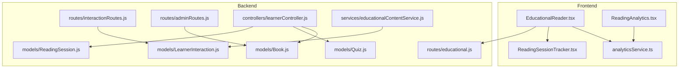
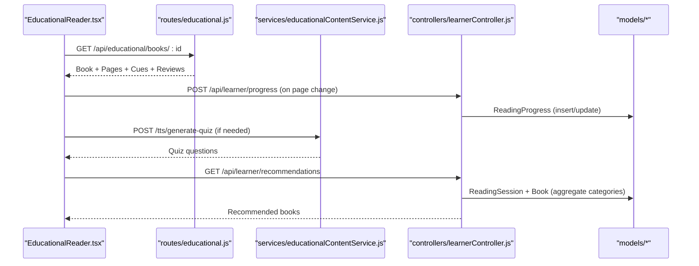
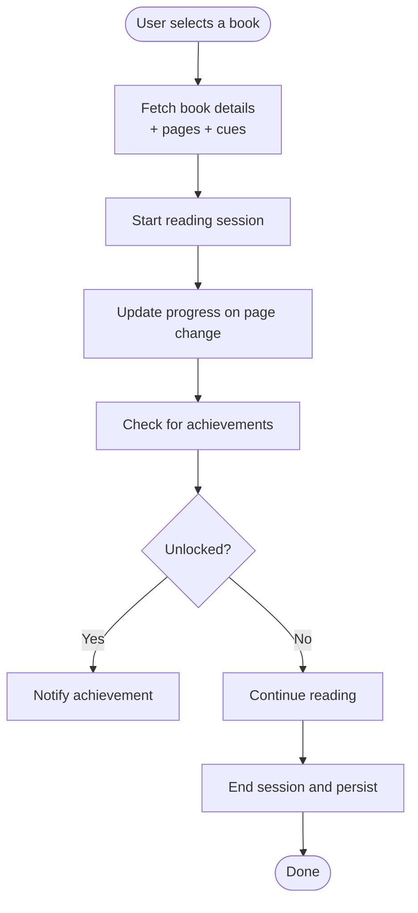
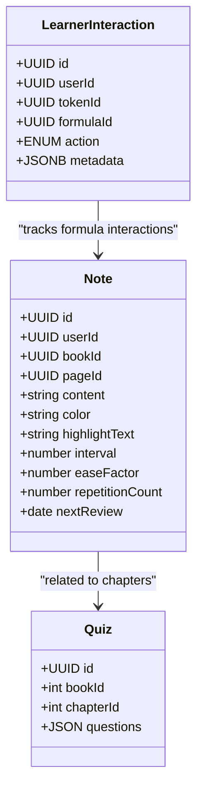
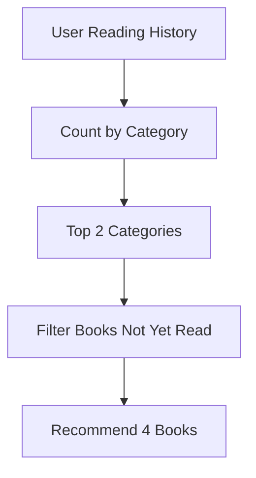
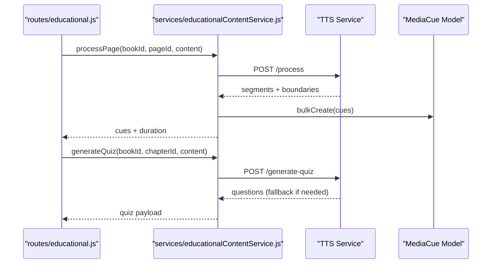
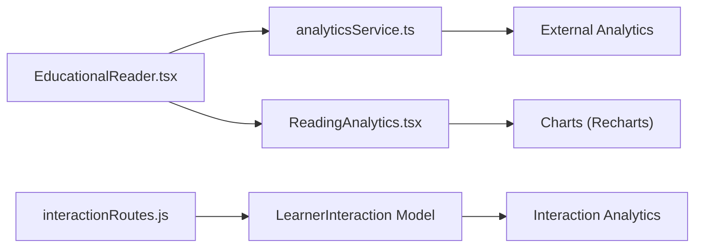
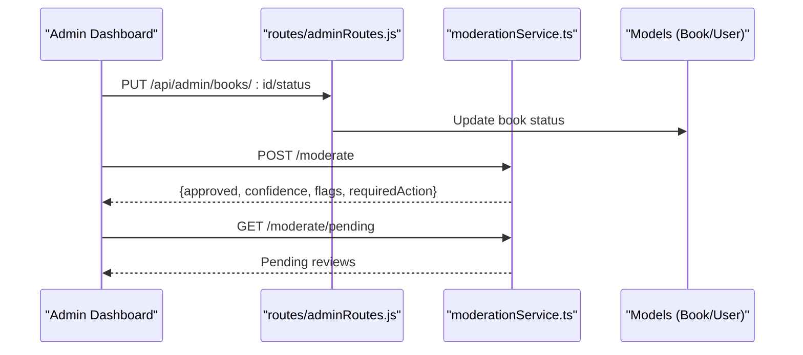
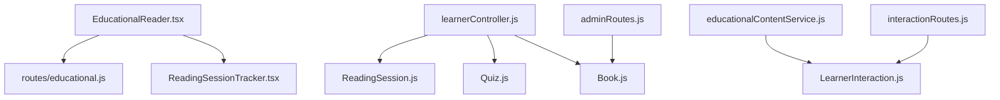

# Educational Workflows

<cite>
**Referenced Files in This Document**
- [educational.js](file://backend/routes/educational.js)
- [learnerController.js](file://backend/controllers/learnerController.js)
- [educationalContentService.js](file://backend/services/educationalContentService.js)
- [ReadingSession.js](file://backend/models/ReadingSession.js)
- [Quiz.js](file://backend/models/Quiz.js)
- [LearnerInteraction.js](file://backend/models/LearnerInteraction.js)
- [interactionRoutes.js](file://backend/routes/interactionRoutes.js)
- [adminRoutes.js](file://backend/routes/adminRoutes.js)
- [Book.js](file://backend/models/Book.js)
- [EducationalReader.tsx](file://frontend/src/pages/EducationalReader.tsx)
- [ReadingSessionTracker.tsx](file://frontend/src/components/ReadingSessionTracker.tsx)
- [analyticsService.ts](file://frontend/src/services/analyticsService.ts)
- [ReadingAnalytics.tsx](file://frontend/src/pages/ReadingAnalytics.tsx)
- [moderationService.ts](file://frontend/src/api/services/moderationService.ts)
- [FINAL_PLATFORM_SUMMARY.md](file://FINAL_PLATFORM_SUMMARY.md)
- [USER_ROLES.md](file://docs/USER_ROLES.md)
</cite>

## Table of Contents
1. [Introduction](#introduction)
2. [Project Structure](#project-structure)
3. [Core Components](#core-components)
4. [Architecture Overview](#architecture-overview)
5. [Detailed Component Analysis](#detailed-component-analysis)
6. [Dependency Analysis](#dependency-analysis)
7. [Performance Considerations](#performance-considerations)
8. [Troubleshooting Guide](#troubleshooting-guide)
9. [Conclusion](#conclusion)
10. [Appendices](#appendices)

## Introduction
This document explains the educational content workflows and learning management systems implemented in the platform. It covers content consumption workflows (library access, reading sessions, progress tracking), learner interaction patterns (notes, spaced repetition, quizzes), assessment systems, recommendation algorithms, adaptive learning paths, personalized content delivery, analytics and reporting, content moderation, quality assurance, and lifecycle management. It also provides workflow configurations, user journey mapping, and analytics implementation examples.

## Project Structure
The educational system spans backend routes and controllers, Sequelize models, services, and frontend pages/components. Key areas:
- Backend REST routes for educational content, progress, achievements, and interactions
- Controllers orchestrating reading sessions, analytics, recommendations, and quiz retrieval
- Services generating interactive cues and quizzes
- Frontend pages for immersive reading and analytics dashboards
- Admin routes for moderation and quality assurance
- Models representing reading sessions, quizzes, learner interactions, and books

**Diagram sources**
- [educational.js:1-479](file://backend/routes/educational.js#L1-L479)
- [learnerController.js:1-281](file://backend/controllers/learnerController.js#L1-L281)
- [educationalContentService.js:1-181](file://backend/services/educationalContentService.js#L1-L181)
- [ReadingSession.js:1-38](file://backend/models/ReadingSession.js#L1-L38)
- [Quiz.js:1-26](file://backend/models/Quiz.js#L1-L26)
- [LearnerInteraction.js:1-34](file://backend/models/LearnerInteraction.js#L1-L34)
- [Book.js:1-92](file://backend/models/Book.js#L1-L92)
- [EducationalReader.tsx:1-401](file://frontend/src/pages/EducationalReader.tsx#L1-L401)
- [ReadingSessionTracker.tsx:1-163](file://frontend/src/components/ReadingSessionTracker.tsx#L1-L163)
- [ReadingAnalytics.tsx:1-156](file://frontend/src/pages/ReadingAnalytics.tsx#L1-L156)
- [analyticsService.ts:1-145](file://frontend/src/services/analyticsService.ts#L1-L145)
- [interactionRoutes.js:1-55](file://backend/routes/interactionRoutes.js#L1-L55)
- [adminRoutes.js:1-107](file://backend/routes/adminRoutes.js#L1-L107)

**Section sources**
- [educational.js:1-479](file://backend/routes/educational.js#L1-L479)
- [learnerController.js:1-281](file://backend/controllers/learnerController.js#L1-L281)
- [educationalContentService.js:1-181](file://backend/services/educationalContentService.js#L1-L181)
- [ReadingSession.js:1-38](file://backend/models/ReadingSession.js#L1-L38)
- [Quiz.js:1-26](file://backend/models/Quiz.js#L1-L26)
- [LearnerInteraction.js:1-34](file://backend/models/LearnerInteraction.js#L1-L34)
- [Book.js:1-92](file://backend/models/Book.js#L1-L92)
- [EducationalReader.tsx:1-401](file://frontend/src/pages/EducationalReader.tsx#L1-L401)
- [ReadingSessionTracker.tsx:1-163](file://frontend/src/components/ReadingSessionTracker.tsx#L1-L163)
- [ReadingAnalytics.tsx:1-156](file://frontend/src/pages/ReadingAnalytics.tsx#L1-L156)
- [analyticsService.ts:1-145](file://frontend/src/services/analyticsService.ts#L1-L145)
- [interactionRoutes.js:1-55](file://backend/routes/interactionRoutes.js#L1-L55)
- [adminRoutes.js:1-107](file://backend/routes/adminRoutes.js#L1-L107)

## Core Components
- Educational content discovery and metadata: categories, filtering, pagination, and book details with pages and cues
- Reading progress and achievements: progress updates, streak detection, and achievement awards
- Interactive cues and quizzes: AI-driven quiz generation and STEM formula/audio cues
- Reading sessions and analytics: session lifecycle, duration tracking, and learner analytics
- Learner interactions: structured logging of taps, replays, and expansions for analytics
- Recommendations: category-based personalization using reading history
- Moderation and quality assurance: admin workflows for book and content status management
- Analytics and reporting: frontend dashboards and service hooks for tracking

**Section sources**
- [educational.js:31-117](file://backend/routes/educational.js#L31-L117)
- [educational.js:119-179](file://backend/routes/educational.js#L119-L179)
- [educational.js:181-267](file://backend/routes/educational.js#L181-L267)
- [educational.js:269-358](file://backend/routes/educational.js#L269-L358)
- [learnerController.js:9-48](file://backend/controllers/learnerController.js#L9-L48)
- [learnerController.js:53-114](file://backend/controllers/learnerController.js#L53-L114)
- [learnerController.js:119-175](file://backend/controllers/learnerController.js#L119-L175)
- [learnerController.js:203-242](file://backend/controllers/learnerController.js#L203-L242)
- [learnerController.js:247-280](file://backend/controllers/learnerController.js#L247-L280)
- [educationalContentService.js:15-91](file://backend/services/educationalContentService.js#L15-L91)
- [educationalContentService.js:126-177](file://backend/services/educationalContentService.js#L126-L177)
- [interactionRoutes.js:10-28](file://backend/routes/interactionRoutes.js#L10-L28)
- [interactionRoutes.js:34-52](file://backend/routes/interactionRoutes.js#L34-L52)
- [adminRoutes.js:14-38](file://backend/routes/adminRoutes.js#L14-L38)
- [ReadingSession.js:1-38](file://backend/models/ReadingSession.js#L1-L38)
- [Quiz.js:1-26](file://backend/models/Quiz.js#L1-L26)
- [LearnerInteraction.js:1-34](file://backend/models/LearnerInteraction.js#L1-L34)
- [Book.js:1-92](file://backend/models/Book.js#L1-L92)

## Architecture Overview
The educational architecture integrates frontend reading experiences with backend services for content processing, progress tracking, and assessments. The system supports:
- Immersive reading with synchronized cues and interactive elements
- Pay-per-use sessions with real-time billing and balance checks
- AI-powered quiz generation and adaptive recommendations
- Structured analytics and moderation workflows

**Diagram sources**
- [EducationalReader.tsx:61-90](file://frontend/src/pages/EducationalReader.tsx#L61-L90)
- [educational.js:119-179](file://backend/routes/educational.js#L119-L179)
- [educationalContentService.js:126-177](file://backend/services/educationalContentService.js#L126-L177)
- [learnerController.js:247-280](file://backend/controllers/learnerController.js#L247-L280)
- [ReadingSession.js:1-38](file://backend/models/ReadingSession.js#L1-L38)
- [Book.js:1-92](file://backend/models/Book.js#L1-L92)

## Detailed Component Analysis

### Content Consumption Workflows
- Library access and discovery: filter by category and difficulty, paginate results, and retrieve book metadata
- Reading session lifecycle: start, update, and end sessions; track duration and pages read
- Progress tracking: per-page position, completion percentage, and cumulative time spent
- Achievement system: unlock based on milestones such as first purchase and reading streaks

**Diagram sources**
- [educational.js:47-117](file://backend/routes/educational.js#L47-L117)
- [educational.js:119-179](file://backend/routes/educational.js#L119-L179)
- [educational.js:269-358](file://backend/routes/educational.js#L269-L358)
- [learnerController.js:119-175](file://backend/controllers/learnerController.js#L119-L175)

**Section sources**
- [educational.js:31-117](file://backend/routes/educational.js#L31-L117)
- [educational.js:119-179](file://backend/routes/educational.js#L119-L179)
- [educational.js:181-267](file://backend/routes/educational.js#L181-L267)
- [educational.js:269-358](file://backend/routes/educational.js#L269-L358)
- [learnerController.js:119-175](file://backend/controllers/learnerController.js#L119-L175)

### Learner Interaction Patterns and Assessments
- Notes and spaced repetition: create notes, schedule reviews using SM-2 algorithm, and manage intervals and ease factors
- Quizzes: retrieve stored quizzes or generate on-demand via AI service with minimum question count
- Learner interactions: log actions (tap, replay, expand) for analytics and adaptive improvements

**Diagram sources**
- [LearnerInteraction.js:1-34](file://backend/models/LearnerInteraction.js#L1-L34)
- [learnerController.js:9-48](file://backend/controllers/learnerController.js#L9-L48)
- [learnerController.js:53-114](file://backend/controllers/learnerController.js#L53-L114)
- [Quiz.js:1-26](file://backend/models/Quiz.js#L1-L26)

**Section sources**
- [learnerController.js:9-48](file://backend/controllers/learnerController.js#L9-L48)
- [learnerController.js:53-114](file://backend/controllers/learnerController.js#L53-L114)
- [learnerController.js:247-280](file://backend/controllers/learnerController.js#L247-L280)
- [interactionRoutes.js:10-28](file://backend/routes/interactionRoutes.js#L10-L28)
- [interactionRoutes.js:34-52](file://backend/routes/interactionRoutes.js#L34-L52)

### Recommendation Algorithms and Adaptive Paths
- Category-based recommendations: analyze user’s reading history to infer top categories and suggest unseen books
- Adaptive personalization: combine reading sessions and book metadata to tailor content suggestions

**Diagram sources**
- [learnerController.js:203-242](file://backend/controllers/learnerController.js#L203-L242)
- [ReadingSession.js:1-38](file://backend/models/ReadingSession.js#L1-L38)
- [Book.js:1-92](file://backend/models/Book.js#L1-L92)

**Section sources**
- [learnerController.js:203-242](file://backend/controllers/learnerController.js#L203-L242)

### Content Recommendation and Quiz Generation
- Interactive cues: detect formulas and steps, generate cues with precise timestamps and metadata
- Quiz generation: call AI service for 20-question sets; fallback to curated questions if service unavailable

**Diagram sources**
- [educational.js:119-179](file://backend/routes/educational.js#L119-L179)
- [educationalContentService.js:15-91](file://backend/services/educationalContentService.js#L15-L91)
- [educationalContentService.js:126-177](file://backend/services/educationalContentService.js#L126-L177)

**Section sources**
- [educationalContentService.js:15-91](file://backend/services/educationalContentService.js#L15-L91)
- [educationalContentService.js:126-177](file://backend/services/educationalContentService.js#L126-L177)

### Analytics and Reporting
- Frontend analytics service: track page views, events, user actions, subscriptions, payments, errors, and performance
- Reading analytics dashboard: weekly activity bar chart and genre distribution pie chart
- Backend interaction analytics: retrieve recent learner interactions for analysis

**Diagram sources**
- [analyticsService.ts:1-145](file://frontend/src/services/analyticsService.ts#L1-L145)
- [ReadingAnalytics.tsx:1-156](file://frontend/src/pages/ReadingAnalytics.tsx#L1-L156)
- [interactionRoutes.js:34-52](file://backend/routes/interactionRoutes.js#L34-L52)
- [LearnerInteraction.js:1-34](file://backend/models/LearnerInteraction.js#L1-L34)

**Section sources**
- [analyticsService.ts:1-145](file://frontend/src/services/analyticsService.ts#L1-L145)
- [ReadingAnalytics.tsx:1-156](file://frontend/src/pages/ReadingAnalytics.tsx#L1-L156)
- [interactionRoutes.js:34-52](file://backend/routes/interactionRoutes.js#L34-L52)

### Content Moderation and Quality Assurance
- Admin workflows: approve/reject sellers and books, bulk status updates, adjust balances, manage roles, payouts, refunds, and audit logs
- Moderation service: moderate content, retrieve moderation history, manual review, and pending reviews
- Quality assurance: content review and approval workflow, media processing, metadata management, and rights management

**Diagram sources**
- [adminRoutes.js:14-38](file://backend/routes/adminRoutes.js#L14-L38)
- [moderationService.ts:1-45](file://frontend/src/api/services/moderationService.ts#L1-L45)
- [FINAL_PLATFORM_SUMMARY.md:155-160](file://FINAL_PLATFORM_SUMMARY.md#L155-L160)

**Section sources**
- [adminRoutes.js:14-38](file://backend/routes/adminRoutes.js#L14-L38)
- [moderationService.ts:1-45](file://frontend/src/api/services/moderationService.ts#L1-L45)
- [FINAL_PLATFORM_SUMMARY.md:155-160](file://FINAL_PLATFORM_SUMMARY.md#L155-L160)

### Content Lifecycle Management
- Publisher portal: content upload and management
- Rights management: licensing and access control
- Lifecycle stages: draft, pending, processing, completed, failed

**Section sources**
- [FINAL_PLATFORM_SUMMARY.md:155-160](file://FINAL_PLATFORM_SUMMARY.md#L155-L160)
- [Book.js:84-87](file://backend/models/Book.js#L84-L87)

## Dependency Analysis
The educational system exhibits clear separation of concerns:
- Frontend pages depend on backend routes for data and on services for analytics
- Controllers orchestrate model interactions and integrate with external services
- Models define domain entities for reading sessions, quizzes, learner interactions, and books
- Admin routes enforce permissions and coordinate moderation workflows

**Diagram sources**
- [EducationalReader.tsx:1-401](file://frontend/src/pages/EducationalReader.tsx#L1-L401)
- [ReadingSessionTracker.tsx:1-163](file://frontend/src/components/ReadingSessionTracker.tsx#L1-L163)
- [educational.js:1-479](file://backend/routes/educational.js#L1-L479)
- [learnerController.js:1-281](file://backend/controllers/learnerController.js#L1-L281)
- [ReadingSession.js:1-38](file://backend/models/ReadingSession.js#L1-L38)
- [Quiz.js:1-26](file://backend/models/Quiz.js#L1-L26)
- [LearnerInteraction.js:1-34](file://backend/models/LearnerInteraction.js#L1-L34)
- [Book.js:1-92](file://backend/models/Book.js#L1-L92)
- [educationalContentService.js:1-181](file://backend/services/educationalContentService.js#L1-L181)
- [interactionRoutes.js:1-55](file://backend/routes/interactionRoutes.js#L1-L55)
- [adminRoutes.js:1-107](file://backend/routes/adminRoutes.js#L1-L107)

**Section sources**
- [learnerController.js:1-281](file://backend/controllers/learnerController.js#L1-L281)
- [ReadingSession.js:1-38](file://backend/models/ReadingSession.js#L1-L38)
- [Quiz.js:1-26](file://backend/models/Quiz.js#L1-L26)
- [LearnerInteraction.js:1-34](file://backend/models/LearnerInteraction.js#L1-L34)
- [Book.js:1-92](file://backend/models/Book.js#L1-L92)

## Performance Considerations
- Pagination and limits: backend endpoints cap page sizes to prevent resource exhaustion
- Batch processing: educational content service processes pages in small batches to avoid overload
- Efficient queries: use indexed fields for categories, difficulty, and user associations
- Real-time billing: frontend timers compute charges incrementally; backend persists sessions periodically
- Analytics sampling: limit interaction analytics fetch size to recent entries

[No sources needed since this section provides general guidance]

## Troubleshooting Guide
- Authentication failures: ensure bearer tokens are present for protected endpoints
- Progress validation errors: verify page ownership and numeric constraints before updates
- Quiz generation failures: confirm AI/TTS service availability; fallback questions are generated when needed
- Session termination: insufficient balance triggers automatic end; provide user feedback and top-up prompts
- Interaction logging: validate action enums and metadata structures

**Section sources**
- [educational.js:313-336](file://backend/routes/educational.js#L313-L336)
- [educational.js:429-439](file://backend/routes/educational.js#L429-L439)
- [ReadingSessionTracker.tsx:52-76](file://frontend/src/components/ReadingSessionTracker.tsx#L52-L76)
- [interactionRoutes.js:10-28](file://backend/routes/interactionRoutes.js#L10-L28)

## Conclusion
The educational workflows integrate immersive reading, adaptive assessments, and robust analytics with strong moderation and quality assurance. The modular backend and frontend components enable scalable personalization, real-time session management, and actionable insights for learners and administrators.

[No sources needed since this section summarizes without analyzing specific files]

## Appendices

### Workflow Configurations and Examples
- Content discovery filters: category and difficulty parameters with pagination
- Reading session configuration: hourly rates by education level, pause/resume, and balance warnings
- Quiz generation: minimum question count and fallback behavior
- Analytics toggles: enable/disable tracking and export integrations

**Section sources**
- [educational.js:47-117](file://backend/routes/educational.js#L47-L117)
- [ReadingSessionTracker.tsx:47-79](file://frontend/src/components/ReadingSessionTracker.tsx#L47-L79)
- [educationalContentService.js:126-177](file://backend/services/educationalContentService.js#L126-L177)
- [analyticsService.ts:1-145](file://frontend/src/services/analyticsService.ts#L1-L145)

### User Journey Mapping
- Registration and onboarding, content discovery, immersive reading with cues, session management, progress and achievements, analytics review, and recommendations

**Section sources**
- [FINAL_PLATFORM_SUMMARY.md:97-131](file://FINAL_PLATFORM_SUMMARY.md#L97-L131)
- [USER_ROLES.md:284-291](file://docs/USER_ROLES.md#L284-L291)