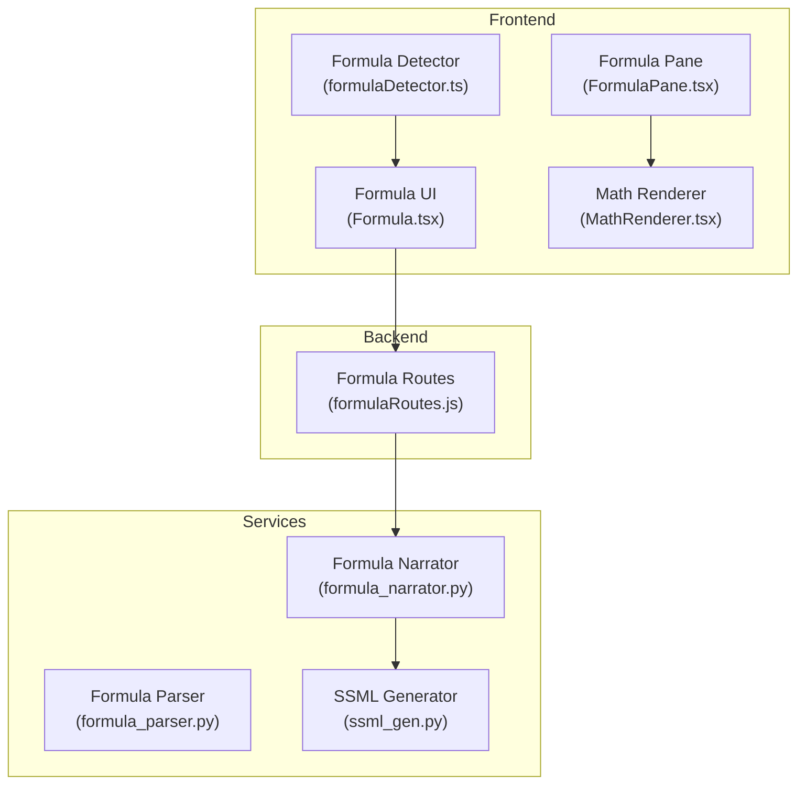
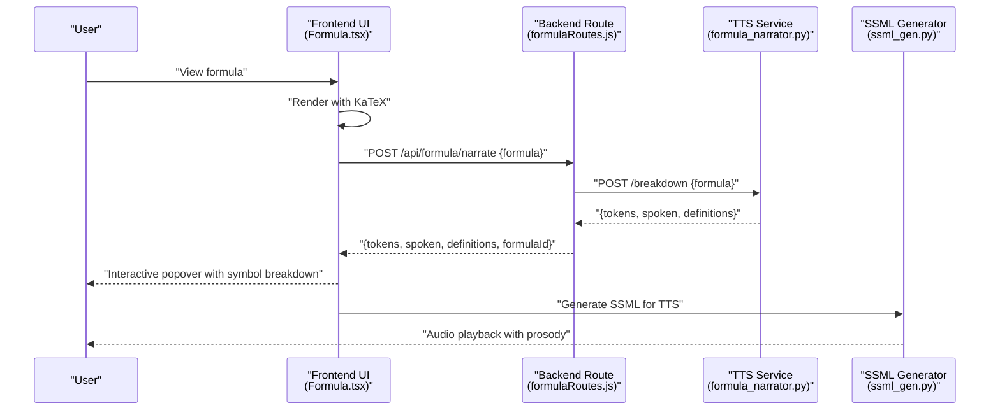
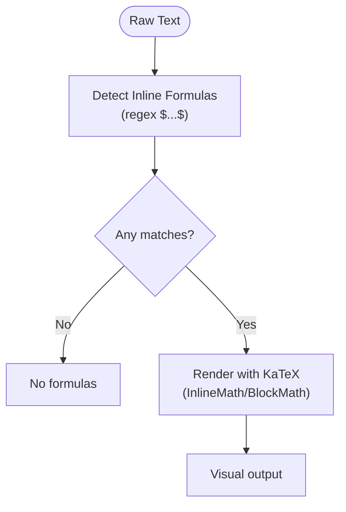
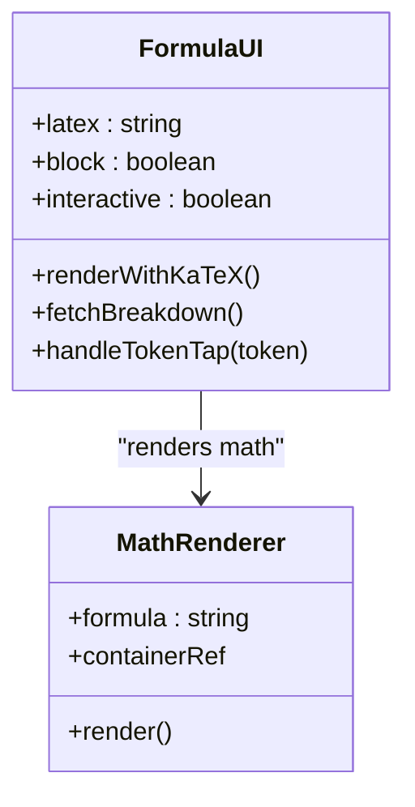
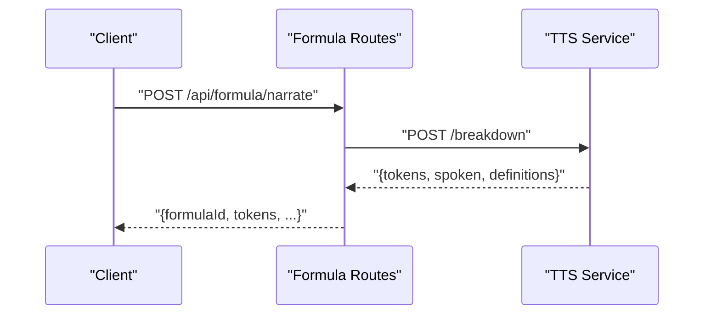
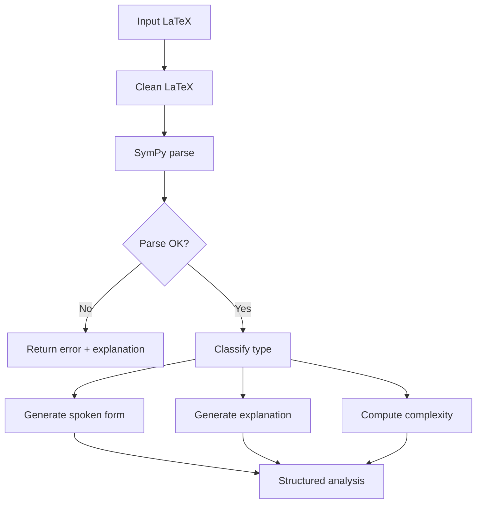
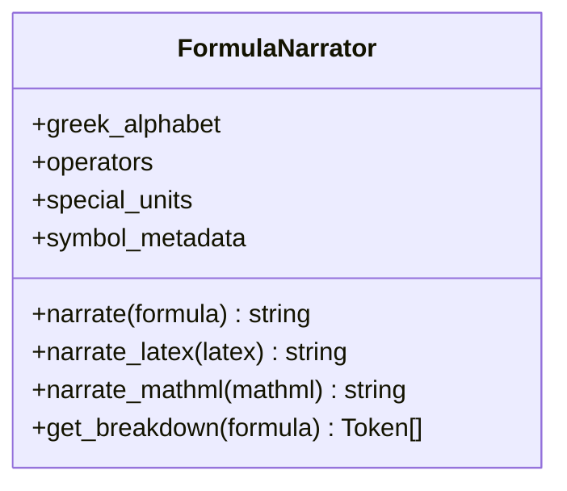
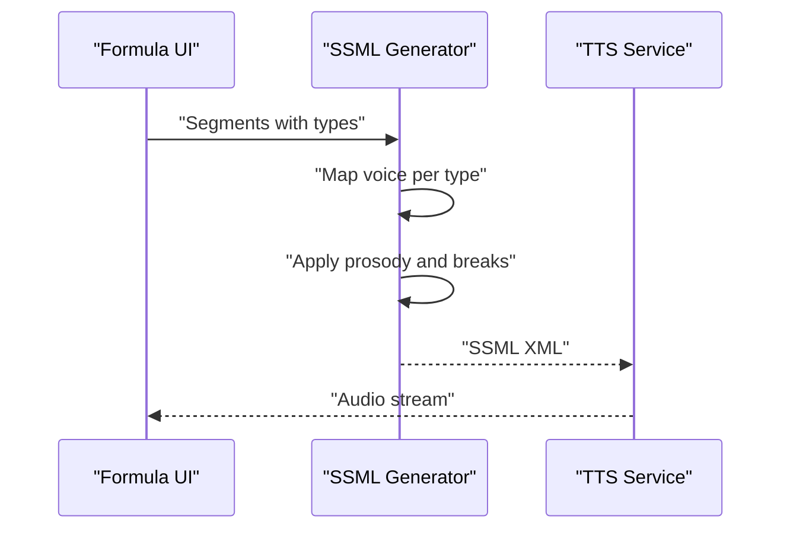
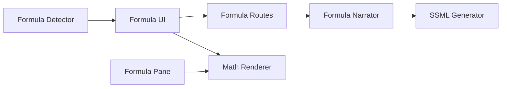

# Formula Processing and Rendering

<cite>
**Referenced Files in This Document**
- [formulaDetector.ts](file://frontend/src/utils/text-analysis/formulaDetector.ts)
- [FormulaPane.tsx](file://frontend/src/components/panes/FormulaPane.tsx)
- [Formula.tsx](file://frontend/src/components/ui/Formula.tsx)
- [MathRenderer.tsx](file://frontend/src/components/MathRenderer.tsx)
- [formulaRoutes.js](file://backend/routes/formulaRoutes.js)
- [formula_parser.py](file://services/formula-engine/core/formula_parser.py)
- [formula_narrator.py](file://services/tts/python/formula_narrator.py)
- [ssml_gen.py](file://services/tts/python/ssml_gen.py)
</cite>

## Table of Contents
1. [Introduction](#introduction)
2. [Project Structure](#project-structure)
3. [Core Components](#core-components)
4. [Architecture Overview](#architecture-overview)
5. [Detailed Component Analysis](#detailed-component-analysis)
6. [Dependency Analysis](#dependency-analysis)
7. [Performance Considerations](#performance-considerations)
8. [Troubleshooting Guide](#troubleshooting-guide)
9. [Conclusion](#conclusion)
10. [Appendices](#appendices)

## Introduction
This document describes the formula processing and rendering system across the frontend, backend, and specialized services. It explains how raw text is detected for mathematical expressions, parsed into structured representations, rendered visually via KaTeX, and transformed into accessible speech using STEM-aware narration and SSML generation. It also documents the pipeline from detection to rendering, the integration between rendering, TTS synthesis, and visual presentation, supported notations, configuration options, performance optimizations, and accessibility considerations for screen readers.

## Project Structure
The formula system spans three layers:
- Frontend: Detection, rendering, and interactive breakdown of formulas.
- Backend: Route for formula narration and persistence of breakdown tokens.
- Services: Formula parsing and narration engines, and SSML generation for TTS.

**Diagram sources**
- [formulaDetector.ts:1-11](file://frontend/src/utils/text-analysis/formulaDetector.ts#L1-L11)
- [FormulaPane.tsx:1-34](file://frontend/src/components/panes/FormulaPane.tsx#L1-L34)
- [Formula.tsx:1-116](file://frontend/src/components/ui/Formula.tsx#L1-L116)
- [MathRenderer.tsx:1-33](file://frontend/src/components/MathRenderer.tsx#L1-L33)
- [formulaRoutes.js:1-86](file://backend/routes/formulaRoutes.js#L1-L86)
- [formula_parser.py:1-133](file://services/formula-engine/core/formula_parser.py#L1-L133)
- [formula_narrator.py:1-326](file://services/tts/python/formula_narrator.py#L1-L326)
- [ssml_gen.py:1-72](file://services/tts/python/ssml_gen.py#L1-L72)

**Section sources**
- [formulaDetector.ts:1-11](file://frontend/src/utils/text-analysis/formulaDetector.ts#L1-L11)
- [FormulaPane.tsx:1-34](file://frontend/src/components/panes/FormulaPane.tsx#L1-L34)
- [Formula.tsx:1-116](file://frontend/src/components/ui/Formula.tsx#L1-L116)
- [MathRenderer.tsx:1-33](file://frontend/src/components/MathRenderer.tsx#L1-L33)
- [formulaRoutes.js:1-86](file://backend/routes/formulaRoutes.js#L1-L86)
- [formula_parser.py:1-133](file://services/formula-engine/core/formula_parser.py#L1-L133)
- [formula_narrator.py:1-326](file://services/tts/python/formula_narrator.py#L1-L326)
- [ssml_gen.py:1-72](file://services/tts/python/ssml_gen.py#L1-L72)

## Core Components
- Formula detection in raw text using inline delimiters.
- Frontend rendering with KaTeX for both inline and block math.
- Interactive breakdown of symbols with definitions and logging taps.
- Backend route to request narration and persist tokenized breakdown.
- Formula parsing engine for classification, complexity, and explanations.
- STEM-aware narrator covering LaTeX and MathML constructs.
- SSML generator for prosody and multi-voice orchestration.

**Section sources**
- [formulaDetector.ts:1-11](file://frontend/src/utils/text-analysis/formulaDetector.ts#L1-L11)
- [Formula.tsx:1-116](file://frontend/src/components/ui/Formula.tsx#L1-L116)
- [FormulaPane.tsx:1-34](file://frontend/src/components/panes/FormulaPane.tsx#L1-L34)
- [MathRenderer.tsx:1-33](file://frontend/src/components/MathRenderer.tsx#L1-L33)
- [formulaRoutes.js:1-86](file://backend/routes/formulaRoutes.js#L1-L86)
- [formula_parser.py:1-133](file://services/formula-engine/core/formula_parser.py#L1-L133)
- [formula_narrator.py:1-326](file://services/tts/python/formula_narrator.py#L1-L326)
- [ssml_gen.py:1-72](file://services/tts/python/ssml_gen.py#L1-L72)

## Architecture Overview
The formula pipeline:
1. Detect formulas in raw text.
2. Render them visually using KaTeX.
3. Request narration breakdown from the TTS service.
4. Persist tokens and expose them for interactive exploration.
5. Generate SSML for TTS synthesis with appropriate prosody and voice mapping.

**Diagram sources**
- [Formula.tsx:1-116](file://frontend/src/components/ui/Formula.tsx#L1-L116)
- [formulaRoutes.js:1-86](file://backend/routes/formulaRoutes.js#L1-L86)
- [formula_narrator.py:1-326](file://services/tts/python/formula_narrator.py#L1-L326)
- [ssml_gen.py:1-72](file://services/tts/python/ssml_gen.py#L1-L72)

## Detailed Component Analysis

### Formula Detection Pipeline
- Inline detection: Finds dollar-delimited inline math expressions.
- Frontend pane: Displays detected formulas in a floating card with KaTeX rendering.

**Diagram sources**
- [formulaDetector.ts:1-11](file://frontend/src/utils/text-analysis/formulaDetector.ts#L1-L11)
- [FormulaPane.tsx:1-34](file://frontend/src/components/panes/FormulaPane.tsx#L1-L34)

**Section sources**
- [formulaDetector.ts:1-11](file://frontend/src/utils/text-analysis/formulaDetector.ts#L1-L11)
- [FormulaPane.tsx:1-34](file://frontend/src/components/panes/FormulaPane.tsx#L1-L34)

### Frontend Rendering and Interactivity
- Uses KaTeX for math rendering.
- Provides interactive breakdown popover with symbol definitions and logging taps.
- Supports block and inline modes.

**Diagram sources**
- [Formula.tsx:1-116](file://frontend/src/components/ui/Formula.tsx#L1-L116)
- [MathRenderer.tsx:1-33](file://frontend/src/components/MathRenderer.tsx#L1-L33)

**Section sources**
- [Formula.tsx:1-116](file://frontend/src/components/ui/Formula.tsx#L1-L116)
- [MathRenderer.tsx:1-33](file://frontend/src/components/MathRenderer.tsx#L1-L33)

### Backend Formula Narration Route
- Accepts a formula and optional book context.
- Calls the TTS service for breakdown.
- Persists formula and tokens when bookId is provided.

**Diagram sources**
- [formulaRoutes.js:1-86](file://backend/routes/formulaRoutes.js#L1-L86)

**Section sources**
- [formulaRoutes.js:1-86](file://backend/routes/formulaRoutes.js#L1-L86)

### Formula Parsing Engine
- Cleans LaTeX and converts to SymPy-compatible expressions.
- Classifies expression types (derivative, integral, equation, matrix, expression).
- Generates spoken forms and explanations.
- Computes complexity scores.

**Diagram sources**
- [formula_parser.py:1-133](file://services/formula-engine/core/formula_parser.py#L1-L133)

**Section sources**
- [formula_parser.py:1-133](file://services/formula-engine/core/formula_parser.py#L1-L133)

### STEM-Aware Text-to-Speech Narration
- Comprehensive symbol dictionaries for Greek alphabet, operators, units, and special constants.
- Handles LaTeX constructs: fractions, roots, integrals, sums, matrices, environments.
- Handles MathML constructs recursively.
- Provides interactive breakdown tokens with definitions.

**Diagram sources**
- [formula_narrator.py:1-326](file://services/tts/python/formula_narrator.py#L1-L326)

**Section sources**
- [formula_narrator.py:1-326](file://services/tts/python/formula_narrator.py#L1-L326)

### SSML Generation for TTS Synthesis
- Maps segment types to voices (narrative, tutor, character, formula).
- Applies prosody controls: rate, pitch, emphasis.
- Inserts breaks around formulas for clarity.

**Diagram sources**
- [ssml_gen.py:1-72](file://services/tts/python/ssml_gen.py#L1-L72)

**Section sources**
- [ssml_gen.py:1-72](file://services/tts/python/ssml_gen.py#L1-L72)

## Dependency Analysis
- Frontend depends on KaTeX for rendering and on the backend/TTS service for narration.
- Backend depends on the TTS service for formula breakdown.
- TTS service depends on the narrator and SSML generator.

**Diagram sources**
- [formulaDetector.ts:1-11](file://frontend/src/utils/text-analysis/formulaDetector.ts#L1-L11)
- [Formula.tsx:1-116](file://frontend/src/components/ui/Formula.tsx#L1-L116)
- [FormulaPane.tsx:1-34](file://frontend/src/components/panes/FormulaPane.tsx#L1-L34)
- [MathRenderer.tsx:1-33](file://frontend/src/components/MathRenderer.tsx#L1-L33)
- [formulaRoutes.js:1-86](file://backend/routes/formulaRoutes.js#L1-L86)
- [formula_narrator.py:1-326](file://services/tts/python/formula_narrator.py#L1-L326)
- [ssml_gen.py:1-72](file://services/tts/python/ssml_gen.py#L1-L72)

**Section sources**
- [formulaDetector.ts:1-11](file://frontend/src/utils/text-analysis/formulaDetector.ts#L1-L11)
- [Formula.tsx:1-116](file://frontend/src/components/ui/Formula.tsx#L1-L116)
- [FormulaPane.tsx:1-34](file://frontend/src/components/panes/FormulaPane.tsx#L1-L34)
- [MathRenderer.tsx:1-33](file://frontend/src/components/MathRenderer.tsx#L1-L33)
- [formulaRoutes.js:1-86](file://backend/routes/formulaRoutes.js#L1-L86)
- [formula_narrator.py:1-326](file://services/tts/python/formula_narrator.py#L1-L326)
- [ssml_gen.py:1-72](file://services/tts/python/ssml_gen.py#L1-L72)

## Performance Considerations
- Rendering
  - Prefer server-side rendering for initial page loads to reduce client work.
  - Debounce repeated renders when editing content.
  - Limit KaTeX rendering to visible formulas to avoid unnecessary DOM updates.
- Parsing and Narration
  - Cache parsed analyses and narration breakdowns keyed by normalized formula text.
  - Batch requests to the TTS service to minimize network overhead.
  - Avoid deep recursion in MathML parsing by limiting nesting depth.
- Complexity
  - Use complexity scores to gate advanced parsing or defer heavy computations.
- Accessibility
  - Provide alternative text for images of formulas.
  - Announce formula changes to screen readers using aria-live regions.
  - Ensure keyboard navigation to interactive breakdowns.

## Troubleshooting Guide
- KaTeX rendering fails
  - Verify KaTeX availability on the window object.
  - Catch and log rendering errors; fall back to plain text.
- Backend narration endpoint errors
  - Confirm TTS service URL is reachable.
  - Inspect response status and error payload from the TTS service.
- Missing tokens or empty breakdown
  - Validate that the formula string is well-formed LaTeX or MathML.
  - Check that the narrator supports the encountered symbols/environments.
- SSML generation issues
  - Ensure segment types are recognized and mapped to voices.
  - Validate SSML structure and voice names against platform requirements.

**Section sources**
- [MathRenderer.tsx:16-28](file://frontend/src/components/MathRenderer.tsx#L16-L28)
- [formulaRoutes.js:22-33](file://backend/routes/formulaRoutes.js#L22-L33)
- [formula_narrator.py:137-141](file://services/tts/python/formula_narrator.py#L137-L141)
- [ssml_gen.py:26-71](file://services/tts/python/ssml_gen.py#L26-L71)

## Conclusion
The formula processing and rendering system integrates detection, visual rendering, interactive breakdown, and STEM-aware narration with SSML-driven synthesis. The modular design enables scalability, maintainability, and accessibility, supporting a wide range of mathematical and scientific notations.

## Appendices

### Supported Mathematical Notations and Symbols
- Greek alphabet and capital variants.
- Operators: arithmetic, relational, logical, calculus, geometry, vectors, arrows, linear algebra, quantum mechanics, topology, set theory, accents.
- Units and chemical formulas.
- Environments: matrices, cases, align/gather/eqnarray.

**Section sources**
- [formula_narrator.py:12-89](file://services/tts/python/formula_narrator.py#L12-L89)
- [formula_narrator.py:100-109](file://services/tts/python/formula_narrator.py#L100-L109)
- [formula_narrator.py:203-236](file://services/tts/python/formula_narrator.py#L203-L236)

### Formula Parsing Configurations
- Classification: derivative, integral, equation, matrix, expression.
- Spoken forms: specialized for derivatives/integrals/equations; general fallback for expressions.
- Explanations: natural language summaries based on operation type.
- Complexity: weighted by free symbols and operation count.

**Section sources**
- [formula_parser.py:66-76](file://services/formula-engine/core/formula_parser.py#L66-L76)
- [formula_parser.py:78-108](file://services/formula-engine/core/formula_parser.py#L78-L108)
- [formula_parser.py:110-123](file://services/formula-engine/core/formula_parser.py#L110-L123)
- [formula_parser.py:125-132](file://services/formula-engine/core/formula_parser.py#L125-L132)

### Rendering Customization Options
- KaTeX display mode toggles for block vs inline rendering.
- Error handling with graceful fallback to plain text.
- CSS classes for styling rendered formulas.

**Section sources**
- [FormulaPane.tsx:22-27](file://frontend/src/components/panes/FormulaPane.tsx#L22-L27)
- [Formula.tsx:42-53](file://frontend/src/components/ui/Formula.tsx#L42-L53)
- [MathRenderer.tsx:16-28](file://frontend/src/components/MathRenderer.tsx#L16-L28)

### Accessibility Considerations
- Screen reader announcements for formula changes.
- Keyboard focus and ARIA live regions for interactive breakdowns.
- Clear labeling of popover headers and buttons.
- Semantic HTML and alt text for images.

**Section sources**
- [Formula.tsx:78-111](file://frontend/src/components/ui/Formula.tsx#L78-L111)