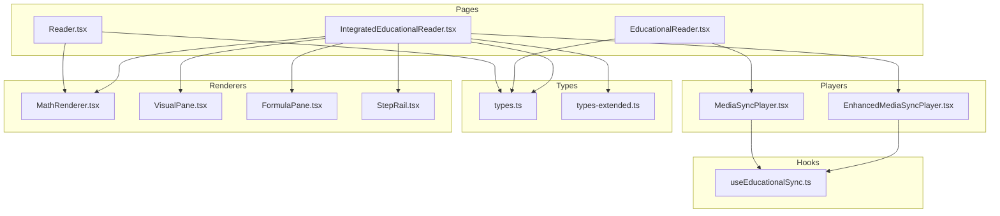
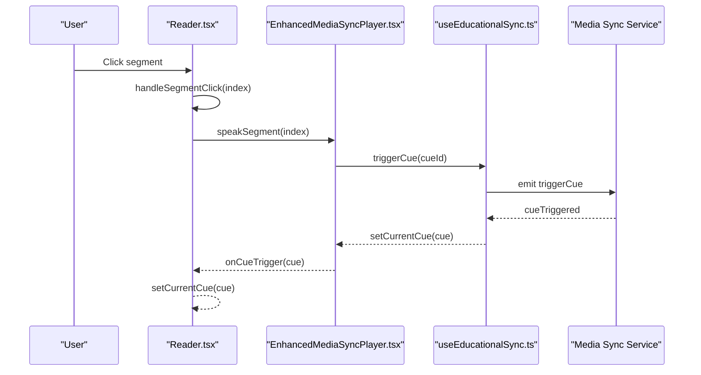
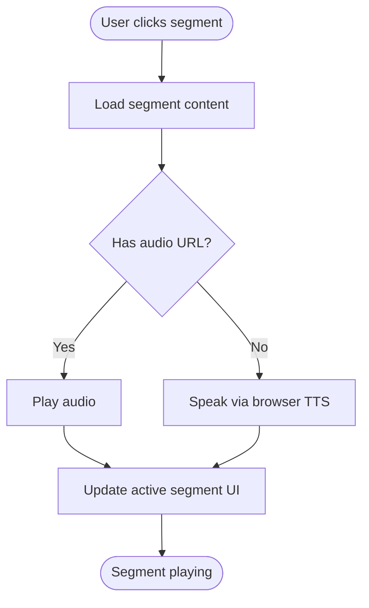
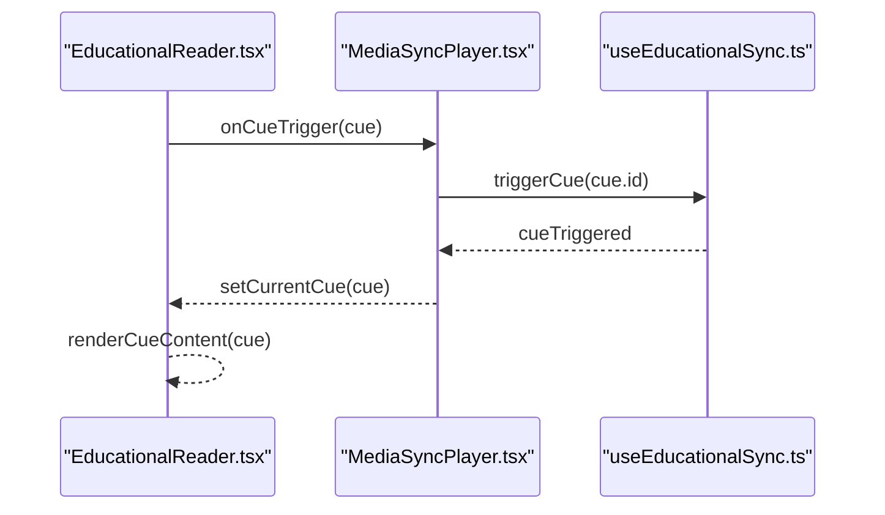
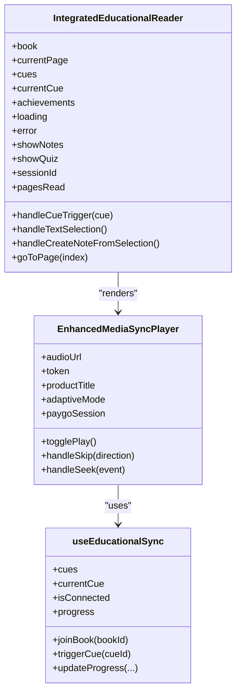
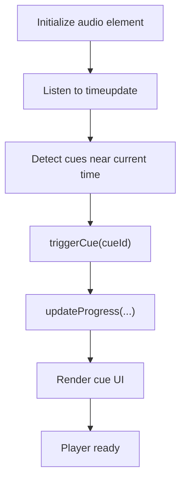
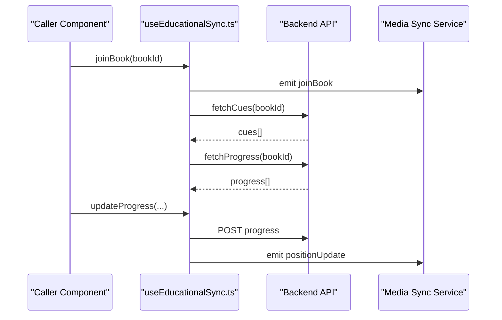
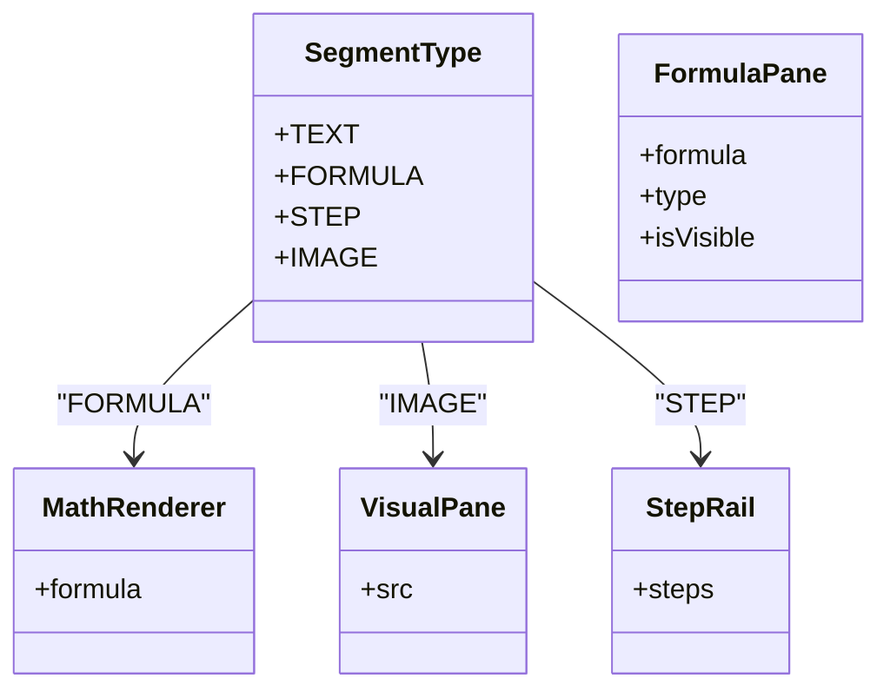
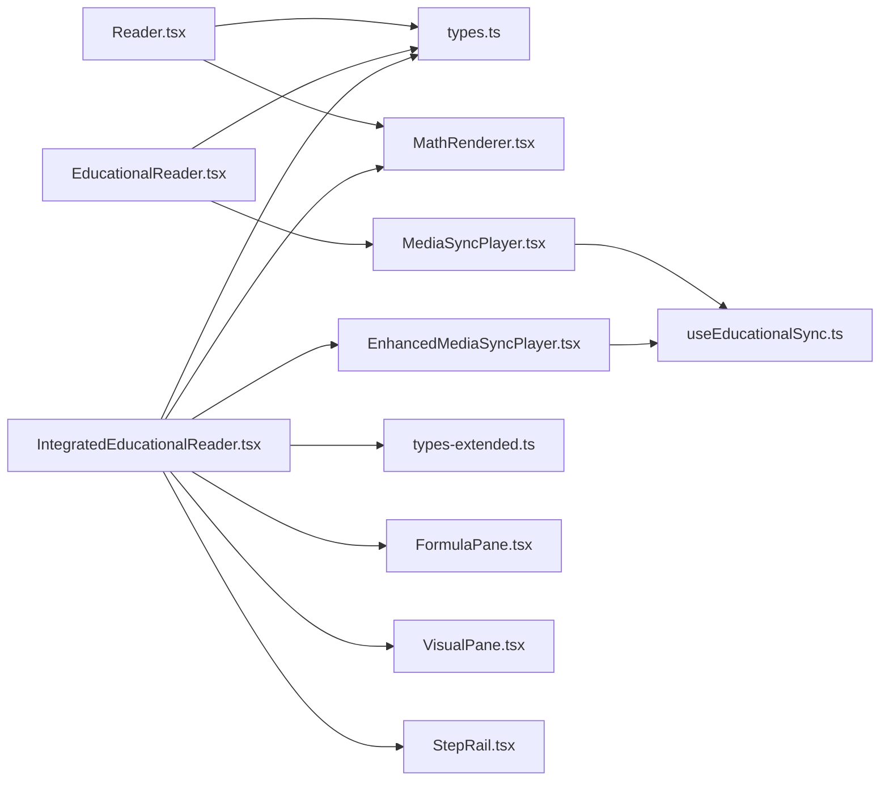

# Interactive Reader

<cite>
**Referenced Files in This Document**
- [Reader.tsx](file://frontend/src/pages/Reader.tsx)
- [EducationalReader.tsx](file://frontend/src/pages/EducationalReader.tsx)
- [IntegratedEducationalReader.tsx](file://frontend/src/pages/IntegratedEducationalReader.tsx)
- [MediaSyncPlayer.tsx](file://frontend/src/components/MediaSyncPlayer.tsx)
- [EnhancedMediaSyncPlayer.tsx](file://frontend/src/components/EnhancedMediaSyncPlayer.tsx)
- [useEducationalSync.ts](file://frontend/src/hooks/useEducationalSync.ts)
- [types.ts](file://frontend/src/types/types.ts)
- [types-extended.ts](file://frontend/src/types/types-extended.ts)
- [MathRenderer.tsx](file://frontend/src/components/MathRenderer.tsx)
- [VisualPane.tsx](file://frontend/src/components/panes/VisualPane.tsx)
- [FormulaPane.tsx](file://frontend/src/components/panes/FormulaPane.tsx)
- [StepRail.tsx](file://frontend/src/components/panes/StepRail.tsx)
</cite>

## Table of Contents
1. [Introduction](#introduction)
2. [Project Structure](#project-structure)
3. [Core Components](#core-components)
4. [Architecture Overview](#architecture-overview)
5. [Detailed Component Analysis](#detailed-component-analysis)
6. [Dependency Analysis](#dependency-analysis)
7. [Performance Considerations](#performance-considerations)
8. [Troubleshooting Guide](#troubleshooting-guide)
9. [Conclusion](#conclusion)
10. [Appendices](#appendices)

## Introduction
This document explains the interactive reader implementation, focusing on:
- Dual-panel layout: text content on the left and immersive stage on the right
- Segment-based reading experience: text, image, formula, and step-by-step content
- Player controls: play/pause, skip navigation, progress tracking, and visual feedback
- Responsive design patterns for mobile and desktop
- Segment click handling, current segment highlighting, and synchronization between text and visual content
- Examples of initialization, navigation, and customization

## Project Structure
The interactive reader spans three main pages and supporting components:
- Reader: a compact, fullscreen dual-panel reader for segment-based content
- EducationalReader: a simplified educational reader with cues and basic player
- IntegratedEducationalReader: a feature-rich educational reader with offline support, notes, quizzes, and AI tutor
- MediaSyncPlayer and EnhancedMediaSyncPlayer: audio players synchronized with media cues
- useEducationalSync: real-time synchronization and progress tracking
- Types and renderers for formulas, visuals, and steps

**Diagram sources**
- [Reader.tsx:138-275](file://frontend/src/pages/Reader.tsx#L138-L275)
- [EducationalReader.tsx:300-309](file://frontend/src/pages/EducationalReader.tsx#L300-L309)
- [IntegratedEducationalReader.tsx:584-588](file://frontend/src/pages/IntegratedEducationalReader.tsx#L584-L588)
- [MediaSyncPlayer.tsx:21-116](file://frontend/src/components/MediaSyncPlayer.tsx#L21-L116)
- [EnhancedMediaSyncPlayer.tsx:28-179](file://frontend/src/components/EnhancedMediaSyncPlayer.tsx#L28-L179)
- [useEducationalSync.ts:36-152](file://frontend/src/hooks/useEducationalSync.ts#L36-L152)
- [types.ts:2-17](file://frontend/src/types/types.ts#L2-L17)
- [types-extended.ts:48-52](file://frontend/src/types/types-extended.ts#L48-L52)
- [MathRenderer.tsx:13-31](file://frontend/src/components/MathRenderer.tsx#L13-L31)
- [VisualPane.tsx:9-31](file://frontend/src/components/panes/VisualPane.tsx#L9-L31)
- [FormulaPane.tsx:12-33](file://frontend/src/components/panes/FormulaPane.tsx#L12-L33)
- [StepRail.tsx:9-29](file://frontend/src/components/panes/StepRail.tsx#L9-L29)

**Section sources**
- [Reader.tsx:138-275](file://frontend/src/pages/Reader.tsx#L138-L275)
- [EducationalReader.tsx:258-399](file://frontend/src/pages/EducationalReader.tsx#L258-L399)
- [IntegratedEducationalReader.tsx:536-661](file://frontend/src/pages/IntegratedEducationalReader.tsx#L536-L661)

## Core Components
- Reader (fullscreen dual-panel):
  - Left panel: scrollable text segments with click-to-play and current segment highlighting
  - Right panel: immersive stage rendering image, formula, or audio-only state
  - Player controls: play/pause, skip forward/backward, progress bar, and segment counter
- EducationalReader:
  - Grid layout with left column for page content and right sidebar for book info and stats
  - MediaSyncPlayer embedded under page content
  - Cue rendering for visual, formula, step, and highlight types
- IntegratedEducationalReader:
  - Advanced layout with sticky player, floating note creation, offline caching, notes sidebar, quiz modal, and AI tutor
  - EnhancedMediaSyncPlayer with adaptive pacing, PayGO session management, and complexity indicators
- Media synchronization:
  - useEducationalSync manages socket connections, cue lifecycle, progress updates, and collaborative features
  - MediaSyncPlayer and EnhancedMediaSyncPlayer integrate audio playback, cue detection, and progress reporting

**Section sources**
- [Reader.tsx:138-275](file://frontend/src/pages/Reader.tsx#L138-L275)
- [EducationalReader.tsx:300-319](file://frontend/src/pages/EducationalReader.tsx#L300-L319)
- [IntegratedEducationalReader.tsx:584-588](file://frontend/src/pages/IntegratedEducationalReader.tsx#L584-L588)
- [useEducationalSync.ts:36-152](file://frontend/src/hooks/useEducationalSync.ts#L36-L152)

## Architecture Overview
The reader architecture centers on a dual-panel design with synchronized audio playback and cue-driven visual feedback. The enhanced player adds adaptive pacing, PayGO billing, and session management.

**Diagram sources**
- [Reader.tsx:127-130](file://frontend/src/pages/Reader.tsx#L127-L130)
- [EnhancedMediaSyncPlayer.tsx:95-99](file://frontend/src/components/EnhancedMediaSyncPlayer.tsx#L95-L99)
- [useEducationalSync.ts:64-70](file://frontend/src/hooks/useEducationalSync.ts#L64-L70)

## Detailed Component Analysis

### Reader (Dual-Panel Segment Reader)
- Layout:
  - Left panel: segmented text content with hover and active states; clicking a segment plays it
  - Right panel: immersive stage showing image, formula, or audio-only state with visual feedback
- Controls:
  - Play/Pause toggled via speech synthesis or fallback audio
  - Skip forward/backward by segment
  - Progress bar and segment counter
- Synchronization:
  - Segment click triggers playback and highlights the active segment
  - Visual content updates based on segment type

**Diagram sources**
- [Reader.tsx:66-104](file://frontend/src/pages/Reader.tsx#L66-L104)
- [Reader.tsx:127-130](file://frontend/src/pages/Reader.tsx#L127-L130)

**Section sources**
- [Reader.tsx:138-275](file://frontend/src/pages/Reader.tsx#L138-L275)
- [types.ts:2-17](file://frontend/src/types/types.ts#L2-L17)

### EducationalReader (Cue-Driven Reader)
- Layout:
  - Two-column layout: left for page content and player, right for book info and study stats
- Cues:
  - Visual, formula, step, and highlight cues rendered in a dedicated area
  - MediaSyncPlayer detects cues and triggers UI updates
- Progress:
  - Progress reported to parent and propagated to the player

**Diagram sources**
- [EducationalReader.tsx:117-119](file://frontend/src/pages/EducationalReader.tsx#L117-L119)
- [MediaSyncPlayer.tsx:73-74](file://frontend/src/components/MediaSyncPlayer.tsx#L73-L74)
- [useEducationalSync.ts:64-70](file://frontend/src/hooks/useEducationalSync.ts#L64-L70)

**Section sources**
- [EducationalReader.tsx:258-399](file://frontend/src/pages/EducationalReader.tsx#L258-L399)
- [MediaSyncPlayer.tsx:21-116](file://frontend/src/components/MediaSyncPlayer.tsx#L21-L116)

### IntegratedEducationalReader (Advanced Reader)
- Layout:
  - Sticky player at the bottom; floating highlight button appears on text selection
  - Notes sidebar, quiz modal, and AI tutor integrated
  - Offline mode with caching and fallback loading
- Enhanced player:
  - Adaptive pacing adjusts playback speed based on cue complexity
  - PayGO session management with balance checks and heartbeat
  - Complexity indicator and voice role badges
- Progress and sessions:
  - Reading session tracking with periodic updates
  - Pages read retention for progress metrics

**Diagram sources**
- [IntegratedEducationalReader.tsx:75-100](file://frontend/src/pages/IntegratedEducationalReader.tsx#L75-L100)
- [EnhancedMediaSyncPlayer.tsx:28-179](file://frontend/src/components/EnhancedMediaSyncPlayer.tsx#L28-L179)
- [useEducationalSync.ts:36-152](file://frontend/src/hooks/useEducationalSync.ts#L36-L152)

**Section sources**
- [IntegratedEducationalReader.tsx:536-661](file://frontend/src/pages/IntegratedEducationalReader.tsx#L536-L661)
- [EnhancedMediaSyncPlayer.tsx:28-179](file://frontend/src/components/EnhancedMediaSyncPlayer.tsx#L28-L179)
- [useEducationalSync.ts:36-152](file://frontend/src/hooks/useEducationalSync.ts#L36-L152)

### MediaSyncPlayer and EnhancedMediaSyncPlayer
- MediaSyncPlayer:
  - Audio element with play/pause, skip, volume, and playback rate controls
  - Progress bar with seek, time formatting, and periodic progress updates
  - Cue detection around current timestamp and real-time cue triggering
- EnhancedMediaSyncPlayer:
  - Same controls plus adaptive pacing, PayGO session management, and complexity indicators
  - Real-time charge calculation and wallet status display
  - Adaptive suggestion UI for slowing down playback

**Diagram sources**
- [MediaSyncPlayer.tsx:48-108](file://frontend/src/components/MediaSyncPlayer.tsx#L48-L108)
- [EnhancedMediaSyncPlayer.tsx:74-155](file://frontend/src/components/EnhancedMediaSyncPlayer.tsx#L74-L155)

**Section sources**
- [MediaSyncPlayer.tsx:21-310](file://frontend/src/components/MediaSyncPlayer.tsx#L21-L310)
- [EnhancedMediaSyncPlayer.tsx:28-577](file://frontend/src/components/EnhancedMediaSyncPlayer.tsx#L28-L577)

### Synchronization and Progress Tracking (useEducationalSync)
- Socket connection to media sync service with authentication
- Room-based cue management: joinBook leaves previous room, fetches cues and progress
- Real-time cue triggering and collaborative position updates
- Local progress state updates with debounced backend posting

**Diagram sources**
- [useEducationalSync.ts:128-152](file://frontend/src/hooks/useEducationalSync.ts#L128-L152)
- [useEducationalSync.ts:154-207](file://frontend/src/hooks/useEducationalSync.ts#L154-L207)

**Section sources**
- [useEducationalSync.ts:36-246](file://frontend/src/hooks/useEducationalSync.ts#L36-L246)

### Segment Types and Rendering
- Segment types:
  - TEXT: textual content with optional audio
  - FORMULA: mathematical expressions rendered via KaTeX
  - STEP: step-by-step instructions
  - IMAGE: visual aids
- Renderers:
  - MathRenderer renders LaTeX using KaTeX
  - VisualPane displays images with hover scaling
  - FormulaPane overlays detected formulas
  - StepRail lists solution steps

**Diagram sources**
- [types.ts:2-17](file://frontend/src/types/types.ts#L2-L17)
- [MathRenderer.tsx:13-31](file://frontend/src/components/MathRenderer.tsx#L13-L31)
- [VisualPane.tsx:9-31](file://frontend/src/components/panes/VisualPane.tsx#L9-L31)
- [FormulaPane.tsx:12-33](file://frontend/src/components/panes/FormulaPane.tsx#L12-L33)
- [StepRail.tsx:9-29](file://frontend/src/components/panes/StepRail.tsx#L9-L29)

**Section sources**
- [types.ts:2-17](file://frontend/src/types/types.ts#L2-L17)
- [MathRenderer.tsx:13-31](file://frontend/src/components/MathRenderer.tsx#L13-L31)
- [VisualPane.tsx:9-31](file://frontend/src/components/panes/VisualPane.tsx#L9-L31)
- [FormulaPane.tsx:12-33](file://frontend/src/components/panes/FormulaPane.tsx#L12-L33)
- [StepRail.tsx:9-29](file://frontend/src/components/panes/StepRail.tsx#L9-L29)

## Dependency Analysis
- Reader depends on:
  - Segment types and SyncPoint definitions
  - MathRenderer for formula display
- EducationalReader and IntegratedEducationalReader depend on:
  - MediaSyncPlayer or EnhancedMediaSyncPlayer
  - useEducationalSync for real-time cues and progress
  - Additional UI components for notes, quizzes, and offline caching

**Diagram sources**
- [Reader.tsx:138-275](file://frontend/src/pages/Reader.tsx#L138-L275)
- [EducationalReader.tsx:300-309](file://frontend/src/pages/EducationalReader.tsx#L300-L309)
- [IntegratedEducationalReader.tsx:584-588](file://frontend/src/pages/IntegratedEducationalReader.tsx#L584-L588)
- [MediaSyncPlayer.tsx:21-116](file://frontend/src/components/MediaSyncPlayer.tsx#L21-L116)
- [EnhancedMediaSyncPlayer.tsx:28-179](file://frontend/src/components/EnhancedMediaSyncPlayer.tsx#L28-L179)
- [useEducationalSync.ts:36-152](file://frontend/src/hooks/useEducationalSync.ts#L36-L152)
- [types.ts:2-17](file://frontend/src/types/types.ts#L2-L17)
- [types-extended.ts:48-52](file://frontend/src/types/types-extended.ts#L48-L52)
- [MathRenderer.tsx:13-31](file://frontend/src/components/MathRenderer.tsx#L13-L31)
- [FormulaPane.tsx:12-33](file://frontend/src/components/panes/FormulaPane.tsx#L12-L33)
- [VisualPane.tsx:9-31](file://frontend/src/components/panes/VisualPane.tsx#L9-L31)
- [StepRail.tsx:9-29](file://frontend/src/components/panes/StepRail.tsx#L9-L29)

**Section sources**
- [Reader.tsx:138-275](file://frontend/src/pages/Reader.tsx#L138-L275)
- [EducationalReader.tsx:300-309](file://frontend/src/pages/EducationalReader.tsx#L300-L309)
- [IntegratedEducationalReader.tsx:584-588](file://frontend/src/pages/IntegratedEducationalReader.tsx#L584-L588)
- [MediaSyncPlayer.tsx:21-116](file://frontend/src/components/MediaSyncPlayer.tsx#L21-L116)
- [EnhancedMediaSyncPlayer.tsx:28-179](file://frontend/src/components/EnhancedMediaSyncPlayer.tsx#L28-L179)
- [useEducationalSync.ts:36-152](file://frontend/src/hooks/useEducationalSync.ts#L36-L152)
- [types.ts:2-17](file://frontend/src/types/types.ts#L2-L17)
- [types-extended.ts:48-52](file://frontend/src/types/types-extended.ts#L48-L52)
- [MathRenderer.tsx:13-31](file://frontend/src/components/MathRenderer.tsx#L13-L31)
- [FormulaPane.tsx:12-33](file://frontend/src/components/panes/FormulaPane.tsx#L12-L33)
- [VisualPane.tsx:9-31](file://frontend/src/components/panes/VisualPane.tsx#L9-L31)
- [StepRail.tsx:9-29](file://frontend/src/components/panes/StepRail.tsx#L9-L29)

## Performance Considerations
- Adaptive pacing reduces playback speed during complex cues to improve comprehension
- Debounced progress updates minimize API calls while maintaining responsiveness
- Lazy rendering of cues prevents unnecessary DOM updates
- Sticky player and floating UI reduce layout shifts on mobile
- Offline caching avoids repeated network requests for downloaded content

[No sources needed since this section provides general guidance]

## Troubleshooting Guide
- Audio playback issues:
  - If audio fails to play, the enhanced player falls back to PayGO session start and logs errors
  - Verify token validity and network connectivity
- Cues not triggering:
  - Ensure timestamps are within tolerance and socket is connected
  - Confirm book room joined and cues fetched
- Offline mode:
  - If offline data is missing, the integrated reader informs the user and suggests connecting online

**Section sources**
- [EnhancedMediaSyncPlayer.tsx:252-262](file://frontend/src/components/EnhancedMediaSyncPlayer.tsx#L252-L262)
- [MediaSyncPlayer.tsx:110-116](file://frontend/src/components/MediaSyncPlayer.tsx#L110-L116)
- [useEducationalSync.ts:46-86](file://frontend/src/hooks/useEducationalSync.ts#L46-L86)
- [IntegratedEducationalReader.tsx:206-225](file://frontend/src/pages/IntegratedEducationalReader.tsx#L206-L225)

## Conclusion
The interactive reader delivers a cohesive, synchronized reading experience across text and immersive visuals. It supports segment-based navigation, real-time cue-driven enhancements, and robust player controls. The enhanced reader further improves accessibility and engagement through adaptive pacing, PayGO billing, offline capabilities, and integrated study tools.

[No sources needed since this section summarizes without analyzing specific files]

## Appendices

### Initialization Examples
- Reader initialization:
  - Pass the book’s content array and manage currentIndex and isPlaying locally
  - Use segment click handlers to start playback and update highlighting
- EducationalReader initialization:
  - Fetch book and cues via API, pass audio URL to MediaSyncPlayer
  - Handle cue triggers to update current cue state
- IntegratedEducationalReader initialization:
  - Initialize offline cache, start reading session, and manage notes/quiz visibility
  - Use EnhancedMediaSyncPlayer for adaptive pacing and PayGO integration

**Section sources**
- [Reader.tsx:127-130](file://frontend/src/pages/Reader.tsx#L127-L130)
- [EducationalReader.tsx:61-90](file://frontend/src/pages/EducationalReader.tsx#L61-L90)
- [IntegratedEducationalReader.tsx:175-228](file://frontend/src/pages/IntegratedEducationalReader.tsx#L175-L228)

### Segment Navigation
- Reader:
  - handleSkip(prev|next) updates currentIndex and continues playback if currently playing
- EducationalReader:
  - goToPage updates current page index and resets cue state
- IntegratedEducationalReader:
  - goToPage updates current page and tracks pages read for progress

**Section sources**
- [Reader.tsx:116-125](file://frontend/src/pages/Reader.tsx#L116-L125)
- [EducationalReader.tsx:125-129](file://frontend/src/pages/EducationalReader.tsx#L125-L129)
- [IntegratedEducationalReader.tsx:355-359](file://frontend/src/pages/IntegratedEducationalReader.tsx#L355-L359)

### Custom Styling Options
- Reader:
  - Tailwind classes define segment borders, backgrounds, and transitions
  - Stage background gradients and animated pulse effects enhance immersion
- EducationalReader:
  - Grid layout with rounded panels and shadow cards
  - Cue content icons and typography for readability
- IntegratedEducationalReader:
  - Sticky player with rounded corners and vibrant accents
  - Floating highlight button and animated cue card
  - Dark theme with gradient overlays and backdrop blur effects

**Section sources**
- [Reader.tsx:152-274](file://frontend/src/pages/Reader.tsx#L152-L274)
- [EducationalReader.tsx:258-399](file://frontend/src/pages/EducationalReader.tsx#L258-L399)
- [IntegratedEducationalReader.tsx:536-661](file://frontend/src/pages/IntegratedEducationalReader.tsx#L536-L661)