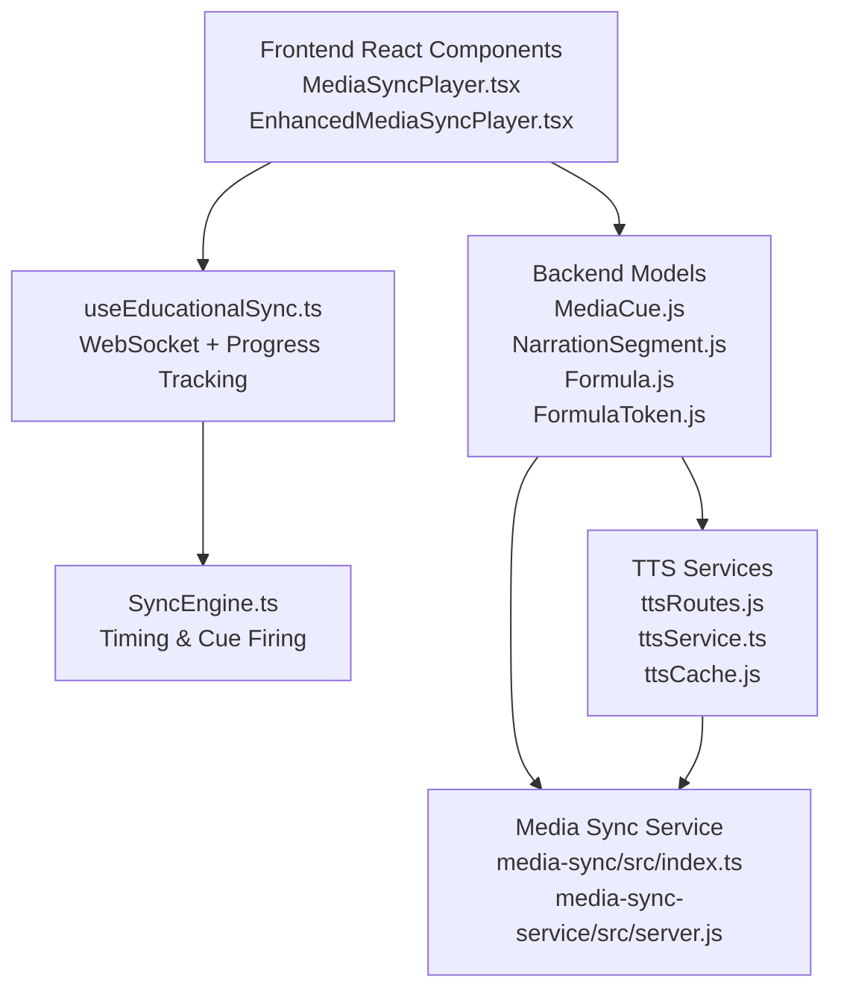
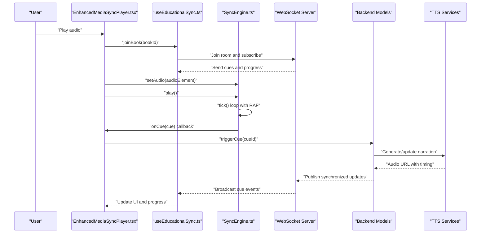
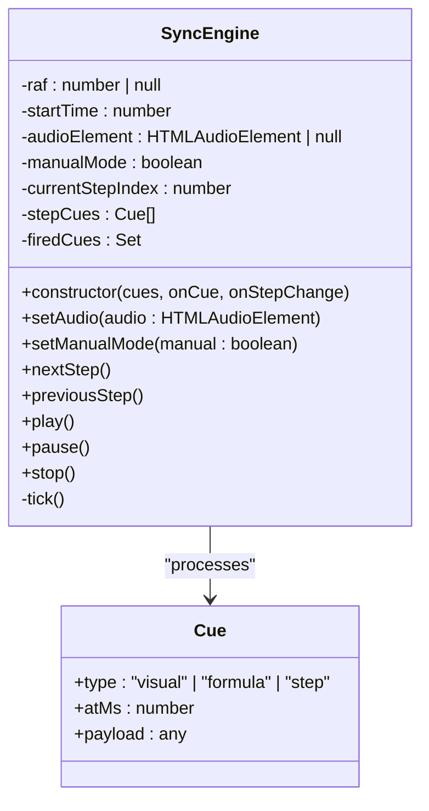
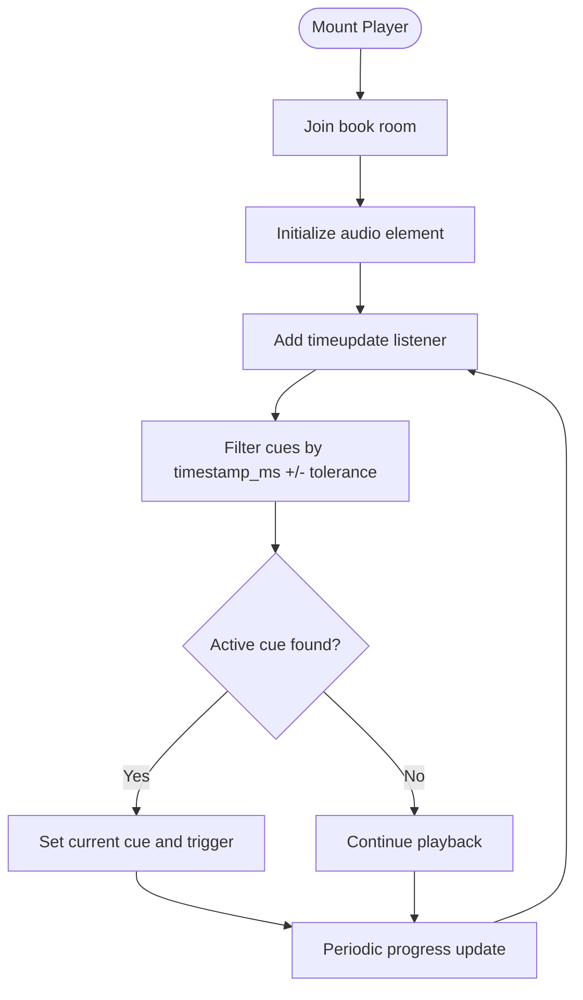
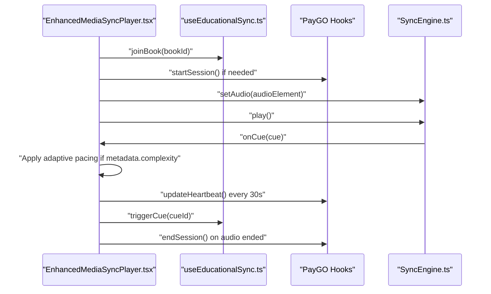
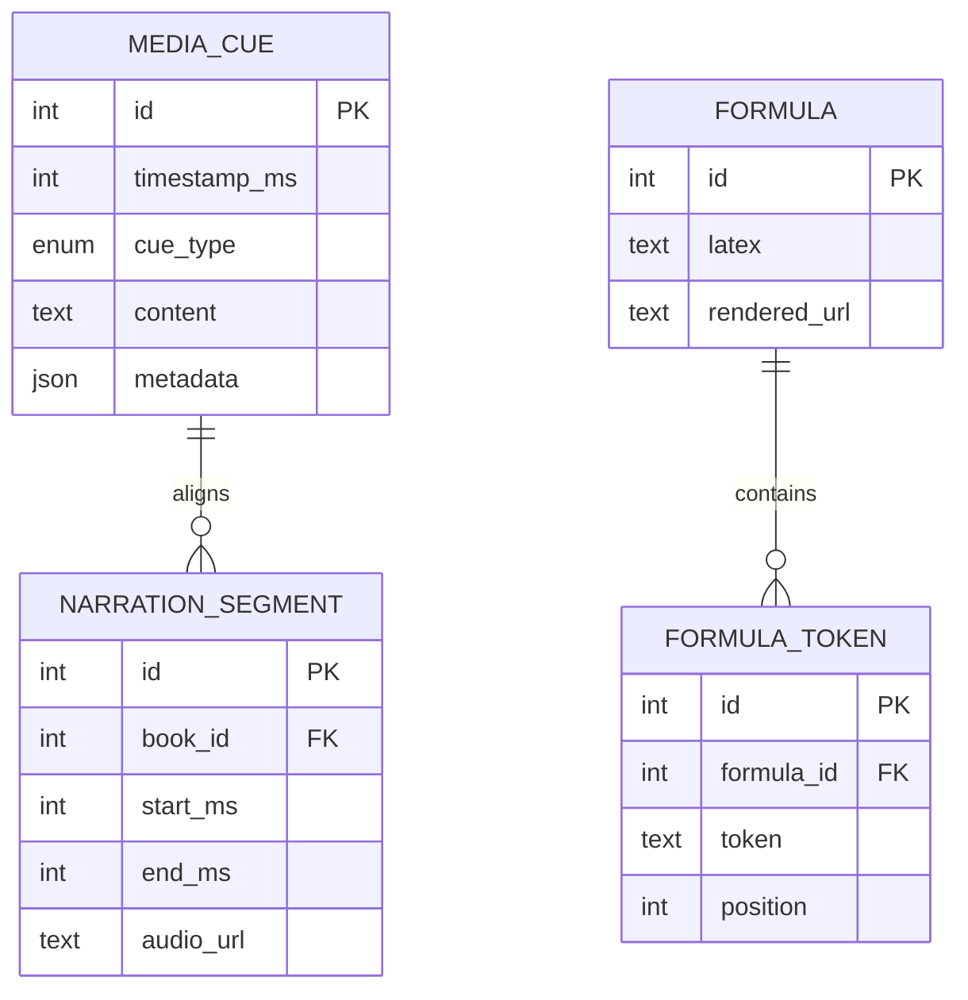
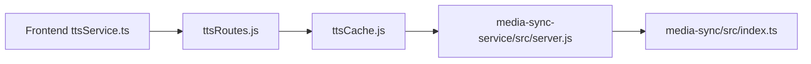
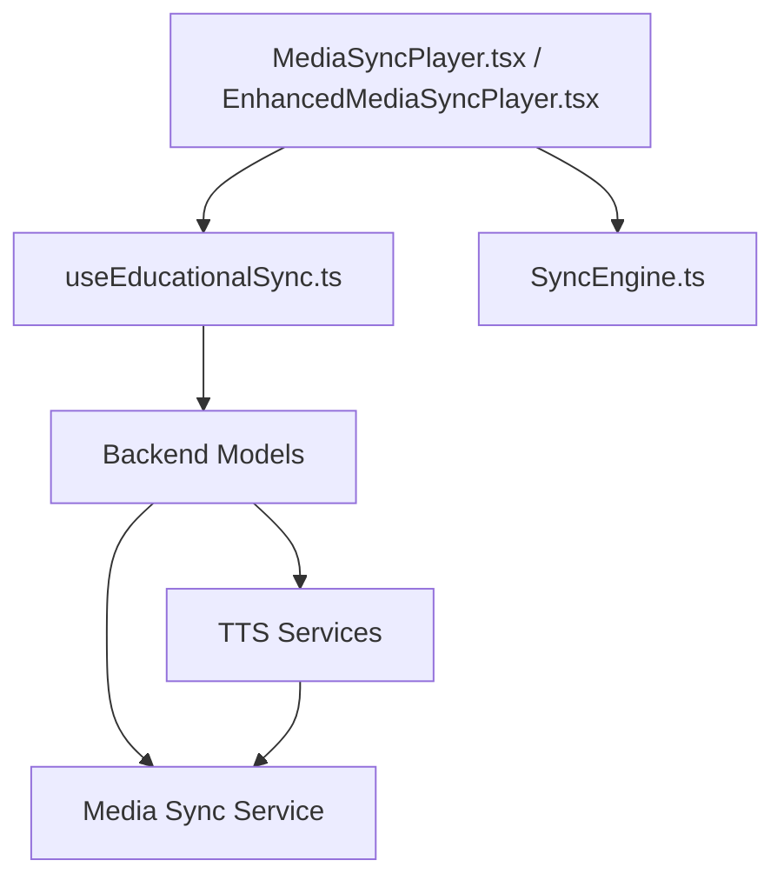

# Multi-Modal Content Synchronization

<cite>
**Referenced Files in This Document**
- [SyncEngine.ts](file://frontend/src/sync/SyncEngine.ts)
- [MediaSyncPlayer.tsx](file://frontend/src/components/MediaSyncPlayer.tsx)
- [EnhancedMediaSyncPlayer.tsx](file://frontend/src/components/EnhancedMediaSyncPlayer.tsx)
- [useEducationalSync.ts](file://frontend/src/hooks/useEducationalSync.ts)
- [MediaCue.js](file://backend/models/MediaCue.js)
- [NarrationSegment.js](file://backend/models/NarrationSegment.js)
- [Formula.js](file://backend/models/Formula.js)
- [FormulaToken.js](file://backend/models/FormulaToken.js)
- [ttsRoutes.js](file://backend/routes/ttsRoutes.js)
- [educationalProcessingRoutes.js](file://backend/routes/educationalProcessingRoutes.js)
- [media-sync/src/index.ts](file://services/media-sync/src/index.ts)
- [media-sync-service/src/server.js](file://services/media-sync-service/src/server.js)
- [ttsService.ts](file://frontend/src/services/ttsService.ts)
- [ttsCache.js](file://backend/utils/ttsCache.js)
</cite>

## Table of Contents
1. [Introduction](#introduction)
2. [Project Structure](#project-structure)
3. [Core Components](#core-components)
4. [Architecture Overview](#architecture-overview)
5. [Detailed Component Analysis](#detailed-component-analysis)
6. [Dependency Analysis](#dependency-analysis)
7. [Performance Considerations](#performance-considerations)
8. [Troubleshooting Guide](#troubleshooting-guide)
9. [Conclusion](#conclusion)

## Introduction
This document describes the multi-modal content synchronization system that coordinates text, audio, and visual content delivery in an educational audiobook experience. The system ensures real-time alignment between narration audio and on-screen cues such as formula segments, visual highlights, and step-by-step instructional content. It covers timing mechanisms, cue point management, playback coordination, cross-modal triggers, synchronization algorithms, fallback strategies, error handling, configuration examples, and performance optimization techniques.

## Project Structure
The synchronization system spans the frontend React components, a dedicated synchronization engine, backend models for cue management, and supporting services for text-to-speech and media orchestration.

**Diagram sources**
- [MediaSyncPlayer.tsx:1-310](file://frontend/src/components/MediaSyncPlayer.tsx#L1-L310)
- [EnhancedMediaSyncPlayer.tsx:1-577](file://frontend/src/components/EnhancedMediaSyncPlayer.tsx#L1-L577)
- [useEducationalSync.ts](file://frontend/src/hooks/useEducationalSync.ts)
- [SyncEngine.ts:1-115](file://frontend/src/sync/SyncEngine.ts#L1-L115)
- [MediaCue.js](file://backend/models/MediaCue.js)
- [NarrationSegment.js](file://backend/models/NarrationSegment.js)
- [Formula.js](file://backend/models/Formula.js)
- [FormulaToken.js](file://backend/models/FormulaToken.js)
- [ttsRoutes.js](file://backend/routes/ttsRoutes.js)
- [media-sync/src/index.ts](file://services/media-sync/src/index.ts)
- [media-sync-service/src/server.js](file://services/media-sync-service/src/server.js)

**Section sources**
- [MediaSyncPlayer.tsx:1-310](file://frontend/src/components/MediaSyncPlayer.tsx#L1-L310)
- [EnhancedMediaSyncPlayer.tsx:1-577](file://frontend/src/components/EnhancedMediaSyncPlayer.tsx#L1-L577)
- [useEducationalSync.ts](file://frontend/src/hooks/useEducationalSync.ts)
- [SyncEngine.ts:1-115](file://frontend/src/sync/SyncEngine.ts#L1-L115)

## Core Components
- SyncEngine: Central timing and cue firing engine that aligns audio playback with visual/text cues using millisecond-precision timestamps.
- MediaSyncPlayer: Basic player UI that detects active cues around the current audio time and triggers cross-modal updates.
- EnhancedMediaSyncPlayer: Advanced player with adaptive pacing, PayGO session management, and enhanced cue metadata handling.
- useEducationalSync: React hook orchestrating WebSocket connections, cue retrieval, progress tracking, and cue triggering.
- Backend Models: Data models for cues, narration segments, and formulas that define synchronization points.
- TTS Pipeline: Routes and caching for generating narrations aligned with synchronized cues.
- Media Sync Service: Dedicated service for coordinating multi-modal content delivery.

**Section sources**
- [SyncEngine.ts:1-115](file://frontend/src/sync/SyncEngine.ts#L1-L115)
- [MediaSyncPlayer.tsx:1-310](file://frontend/src/components/MediaSyncPlayer.tsx#L1-L310)
- [EnhancedMediaSyncPlayer.tsx:1-577](file://frontend/src/components/EnhancedMediaSyncPlayer.tsx#L1-L577)
- [useEducationalSync.ts](file://frontend/src/hooks/useEducationalSync.ts)

## Architecture Overview
The system operates on a client-server model with real-time synchronization:
- Frontend renders audio and displays active cues.
- useEducationalSync manages a WebSocket connection to receive synchronized cue events and progress updates.
- SyncEngine drives automatic cue firing during playback and supports manual step navigation.
- Backend models store cue definitions and narration segments.
- TTS services generate audio aligned with cues.
- Media Sync Service coordinates cross-modal triggers and fallbacks.

**Diagram sources**
- [EnhancedMediaSyncPlayer.tsx:74-155](file://frontend/src/components/EnhancedMediaSyncPlayer.tsx#L74-L155)
- [useEducationalSync.ts](file://frontend/src/hooks/useEducationalSync.ts)
- [SyncEngine.ts:72-106](file://frontend/src/sync/SyncEngine.ts#L72-L106)
- [MediaCue.js](file://backend/models/MediaCue.js)
- [ttsRoutes.js](file://backend/routes/ttsRoutes.js)

## Detailed Component Analysis

### SyncEngine: Timing and Cue Firing
The SyncEngine manages precise timing and cue activation:
- Tracks audio start time and uses requestAnimationFrame for efficient tick loops.
- Filters cues by type and time window to avoid redundant firings.
- Supports manual mode with step cues for interactive navigation.
- Emits analytics events for mode switching and cue triggers.

**Diagram sources**
- [SyncEngine.ts:3-21](file://frontend/src/sync/SyncEngine.ts#L3-L21)
- [SyncEngine.ts:72-114](file://frontend/src/sync/SyncEngine.ts#L72-L114)

**Section sources**
- [SyncEngine.ts:1-115](file://frontend/src/sync/SyncEngine.ts#L1-L115)

### MediaSyncPlayer: Basic Synchronization UI
The basic player integrates audio playback with cue detection:
- Uses timeupdate events to scan for active cues near the current time.
- Maintains active cues and current cue state for UI feedback.
- Updates reading progress periodically and marks completion on end.
- Joins the book room via useEducationalSync and leaves on unmount.

**Diagram sources**
- [MediaSyncPlayer.tsx:48-108](file://frontend/src/components/MediaSyncPlayer.tsx#L48-L108)

**Section sources**
- [MediaSyncPlayer.tsx:1-310](file://frontend/src/components/MediaSyncPlayer.tsx#L1-L310)

### EnhancedMediaSyncPlayer: Advanced Features
The enhanced player adds adaptive pacing, PayGO session management, and richer cue metadata:
- Adaptive pacing adjusts playback rate based on cue complexity metadata.
- PayGO integration starts and ends sessions automatically, tracks charges, and shows warnings.
- Displays voice role indicators and cue complexity visuals.
- Integrates heartbeat updates and pause history for adaptive suggestions.

**Diagram sources**
- [EnhancedMediaSyncPlayer.tsx:74-155](file://frontend/src/components/EnhancedMediaSyncPlayer.tsx#L74-L155)
- [EnhancedMediaSyncPlayer.tsx:157-231](file://frontend/src/components/EnhancedMediaSyncPlayer.tsx#L157-L231)
- [SyncEngine.ts:72-106](file://frontend/src/sync/SyncEngine.ts#L72-L106)

**Section sources**
- [EnhancedMediaSyncPlayer.tsx:1-577](file://frontend/src/components/EnhancedMediaSyncPlayer.tsx#L1-L577)

### Backend Models: Cue and Narration Alignment
Backend models define the synchronization schema:
- MediaCue: Stores cue definitions with timestamp_ms, cue_type, content, and optional metadata.
- NarrationSegment: Links narration audio segments to content for alignment.
- Formula and FormulaToken: Enable formula-specific cues and rendering.

**Diagram sources**
- [MediaCue.js](file://backend/models/MediaCue.js)
- [NarrationSegment.js](file://backend/models/NarrationSegment.js)
- [Formula.js](file://backend/models/Formula.js)
- [FormulaToken.js](file://backend/models/FormulaToken.js)

**Section sources**
- [MediaCue.js](file://backend/models/MediaCue.js)
- [NarrationSegment.js](file://backend/models/NarrationSegment.js)
- [Formula.js](file://backend/models/Formula.js)
- [FormulaToken.js](file://backend/models/FormulaToken.js)

### TTS and Media Sync Services
TTS generation and media synchronization rely on:
- ttsRoutes: Exposes endpoints for TTS generation and caching.
- ttsService: Frontend service for requesting narrations aligned with cues.
- ttsCache: Backend caching layer to reduce latency and cost.
- media-sync/src/index.ts and media-sync-service/src/server.js: Dedicated service for cross-modal coordination and fallback handling.

**Diagram sources**
- [ttsService.ts](file://frontend/src/services/ttsService.ts)
- [ttsRoutes.js](file://backend/routes/ttsRoutes.js)
- [ttsCache.js](file://backend/utils/ttsCache.js)
- [media-sync/src/index.ts](file://services/media-sync/src/index.ts)
- [media-sync-service/src/server.js](file://services/media-sync-service/src/server.js)

**Section sources**
- [ttsRoutes.js](file://backend/routes/ttsRoutes.js)
- [ttsService.ts](file://frontend/src/services/ttsService.ts)
- [ttsCache.js](file://backend/utils/ttsCache.js)
- [media-sync/src/index.ts](file://services/media-sync/src/index.ts)
- [media-sync-service/src/server.js](file://services/media-sync-service/src/server.js)

## Dependency Analysis
The synchronization pipeline depends on:
- Frontend components depend on useEducationalSync for real-time cue updates.
- SyncEngine depends on HTMLAudioElement timing and requestAnimationFrame.
- Backend models define cue semantics and narration alignment.
- TTS services provide synchronized audio generation.
- Media Sync Service coordinates cross-modal triggers and fallbacks.

**Diagram sources**
- [MediaSyncPlayer.tsx:1-310](file://frontend/src/components/MediaSyncPlayer.tsx#L1-L310)
- [EnhancedMediaSyncPlayer.tsx:1-577](file://frontend/src/components/EnhancedMediaSyncPlayer.tsx#L1-L577)
- [useEducationalSync.ts](file://frontend/src/hooks/useEducationalSync.ts)
- [SyncEngine.ts:1-115](file://frontend/src/sync/SyncEngine.ts#L1-L115)
- [MediaCue.js](file://backend/models/MediaCue.js)
- [ttsRoutes.js](file://backend/routes/ttsRoutes.js)
- [media-sync/src/index.ts](file://services/media-sync/src/index.ts)
- [media-sync-service/src/server.js](file://services/media-sync-service/src/server.js)

**Section sources**
- [MediaSyncPlayer.tsx:1-310](file://frontend/src/components/MediaSyncPlayer.tsx#L1-L310)
- [EnhancedMediaSyncPlayer.tsx:1-577](file://frontend/src/components/EnhancedMediaSyncPlayer.tsx#L1-L577)
- [useEducationalSync.ts](file://frontend/src/hooks/useEducationalSync.ts)
- [SyncEngine.ts:1-115](file://frontend/src/sync/SyncEngine.ts#L1-L115)

## Performance Considerations
- Use requestAnimationFrame in SyncEngine for smooth timing without excessive CPU usage.
- Apply a small tolerance window when detecting active cues to avoid frequent re-renders.
- Debounce progress updates to reduce network and UI overhead.
- Cache TTS audio and reuse segments to minimize latency and costs.
- Prefer adaptive pacing only when cue metadata is present to avoid unnecessary adjustments.
- Monitor PayGO session heartbeats to maintain accurate billing and prevent idle timeouts.

[No sources needed since this section provides general guidance]

## Troubleshooting Guide
Common issues and resolutions:
- Cues not firing during playback:
  - Verify audio element is set and play() is called.
  - Confirm cue timestamps are within the tolerance window.
  - Check for manual mode disabling automatic step cues.
- Inconsistent cue timing:
  - Ensure audio currentTime is used consistently for cue detection.
  - Validate NarrationSegment alignment and MediaCue timestamps.
- WebSocket disconnections:
  - Rejoin the book room and reinitialize SyncEngine.
  - Confirm server-side media-sync-service availability.
- PayGO session failures:
  - Check wallet status and balance before starting sessions.
  - Handle heartbeat errors and retry logic gracefully.
- TTS generation delays:
  - Use ttsCache to pre-generate and cache narrations.
  - Monitor ttsRoutes endpoint health and response times.

**Section sources**
- [SyncEngine.ts:72-106](file://frontend/src/sync/SyncEngine.ts#L72-L106)
- [EnhancedMediaSyncPlayer.tsx:157-231](file://frontend/src/components/EnhancedMediaSyncPlayer.tsx#L157-L231)
- [ttsCache.js](file://backend/utils/ttsCache.js)

## Conclusion
The multi-modal synchronization system provides a robust framework for aligning audio narration with visual and textual cues. By combining precise timing, adaptive pacing, real-time cue detection, and integrated PayGO billing, it delivers a seamless educational experience. The modular architecture allows for extensibility, improved performance, and reliable fallbacks across different content types.