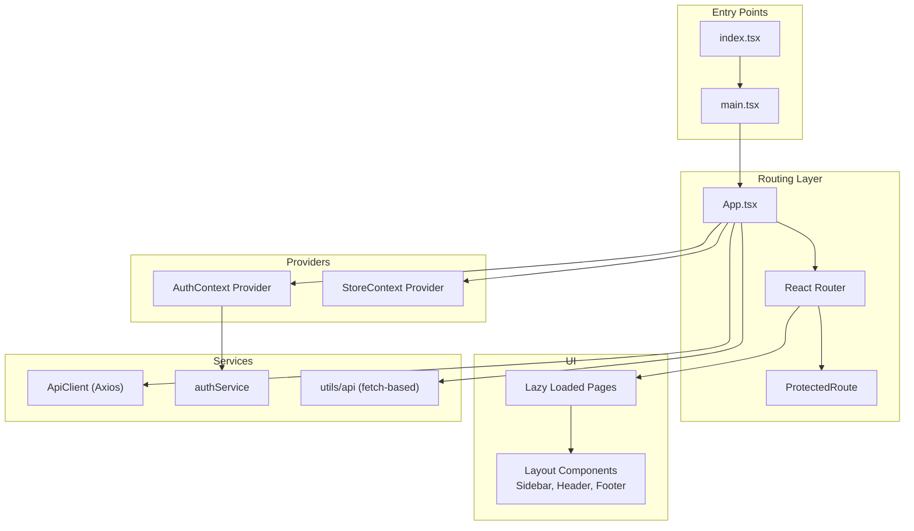
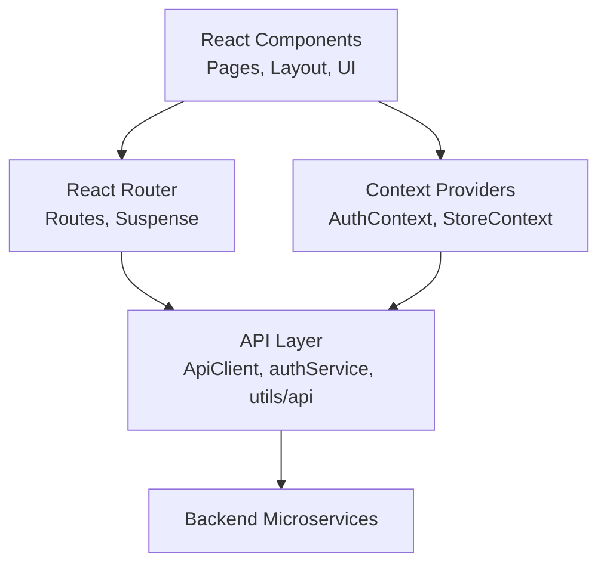
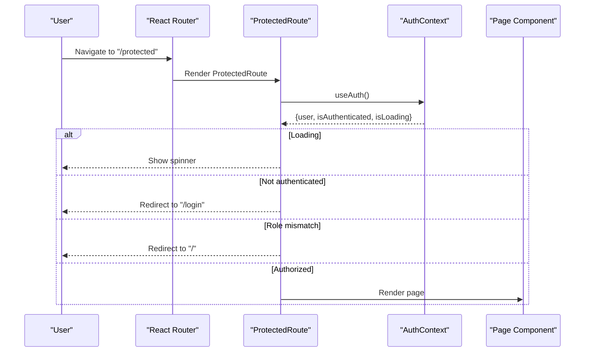
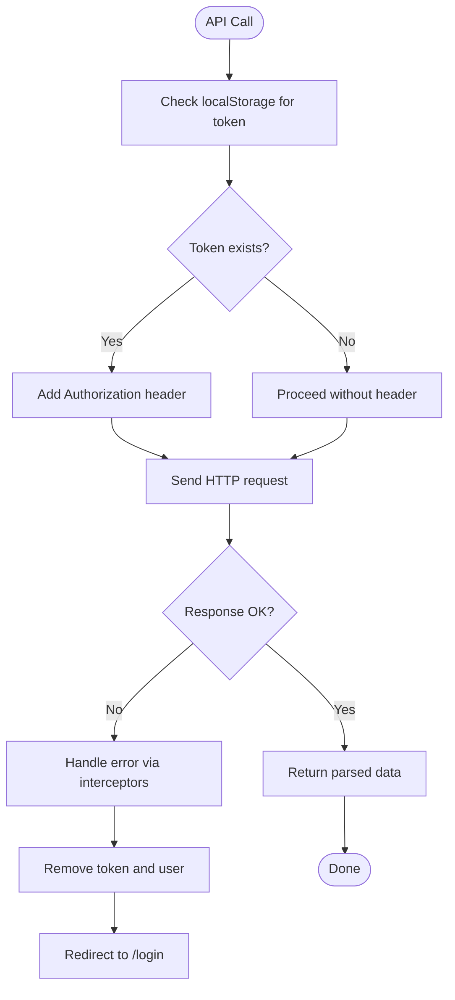
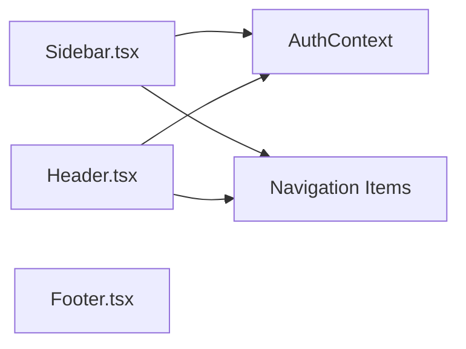
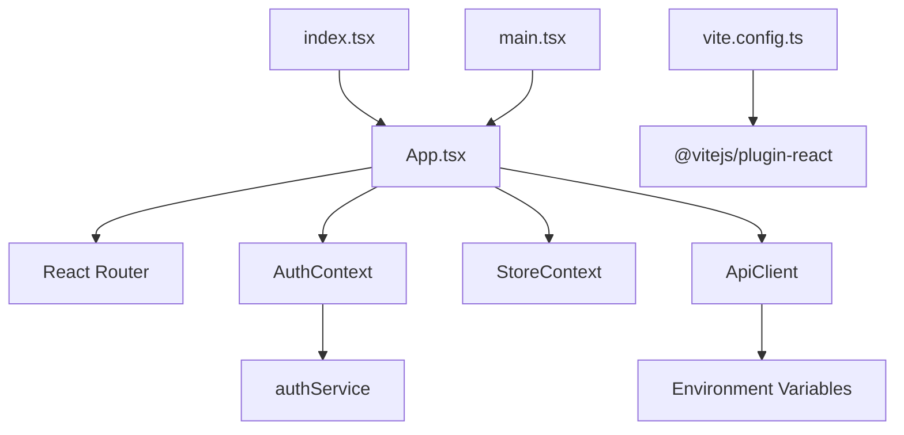

# Application Architecture

<cite>
**Referenced Files in This Document**
- [main.tsx](file://frontend/src/main.tsx)
- [index.tsx](file://frontend/src/index.tsx)
- [App.tsx](file://frontend/src/App.tsx)
- [AuthContext.tsx](file://frontend/src/contexts/AuthContext.tsx)
- [StoreContext.tsx](file://frontend/src/contexts/StoreContext.tsx)
- [authService.ts](file://frontend/src/api/services/authService.ts)
- [client.ts](file://frontend/src/api/client.ts)
- [api.ts](file://frontend/src/utils/api.ts)
- [Sidebar.tsx](file://frontend/src/components/layout/Sidebar.tsx)
- [Header.tsx](file://frontend/src/components/layout/Header.tsx)
- [Footer.tsx](file://frontend/src/components/layout/Footer.tsx)
- [Home.tsx](file://frontend/src/pages/Home.tsx)
- [vite.config.ts](file://frontend/vite.config.ts)
</cite>

## Table of Contents
1. [Introduction](#introduction)
2. [Project Structure](#project-structure)
3. [Core Components](#core-components)
4. [Architecture Overview](#architecture-overview)
5. [Detailed Component Analysis](#detailed-component-analysis)
6. [Dependency Analysis](#dependency-analysis)
7. [Performance Considerations](#performance-considerations)
8. [Troubleshooting Guide](#troubleshooting-guide)
9. [Conclusion](#conclusion)

## Introduction
This document explains the frontend architecture of the QuantumMint Bookstore application. It covers the React 19 application structure, routing with React Router, lazy loading and Suspense boundaries, context-based state management (authentication and global store), and the initialization flow. It also outlines performance strategies for code splitting and lazy-loaded routes.

## Project Structure
The frontend is a Vite-built React application organized by feature and domain:
- Root entry points initialize providers and render the app.
- Routing is centralized with lazy-loaded page components.
- Context providers manage authentication and global state.
- Services encapsulate API communication to backend microservices.
- UI components are grouped under shared component libraries.



**Diagram sources**
- [index.tsx:1-19](file://frontend/src/index.tsx#L1-L19)
- [main.tsx:1-17](file://frontend/src/main.tsx#L1-L17)
- [App.tsx:145-156](file://frontend/src/App.tsx#L145-L156)
- [AuthContext.tsx:16-73](file://frontend/src/contexts/AuthContext.tsx#L16-L73)
- [StoreContext.tsx:17-49](file://frontend/src/contexts/StoreContext.tsx#L17-L49)
- [authService.ts:4-57](file://frontend/src/api/services/authService.ts#L4-L57)
- [client.ts:10-119](file://frontend/src/api/client.ts#L10-L119)
- [api.ts:1-770](file://frontend/src/utils/api.ts#L1-L770)

**Section sources**
- [index.tsx:1-19](file://frontend/src/index.tsx#L1-L19)
- [main.tsx:1-17](file://frontend/src/main.tsx#L1-L17)
- [vite.config.ts:1-20](file://frontend/vite.config.ts#L1-L20)

## Core Components
- Application bootstrap and provider wiring:
  - Root renders ErrorBoundary and mounts App.
  - App wraps content in Router, AuthProvider, and StoreProvider.
- Routing and navigation:
  - Centralized routes with lazy-loaded page components.
  - ProtectedRoute enforces authentication and role checks.
- Context providers:
  - AuthContext manages user session, login/logout, and loading state.
  - StoreContext manages cart and selected book state.
- API layer:
  - Axios-based ApiClient with interceptors for auth and error handling.
  - authService persists tokens and user data in localStorage.
  - utils/api provides fetch-based wrappers for internal endpoints.

**Section sources**
- [index.tsx:10-18](file://frontend/src/index.tsx#L10-L18)
- [main.tsx:11-16](file://frontend/src/main.tsx#L11-L16)
- [App.tsx:145-156](file://frontend/src/App.tsx#L145-L156)
- [AuthContext.tsx:16-73](file://frontend/src/contexts/AuthContext.tsx#L16-L73)
- [StoreContext.tsx:17-49](file://frontend/src/contexts/StoreContext.tsx#L17-L49)
- [authService.ts:4-57](file://frontend/src/api/services/authService.ts#L4-L57)
- [client.ts:10-47](file://frontend/src/api/client.ts#L10-L47)

## Architecture Overview
The application follows a layered architecture:
- Presentation layer: React components and pages.
- Routing layer: React Router with lazy-loaded routes and Suspense boundaries.
- State management: Context providers for auth and store.
- Service layer: Axios-based ApiClient and fetch-based utilities for backend communication.
- Infrastructure: Vite build tooling with React plugin and path aliases.



**Diagram sources**
- [App.tsx:91-139](file://frontend/src/App.tsx#L91-L139)
- [AuthContext.tsx:16-73](file://frontend/src/contexts/AuthContext.tsx#L16-L73)
- [StoreContext.tsx:17-49](file://frontend/src/contexts/StoreContext.tsx#L17-L49)
- [client.ts:10-119](file://frontend/src/api/client.ts#L10-L119)
- [api.ts:17-63](file://frontend/src/utils/api.ts#L17-L63)

## Detailed Component Analysis

### Routing and Navigation
- Lazy loading and Suspense:
  - Pages are dynamically imported and wrapped in Suspense with a fallback loader.
  - Suspense boundary ensures smooth transitions during route changes.
- Protected routes:
  - ProtectedRoute checks authentication and optional role-based access.
  - Redirects unauthenticated users to login and handles role mismatches.
- Route coverage:
  - Learner, seller, and admin routes are guarded by roles.
  - Public pages (privacy, terms, about, contact, faq, support) are accessible without authentication.



**Diagram sources**
- [App.tsx:52-69](file://frontend/src/App.tsx#L52-L69)
- [App.tsx:91-139](file://frontend/src/App.tsx#L91-L139)
- [AuthContext.tsx:75-81](file://frontend/src/contexts/AuthContext.tsx#L75-L81)

**Section sources**
- [App.tsx:15-49](file://frontend/src/App.tsx#L15-L49)
- [App.tsx:52-69](file://frontend/src/App.tsx#L52-L69)
- [App.tsx:91-139](file://frontend/src/App.tsx#L91-L139)

### Context-Based State Management
- AuthContext:
  - Provides login, register, logout, and user state.
  - Persists tokens and user data in localStorage.
  - Handles loading states and error propagation.
- StoreContext:
  - Manages books, cart, and selected book.
  - Exposes actions to add/remove/clear cart items.

```mermaid
classDiagram
class AuthContext {
+boolean isAuthenticated
+User user
+boolean isLoading
+login(credentials) Promise~void~
+register(data) Promise~void~
+logout() Promise~void~
}
class StoreContext {
+Book[] books
+Book[] cart
+Book selectedBook
+addToCart(book) void
+removeFromCart(id) void
+clearCart() void
+setSelectedBook(book) void
}
class authService {
+login(credentials) Promise~{user, token}~
+register(data) Promise~{user, token}~
+logout() Promise~void~
+getCurrentUser() User|null
}
AuthContext --> authService : "uses"
```

**Diagram sources**
- [AuthContext.tsx:5-12](file://frontend/src/contexts/AuthContext.tsx#L5-L12)
- [AuthContext.tsx:16-73](file://frontend/src/contexts/AuthContext.tsx#L16-L73)
- [StoreContext.tsx:5-13](file://frontend/src/contexts/StoreContext.tsx#L5-L13)
- [StoreContext.tsx:17-49](file://frontend/src/contexts/StoreContext.tsx#L17-L49)
- [authService.ts:4-57](file://frontend/src/api/services/authService.ts#L4-L57)

**Section sources**
- [AuthContext.tsx:16-73](file://frontend/src/contexts/AuthContext.tsx#L16-L73)
- [StoreContext.tsx:17-49](file://frontend/src/contexts/StoreContext.tsx#L17-L49)
- [authService.ts:4-57](file://frontend/src/api/services/authService.ts#L4-L57)

### API Communication Layer
- Axios-based ApiClient:
  - Centralized request/response interceptors.
  - Adds Authorization header from localStorage.
  - Handles 401 by clearing auth and redirecting to login.
- Fetch-based utilities:
  - Additional API helpers for internal endpoints with Sentry tagging and correlation IDs.
- Environment-driven service URLs:
  - Backend service base URLs loaded from environment variables.



**Diagram sources**
- [client.ts:22-46](file://frontend/src/api/client.ts#L22-L46)
- [client.ts:89-119](file://frontend/src/api/client.ts#L89-L119)
- [api.ts:17-63](file://frontend/src/utils/api.ts#L17-L63)

**Section sources**
- [client.ts:10-119](file://frontend/src/api/client.ts#L10-L119)
- [api.ts:17-63](file://frontend/src/utils/api.ts#L17-L63)

### Layout and Navigation Components
- Sidebar:
  - Role-aware navigation items for learner, seller, and admin.
  - Logout button wired to AuthContext.
- Header:
  - Dynamic dashboard links based on user role.
  - Logout button wired to AuthContext.
- Footer:
  - Static footer with legal links.



**Diagram sources**
- [Sidebar.tsx:10-78](file://frontend/src/components/layout/Sidebar.tsx#L10-L78)
- [Header.tsx:7-88](file://frontend/src/components/layout/Header.tsx#L7-L88)
- [Footer.tsx:1-20](file://frontend/src/components/layout/Footer.tsx#L1-L20)
- [AuthContext.tsx:75-81](file://frontend/src/contexts/AuthContext.tsx#L75-L81)

**Section sources**
- [Sidebar.tsx:10-78](file://frontend/src/components/layout/Sidebar.tsx#L10-L78)
- [Header.tsx:7-88](file://frontend/src/components/layout/Header.tsx#L7-L88)
- [Footer.tsx:1-20](file://frontend/src/components/layout/Footer.tsx#L1-L20)

### Example Page: Home
- Demonstrates:
  - Local state for search and results.
  - Navigation via useNavigate.
  - Integration with centralized API utilities for search.

**Section sources**
- [Home.tsx:8-333](file://frontend/src/pages/Home.tsx#L8-L333)

## Dependency Analysis
- Entry points depend on App and ErrorBoundary.
- App depends on Router, AuthProvider, StoreProvider, and lazy-loaded pages.
- AuthContext depends on authService for persistence and network calls.
- ApiClient depends on environment variables for backend base URLs.
- Vite configuration enables React plugin and path aliasing.



**Diagram sources**
- [index.tsx:1-19](file://frontend/src/index.tsx#L1-L19)
- [main.tsx:1-17](file://frontend/src/main.tsx#L1-L17)
- [App.tsx:145-156](file://frontend/src/App.tsx#L145-L156)
- [AuthContext.tsx:16-73](file://frontend/src/contexts/AuthContext.tsx#L16-L73)
- [authService.ts:4-57](file://frontend/src/api/services/authService.ts#L4-L57)
- [client.ts:89-119](file://frontend/src/api/client.ts#L89-L119)
- [vite.config.ts:1-20](file://frontend/vite.config.ts#L1-L20)

**Section sources**
- [index.tsx:1-19](file://frontend/src/index.tsx#L1-L19)
- [main.tsx:1-17](file://frontend/src/main.tsx#L1-L17)
- [App.tsx:145-156](file://frontend/src/App.tsx#L145-L156)
- [client.ts:89-119](file://frontend/src/api/client.ts#L89-L119)
- [vite.config.ts:1-20](file://frontend/vite.config.ts#L1-L20)

## Performance Considerations
- Code splitting and lazy loading:
  - All page components are lazy-loaded to reduce initial bundle size.
  - Suspense fallback provides a consistent loading experience while chunks load.
- Build tooling:
  - Vite with React plugin optimizes development and production builds.
  - Path aliasing improves module resolution and maintainability.
- Network performance:
  - ApiClient interceptors centralize auth and error handling, reducing repeated logic.
  - Environment-driven service URLs enable easy switching between environments.

[No sources needed since this section provides general guidance]

## Troubleshooting Guide
- Authentication issues:
  - 401 responses trigger automatic logout and redirect to login.
  - Verify localStorage contains a valid token and user data.
- Route protection:
  - ProtectedRoute displays a spinner while checking auth state; ensure AuthContext is mounted at the root.
  - Role mismatches redirect to home; confirm user role is set correctly.
- API connectivity:
  - Confirm environment variables for backend base URLs are set.
  - Inspect request/response interceptors for Authorization header and error messages.

**Section sources**
- [client.ts:34-46](file://frontend/src/api/client.ts#L34-L46)
- [App.tsx:56-68](file://frontend/src/App.tsx#L56-L68)
- [authService.ts:32-55](file://frontend/src/api/services/authService.ts#L32-L55)

## Conclusion
The QuantumMint Bookstore frontend employs a clean, layered architecture with React Router for navigation, Suspense for lazy-loading UX, and context providers for state management. The API layer consolidates backend communication through Axios interceptors and fetch utilities. The Vite configuration supports efficient development and production builds. Together, these patterns deliver a scalable, maintainable, and performant frontend foundation.