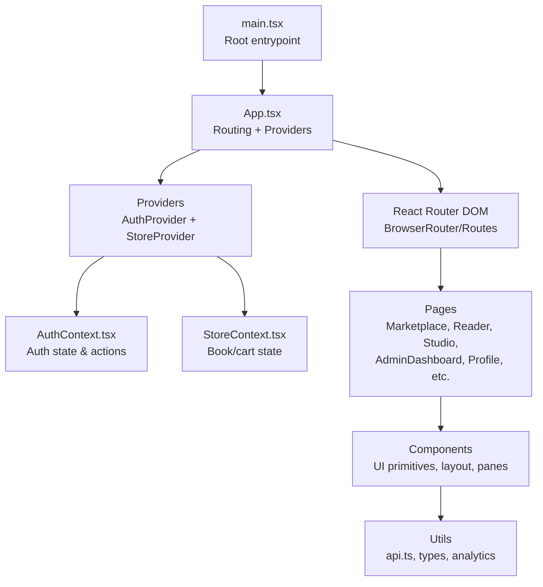
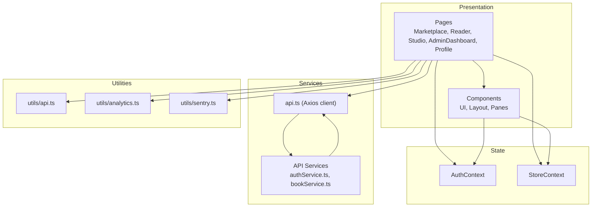
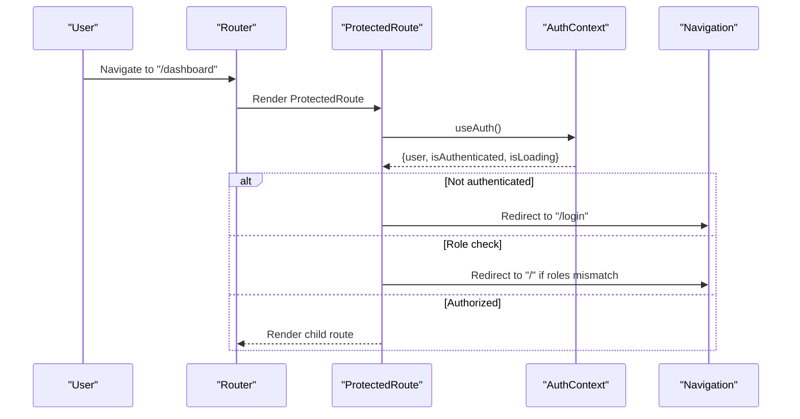
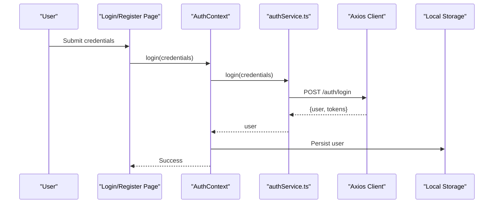
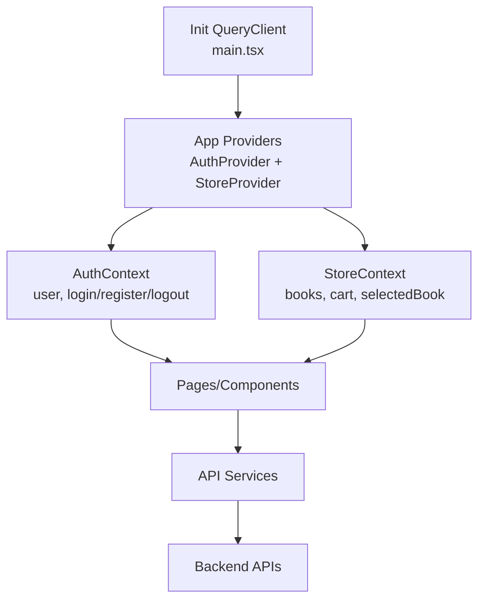
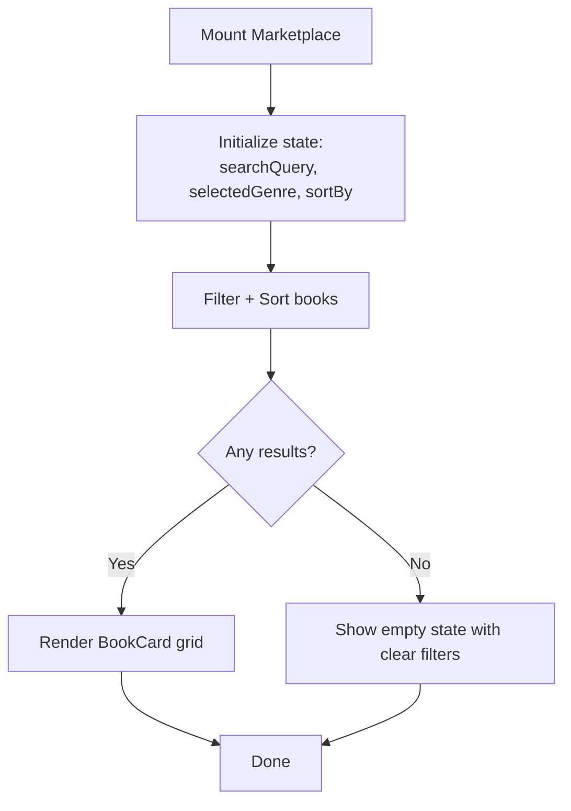
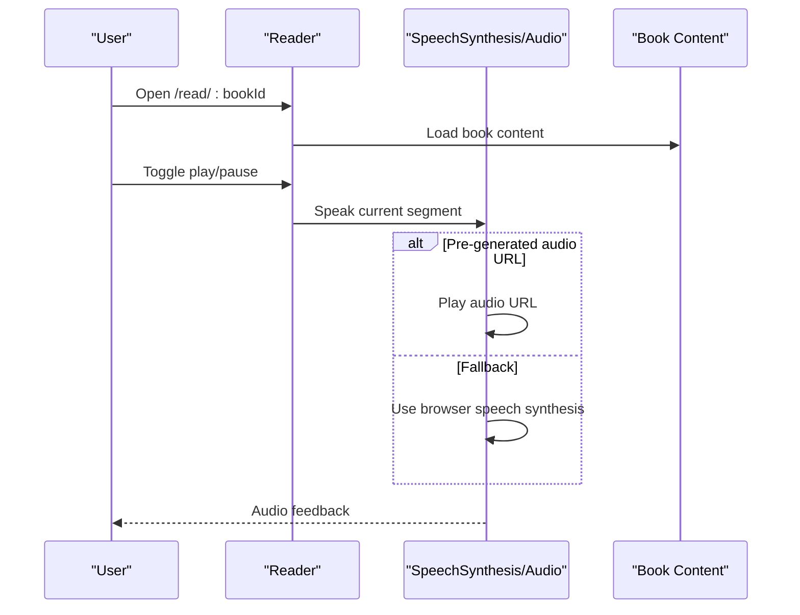
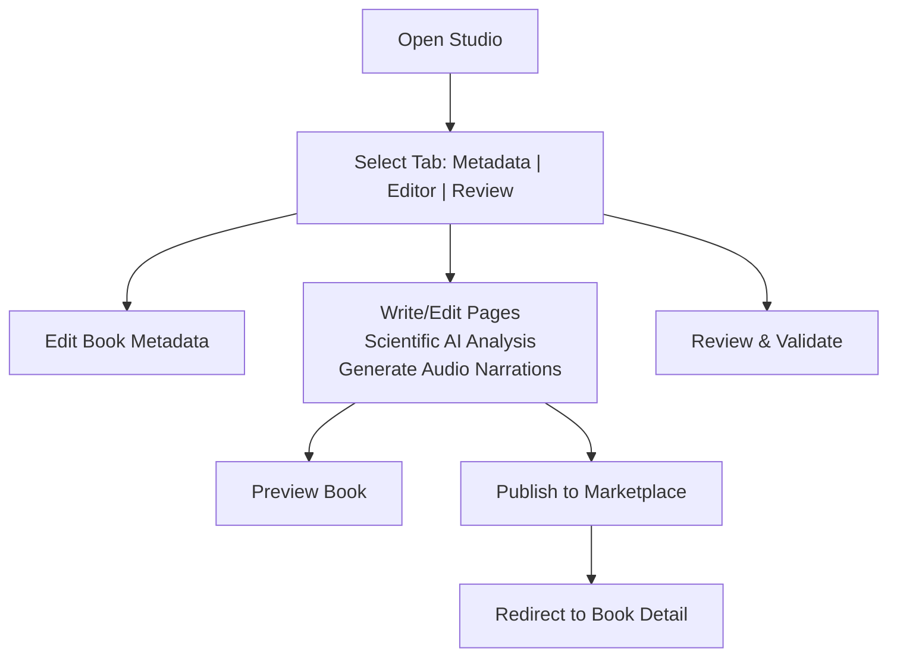
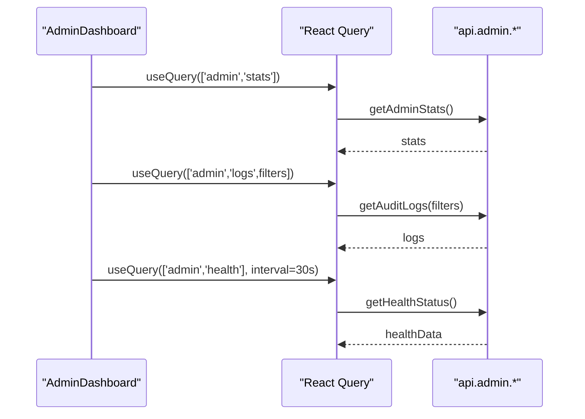
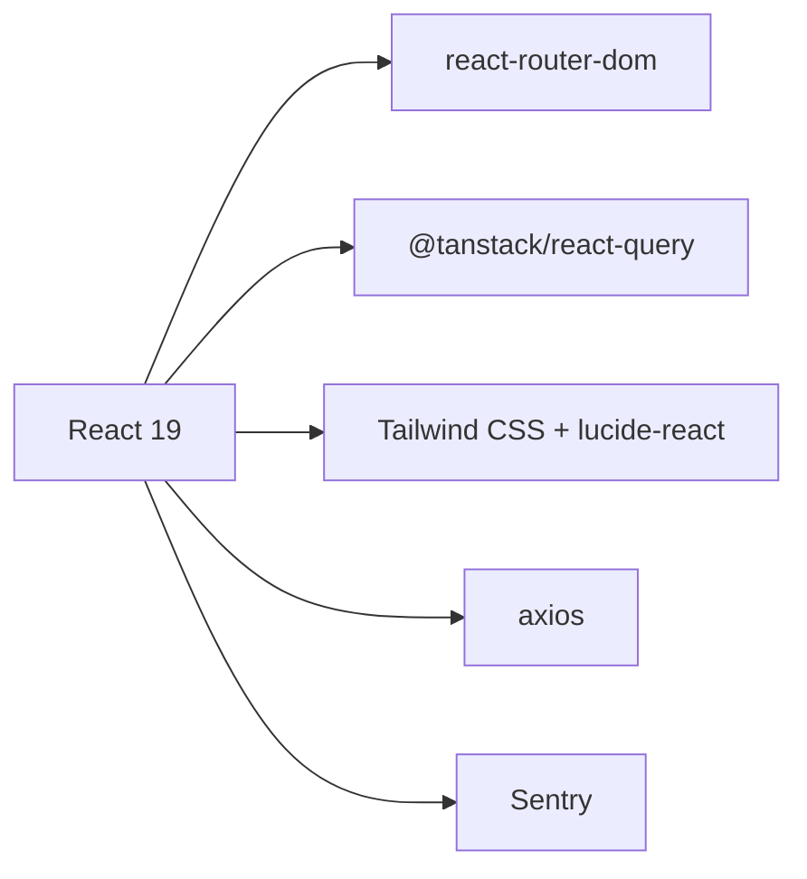

# Frontend Application

<cite>
**Referenced Files in This Document**
- [main.tsx](file://frontend/src/main.tsx)
- [index.tsx](file://frontend/src/index.tsx)
- [App.tsx](file://frontend/src/App.tsx)
- [AuthContext.tsx](file://frontend/src/contexts/AuthContext.tsx)
- [StoreContext.tsx](file://frontend/src/contexts/StoreContext.tsx)
- [Sidebar.tsx](file://frontend/src/components/layout/Sidebar.tsx)
- [Header.tsx](file://frontend/src/components/layout/Header.tsx)
- [api.ts](file://frontend/src/utils/api.ts)
- [api.ts](file://frontend/src/api/index.ts)
- [authService.ts](file://frontend/src/api/services/authService.ts)
- [bookService.ts](file://frontend/src/api/services/bookService.ts)
- [Marketplace.tsx](file://frontend/src/pages/Marketplace.tsx)
- [Reader.tsx](file://frontend/src/pages/Reader.tsx)
- [Studio.tsx](file://frontend/src/pages/Studio.tsx)
- [AdminDashboard.tsx](file://frontend/src/pages/AdminDashboard.tsx)
- [Profile.tsx](file://frontend/src/pages/Profile.tsx)
- [package.json](file://frontend/package.json)
- [tailwind.config.js](file://frontend/tailwind.config.js)
</cite>

## Table of Contents
1. [Introduction](#introduction)
2. [Project Structure](#project-structure)
3. [Core Components](#core-components)
4. [Architecture Overview](#architecture-overview)
5. [Detailed Component Analysis](#detailed-component-analysis)
6. [Dependency Analysis](#dependency-analysis)
7. [Performance Considerations](#performance-considerations)
8. [Troubleshooting Guide](#troubleshooting-guide)
9. [Conclusion](#conclusion)

## Introduction
This document describes the QuantumMint Bookstore frontend application built with React 19. It explains the application’s structure, routing system, component architecture, state management patterns, authentication flow, navigation, and UI composition. It also documents reusable UI components, styling and responsiveness, accessibility considerations, backend integration patterns, and performance optimization techniques.

## Project Structure
The frontend is organized around a React 19 application with:
- A strict router-based entrypoint and provider setup
- Context-based authentication and store state
- Feature-based pages under src/pages
- Shared UI components under src/components
- API clients and services under src/api and src/services
- Utilities and types under src/utils and src/types
- Styling via Tailwind CSS with a minimal configuration

**Diagram sources**
- [main.tsx:1-17](file://frontend/src/main.tsx#L1-L17)
- [App.tsx:145-156](file://frontend/src/App.tsx#L145-L156)
- [AuthContext.tsx:16-73](file://frontend/src/contexts/AuthContext.tsx#L16-L73)
- [StoreContext.tsx:17-48](file://frontend/src/contexts/StoreContext.tsx#L17-L48)

**Section sources**
- [main.tsx:1-17](file://frontend/src/main.tsx#L1-L17)
- [App.tsx:145-156](file://frontend/src/App.tsx#L145-L156)
- [package.json:12-34](file://frontend/package.json#L12-L34)
- [tailwind.config.js:1-12](file://frontend/tailwind.config.js#L1-L12)

## Core Components
- Routing and Navigation
  - App sets up React Router with lazy-loaded pages and a ProtectedRoute wrapper for role-based access.
  - Sidebar and Header provide primary navigation and user actions.
- State Management
  - AuthContext manages authentication state, loading, login/register/logout, and exposes user info.
  - StoreContext manages books, cart, and selected book for marketplace-like flows.
- UI Layer
  - Reusable UI primitives (Button, Card, Dialog, Tabs, etc.) and specialized components (BookCard, MathRenderer, AudioPlayer, etc.).

**Section sources**
- [App.tsx:52-69](file://frontend/src/App.tsx#L52-L69)
- [Sidebar.tsx:10-78](file://frontend/src/components/layout/Sidebar.tsx#L10-L78)
- [Header.tsx:7-88](file://frontend/src/components/layout/Header.tsx#L7-L88)
- [AuthContext.tsx:16-73](file://frontend/src/contexts/AuthContext.tsx#L16-L73)
- [StoreContext.tsx:17-48](file://frontend/src/contexts/StoreContext.tsx#L17-L48)

## Architecture Overview
The frontend follows a layered architecture:
- Presentation layer: Pages and Components
- State layer: Context providers (Auth, Store)
- Services layer: API clients and typed services
- Utilities: Analytics, Sentry, and shared helpers

**Diagram sources**
- [App.tsx:145-156](file://frontend/src/App.tsx#L145-L156)
- [AuthContext.tsx:16-73](file://frontend/src/contexts/AuthContext.tsx#L16-L73)
- [StoreContext.tsx:17-48](file://frontend/src/contexts/StoreContext.tsx#L17-L48)
- [api.ts](file://frontend/src/utils/api.ts)
- [authService.ts](file://frontend/src/api/services/authService.ts)
- [bookService.ts](file://frontend/src/api/services/bookService.ts)

## Detailed Component Analysis

### Routing and Navigation
- ProtectedRoute enforces authentication and optional role checks, redirecting unauthenticated users to login and rendering children otherwise.
- App defines routes for public pages, protected learner routes, seller routes, admin routes, and reader/editor routes.
- Sidebar and Header adaptively render based on user role and provide quick navigation and logout.

**Diagram sources**
- [App.tsx:52-69](file://frontend/src/App.tsx#L52-L69)
- [AuthContext.tsx:75-81](file://frontend/src/contexts/AuthContext.tsx#L75-L81)

**Section sources**
- [App.tsx:92-138](file://frontend/src/App.tsx#L92-L138)
- [Sidebar.tsx:10-78](file://frontend/src/components/layout/Sidebar.tsx#L10-L78)
- [Header.tsx:7-88](file://frontend/src/components/layout/Header.tsx#L7-L88)

### Authentication Flow
- AuthContext initializes from persisted user, supports login/register/logout via authService, and exposes loading state.
- Error boundaries wrap the app to capture rendering errors.

**Diagram sources**
- [AuthContext.tsx:28-57](file://frontend/src/contexts/AuthContext.tsx#L28-L57)
- [authService.ts](file://frontend/src/api/services/authService.ts)
- [api.ts](file://frontend/src/utils/api.ts)

**Section sources**
- [AuthContext.tsx:16-73](file://frontend/src/contexts/AuthContext.tsx#L16-L73)
- [index.tsx:4-18](file://frontend/src/index.tsx#L4-L18)

### State Management Patterns
- Context-based state:
  - AuthContext: user, isAuthenticated, isLoading, login, register, logout
  - StoreContext: books, cart, selectedBook, and CRUD operations
- React Query integration is initialized at the root for caching and optimistic updates.

**Diagram sources**
- [main.tsx:11-16](file://frontend/src/main.tsx#L11-L16)
- [App.tsx:148-152](file://frontend/src/App.tsx#L148-L152)
- [AuthContext.tsx:16-73](file://frontend/src/contexts/AuthContext.tsx#L16-L73)
- [StoreContext.tsx:17-48](file://frontend/src/contexts/StoreContext.tsx#L17-L48)

**Section sources**
- [main.tsx:11-16](file://frontend/src/main.tsx#L11-L16)
- [StoreContext.tsx:17-48](file://frontend/src/contexts/StoreContext.tsx#L17-L48)

### Page Components

#### Marketplace
- Purpose: Browse and filter audiobooks, powered by a local mock dataset and simple filtering/sorting logic.
- Features: Search box, genre filter, sort options, responsive grid, empty-state with clear filters.

**Diagram sources**
- [Marketplace.tsx:112-141](file://frontend/src/pages/Marketplace.tsx#L112-L141)

**Section sources**
- [Marketplace.tsx:112-264](file://frontend/src/pages/Marketplace.tsx#L112-L264)

#### Reader
- Purpose: Immersive reading experience with synchronized text/audio/visuals.
- Features: Segment navigation, play/pause/skip controls, fallback to browser speech synthesis, progress bar, and responsive two-panel layout.

**Diagram sources**
- [Reader.tsx:66-104](file://frontend/src/pages/Reader.tsx#L66-L104)

**Section sources**
- [Reader.tsx:8-277](file://frontend/src/pages/Reader.tsx#L8-L277)

#### Studio
- Purpose: Creator Studio for metadata editing, AI-powered educational content generation, scientific analysis, audio narration generation, and publishing.
- Features: Multi-tab UI (metadata, editor, review), page navigation, voice selection, import from PDF/DOCX, auto-save drafts, and publish workflow.

**Diagram sources**
- [Studio.tsx:36-592](file://frontend/src/pages/Studio.tsx#L36-L592)

**Section sources**
- [Studio.tsx:36-718](file://frontend/src/pages/Studio.tsx#L36-L718)

#### Admin Dashboard
- Purpose: Administrative control center with statistics, audit logs, system health, and navigation to management modules.
- Features: Stats cards, management module buttons, recent actions filter, and polling for health status.

**Diagram sources**
- [AdminDashboard.tsx:32-46](file://frontend/src/pages/AdminDashboard.tsx#L32-L46)

**Section sources**
- [AdminDashboard.tsx:27-311](file://frontend/src/pages/AdminDashboard.tsx#L27-L311)

#### Profile
- Purpose: User profile page with avatar, stats, personal information, account security, wallet balance, and recent activity.
- Features: Editable fields, save/cancel, gradient header, and side-by-side layout.

**Section sources**
- [Profile.tsx:31-272](file://frontend/src/pages/Profile.tsx#L31-L272)

### Reusable UI Components
- Button, Card, Dialog, Tabs, Input, Textarea, Badge, StarRating, Formula, etc.
- Composition patterns:
  - Variants and sizes via shared props
  - Event handlers and controlled/uncontrolled patterns
  - Accessibility attributes (aria-labels, roles) where applicable

[No sources needed since this section summarizes reusable patterns without analyzing specific files]

### Styling Approach and Responsive Design
- Tailwind CSS configured for content scanning across index.html and src/**/*.{js,ts,jsx,tsx}.
- Utility-first classes for spacing, colors, shadows, and responsive breakpoints.
- Dark mode variants present in some components (e.g., dark:bg-* classes).
- Accessibility:
  - Semantic HTML and explicit aria-labels for icons
  - Focus-visible outlines and keyboard navigable components
  - Sufficient color contrast and readable typography

**Section sources**
- [tailwind.config.js:1-12](file://frontend/tailwind.config.js#L1-L12)
- [Marketplace.tsx:144-262](file://frontend/src/pages/Marketplace.tsx#L144-L262)
- [Reader.tsx:139-275](file://frontend/src/pages/Reader.tsx#L139-L275)

### Backend Integration Patterns
- Axios-based client in utils/api.ts wraps HTTP calls and integrates with services under src/api/services.
- Example integrations:
  - Auth: authService.ts -> api.auth.login/register/logout
  - Books: bookService.ts -> api.books.*
  - Admin: AdminDashboard queries api.admin.getAdminStats/getAuditLogs/getHealthStatus
- Error handling and retries should be implemented per service; current pages demonstrate basic success/error flows.

**Section sources**
- [api.ts](file://frontend/src/utils/api.ts)
- [authService.ts](file://frontend/src/api/services/authService.ts)
- [bookService.ts](file://frontend/src/api/services/bookService.ts)
- [AdminDashboard.tsx:32-46](file://frontend/src/pages/AdminDashboard.tsx#L32-L46)

## Dependency Analysis
External dependencies include React 19, React Router DOM, TanStack React Query, Tailwind CSS, Sentry, and others. These enable routing, state caching, UI primitives, and observability.

**Diagram sources**
- [package.json:12-34](file://frontend/package.json#L12-L34)

**Section sources**
- [package.json:12-34](file://frontend/package.json#L12-L34)

## Performance Considerations
- Code splitting via React.lazy for pages reduces initial bundle size.
- React Query caching minimizes repeated network calls; configure staleTime/cacheTime appropriately.
- Avoid unnecessary re-renders by using stable callbacks and memoization where needed.
- Optimize images and audio assets; defer non-critical resources.
- Prefer virtualized lists for large datasets; lazy-load heavy components.

[No sources needed since this section provides general guidance]

## Troubleshooting Guide
- Authentication issues
  - Ensure AuthContext persists user and handles loading states; verify authService endpoints.
  - Check Sentry initialization and error boundaries for unhandled exceptions.
- Network failures
  - Inspect axios client configuration and service wrappers; add retry logic and error surfaces.
- UI regressions
  - Validate Tailwind classes and responsive breakpoints; test on multiple screen sizes.
- Performance bottlenecks
  - Monitor cache hits with React Query Devtools; reduce excessive re-renders.

**Section sources**
- [AuthContext.tsx:16-73](file://frontend/src/contexts/AuthContext.tsx#L16-L73)
- [main.tsx:8-9](file://frontend/src/main.tsx#L8-L9)
- [index.tsx:4-18](file://frontend/src/index.tsx#L4-L18)

## Conclusion
The QuantumMint Bookstore frontend leverages React 19, React Router, and context-based state to deliver a modular, role-aware application. Its routing model, authentication flow, and UI composition support learner, seller, and admin journeys. With Tailwind CSS and React Query, the app balances maintainability and performance while integrating with backend services through typed API clients.