# Administration Pages

<cite>
**Referenced Files in This Document**
- [AdminDashboard.tsx](file://frontend/src/pages/AdminDashboard.tsx)
- [ManageUsers.tsx](file://frontend/src/pages/ManageUsers.tsx)
- [AdminBookManagement.tsx](file://frontend/src/pages/AdminBookManagement.tsx)
- [AdminSellerManagement.tsx](file://frontend/src/pages/AdminSellerManagement.tsx)
- [AdminPayoutManagement.tsx](file://frontend/src/pages/AdminPayoutManagement.tsx)
- [AdminWalletManagement.tsx](file://frontend/src/pages/AdminWalletManagement.tsx)
- [AdminPromotions.tsx](file://frontend/src/pages/AdminPromotions.tsx)
- [SupportDashboard.tsx](file://frontend/src/pages/SupportDashboard.tsx)
- [SystemSettings.tsx](file://frontend/src/pages/SystemSettings.tsx)
- [adminService.ts](file://frontend/src/api/services/adminService.ts)
- [api.ts](file://frontend/src/utils/api.ts)
- [Sidebar.tsx](file://frontend/src/components/layout/Sidebar.tsx)
- [AuthContext.tsx](file://frontend/src/contexts/AuthContext.tsx)
- [adminController.js](file://backend/controllers/adminController.js)
- [adminRoutes.js](file://backend/routes/adminRoutes.js)
</cite>

## Table of Contents
1. [Introduction](#introduction)
2. [Project Structure](#project-structure)
3. [Core Components](#core-components)
4. [Architecture Overview](#architecture-overview)
5. [Detailed Component Analysis](#detailed-component-analysis)
6. [Dependency Analysis](#dependency-analysis)
7. [Performance Considerations](#performance-considerations)
8. [Troubleshooting Guide](#troubleshooting-guide)
9. [Conclusion](#conclusion)

## Introduction
This document provides comprehensive documentation for the administration pages in the QuantumMint Bookstore frontend. It covers the Admin Control Center, user management, book content moderation, seller verification, financial operations (payouts and wallet management), promotional tools, support dashboard, and system configuration. For each page, it explains component structure, integration with admin services, role-based access control, and administrative workflows. It also documents page-specific features such as user moderation, content approval, financial reporting, system analytics, and configuration management. Component props, data visualization patterns, bulk operations, and backend integration with admin controllers are included.

## Project Structure
The administration pages are implemented as standalone React components under the frontend pages directory. They integrate with centralized API clients and admin services to communicate with backend controllers. Role-based access is enforced via the sidebar navigation and authentication context.

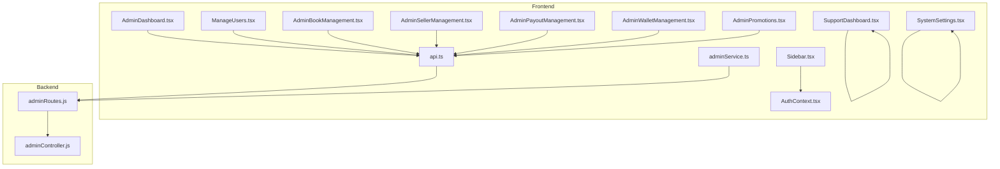

**Diagram sources**
- [AdminDashboard.tsx:1-344](file://frontend/src/pages/AdminDashboard.tsx#L1-L344)
- [ManageUsers.tsx:1-146](file://frontend/src/pages/ManageUsers.tsx#L1-L146)
- [AdminBookManagement.tsx:1-344](file://frontend/src/pages/AdminBookManagement.tsx#L1-L344)
- [AdminSellerManagement.tsx:1-171](file://frontend/src/pages/AdminSellerManagement.tsx#L1-L171)
- [AdminPayoutManagement.tsx:1-169](file://frontend/src/pages/AdminPayoutManagement.tsx#L1-L169)
- [AdminWalletManagement.tsx:1-287](file://frontend/src/pages/AdminWalletManagement.tsx#L1-L287)
- [AdminPromotions.tsx:1-247](file://frontend/src/pages/AdminPromotions.tsx#L1-L247)
- [SupportDashboard.tsx:1-330](file://frontend/src/pages/SupportDashboard.tsx#L1-L330)
- [SystemSettings.tsx:1-245](file://frontend/src/pages/SystemSettings.tsx#L1-L245)
- [api.ts:464-618](file://frontend/src/utils/api.ts#L464-L618)
- [adminService.ts:1-55](file://frontend/src/api/services/adminService.ts#L1-L55)
- [Sidebar.tsx:1-102](file://frontend/src/components/layout/Sidebar.tsx#L1-L102)
- [AuthContext.tsx:1-83](file://frontend/src/contexts/AuthContext.tsx#L1-L83)
- [adminRoutes.js:1-114](file://backend/routes/adminRoutes.js#L1-L114)
- [adminController.js:1-651](file://backend/controllers/adminController.js#L1-L651)

**Section sources**
- [AdminDashboard.tsx:1-344](file://frontend/src/pages/AdminDashboard.tsx#L1-L344)
- [api.ts:464-618](file://frontend/src/utils/api.ts#L464-L618)
- [adminRoutes.js:1-114](file://backend/routes/adminRoutes.js#L1-L114)

## Core Components
- AdminDashboard: Provides overview statistics, quick navigation to management modules, recent audit logs, and system health monitoring.
- ManageUsers: Lists users with filtering and role/status controls, supports single and bulk actions.
- AdminBookManagement: Manages book moderation with tabs for pending/approved/rejected, single and bulk status updates, and rejection reasons.
- AdminSellerManagement: Verifies sellers with status transitions and commission rate adjustments.
- AdminPayoutManagement: Processes creator payout requests with approval/rejection and rejection reasons.
- AdminWalletManagement: Adjusts user wallet balances and roles with dialogs and search.
- AdminPromotions: Distributes free books to individuals or all users with optional messages.
- SupportDashboard: Displays support metrics, ticket queue, category stats, and recently resolved tickets (mock data).
- SystemSettings: Configures general, financial, AI, and security settings; includes platform reset.

**Section sources**
- [AdminDashboard.tsx:28-343](file://frontend/src/pages/AdminDashboard.tsx#L28-L343)
- [ManageUsers.tsx:9-141](file://frontend/src/pages/ManageUsers.tsx#L9-L141)
- [AdminBookManagement.tsx:20-343](file://frontend/src/pages/AdminBookManagement.tsx#L20-L343)
- [AdminSellerManagement.tsx:22-169](file://frontend/src/pages/AdminSellerManagement.tsx#L22-L169)
- [AdminPayoutManagement.tsx:19-168](file://frontend/src/pages/AdminPayoutManagement.tsx#L19-L168)
- [AdminWalletManagement.tsx:22-286](file://frontend/src/pages/AdminWalletManagement.tsx#L22-L286)
- [AdminPromotions.tsx:20-246](file://frontend/src/pages/AdminPromotions.tsx#L20-L246)
- [SupportDashboard.tsx:96-329](file://frontend/src/pages/SupportDashboard.tsx#L96-L329)
- [SystemSettings.tsx:9-221](file://frontend/src/pages/SystemSettings.tsx#L9-L221)

## Architecture Overview
The admin pages rely on centralized API clients and admin services to communicate with backend routes protected by authentication and admin middleware. The frontend components use React Query for data fetching and mutations, and React Router for navigation. Role-based access is enforced in the sidebar and route guards.

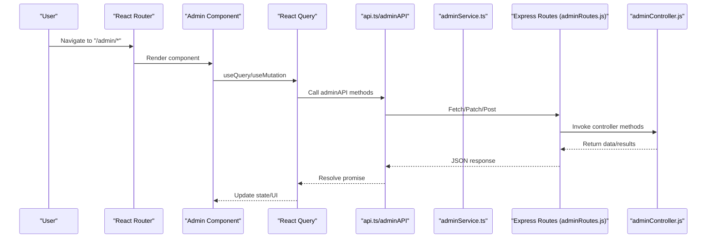

**Diagram sources**
- [api.ts:464-618](file://frontend/src/utils/api.ts#L464-L618)
- [adminService.ts:1-55](file://frontend/src/api/services/adminService.ts#L1-L55)
- [adminRoutes.js:1-114](file://backend/routes/adminRoutes.js#L1-L114)
- [adminController.js:1-651](file://backend/controllers/adminController.js#L1-L651)

## Detailed Component Analysis

### AdminDashboard
- Purpose: Central admin control center with stats, module shortcuts, audit log viewer, and system health.
- Key features:
  - Statistics cards for pending sellers, pending books, platform revenue, active sellers, and pending refunds.
  - Navigation cards to management modules.
  - Audit log filter by action and target ID with pagination support.
  - System health polling every 30 seconds.
- Integration:
  - Uses adminAPI.getAdminStats, adminAPI.getAuditLogs, adminAPI.getHealthStatus.
  - React Query for caching and refetching.
- Role-based access: Available via sidebar when user role is admin.

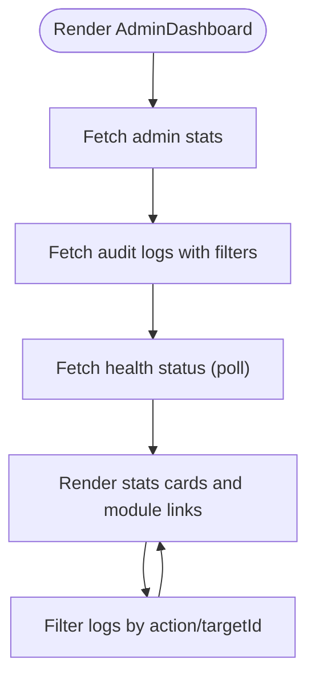

**Diagram sources**
- [AdminDashboard.tsx:33-47](file://frontend/src/pages/AdminDashboard.tsx#L33-L47)

**Section sources**
- [AdminDashboard.tsx:28-343](file://frontend/src/pages/AdminDashboard.tsx#L28-L343)
- [api.ts:556-567](file://frontend/src/utils/api.ts#L556-L567)

### ManageUsers
- Purpose: User management with search, role filtering, and status controls.
- Key features:
  - Live search by name/email.
  - Role filter (ALL, LEARNER, EDUCATOR, ADMIN).
  - Toggle user status (Active, Suspended) and delete user.
  - Export CSV and Add New User placeholders.
- Integration:
  - Uses local store subscriptions for reactive updates (as indicated by imports).
  - Supports bulk-like operations via UI selection (conceptual for this component).
- Role-based access: Requires admin role.

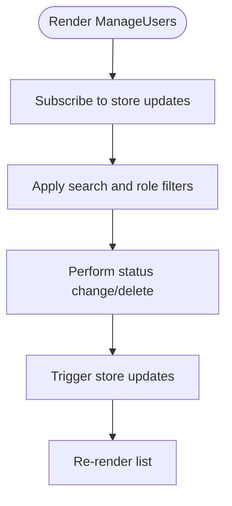

**Diagram sources**
- [ManageUsers.tsx:14-19](file://frontend/src/pages/ManageUsers.tsx#L14-L19)

**Section sources**
- [ManageUsers.tsx:9-141](file://frontend/src/pages/ManageUsers.tsx#L9-L141)

### AdminBookManagement
- Purpose: Moderate AI-native STEM books with approval/rejection workflows.
- Key features:
  - Pending/Approved/Rejected tabs with counts.
  - Single approval/rejection with rejection reason dialog.
  - Bulk operations: Select multiple books and bulk approve/reject with shared reason.
  - View book details dialog.
- Integration:
  - Uses adminAPI.getAllBooks, adminAPI.updateBookStatus, adminAPI.bulkUpdateBookStatus.
  - React Query invalidation after mutations.
  - Toast notifications for success/error.

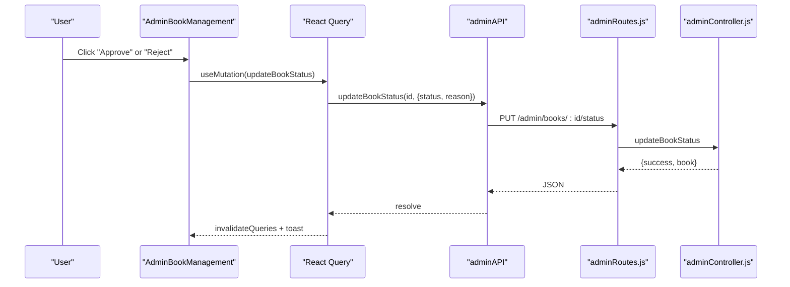

**Diagram sources**
- [AdminBookManagement.tsx:36-48](file://frontend/src/pages/AdminBookManagement.tsx#L36-L48)
- [api.ts:514-530](file://frontend/src/utils/api.ts#L514-L530)
- [adminRoutes.js:23-39](file://backend/routes/adminRoutes.js#L23-L39)
- [adminController.js:103-131](file://backend/controllers/adminController.js#L103-L131)

**Section sources**
- [AdminBookManagement.tsx:20-343](file://frontend/src/pages/AdminBookManagement.tsx#L20-L343)
- [api.ts:514-530](file://frontend/src/utils/api.ts#L514-L530)
- [adminController.js:103-162](file://backend/controllers/adminController.js#L103-L162)

### AdminSellerManagement
- Purpose: Verify marketplace creators with status transitions and commission rate adjustments.
- Key features:
  - Pending/Approved/Rejected tabs.
  - Approve seller (auto-updates user role to seller).
  - Revoke access or re-review depending on current tab.
- Integration:
  - Uses adminAPI.getAllSellers, adminAPI.updateSellerStatus.
  - Records audit log for status changes.

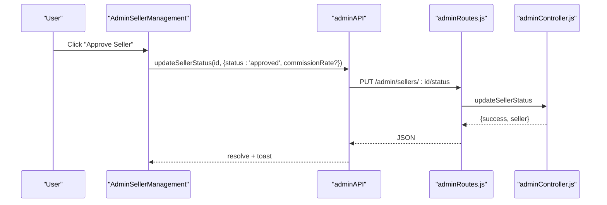

**Diagram sources**
- [AdminSellerManagement.tsx:32-46](file://frontend/src/pages/AdminSellerManagement.tsx#L32-L46)
- [api.ts:503-512](file://frontend/src/utils/api.ts#L503-L512)
- [adminRoutes.js:17-21](file://backend/routes/adminRoutes.js#L17-L21)
- [adminController.js:42-79](file://backend/controllers/adminController.js#L42-L79)

**Section sources**
- [AdminSellerManagement.tsx:22-169](file://frontend/src/pages/AdminSellerManagement.tsx#L22-L169)
- [api.ts:503-512](file://frontend/src/utils/api.ts#L503-L512)
- [adminController.js:42-79](file://backend/controllers/adminController.js#L42-L79)

### AdminPayoutManagement
- Purpose: Review and authorize creator withdrawal requests.
- Key features:
  - List pending payouts with user, amount, payment method, and creation date.
  - Approve or reject with rejection reason dialog.
- Integration:
  - Uses adminAPI.getPayoutRequests, adminAPI.processPayout.
  - On rejection, refunds user balance atomically.

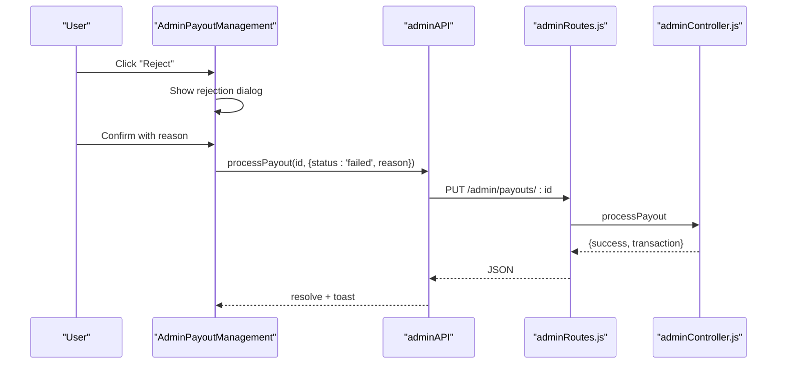

**Diagram sources**
- [AdminPayoutManagement.tsx:31-43](file://frontend/src/pages/AdminPayoutManagement.tsx#L31-L43)
- [api.ts:569-578](file://frontend/src/utils/api.ts#L569-L578)
- [adminRoutes.js:83-87](file://backend/routes/adminRoutes.js#L83-L87)
- [adminController.js:384-429](file://backend/controllers/adminController.js#L384-L429)

**Section sources**
- [AdminPayoutManagement.tsx:19-168](file://frontend/src/pages/AdminPayoutManagement.tsx#L19-L168)
- [api.ts:569-578](file://frontend/src/utils/api.ts#L569-L578)
- [adminController.js:384-429](file://backend/controllers/adminController.js#L384-L429)

### AdminWalletManagement
- Purpose: Manage user wallets and roles.
- Key features:
  - Search users by name/email.
  - Adjust balance (credit/debit) with currency selection and description.
  - Change user role (learner, seller, admin) with confirmation dialog.
- Integration:
  - Uses adminAPI.getAllUsers, adminAPI.adjustUserBalance, adminAPI.updateUserRole.

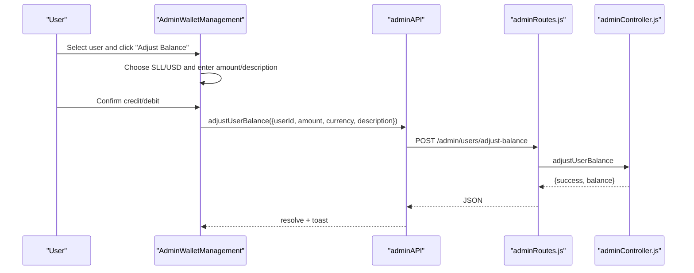

**Diagram sources**
- [AdminWalletManagement.tsx:38-51](file://frontend/src/pages/AdminWalletManagement.tsx#L38-L51)
- [api.ts:543-554](file://frontend/src/utils/api.ts#L543-L554)
- [adminRoutes.js:47-51](file://backend/routes/adminRoutes.js#L47-L51)
- [adminController.js:183-229](file://backend/controllers/adminController.js#L183-L229)

**Section sources**
- [AdminWalletManagement.tsx:22-286](file://frontend/src/pages/AdminWalletManagement.tsx#L22-L286)
- [api.ts:543-554](file://frontend/src/utils/api.ts#L543-L554)
- [adminController.js:183-229](file://backend/controllers/adminController.js#L183-L229)

### AdminPromotions
- Purpose: Distribute free educational content to users.
- Key features:
  - Individual gift to a selected user or site-wide gift to all users.
  - Select approved book and optionally add internal message.
  - Confirmation dialog and success/error notifications.
- Integration:
  - Uses adminAPI.getAllBooks, adminAPI.getAllUsers, adminAPI.giftBook.

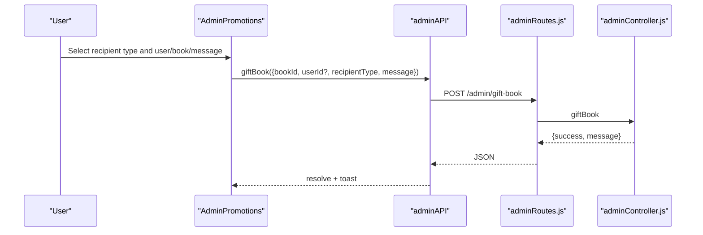

**Diagram sources**
- [AdminPromotions.tsx:39-51](file://frontend/src/pages/AdminPromotions.tsx#L39-L51)
- [api.ts:580-585](file://frontend/src/utils/api.ts#L580-L585)
- [adminRoutes.js:90-93](file://backend/routes/adminRoutes.js#L90-L93)
- [adminController.js:434-483](file://backend/controllers/adminController.js#L434-L483)

**Section sources**
- [AdminPromotions.tsx:20-246](file://frontend/src/pages/AdminPromotions.tsx#L20-L246)
- [api.ts:580-585](file://frontend/src/utils/api.ts#L580-L585)
- [adminController.js:434-483](file://backend/controllers/adminController.js#L434-L483)

### SupportDashboard
- Purpose: Monitor and manage support tickets and metrics.
- Key features:
  - Top KPIs: open tickets, resolved today, average response time, satisfaction.
  - Ticket queue with priority and status badges.
  - Category statistics and recently resolved tickets table.
  - Note: Uses mock data in this component.
- Integration: No backend integration in this component.

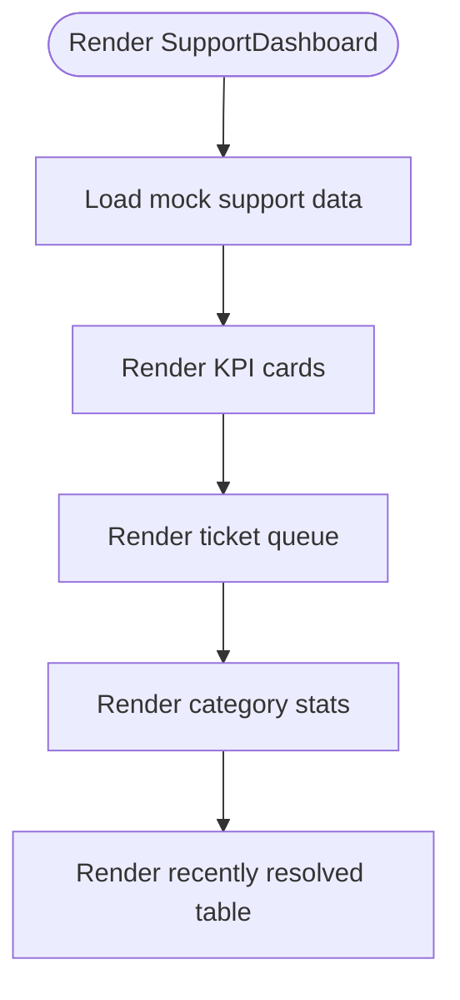

**Diagram sources**
- [SupportDashboard.tsx:5-94](file://frontend/src/pages/SupportDashboard.tsx#L5-L94)

**Section sources**
- [SupportDashboard.tsx:96-329](file://frontend/src/pages/SupportDashboard.tsx#L96-L329)

### SystemSettings
- Purpose: Configure global platform parameters and integrations.
- Key features:
  - General: site name, maintenance mode, registrations.
  - Financial: withdrawal fee percent, exchange rate, payment gateways.
  - AI: Google Gemini API status, default TTS model, enable AI features.
  - Security: reset platform data, force cache clearing.
- Integration:
  - Uses local store subscriptions for reactive updates and save/reset actions.

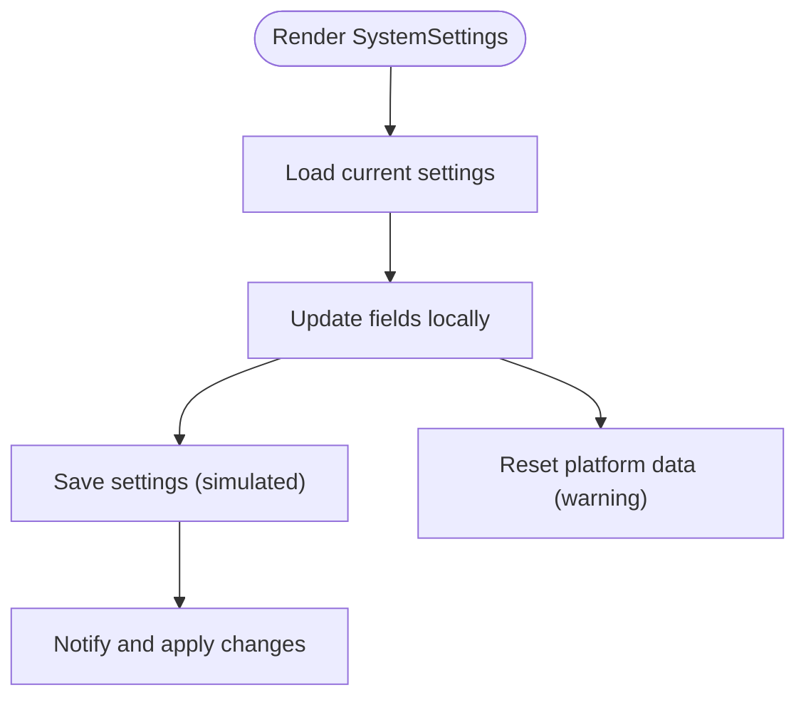

**Diagram sources**
- [SystemSettings.tsx:13-18](file://frontend/src/pages/SystemSettings.tsx#L13-L18)

**Section sources**
- [SystemSettings.tsx:9-221](file://frontend/src/pages/SystemSettings.tsx#L9-L221)

## Dependency Analysis
- Frontend dependencies:
  - React Query for data fetching and caching.
  - Lucide icons for UI.
  - Sonner for toast notifications.
  - Local store subscriptions for state synchronization.
- Backend dependencies:
  - Express routes guarded by authentication and admin middleware.
  - Sequelize models for data operations.
  - Audit logging for compliance.

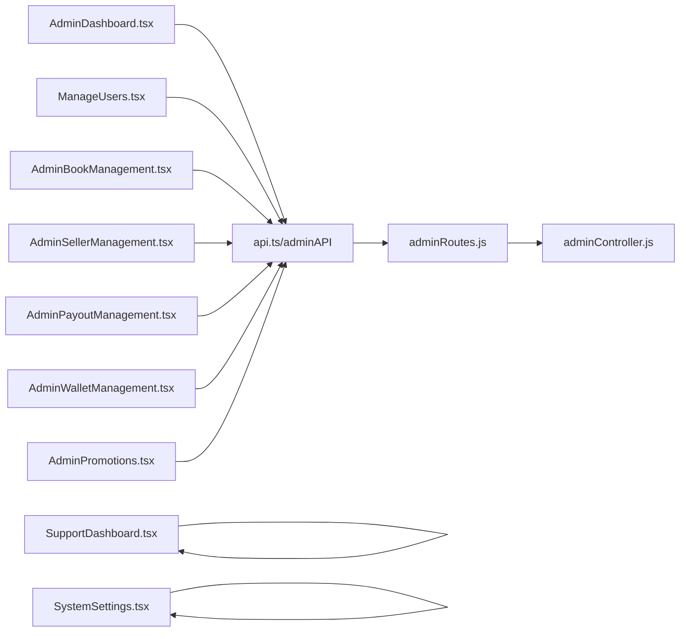

**Diagram sources**
- [AdminDashboard.tsx:1-344](file://frontend/src/pages/AdminDashboard.tsx#L1-L344)
- [ManageUsers.tsx:1-146](file://frontend/src/pages/ManageUsers.tsx#L1-L146)
- [AdminBookManagement.tsx:1-344](file://frontend/src/pages/AdminBookManagement.tsx#L1-L344)
- [AdminSellerManagement.tsx:1-171](file://frontend/src/pages/AdminSellerManagement.tsx#L1-L171)
- [AdminPayoutManagement.tsx:1-169](file://frontend/src/pages/AdminPayoutManagement.tsx#L1-L169)
- [AdminWalletManagement.tsx:1-287](file://frontend/src/pages/AdminWalletManagement.tsx#L1-L287)
- [AdminPromotions.tsx:1-247](file://frontend/src/pages/AdminPromotions.tsx#L1-L247)
- [SupportDashboard.tsx:1-330](file://frontend/src/pages/SupportDashboard.tsx#L1-L330)
- [SystemSettings.tsx:1-245](file://frontend/src/pages/SystemSettings.tsx#L1-L245)
- [api.ts:464-618](file://frontend/src/utils/api.ts#L464-L618)
- [adminRoutes.js:1-114](file://backend/routes/adminRoutes.js#L1-L114)
- [adminController.js:1-651](file://backend/controllers/adminController.js#L1-L651)

**Section sources**
- [api.ts:464-618](file://frontend/src/utils/api.ts#L464-L618)
- [adminRoutes.js:1-114](file://backend/routes/adminRoutes.js#L1-L114)
- [adminController.js:1-651](file://backend/controllers/adminController.js#L1-L651)

## Performance Considerations
- Use React Query’s query keys and invalidation to minimize unnecessary network requests.
- Implement pagination and filtering for large datasets (users, books, logs).
- Debounce search inputs to reduce API calls.
- Prefer optimistic updates with proper rollback on failure.
- Cache frequently accessed data (e.g., stats) with appropriate refetch intervals.

## Troubleshooting Guide
- Authentication and Authorization:
  - Ensure the user role is admin; sidebar navigation is only visible for admin users.
  - Verify authentication token presence in local storage.
- Network Errors:
  - Inspect centralized API client error handling and Sentry tagging for correlation IDs.
  - Check base API URL and CORS configuration.
- Audit Logging:
  - Use the AdminDashboard audit log filter to trace administrative actions.
- Common Issues:
  - Bulk operations failing due to invalid IDs; validate selections before submission.
  - Payout rejection not reflecting in user balance; confirm backend transaction handling.
  - Promotion gift not applied; verify book status is approved and recipients are selected.

**Section sources**
- [Sidebar.tsx:48-55](file://frontend/src/components/layout/Sidebar.tsx#L48-L55)
- [AuthContext.tsx:76-82](file://frontend/src/contexts/AuthContext.tsx#L76-L82)
- [api.ts:17-63](file://frontend/src/utils/api.ts#L17-L63)
- [AdminDashboard.tsx:38-41](file://frontend/src/pages/AdminDashboard.tsx#L38-L41)

## Conclusion
The administration pages provide a comprehensive toolkit for managing users, content, sellers, finances, promotions, support, and system configuration. They leverage centralized API clients, robust backend controllers, and role-based access control to ensure secure and efficient administrative workflows. The modular component design, combined with React Query and toast notifications, delivers a responsive and reliable admin experience.