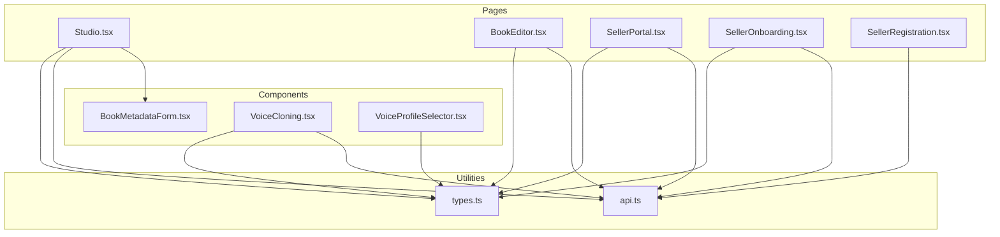
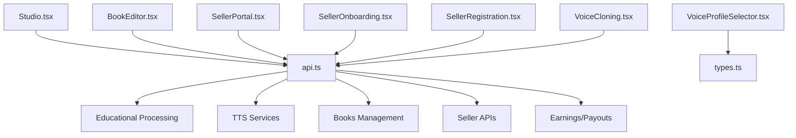
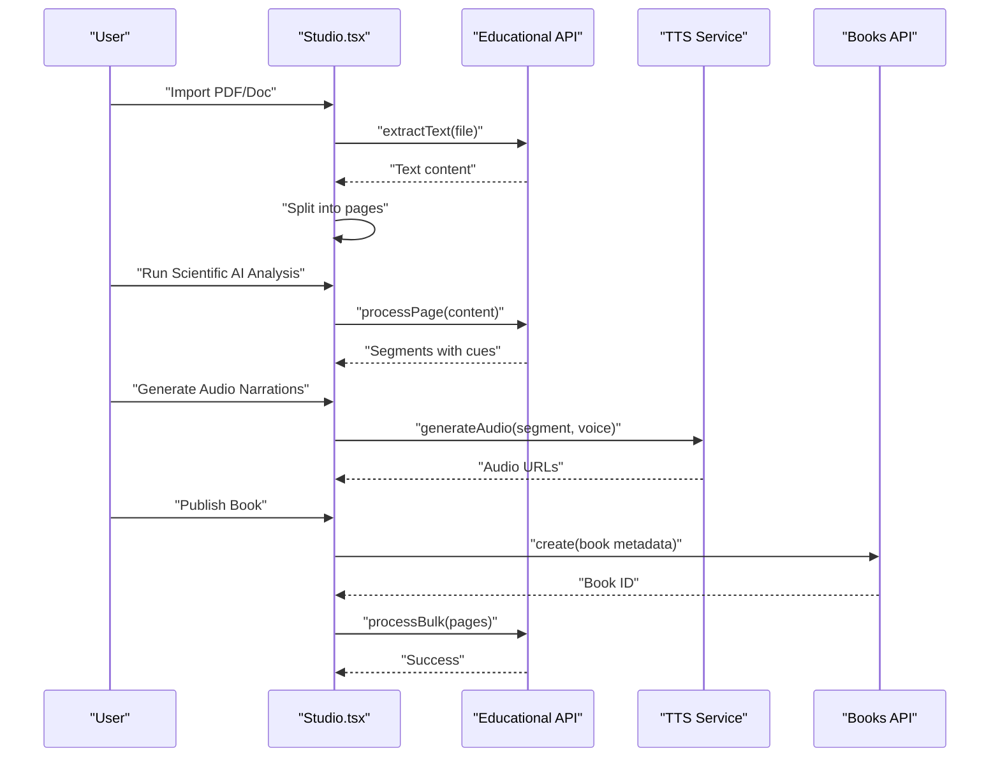
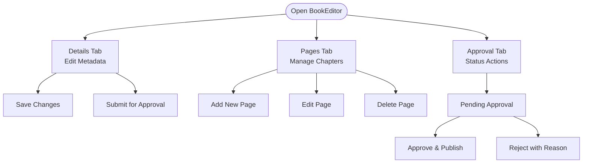
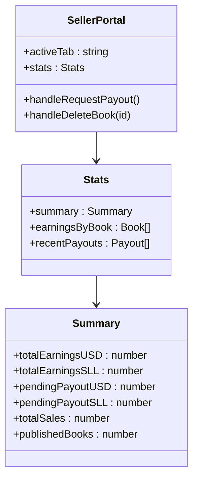
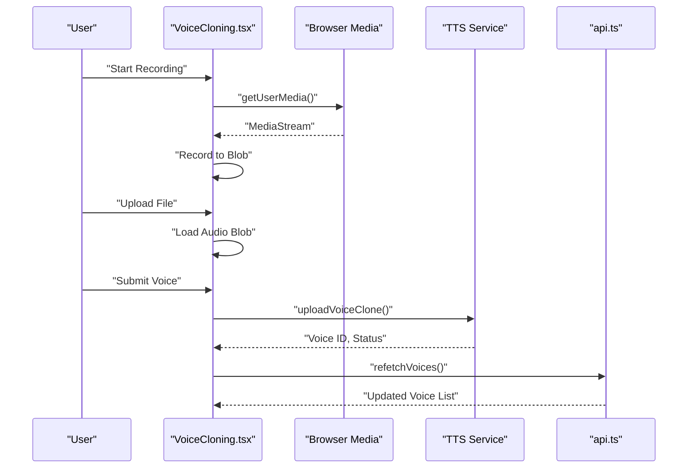
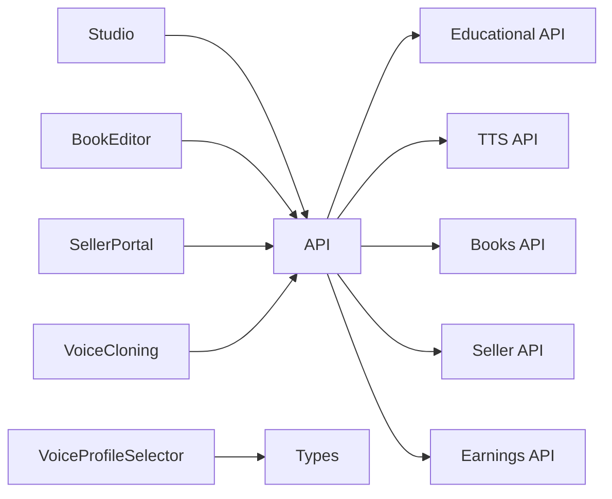

# Creator Pages

<cite>
**Referenced Files in This Document**
- [Studio.tsx](file://frontend/src/pages/Studio.tsx)
- [BookEditor.tsx](file://frontend/src/pages/BookEditor.tsx)
- [SellerPortal.tsx](file://frontend/src/pages/SellerPortal.tsx)
- [SellerOnboarding.tsx](file://frontend/src/pages/SellerOnboarding.tsx)
- [SellerRegistration.tsx](file://frontend/src/pages/SellerRegistration.tsx)
- [BookMetadataForm.tsx](file://frontend/src/components/BookMetadataForm.tsx)
- [VoiceCloning.tsx](file://frontend/src/components/VoiceCloning.tsx)
- [VoiceProfileSelector.tsx](file://frontend/src/components/VoiceProfileSelector.tsx)
- [api.ts](file://frontend/src/utils/api.ts)
- [types.ts](file://frontend/src/types/types.ts)
</cite>

## Table of Contents
1. [Introduction](#introduction)
2. [Project Structure](#project-structure)
3. [Core Components](#core-components)
4. [Architecture Overview](#architecture-overview)
5. [Detailed Component Analysis](#detailed-component-analysis)
6. [Dependency Analysis](#dependency-analysis)
7. [Performance Considerations](#performance-considerations)
8. [Troubleshooting Guide](#troubleshooting-guide)
9. [Conclusion](#conclusion)

## Introduction
This document provides comprehensive documentation for the creator and publisher pages in the QuantumMint Bookstore frontend. It covers the complete creator workflow, including the content creation studio (Studio), book editor (BookEditor), metadata management (BookMetadataForm), voice cloning interface (VoiceCloning), voice profile selection (VoiceProfileSelector), seller portal (SellerPortal), and onboarding process (SellerOnboarding, SellerRegistration). For each page, we explain the component structure, integration with content creation services, voice cloning API integration, and publisher dashboard functionality. We also document page-specific features such as multimedia content editing, formula rendering, voice customization, and revenue analytics, along with component props, state management for complex forms, file upload handling, and backend integration patterns.

## Project Structure
The creator and publisher pages are organized under the frontend/src/pages directory, with reusable components located in frontend/src/components. Shared utilities and APIs live in frontend/src/utils and frontend/src/services, while data structures are defined in frontend/src/types.

**Diagram sources**
- [Studio.tsx:1-718](file://frontend/src/pages/Studio.tsx#L1-L718)
- [BookEditor.tsx:1-426](file://frontend/src/pages/BookEditor.tsx#L1-L426)
- [SellerPortal.tsx:1-322](file://frontend/src/pages/SellerPortal.tsx#L1-L322)
- [SellerOnboarding.tsx:1-264](file://frontend/src/pages/SellerOnboarding.tsx#L1-L264)
- [SellerRegistration.tsx:1-481](file://frontend/src/pages/SellerRegistration.tsx#L1-L481)
- [BookMetadataForm.tsx:1-171](file://frontend/src/components/BookMetadataForm.tsx#L1-L171)
- [VoiceCloning.tsx:1-381](file://frontend/src/components/VoiceCloning.tsx#L1-L381)
- [VoiceProfileSelector.tsx:1-265](file://frontend/src/components/VoiceProfileSelector.tsx#L1-L265)
- [api.ts:1-770](file://frontend/src/utils/api.ts#L1-L770)
- [types.ts:1-110](file://frontend/src/types/types.ts#L1-L110)

**Section sources**
- [Studio.tsx:1-718](file://frontend/src/pages/Studio.tsx#L1-L718)
- [BookEditor.tsx:1-426](file://frontend/src/pages/BookEditor.tsx#L1-L426)
- [SellerPortal.tsx:1-322](file://frontend/src/pages/SellerPortal.tsx#L1-L322)
- [SellerOnboarding.tsx:1-264](file://frontend/src/pages/SellerOnboarding.tsx#L1-L264)
- [SellerRegistration.tsx:1-481](file://frontend/src/pages/SellerRegistration.tsx#L1-L481)
- [BookMetadataForm.tsx:1-171](file://frontend/src/components/BookMetadataForm.tsx#L1-L171)
- [VoiceCloning.tsx:1-381](file://frontend/src/components/VoiceCloning.tsx#L1-L381)
- [VoiceProfileSelector.tsx:1-265](file://frontend/src/components/VoiceProfileSelector.tsx#L1-L265)
- [api.ts:1-770](file://frontend/src/utils/api.ts#L1-L770)
- [types.ts:1-110](file://frontend/src/types/types.ts#L1-L110)

## Core Components
- Studio: Full-featured AI-native content creation studio with metadata management, scientific content analysis, voice selection, and publishing pipeline.
- BookEditor: Administrative editor for managing book metadata, pages, and approval workflows.
- SellerPortal: Publisher dashboard with analytics, earnings, voice lab, video hub, and book management.
- SellerOnboarding: Step-by-step onboarding checklist and progress tracking.
- SellerRegistration: Multi-step advanced seller registration form with auto-save and document uploads.
- BookMetadataForm: Reusable metadata input form with cover image upload.
- VoiceCloning: Voice cloning interface with recording, upload, preview, and submission.
- VoiceProfileSelector: Voice selection component with filtering, searching, and sample playback.

**Section sources**
- [Studio.tsx:1-718](file://frontend/src/pages/Studio.tsx#L1-L718)
- [BookEditor.tsx:1-426](file://frontend/src/pages/BookEditor.tsx#L1-L426)
- [SellerPortal.tsx:1-322](file://frontend/src/pages/SellerPortal.tsx#L1-L322)
- [SellerOnboarding.tsx:1-264](file://frontend/src/pages/SellerOnboarding.tsx#L1-L264)
- [SellerRegistration.tsx:1-481](file://frontend/src/pages/SellerRegistration.tsx#L1-L481)
- [BookMetadataForm.tsx:1-171](file://frontend/src/components/BookMetadataForm.tsx#L1-L171)
- [VoiceCloning.tsx:1-381](file://frontend/src/components/VoiceCloning.tsx#L1-L381)
- [VoiceProfileSelector.tsx:1-265](file://frontend/src/components/VoiceProfileSelector.tsx#L1-L265)

## Architecture Overview
The creator pages integrate tightly with the backend via a centralized API client. The Studio and BookEditor rely on educational processing and TTS services, while the SellerPortal integrates with earnings, payouts, and voice management endpoints. Voice cloning leverages both browser media APIs and backend TTS services.

**Diagram sources**
- [Studio.tsx:1-718](file://frontend/src/pages/Studio.tsx#L1-L718)
- [BookEditor.tsx:1-426](file://frontend/src/pages/BookEditor.tsx#L1-L426)
- [SellerPortal.tsx:1-322](file://frontend/src/pages/SellerPortal.tsx#L1-L322)
- [SellerOnboarding.tsx:1-264](file://frontend/src/pages/SellerOnboarding.tsx#L1-L264)
- [SellerRegistration.tsx:1-481](file://frontend/src/pages/SellerRegistration.tsx#L1-L481)
- [VoiceCloning.tsx:1-381](file://frontend/src/components/VoiceCloning.tsx#L1-L381)
- [VoiceProfileSelector.tsx:1-265](file://frontend/src/components/VoiceProfileSelector.tsx#L1-L265)
- [api.ts:1-770](file://frontend/src/utils/api.ts#L1-L770)
- [types.ts:1-110](file://frontend/src/types/types.ts#L1-L110)

## Detailed Component Analysis

### Studio: Content Creation Studio
Studio is the central hub for AI-native educational content creation. It manages multi-page content, metadata, scientific analysis, voice selection, and publishing.

Key features:
- Multi-tab navigation (Metadata, Editor, Review)
- Multi-page content management with add/delete
- AI content generation and scientific processing
- Voice selection and batch audio generation
- Local draft persistence
- Publishing pipeline to backend

State management highlights:
- Active tab, pages array, active page ID
- Metadata state with cover image upload
- Voice profiles and selected voice
- Generation flags for AI operations
- File upload handling for text extraction

Integration points:
- Educational processing API for scientific analysis
- TTS service for audio generation
- Books API for publishing
- Local storage for drafts

**Diagram sources**
- [Studio.tsx:60-342](file://frontend/src/pages/Studio.tsx#L60-L342)
- [api.ts:704-723](file://frontend/src/utils/api.ts#L704-L723)
- [types.ts:9-17](file://frontend/src/types/types.ts#L9-L17)

Props and state:
- Props: onPreview callback
- State: activeTab, pages, metadata, selectedVoiceId, isGenerating, isAnalyzing, isPublishing
- Methods: handleFileUpload, handleGenerateContent, handleScientificProcess, handleGenerateAudio, handlePublish

File upload handling:
- Accepts PDF/DOCX/TXT
- Extracts text and splits into pages
- Clears input after processing

Formula rendering:
- Uses Formula component for visual display
- Integrates with scientific analysis segments

**Section sources**
- [Studio.tsx:1-718](file://frontend/src/pages/Studio.tsx#L1-L718)
- [api.ts:704-723](file://frontend/src/utils/api.ts#L704-L723)
- [types.ts:9-17](file://frontend/src/types/types.ts#L9-L17)

### BookEditor: Administrative Book Editor
BookEditor provides administrative controls for book content management, including metadata editing, page management, and approval workflows.

Key features:
- Three-tab interface (Details, Pages, Approval)
- Editable book metadata with validation
- Page CRUD operations with reordering
- Approval workflow with rejection reasons
- Status badges and actions

State management:
- Active tab tracking
- Editing modes for book and pages
- Rejection dialog state
- Toast notifications

**Diagram sources**
- [BookEditor.tsx:30-421](file://frontend/src/pages/BookEditor.tsx#L30-L421)

**Section sources**
- [BookEditor.tsx:1-426](file://frontend/src/pages/BookEditor.tsx#L1-L426)

### SellerPortal: Publisher Dashboard
SellerPortal is the primary publisher dashboard offering analytics, earnings, voice management, and content oversight.

Key features:
- Five-tab navigation (Overview, My Books, Voice Lab, Video Hub, Analytics)
- Revenue cards with totals and growth metrics
- Earnings breakdown by book
- Recent payouts history
- Voice cloning integration
- Video uploader integration
- Book management actions (delete, view, edit)

**Diagram sources**
- [SellerPortal.tsx:33-321](file://frontend/src/pages/SellerPortal.tsx#L33-L321)
- [api.ts:649-681](file://frontend/src/utils/api.ts#L649-L681)

**Section sources**
- [SellerPortal.tsx:1-322](file://frontend/src/pages/SellerPortal.tsx#L1-L322)
- [api.ts:649-681](file://frontend/src/utils/api.ts#L649-L681)

### SellerOnboarding: Onboarding Checklist
SellerOnboarding guides sellers through account activation with a step-by-step checklist and progress tracking.

Key features:
- Five-step onboarding (Email Verify, Profile Complete, Bank Verify, First Book, Agreement)
- Progress percentage and completion tracking
- Task status indicators (pending, in_progress, completed)
- Navigation to relevant views

**Section sources**
- [SellerOnboarding.tsx:1-264](file://frontend/src/pages/SellerOnboarding.tsx#L1-L264)

### SellerRegistration: Advanced Registration
SellerRegistration implements a multi-step registration form with auto-save, document uploads, and validation.

Key features:
- Five-step wizard (Personal, Business, Documents, Tax, Review)
- Auto-save functionality with success notifications
- File upload inputs for ID, address, and business certificate
- Validation and submission flow
- Review step with editable sections

State management:
- Active step tracking
- Form data per section
- Auto-save and manual save states
- Submission state and error handling

**Section sources**
- [SellerRegistration.tsx:1-481](file://frontend/src/pages/SellerRegistration.tsx#L1-L481)

### BookMetadataForm: Metadata Input
BookMetadataForm is a reusable component for collecting book metadata with cover image upload.

Key features:
- Title, author, genre, description inputs
- Genre dropdown with predefined options
- Cover image upload with preview and removal
- Character count for description
- Controlled input handling

Props:
- metadata: BookMetadata object
- onChange: Callback for updates

**Section sources**
- [BookMetadataForm.tsx:1-171](file://frontend/src/components/BookMetadataForm.tsx#L1-L171)

### VoiceCloning: Voice Creation Interface
VoiceCloning enables sellers to create custom voice profiles through recording or file upload.

Key features:
- Two capture methods: live recording and file upload
- Audio preview with play/pause controls
- Voice identity configuration (name, description)
- Submission with progress tracking
- Existing voice listing with status indicators

State management:
- Recording state (live or uploaded)
- Audio preview playback
- Upload progress and success/error states
- Form reset after successful submission

**Diagram sources**
- [VoiceCloning.tsx:33-153](file://frontend/src/components/VoiceCloning.tsx#L33-L153)
- [api.ts:679-681](file://frontend/src/utils/api.ts#L679-L681)

**Section sources**
- [VoiceCloning.tsx:1-381](file://frontend/src/components/VoiceCloning.tsx#L1-L381)
- [api.ts:679-681](file://frontend/src/utils/api.ts#L679-L681)

### VoiceProfileSelector: Voice Selection
VoiceProfileSelector provides a searchable and filterable list of available voice profiles with sample playback.

Key features:
- Search by name, description, and tags
- Filter by style and gender
- Compact mode with select input
- Sample audio playback with pause/resume
- Premium voice visibility toggle

Props:
- selectedVoiceId: Currently selected voice
- onVoiceSelect: Callback for selection changes
- showPremium: Toggle premium voices
- filterStyle/filterGender: Initial filters
- compact: Compact select mode

**Section sources**
- [VoiceProfileSelector.tsx:1-265](file://frontend/src/components/VoiceProfileSelector.tsx#L1-L265)
- [types.ts:26-44](file://frontend/src/types/types.ts#L26-L44)

## Dependency Analysis
The creator pages share common dependencies on the API client and type definitions. Studio and BookEditor depend on educational processing and TTS services, while SellerPortal integrates with earnings and seller APIs. VoiceCloning depends on browser media APIs and TTS services.

**Diagram sources**
- [Studio.tsx:1-718](file://frontend/src/pages/Studio.tsx#L1-L718)
- [BookEditor.tsx:1-426](file://frontend/src/pages/BookEditor.tsx#L1-L426)
- [SellerPortal.tsx:1-322](file://frontend/src/pages/SellerPortal.tsx#L1-L322)
- [VoiceCloning.tsx:1-381](file://frontend/src/components/VoiceCloning.tsx#L1-L381)
- [VoiceProfileSelector.tsx:1-265](file://frontend/src/components/VoiceProfileSelector.tsx#L1-L265)
- [api.ts:1-770](file://frontend/src/utils/api.ts#L1-L770)
- [types.ts:1-110](file://frontend/src/types/types.ts#L1-L110)

**Section sources**
- [api.ts:1-770](file://frontend/src/utils/api.ts#L1-L770)
- [types.ts:1-110](file://frontend/src/types/types.ts#L1-L110)

## Performance Considerations
- Batch audio generation: Studio processes segments in small batches to avoid overwhelming TTS services while maintaining responsiveness.
- Local storage persistence: Studio saves drafts locally to reduce server load and enable offline editing.
- Memoized voice filtering: VoiceProfileSelector computes filtered lists efficiently using memoization.
- Lazy loading: Voice sample audio elements are lazy-loaded to minimize initial bundle size.
- Streaming URLs: TTS streaming URLs enable efficient audio playback without downloading entire files.

## Troubleshooting Guide
Common issues and resolutions:
- Microphone access denied: VoiceCloning displays permission errors and suggests checking browser settings.
- Audio upload limits: VoiceCloning enforces 50MB file size limits and validates audio MIME types.
- Network connectivity: All API calls include error handling and Sentry logging for debugging.
- Draft corruption: Studio's local storage parsing includes error handling to prevent crashes.
- Voice training status: VoiceCloning shows processing status and allows resubmission after training completes.

**Section sources**
- [VoiceCloning.tsx:68-153](file://frontend/src/components/VoiceCloning.tsx#L68-L153)
- [Studio.tsx:98-122](file://frontend/src/pages/Studio.tsx#L98-L122)
- [api.ts:17-63](file://frontend/src/utils/api.ts#L17-L63)

## Conclusion
The QuantumMint Bookstore creator and publisher pages provide a comprehensive ecosystem for educational content creators. The Studio offers AI-powered content creation with scientific analysis and voice customization, while BookEditor and SellerPortal streamline administrative workflows and revenue tracking. VoiceCloning and VoiceProfileSelector enable personalized voice experiences, and the onboarding and registration flows guide sellers through account activation. Together, these components deliver a robust, scalable solution for content creators and publishers.