# Page Components

<cite>
**Referenced Files in This Document**
- [AdminDashboard.tsx](file://frontend/src/pages/AdminDashboard.tsx)
- [LearnerDashboard.tsx](file://frontend/src/pages/LearnerDashboard.tsx)
- [SellerPortal.tsx](file://frontend/src/pages/SellerPortal.tsx)
- [Library.tsx](file://frontend/src/pages/Library.tsx)
- [Marketplace.tsx](file://frontend/src/pages/Marketplace.tsx)
- [Reader.tsx](file://frontend/src/pages/Reader.tsx)
- [Studio.tsx](file://frontend/src/pages/Studio.tsx)
- [IntegratedEducationalReader.tsx](file://frontend/src/pages/IntegratedEducationalReader.tsx)
- [EducationalReader.tsx](file://frontend/src/pages/EducationalReader.tsx)
- [BookCatalog.tsx](file://frontend/src/pages/BookCatalog.tsx)
- [BookDetail.tsx](file://frontend/src/pages/BookDetail.tsx)
- [BookEditor.tsx](file://frontend/src/pages/BookEditor.tsx)
- [ReadingAnalytics.tsx](file://frontend/src/pages/ReadingAnalytics.tsx)
- [AdminBookManagement.tsx](file://frontend/src/pages/AdminBookManagement.tsx)
- [AdminSellerManagement.tsx](file://frontend/src/pages/AdminSellerManagement.tsx)
</cite>

## Table of Contents
1. [Introduction](#introduction)
2. [Project Structure](#project-structure)
3. [Core Components](#core-components)
4. [Architecture Overview](#architecture-overview)
5. [Detailed Component Analysis](#detailed-component-analysis)
6. [Dependency Analysis](#dependency-analysis)
7. [Performance Considerations](#performance-considerations)
8. [Troubleshooting Guide](#troubleshooting-guide)
9. [Conclusion](#conclusion)

## Introduction
This document provides comprehensive documentation for all page components in the QuantumMint Bookstore frontend. It covers the complete page component hierarchy including marketplace pages (Library, Marketplace), educational reader (Reader, EducationalReader, IntegratedEducationalReader), creator studio (Studio), user dashboards (LearnerDashboard, SellerPortal), and administrative interfaces (AdminDashboard, AdminBookManagement, AdminSellerManagement). For each major page, we explain the component structure, data fetching patterns, integration with services, and user interaction flows. We also document page-specific features such as book browsing, reading experience, content creation, analytics display, and management workflows, along with component props, state management, and backend API integrations.

## Project Structure
The frontend pages are organized under the src/pages directory and integrate with shared components, services, and contexts. Key patterns include:
- Centralized data fetching via React Query hooks for admin dashboards and learner/seller portals.
- Context-based authentication and store access for cart/library state.
- Component composition with reusable UI elements (Button, Card, Input) and specialized educational components (MediaSyncPlayer, EnhancedMediaSyncPlayer, Formula renderer).
- Route-driven navigation with react-router DOM.

```mermaid
graph TB
subgraph "Pages"
A["Library.tsx"]
B["Marketplace.tsx"]
C["Reader.tsx"]
D["EducationalReader.tsx"]
E["IntegratedEducationalReader.tsx"]
F["Studio.tsx"]
G["LearnerDashboard.tsx"]
H["SellerPortal.tsx"]
I["AdminDashboard.tsx"]
J["AdminBookManagement.tsx"]
K["AdminSellerManagement.tsx"]
L["BookDetail.tsx"]
M["BookEditor.tsx"]
N["BookCatalog.tsx"]
O["ReadingAnalytics.tsx"]
end
subgraph "Shared"
U["AuthContext.tsx"]
V["StoreContext.tsx"]
W["api.ts / services/*"]
X["ui/* components"]
end
A --- V
G --- U
H --- U
I --- U
J --- U
K --- U
C --- V
D --- U
E --- U
F --- U
A --- X
B --- X
C --- X
D --- X
E --- X
F --- X
I --- X
J --- X
K --- X
L --- X
M --- X
N --- X
O --- X
A --- W
B --- W
C --- W
D --- W
E --- W
F --- W
G --- W
H --- W
I --- W
J --- W
K --- W
L --- W
M --- W
N --- W
O --- W
```

**Diagram sources**
- [Library.tsx:13-329](file://frontend/src/pages/Library.tsx#L13-L329)
- [Marketplace.tsx:112-264](file://frontend/src/pages/Marketplace.tsx#L112-L264)
- [Reader.tsx:8-277](file://frontend/src/pages/Reader.tsx#L8-L277)
- [EducationalReader.tsx:47-401](file://frontend/src/pages/EducationalReader.tsx#L47-L401)
- [IntegratedEducationalReader.tsx:75-662](file://frontend/src/pages/IntegratedEducationalReader.tsx#L75-L662)
- [Studio.tsx:36-718](file://frontend/src/pages/Studio.tsx#L36-L718)
- [LearnerDashboard.tsx:22-219](file://frontend/src/pages/LearnerDashboard.tsx#L22-L219)
- [SellerPortal.tsx:33-322](file://frontend/src/pages/SellerPortal.tsx#L33-L322)
- [AdminDashboard.tsx:27-311](file://frontend/src/pages/AdminDashboard.tsx#L27-L311)
- [AdminBookManagement.tsx:20-344](file://frontend/src/pages/AdminBookManagement.tsx#L20-L344)
- [AdminSellerManagement.tsx:22-171](file://frontend/src/pages/AdminSellerManagement.tsx#L22-L171)
- [BookDetail.tsx:26-197](file://frontend/src/pages/BookDetail.tsx#L26-L197)
- [BookEditor.tsx:30-426](file://frontend/src/pages/BookEditor.tsx#L30-L426)
- [BookCatalog.tsx:11-274](file://frontend/src/pages/BookCatalog.tsx#L11-L274)
- [ReadingAnalytics.tsx:17-156](file://frontend/src/pages/ReadingAnalytics.tsx#L17-L156)

**Section sources**
- [Library.tsx:13-329](file://frontend/src/pages/Library.tsx#L13-L329)
- [Marketplace.tsx:112-264](file://frontend/src/pages/Marketplace.tsx#L112-L264)
- [Reader.tsx:8-277](file://frontend/src/pages/Reader.tsx#L8-L277)
- [EducationalReader.tsx:47-401](file://frontend/src/pages/EducationalReader.tsx#L47-L401)
- [IntegratedEducationalReader.tsx:75-662](file://frontend/src/pages/IntegratedEducationalReader.tsx#L75-L662)
- [Studio.tsx:36-718](file://frontend/src/pages/Studio.tsx#L36-L718)
- [LearnerDashboard.tsx:22-219](file://frontend/src/pages/LearnerDashboard.tsx#L22-L219)
- [SellerPortal.tsx:33-322](file://frontend/src/pages/SellerPortal.tsx#L33-L322)
- [AdminDashboard.tsx:27-311](file://frontend/src/pages/AdminDashboard.tsx#L27-L311)
- [AdminBookManagement.tsx:20-344](file://frontend/src/pages/AdminBookManagement.tsx#L20-L344)
- [AdminSellerManagement.tsx:22-171](file://frontend/src/pages/AdminSellerManagement.tsx#L22-L171)
- [BookDetail.tsx:26-197](file://frontend/src/pages/BookDetail.tsx#L26-L197)
- [BookEditor.tsx:30-426](file://frontend/src/pages/BookEditor.tsx#L30-L426)
- [BookCatalog.tsx:11-274](file://frontend/src/pages/BookCatalog.tsx#L11-L274)
- [ReadingAnalytics.tsx:17-156](file://frontend/src/pages/ReadingAnalytics.tsx#L17-L156)

## Core Components
- Authentication and store contexts enable centralized user state and cart/library state across pages.
- UI primitives (Button, Card, Input) are reused consistently for forms, actions, and cards.
- Educational components (MediaSyncPlayer, EnhancedMediaSyncPlayer, Formula) power immersive reading experiences.
- Services and API utilities encapsulate backend integration for books, learners, sellers, and admin operations.

Key integration points:
- React Query for admin dashboards and learner/seller analytics.
- Local storage/session tokens for reader offline mode and session tracking.
- Shared components for consistent UX across pages.

**Section sources**
- [LearnerDashboard.tsx:22-50](file://frontend/src/pages/LearnerDashboard.tsx#L22-L50)
- [SellerPortal.tsx:33-58](file://frontend/src/pages/SellerPortal.tsx#L33-L58)
- [AdminDashboard.tsx:27-46](file://frontend/src/pages/AdminDashboard.tsx#L27-L46)
- [IntegratedEducationalReader.tsx:75-110](file://frontend/src/pages/IntegratedEducationalReader.tsx#L75-L110)

## Architecture Overview
The page components follow a layered architecture:
- Presentation layer: Page components manage UI, routing, and local state.
- Data layer: React Query and service utilities fetch and mutate data.
- Integration layer: API clients and typed services abstract backend endpoints.
- Shared layer: Contexts, UI components, and utilities provide cross-cutting concerns.

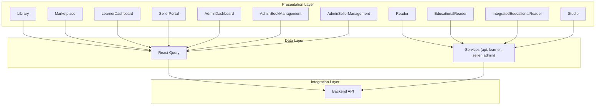

**Diagram sources**
- [Library.tsx:13-329](file://frontend/src/pages/Library.tsx#L13-L329)
- [Marketplace.tsx:112-264](file://frontend/src/pages/Marketplace.tsx#L112-L264)
- [Reader.tsx:8-277](file://frontend/src/pages/Reader.tsx#L8-L277)
- [EducationalReader.tsx:47-401](file://frontend/src/pages/EducationalReader.tsx#L47-L401)
- [IntegratedEducationalReader.tsx:75-662](file://frontend/src/pages/IntegratedEducationalReader.tsx#L75-L662)
- [Studio.tsx:36-718](file://frontend/src/pages/Studio.tsx#L36-L718)
- [LearnerDashboard.tsx:22-50](file://frontend/src/pages/LearnerDashboard.tsx#L22-L50)
- [SellerPortal.tsx:33-58](file://frontend/src/pages/SellerPortal.tsx#L33-L58)
- [AdminDashboard.tsx:27-46](file://frontend/src/pages/AdminDashboard.tsx#L27-L46)
- [AdminBookManagement.tsx:20-344](file://frontend/src/pages/AdminBookManagement.tsx#L20-L344)
- [AdminSellerManagement.tsx:22-171](file://frontend/src/pages/AdminSellerManagement.tsx#L22-L171)

## Detailed Component Analysis

### Library
- Purpose: Browse and filter the bookstore catalog with adaptive recommendations for logged-in users.
- Data fetching: Uses StoreContext for books and cart state; optional recommendation fetch on user presence.
- Filtering: Supports exam type, grade level, subject category, and free-text search.
- Interaction: Click book to read; buy flow navigates to checkout after adding to cart.
- Props/state: searchQuery, selectedCategory, selectedExam, selectedGrade, recommendations array.

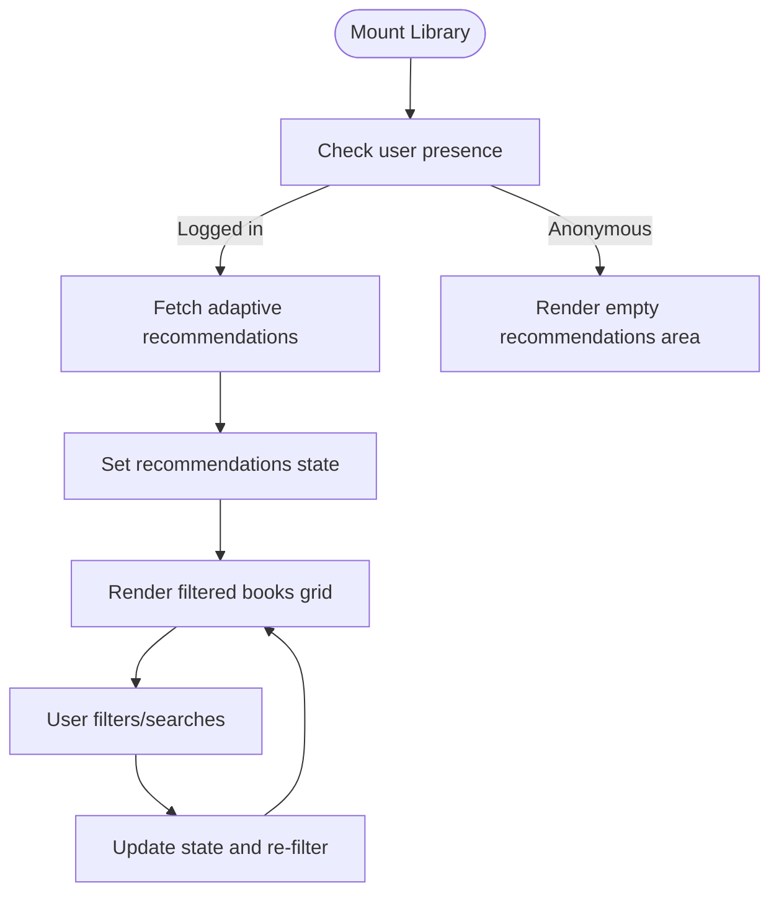

**Diagram sources**
- [Library.tsx:23-37](file://frontend/src/pages/Library.tsx#L23-L37)
- [Library.tsx:65-72](file://frontend/src/pages/Library.tsx#L65-L72)

**Section sources**
- [Library.tsx:13-329](file://frontend/src/pages/Library.tsx#L13-L329)

### Marketplace
- Purpose: Browse curated audiobooks with search, genre filtering, and sorting.
- Data fetching: Uses mock data locally; intended to integrate with backend APIs.
- Filtering/sorting: Search by title/author/description, genre dropdown, sort options.
- Props/state: searchQuery, selectedGenre, sortBy.

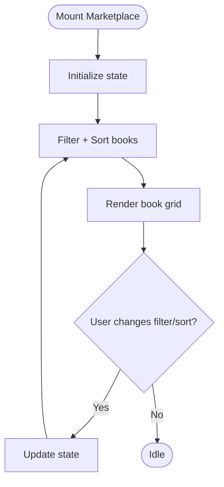

**Diagram sources**
- [Marketplace.tsx:112-141](file://frontend/src/pages/Marketplace.tsx#L112-L141)

**Section sources**
- [Marketplace.tsx:112-264](file://frontend/src/pages/Marketplace.tsx#L112-L264)

### Reader
- Purpose: Single-page immersive reading experience with synchronized text and visual/audio cues.
- Playback: Prefers pre-generated audio URLs; falls back to browser speech synthesis.
- State: Current book, current index, play/pause state, segment transitions.
- Props/state: bookId, currentIndex, isPlaying.

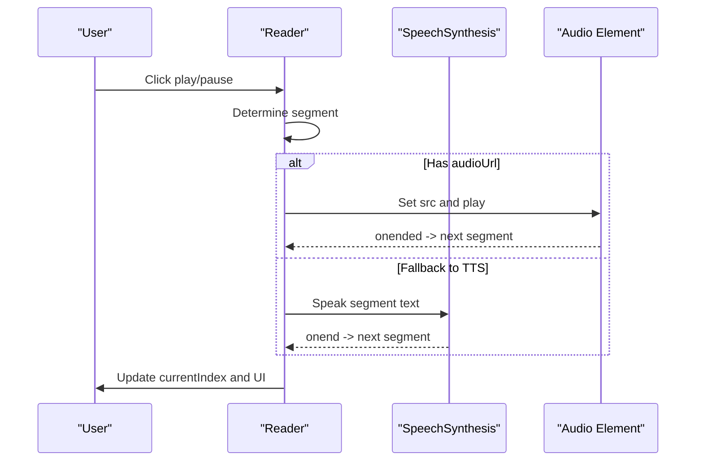

**Diagram sources**
- [Reader.tsx:66-114](file://frontend/src/pages/Reader.tsx#L66-L114)
- [Reader.tsx:127-130](file://frontend/src/pages/Reader.tsx#L127-L130)

**Section sources**
- [Reader.tsx:8-277](file://frontend/src/pages/Reader.tsx#L8-L277)

### EducationalReader
- Purpose: Simplified educational reader with page navigation and cue rendering.
- Features: Difficulty badges, achievements, study stats sidebar, cue triggers.
- Props/state: bookId, currentPage, cues, currentCue, achievements.

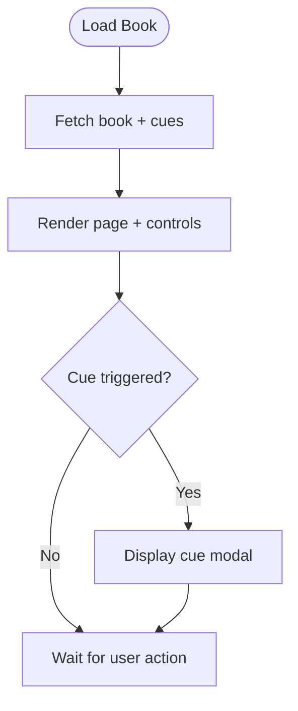

**Diagram sources**
- [EducationalReader.tsx:61-90](file://frontend/src/pages/EducationalReader.tsx#L61-L90)
- [EducationalReader.tsx:117-119](file://frontend/src/pages/EducationalReader.tsx#L117-L119)

**Section sources**
- [EducationalReader.tsx:47-401](file://frontend/src/pages/EducationalReader.tsx#L47-L401)

### IntegratedEducationalReader
- Purpose: Advanced educational reading with offline support, session tracking, notes, quizzes, and AI tutor.
- Offline: Uses Cache API to store audio and metadata for offline access.
- Analytics: Tracks reading sessions, pages read, and updates progress periodically.
- Props/state: bookId, currentPage, cues, currentCue, achievements, notes, quiz modal, offline mode.

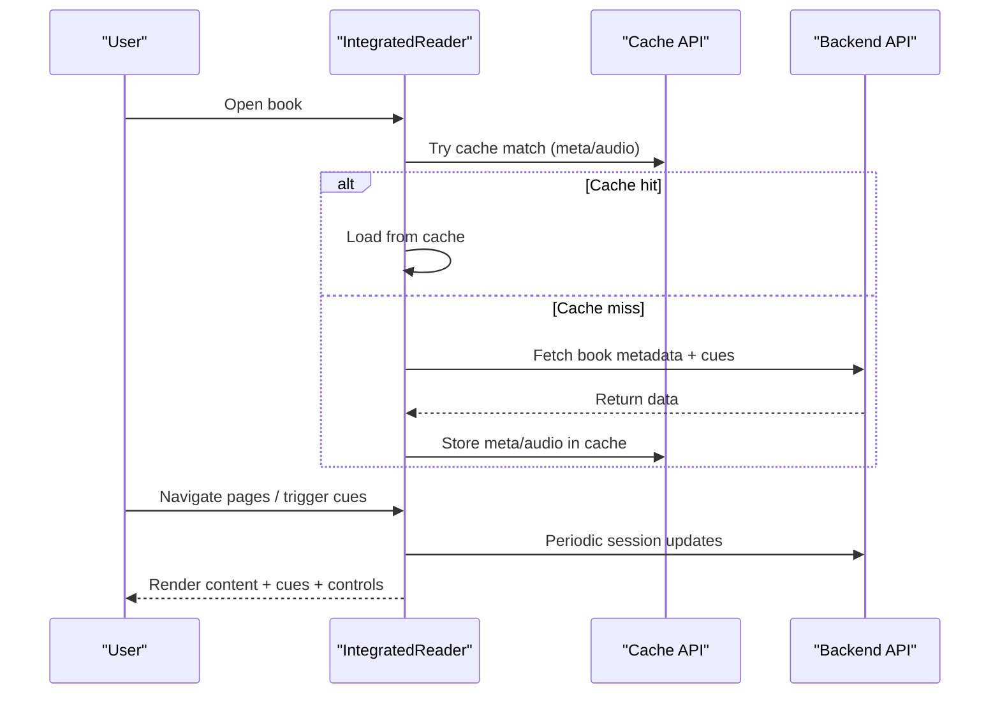

**Diagram sources**
- [IntegratedEducationalReader.tsx:175-228](file://frontend/src/pages/IntegratedEducationalReader.tsx#L175-L228)
- [IntegratedEducationalReader.tsx:255-284](file://frontend/src/pages/IntegratedEducationalReader.tsx#L255-L284)

**Section sources**
- [IntegratedEducationalReader.tsx:75-662](file://frontend/src/pages/IntegratedEducationalReader.tsx#L75-L662)

### Studio
- Purpose: Creator studio for AI-native STEM content creation with metadata, editor, and review tabs.
- Workflows: Import text, generate educational content, generate audio narrations, preview, publish.
- State: activeTab, pages, metadata, selectedVoiceId, isGenerating, isAnalyzing, isPublishing.
- Props: onPreview callback for live preview.

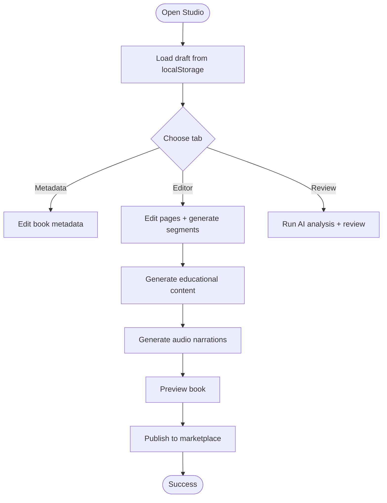

**Diagram sources**
- [Studio.tsx:98-122](file://frontend/src/pages/Studio.tsx#L98-L122)
- [Studio.tsx:170-180](file://frontend/src/pages/Studio.tsx#L170-L180)
- [Studio.tsx:209-208](file://frontend/src/pages/Studio.tsx#L209-L208)
- [Studio.tsx:266-287](file://frontend/src/pages/Studio.tsx#L266-L287)
- [Studio.tsx:289-342](file://frontend/src/pages/Studio.tsx#L289-L342)

**Section sources**
- [Studio.tsx:36-718](file://frontend/src/pages/Studio.tsx#L36-L718)

### LearnerDashboard
- Purpose: Student hub displaying analytics, leaderboard, recent study sessions, and insights.
- Data fetching: Concurrent fetch for analytics, leaderboard, and due notes.
- State: analytics, leaderboard, dueNotesCount, loading.

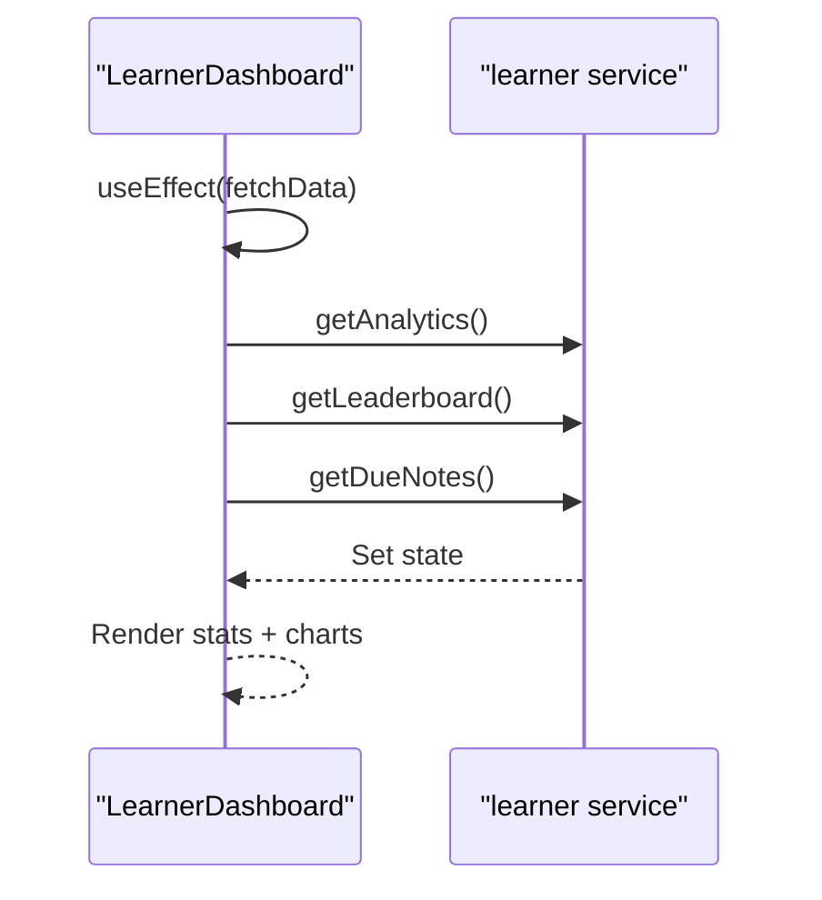

**Diagram sources**
- [LearnerDashboard.tsx:33-50](file://frontend/src/pages/LearnerDashboard.tsx#L33-L50)

**Section sources**
- [LearnerDashboard.tsx:22-219](file://frontend/src/pages/LearnerDashboard.tsx#L22-L219)

### SellerPortal
- Purpose: Creator portal for managing earnings, books, voice lab, video hub, and analytics.
- Data fetching: React Query for seller stats; mutations for payouts.
- State: activeTab, stats, loading, selected book deletion.

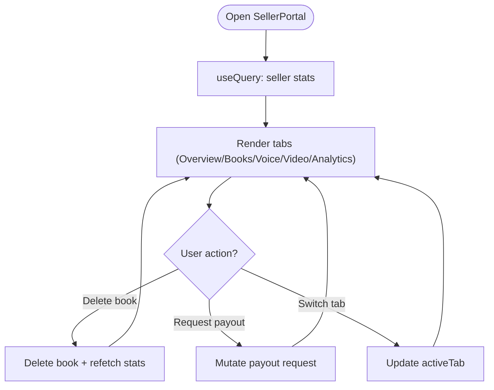

**Diagram sources**
- [SellerPortal.tsx:38-39](file://frontend/src/pages/SellerPortal.tsx#L38-L39)
- [SellerPortal.tsx:45-58](file://frontend/src/pages/SellerPortal.tsx#L45-L58)
- [SellerPortal.tsx:235-267](file://frontend/src/pages/SellerPortal.tsx#L235-L267)

**Section sources**
- [SellerPortal.tsx:33-322](file://frontend/src/pages/SellerPortal.tsx#L33-L322)

### AdminDashboard
- Purpose: Admin control center with stats, management modules, audit logs, and system health.
- Data fetching: React Query for admin stats, logs, and health; polling for health.
- State: logFilter, healthData.

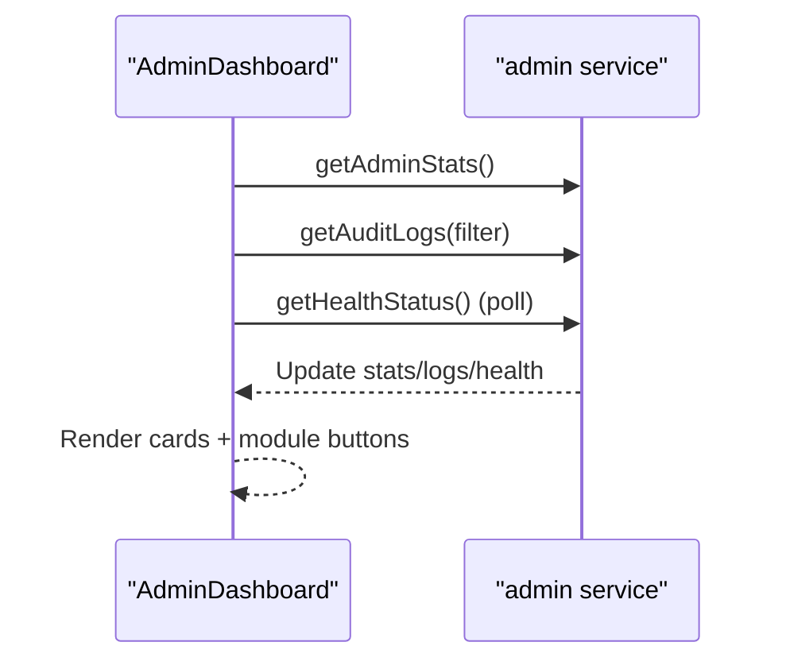

**Diagram sources**
- [AdminDashboard.tsx:32-46](file://frontend/src/pages/AdminDashboard.tsx#L32-L46)

**Section sources**
- [AdminDashboard.tsx:27-311](file://frontend/src/pages/AdminDashboard.tsx#L27-L311)

### AdminBookManagement
- Purpose: Moderate AI-native STEM books; approve/reject individual or bulk updates.
- Data fetching: React Query for books; mutations for single and bulk status updates.
- State: activeTab, selectedBook, selectedIds, rejectionReason.

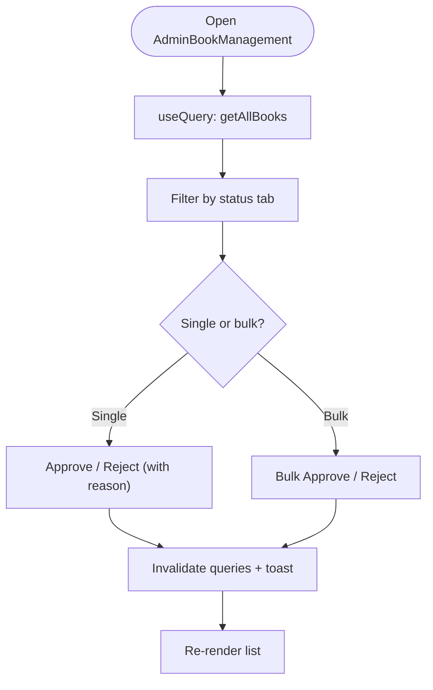

**Diagram sources**
- [AdminBookManagement.tsx:31-48](file://frontend/src/pages/AdminBookManagement.tsx#L31-L48)
- [AdminBookManagement.tsx:65-82](file://frontend/src/pages/AdminBookManagement.tsx#L65-L82)

**Section sources**
- [AdminBookManagement.tsx:20-344](file://frontend/src/pages/AdminBookManagement.tsx#L20-L344)

### AdminSellerManagement
- Purpose: Approve or revoke seller accounts; manage commission rates.
- Data fetching: React Query for sellers; mutation for status updates.
- State: activeTab.

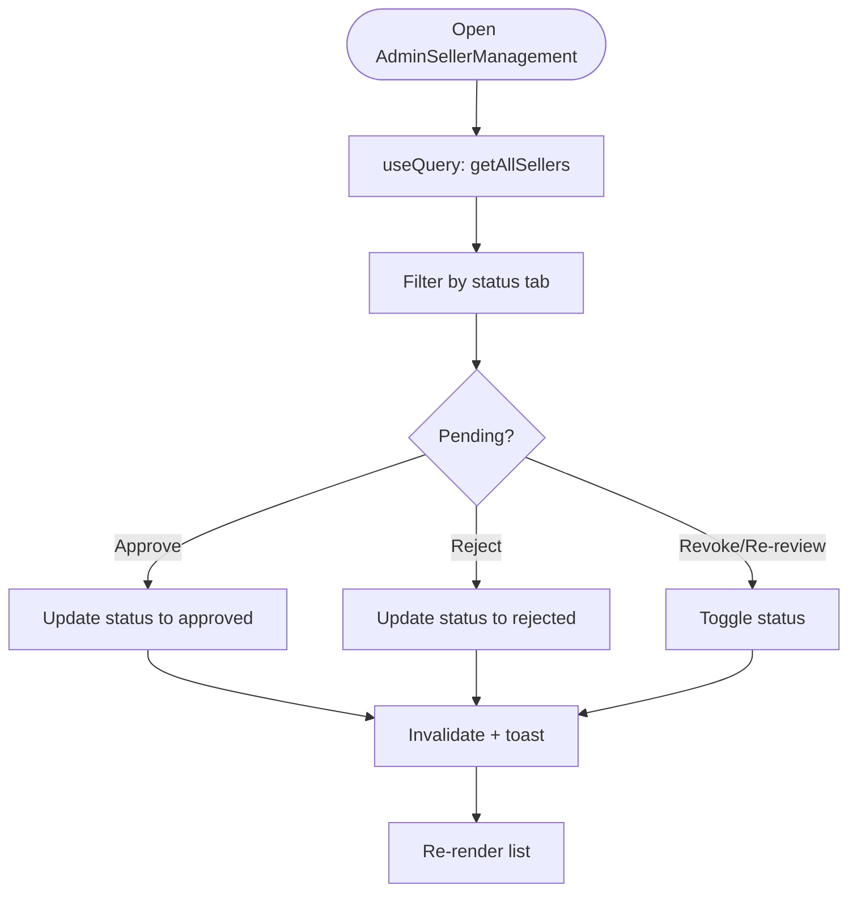

**Diagram sources**
- [AdminSellerManagement.tsx:27-42](file://frontend/src/pages/AdminSellerManagement.tsx#L27-L42)

**Section sources**
- [AdminSellerManagement.tsx:22-171](file://frontend/src/pages/AdminSellerManagement.tsx#L22-L171)

### Additional Pages
- BookDetail: Detailed view of a book with pricing info and chapter listings.
- BookEditor: Admin/editor interface for managing book metadata, pages, and approval workflow.
- BookCatalog: Generic catalog component supporting search, filters, and sorting.
- ReadingAnalytics: Learner analytics dashboard with charts and summary cards.

**Section sources**
- [BookDetail.tsx:26-197](file://frontend/src/pages/BookDetail.tsx#L26-L197)
- [BookEditor.tsx:30-426](file://frontend/src/pages/BookEditor.tsx#L30-L426)
- [BookCatalog.tsx:11-274](file://frontend/src/pages/BookCatalog.tsx#L11-L274)
- [ReadingAnalytics.tsx:17-156](file://frontend/src/pages/ReadingAnalytics.tsx#L17-L156)

## Dependency Analysis
- Context dependencies: AuthContext and StoreContext are consumed by multiple pages for authentication and cart/library state.
- Service dependencies: Pages rely on api.ts and service modules for backend integration.
- UI dependencies: Shared components (Button, Card, Input) unify styling and behavior.
- React Query: Used extensively for caching, background refetching, and optimistic updates in admin and learner/seller dashboards.

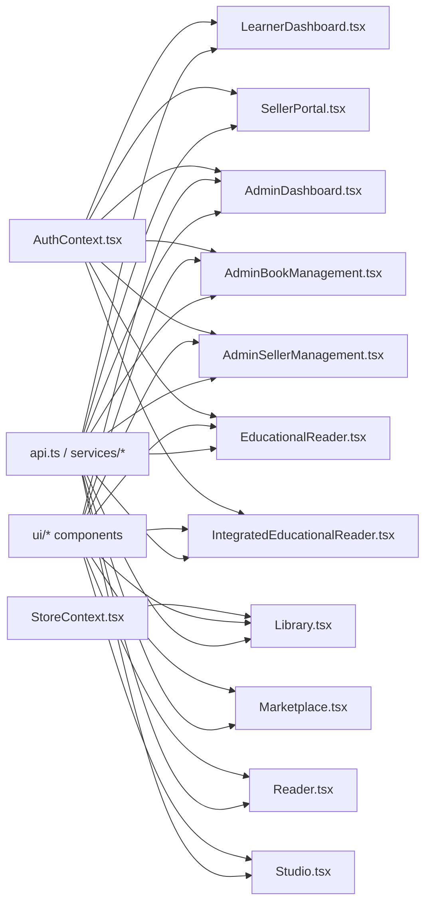

**Diagram sources**
- [Library.tsx:13-329](file://frontend/src/pages/Library.tsx#L13-L329)
- [Marketplace.tsx:112-264](file://frontend/src/pages/Marketplace.tsx#L112-L264)
- [Reader.tsx:8-277](file://frontend/src/pages/Reader.tsx#L8-L277)
- [EducationalReader.tsx:47-401](file://frontend/src/pages/EducationalReader.tsx#L47-L401)
- [IntegratedEducationalReader.tsx:75-662](file://frontend/src/pages/IntegratedEducationalReader.tsx#L75-L662)
- [Studio.tsx:36-718](file://frontend/src/pages/Studio.tsx#L36-L718)
- [LearnerDashboard.tsx:22-219](file://frontend/src/pages/LearnerDashboard.tsx#L22-L219)
- [SellerPortal.tsx:33-322](file://frontend/src/pages/SellerPortal.tsx#L33-L322)
- [AdminDashboard.tsx:27-311](file://frontend/src/pages/AdminDashboard.tsx#L27-L311)
- [AdminBookManagement.tsx:20-344](file://frontend/src/pages/AdminBookManagement.tsx#L20-L344)
- [AdminSellerManagement.tsx:22-171](file://frontend/src/pages/AdminSellerManagement.tsx#L22-L171)

**Section sources**
- [Library.tsx:13-329](file://frontend/src/pages/Library.tsx#L13-L329)
- [Marketplace.tsx:112-264](file://frontend/src/pages/Marketplace.tsx#L112-L264)
- [Reader.tsx:8-277](file://frontend/src/pages/Reader.tsx#L8-L277)
- [EducationalReader.tsx:47-401](file://frontend/src/pages/EducationalReader.tsx#L47-L401)
- [IntegratedEducationalReader.tsx:75-662](file://frontend/src/pages/IntegratedEducationalReader.tsx#L75-L662)
- [Studio.tsx:36-718](file://frontend/src/pages/Studio.tsx#L36-L718)
- [LearnerDashboard.tsx:22-219](file://frontend/src/pages/LearnerDashboard.tsx#L22-L219)
- [SellerPortal.tsx:33-322](file://frontend/src/pages/SellerPortal.tsx#L33-L322)
- [AdminDashboard.tsx:27-311](file://frontend/src/pages/AdminDashboard.tsx#L27-L311)
- [AdminBookManagement.tsx:20-344](file://frontend/src/pages/AdminBookManagement.tsx#L20-L344)
- [AdminSellerManagement.tsx:22-171](file://frontend/src/pages/AdminSellerManagement.tsx#L22-L171)

## Performance Considerations
- Use React Query’s caching and background refetching to minimize redundant network calls in dashboards.
- Debounce or throttle search/filter updates in Library and Marketplace to reduce re-renders.
- Lazy-load heavy components (e.g., charts, media players) to improve initial load times.
- Optimize image rendering and consider responsive images for book covers.
- Use virtualized lists for long grids (e.g., leaderboard, book catalogs) when data scales.

## Troubleshooting Guide
- Authentication issues: Ensure AuthContext provides a valid user and token; verify route guards and protected routes.
- Data fetching failures: Check React Query error boundaries and toasts; confirm API endpoints and CORS configuration.
- Reader playback problems: Verify audio URLs and fallback to TTS; inspect speech synthesis permissions.
- Offline mode: Confirm Cache API availability and proper cache keys for book metadata and audio.
- Admin workflows: Validate mutation responses and query invalidation to keep UI in sync.

**Section sources**
- [LearnerDashboard.tsx:44-49](file://frontend/src/pages/LearnerDashboard.tsx#L44-L49)
- [SellerPortal.tsx:45-58](file://frontend/src/pages/SellerPortal.tsx#L45-L58)
- [AdminDashboard.tsx:32-46](file://frontend/src/pages/AdminDashboard.tsx#L32-L46)
- [IntegratedEducationalReader.tsx:112-138](file://frontend/src/pages/IntegratedEducationalReader.tsx#L112-L138)

## Conclusion
The QuantumMint Bookstore frontend organizes its pages around clear responsibilities: browsing and purchasing (Library, Marketplace), immersive reading (Reader, EducationalReader, IntegratedEducationalReader), content creation (Studio), analytics and dashboards (LearnerDashboard, SellerPortal), and administration (AdminDashboard, AdminBookManagement, AdminSellerManagement). The architecture leverages React Query for robust data management, shared contexts for state, and reusable UI components for consistency. These patterns enable scalable enhancements while maintaining a cohesive user experience across roles (learners, creators, administrators).