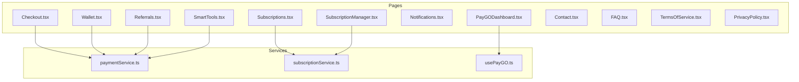
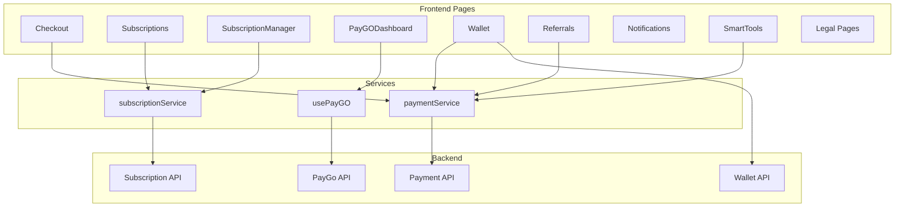
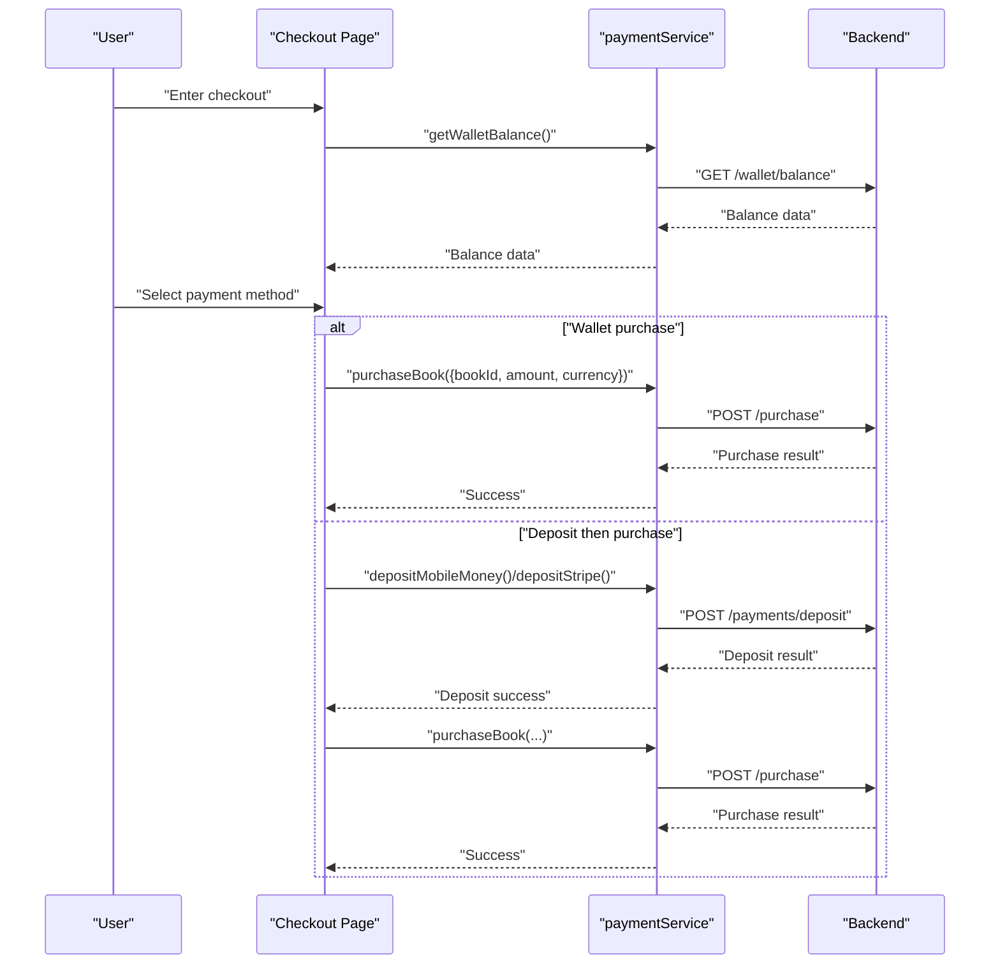
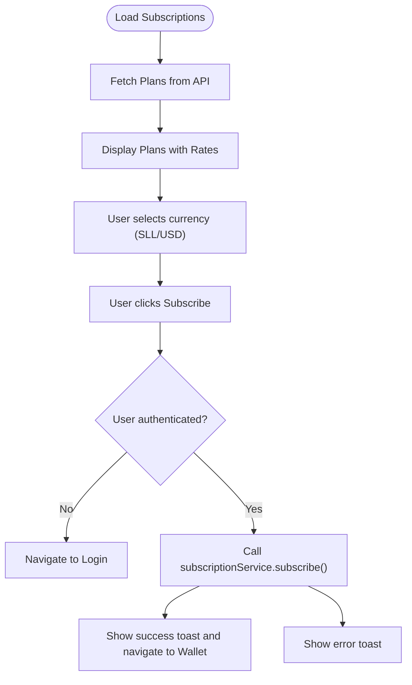
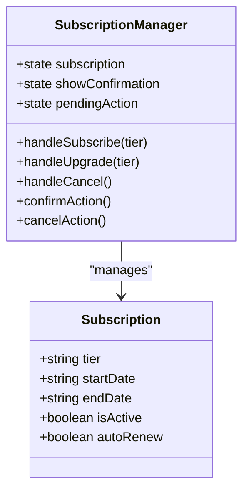
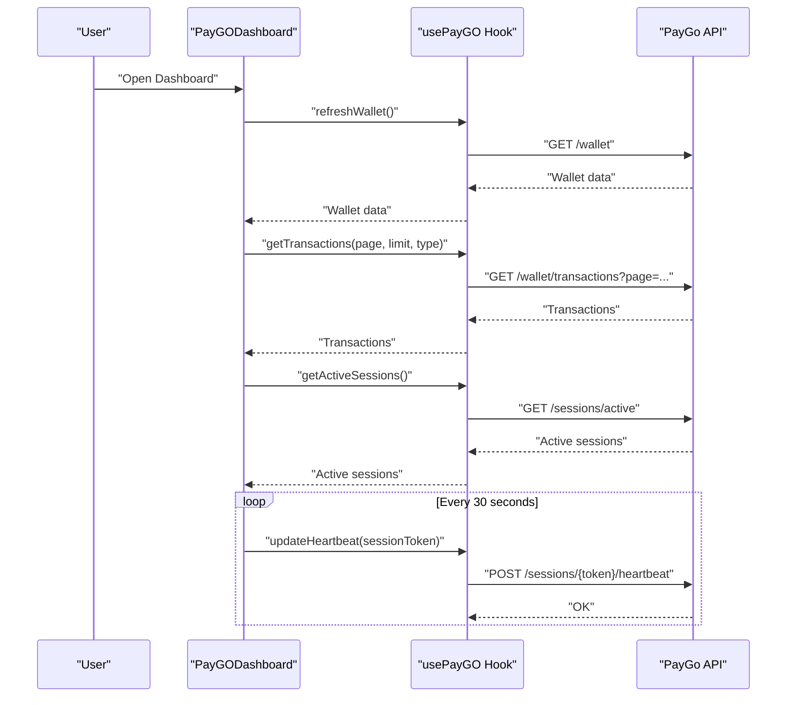
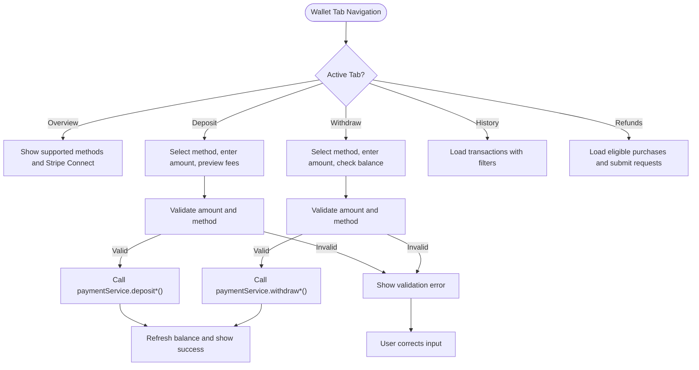
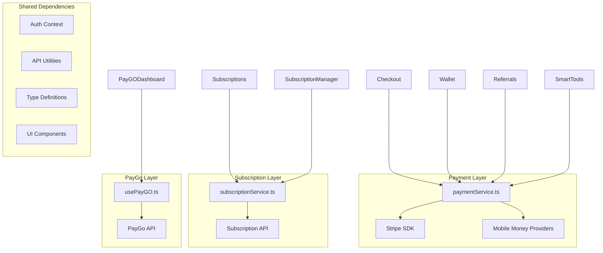

# Special Feature Pages

<cite>
**Referenced Files in This Document**
- [Checkout.tsx](file://frontend/src/pages/Checkout.tsx)
- [Subscriptions.tsx](file://frontend/src/pages/Subscriptions.tsx)
- [SubscriptionManager.tsx](file://frontend/src/pages/SubscriptionManager.tsx)
- [PayGODashboard.tsx](file://frontend/src/pages/PayGODashboard.tsx)
- [Wallet.tsx](file://frontend/src/pages/Wallet.tsx)
- [Referrals.tsx](file://frontend/src/pages/Referrals.tsx)
- [Notifications.tsx](file://frontend/src/pages/Notifications.tsx)
- [SmartTools.tsx](file://frontend/src/pages/SmartTools.tsx)
- [Contact.tsx](file://frontend/src/pages/Contact.tsx)
- [FAQ.tsx](file://frontend/src/pages/FAQ.tsx)
- [TermsOfService.tsx](file://frontend/src/pages/TermsOfService.tsx)
- [PrivacyPolicy.tsx](file://frontend/src/pages/PrivacyPolicy.tsx)
- [paymentService.ts](file://frontend/src/services/paymentService.ts)
- [subscriptionService.ts](file://frontend/src/services/subscriptionService.ts)
- [usePayGO.ts](file://frontend/src/hooks/usePayGO.ts)
</cite>

## Table of Contents
1. [Introduction](#introduction)
2. [Project Structure](#project-structure)
3. [Core Components](#core-components)
4. [Architecture Overview](#architecture-overview)
5. [Detailed Component Analysis](#detailed-component-analysis)
6. [Dependency Analysis](#dependency-analysis)
7. [Performance Considerations](#performance-considerations)
8. [Troubleshooting Guide](#troubleshooting-guide)
9. [Conclusion](#conclusion)

## Introduction
This document provides comprehensive documentation for the special feature and utility pages in the QuantumMint Bookstore frontend. It covers the complete feature set including:
- Checkout and payment flow (Checkout)
- Subscription management (Subscriptions, SubscriptionManager)
- PayGo system dashboard (PayGODashboard)
- Digital wallet (Wallet)
- Referral program (Referrals)
- Notification center (Notifications)
- Smart tools integration (SmartTools)
- Legal and compliance pages (Contact, FAQ, TermsOfService, PrivacyPolicy)

For each page, we explain component structure, integration with payment services, subscription APIs, and utility services. We also document page-specific features such as payment processing, subscription renewal, wallet transactions, referral tracking, and user communication. Component props, state management for complex workflows, integration with backend services, and user experience patterns are included.

## Project Structure
The special feature pages are organized under the frontend/src/pages directory. Each page is a self-contained React component that integrates with services and utilities for payments, subscriptions, and PayGo functionality. The pages leverage shared UI components, context providers, and typed APIs for robust integrations.

**Diagram sources**
- [Checkout.tsx:1-604](file://frontend/src/pages/Checkout.tsx#L1-L604)
- [Subscriptions.tsx:1-180](file://frontend/src/pages/Subscriptions.tsx#L1-L180)
- [SubscriptionManager.tsx:1-272](file://frontend/src/pages/SubscriptionManager.tsx#L1-L272)
- [PayGODashboard.tsx:1-386](file://frontend/src/pages/PayGODashboard.tsx#L1-L386)
- [Wallet.tsx:1-653](file://frontend/src/pages/Wallet.tsx#L1-L653)
- [Referrals.tsx:1-195](file://frontend/src/pages/Referrals.tsx#L1-L195)
- [Notifications.tsx:1-238](file://frontend/src/pages/Notifications.tsx#L1-L238)
- [SmartTools.tsx:1-159](file://frontend/src/pages/SmartTools.tsx#L1-L159)
- [Contact.tsx:1-316](file://frontend/src/pages/Contact.tsx#L1-L316)
- [FAQ.tsx:1-313](file://frontend/src/pages/FAQ.tsx#L1-L313)
- [TermsOfService.tsx:1-194](file://frontend/src/pages/TermsOfService.tsx#L1-L194)
- [PrivacyPolicy.tsx:1-147](file://frontend/src/pages/PrivacyPolicy.tsx#L1-L147)
- [paymentService.ts:1-187](file://frontend/src/services/paymentService.ts#L1-L187)
- [subscriptionService.ts:1-161](file://frontend/src/services/subscriptionService.ts#L1-L161)
- [usePayGO.ts:1-315](file://frontend/src/hooks/usePayGO.ts#L1-L315)

**Section sources**
- [Checkout.tsx:1-604](file://frontend/src/pages/Checkout.tsx#L1-L604)
- [Subscriptions.tsx:1-180](file://frontend/src/pages/Subscriptions.tsx#L1-L180)
- [SubscriptionManager.tsx:1-272](file://frontend/src/pages/SubscriptionManager.tsx#L1-L272)
- [PayGODashboard.tsx:1-386](file://frontend/src/pages/PayGODashboard.tsx#L1-L386)
- [Wallet.tsx:1-653](file://frontend/src/pages/Wallet.tsx#L1-L653)
- [Referrals.tsx:1-195](file://frontend/src/pages/Referrals.tsx#L1-L195)
- [Notifications.tsx:1-238](file://frontend/src/pages/Notifications.tsx#L1-L238)
- [SmartTools.tsx:1-159](file://frontend/src/pages/SmartTools.tsx#L1-L159)
- [Contact.tsx:1-316](file://frontend/src/pages/Contact.tsx#L1-L316)
- [FAQ.tsx:1-313](file://frontend/src/pages/FAQ.tsx#L1-L313)
- [TermsOfService.tsx:1-194](file://frontend/src/pages/TermsOfService.tsx#L1-L194)
- [PrivacyPolicy.tsx:1-147](file://frontend/src/pages/PrivacyPolicy.tsx#L1-L147)
- [paymentService.ts:1-187](file://frontend/src/services/paymentService.ts#L1-L187)
- [subscriptionService.ts:1-161](file://frontend/src/services/subscriptionService.ts#L1-L161)
- [usePayGO.ts:1-315](file://frontend/src/hooks/usePayGO.ts#L1-L315)

## Core Components
This section outlines the primary responsibilities and integration points for each special feature page.

- Checkout (Checkout.tsx)
  - Manages a 4-step checkout flow: Review, Billing, Payment, and Confirmation.
  - Integrates with paymentService for wallet balance retrieval, deposits, and purchases.
  - Supports multiple payment methods: wallet, card (Stripe), and mobile money (Orange Money, Afrimoney, Qmoney).
  - Implements currency switching (USD/SLL) and live exchange rate integration.

- Subscriptions (Subscriptions.tsx)
  - Displays subscription plans and allows users to subscribe directly from their wallet.
  - Uses subscriptionService for plan retrieval and subscription actions.
  - Provides currency selection (SLL/USD) with live exchange rate display.

- SubscriptionManager (SubscriptionManager.tsx)
  - Manages subscription lifecycle: subscribe, upgrade, and cancel.
  - Includes a confirmation modal for each action and displays benefits and payment history.
  - Demonstrates state transitions and user prompts for subscription changes.

- PayGODashboard (PayGODashboard.tsx)
  - Central dashboard for PayGo wallet, active sessions, and recent transactions.
  - Uses usePayGO hook to fetch wallet, transactions, and active sessions.
  - Provides filtering, pagination, and statistics for spending and deposits.

- Wallet (Wallet.tsx)
  - Comprehensive wallet management with tabs for balance, deposit, withdraw, history, and refunds.
  - Integrates with paymentService for balance, transactions, deposits, withdrawals, and Stripe Connect.
  - Supports mobile money and Stripe for deposits and withdrawals with fee previews.

- Referrals (Referrals.tsx)
  - Displays referral statistics, copyable referral link, and sharing options.
  - Shows mock referral history and program benefits.
  - Encourages users to invite friends and earn rewards.

- Notifications (Notifications.tsx)
  - Centralized notification center with filtering (all/unread/read), marking as read, and deletion.
  - Provides notification preferences toggles.
  - Enhances user communication and engagement.

- SmartTools (SmartTools.tsx)
  - AI-powered tools for analyzing images: chart/diagram analysis, receipt scanning, translation.
  - Integrates with AI services to generate insights from uploaded images.
  - Offers a clean workspace with upload and analysis workflow.

- Legal and Compliance (Contact.tsx, FAQ.tsx, TermsOfService.tsx, PrivacyPolicy.tsx)
  - Contact: Form-based customer support with validation and submission feedback.
  - FAQ: Category-based accordion-style FAQ with expand/collapse behavior.
  - TermsOfService: Comprehensive terms with structured sections and styling.
  - PrivacyPolicy: Clear privacy policy with data collection, usage, security, and rights.

**Section sources**
- [Checkout.tsx:1-604](file://frontend/src/pages/Checkout.tsx#L1-L604)
- [Subscriptions.tsx:1-180](file://frontend/src/pages/Subscriptions.tsx#L1-L180)
- [SubscriptionManager.tsx:1-272](file://frontend/src/pages/SubscriptionManager.tsx#L1-L272)
- [PayGODashboard.tsx:1-386](file://frontend/src/pages/PayGODashboard.tsx#L1-L386)
- [Wallet.tsx:1-653](file://frontend/src/pages/Wallet.tsx#L1-L653)
- [Referrals.tsx:1-195](file://frontend/src/pages/Referrals.tsx#L1-L195)
- [Notifications.tsx:1-238](file://frontend/src/pages/Notifications.tsx#L1-L238)
- [SmartTools.tsx:1-159](file://frontend/src/pages/SmartTools.tsx#L1-L159)
- [Contact.tsx:1-316](file://frontend/src/pages/Contact.tsx#L1-L316)
- [FAQ.tsx:1-313](file://frontend/src/pages/FAQ.tsx#L1-L313)
- [TermsOfService.tsx:1-194](file://frontend/src/pages/TermsOfService.tsx#L1-L194)
- [PrivacyPolicy.tsx:1-147](file://frontend/src/pages/PrivacyPolicy.tsx#L1-L147)

## Architecture Overview
The special feature pages integrate with backend services through dedicated frontend services and hooks. Payments and subscriptions are handled via paymentService and subscriptionService, while PayGo functionality is encapsulated in usePayGO.

**Diagram sources**
- [Checkout.tsx:1-604](file://frontend/src/pages/Checkout.tsx#L1-L604)
- [Subscriptions.tsx:1-180](file://frontend/src/pages/Subscriptions.tsx#L1-L180)
- [SubscriptionManager.tsx:1-272](file://frontend/src/pages/SubscriptionManager.tsx#L1-L272)
- [PayGODashboard.tsx:1-386](file://frontend/src/pages/PayGODashboard.tsx#L1-L386)
- [Wallet.tsx:1-653](file://frontend/src/pages/Wallet.tsx#L1-L653)
- [Referrals.tsx:1-195](file://frontend/src/pages/Referrals.tsx#L1-L195)
- [Notifications.tsx:1-238](file://frontend/src/pages/Notifications.tsx#L1-L238)
- [SmartTools.tsx:1-159](file://frontend/src/pages/SmartTools.tsx#L1-L159)
- [paymentService.ts:1-187](file://frontend/src/services/paymentService.ts#L1-L187)
- [subscriptionService.ts:1-161](file://frontend/src/services/subscriptionService.ts#L1-L161)
- [usePayGO.ts:1-315](file://frontend/src/hooks/usePayGO.ts#L1-L315)

## Detailed Component Analysis

### Checkout
The Checkout page implements a guided, multi-step checkout experience with integrated payment processing.

Key features:
- Four-step wizard: Review, Billing, Payment, Confirmation
- Currency switching between USD and SLL with live exchange rate
- Payment method selection: Wallet, Card (Stripe), Mobile Money (Orange, Afrimoney, Qmoney)
- Real-time validation and error messaging
- Order summary and progress indicators

Integration points:
- paymentService.getWalletBalance for initial balance retrieval
- paymentService.purchaseBook for direct wallet purchases
- paymentService.depositStripe and paymentService.depositMobileMoney for pre-deposit flows
- Auth context for user information population

**Diagram sources**
- [Checkout.tsx:170-214](file://frontend/src/pages/Checkout.tsx#L170-L214)
- [paymentService.ts:28-186](file://frontend/src/services/paymentService.ts#L28-L186)

State management highlights:
- Step progression with completion tracking
- Billing information state with validation
- Selected currency and payment method persistence
- Loading states for async operations
- Error handling with user-friendly messages

**Section sources**
- [Checkout.tsx:1-604](file://frontend/src/pages/Checkout.tsx#L1-L604)
- [paymentService.ts:1-187](file://frontend/src/services/paymentService.ts#L1-L187)

### Subscriptions
The Subscriptions page presents available subscription tiers and enables direct enrollment from the user's wallet.

Key features:
- Plan display with pricing in SLL and USD
- Live exchange rate integration
- Currency selector with real-time conversions
- One-click subscription with wallet deduction
- Authentication gating and navigation to wallet on success

Integration points:
- subscriptionService.subscribe for plan activation
- useExchangeRate hook for dynamic exchange rates
- Auth context for user authentication checks

**Diagram sources**
- [Subscriptions.tsx:29-65](file://frontend/src/pages/Subscriptions.tsx#L29-L65)
- [subscriptionService.ts:29-39](file://frontend/src/services/subscriptionService.ts#L29-L39)

**Section sources**
- [Subscriptions.tsx:1-180](file://frontend/src/pages/Subscriptions.tsx#L1-L180)
- [subscriptionService.ts:1-161](file://frontend/src/services/subscriptionService.ts#L1-L161)

### SubscriptionManager
The SubscriptionManager provides granular control over subscription lifecycle with confirmation dialogs.

Key features:
- Current subscription display with benefits
- Action confirmation modals for subscribe, upgrade, and cancel
- Tier-based pricing and duration calculations
- Payment history display
- Benefit showcase and feature highlights

**Diagram sources**
- [SubscriptionManager.tsx:11-105](file://frontend/src/pages/SubscriptionManager.tsx#L11-L105)
- [SubscriptionManager.tsx:124-129](file://frontend/src/pages/SubscriptionManager.tsx#L124-L129)

**Section sources**
- [SubscriptionManager.tsx:1-272](file://frontend/src/pages/SubscriptionManager.tsx#L1-L272)

### PayGODashboard
The PayGODashboard centralizes PayGo wallet management with real-time session monitoring and transaction history.

Key features:
- Wallet summary cards with balances and conversions
- Active sessions monitoring with automatic heartbeat updates
- Transaction history with filtering and pagination
- Spending statistics (week/month) and deposit tracking
- Service-type icons and transaction categorization

Integration points:
- usePayGO hook for wallet, transactions, and sessions
- Auto-refresh intervals for active sessions
- Heartbeat updates to maintain session validity

**Diagram sources**
- [PayGODashboard.tsx:34-42](file://frontend/src/pages/PayGODashboard.tsx#L34-L42)
- [usePayGO.ts:126-137](file://frontend/src/hooks/usePayGO.ts#L126-L137)
- [usePayGO.ts:232-253](file://frontend/src/hooks/usePayGO.ts#L232-L253)
- [usePayGO.ts:256-264](file://frontend/src/hooks/usePayGO.ts#L256-L264)
- [usePayGO.ts:287-297](file://frontend/src/hooks/usePayGO.ts#L287-L297)

**Section sources**
- [PayGODashboard.tsx:1-386](file://frontend/src/pages/PayGODashboard.tsx#L1-L386)
- [usePayGO.ts:1-315](file://frontend/src/hooks/usePayGO.ts#L1-L315)

### Wallet
The Wallet page provides comprehensive financial management with multiple tabs for different operations.

Key features:
- Multi-tab interface: Overview, Deposit, Withdraw, History, Refunds
- Supported payment methods with configuration and fee previews
- Stripe Connect integration for USD payouts
- Transaction history with filters and pagination
- Refund request submission and tracking
- Real-time balance refresh and exchange rate display

Integration points:
- paymentService for all wallet operations
- refundsAPI for refund management
- useExchangeRate hook for currency conversions

**Diagram sources**
- [Wallet.tsx:194-244](file://frontend/src/pages/Wallet.tsx#L194-L244)
- [Wallet.tsx:167-182](file://frontend/src/pages/Wallet.tsx#L167-L182)
- [paymentService.ts:62-106](file://frontend/src/services/paymentService.ts#L62-L106)

**Section sources**
- [Wallet.tsx:1-653](file://frontend/src/pages/Wallet.tsx#L1-L653)
- [paymentService.ts:1-187](file://frontend/src/services/paymentService.ts#L1-L187)

### Referrals
The Referrals page focuses on user acquisition and reward tracking.

Key features:
- Personalized referral link generation
- Copy-to-clipboard functionality
- Social sharing options (email, Twitter, Facebook)
- Referral statistics: total earnings, total referrals, pending rewards
- Historical referral tracking with status indicators

**Section sources**
- [Referrals.tsx:1-195](file://frontend/src/pages/Referrals.tsx#L1-L195)

### Notifications
The Notifications page centralizes user communications with filtering and preference management.

Key features:
- Filter by all/unread/read notifications
- Mark as read and delete actions per notification
- Bulk mark all as read
- Notification preferences with toggle controls
- Visual indicators for unread items

**Section sources**
- [Notifications.tsx:1-238](file://frontend/src/pages/Notifications.tsx#L1-L238)

### SmartTools
The SmartTools page demonstrates AI-powered capabilities for educational content.

Key features:
- Tool selection: Chart/Diagram Analyst, Receipt Scanner
- Image upload and preview
- AI analysis with Gemini models
- Result display with clear formatting
- Tool-specific prompts and analysis workflows

**Section sources**
- [SmartTools.tsx:1-159](file://frontend/src/pages/SmartTools.tsx#L1-L159)

### Legal and Compliance Pages
These pages provide essential legal information and support channels.

- Contact: Form with validation, submission feedback, and responsive layout
- FAQ: Category-based accordion with smooth animations and clear structure
- TermsOfService: Comprehensive terms with numbered sections and styled presentation
- PrivacyPolicy: Detailed privacy statement with data handling and user rights

**Section sources**
- [Contact.tsx:1-316](file://frontend/src/pages/Contact.tsx#L1-L316)
- [FAQ.tsx:1-313](file://frontend/src/pages/FAQ.tsx#L1-L313)
- [TermsOfService.tsx:1-194](file://frontend/src/pages/TermsOfService.tsx#L1-L194)
- [PrivacyPolicy.tsx:1-147](file://frontend/src/pages/PrivacyPolicy.tsx#L1-L147)

## Dependency Analysis
The special feature pages share common integration patterns and dependencies across payment, subscription, and utility services.

**Diagram sources**
- [Checkout.tsx:1-604](file://frontend/src/pages/Checkout.tsx#L1-L604)
- [Wallet.tsx:1-653](file://frontend/src/pages/Wallet.tsx#L1-L653)
- [Subscriptions.tsx:1-180](file://frontend/src/pages/Subscriptions.tsx#L1-L180)
- [SubscriptionManager.tsx:1-272](file://frontend/src/pages/SubscriptionManager.tsx#L1-L272)
- [PayGODashboard.tsx:1-386](file://frontend/src/pages/PayGODashboard.tsx#L1-L386)
- [Referrals.tsx:1-195](file://frontend/src/pages/Referrals.tsx#L1-L195)
- [SmartTools.tsx:1-159](file://frontend/src/pages/SmartTools.tsx#L1-L159)
- [paymentService.ts:1-187](file://frontend/src/services/paymentService.ts#L1-L187)
- [subscriptionService.ts:1-161](file://frontend/src/services/subscriptionService.ts#L1-L161)
- [usePayGO.ts:1-315](file://frontend/src/hooks/usePayGO.ts#L1-L315)

**Section sources**
- [paymentService.ts:1-187](file://frontend/src/services/paymentService.ts#L1-L187)
- [subscriptionService.ts:1-161](file://frontend/src/services/subscriptionService.ts#L1-L161)
- [usePayGO.ts:1-315](file://frontend/src/hooks/usePayGO.ts#L1-L315)

## Performance Considerations
- Exchange Rate Caching: paymentService caches exchange rates to minimize API calls and improve UX responsiveness.
- Auto-Refresh Intervals: usePayGO implements periodic refreshes for active sessions and heartbeats to maintain accuracy without excessive polling.
- Lazy Loading: Large components like transaction histories use pagination to reduce initial load times.
- State Management: Centralized hooks and services prevent redundant network requests and maintain consistent state across components.
- Error Boundaries: Pages implement error states and user-friendly messaging to maintain usability during failures.

## Troubleshooting Guide
Common issues and resolutions:

Payment Processing Issues:
- Insufficient balance errors: Redirect users to Wallet to add funds
- Payment method validation: Ensure phone numbers and amounts meet provider requirements
- Network timeouts: Implement retry logic and user feedback

Subscription Management:
- Authentication failures: Redirect to login with return URL
- Insufficient funds: Display wallet balance and navigation to funding options
- API errors: Show generic error messages and enable retry

PayGo Dashboard:
- Session timeouts: Automatic heartbeat updates prevent premature termination
- Transaction delays: Implement polling with exponential backoff
- Balance discrepancies: Trigger manual refresh and show reconciliation options

Wallet Operations:
- Stripe Connect issues: Verify account setup and permissions
- Mobile money failures: Validate phone numbers and network coverage
- Transaction history empty: Check filters and pagination parameters

**Section sources**
- [Checkout.tsx:208-214](file://frontend/src/pages/Checkout.tsx#L208-L214)
- [Subscriptions.tsx:56-61](file://frontend/src/pages/Subscriptions.tsx#L56-L61)
- [Wallet.tsx:167-182](file://frontend/src/pages/Wallet.tsx#L167-L182)
- [usePayGO.ts:287-297](file://frontend/src/hooks/usePayGO.ts#L287-L297)

## Conclusion
The QuantumMint Bookstore special feature pages provide a comprehensive suite of utilities designed to enhance user experience through seamless payment processing, flexible subscription management, transparent wallet operations, and engaging educational tools. The modular architecture ensures maintainability and scalability while the integrated services provide robust backend connectivity. The pages demonstrate best practices in user experience design, error handling, and performance optimization, delivering a reliable platform for educational content consumption and monetization.