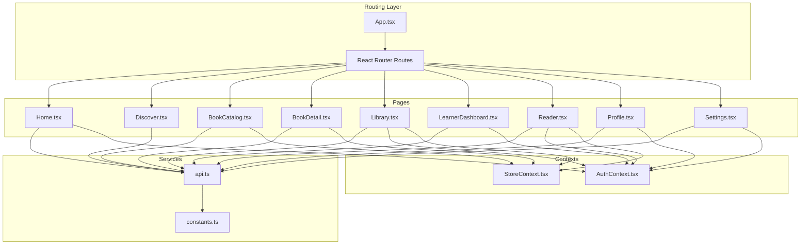
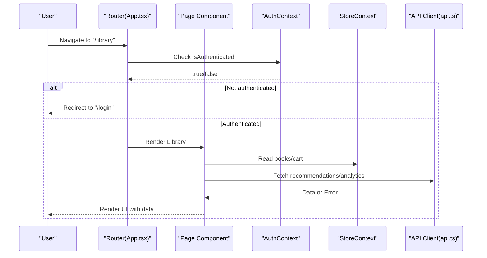
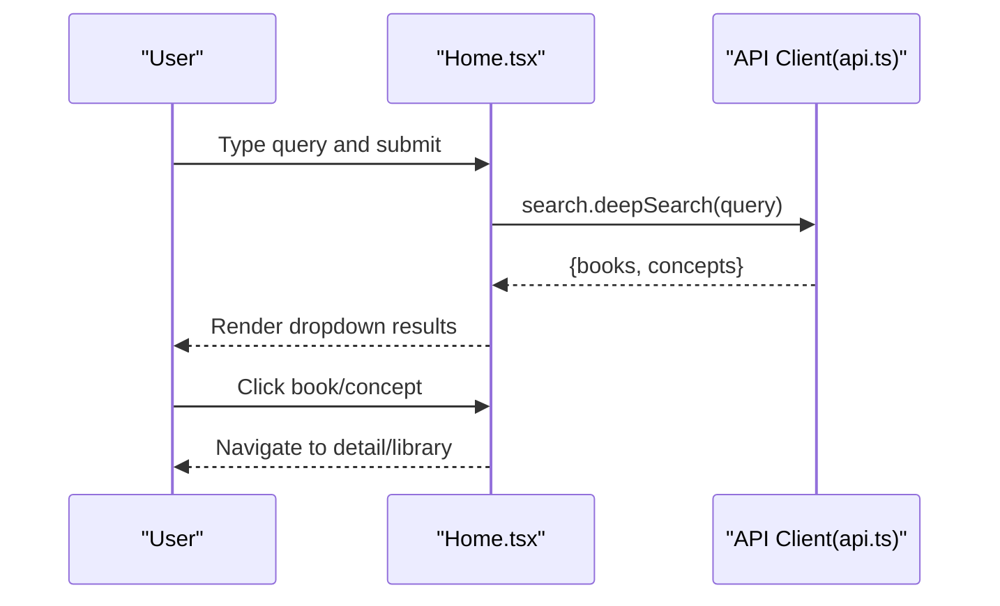
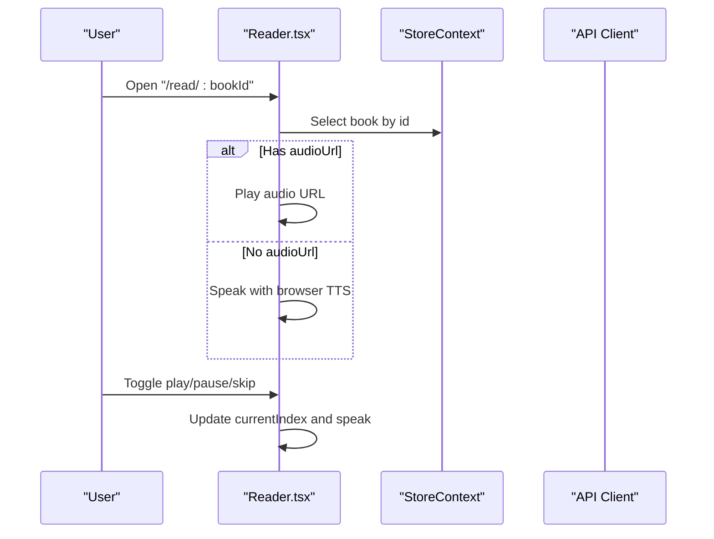
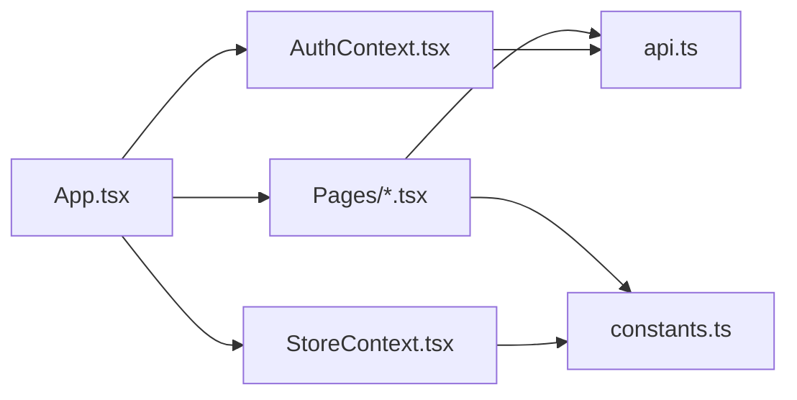

# User Pages

<cite>
**Referenced Files in This Document**
- [Home.tsx](file://frontend/src/pages/Home.tsx)
- [Discover.tsx](file://frontend/src/pages/Discover.tsx)
- [BookCatalog.tsx](file://frontend/src/pages/BookCatalog.tsx)
- [BookDetail.tsx](file://frontend/src/pages/BookDetail.tsx)
- [Reader.tsx](file://frontend/src/pages/Reader.tsx)
- [LearnerDashboard.tsx](file://frontend/src/pages/LearnerDashboard.tsx)
- [Library.tsx](file://frontend/src/pages/Library.tsx)
- [Profile.tsx](file://frontend/src/pages/Profile.tsx)
- [Settings.tsx](file://frontend/src/pages/Settings.tsx)
- [AuthContext.tsx](file://frontend/src/contexts/AuthContext.tsx)
- [StoreContext.tsx](file://frontend/src/contexts/StoreContext.tsx)
- [api.ts](file://frontend/src/utils/api.ts)
- [constants.ts](file://frontend/src/constants.ts)
- [App.tsx](file://frontend/src/App.tsx)
</cite>

## Table of Contents
1. [Introduction](#introduction)
2. [Project Structure](#project-structure)
3. [Core Components](#core-components)
4. [Architecture Overview](#architecture-overview)
5. [Detailed Component Analysis](#detailed-component-analysis)
6. [Dependency Analysis](#dependency-analysis)
7. [Performance Considerations](#performance-considerations)
8. [Troubleshooting Guide](#troubleshooting-guide)
9. [Conclusion](#conclusion)

## Introduction
This document explains the user-facing pages of the QuantumMint Bookstore frontend, focusing on the complete learner journey: Home, discovery, catalog browsing, book detail, interactive reading, learner dashboard, digital library, and profile/settings. It covers component structure, data fetching patterns, authentication integration, user interactions, state management, and educational content services integration.

## Project Structure
The frontend is a React application with:
- Pages under frontend/src/pages
- Shared UI components under frontend/src/components
- Contexts for authentication and global state under frontend/src/contexts
- Centralized API client under frontend/src/utils/api.ts
- Routing and protected routes under frontend/src/App.tsx

**Diagram sources**
- [App.tsx:145-160](file://frontend/src/App.tsx#L145-L160)
- [AuthContext.tsx:1-82](file://frontend/src/contexts/AuthContext.tsx#L1-L82)
- [StoreContext.tsx:1-56](file://frontend/src/contexts/StoreContext.tsx#L1-L56)
- [Home.tsx:1-333](file://frontend/src/pages/Home.tsx#L1-L333)
- [Discover.tsx:1-231](file://frontend/src/pages/Discover.tsx#L1-L231)
- [BookCatalog.tsx:1-274](file://frontend/src/pages/BookCatalog.tsx#L1-L274)
- [BookDetail.tsx:1-197](file://frontend/src/pages/BookDetail.tsx#L1-L197)
- [Library.tsx:1-329](file://frontend/src/pages/Library.tsx#L1-L329)
- [LearnerDashboard.tsx:1-219](file://frontend/src/pages/LearnerDashboard.tsx#L1-L219)
- [Reader.tsx:1-277](file://frontend/src/pages/Reader.tsx#L1-L277)
- [Profile.tsx:1-272](file://frontend/src/pages/Profile.tsx#L1-L272)
- [Settings.tsx:1-350](file://frontend/src/pages/Settings.tsx#L1-L350)
- [api.ts:1-770](file://frontend/src/utils/api.ts#L1-L770)
- [constants.ts:1-186](file://frontend/src/constants.ts#L1-L186)

**Section sources**
- [App.tsx:145-160](file://frontend/src/App.tsx#L145-L160)
- [AuthContext.tsx:1-82](file://frontend/src/contexts/AuthContext.tsx#L1-L82)
- [StoreContext.tsx:1-56](file://frontend/src/contexts/StoreContext.tsx#L1-L56)

## Core Components
- Authentication Context: Provides login, register, logout, and user state to all pages.
- Store Context: Manages global book inventory, cart, and selected book for browsing and reading.
- API Client: Centralized client for backend services including books, learner analytics, library, payments, and more.
- Constants: Mock data and voice profiles used across pages.

Key responsibilities:
- Authentication ensures protected routes and user-aware UI.
- Store provides mock book data and cart actions for browsing and purchase flows.
- API client encapsulates HTTP requests, headers, and error handling.

**Section sources**
- [AuthContext.tsx:1-82](file://frontend/src/contexts/AuthContext.tsx#L1-L82)
- [StoreContext.tsx:1-56](file://frontend/src/contexts/StoreContext.tsx#L1-L56)
- [api.ts:1-770](file://frontend/src/utils/api.ts#L1-L770)
- [constants.ts:1-186](file://frontend/src/constants.ts#L1-L186)

## Architecture Overview
The user-facing pages integrate with contexts and the API client to deliver a cohesive learner experience. Protected routes enforce authentication, while contexts manage state for navigation, shopping, and reading.

**Diagram sources**
- [App.tsx:52-69](file://frontend/src/App.tsx#L52-L69)
- [Library.tsx:13-37](file://frontend/src/pages/Library.tsx#L13-L37)
- [AuthContext.tsx:16-73](file://frontend/src/contexts/AuthContext.tsx#L16-L73)
- [StoreContext.tsx:17-49](file://frontend/src/contexts/StoreContext.tsx#L17-L49)
- [api.ts:612-624](file://frontend/src/utils/api.ts#L612-L624)

## Detailed Component Analysis

### Home Page (Landing)
- Purpose: Engage visitors, drive discovery, and guide to library and registration.
- Key features:
  - Deep search bar using [api.ts:255-259] deepSearch.
  - Navigation to library, studio, analytics, login.
  - Hero CTA buttons for creators and learners.
- State and interactions:
  - Local state for search query and results dropdown.
  - Uses [api.ts:255-259] to fetch books and concepts.
  - Navigates on selection using react-router.
- Accessibility and UX:
  - Loading spinner during search.
  - Clear dismissal of results.

**Diagram sources**
- [Home.tsx:18-31](file://frontend/src/pages/Home.tsx#L18-L31)
- [api.ts:255-259](file://frontend/src/utils/api.ts#L255-L259)

**Section sources**
- [Home.tsx:1-333](file://frontend/src/pages/Home.tsx#L1-L333)
- [api.ts:255-259](file://frontend/src/utils/api.ts#L255-L259)

### Discovery Page
- Purpose: Explore curated content by category and trending topics.
- Key features:
  - Search bar and filter sidebar.
  - Category selection and trending topics.
  - Book cards with type icons and badges.
- State and interactions:
  - Local state for search, category, and trending filtering.
  - Renders BookCard component with type indicators.

**Section sources**
- [Discover.tsx:1-231](file://frontend/src/pages/Discover.tsx#L1-L231)

### Book Catalog (All Books, Audiobooks, Video, New Releases, Bestsellers)
- Purpose: Browse and filter books by type, popularity, rating, price, and level.
- Key features:
  - Search input, sort controls, level filters.
  - Grid of book cards with type icons and metadata.
  - Featured catalogs (New Releases, Bestsellers).
- State and interactions:
  - Local state for search, sort, price range, and level.
  - Sorting and filtering computed locally on mock data.
  - Navigation to book detail via card click.

**Section sources**
- [BookCatalog.tsx:1-274](file://frontend/src/pages/BookCatalog.tsx#L1-L274)

### Book Detail
- Purpose: Present book metadata, chapters, pricing options, and call-to-action.
- Key features:
  - Title, author, genre, duration, chapter list.
  - Pricing info and flexible listening options.
  - Back navigation to marketplace.
- State and interactions:
  - Uses mock data; in production would fetch by ID via [api.ts:128-130].
  - Duration formatting and chapter metadata rendering.

**Section sources**
- [BookDetail.tsx:1-197](file://frontend/src/pages/BookDetail.tsx#L1-L197)
- [api.ts:128-130](file://frontend/src/utils/api.ts#L128-L130)

### Interactive Reader
- Purpose: Immersive reading with synchronized text, visuals, and audio.
- Key features:
  - Dual-panel layout: text on left, visual/audio stage on right.
  - Segment types: TEXT, STEP, IMAGE, FORMULA.
  - Controls: play/pause, skip forward/backward, progress indicator.
  - Audio fallback: pre-recorded URLs and browser speech synthesis.
- State and interactions:
  - Uses StoreContext to access selected book content.
  - Tracks current segment index and playing state.
  - Speaks segment text with priority on audio URL, fallback to synth.
- Educational integration:
  - MathRenderer for formulas.
  - Visual content for images and formulas.

**Diagram sources**
- [Reader.tsx:8-135](file://frontend/src/pages/Reader.tsx#L8-L135)
- [StoreContext.tsx:17-49](file://frontend/src/contexts/StoreContext.tsx#L17-L49)
- [constants.ts:67-185](file://frontend/src/constants.ts#L67-L185)

**Section sources**
- [Reader.tsx:1-277](file://frontend/src/pages/Reader.tsx#L1-L277)
- [StoreContext.tsx:1-56](file://frontend/src/contexts/StoreContext.tsx#L1-L56)
- [constants.ts:1-186](file://frontend/src/constants.ts#L1-L186)

### Learner Dashboard
- Purpose: Summarize study progress, sessions, leaderboard, and insights.
- Key features:
  - Stats cards for study time, books read, streak, retention.
  - Recent study sessions list.
  - Weekly deep-work visualization.
  - Peer leaderboard with top ranks.
- Data fetching:
  - Analytics, leaderboard, due notes via [api.ts:612-619, 617-618, 589-591].
  - Toast notifications on error.
- State and interactions:
  - Loading state until all promises resolve.
  - Navigation to continue studying or review notes.

**Section sources**
- [LearnerDashboard.tsx:1-219](file://frontend/src/pages/LearnerDashboard.tsx#L1-L219)
- [api.ts:612-619](file://frontend/src/utils/api.ts#L612-L619)
- [api.ts:617-618](file://frontend/src/utils/api.ts#L617-L618)
- [api.ts:589-591](file://frontend/src/utils/api.ts#L589-L591)

### Digital Library
- Purpose: Browse owned and recommended books, filter by subject and level, buy, and read.
- Key features:
  - Search by title/author.
  - Filters: exam focus, grade level, subject area.
  - Adaptive recommendations for logged-in users.
  - Book cards with cover rendering and audio indicator.
  - Add to cart and checkout flow.
- Data fetching:
  - Recommendations via [api.ts:622-624].
  - Cart actions via StoreContext.
- State and interactions:
  - Local state for filters and search.
  - Conditional rendering of adaptive recommendations.
  - Navigation to read or checkout.

**Section sources**
- [Library.tsx:1-329](file://frontend/src/pages/Library.tsx#L1-L329)
- [StoreContext.tsx:17-49](file://frontend/src/contexts/StoreContext.tsx#L17-L49)
- [api.ts:622-624](file://frontend/src/utils/api.ts#L622-L624)

### Profile
- Purpose: View and edit personal information, security settings, and recent activity.
- Key features:
  - Cover photo and avatar editing.
  - Stats summary (books read, total hours, courses, certificates).
  - Personal info and account security sections.
  - Wallet balance display.
- State and interactions:
  - Edit mode toggled for profile fields.
  - Mock saving to backend placeholder.

**Section sources**
- [Profile.tsx:1-272](file://frontend/src/pages/Profile.tsx#L1-L272)

### Settings
- Purpose: Manage profile preferences and security.
- Key features:
  - Tabbed interface: Edit Profile & Preferences and Security & Devices.
  - Profile form with name, email, bio, and notifications.
  - Security form with password change and 2FA toggle.
  - Success feedback and loading states.
- State and interactions:
  - Controlled forms for profile and security.
  - Uses AuthContext for profile updates and logout.

**Section sources**
- [Settings.tsx:1-350](file://frontend/src/pages/Settings.tsx#L1-L350)
- [AuthContext.tsx:1-82](file://frontend/src/contexts/AuthContext.tsx#L1-L82)

## Dependency Analysis
- Routing and protection:
  - ProtectedRoute enforces authentication and optional role checks.
  - Lazy-loaded pages improve initial load performance.
- Context dependencies:
  - AuthContext supplies user and auth actions to all protected pages.
  - StoreContext centralizes book inventory and cart operations.
- API dependencies:
  - api.ts encapsulates all backend endpoints and error handling.
  - Learner endpoints for analytics, leaderboard, recommendations, and SRS.
- Educational content:
  - Reader integrates visual content and math rendering.
  - Constants define mock books and voice profiles for demo.

**Diagram sources**
- [App.tsx:145-160](file://frontend/src/App.tsx#L145-L160)
- [AuthContext.tsx:1-82](file://frontend/src/contexts/AuthContext.tsx#L1-L82)
- [StoreContext.tsx:1-56](file://frontend/src/contexts/StoreContext.tsx#L1-L56)
- [api.ts:1-770](file://frontend/src/utils/api.ts#L1-L770)
- [constants.ts:1-186](file://frontend/src/constants.ts#L1-L186)

**Section sources**
- [App.tsx:52-69](file://frontend/src/App.tsx#L52-L69)
- [AuthContext.tsx:1-82](file://frontend/src/contexts/AuthContext.tsx#L1-L82)
- [StoreContext.tsx:1-56](file://frontend/src/contexts/StoreContext.tsx#L1-L56)
- [api.ts:1-770](file://frontend/src/utils/api.ts#L1-L770)
- [constants.ts:1-186](file://frontend/src/constants.ts#L1-L186)

## Performance Considerations
- Lazy loading pages reduces initial bundle size.
- Local filtering and sorting in catalog and discovery minimize network requests.
- Reader’s audio URL prioritization avoids redundant TTS calls.
- Recommendations are fetched only when user is present to avoid unnecessary API calls.

## Troubleshooting Guide
- Authentication issues:
  - Ensure tokens are stored and refreshed; use AuthContext methods.
  - ProtectedRoute handles redirects to login when unauthenticated.
- API errors:
  - Centralized error logging via Sentry; check correlation IDs.
  - Network failures surface as thrown errors; display user-friendly messages.
- Reader playback:
  - If audio fails to play, fallback to browser speech synthesis.
  - Verify segment audio URLs and permissions.
- State resets:
  - StoreContext maintains cart and selections; verify provider wrapping.

**Section sources**
- [AuthContext.tsx:16-73](file://frontend/src/contexts/AuthContext.tsx#L16-L73)
- [api.ts:17-63](file://frontend/src/utils/api.ts#L17-L63)
- [Reader.tsx:75-88](file://frontend/src/pages/Reader.tsx#L75-L88)

## Conclusion
The QuantumMint Bookstore frontend delivers a robust, educational-first reading experience. Pages are structured around clear user journeys, with strong context-based state management, centralized API integration, and immersive reading capabilities. Authentication and protected routing ensure secure access, while mock data and constants facilitate development and demonstration.