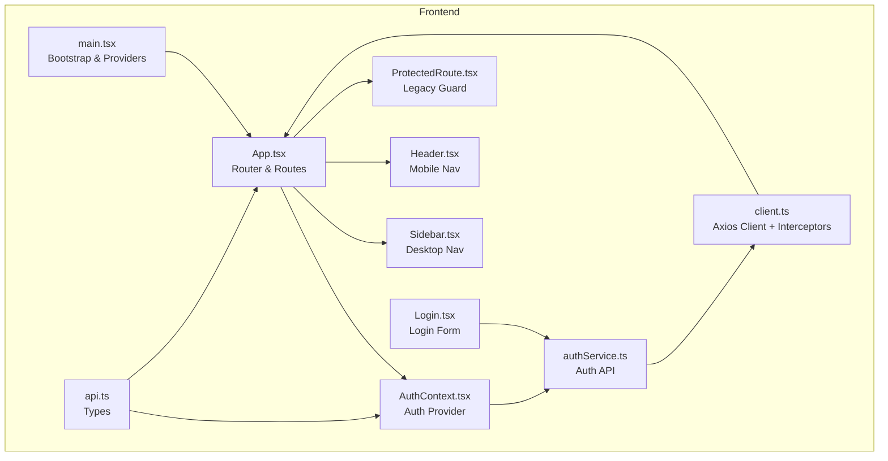
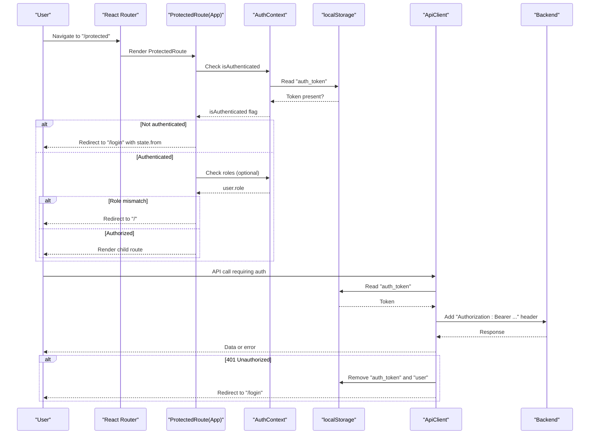
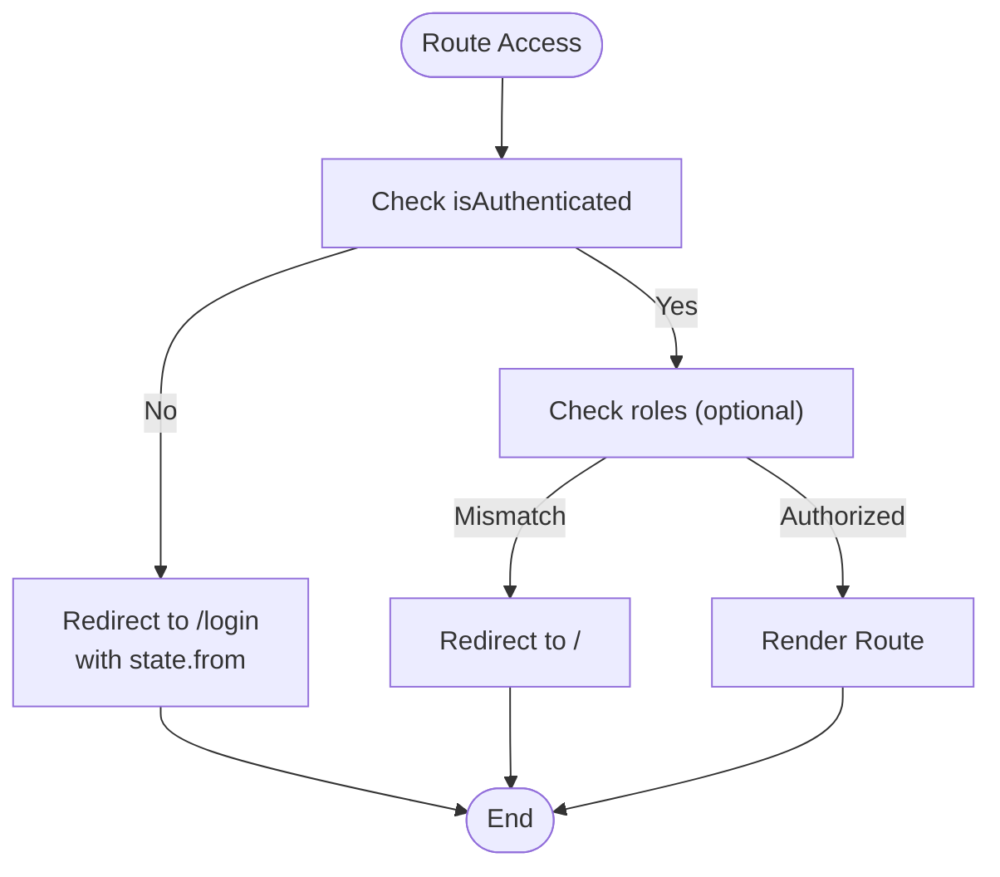
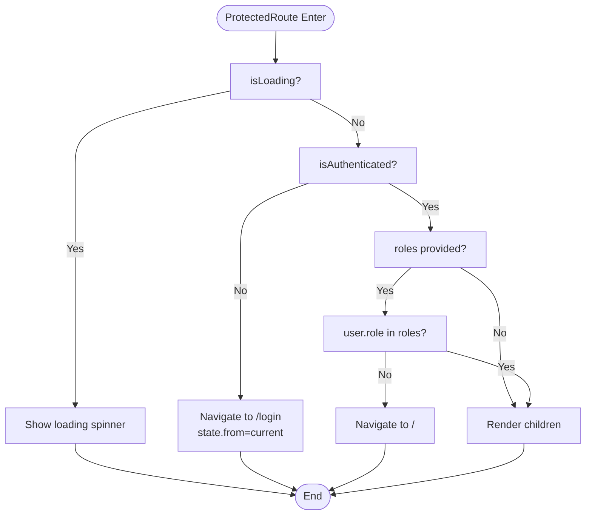
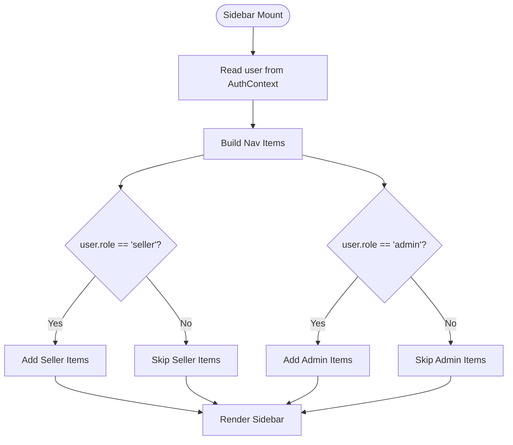
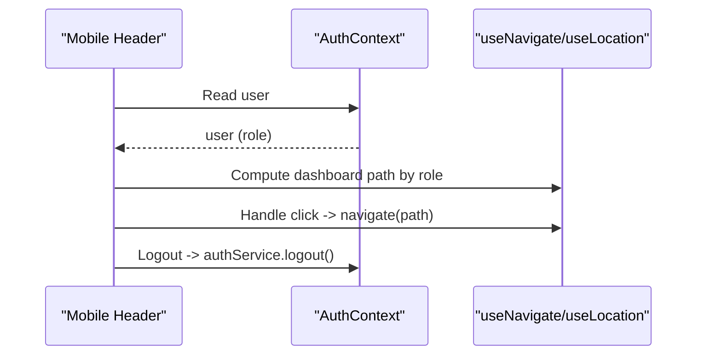
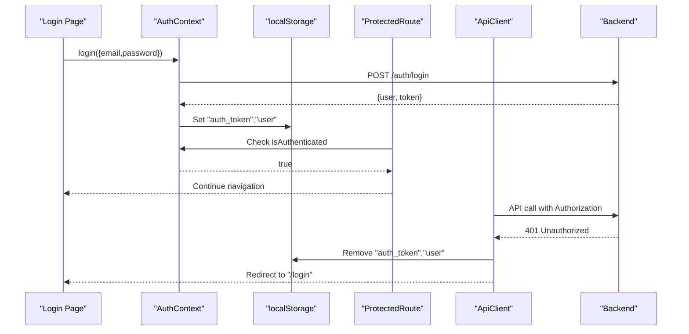
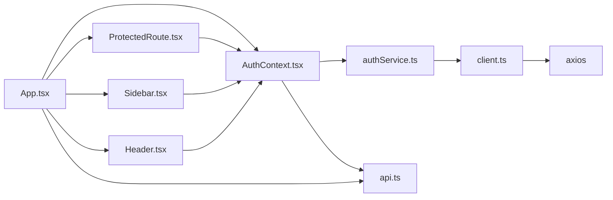

# Routing and Navigation

<cite>
**Referenced Files in This Document**
- [App.tsx](file://frontend/src/App.tsx)
- [ProtectedRoute.tsx](file://frontend/src/components/ProtectedRoute.tsx)
- [AuthContext.tsx](file://frontend/src/contexts/AuthContext.tsx)
- [Sidebar.tsx](file://frontend/src/components/layout/Sidebar.tsx)
- [Header.tsx](file://frontend/src/components/layout/Header.tsx)
- [Layout.tsx](file://frontend/src/components/layout/Layout.tsx)
- [Login.tsx](file://frontend/src/pages/Login.tsx)
- [authService.ts](file://frontend/src/api/services/authService.ts)
- [client.ts](file://frontend/src/api/client.ts)
- [api.ts](file://frontend/src/types/api.ts)
- [main.tsx](file://frontend/src/main.tsx)
</cite>

## Table of Contents
1. [Introduction](#introduction)
2. [Project Structure](#project-structure)
3. [Core Components](#core-components)
4. [Architecture Overview](#architecture-overview)
5. [Detailed Component Analysis](#detailed-component-analysis)
6. [Dependency Analysis](#dependency-analysis)
7. [Performance Considerations](#performance-considerations)
8. [Troubleshooting Guide](#troubleshooting-guide)
9. [Conclusion](#conclusion)

## Introduction
This document describes the QuantumMint Bookstore routing and navigation system. It covers route configuration for public pages, authenticated routes, and role-based protected routes. It explains the ProtectedRoute component implementation, authentication integration, sidebar navigation, mobile-responsive navigation patterns, and redirect handling. It also documents navigation state management and how the frontend integrates with authentication context during login and unauthorized access scenarios.

## Project Structure
The routing and navigation logic is primarily implemented in the frontend application under the src directory. Key areas include:
- Application shell and route definitions in App.tsx
- Authentication context provider and hooks in AuthContext.tsx
- Protected route guard with role validation in App.tsx
- Sidebar navigation with role-aware visibility in Sidebar.tsx
- Mobile header navigation in Header.tsx
- Login page and authentication service integration in Login.tsx and authService.ts
- API client and interceptors in client.ts
- Shared types in api.ts
- Application bootstrap in main.tsx



**Diagram sources**
- [main.tsx:1-17](file://frontend/src/main.tsx#L1-L17)
- [App.tsx:1-160](file://frontend/src/App.tsx#L1-L160)
- [AuthContext.tsx:1-82](file://frontend/src/contexts/AuthContext.tsx#L1-L82)
- [ProtectedRoute.tsx:1-20](file://frontend/src/components/ProtectedRoute.tsx#L1-L20)
- [Sidebar.tsx:1-101](file://frontend/src/components/layout/Sidebar.tsx#L1-L101)
- [Header.tsx:1-88](file://frontend/src/components/layout/Header.tsx#L1-L88)
- [Login.tsx:1-150](file://frontend/src/pages/Login.tsx#L1-L150)
- [authService.ts:1-57](file://frontend/src/api/services/authService.ts#L1-L57)
- [client.ts:1-119](file://frontend/src/api/client.ts#L1-L119)
- [api.ts:1-182](file://frontend/src/types/api.ts#L1-L182)

**Section sources**
- [main.tsx:1-17](file://frontend/src/main.tsx#L1-L17)
- [App.tsx:1-160](file://frontend/src/App.tsx#L1-L160)

## Core Components
- App routing and nested ProtectedRoute with role validation
- AuthContext for authentication state, login/register/logout, and loading state
- ProtectedRoute (legacy) component for basic auth checks
- Sidebar navigation with role-aware menu items
- Header with mobile-friendly navigation and dashboard redirection logic
- Login page and authentication service integration
- API client with request/response interceptors and token management
- Shared types for User and role definitions

**Section sources**
- [App.tsx:52-69](file://frontend/src/App.tsx#L52-L69)
- [AuthContext.tsx:1-82](file://frontend/src/contexts/AuthContext.tsx#L1-L82)
- [ProtectedRoute.tsx:1-20](file://frontend/src/components/ProtectedRoute.tsx#L1-L20)
- [Sidebar.tsx:1-101](file://frontend/src/components/layout/Sidebar.tsx#L1-L101)
- [Header.tsx:1-88](file://frontend/src/components/layout/Header.tsx#L1-L88)
- [Login.tsx:1-150](file://frontend/src/pages/Login.tsx#L1-L150)
- [authService.ts:1-57](file://frontend/src/api/services/authService.ts#L1-L57)
- [client.ts:1-119](file://frontend/src/api/client.ts#L1-L119)
- [api.ts:1-182](file://frontend/src/types/api.ts#L1-L182)

## Architecture Overview
The routing architecture combines React Router with a custom ProtectedRoute wrapper and an authentication context. The App component defines all routes, including public pages, authenticated-only pages, and role-based protected routes. Authentication state is managed by AuthContext, which persists user and token via localStorage. The API client injects Authorization headers and handles 401 responses by clearing auth and redirecting to login.



**Diagram sources**
- [App.tsx:52-69](file://frontend/src/App.tsx#L52-L69)
- [AuthContext.tsx:16-73](file://frontend/src/contexts/AuthContext.tsx#L16-L73)
- [authService.ts:40-56](file://frontend/src/api/services/authService.ts#L40-L56)
- [client.ts:22-46](file://frontend/src/api/client.ts#L22-L46)

## Detailed Component Analysis

### Route Configuration and Navigation
- Public routes: Home, Privacy Policy, Terms of Service, About Us, Contact, FAQ, Support, and registration/login.
- Authenticated routes: Library, Marketplace, Dashboard, Reading Analytics, Wallet, Referrals, Checkout, Settings, SRS Review, Maps Agent, Vision Agent, Reader, and Book Editor.
- Role-based protected routes:
  - Seller-only: Studio, Seller Portal, Onboarding, Registration, Seller Request.
  - Admin-only: Admin Dashboard and related management pages.
- Redirect handling:
  - Unauthenticated users attempting authenticated routes are redirected to "/login" with state indicating the original location.
  - Unauthorized role attempts are redirected to "/".
- Mobile navigation:
  - Fixed mobile header with quick links to Library, Maps, Wallet, and Logout.
  - Sidebar provides desktop navigation with role-aware sections.



**Diagram sources**
- [App.tsx:92-138](file://frontend/src/App.tsx#L92-L138)
- [App.tsx:52-69](file://frontend/src/App.tsx#L52-L69)

**Section sources**
- [App.tsx:92-138](file://frontend/src/App.tsx#L92-L138)

### ProtectedRoute Implementation
- Legacy ProtectedRoute component performs basic authentication checks and redirects unauthenticated users to "/signin".
- The App-level ProtectedRoute extends this with:
  - Loading state handling while checking auth.
  - Role validation against user.role.
  - Redirects to "/login" for unauthenticated and "/" for unauthorized roles.



**Diagram sources**
- [App.tsx:52-69](file://frontend/src/App.tsx#L52-L69)
- [ProtectedRoute.tsx:9-19](file://frontend/src/components/ProtectedRoute.tsx#L9-L19)

**Section sources**
- [ProtectedRoute.tsx:1-20](file://frontend/src/components/ProtectedRoute.tsx#L1-L20)
- [App.tsx:52-69](file://frontend/src/App.tsx#L52-L69)

### Authentication Context and Integration
- AuthProvider initializes user state from localStorage and exposes login, register, logout, and isLoading.
- useAuth hook provides authentication state and actions to components.
- authService persists tokens and user data in localStorage and clears them on logout.
- API client injects Authorization header and handles 401 by clearing auth and redirecting to "/login".

```mermaid
classDiagram
class AuthContext {
+boolean isAuthenticated
+User user
+boolean isLoading
+login(credentials) Promise~void~
+register(data) Promise~void~
+logout() Promise~void~
}
class AuthService {
+login(credentials) Promise~{user, token}~
+register(data) Promise~{user, token}~
+logout() Promise~void~
+getCurrentUser() User|null
+isAuthenticated() boolean
}
class ApiClient {
+get(url, config) Promise~any~
+post(url, data, config) Promise~any~
+put(url, data, config) Promise~any~
+delete(url, config) Promise~any~
}
AuthContext --> AuthService : "uses"
AuthService --> ApiClient : "calls"
```

**Diagram sources**
- [AuthContext.tsx:16-73](file://frontend/src/contexts/AuthContext.tsx#L16-L73)
- [authService.ts:4-56](file://frontend/src/api/services/authService.ts#L4-L56)
- [client.ts:10-87](file://frontend/src/api/client.ts#L10-L87)

**Section sources**
- [AuthContext.tsx:1-82](file://frontend/src/contexts/AuthContext.tsx#L1-L82)
- [authService.ts:1-57](file://frontend/src/api/services/authService.ts#L1-L57)
- [client.ts:1-119](file://frontend/src/api/client.ts#L1-L119)

### Sidebar Navigation Structure
- Desktop sidebar with collapsible width and sticky positioning.
- Role-aware sections:
  - Creator section visible to "seller" users.
  - Admin section visible to "admin" users.
- Active state styling via NavLink with isActive.
- Logout action triggers authService.logout and clears local state.



**Diagram sources**
- [Sidebar.tsx:10-78](file://frontend/src/components/layout/Sidebar.tsx#L10-L78)

**Section sources**
- [Sidebar.tsx:1-101](file://frontend/src/components/layout/Sidebar.tsx#L1-L101)

### Mobile-Responsive Navigation Patterns
- Mobile header bar with fixed position and quick-access icons for Library, Maps, Wallet, and Logout.
- Uses useNavigate/useLocation to compute active states and trigger navigation.
- Header adapts to logged-in vs anonymous state and computes dashboard path based on user role.



**Diagram sources**
- [Header.tsx:7-88](file://frontend/src/components/layout/Header.tsx#L7-L88)

**Section sources**
- [Header.tsx:1-88](file://frontend/src/components/layout/Header.tsx#L1-L88)

### Login Redirects and Unauthorized Access Handling
- Login page collects credentials and role selection, then calls useAuth.login.
- On successful login, tokens and user are persisted; on failure, error messages are displayed.
- ProtectedRoute redirects unauthenticated users to "/login" with state.from preserving the intended destination.
- Role mismatches redirect to "/".
- API 401 responses clear auth and redirect to "/login".



**Diagram sources**
- [Login.tsx:17-36](file://frontend/src/pages/Login.tsx#L17-L36)
- [AuthContext.tsx:28-39](file://frontend/src/contexts/AuthContext.tsx#L28-L39)
- [App.tsx:60-62](file://frontend/src/App.tsx#L60-L62)
- [client.ts:38-43](file://frontend/src/api/client.ts#L38-L43)

**Section sources**
- [Login.tsx:1-150](file://frontend/src/pages/Login.tsx#L1-L150)
- [App.tsx:60-62](file://frontend/src/App.tsx#L60-L62)
- [client.ts:38-43](file://frontend/src/api/client.ts#L38-L43)

### Breadcrumb Implementation
No breadcrumb component was identified in the frontend codebase. Navigation state management relies on React Router’s location and state for redirects, but there is no explicit breadcrumb rendering logic.

[No sources needed since this section doesn't analyze specific files]

## Dependency Analysis
- App.tsx depends on AuthContext for authentication state and on ProtectedRoute for route protection.
- AuthContext depends on authService for login/register/logout and on localStorage for persistence.
- authService depends on client.ts for HTTP requests.
- client.ts depends on axios and environment variables for service URLs.
- Sidebar/Header depend on AuthContext for user role and on react-router-dom for navigation.
- api.ts defines User role types used across components.



**Diagram sources**
- [App.tsx:1-160](file://frontend/src/App.tsx#L1-L160)
- [AuthContext.tsx:1-82](file://frontend/src/contexts/AuthContext.tsx#L1-L82)
- [ProtectedRoute.tsx:1-20](file://frontend/src/components/ProtectedRoute.tsx#L1-L20)
- [Sidebar.tsx:1-101](file://frontend/src/components/layout/Sidebar.tsx#L1-L101)
- [Header.tsx:1-88](file://frontend/src/components/layout/Header.tsx#L1-L88)
- [authService.ts:1-57](file://frontend/src/api/services/authService.ts#L1-L57)
- [client.ts:1-119](file://frontend/src/api/client.ts#L1-L119)
- [api.ts:1-182](file://frontend/src/types/api.ts#L1-L182)

**Section sources**
- [App.tsx:1-160](file://frontend/src/App.tsx#L1-L160)
- [AuthContext.tsx:1-82](file://frontend/src/contexts/AuthContext.tsx#L1-L82)
- [authService.ts:1-57](file://frontend/src/api/services/authService.ts#L1-L57)
- [client.ts:1-119](file://frontend/src/api/client.ts#L1-L119)
- [api.ts:1-182](file://frontend/src/types/api.ts#L1-L182)

## Performance Considerations
- Route lazy loading is implemented via React.lazy and Suspense, reducing initial bundle size.
- ProtectedRoute renders a minimal loading spinner while auth state resolves, preventing unnecessary re-renders.
- LocalStorage usage for tokens avoids repeated network calls until expiration.
- Consider adding route-level caching for frequently accessed pages and debouncing navigation transitions for smoother UX.

[No sources needed since this section provides general guidance]

## Troubleshooting Guide
Common issues and resolutions:
- Stuck on loading spinner in ProtectedRoute: Ensure AuthContext initialization completes and user is hydrated from localStorage.
- Redirect loops to "/login": Verify auth_token presence and validity; check API 401 handling clears tokens.
- Role-based access denied: Confirm user.role matches expected roles; verify ProtectedRoute roles prop.
- Mobile navigation not working: Ensure Header uses useNavigate and that user state is available.
- API errors: Check axios interceptors and error handling; confirm Authorization header injection.

**Section sources**
- [App.tsx:56-58](file://frontend/src/App.tsx#L56-L58)
- [client.ts:38-43](file://frontend/src/api/client.ts#L38-L43)
- [Header.tsx:8-12](file://frontend/src/components/layout/Header.tsx#L8-L12)

## Conclusion
The QuantumMint Bookstore frontend implements a clear separation between public, authenticated, and role-based protected routes. Authentication state is centralized in AuthContext, with localStorage-backed persistence and robust API client interceptors handling 401 responses. The App-level ProtectedRoute provides both authentication and role checks, while Sidebar and Header deliver responsive navigation tailored to user roles. The system is structured for maintainability and extensibility, with lazy-loaded routes and standardized error handling.