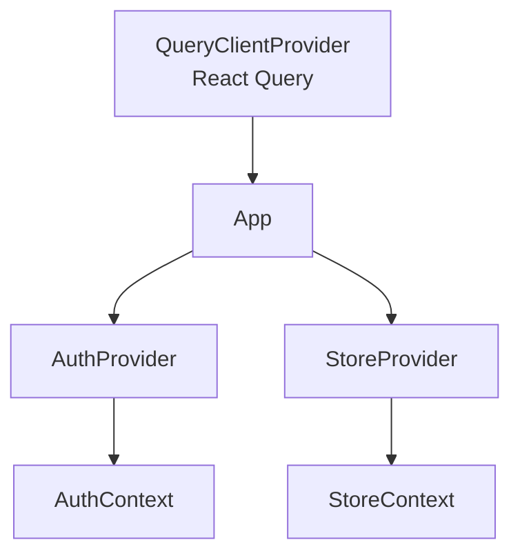
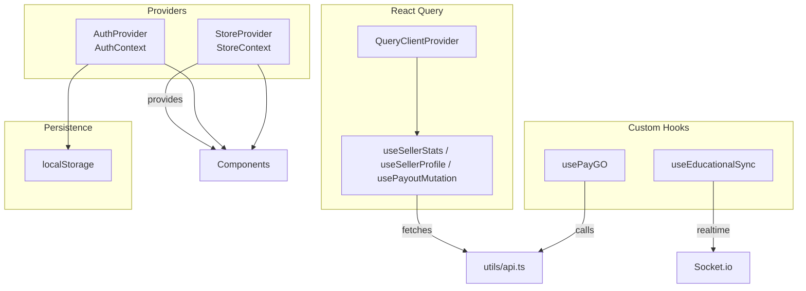
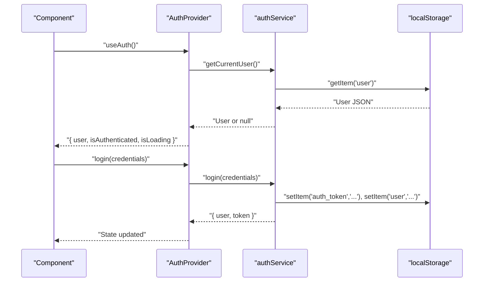
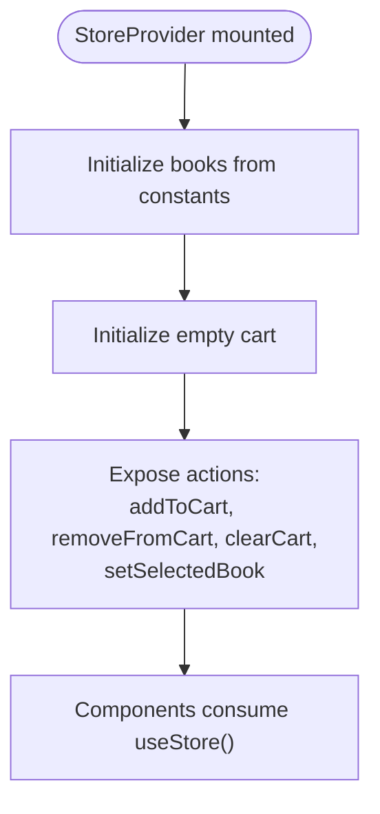
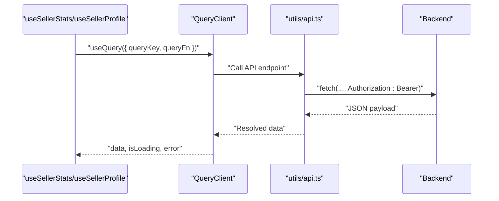
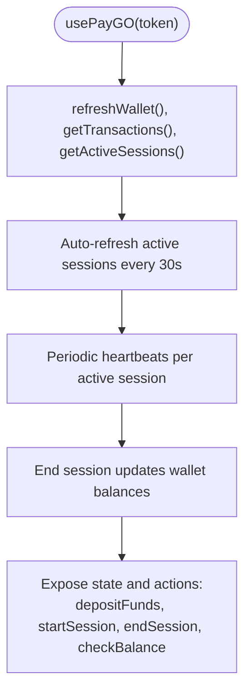
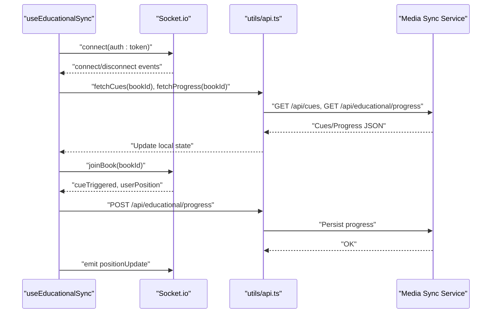
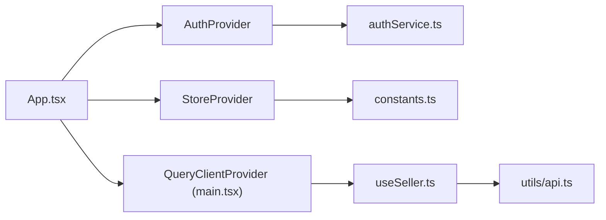

# State Management

<cite>
**Referenced Files in This Document**
- [AuthContext.tsx](file://frontend/src/contexts/AuthContext.tsx)
- [StoreContext.tsx](file://frontend/src/contexts/StoreContext.tsx)
- [App.tsx](file://frontend/src/App.tsx)
- [main.tsx](file://frontend/src/main.tsx)
- [authService.ts](file://frontend/src/api/services/authService.ts)
- [api.ts](file://frontend/src/utils/api.ts)
- [useSeller.ts](file://frontend/src/hooks/useSeller.ts)
- [usePayGO.ts](file://frontend/src/hooks/usePayGO.ts)
- [useEducationalSync.ts](file://frontend/src/hooks/useEducationalSync.ts)
- [constants.ts](file://frontend/src/constants.ts)
- [package.json](file://frontend/package.json)
</cite>

## Table of Contents
1. [Introduction](#introduction)
2. [Project Structure](#project-structure)
3. [Core Components](#core-components)
4. [Architecture Overview](#architecture-overview)
5. [Detailed Component Analysis](#detailed-component-analysis)
6. [Dependency Analysis](#dependency-analysis)
7. [Performance Considerations](#performance-considerations)
8. [Troubleshooting Guide](#troubleshooting-guide)
9. [Conclusion](#conclusion)

## Introduction
This document explains the state management architecture in the QuantumMint Bookstore frontend. It focuses on the context-based state management system, including AuthContext for authentication state and StoreContext for global application state. It also documents the custom hooks that integrate with React Query for data fetching and caching, local storage persistence, and cross-component state synchronization. Finally, it outlines best practices, performance optimizations, and debugging approaches for maintaining a robust and scalable frontend state layer.

## Project Structure
The frontend initializes React Query globally and wraps the application with two primary context providers:
- AuthProvider manages authentication state and exposes login, register, logout, and user info.
- StoreProvider manages global store state such as books, cart, and selected book.

**Diagram sources**
- [main.tsx:11-16](file://frontend/src/main.tsx#L11-L16)
- [App.tsx:145-156](file://frontend/src/App.tsx#L145-L156)

**Section sources**
- [main.tsx:11-16](file://frontend/src/main.tsx#L11-L16)
- [App.tsx:145-156](file://frontend/src/App.tsx#L145-L156)

## Core Components
- AuthContext: Provides authentication state and actions backed by a service that persists tokens and user data in local storage.
- StoreContext: Provides global store state (mock books, cart, selected book) with simple add/remove/clear operations.
- React Query: Centralized caching and data fetching via a typed API client and dedicated hooks.

Key responsibilities:
- AuthContext: Authentication lifecycle, persisted user/session state, and protected routing.
- StoreContext: Global shopping/cart state and selection state for books.
- React Query + API hooks: Server-side caching, invalidation, and optimistic updates.

**Section sources**
- [AuthContext.tsx:1-82](file://frontend/src/contexts/AuthContext.tsx#L1-L82)
- [StoreContext.tsx:1-56](file://frontend/src/contexts/StoreContext.tsx#L1-L56)
- [useSeller.ts:1-29](file://frontend/src/hooks/useSeller.ts#L1-L29)
- [api.ts:17-63](file://frontend/src/utils/api.ts#L17-L63)

## Architecture Overview
The state architecture combines React contexts with React Query for remote data and a small set of custom hooks for specialized integrations.

**Diagram sources**
- [main.tsx:11-16](file://frontend/src/main.tsx#L11-L16)
- [App.tsx:145-156](file://frontend/src/App.tsx#L145-L156)
- [useSeller.ts:1-29](file://frontend/src/hooks/useSeller.ts#L1-L29)
- [usePayGO.ts:98-315](file://frontend/src/hooks/usePayGO.ts#L98-L315)
- [useEducationalSync.ts:36-246](file://frontend/src/hooks/useEducationalSync.ts#L36-L246)
- [api.ts:17-63](file://frontend/src/utils/api.ts#L17-L63)

## Detailed Component Analysis

### AuthContext and Authentication Lifecycle
AuthContext encapsulates authentication state and actions. It reads persisted user data on startup and delegates login/register/logout to a service that stores tokens and user info in local storage.

**Diagram sources**
- [AuthContext.tsx:16-73](file://frontend/src/contexts/AuthContext.tsx#L16-L73)
- [authService.ts:8-48](file://frontend/src/api/services/authService.ts#L8-L48)

**Section sources**
- [AuthContext.tsx:16-73](file://frontend/src/contexts/AuthContext.tsx#L16-L73)
- [authService.ts:8-48](file://frontend/src/api/services/authService.ts#L8-L48)

### StoreContext and Global Store State
StoreContext provides:
- books: initial mock list
- cart: add/remove/clear operations
- selectedBook: setter for the current selection

**Diagram sources**
- [StoreContext.tsx:17-49](file://frontend/src/contexts/StoreContext.tsx#L17-L49)
- [constants.ts:67-185](file://frontend/src/constants.ts#L67-L185)

**Section sources**
- [StoreContext.tsx:17-49](file://frontend/src/contexts/StoreContext.tsx#L17-L49)
- [constants.ts:67-185](file://frontend/src/constants.ts#L67-L185)

### React Query Integration and Custom Hooks
React Query is initialized globally and used via custom hooks for seller-specific data. The centralized API client handles token injection and error reporting.

**Diagram sources**
- [main.tsx:11-16](file://frontend/src/main.tsx#L11-L16)
- [useSeller.ts:4-28](file://frontend/src/hooks/useSeller.ts#L4-L28)
- [api.ts:17-63](file://frontend/src/utils/api.ts#L17-L63)

**Section sources**
- [main.tsx:11-16](file://frontend/src/main.tsx#L11-L16)
- [useSeller.ts:4-28](file://frontend/src/hooks/useSeller.ts#L4-L28)
- [api.ts:17-63](file://frontend/src/utils/api.ts#L17-L63)

### PayGO Hook: Realistic Financial State Management
The PayGO hook orchestrates wallet, transactions, and active sessions with periodic heartbeats and automatic refreshes.

**Diagram sources**
- [usePayGO.ts:98-315](file://frontend/src/hooks/usePayGO.ts#L98-L315)

**Section sources**
- [usePayGO.ts:98-315](file://frontend/src/hooks/usePayGO.ts#L98-L315)

### Educational Sync Hook: Real-Time Collaboration State
The educational sync hook manages cues, progress, and socket-driven collaboration.

**Diagram sources**
- [useEducationalSync.ts:36-246](file://frontend/src/hooks/useEducationalSync.ts#L36-L246)
- [api.ts:17-63](file://frontend/src/utils/api.ts#L17-L63)

**Section sources**
- [useEducationalSync.ts:36-246](file://frontend/src/hooks/useEducationalSync.ts#L36-L246)
- [api.ts:17-63](file://frontend/src/utils/api.ts#L17-L63)

## Dependency Analysis
- Providers and contexts:
  - App.tsx composes AuthProvider and StoreProvider around the routing tree.
  - AuthContext depends on authService for persistence and network calls.
  - StoreContext depends on constants for mock data.
- React Query:
  - main.tsx initializes QueryClient globally.
  - useSeller.ts leverages @tanstack/react-query to cache seller stats and profile.
- Local storage:
  - authService persists tokens and user data; AuthContext reads on mount.
- External integrations:
  - usePayGO.ts integrates with PayGo API.
  - useEducationalSync.ts integrates with Socket.io and media sync endpoints.

**Diagram sources**
- [App.tsx:145-156](file://frontend/src/App.tsx#L145-L156)
- [main.tsx:11-16](file://frontend/src/main.tsx#L11-L16)
- [useSeller.ts:1-29](file://frontend/src/hooks/useSeller.ts#L1-L29)
- [authService.ts:1-57](file://frontend/src/api/services/authService.ts#L1-L57)
- [constants.ts:1-186](file://frontend/src/constants.ts#L1-L186)
- [api.ts:17-63](file://frontend/src/utils/api.ts#L17-L63)

**Section sources**
- [App.tsx:145-156](file://frontend/src/App.tsx#L145-L156)
- [main.tsx:11-16](file://frontend/src/main.tsx#L11-L16)
- [useSeller.ts:1-29](file://frontend/src/hooks/useSeller.ts#L1-L29)
- [authService.ts:1-57](file://frontend/src/api/services/authService.ts#L1-L57)
- [constants.ts:1-186](file://frontend/src/constants.ts#L1-L186)
- [api.ts:17-63](file://frontend/src/utils/api.ts#L17-L63)

## Performance Considerations
- Prefer React Query for caching and deduplication of server requests to reduce network overhead.
- Use staleTime and refetch intervals judiciously to balance freshness and performance (see useSeller.ts).
- Keep context state minimal and granular; avoid forcing re-renders by splitting contexts when appropriate.
- Debounce or throttle frequent updates (e.g., reading progress) to minimize API churn.
- Use lazy loading and code-split routes to reduce initial bundle size.
- Avoid unnecessary localStorage writes; batch updates where possible.
- For real-time features, implement heartbeat intervals with cleanup to prevent memory leaks.

[No sources needed since this section provides general guidance]

## Troubleshooting Guide
Common issues and remedies:
- Authentication state not persisting:
  - Verify localStorage keys and parsing in authService.
  - Ensure AuthProvider wraps the app and useAuth is used within provider boundaries.
- React Query not caching:
  - Confirm QueryClientProvider is present at the root.
  - Check queryKey uniqueness and queryFn correctness.
- Real-time sync not working:
  - Validate token propagation to socket connection.
  - Inspect socket events and ensure join/leave room logic is executed.
- PayGO session not updating:
  - Confirm token availability and base URL configuration.
  - Check intervals and error handling in heartbeat loops.

**Section sources**
- [authService.ts:40-55](file://frontend/src/api/services/authService.ts#L40-L55)
- [main.tsx:11-16](file://frontend/src/main.tsx#L11-L16)
- [usePayGO.ts:98-315](file://frontend/src/hooks/usePayGO.ts#L98-L315)
- [useEducationalSync.ts:36-246](file://frontend/src/hooks/useEducationalSync.ts#L36-L246)

## Conclusion
The QuantumMint Bookstore frontend employs a clean separation of concerns: AuthContext for authentication, StoreContext for global store state, and React Query for robust data fetching and caching. Custom hooks extend the system for PayGO financial flows and educational real-time collaboration. By leveraging localStorage for persistence, structured hooks for side effects, and React Query for caching, the architecture remains maintainable, performant, and extensible. Following the best practices and debugging tips outlined here will help sustain and evolve the state layer effectively.