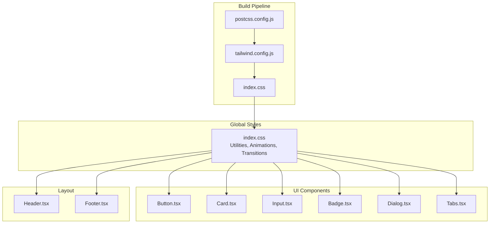
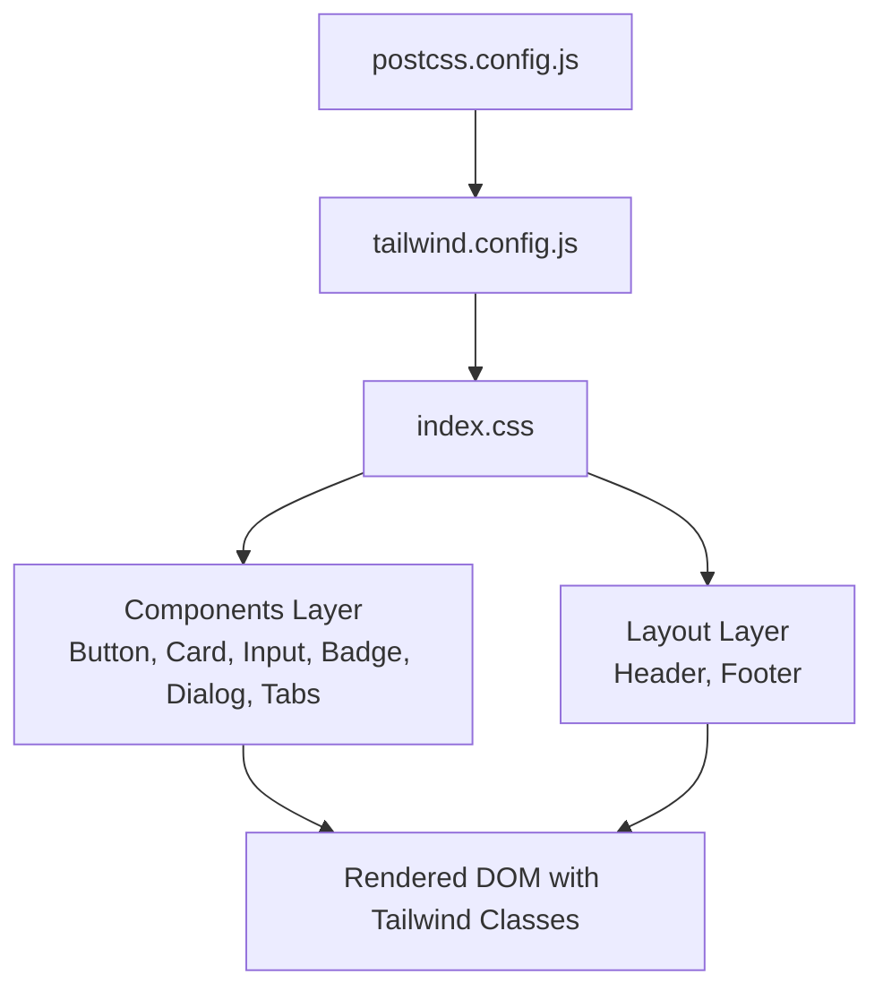
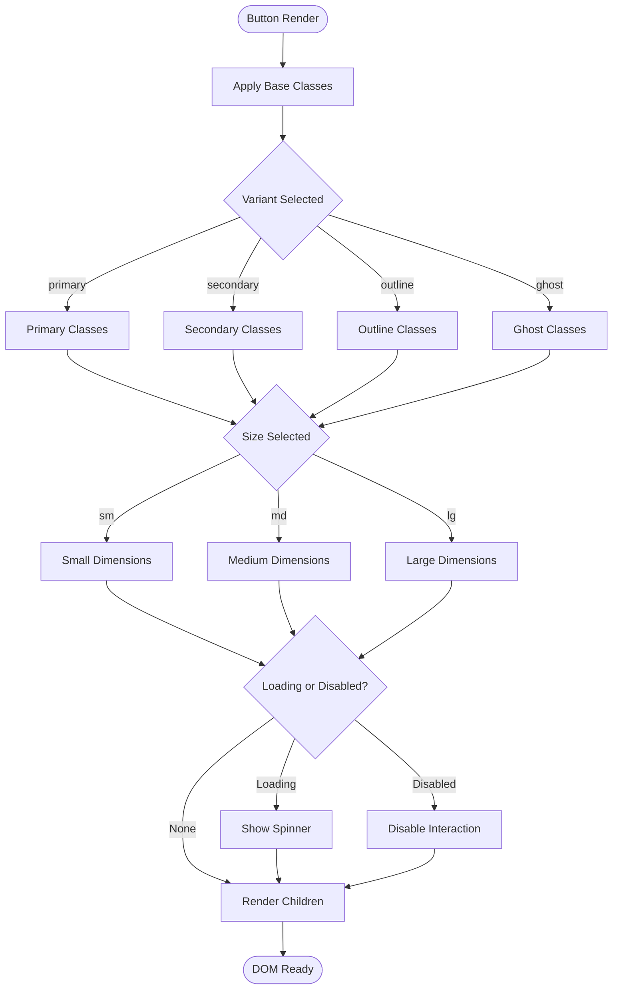
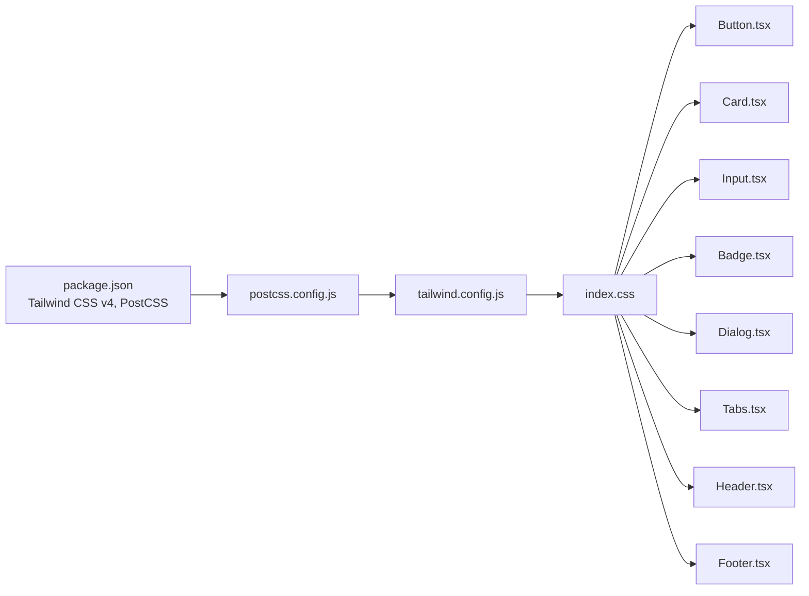

# Styling and Theming

<cite>
**Referenced Files in This Document**
- [tailwind.config.js](file://frontend/tailwind.config.js)
- [postcss.config.js](file://frontend/postcss.config.js)
- [index.css](file://frontend/src/index.css)
- [package.json](file://frontend/package.json)
- [Button.tsx](file://frontend/src/components/ui/Button.tsx)
- [Card.tsx](file://frontend/src/components/ui/Card.tsx)
- [Input.tsx](file://frontend/src/components/ui/Input.tsx)
- [Badge.tsx](file://frontend/src/components/ui/Badge.tsx)
- [Dialog.tsx](file://frontend/src/components/ui/Dialog.tsx)
- [Tabs.tsx](file://frontend/src/components/ui/Tabs.tsx)
- [Header.tsx](file://frontend/src/components/layout/Header.tsx)
- [Footer.tsx](file://frontend/src/components/layout/Footer.tsx)
</cite>

## Table of Contents
1. [Introduction](#introduction)
2. [Project Structure](#project-structure)
3. [Core Components](#core-components)
4. [Architecture Overview](#architecture-overview)
5. [Detailed Component Analysis](#detailed-component-analysis)
6. [Dependency Analysis](#dependency-analysis)
7. [Performance Considerations](#performance-considerations)
8. [Troubleshooting Guide](#troubleshooting-guide)
9. [Conclusion](#conclusion)
10. [Appendices](#appendices)

## Introduction
This document explains the styling and theming system of the QuantumMint Bookstore frontend. It covers Tailwind CSS configuration, custom utility classes, the design system implemented via reusable UI components, and the current dark/light mode support surface. It also documents the build pipeline with PostCSS, CSS optimization strategies, browser compatibility considerations, and practical guidelines for maintaining design consistency and extending the styling system.

## Project Structure
The styling system is organized around Tailwind CSS v4, PostCSS, and a set of reusable UI components. Key files:
- Tailwind configuration defines content scanning and theme extensions.
- PostCSS configuration integrates Tailwind directives.
- Global CSS defines base styles, animations, glassmorphism utilities, and smooth transitions.
- UI components encapsulate design tokens and patterns for buttons, cards, inputs, badges, dialogs, and tabs.
- Layout components apply global gradients and color schemes.

**Diagram sources**
- [postcss.config.js:1-6](file://frontend/postcss.config.js#L1-L6)
- [tailwind.config.js:1-12](file://frontend/tailwind.config.js#L1-L12)
- [index.css:1-88](file://frontend/src/index.css#L1-L88)
- [Button.tsx:1-54](file://frontend/src/components/ui/Button.tsx#L1-L54)
- [Card.tsx:1-31](file://frontend/src/components/ui/Card.tsx#L1-L31)
- [Input.tsx:1-17](file://frontend/src/components/ui/Input.tsx#L1-L17)
- [Badge.tsx:1-35](file://frontend/src/components/ui/Badge.tsx#L1-L35)
- [Dialog.tsx:1-44](file://frontend/src/components/ui/Dialog.tsx#L1-L44)
- [Tabs.tsx:1-60](file://frontend/src/components/ui/Tabs.tsx#L1-L60)
- [Header.tsx:1-88](file://frontend/src/components/layout/Header.tsx#L1-L88)
- [Footer.tsx:1-20](file://frontend/src/components/layout/Footer.tsx#L1-L20)

**Section sources**
- [postcss.config.js:1-6](file://frontend/postcss.config.js#L1-L6)
- [tailwind.config.js:1-12](file://frontend/tailwind.config.js#L1-L12)
- [index.css:1-88](file://frontend/src/index.css#L1-L88)

## Core Components
The design system centers on reusable UI primitives that apply consistent spacing, color, typography, and interaction patterns. These components are built with Tailwind utility classes and a small set of design tokens.

Key characteristics:
- Buttons: Variants (primary, secondary, outline, ghost) and sizes (sm, md, lg) with loading states and focus/ring behavior.
- Cards: Header/content/title slots with rounded corners, subtle shadows, and light borders.
- Inputs: Consistent height, padding, border, placeholder color, and focus ring behavior.
- Badges: Semantic variants (default, success, warning, destructive, outline, secondary) with transitions.
- Dialogs: Overlay backdrop, centered content, and header/title helpers.
- Tabs: Controlled/uncontrolled state with active/inactive visuals and keyboard-friendly focus.

**Section sources**
- [Button.tsx:1-54](file://frontend/src/components/ui/Button.tsx#L1-L54)
- [Card.tsx:1-31](file://frontend/src/components/ui/Card.tsx#L1-L31)
- [Input.tsx:1-17](file://frontend/src/components/ui/Input.tsx#L1-L17)
- [Badge.tsx:1-35](file://frontend/src/components/ui/Badge.tsx#L1-L35)
- [Dialog.tsx:1-44](file://frontend/src/components/ui/Dialog.tsx#L1-L44)
- [Tabs.tsx:1-60](file://frontend/src/components/ui/Tabs.tsx#L1-L60)

## Architecture Overview
The styling architecture follows a layered approach:
- Build layer: PostCSS compiles Tailwind directives and custom utilities.
- Base layer: Global CSS establishes animations, transitions, and cross-browser scrollbars.
- Component layer: Reusable UI components enforce design consistency.
- Layout layer: Header/Footer apply brand-specific color schemes and gradients.

**Diagram sources**
- [postcss.config.js:1-6](file://frontend/postcss.config.js#L1-L6)
- [tailwind.config.js:1-12](file://frontend/tailwind.config.js#L1-L12)
- [index.css:1-88](file://frontend/src/index.css#L1-L88)
- [Button.tsx:1-54](file://frontend/src/components/ui/Button.tsx#L1-L54)
- [Header.tsx:1-88](file://frontend/src/components/layout/Header.tsx#L1-L88)

## Detailed Component Analysis

### Tailwind CSS Configuration
- Content scanning includes HTML and TypeScript/TSX sources to purge unused styles.
- Theme extension is currently empty; custom design tokens can be introduced here.
- Plugins array is empty; future theme variants or utilities may be added via plugins.

**Section sources**
- [tailwind.config.js:1-12](file://frontend/tailwind.config.js#L1-L12)

### PostCSS Configuration
- Integrates Tailwind directives through the Tailwind PostCSS plugin.
- Ensures Tailwind’s base, components, and utilities layers are processed during build.

**Section sources**
- [postcss.config.js:1-6](file://frontend/postcss.config.js#L1-L6)

### Global Styles and Utilities
- Tailwind directives are included at the top to generate base, components, and utilities.
- Custom animations:
  - Blob animation with staggered delays for layered effects.
  - Fade-in animation for entrance transitions.
- Glassmorphism utilities for light/dark themed frosted panels.
- Custom scrollbar styles for WebKit browsers.
- Universal transitions for color, background-color, border-color, and related properties with a consistent timing function and duration.

**Section sources**
- [index.css:1-88](file://frontend/src/index.css#L1-L88)

### Button Component
- Implements a base style set with rounded corners, alignment, transitions, and focus ring behavior.
- Variant mapping defines primary, secondary, outline, and ghost styles using semantic color tokens.
- Size mapping controls height, horizontal padding, and text sizing.
- Loading state adds a spinner with consistent sizing and color inheritance.
- Disabled state reduces opacity and prevents interaction.

**Diagram sources**
- [Button.tsx:1-54](file://frontend/src/components/ui/Button.tsx#L1-L54)

**Section sources**
- [Button.tsx:1-54](file://frontend/src/components/ui/Button.tsx#L1-L54)

### Card Component
- Provides a lightweight container with rounded corners, subtle border, and white background.
- Offers header, content, and title subcomponents for structured layouts.
- Uses consistent padding and typography hierarchy.

**Section sources**
- [Card.tsx:1-31](file://frontend/src/components/ui/Card.tsx#L1-L31)

### Input Component
- Standardized height, padding, border, placeholder color, and focus ring behavior.
- Inherits disabled cursor and opacity states.

**Section sources**
- [Input.tsx:1-17](file://frontend/src/components/ui/Input.tsx#L1-L17)

### Badge Component
- Supports semantic variants with distinct background/text colors and hover states.
- Includes outline variant for low-emphasis labels.
- Focus ring and transition utilities applied consistently.

**Section sources**
- [Badge.tsx:1-35](file://frontend/src/components/ui/Badge.tsx#L1-L35)

### Dialog Component
- Overlay backdrop with blur and click-to-dismiss behavior.
- Centered content grid with max-width and responsive padding.
- Header/title helpers for consistent modal structure.
- Trigger helper clones child props to integrate with parent controls.

**Section sources**
- [Dialog.tsx:1-44](file://frontend/src/components/ui/Dialog.tsx#L1-L44)

### Tabs Component
- Context-based state management for controlled/uncontrolled usage.
- Active/inactive visuals with focus-visible rings and transitions.
- Keyboard-friendly interaction and disabled state handling.

**Section sources**
- [Tabs.tsx:1-60](file://frontend/src/components/ui/Tabs.tsx#L1-L60)

### Header Component
- Sticky gradient header using brand colors.
- Navigation items with active state highlighting and hover effects.
- Conditional sign-in/sign-out actions with backdrop blur and brand accents.

**Section sources**
- [Header.tsx:1-88](file://frontend/src/components/layout/Header.tsx#L1-L88)

### Footer Component
- Dark-themed footer with centered links and copyright text.
- Hover effects on navigation links for accessibility.

**Section sources**
- [Footer.tsx:1-20](file://frontend/src/components/layout/Footer.tsx#L1-L20)

## Dependency Analysis
The styling stack relies on Tailwind CSS v4 and PostCSS. The build pipeline integrates Tailwind directives and custom utilities. UI components depend on Tailwind utilities for consistent styling.

**Diagram sources**
- [package.json:1-47](file://frontend/package.json#L1-L47)
- [postcss.config.js:1-6](file://frontend/postcss.config.js#L1-L6)
- [tailwind.config.js:1-12](file://frontend/tailwind.config.js#L1-L12)
- [index.css:1-88](file://frontend/src/index.css#L1-L88)
- [Button.tsx:1-54](file://frontend/src/components/ui/Button.tsx#L1-L54)
- [Card.tsx:1-31](file://frontend/src/components/ui/Card.tsx#L1-L31)
- [Input.tsx:1-17](file://frontend/src/components/ui/Input.tsx#L1-L17)
- [Badge.tsx:1-35](file://frontend/src/components/ui/Badge.tsx#L1-L35)
- [Dialog.tsx:1-44](file://frontend/src/components/ui/Dialog.tsx#L1-L44)
- [Tabs.tsx:1-60](file://frontend/src/components/ui/Tabs.tsx#L1-L60)
- [Header.tsx:1-88](file://frontend/src/components/layout/Header.tsx#L1-L88)
- [Footer.tsx:1-20](file://frontend/src/components/layout/Footer.tsx#L1-L20)

**Section sources**
- [package.json:1-47](file://frontend/package.json#L1-L47)
- [postcss.config.js:1-6](file://frontend/postcss.config.js#L1-L6)
- [tailwind.config.js:1-12](file://frontend/tailwind.config.js#L1-L12)
- [index.css:1-88](file://frontend/src/index.css#L1-L88)

## Performance Considerations
- Purge unused CSS: Tailwind’s content scanning ensures only used utilities are shipped.
- Minimize custom animations: Prefer built-in transitions and limit complex keyframe animations to essential components.
- Scoped utilities: Keep custom utilities focused and avoid excessive duplication.
- Browser compatibility: The global CSS targets WebKit scrollbars; consider fallbacks for non-WebKit engines if broader compatibility is required.
- Build-time optimization: Tailwind CSS v4 and PostCSS streamline compilation; ensure production builds leverage minification and caching.

[No sources needed since this section provides general guidance]

## Troubleshooting Guide
Common issues and resolutions:
- Missing utilities after updates: Verify Tailwind content paths and re-run the build.
- Conflicts with third-party libraries: Isolate styles using component-scoped classes and avoid global resets.
- Animation performance: Reduce keyframe complexity and prefer transform/opacity for GPU acceleration.
- Scrollbar styling not applying: Confirm WebKit engine and check for conflicting overrides.

**Section sources**
- [tailwind.config.js:1-12](file://frontend/tailwind.config.js#L1-L12)
- [index.css:64-87](file://frontend/src/index.css#L64-L87)

## Conclusion
The QuantumMint Bookstore frontend employs a clean, maintainable styling architecture built on Tailwind CSS v4 and PostCSS. The design system is enforced through reusable UI components and global utilities, ensuring consistency across the application. While dark/light mode is not explicitly configured in the current codebase, the modular structure supports easy extension for theme variants and dynamic color modes.

[No sources needed since this section summarizes without analyzing specific files]

## Appendices

### Design Tokens and Color Palette
- Brand colors: Used in the header gradient and button variants.
- Semantic colors: Applied across badges and inputs for feedback and emphasis.
- Neutral palette: Backgrounds, borders, and text tones for readability.

**Section sources**
- [Header.tsx:31-31](file://frontend/src/components/layout/Header.tsx#L31-L31)
- [Button.tsx:21-26](file://frontend/src/components/ui/Button.tsx#L21-L26)
- [Badge.tsx:17-24](file://frontend/src/components/ui/Badge.tsx#L17-L24)
- [Input.tsx:9-9](file://frontend/src/components/ui/Input.tsx#L9-L9)

### Typography System
- Consistent font weights and sizes across components.
- Heading hierarchy maintained via semantic elements and Tailwind text utilities.

**Section sources**
- [Card.tsx:26-28](file://frontend/src/components/ui/Card.tsx#L26-L28)
- [Tabs.tsx:39-46](file://frontend/src/components/ui/Tabs.tsx#L39-L46)

### Spacing Scale
- Uniform padding and margin utilities applied via component classes.
- Consistent vertical rhythm across cards and form elements.

**Section sources**
- [Card.tsx:18-24](file://frontend/src/components/ui/Card.tsx#L18-L24)
- [Button.tsx:28-33](file://frontend/src/components/ui/Button.tsx#L28-L33)

### Responsive Breakpoints
- Tailwind’s default breakpoint classes are used for responsive layouts.
- Components adapt using standard responsive modifiers.

**Section sources**
- [Header.tsx:32-32](file://frontend/src/components/layout/Header.tsx#L32-L32)

### Dark/Light Mode Implementation
- Not present in the current codebase.
- Recommended approach: Introduce a theme context/provider and toggle a root class. Extend Tailwind’s theme to define dark-mode color scales and map them to utilities.

[No sources needed since this section provides general guidance]

### CSS-in-JS and Styled Components
- No CSS-in-JS or styled-components detected in the frontend codebase.
- Current approach relies on Tailwind utilities and global CSS.

**Section sources**
- [index.css:1-88](file://frontend/src/index.css#L1-L88)
- [Button.tsx:1-54](file://frontend/src/components/ui/Button.tsx#L1-L54)

### Animation Systems
- Custom keyframes for blob and fade-in effects.
- Utility classes apply animations with optional delays.

**Section sources**
- [index.css:7-24](file://frontend/src/index.css#L7-L24)
- [index.css:35-48](file://frontend/src/index.css#L35-L48)

### Build Process and Optimization
- PostCSS compiles Tailwind directives and custom utilities.
- Tailwind purges unused styles based on content globs.
- Production builds optimize assets and cache bundles.

**Section sources**
- [postcss.config.js:1-6](file://frontend/postcss.config.js#L1-L6)
- [tailwind.config.js:3-6](file://frontend/tailwind.config.js#L3-L6)
- [package.json:35-45](file://frontend/package.json#L35-L45)

### Browser Compatibility
- WebKit-specific scrollbar styles are used; consider vendor prefixes or feature detection for broader compatibility.

**Section sources**
- [index.css:65-80](file://frontend/src/index.css#L65-L80)

### Guidelines for Maintaining Design Consistency
- Centralize design tokens in Tailwind theme extensions and global CSS variables.
- Enforce component APIs with strict prop types and default variants.
- Use consistent spacing and typography utilities across components.
- Document component variants and states in comments and READMEs.

[No sources needed since this section provides general guidance]