# Base UI Components

<cite>
**Referenced Files in This Document**
- [Button.tsx](file://frontend/src/components/ui/Button.tsx)
- [Input.tsx](file://frontend/src/components/ui/Input.tsx)
- [Textarea.tsx](file://frontend/src/components/ui/Textarea.tsx)
- [Card.tsx](file://frontend/src/components/ui/Card.tsx)
- [Badge.tsx](file://frontend/src/components/ui/Badge.tsx)
- [Tabs.tsx](file://frontend/src/components/ui/Tabs.tsx)
- [Dialog.tsx](file://frontend/src/components/ui/Dialog.tsx)
- [StarRating.tsx](file://frontend/src/components/ui/StarRating.tsx)
- [Formula.tsx](file://frontend/src/components/ui/Formula.tsx)
- [tailwind.config.js](file://frontend/tailwind.config.js)
- [index.css](file://frontend/src/index.css)
</cite>

## Table of Contents
1. [Introduction](#introduction)
2. [Project Structure](#project-structure)
3. [Core Components](#core-components)
4. [Architecture Overview](#architecture-overview)
5. [Detailed Component Analysis](#detailed-component-analysis)
6. [Dependency Analysis](#dependency-analysis)
7. [Performance Considerations](#performance-considerations)
8. [Troubleshooting Guide](#troubleshooting-guide)
9. [Conclusion](#conclusion)
10. [Appendices](#appendices)

## Introduction
This document describes the base UI components library used across the frontend. It covers the fundamental components: Button, Input, Textarea, Card, Badge, Tabs, Dialog, StarRating, and Formula. For each component, we detail the props interface, defaults, event handlers, styling customization, role in the design system, accessibility features, responsive behavior, and composition patterns. We also explain how components integrate with Tailwind CSS and how styles are inherited.

## Project Structure
The base UI components live under frontend/src/components/ui and are styled with Tailwind CSS. Global styles and animations are defined in frontend/src/index.css, and Tailwind’s configuration is in frontend/tailwind.config.js.

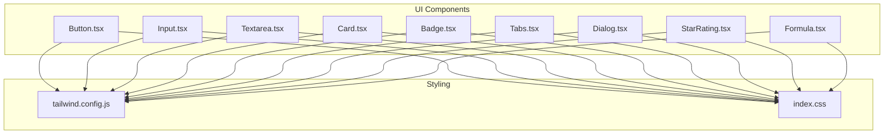

**Diagram sources**
- [Button.tsx:1-54](file://frontend/src/components/ui/Button.tsx#L1-L54)
- [Input.tsx:1-17](file://frontend/src/components/ui/Input.tsx#L1-L17)
- [Textarea.tsx:1-17](file://frontend/src/components/ui/Textarea.tsx#L1-L17)
- [Card.tsx:1-31](file://frontend/src/components/ui/Card.tsx#L1-L31)
- [Badge.tsx:1-35](file://frontend/src/components/ui/Badge.tsx#L1-L35)
- [Tabs.tsx:1-60](file://frontend/src/components/ui/Tabs.tsx#L1-L60)
- [Dialog.tsx:1-44](file://frontend/src/components/ui/Dialog.tsx#L1-L44)
- [StarRating.tsx:1-79](file://frontend/src/components/ui/StarRating.tsx#L1-L79)
- [Formula.tsx:1-116](file://frontend/src/components/ui/Formula.tsx#L1-L116)
- [tailwind.config.js:1-12](file://frontend/tailwind.config.js#L1-L12)
- [index.css:1-88](file://frontend/src/index.css#L1-L88)

**Section sources**
- [tailwind.config.js:1-12](file://frontend/tailwind.config.js#L1-L12)
- [index.css:1-88](file://frontend/src/index.css#L1-L88)

## Core Components
This section summarizes each component’s purpose, props, defaults, events, and styling hooks. See Detailed Component Analysis for implementation specifics.

- Button
  - Purpose: Primary, secondary, outline, and ghost actions with loading state.
  - Props: variant, size, isLoading, plus native button attributes.
  - Defaults: variant='primary', size='md', isLoading=false.
  - Events: Inherits onClick and other button handlers.
  - Accessibility: Focus ring classes; disabled state handled.
  - Responsive: Size classes adjust height/padding; responsive utilities can be layered.

- Input
  - Purpose: Single-line text input with focus ring and placeholder styling.
  - Props: native input attributes.
  - Defaults: None; inherits browser defaults.
  - Events: onChange, onBlur, onKeyDown, etc.
  - Accessibility: Focus ring; disabled cursor handled.

- Textarea
  - Purpose: Multi-line text area with minimum height and focus ring.
  - Props: native textarea attributes.
  - Defaults: None; inherits browser defaults.
  - Events: onChange, onBlur, etc.
  - Accessibility: Focus ring; disabled cursor handled.

- Card
  - Purpose: Container with header/content/title subcomponents.
  - Props: Card accepts HTML attributes; subcomponents accept HTML attributes.
  - Defaults: None; styling via Tailwind classes.
  - Events: None; intended as passive container.
  - Composition: CardHeader/CardContent/CardTitle compose a card.

- Badge
  - Purpose: Status or tag labels with multiple variants.
  - Props: variant, className, children.
  - Defaults: variant='default'.
  - Events: None; presentational.
  - Variants: default, secondary, success, warning, destructive, outline.

- Tabs
  - Purpose: Tabbed interface with controlled/uncontrolled modes.
  - Props: Tabs (value/onValueChange/defaultValue), TabsList, TabsTrigger (value), TabsContent (value).
  - Defaults: Uncontrolled mode uses defaultValue.
  - Events: onValueChange callback.
  - Accessibility: Uses buttons with focus-visible rings; requires proper nesting.

- Dialog
  - Purpose: Modal overlay with backdrop and centered content.
  - Props: Dialog (open/onOpenChange), DialogContent, DialogHeader, DialogTitle, DialogTrigger.
  - Defaults: None; open=false hides content.
  - Events: onOpenChange toggles visibility; click-outside closes.
  - Accessibility: Backdrop click-to-close; nested focusable elements should be managed.

- StarRating
  - Purpose: Five-star rating display with optional interactivity.
  - Props: rating, onRatingChange, readOnly, size, showLabel, interactive (backward compatibility).
  - Defaults: readOnly=false, size='md', showLabel=false, interactive=false.
  - Events: onClick and hover handlers; disabled when not interactive.
  - Accessibility: aria-label per star; keyboard accessible via button.

- Formula
  - Purpose: Renders LaTeX via KaTeX with optional interactive token breakdown.
  - Props: latex, className, block, interactive.
  - Defaults: block=false, interactive=true.
  - Events: Logs interactions via API; token selection triggers popover.
  - Styling: Uses KaTeX-rendered HTML; popover uses Tailwind utilities.

**Section sources**
- [Button.tsx:3-7](file://frontend/src/components/ui/Button.tsx#L3-L7)
- [Button.tsx:9-51](file://frontend/src/components/ui/Button.tsx#L9-L51)
- [Input.tsx:4-6](file://frontend/src/components/ui/Input.tsx#L4-L6)
- [Input.tsx:6-13](file://frontend/src/components/ui/Input.tsx#L6-L13)
- [Textarea.tsx:4-6](file://frontend/src/components/ui/Textarea.tsx#L4-L6)
- [Textarea.tsx:6-13](file://frontend/src/components/ui/Textarea.tsx#L6-L13)
- [Card.tsx:3-5](file://frontend/src/components/ui/Card.tsx#L3-L5)
- [Card.tsx:7-16](file://frontend/src/components/ui/Card.tsx#L7-L16)
- [Badge.tsx:4-8](file://frontend/src/components/ui/Badge.tsx#L4-L8)
- [Badge.tsx:10-31](file://frontend/src/components/ui/Badge.tsx#L10-L31)
- [Tabs.tsx:4-7](file://frontend/src/components/ui/Tabs.tsx#L4-L7)
- [Tabs.tsx:11-25](file://frontend/src/components/ui/Tabs.tsx#L11-L25)
- [Tabs.tsx:27-47](file://frontend/src/components/ui/Tabs.tsx#L27-L47)
- [Tabs.tsx:49-56](file://frontend/src/components/ui/Tabs.tsx#L49-L56)
- [Dialog.tsx:4-8](file://frontend/src/components/ui/Dialog.tsx#L4-L8)
- [Dialog.tsx:10-18](file://frontend/src/components/ui/Dialog.tsx#L10-L18)
- [Dialog.tsx:20-24](file://frontend/src/components/ui/Dialog.tsx#L20-L24)
- [Dialog.tsx:26-32](file://frontend/src/components/ui/Dialog.tsx#L26-L32)
- [Dialog.tsx:34-40](file://frontend/src/components/ui/Dialog.tsx#L34-L40)
- [StarRating.tsx:5-13](file://frontend/src/components/ui/StarRating.tsx#L5-L13)
- [StarRating.tsx:15-75](file://frontend/src/components/ui/StarRating.tsx#L15-L75)
- [Formula.tsx:10-15](file://frontend/src/components/ui/Formula.tsx#L10-L15)
- [Formula.tsx:17-113](file://frontend/src/components/ui/Formula.tsx#L17-L113)

## Architecture Overview
The components share a consistent pattern:
- Props extend native element attributes where appropriate.
- Base styles are composed via Tailwind utility classes.
- Variants and sizes are mapped to class dictionaries.
- Composition helpers (e.g., Card subcomponents, Tabs provider) encapsulate structure and state.

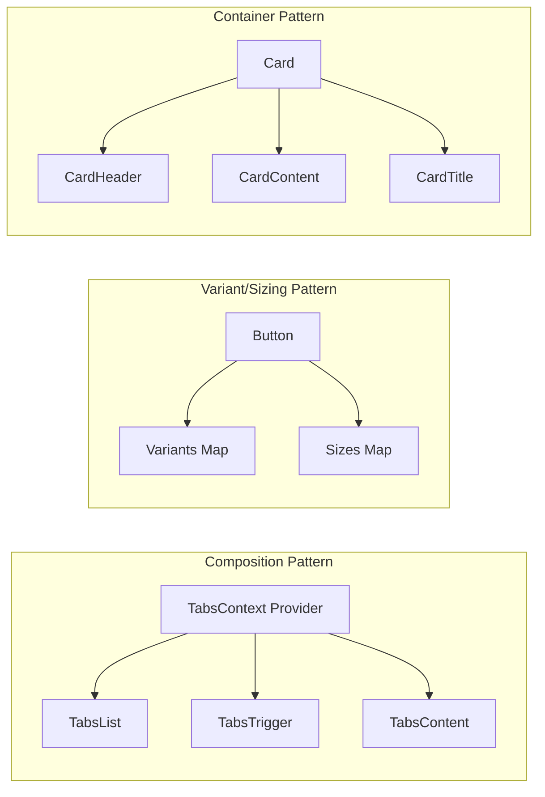

**Diagram sources**
- [Tabs.tsx:11-25](file://frontend/src/components/ui/Tabs.tsx#L11-L25)
- [Tabs.tsx:27-47](file://frontend/src/components/ui/Tabs.tsx#L27-L47)
- [Tabs.tsx:49-56](file://frontend/src/components/ui/Tabs.tsx#L49-L56)
- [Button.tsx:19-33](file://frontend/src/components/ui/Button.tsx#L19-L33)
- [Card.tsx:7-16](file://frontend/src/components/ui/Card.tsx#L7-L16)
- [Card.tsx:18-28](file://frontend/src/components/ui/Card.tsx#L18-L28)

## Detailed Component Analysis

### Button
- Props
  - variant: 'primary' | 'secondary' | 'outline' | 'ghost'
  - size: 'sm' | 'md' | 'lg'
  - isLoading: boolean
  - Inherits button attributes (onClick, disabled, etc.)
- Defaults
  - variant='primary', size='md', isLoading=false
- Events
  - Disabled when isLoading is true; otherwise honors native button events
- Styling
  - Base: inline-flex, rounded-lg, focus ring, transitions, disabled opacity
  - Variants: color and ring classes per variant
  - Sizes: height, padding, text size per size
- Accessibility
  - Focus ring classes applied; disabled state respected
- Responsive
  - Size classes adapt height/padding; additional responsive utilities can be appended via className

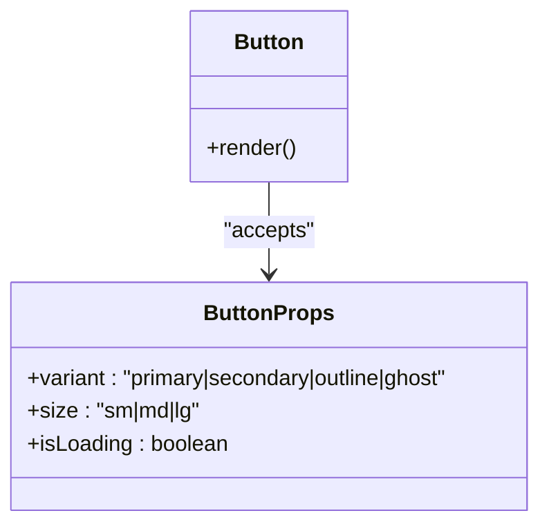

**Diagram sources**
- [Button.tsx:3-7](file://frontend/src/components/ui/Button.tsx#L3-L7)
- [Button.tsx:9-51](file://frontend/src/components/ui/Button.tsx#L9-L51)

**Section sources**
- [Button.tsx:3-7](file://frontend/src/components/ui/Button.tsx#L3-L7)
- [Button.tsx:9-51](file://frontend/src/components/ui/Button.tsx#L9-L51)

### Input
- Props
  - Extends input HTML attributes
- Defaults
  - Inherits browser defaults
- Events
  - onChange, onBlur, onKeyDown, etc.
- Styling
  - Rounded border, white background, focus ring, disabled cursor/opacity
- Accessibility
  - Focus ring; disabled state handled

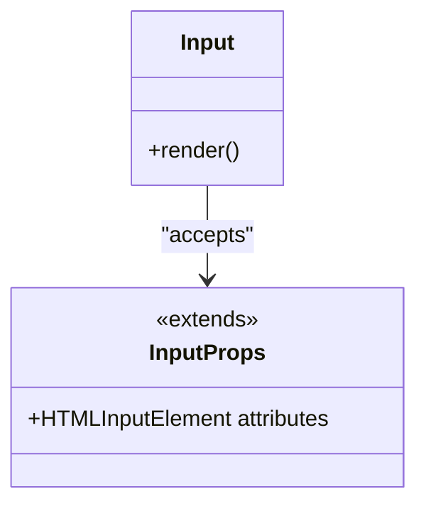

**Diagram sources**
- [Input.tsx:4-6](file://frontend/src/components/ui/Input.tsx#L4-L6)
- [Input.tsx:6-13](file://frontend/src/components/ui/Input.tsx#L6-L13)

**Section sources**
- [Input.tsx:4-6](file://frontend/src/components/ui/Input.tsx#L4-L6)
- [Input.tsx:6-13](file://frontend/src/components/ui/Input.tsx#L6-L13)

### Textarea
- Props
  - Extends textarea HTML attributes
- Defaults
  - Inherits browser defaults
- Events
  - onChange, onBlur, etc.
- Styling
  - Minimum height, rounded border, white background, focus ring, disabled cursor/opacity

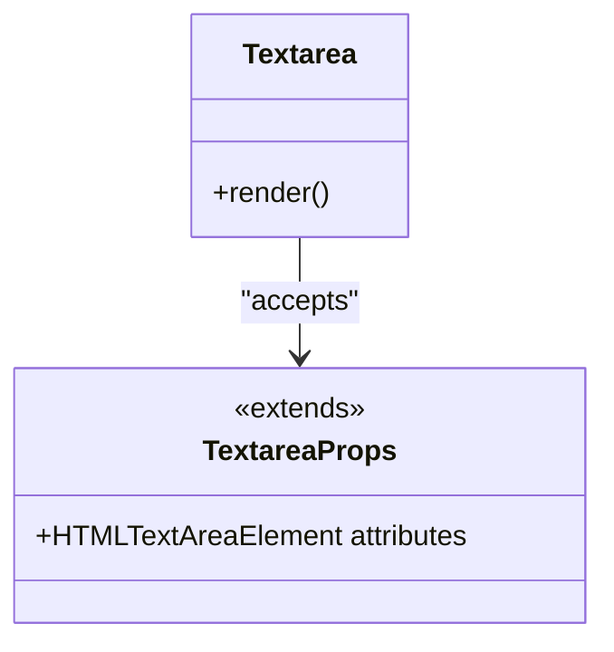

**Diagram sources**
- [Textarea.tsx:4-6](file://frontend/src/components/ui/Textarea.tsx#L4-L6)
- [Textarea.tsx:6-13](file://frontend/src/components/ui/Textarea.tsx#L6-L13)

**Section sources**
- [Textarea.tsx:4-6](file://frontend/src/components/ui/Textarea.tsx#L4-L6)
- [Textarea.tsx:6-13](file://frontend/src/components/ui/Textarea.tsx#L6-L13)

### Card
- Props
  - Card: HTML div attributes
  - CardHeader: HTML div attributes
  - CardContent: HTML div attributes
  - CardTitle: HTML heading attributes
- Defaults
  - None; styling via Tailwind classes
- Composition
  - CardHeader/CardContent/CardTitle are subcomponents that wrap content and apply paddings and typography

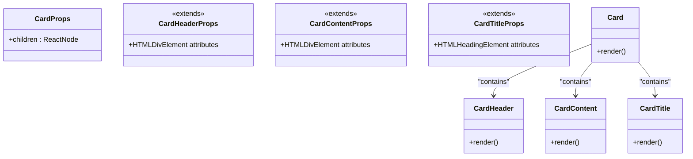

**Diagram sources**
- [Card.tsx:3-5](file://frontend/src/components/ui/Card.tsx#L3-L5)
- [Card.tsx:7-16](file://frontend/src/components/ui/Card.tsx#L7-L16)
- [Card.tsx:18-28](file://frontend/src/components/ui/Card.tsx#L18-L28)

**Section sources**
- [Card.tsx:3-5](file://frontend/src/components/ui/Card.tsx#L3-L5)
- [Card.tsx:7-16](file://frontend/src/components/ui/Card.tsx#L7-L16)
- [Card.tsx:18-28](file://frontend/src/components/ui/Card.tsx#L18-L28)

### Badge
- Props
  - variant: 'default' | 'success' | 'warning' | 'destructive' | 'outline' | 'secondary'
  - className: string
  - children: ReactNode
- Defaults
  - variant='default'
- Styling
  - Base rounded-full label classes; variant-specific background/text/border combinations

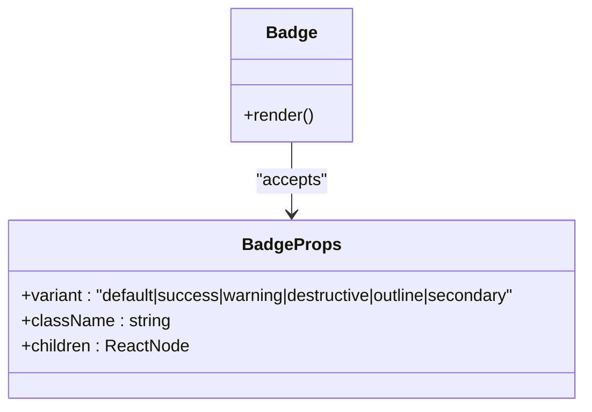

**Diagram sources**
- [Badge.tsx:4-8](file://frontend/src/components/ui/Badge.tsx#L4-L8)
- [Badge.tsx:10-31](file://frontend/src/components/ui/Badge.tsx#L10-L31)

**Section sources**
- [Badge.tsx:4-8](file://frontend/src/components/ui/Badge.tsx#L4-L8)
- [Badge.tsx:10-31](file://frontend/src/components/ui/Badge.tsx#L10-L31)

### Tabs
- Props
  - Tabs: value, onValueChange, defaultValue, children, className
  - TabsList: children, className
  - TabsTrigger: value, children, className
  - TabsContent: value, children, className
- Defaults
  - Uncontrolled mode uses defaultValue
- Behavior
  - Context-managed active value; trigger updates context; content renders only when value matches

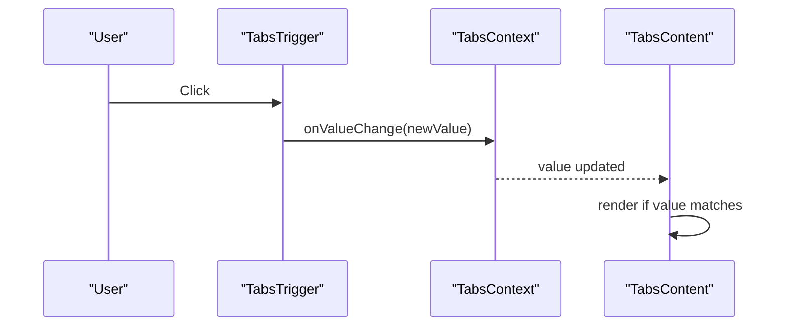

**Diagram sources**
- [Tabs.tsx:11-25](file://frontend/src/components/ui/Tabs.tsx#L11-L25)
- [Tabs.tsx:33-47](file://frontend/src/components/ui/Tabs.tsx#L33-L47)
- [Tabs.tsx:49-56](file://frontend/src/components/ui/Tabs.tsx#L49-L56)

**Section sources**
- [Tabs.tsx:11-25](file://frontend/src/components/ui/Tabs.tsx#L11-L25)
- [Tabs.tsx:27-47](file://frontend/src/components/ui/Tabs.tsx#L27-L47)
- [Tabs.tsx:49-56](file://frontend/src/components/ui/Tabs.tsx#L49-L56)

### Dialog
- Props
  - Dialog: open, onOpenChange, children
  - DialogContent: children, className
  - DialogHeader: children, className
  - DialogTitle: children, className
  - DialogTrigger: children, asChild
- Defaults
  - open=false hides dialog
- Behavior
  - Renders overlay and centered content; clicking overlay closes; DialogTrigger clones child and forwards click

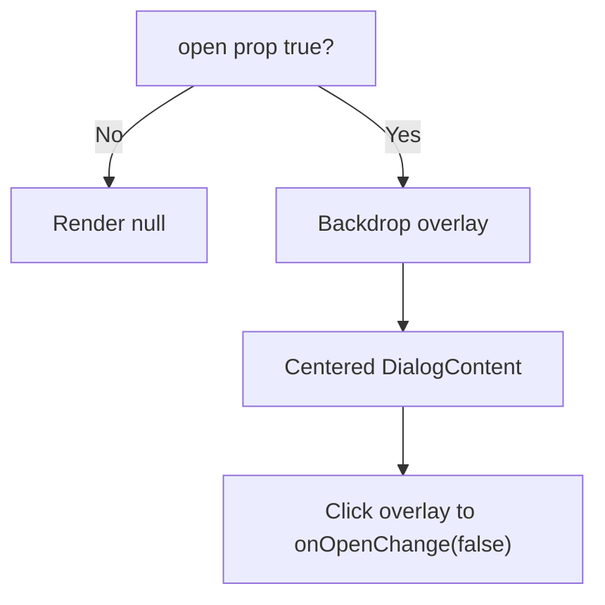

**Diagram sources**
- [Dialog.tsx:10-18](file://frontend/src/components/ui/Dialog.tsx#L10-L18)
- [Dialog.tsx:20-24](file://frontend/src/components/ui/Dialog.tsx#L20-L24)

**Section sources**
- [Dialog.tsx:4-8](file://frontend/src/components/ui/Dialog.tsx#L4-L8)
- [Dialog.tsx:10-18](file://frontend/src/components/ui/Dialog.tsx#L10-L18)
- [Dialog.tsx:20-24](file://frontend/src/components/ui/Dialog.tsx#L20-L24)
- [Dialog.tsx:26-32](file://frontend/src/components/ui/Dialog.tsx#L26-L32)
- [Dialog.tsx:34-40](file://frontend/src/components/ui/Dialog.tsx#L34-L40)

### StarRating
- Props
  - rating: number
  - onRatingChange?: (rating: number) => void
  - readOnly: boolean
  - size: number | "sm" | "md" | "lg"
  - showLabel: boolean
  - interactive: boolean (backward compatibility)
- Defaults
  - readOnly=false, size='md', showLabel=false, interactive=false
- Behavior
  - Hover state previews rating; click invokes onRatingChange when interactive; aria-label per star

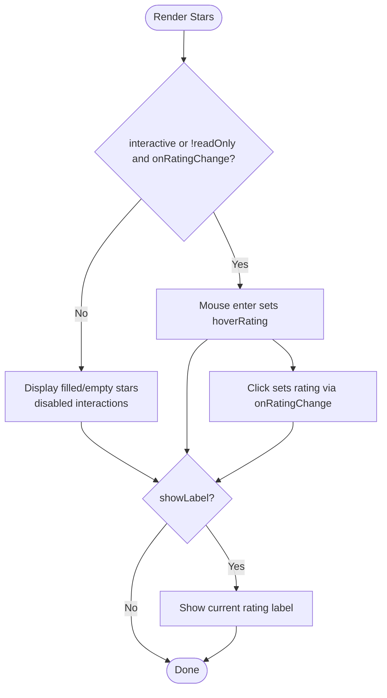

**Diagram sources**
- [StarRating.tsx:15-75](file://frontend/src/components/ui/StarRating.tsx#L15-L75)

**Section sources**
- [StarRating.tsx:5-13](file://frontend/src/components/ui/StarRating.tsx#L5-L13)
- [StarRating.tsx:15-75](file://frontend/src/components/ui/StarRating.tsx#L15-L75)

### Formula
- Props
  - latex: string
  - className: string
  - block: boolean
  - interactive: boolean
- Defaults
  - block=false, interactive=true
- Behavior
  - Renders LaTeX via KaTeX; logs interactions and fetches token breakdown metadata; shows popover with token details and navigation

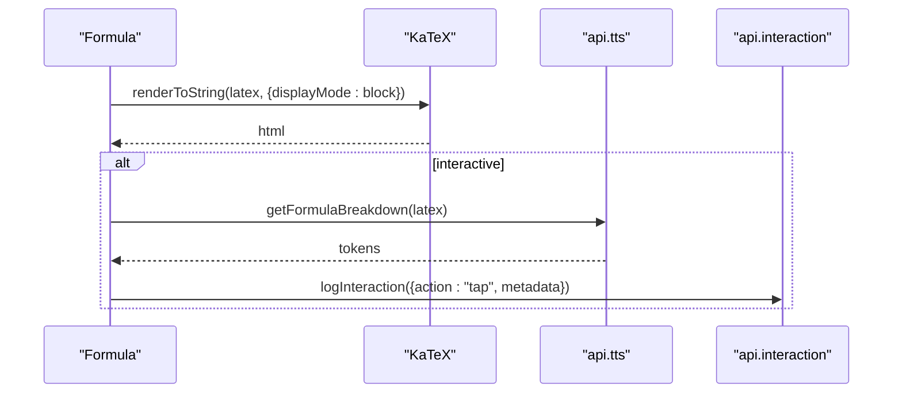

**Diagram sources**
- [Formula.tsx:17-67](file://frontend/src/components/ui/Formula.tsx#L17-L67)
- [Formula.tsx:79-112](file://frontend/src/components/ui/Formula.tsx#L79-L112)

**Section sources**
- [Formula.tsx:10-15](file://frontend/src/components/ui/Formula.tsx#L10-L15)
- [Formula.tsx:17-67](file://frontend/src/components/ui/Formula.tsx#L17-L67)
- [Formula.tsx:79-112](file://frontend/src/components/ui/Formula.tsx#L79-L112)

## Dependency Analysis
- Internal dependencies
  - Tabs uses React context to coordinate state across list/trigger/content.
  - Dialog composes multiple subcomponents; DialogTrigger wraps a child element.
  - StarRating depends on lucide-react’s Star icon.
  - Formula depends on window.katex and internal API clients.
- External dependencies
  - Tailwind CSS for utility classes.
  - Lucide icons for StarRating.
  - KaTeX for Formula rendering.

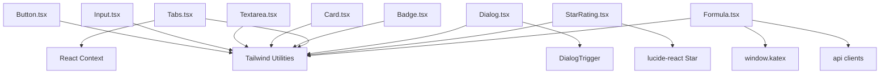

**Diagram sources**
- [Tabs.tsx:2-9](file://frontend/src/components/ui/Tabs.tsx#L2-L9)
- [Dialog.tsx:34-40](file://frontend/src/components/ui/Dialog.tsx#L34-L40)
- [StarRating.tsx](file://frontend/src/components/ui/StarRating.tsx#L3)
- [Formula.tsx](file://frontend/src/components/ui/Formula.tsx#L2)
- [Button.tsx:19-33](file://frontend/src/components/ui/Button.tsx#L19-L33)
- [Input.tsx:6-13](file://frontend/src/components/ui/Input.tsx#L6-L13)
- [Textarea.tsx:6-13](file://frontend/src/components/ui/Textarea.tsx#L6-L13)
- [Card.tsx](file://frontend/src/components/ui/Card.tsx#L10)
- [Badge.tsx:15-24](file://frontend/src/components/ui/Badge.tsx#L15-L24)

**Section sources**
- [Tabs.tsx:2-9](file://frontend/src/components/ui/Tabs.tsx#L2-L9)
- [Dialog.tsx:34-40](file://frontend/src/components/ui/Dialog.tsx#L34-L40)
- [StarRating.tsx](file://frontend/src/components/ui/StarRating.tsx#L3)
- [Formula.tsx](file://frontend/src/components/ui/Formula.tsx#L2)
- [Button.tsx:19-33](file://frontend/src/components/ui/Button.tsx#L19-L33)
- [Input.tsx:6-13](file://frontend/src/components/ui/Input.tsx#L6-L13)
- [Textarea.tsx:6-13](file://frontend/src/components/ui/Textarea.tsx#L6-L13)
- [Card.tsx](file://frontend/src/components/ui/Card.tsx#L10)
- [Badge.tsx:15-24](file://frontend/src/components/ui/Badge.tsx#L15-L24)

## Performance Considerations
- Button
  - Variant/sizing maps are constant-time lookups; minimal reflow.
- Input/Textarea
  - No heavy computations; rely on native input behavior.
- Card
  - Stateless container; composition adds negligible overhead.
- Badge
  - Simple variant mapping; avoid excessive re-renders by memoizing variant choices externally if needed.
- Tabs
  - Context updates are O(1); keep trigger/content lightweight.
- Dialog
  - Rendering hidden content when closed is avoided by returning null; ensure heavy content is lazy-loaded inside DialogContent.
- StarRating
  - Hover state uses useState; keep star count small (constant 5).
- Formula
  - KaTeX rendering occurs on change; debounce or memoize latex prop if frequently updated.
  - Interaction logging is async; errors are caught and logged.

[No sources needed since this section provides general guidance]

## Troubleshooting Guide
- Button
  - If disabled state does not work, ensure isLoading is not overriding disabled prop unintentionally.
- Input/Textarea
  - If focus ring is missing, verify Tailwind utilities are included and className concatenation is correct.
- Card
  - If paddings are incorrect, confirm subcomponents are used as intended.
- Badge
  - If variant colors appear wrong, check Tailwind color palette availability.
- Tabs
  - If TabsTrigger throws an error about being outside Tabs, ensure it is rendered within Tabs.
  - If content does not show, ensure value matches TabsTrigger’s value.
- Dialog
  - If clicking outside does not close, verify onOpenChange is passed and invoked.
  - If DialogTrigger does not forward clicks, ensure a single child element is passed.
- StarRating
  - If interactions do not fire, ensure onRatingChange is provided and readOnly is false.
  - If aria-label is missing, confirm screen reader support is available.
- Formula
  - If LaTeX does not render, ensure KaTeX is loaded globally and latex prop is valid.
  - If token breakdown fails, inspect network errors and API client configuration.

**Section sources**
- [Tabs.tsx:33-35](file://frontend/src/components/ui/Tabs.tsx#L33-L35)
- [Tabs.tsx:49-51](file://frontend/src/components/ui/Tabs.tsx#L49-L51)
- [Dialog.tsx:34-40](file://frontend/src/components/ui/Dialog.tsx#L34-L40)
- [StarRating.tsx](file://frontend/src/components/ui/StarRating.tsx#L26)
- [Formula.tsx:43-53](file://frontend/src/components/ui/Formula.tsx#L43-L53)
- [Formula.tsx:57-66](file://frontend/src/components/ui/Formula.tsx#L57-L66)

## Conclusion
The base UI components provide a consistent, extensible foundation using Tailwind utilities and React patterns. They emphasize accessibility, composability, and maintainable styling through variants and sizes. Integrate them by composing subcomponents where applicable, passing className for overrides, and leveraging context-based components like Tabs for structured interactions.

[No sources needed since this section summarizes without analyzing specific files]

## Appendices

### Tailwind Integration and Design Tokens
- Tailwind configuration scans the project for class usage.
- Global animations and glass utilities are defined centrally for reuse across components.

**Section sources**
- [tailwind.config.js:1-12](file://frontend/tailwind.config.js#L1-L12)
- [index.css:1-88](file://frontend/src/index.css#L1-L88)

### Component Composition and Extension Patterns
- Prefer composition over duplication: use CardHeader/CardContent/CardTitle; nest TabsTrigger within TabsList; place DialogTrigger around actionable elements.
- Extend via className: pass additional Tailwind classes to override defaults.
- For variants/sizes, add entries to the component’s variant/sizing map and export a new named variant/sized class for reuse.

[No sources needed since this section provides general guidance]