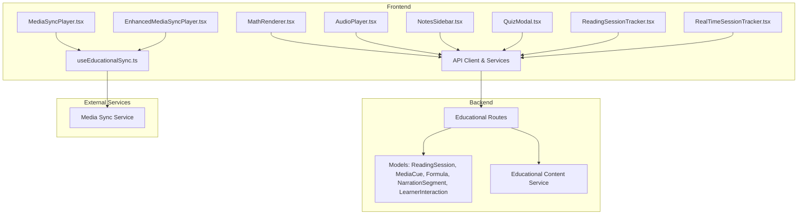
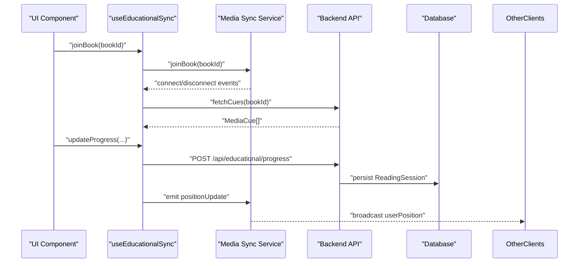
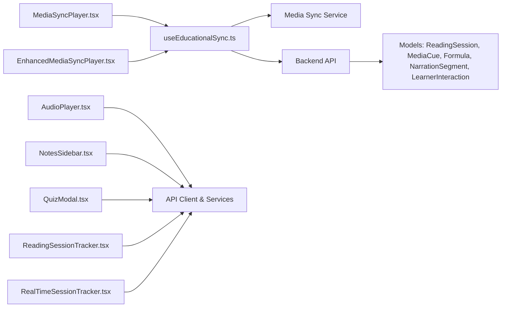

# Educational Components

<cite>
**Referenced Files in This Document**
- [MathRenderer.tsx](file://frontend/src/components/MathRenderer.tsx)
- [AudioPlayer.tsx](file://frontend/src/components/AudioPlayer.tsx)
- [MediaSyncPlayer.tsx](file://frontend/src/components/MediaSyncPlayer.tsx)
- [EnhancedMediaSyncPlayer.tsx](file://frontend/src/components/EnhancedMediaSyncPlayer.tsx)
- [NotesSidebar.tsx](file://frontend/src/components/NotesSidebar.tsx)
- [QuizModal.tsx](file://frontend/src/components/QuizModal.tsx)
- [ReadingSessionTracker.tsx](file://frontend/src/components/ReadingSessionTracker.tsx)
- [RealTimeSessionTracker.tsx](file://frontend/src/components/RealTimeSessionTracker.tsx)
- [useEducationalSync.ts](file://frontend/src/hooks/useEducationalSync.ts)
- [client.ts](file://frontend/src/api/client.ts)
- [index.ts](file://frontend/src/api/index.ts)
- [bookService.ts](file://frontend/src/api/services/bookService.ts)
- [learnerService.ts](file://frontend/src/api/services/learnerService.ts)
- [educational.js](file://backend/routes/educational.js)
- [educationalContentService.js](file://backend/services/educationalContentService.js)
- [ReadingSession.js](file://backend/models/ReadingSession.js)
- [MediaCue.js](file://backend/models/MediaCue.js)
- [Formula.js](file://backend/models/Formula.js)
- [NarrationSegment.js](file://backend/models/NarrationSegment.js)
- [LearnerInteraction.js](file://backend/models/LearnerInteraction.js)
- [media-sync-service server.js](file://services/media-sync-service/src/server.js)
- [media-sync index.ts](file://services/media-sync/src/index.ts)
- [media-sync-service package.json](file://services/media-sync-service/package.json)
- [media-sync package.json](file://services/media-sync/package.json)
</cite>

## Table of Contents
1. [Introduction](#introduction)
2. [Project Structure](#project-structure)
3. [Core Components](#core-components)
4. [Architecture Overview](#architecture-overview)
5. [Detailed Component Analysis](#detailed-component-analysis)
6. [Dependency Analysis](#dependency-analysis)
7. [Performance Considerations](#performance-considerations)
8. [Troubleshooting Guide](#troubleshooting-guide)
9. [Conclusion](#conclusion)

## Introduction
This document provides comprehensive documentation for educational-specific UI components designed to support immersive learning experiences. It covers:
- MathRenderer for LaTeX formula rendering
- AudioPlayer for basic audiobook playback
- MediaSyncPlayer for synchronized audio-visual content with cues
- EnhancedMediaSyncPlayer for advanced multimedia experiences with adaptive pacing and PayGO billing
- NotesSidebar for annotation management
- QuizModal for assessment delivery
- Session tracking components for reading and listening sessions

It explains integration with educational workflows, synchronization mechanisms, and accessibility features for learners. Examples illustrate usage in reading sessions, quiz administration, and note-taking scenarios, along with backend service relationships and data persistence.

## Project Structure
The educational UI components reside in the frontend under src/components and integrate with:
- Hooks for real-time synchronization (useEducationalSync)
- API clients and services for backend communication
- Backend routes and models supporting educational content, cues, sessions, and learner interactions

**Diagram sources**
- [MathRenderer.tsx:1-33](file://frontend/src/components/MathRenderer.tsx#L1-L33)
- [AudioPlayer.tsx:1-288](file://frontend/src/components/AudioPlayer.tsx#L1-L288)
- [MediaSyncPlayer.tsx:1-310](file://frontend/src/components/MediaSyncPlayer.tsx#L1-L310)
- [EnhancedMediaSyncPlayer.tsx:1-577](file://frontend/src/components/EnhancedMediaSyncPlayer.tsx#L1-L577)
- [NotesSidebar.tsx:1-159](file://frontend/src/components/NotesSidebar.tsx#L1-L159)
- [QuizModal.tsx:1-193](file://frontend/src/components/QuizModal.tsx#L1-L193)
- [ReadingSessionTracker.tsx:1-163](file://frontend/src/components/ReadingSessionTracker.tsx#L1-L163)
- [RealTimeSessionTracker.tsx:1-225](file://frontend/src/components/RealTimeSessionTracker.tsx#L1-L225)
- [useEducationalSync.ts:1-246](file://frontend/src/hooks/useEducationalSync.ts#L1-L246)
- [educational.js](file://backend/routes/educational.js)
- [ReadingSession.js](file://backend/models/ReadingSession.js)
- [MediaCue.js](file://backend/models/MediaCue.js)
- [Formula.js](file://backend/models/Formula.js)
- [NarrationSegment.js](file://backend/models/NarrationSegment.js)
- [LearnerInteraction.js](file://backend/models/LearnerInteraction.js)

**Section sources**
- [MathRenderer.tsx:1-33](file://frontend/src/components/MathRenderer.tsx#L1-L33)
- [AudioPlayer.tsx:1-288](file://frontend/src/components/AudioPlayer.tsx#L1-L288)
- [MediaSyncPlayer.tsx:1-310](file://frontend/src/components/MediaSyncPlayer.tsx#L1-L310)
- [EnhancedMediaSyncPlayer.tsx:1-577](file://frontend/src/components/EnhancedMediaSyncPlayer.tsx#L1-L577)
- [NotesSidebar.tsx:1-159](file://frontend/src/components/NotesSidebar.tsx#L1-L159)
- [QuizModal.tsx:1-193](file://frontend/src/components/QuizModal.tsx#L1-L193)
- [ReadingSessionTracker.tsx:1-163](file://frontend/src/components/ReadingSessionTracker.tsx#L1-L163)
- [RealTimeSessionTracker.tsx:1-225](file://frontend/src/components/RealTimeSessionTracker.tsx#L1-L225)
- [useEducationalSync.ts:1-246](file://frontend/src/hooks/useEducationalSync.ts#L1-L246)

## Core Components
This section documents the primary educational UI components and their roles.

- MathRenderer: Renders LaTeX formulas using KaTeX for mathematical notation in educational content.
- AudioPlayer: Provides chapter-based audiobook playback with progress tracking and cost calculation.
- MediaSyncPlayer: Synchronizes audio playback with visual/formula cues and collaborative progress updates.
- EnhancedMediaSyncPlayer: Advanced media player with adaptive pacing, PayGO billing integration, and real-time session management.
- NotesSidebar: Allows learners to create, manage, and organize page-specific study notes.
- QuizModal: Presents interactive assessments with immediate feedback and scoring.
- ReadingSessionTracker and RealTimeSessionTracker: Monitor and bill reading/listening sessions with pause/resume capabilities.

**Section sources**
- [MathRenderer.tsx:13-31](file://frontend/src/components/MathRenderer.tsx#L13-L31)
- [AudioPlayer.tsx:12-287](file://frontend/src/components/AudioPlayer.tsx#L12-L287)
- [MediaSyncPlayer.tsx:21-309](file://frontend/src/components/MediaSyncPlayer.tsx#L21-L309)
- [EnhancedMediaSyncPlayer.tsx:28-576](file://frontend/src/components/EnhancedMediaSyncPlayer.tsx#L28-L576)
- [NotesSidebar.tsx:23-158](file://frontend/src/components/NotesSidebar.tsx#L23-L158)
- [QuizModal.tsx:21-192](file://frontend/src/components/QuizModal.tsx#L21-L192)
- [ReadingSessionTracker.tsx:25-159](file://frontend/src/components/ReadingSessionTracker.tsx#L25-L159)
- [RealTimeSessionTracker.tsx:31-221](file://frontend/src/components/RealTimeSessionTracker.tsx#L31-L221)

## Architecture Overview
The educational components integrate with real-time synchronization via a dedicated media sync service and communicate with backend routes for content, cues, and learner progress. PayGO billing is integrated for metered consumption.

**Diagram sources**
- [useEducationalSync.ts:36-152](file://frontend/src/hooks/useEducationalSync.ts#L36-L152)
- [useEducationalSync.ts:154-207](file://frontend/src/hooks/useEducationalSync.ts#L154-L207)
- [educational.js](file://backend/routes/educational.js)

## Detailed Component Analysis

### MathRenderer
Renders LaTeX formulas using KaTeX. It ensures graceful fallback if rendering fails and supports display mode for block-level math.

Key behaviors:
- Uses a DOM container to render LaTeX
- Handles rendering errors by falling back to plain text
- Accepts a formula prop and re-renders on change

Accessibility and UX:
- Provides semantic text output when KaTeX is unavailable
- Suitable for screen readers when content is announced

**Section sources**
- [MathRenderer.tsx:13-31](file://frontend/src/components/MathRenderer.tsx#L13-L31)

### AudioPlayer
Provides audiobook playback with chapter navigation, progress tracking, and cost estimation for non-subscribers.

Key behaviors:
- Manages playback state (playing/paused), chapter navigation, and seek controls
- Tracks listening time and calculates session cost
- Integrates with UsageTracker for session lifecycle

Integration points:
- Uses Book and Chapter types
- Emits session end events for UI actions

**Section sources**
- [AudioPlayer.tsx:12-287](file://frontend/src/components/AudioPlayer.tsx#L12-L287)

### MediaSyncPlayer
Synchronizes audio playback with educational cues (visual, formula, step, highlight) and collaboratively tracks progress.

Key behaviors:
- Maintains active cues based on current timestamp
- Triggers cue events and updates progress periodically
- Displays current cue and active cues list
- Manages connection status and room joining

Real-time collaboration:
- Uses useEducationalSync hook for socket-based cue triggers and progress broadcasting

**Section sources**
- [MediaSyncPlayer.tsx:21-309](file://frontend/src/components/MediaSyncPlayer.tsx#L21-L309)
- [useEducationalSync.ts:36-152](file://frontend/src/hooks/useEducationalSync.ts#L36-L152)

### EnhancedMediaSyncPlayer
Advanced media player with adaptive pacing, PayGO billing, and enhanced UI for complex educational content.

Key behaviors:
- Adaptive pacing adjusts playback speed based on cue complexity metadata
- Starts and manages PayGO sessions, heartbeat updates, and session termination
- Displays current cue with voice role indicators and complexity visualization
- Shows real-time cost estimation and wallet balance

User experience enhancements:
- Adaptive suggestion prompts for pausing behavior
- Visual indicators for connection and PayGO status
- Complexity meter for cognitive load awareness

**Section sources**
- [EnhancedMediaSyncPlayer.tsx:28-576](file://frontend/src/components/EnhancedMediaSyncPlayer.tsx#L28-L576)
- [useEducationalSync.ts:36-152](file://frontend/src/hooks/useEducationalSync.ts#L36-L152)

### NotesSidebar
Enables learners to create, categorize, and manage page-specific notes with color coding and optional text highlighting.

Key behaviors:
- Fetches existing notes for a book
- Creates new notes bound to a specific page
- Deletes notes with user feedback
- Displays saved notes with creation date and highlight context

Integration points:
- Uses learner API service for CRUD operations
- Toast notifications for user feedback

**Section sources**
- [NotesSidebar.tsx:23-158](file://frontend/src/components/NotesSidebar.tsx#L23-L158)

### QuizModal
Delivers interactive assessments with immediate feedback, score tracking, and results presentation.

Key behaviors:
- Steps through questions with option selection
- Validates answers and accumulates scores
- Shows explanations after submission
- Presents final results with percentage and retry option

Accessibility and UX:
- Clear visual feedback for correct/incorrect answers
- Progress indicator and explanatory text

**Section sources**
- [QuizModal.tsx:21-192](file://frontend/src/components/QuizModal.tsx#L21-L192)

### ReadingSessionTracker
Monitors reading/listening sessions with pause/resume and balance-aware termination.

Key behaviors:
- Tracks elapsed minutes and calculates charges per book level
- Pauses and resumes session timers
- Ends session early or terminates on insufficient balance
- Provides warnings and estimated remaining time

**Section sources**
- [ReadingSessionTracker.tsx:25-159](file://frontend/src/components/ReadingSessionTracker.tsx#L25-L159)

### RealTimeSessionTracker
Real-time billing tracker with transaction history and dynamic warnings.

Key behaviors:
- Processes minute-by-minute charges with pause/resume
- Maintains transaction history and session summary
- Provides warnings at configurable thresholds
- Supports termination and finalization

**Section sources**
- [RealTimeSessionTracker.tsx:31-221](file://frontend/src/components/RealTimeSessionTracker.tsx#L31-L221)

## Dependency Analysis
The educational components depend on:
- useEducationalSync for real-time synchronization and progress updates
- API services for backend communication
- Backend routes and models for content, cues, sessions, and learner interactions
- External media sync service for collaborative features

**Diagram sources**
- [useEducationalSync.ts:36-207](file://frontend/src/hooks/useEducationalSync.ts#L36-L207)
- [AudioPlayer.tsx:26-33](file://frontend/src/components/AudioPlayer.tsx#L26-L33)
- [MediaSyncPlayer.tsx:37-46](file://frontend/src/components/MediaSyncPlayer.tsx#L37-L46)
- [EnhancedMediaSyncPlayer.tsx:54-72](file://frontend/src/components/EnhancedMediaSyncPlayer.tsx#L54-L72)
- [NotesSidebar.tsx:4-6](file://frontend/src/components/NotesSidebar.tsx#L4-L6)
- [QuizModal.tsx:1-5](file://frontend/src/components/QuizModal.tsx#L1-L5)
- [ReadingSessionTracker.tsx:7-13](file://frontend/src/components/ReadingSessionTracker.tsx#L7-L13)
- [RealTimeSessionTracker.tsx:7-18](file://frontend/src/components/RealTimeSessionTracker.tsx#L7-L18)

**Section sources**
- [useEducationalSync.ts:36-207](file://frontend/src/hooks/useEducationalSync.ts#L36-L207)
- [AudioPlayer.tsx:26-33](file://frontend/src/components/AudioPlayer.tsx#L26-L33)
- [MediaSyncPlayer.tsx:37-46](file://frontend/src/components/MediaSyncPlayer.tsx#L37-L46)
- [EnhancedMediaSyncPlayer.tsx:54-72](file://frontend/src/components/EnhancedMediaSyncPlayer.tsx#L54-L72)
- [NotesSidebar.tsx:4-6](file://frontend/src/components/NotesSidebar.tsx#L4-L6)
- [QuizModal.tsx:1-5](file://frontend/src/components/QuizModal.tsx#L1-L5)
- [ReadingSessionTracker.tsx:7-13](file://frontend/src/components/ReadingSessionTracker.tsx#L7-L13)
- [RealTimeSessionTracker.tsx:7-18](file://frontend/src/components/RealTimeSessionTracker.tsx#L7-L18)

## Performance Considerations
- MediaSyncPlayer and EnhancedMediaSyncPlayer:
  - Debounce progress updates to reduce network traffic
  - Use tolerance windows for cue matching to avoid frequent re-renders
  - Limit active cues list updates to visible range
- NotesSidebar:
  - Paginate or lazy-load notes for large datasets
  - Debounce save operations to minimize API calls
- QuizModal:
  - Preload assets and cache question data for smooth transitions
- Session trackers:
  - Use efficient intervals and clear timers on unmount
  - Batch balance checks to avoid excessive network requests

## Troubleshooting Guide
Common issues and resolutions:
- MathRenderer rendering failures:
  - Ensure KaTeX is loaded globally before rendering
  - Verify formula syntax and fallback behavior logs errors
- Media synchronization:
  - Confirm socket connection status and token validity
  - Check backend route availability and model associations
- PayGO session management:
  - Validate wallet state and sufficient balance before starting sessions
  - Monitor heartbeat intervals and session termination conditions
- Notes and quizzes:
  - Confirm API endpoints and authentication tokens
  - Validate data structures for notes and quiz questions

**Section sources**
- [MathRenderer.tsx:16-27](file://frontend/src/components/MathRenderer.tsx#L16-L27)
- [useEducationalSync.ts:54-86](file://frontend/src/hooks/useEducationalSync.ts#L54-L86)
- [EnhancedMediaSyncPlayer.tsx:209-231](file://frontend/src/components/EnhancedMediaSyncPlayer.tsx#L209-L231)
- [NotesSidebar.tsx:40-77](file://frontend/src/components/NotesSidebar.tsx#L40-L77)
- [QuizModal.tsx:36-52](file://frontend/src/components/QuizModal.tsx#L36-L52)

## Conclusion
These educational components form a cohesive ecosystem for delivering synchronized, adaptive, and accessible learning experiences. They integrate real-time collaboration, precise cue synchronization, and flexible session management while maintaining performance and usability. The documented relationships with backend services and data models enable scalable deployment and future enhancements.